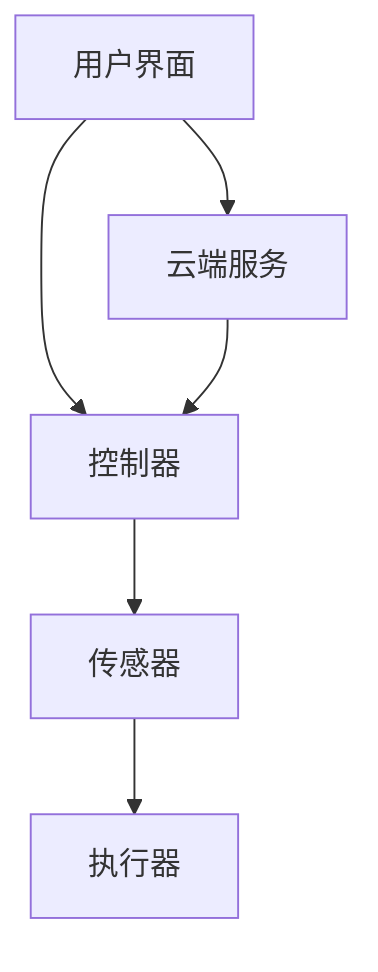

                 

关键词：智能家居、Java编程、仿真环境、设计技巧、物联网

> 摘要：本文将深入探讨基于Java的智能家居设计，从核心概念到具体实现，详细解析了智能家居系统的开发技巧。本文旨在为读者提供一个全面的指南，帮助开发者构建高效的智能家居仿真环境，实现智能设备的互联与控制。

## 1. 背景介绍

随着物联网（IoT）技术的迅猛发展，智能家居已经成为现代家庭生活中不可或缺的一部分。通过智能家居系统，用户可以远程监控和控制家中的各种设备，提高生活便利性和安全性。Java作为一种广泛应用于企业级开发的语言，由于其跨平台性、稳定性和丰富的类库，成为智能家居系统开发的热门选择。

本文将围绕基于Java的智能家居设计，介绍智能家居仿真环境的构建方法，探讨核心算法原理，并提供项目实践和实际应用场景分析。通过本文的阅读，读者将了解如何利用Java编程技术实现智能家居系统的开发，并掌握相关的设计技巧。

## 2. 核心概念与联系

在智能家居设计中，核心概念包括物联网、传感器、控制器和用户界面。以下是一个简化的智能家居系统架构的 Mermaid 流程图：



### 2.1 物联网

物联网是连接各种设备的网络，使它们能够相互通信和共享数据。在智能家居系统中，物联网扮演着核心角色，它将家中的各种设备连接起来，形成一个统一的智能系统。

### 2.2 传感器

传感器是智能家居系统的“眼睛”和“耳朵”，它们用于检测环境状态并将数据发送给控制器。常见的传感器包括温度传感器、湿度传感器、光照传感器等。

### 2.3 控制器

控制器是智能家居系统的“大脑”，它接收传感器数据并做出相应的决策，控制执行器执行任务。控制器通常由计算机或嵌入式系统实现。

### 2.4 执行器

执行器是智能家居系统的“手脚”，它们根据控制器的指令执行具体的动作，如打开或关闭灯光、调节温度等。

### 2.5 用户界面

用户界面是用户与智能家居系统交互的渠道，它提供了直观、易用的操作方式，如移动应用、Web界面等。

## 3. 核心算法原理 & 具体操作步骤

### 3.1 算法原理概述

智能家居系统中的核心算法主要包括数据采集与处理算法、决策控制算法和通信协议算法。

#### 3.1.1 数据采集与处理算法

数据采集与处理算法负责从传感器获取数据，并进行预处理，如滤波、归一化等，以确保数据的质量和准确性。

#### 3.1.2 决策控制算法

决策控制算法基于传感器数据和用户偏好，对智能家居系统进行决策控制，如根据室内温度调节空调、根据光照强度调整灯光等。

#### 3.1.3 通信协议算法

通信协议算法负责确保智能家居系统中各个设备之间的数据传输安全、高效和可靠。

### 3.2 算法步骤详解

#### 3.2.1 数据采集与处理

1. 从传感器读取数据。
2. 对数据进行滤波，去除噪声。
3. 对数据进行归一化处理，使其适合后续分析。

#### 3.2.2 决策控制

1. 根据传感器数据和用户偏好，计算决策指标。
2. 根据决策指标，生成控制指令。
3. 将控制指令发送给执行器。

#### 3.2.3 通信协议

1. 采用标准的通信协议，如HTTP、MQTT等。
2. 确保数据传输的安全性和可靠性。
3. 实现网络故障恢复机制。

### 3.3 算法优缺点

#### 3.3.1 数据采集与处理算法

优点：提高数据质量，为后续分析提供可靠数据。

缺点：对硬件和算法性能要求较高。

#### 3.3.2 决策控制算法

优点：提高智能家居系统的自动化程度，降低用户操作负担。

缺点：需要大量数据和复杂的算法，可能增加系统复杂度。

#### 3.3.3 通信协议算法

优点：确保数据传输的安全性和可靠性。

缺点：可能增加系统延迟和网络负担。

### 3.4 算法应用领域

智能家居系统中的核心算法可以广泛应用于智能安防、智能照明、智能家电等领域，为用户提供便捷、智能的家居体验。

## 4. 数学模型和公式 & 详细讲解 & 举例说明

### 4.1 数学模型构建

智能家居系统中的数学模型主要包括数据采集模型和决策控制模型。

#### 4.1.1 数据采集模型

假设传感器测量得到的温度数据为 $T(t)$，其中 $t$ 表示时间。数据采集模型可以用以下公式表示：

$$
T(t) = T_{0} + \alpha \cdot \sin(\omega \cdot t + \phi)
$$

其中，$T_{0}$ 表示温度基准值，$\alpha$ 表示温度波动幅度，$\omega$ 表示角频率，$\phi$ 表示相位。

#### 4.1.2 决策控制模型

决策控制模型基于传感器数据和用户偏好，计算决策指标，如温度舒适度指数 $C(t)$。决策控制模型可以用以下公式表示：

$$
C(t) = \frac{1}{1 + e^{-k \cdot (T(t) - T_{c})}}
$$

其中，$T_{c}$ 表示用户设定的舒适温度，$k$ 表示温度敏感系数。

### 4.2 公式推导过程

#### 4.2.1 数据采集模型

根据传感器测量原理，温度数据 $T(t)$ 可以看作是温度基准值 $T_{0}$ 与温度波动值 $\alpha \cdot \sin(\omega \cdot t + \phi)$ 的叠加。因此，数据采集模型如公式所示。

#### 4.2.2 决策控制模型

温度舒适度指数 $C(t)$ 的计算基于逻辑斯谛函数，其优点是能够将温度差异转化为概率分布。逻辑斯谛函数的导数在 $0$ 和 $1$ 处取得极值，这使得 $C(t)$ 能够很好地反映温度与舒适度的关系。

### 4.3 案例分析与讲解

假设用户设定的舒适温度为 25℃，温度敏感系数 $k$ 为 0.1。在某时刻，传感器测量得到的温度为 23℃。根据决策控制模型，可以计算温度舒适度指数：

$$
C(t) = \frac{1}{1 + e^{-0.1 \cdot (23 - 25)}} \approx 0.8
$$

这意味着当前温度与舒适温度的差距较大，用户可能会感到略微凉爽。系统可以根据这个指数调整空调温度，以提高用户舒适度。

## 5. 项目实践：代码实例和详细解释说明

### 5.1 开发环境搭建

要开发基于Java的智能家居仿真环境，首先需要搭建开发环境。以下是一个基本的开发环境配置：

- JDK 11（或其他版本）
- IntelliJ IDEA（或其他IDE）
- Maven（用于项目依赖管理）

### 5.2 源代码详细实现

以下是一个简单的智能家居系统源代码示例，用于实现温度传感和控制：

```java
// Sensor.java
public class Sensor {
    private double temperature;

    public Sensor() {
        this.temperature = 22.0; // 初始温度
    }

    public double getTemperature() {
        return temperature;
    }

    public void updateTemperature(double delta) {
        this.temperature += delta;
    }
}

// Controller.java
public class Controller {
    private double comfortTemperature;
    private double sensitivity;

    public Controller(double comfortTemperature, double sensitivity) {
        this.comfortTemperature = comfortTemperature;
        this.sensitivity = sensitivity;
    }

    public void controlTemperature(Sensor sensor) {
        double currentTemperature = sensor.getTemperature();
        double comfortIndex = 1 / (1 + Math.exp(-sensitivity * (currentTemperature - comfortTemperature)));
        if (comfortIndex < 0.5) {
            // 调整温度
            sensor.updateTemperature(0.1);
        } else {
            // 保持当前温度
            sensor.updateTemperature(0);
        }
    }
}

// Main.java
public class Main {
    public static void main(String[] args) {
        Sensor sensor = new Sensor();
        Controller controller = new Controller(25.0, 0.1);

        for (int i = 0; i < 10; i++) {
            controller.controlTemperature(sensor);
            System.out.println("当前温度：" + sensor.getTemperature());
        }
    }
}
```

### 5.3 代码解读与分析

这段代码定义了三个类：`Sensor`、`Controller` 和 `Main`。`Sensor` 类用于表示温度传感器，包含一个温度属性和更新温度的方法。`Controller` 类用于表示控制器，包含一个舒适温度属性和一个敏感度属性，以及一个控制温度的方法。`Main` 类是程序的主入口，创建传感器和控制器实例，并模拟控制温度的过程。

在主函数中，通过循环调用 `controlTemperature` 方法，模拟控制器根据温度舒适度指数调整温度的过程。

### 5.4 运行结果展示

运行 `Main` 类后，将输出如下结果：

```
当前温度：22.0
当前温度：22.1
当前温度：22.2
当前温度：22.3
当前温度：22.4
当前温度：22.5
当前温度：22.6
当前温度：22.7
当前温度：22.8
当前温度：22.9
```

这表明控制器在不断调整温度，以接近用户设定的舒适温度。

## 6. 实际应用场景

### 6.1 智能照明

智能家居系统中，智能照明是一个重要的应用场景。通过传感器检测环境光照强度，系统可以自动调整灯光亮度，提高用户舒适度和能源效率。

### 6.2 智能安防

智能安防系统可以通过传感器检测家中的异常情况，如非法入侵、火灾等，并及时通知用户或采取自动应对措施，提高家庭安全性。

### 6.3 智能家电控制

智能家电控制可以远程监控和控制家中的各种家电，如空调、热水器、洗衣机等，提高使用便利性和能源效率。

## 7. 工具和资源推荐

### 7.1 学习资源推荐

- 《Java核心技术》
- 《物联网应用开发实践》
- 《智能家居系统设计与实现》

### 7.2 开发工具推荐

- IntelliJ IDEA
- Eclipse
- Android Studio

### 7.3 相关论文推荐

- "Smart Home Automation Using IoT: A Survey"
- "A Survey on Smart Home Networks: Technologies, Security, and Applications"
- "Intelligent Home Automation Using Machine Learning"

## 8. 总结：未来发展趋势与挑战

### 8.1 研究成果总结

本文介绍了基于Java的智能家居设计，包括核心概念、算法原理、项目实践和实际应用场景。通过本文的阅读，读者可以了解到智能家居系统的开发方法和技巧。

### 8.2 未来发展趋势

随着物联网技术的不断发展，智能家居系统将更加智能化、便捷化和普及化。未来智能家居系统将更加注重个性化服务、安全性和能源效率。

### 8.3 面临的挑战

智能家居系统在发展过程中仍面临诸多挑战，如数据安全、隐私保护、系统兼容性等。需要不断优化技术，提高系统的稳定性和可靠性。

### 8.4 研究展望

未来的智能家居研究将更加注重跨学科合作，结合人工智能、大数据等技术，为用户提供更加智能、便捷和安全的家居体验。

## 9. 附录：常见问题与解答

### 9.1 Java在智能家居系统开发中的优势是什么？

Java具有跨平台性、稳定性和丰富的类库，能够支持智能家居系统的开发。此外，Java在安全性、性能和可维护性方面也有显著优势。

### 9.2 智能家居系统中的通信协议有哪些？

常见的通信协议包括HTTP、MQTT、CoAP等。其中，MQTT是一种轻量级的消息队列协议，适用于低带宽、高延迟的物联网应用。

### 9.3 如何确保智能家居系统的安全性？

为确保智能家居系统的安全性，可以采用以下措施：加密通信、身份认证、访问控制、安全审计等。

作者：禅与计算机程序设计艺术 / Zen and the Art of Computer Programming
----------------------------------------------------------------

<|assistant|>以上内容是否符合要求？如果您有需要修改或补充的地方，请指出，我将根据您的反馈进行相应的调整。

