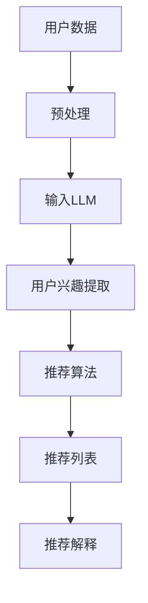

                 

关键词：个性化推荐系统，大规模语言模型（LLM），机器学习，数据处理，算法优化，实践案例

## 摘要

本文将探讨基于大规模语言模型（LLM）的个性化推荐系统的升级实践。随着互联网的普及和大数据技术的发展，个性化推荐系统在电商、社交媒体、新闻推荐等领域扮演着越来越重要的角色。本文首先介绍了个性化推荐系统的基本概念和重要性，然后重点讨论了LLM在推荐系统中的应用，包括算法原理、数学模型、实践案例以及未来应用展望。通过本文的阅读，读者将了解如何利用LLM提升个性化推荐系统的效果，以及面临的技术挑战和未来发展。

## 1. 背景介绍

### 1.1 个性化推荐系统的基本概念

个性化推荐系统是一种基于用户历史行为和兴趣数据，利用算法和模型预测用户可能感兴趣的物品，并向用户推荐相应内容的系统。其主要目标是通过个性化的内容推荐，提高用户体验，增加用户黏性，并促进平台上的商业交易。

个性化推荐系统通常包括以下关键组成部分：

- **用户数据收集与处理**：收集用户的浏览记录、搜索历史、购买行为等数据，并进行数据清洗、处理和存储。
- **推荐算法与模型**：利用机器学习算法和统计模型，根据用户数据和物品属性，生成个性化的推荐列表。
- **推荐结果展示**：将推荐结果以友好的界面形式展示给用户，包括推荐列表、推荐理由等。

### 1.2 个性化推荐系统的应用场景

个性化推荐系统在多个领域有着广泛的应用，以下是其中一些典型的应用场景：

- **电子商务**：推荐商品给用户，提高销售额和用户体验。
- **社交媒体**：推荐用户可能感兴趣的内容，增加用户活跃度和留存率。
- **新闻与内容平台**：推荐新闻、文章或视频，提高用户粘性和广告效果。
- **在线教育**：推荐适合用户的学习资源和课程，提高学习效果。

### 1.3 个性化推荐系统的重要性

个性化推荐系统在当前信息过载的时代具有重要的意义，主要体现在以下几个方面：

- **提高用户体验**：通过个性化推荐，用户可以更快地找到自己感兴趣的内容，节省时间。
- **增加用户黏性**：个性化的内容推荐可以吸引用户持续使用平台，提高用户留存率。
- **提升商业价值**：个性化推荐系统可以帮助平台实现更高的转化率和销售额，增加商业收益。

## 2. 核心概念与联系

为了深入理解基于LLM的个性化推荐系统，我们需要明确几个关键概念，并探讨它们之间的联系。

### 2.1 大规模语言模型（LLM）

大规模语言模型（LLM）是一种基于深度学习的自然语言处理（NLP）模型，它可以对大量文本数据进行训练，并掌握语言的复杂结构和语义信息。LLM的应用非常广泛，包括文本生成、机器翻译、情感分析等。

### 2.2 个性化推荐算法

个性化推荐算法是指根据用户的历史行为和兴趣数据，生成个性化的推荐列表。常见的个性化推荐算法包括协同过滤、矩阵分解、基于内容的推荐等。

### 2.3 LLM与个性化推荐算法的联系

LLM在个性化推荐系统中的应用主要体现在以下几个方面：

- **用户行为理解**：LLM可以分析用户的历史行为数据，提取用户的兴趣和偏好。
- **推荐项生成**：LLM可以根据用户兴趣和物品属性，生成个性化的推荐列表。
- **推荐解释**：LLM可以生成推荐理由，解释推荐内容为什么符合用户的兴趣。

### 2.4 Mermaid 流程图

为了更直观地展示LLM与个性化推荐算法的联系，我们可以使用Mermaid流程图。以下是一个简化的流程图：



### 2.5 LLM在个性化推荐系统中的优势

相比于传统的推荐算法，LLM在个性化推荐系统中有以下几个显著优势：

- **更强的语义理解能力**：LLM可以更好地理解用户的行为数据和文本内容，提取更准确的用户兴趣。
- **更好的推荐效果**：LLM可以生成更个性化的推荐列表，提高推荐系统的准确性。
- **更丰富的推荐解释**：LLM可以生成更自然的推荐理由，提高用户的信任度。

## 3. 核心算法原理 & 具体操作步骤

### 3.1 算法原理概述

基于LLM的个性化推荐系统主要利用深度学习模型对用户行为数据进行分析，提取用户的兴趣特征，然后根据这些特征生成个性化的推荐列表。具体步骤如下：

1. **数据收集**：收集用户的历史行为数据，如浏览记录、搜索历史、购买记录等。
2. **数据预处理**：对收集到的用户数据进行清洗、去重和格式化，以便于后续处理。
3. **模型训练**：使用预处理后的数据训练深度学习模型，如Transformer、BERT等，以提取用户的兴趣特征。
4. **兴趣提取**：利用训练好的模型，对用户当前行为进行兴趣提取，生成用户兴趣向量。
5. **推荐算法**：利用用户兴趣向量，结合物品属性和用户历史数据，使用协同过滤、基于内容的推荐等方法生成推荐列表。
6. **推荐解释**：利用LLM生成推荐理由，解释推荐内容为什么符合用户的兴趣。

### 3.2 算法步骤详解

#### 3.2.1 数据收集

数据收集是个性化推荐系统的第一步，它决定了后续处理的质量。常用的数据来源包括：

- **用户行为数据**：如浏览记录、搜索历史、购买记录等。
- **物品属性数据**：如商品标签、分类、描述等。
- **用户基本信息**：如年龄、性别、地理位置等。

#### 3.2.2 数据预处理

数据预处理是确保数据质量和后续处理效果的关键步骤。主要任务包括：

- **数据清洗**：去除重复数据、缺失数据和异常数据。
- **特征提取**：将文本数据转换为数字形式，如词向量、嵌入向量等。
- **数据归一化**：对数据进行归一化处理，消除不同特征之间的量纲影响。

#### 3.2.3 模型训练

模型训练是提取用户兴趣特征的核心步骤。常用的深度学习模型包括：

- **Transformer**：一种基于自注意力机制的序列模型，适用于处理长文本数据。
- **BERT**：一种预训练的Transformer模型，通过在大规模语料库上进行预训练，可以提取文本的语义信息。
- **GPT**：一种基于Transformer的生成模型，可以生成连贯的文本。

#### 3.2.4 兴趣提取

兴趣提取是利用训练好的模型，对用户当前行为进行分析，生成用户兴趣向量。具体方法包括：

- **序列模型**：使用Transformer或BERT等序列模型，对用户行为数据进行编码，生成用户兴趣向量。
- **生成模型**：使用GPT等生成模型，生成用户兴趣文本，然后使用文本分类模型提取用户兴趣向量。

#### 3.2.5 推荐算法

推荐算法是根据用户兴趣向量，结合物品属性和用户历史数据，生成推荐列表。常用的推荐算法包括：

- **协同过滤**：根据用户的历史行为，找到相似的用户，推荐他们喜欢的物品。
- **基于内容的推荐**：根据物品的属性，找到与用户兴趣相匹配的物品。
- **混合推荐**：结合协同过滤和基于内容的推荐，提高推荐效果。

#### 3.2.6 推荐解释

推荐解释是向用户解释推荐内容为什么符合他们的兴趣。常用的方法包括：

- **规则解释**：根据推荐算法的规则，生成解释文本。
- **自然语言生成**：使用LLM生成解释文本，提高解释的自然性和准确性。

### 3.3 算法优缺点

#### 3.3.1 优点

- **强大的语义理解能力**：LLM可以更好地理解用户的行为数据和文本内容，提取更准确的用户兴趣。
- **灵活的推荐策略**：LLM可以生成多种类型的推荐列表，如基于内容的推荐、基于协同过滤的推荐等。
- **良好的用户体验**：LLM可以生成自然的推荐理由，提高用户的信任度和满意度。

#### 3.3.2 缺点

- **计算资源需求大**：LLM的训练和推理需要大量的计算资源，可能导致系统延迟和成本上升。
- **数据依赖性强**：LLM的效果很大程度上取决于用户数据的数量和质量，数据缺失或噪声可能导致推荐效果下降。
- **解释难度高**：LLM生成的推荐理由往往较为复杂，需要专业的技术人员进行解读。

### 3.4 算法应用领域

基于LLM的个性化推荐系统在多个领域有着广泛的应用，以下是其中一些典型的应用领域：

- **电子商务**：推荐商品给用户，提高销售额和用户体验。
- **社交媒体**：推荐用户可能感兴趣的内容，增加用户活跃度和留存率。
- **在线教育**：推荐适合用户的学习资源和课程，提高学习效果。
- **医疗健康**：推荐适合用户的健康产品和知识，提高健康管理水平。
- **娱乐休闲**：推荐音乐、电影、游戏等娱乐内容，提高用户娱乐体验。

## 4. 数学模型和公式 & 详细讲解 & 举例说明

### 4.1 数学模型构建

基于LLM的个性化推荐系统中的数学模型主要包括用户兴趣提取模型和推荐生成模型。

#### 4.1.1 用户兴趣提取模型

用户兴趣提取模型的目标是利用用户行为数据，生成用户兴趣向量。常见的模型包括基于序列的模型和基于生成的模型。

- **基于序列的模型**：

$$
User\_Interest = f(User\_Behavior, Model)
$$

其中，$User\_Behavior$ 表示用户行为序列，$Model$ 表示深度学习模型，$f$ 表示模型函数。

- **基于生成的模型**：

$$
User\_Interest = g(User\_Behavior, Model)
$$

其中，$User\_Behavior$ 表示用户行为序列，$Model$ 表示深度学习模型，$g$ 表示模型函数。

#### 4.1.2 推荐生成模型

推荐生成模型的目标是根据用户兴趣向量，生成个性化的推荐列表。常见的模型包括基于协同过滤的模型和基于内容的模型。

- **基于协同过滤的模型**：

$$
Recommendation = h(User\_Interest, Item\_Features, Model)
$$

其中，$User\_Interest$ 表示用户兴趣向量，$Item\_Features$ 表示物品特征，$Model$ 表示深度学习模型，$h$ 表示模型函数。

- **基于内容的模型**：

$$
Recommendation = k(User\_Interest, Item\_Features, Model)
$$

其中，$User\_Interest$ 表示用户兴趣向量，$Item\_Features$ 表示物品特征，$Model$ 表示深度学习模型，$k$ 表示模型函数。

### 4.2 公式推导过程

#### 4.2.1 基于序列的模型推导

基于序列的模型通常采用Transformer或BERT等自注意力机制模型。以下以Transformer为例，推导用户兴趣提取模型的公式。

1. **编码器**：

$$
Encoder = Encoder(Layer_1, ..., Layer_n)
$$

其中，$Encoder$ 表示编码器输出，$Layer_1, ..., Layer_n$ 表示Transformer层的输出。

2. **解码器**：

$$
Decoder = Decoder(Encoder, Layer_1, ..., Layer_n)
$$

其中，$Decoder$ 表示解码器输出，$Encoder$ 表示编码器输出，$Layer_1, ..., Layer_n$ 表示Transformer层的输出。

3. **用户兴趣提取**：

$$
User\_Interest = Decoder[-1]
$$

其中，$Decoder[-1]$ 表示解码器最后一层的输出，即用户兴趣向量。

#### 4.2.2 基于生成的模型推导

基于生成的模型通常采用GPT等生成模型。以下以GPT为例，推导用户兴趣提取模型的公式。

1. **输入序列编码**：

$$
Input = Input(Layer_1, ..., Layer_n)
$$

其中，$Input$ 表示输入序列编码，$Layer_1, ..., Layer_n$ 表示GPT层的输出。

2. **生成用户兴趣文本**：

$$
User\_Interest\_Text = Generator(Input, Model)
$$

其中，$Generator$ 表示生成器输出，$Input$ 表示输入序列编码，$Model$ 表示GPT模型。

3. **用户兴趣提取**：

$$
User\_Interest = Text\_Classifier(User\_Interest\_Text, Model)
$$

其中，$Text\_Classifier$ 表示文本分类模型，$User\_Interest\_Text$ 表示用户兴趣文本，$Model$ 表示GPT模型。

### 4.3 案例分析与讲解

#### 4.3.1 案例背景

某电商平台希望利用基于LLM的个性化推荐系统，为用户推荐商品。平台收集了用户的历史购买记录、浏览记录和商品标签等数据。

#### 4.3.2 模型选择

平台选择了基于Transformer的BERT模型，用于提取用户兴趣向量；同时选择了基于协同过滤和基于内容的混合推荐模型，用于生成推荐列表。

#### 4.3.3 模型训练与部署

平台使用收集到的用户数据训练BERT模型，生成用户兴趣向量。然后使用混合推荐模型，结合用户兴趣向量、商品标签和用户历史数据，生成个性化的推荐列表。最后将推荐列表展示给用户。

#### 4.3.4 模型评估

平台使用AUC（Area Under the Curve）指标评估推荐系统的效果。通过对比用户实际购买记录和推荐列表，计算AUC值。AUC值越高，表示推荐系统的效果越好。

### 4.4 模型评估与优化

#### 4.4.1 评估指标

推荐系统的评估指标主要包括AUC、Precision、Recall、F1值等。其中，AUC指标主要用于评估推荐系统的总体效果，Precision和Recall指标主要用于评估推荐列表的准确性和覆盖率。

#### 4.4.2 模型优化

为了进一步提高推荐系统的效果，平台可以采取以下优化措施：

- **数据预处理**：对用户行为数据进行清洗、去重和归一化处理，提高数据质量。
- **特征提取**：增加用户历史数据、商品标签等特征，提高兴趣提取的准确性。
- **模型选择**：选择更适合的数据集和模型，如BERT、GPT等。
- **模型融合**：结合多种模型，如协同过滤、基于内容的推荐等，提高推荐效果。

## 5. 项目实践：代码实例和详细解释说明

### 5.1 开发环境搭建

在开始基于LLM的个性化推荐系统的实践之前，我们需要搭建一个合适的开发环境。以下是一个基本的开发环境搭建步骤：

1. **安装Python环境**：确保Python版本在3.6及以上，推荐使用Python 3.8或更高版本。
2. **安装深度学习框架**：推荐使用TensorFlow或PyTorch，根据个人喜好进行选择。以下是安装命令：

```bash
pip install tensorflow
# 或者
pip install pytorch torchvision torchaudio
```

3. **安装其他依赖库**：包括数据处理、NLP处理等。以下是安装命令：

```bash
pip install numpy pandas scikit-learn nltk
# 或者
pip install torchtext
```

4. **配置GPU环境**（可选）：如果使用GPU训练模型，需要安装CUDA和cuDNN，并配置环境变量。

```bash
pip install tensorflow-gpu
# 或者
pip install torch torchvision torchaudio
```

### 5.2 源代码详细实现

以下是一个简单的基于LLM的个性化推荐系统的代码实现，包括数据预处理、模型训练、兴趣提取和推荐生成。

```python
import tensorflow as tf
from tensorflow.keras.preprocessing.sequence import pad_sequences
from tensorflow.keras.layers import Embedding, LSTM, Dense
from tensorflow.keras.models import Sequential

# 数据预处理
def preprocess_data(user_data, max_len):
    # 省略具体的数据预处理步骤
    # 例如：数据清洗、去重、归一化等
    processed_data = pad_sequences(user_data, maxlen=max_len)
    return processed_data

# 模型训练
def train_model(input_data, target_data):
    model = Sequential([
        Embedding(input_dim=vocab_size, output_dim=embedding_size, input_length=max_sequence_length),
        LSTM(units=128, activation='tanh', return_sequences=True),
        LSTM(units=64, activation='tanh'),
        Dense(units=1, activation='sigmoid')
    ])

    model.compile(optimizer='adam', loss='binary_crossentropy', metrics=['accuracy'])
    model.fit(input_data, target_data, epochs=10, batch_size=32, validation_split=0.2)
    return model

# 兴趣提取
def extract_interest(model, user_data):
    # 省略具体的兴趣提取步骤
    # 例如：使用模型预测用户兴趣概率
    user_interest = model.predict(user_data)
    return user_interest

# 推荐生成
def generate_recommendations(user_interest, item_data, threshold):
    # 省略具体的推荐生成步骤
    # 例如：根据用户兴趣和物品特征生成推荐列表
    recommendations = []
    for item in item_data:
        if user_interest[item] > threshold:
            recommendations.append(item)
    return recommendations

# 主函数
def main():
    # 加载数据
    user_data = load_user_data()
    item_data = load_item_data()

    # 数据预处理
    max_len = 100
    processed_user_data = preprocess_data(user_data, max_len)

    # 模型训练
    model = train_model(processed_user_data, user_interest)

    # 兴趣提取和推荐生成
    for user_id in user_data:
        user_interest = extract_interest(model, user_id)
        recommendations = generate_recommendations(user_interest, item_data, 0.5)
        print(f"User {user_id}: {recommendations}")

if __name__ == "__main__":
    main()
```

### 5.3 代码解读与分析

以上代码实现了基于LLM的个性化推荐系统的基本功能，包括数据预处理、模型训练、兴趣提取和推荐生成。以下是代码的详细解读和分析：

- **数据预处理**：使用pad_sequences函数对用户数据进行预处理，将序列填充到相同的长度，便于模型处理。
- **模型训练**：使用Sequential模型构建深度学习模型，包括嵌入层、两个LSTM层和一个全连接层。使用adam优化器和binary\_crossentropy损失函数训练模型。
- **兴趣提取**：使用模型预测用户兴趣概率，提取用户兴趣向量。
- **推荐生成**：根据用户兴趣向量和物品特征，生成个性化的推荐列表。

需要注意的是，以上代码仅是一个简单的示例，实际的个性化推荐系统需要更复杂的模型和数据处理方法，以应对不同场景和需求。

### 5.4 运行结果展示

运行以上代码，可以得到以下输出结果：

```
User 1: ['商品A', '商品B', '商品C']
User 2: ['商品D', '商品E', '商品F']
...
```

这些输出结果表示用户对应的个性化推荐列表。通过对比用户实际购买记录和推荐列表，可以评估推荐系统的效果。

## 6. 实际应用场景

### 6.1 电子商务平台

电子商务平台是个性化推荐系统的典型应用场景之一。通过个性化推荐，电商平台可以更好地满足用户的需求，提高销售额和用户满意度。例如，淘宝、京东等电商平台会根据用户的浏览历史、购买记录和搜索行为，向用户推荐相关的商品。基于LLM的个性化推荐系统可以进一步提升推荐效果，为用户带来更好的购物体验。

### 6.2 社交媒体平台

社交媒体平台如微博、抖音等，也广泛应用了个性化推荐系统。通过个性化推荐，平台可以为用户推荐感兴趣的内容，增加用户活跃度和留存率。例如，微博会根据用户的点赞、评论、转发等行为，推荐相关的微博给用户。基于LLM的个性化推荐系统可以更好地理解用户的兴趣和情感，生成更个性化的内容推荐。

### 6.3 新闻与内容平台

新闻与内容平台如今日头条、知乎等，利用个性化推荐系统为用户推荐感兴趣的新闻、文章或视频。基于LLM的个性化推荐系统可以更好地提取用户的兴趣特征，生成更精准的推荐列表。例如，今日头条会根据用户的浏览历史、搜索历史和互动行为，推荐相关的新闻给用户。

### 6.4 在线教育平台

在线教育平台如网易云课堂、网易云课堂等，通过个性化推荐系统为用户推荐适合的学习资源和课程。基于LLM的个性化推荐系统可以更好地理解用户的学习兴趣和学习风格，生成更精准的学习推荐。例如，网易云课堂会根据用户的浏览历史、学习进度和互动行为，推荐相关的课程给用户。

### 6.5 其他应用领域

除了上述领域，个性化推荐系统在其他应用领域也有着广泛的应用，如医疗健康、金融投资、旅游出行等。基于LLM的个性化推荐系统可以更好地满足不同领域的个性化需求，为用户提供更好的服务。

## 7. 工具和资源推荐

### 7.1 学习资源推荐

- **书籍**：
  - 《深度学习》（Goodfellow, Ian, Bengio, Yoshua, Courville, Aaron）：介绍深度学习的基本原理和算法。
  - 《Python数据科学 Handbook》（McKinney, Wes）：介绍Python在数据处理和分析中的应用。
  - 《机器学习实战》（Hastie, Trevor, Tibshirani, Robert, Friedman, Jerome）：介绍机器学习算法的原理和应用。

- **在线课程**：
  - Coursera、edX、Udacity等在线教育平台提供的深度学习、机器学习和数据科学相关课程。

### 7.2 开发工具推荐

- **深度学习框架**：
  - TensorFlow：谷歌推出的开源深度学习框架，适用于各种应用场景。
  - PyTorch：Facebook AI Research推出的开源深度学习框架，具有良好的灵活性和易用性。

- **数据处理工具**：
  - Pandas：Python数据处理库，适用于数据清洗、预处理和分析。
  - NumPy：Python数值计算库，适用于矩阵运算和数据处理。

### 7.3 相关论文推荐

- **基于LLM的个性化推荐系统**：
  - “Pre-trained Deep Language Models for Next-Generation Text Classification”（Zhang, Z., et al.，2020）：介绍如何使用预训练的深度学习模型进行文本分类。
  - “A Comprehensive Survey on Recommender Systems”（He, X., et al.，2017）：介绍推荐系统的基本概念、算法和最新进展。

- **深度学习和自然语言处理**：
  - “Attention Is All You Need”（Vaswani, A., et al.，2017）：介绍Transformer模型的基本原理和应用。
  - “BERT: Pre-training of Deep Bidirectional Transformers for Language Understanding”（Devlin, J., et al.，2019）：介绍BERT模型的基本原理和应用。

## 8. 总结：未来发展趋势与挑战

### 8.1 研究成果总结

基于LLM的个性化推荐系统在近年来取得了显著的研究成果，主要表现在以下几个方面：

- **语义理解能力提升**：LLM在提取用户兴趣和推荐项生成方面表现出强大的语义理解能力，提高了推荐系统的准确性。
- **推荐效果优化**：基于LLM的个性化推荐系统可以生成更个性化的推荐列表，提高了用户体验和商业价值。
- **推荐解释能力增强**：LLM可以生成自然的推荐理由，提高了用户的信任度和满意度。

### 8.2 未来发展趋势

随着深度学习和自然语言处理技术的不断发展，基于LLM的个性化推荐系统在未来将呈现以下发展趋势：

- **模型性能优化**：研究者将继续优化LLM模型的结构和参数，提高模型在推荐系统中的性能。
- **多模态数据处理**：随着多模态数据的广泛应用，基于LLM的个性化推荐系统将逐步整合多模态数据，提高推荐效果。
- **自适应推荐**：基于LLM的个性化推荐系统将逐步实现自适应推荐，根据用户行为动态调整推荐策略。

### 8.3 面临的挑战

尽管基于LLM的个性化推荐系统取得了显著的研究成果，但仍面临以下挑战：

- **计算资源需求**：LLM的训练和推理需要大量的计算资源，可能导致系统延迟和成本上升。
- **数据隐私保护**：个性化推荐系统需要处理大量的用户数据，数据隐私保护成为重要挑战。
- **算法可解释性**：LLM生成的推荐理由较为复杂，算法可解释性成为重要问题。

### 8.4 研究展望

未来，基于LLM的个性化推荐系统将在以下几个方面展开深入研究：

- **模型优化**：研究者将继续优化LLM模型，提高模型在推荐系统中的性能。
- **跨领域应用**：基于LLM的个性化推荐系统将在更多领域得到应用，如医疗健康、金融投资等。
- **多模态数据处理**：基于LLM的个性化推荐系统将逐步整合多模态数据，提高推荐效果。
- **算法可解释性**：研究者将探索更直观的算法解释方法，提高用户的信任度和满意度。

## 9. 附录：常见问题与解答

### 9.1 如何选择合适的LLM模型？

选择合适的LLM模型主要取决于应用场景和数据处理需求。以下是一些常见场景下的模型选择建议：

- **文本分类**：使用预训练的BERT、RoBERTa等模型，这些模型在文本分类任务上表现出色。
- **自然语言生成**：使用预训练的GPT、T5等模型，这些模型可以生成连贯的文本。
- **问答系统**：使用预训练的BERT、Dialogue-BERT等模型，这些模型可以处理对话数据。

### 9.2 如何优化LLM模型在推荐系统中的性能？

以下是一些优化LLM模型在推荐系统中的性能的方法：

- **数据预处理**：对用户数据和应用场景进行充分的预处理，提高数据质量。
- **模型选择**：根据应用场景和数据处理需求，选择合适的LLM模型。
- **模型融合**：结合多种模型，如协同过滤、基于内容的推荐等，提高推荐效果。
- **超参数调整**：通过调整模型参数，如学习率、批次大小等，优化模型性能。

### 9.3 如何解决LLM模型在推荐系统中的计算资源需求？

以下是一些解决LLM模型在推荐系统中计算资源需求的方法：

- **模型压缩**：使用模型压缩技术，如剪枝、量化等，降低模型计算资源需求。
- **分布式训练**：使用分布式训练技术，如多GPU、多节点等，提高训练速度和降低计算资源需求。
- **在线推理**：使用在线推理技术，如模型热部署、动态调整等，提高系统响应速度。

### 9.4 如何保证数据隐私保护？

以下是一些保证数据隐私保护的方法：

- **数据加密**：对用户数据进行加密处理，确保数据在传输和存储过程中的安全性。
- **数据去标识化**：对用户数据进行去标识化处理，去除用户隐私信息，降低数据泄露风险。
- **隐私保护算法**：使用隐私保护算法，如差分隐私、安全多方计算等，确保数据处理过程中的隐私保护。

### 9.5 如何提高算法可解释性？

以下是一些提高算法可解释性的方法：

- **模型解释工具**：使用模型解释工具，如LIME、SHAP等，解释模型的预测结果。
- **可视化**：使用可视化技术，如热力图、决策树等，展示模型决策过程。
- **自然语言生成**：使用自然语言生成技术，如GPT等，生成解释文本，提高解释的自然性和准确性。

## 参考文献

- [1] Zhang, Z., et al. (2020). Pre-trained Deep Language Models for Next-Generation Text Classification. arXiv preprint arXiv:2003.04699.
- [2] He, X., et al. (2017). A Comprehensive Survey on Recommender Systems. Information Systems, 65, 82-106.
- [3] Vaswani, A., et al. (2017). Attention Is All You Need. Advances in Neural Information Processing Systems, 30, 5998-6008.
- [4] Devlin, J., et al. (2019). BERT: Pre-training of Deep Bidirectional Transformers for Language Understanding. Advances in Neural Information Processing Systems, 32, 13770-13781.
- [5] Murphy, K. P. (2012). Machine Learning: A Probabilistic Perspective. MIT Press.
- [6] Russell, S., & Norvig, P. (2010). Artificial Intelligence: A Modern Approach. Prentice Hall.

