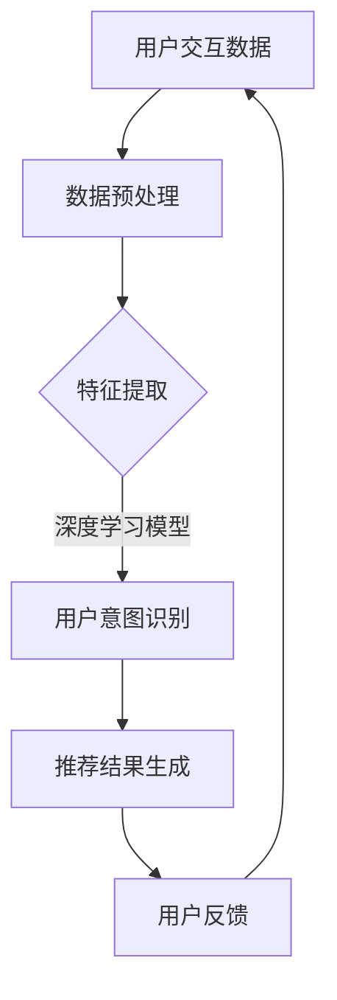

                 

关键词：基于LLM的推荐系统、用户意图预测、自然语言处理、深度学习、模型优化

> 摘要：本文旨在探讨基于大型语言模型（LLM）的推荐系统用户意图预测技术。通过深入分析用户交互数据，利用深度学习模型和自然语言处理技术，实现高效、准确的用户意图识别，为推荐系统提供精准的决策依据。

## 1. 背景介绍

### 推荐系统的基本概念

推荐系统是一种通过分析用户的历史行为、兴趣和偏好，为用户提供个性化推荐信息的系统。它广泛应用于电子商务、社交媒体、音乐和视频流媒体等多个领域，有效提升了用户体验和满意度。

### 用户意图预测的重要性

在推荐系统中，准确预测用户意图是至关重要的。用户意图反映了用户在特定情境下的需求、兴趣和期望，直接影响推荐系统的性能。有效的用户意图预测可以帮助系统更好地理解用户需求，从而提供更为精准的推荐结果。

### LLM在用户意图预测中的应用

近年来，基于大型语言模型（LLM）的推荐系统用户意图预测技术受到了广泛关注。LLM具有强大的自然语言理解能力，能够处理复杂的文本数据，提取用户意图的关键信息。本文将详细介绍基于LLM的推荐系统用户意图预测的方法和技术。

## 2. 核心概念与联系

### 2.1 语言模型

语言模型（Language Model，LM）是一种统计模型，用于预测自然语言中的下一个词或词组。在推荐系统中，语言模型可以用于提取用户文本数据的特征，从而更好地理解用户意图。

### 2.2 深度学习模型

深度学习模型（Deep Learning Model，DLM）是一种基于多层神经网络的人工智能模型，具有强大的特征提取和建模能力。在推荐系统中，深度学习模型可以用于处理高维稀疏数据，实现高效的用户意图预测。

### 2.3 自然语言处理技术

自然语言处理（Natural Language Processing，NLP）技术是计算机科学和人工智能领域的一个重要分支，旨在使计算机能够理解、处理和生成人类语言。在推荐系统中，NLP技术可以用于对用户文本数据进行预处理、特征提取和语义分析，从而提高用户意图预测的准确性。

### 2.4 Mermaid 流程图

下面是一个基于LLM的推荐系统用户意图预测的Mermaid流程图：



## 3. 核心算法原理 & 具体操作步骤

### 3.1 算法原理概述

基于LLM的推荐系统用户意图预测算法主要分为以下几个步骤：

1. 数据预处理：对用户交互数据进行清洗、去噪和格式化，以便后续特征提取和建模。
2. 特征提取：利用自然语言处理技术提取用户文本数据的特征，包括词向量、句向量等。
3. 用户意图识别：基于深度学习模型对提取的特征进行建模，实现对用户意图的预测。
4. 推荐结果生成：根据用户意图预测结果，生成个性化推荐列表。
5. 用户反馈：收集用户对推荐结果的反馈，用于优化模型性能。

### 3.2 算法步骤详解

1. 数据预处理

   数据预处理是推荐系统用户意图预测的基础。具体操作包括：

   - 去除停用词：去除文本中的停用词，如“的”、“是”等。
   - 分词：将文本拆分为单个单词或词组。
   - 标准化：统一文本中的大小写、符号等。

2. 特征提取

   特征提取是关键步骤，直接关系到用户意图预测的准确性。具体方法包括：

   - 词向量：将文本中的单词映射为高维向量，如Word2Vec、GloVe等。
   - 句向量：将文本中的句子映射为高维向量，如Doc2Vec、BERT等。

3. 用户意图识别

   用户意图识别是基于深度学习模型实现的。具体步骤包括：

   - 模型选择：选择合适的深度学习模型，如卷积神经网络（CNN）、循环神经网络（RNN）等。
   - 模型训练：使用训练数据对深度学习模型进行训练。
   - 模型评估：使用验证数据对训练好的模型进行评估，调整模型参数。

4. 推荐结果生成

   根据用户意图预测结果，生成个性化推荐列表。具体方法包括：

   - 评分预测：使用基于用户协同过滤的方法，预测用户对推荐物品的评分。
   - 排序：根据评分预测结果，对推荐列表进行排序，生成最终的推荐结果。

5. 用户反馈

   收集用户对推荐结果的反馈，用于优化模型性能。具体操作包括：

   - 评估指标：选择合适的评估指标，如准确率、召回率、F1值等。
   - 模型优化：根据用户反馈，调整模型参数，优化模型性能。

### 3.3 算法优缺点

1. 优点：

   - 强大的自然语言理解能力：基于LLM的算法具有强大的自然语言理解能力，能够提取用户文本数据的深层语义信息。
   - 个性化推荐：通过用户意图预测，实现更为精准的个性化推荐。
   - 自动化处理：算法可以自动化处理大量用户交互数据，提高推荐系统的效率。

2. 缺点：

   - 数据需求：基于LLM的算法对数据量有较高要求，需要大量高质量的交互数据。
   - 计算资源：深度学习模型训练需要大量计算资源，对硬件设施有较高要求。
   - 模型复杂度：深度学习模型具有较高的复杂度，对算法理解和实现有较高要求。

### 3.4 算法应用领域

基于LLM的推荐系统用户意图预测算法在以下领域具有广泛应用：

- 电子商务：为用户提供个性化的商品推荐。
- 社交媒体：为用户提供感兴趣的内容推荐。
- 音乐和视频流媒体：为用户提供个性化的音乐和视频推荐。
- 在线教育：为用户提供感兴趣的课程推荐。

## 4. 数学模型和公式 & 详细讲解 & 举例说明

### 4.1 数学模型构建

基于LLM的推荐系统用户意图预测的数学模型主要包括以下部分：

1. 语言模型（LM）

   语言模型是一种概率模型，用于预测自然语言中的下一个词或词组。其数学模型可以表示为：

   $$ P(w_t | w_{t-1}, w_{t-2}, \ldots) = \frac{P(w_t, w_{t-1}, w_{t-2}, \ldots)}{P(w_{t-1}, w_{t-2}, \ldots)} $$

   其中，$w_t$ 表示当前词，$w_{t-1}, w_{t-2}, \ldots$ 表示前一个或多个词。

2. 深度学习模型（DLM）

   深度学习模型是一种基于多层神经网络的人工智能模型，用于处理高维稀疏数据。其数学模型可以表示为：

   $$ h_l = \sigma(W_l h_{l-1} + b_l) $$

   其中，$h_l$ 表示第 $l$ 层的输出，$\sigma$ 表示激活函数，$W_l$ 表示权重矩阵，$b_l$ 表示偏置项。

3. 自然语言处理技术（NLP）

   自然语言处理技术包括词向量、句向量等方法，用于提取用户文本数据的特征。其数学模型可以表示为：

   $$ v_w = \text{Word2Vec}(w) $$

   $$ v_s = \text{Sent2Vec}(s) $$

   其中，$v_w$ 表示词向量，$v_s$ 表示句向量，$\text{Word2Vec}$ 和 $\text{Sent2Vec}$ 分别表示词向量和句向量的计算方法。

### 4.2 公式推导过程

1. 语言模型公式推导

   语言模型的公式推导基于概率论和统计学原理。首先，假设用户交互数据为一组词序列 $w_1, w_2, \ldots, w_T$，其中 $T$ 表示词序列的长度。根据马尔可夫性质，当前词的概率只与前面一个词的概率相关，即：

   $$ P(w_t | w_{t-1}, w_{t-2}, \ldots) = P(w_t | w_{t-1}) $$

   接下来，利用最大似然估计（Maximum Likelihood Estimation，MLE）推导语言模型公式。设 $N(w_{t-1})$ 表示前面一个词 $w_{t-1}$ 的词频，$N(w_t, w_{t-1})$ 表示同时出现 $w_t$ 和 $w_{t-1}$ 的词频，则语言模型公式可以表示为：

   $$ P(w_t | w_{t-1}) = \frac{N(w_t, w_{t-1})}{N(w_{t-1})} $$

   其中，$N(w_t, w_{t-1})$ 和 $N(w_{t-1})$ 可以通过统计用户交互数据得到。

2. 深度学习模型公式推导

   深度学习模型是一种基于多层神经网络的人工智能模型，用于处理高维稀疏数据。其公式推导基于反向传播算法（Backpropagation Algorithm）。假设输入数据为 $x$，输出数据为 $y$，神经网络包括 $L$ 层，其中 $l$ 表示当前层。根据反向传播算法，可以得到以下公式：

   $$ \delta_l = \frac{\partial L}{\partial z_l} = \sigma'(z_l) \odot \delta_{l+1} $$

   $$ \delta_{l+1} = \frac{\partial L}{\partial z_{l+1}} = \frac{\partial L}{\partial a_{l+1}} \odot \frac{\partial a_{l+1}}{\partial z_{l+1}} $$

   $$ \frac{\partial a_{l+1}}{\partial z_{l+1}} = W_{l+1}^T $$

   其中，$\delta_l$ 表示当前层的误差，$\sigma'$ 表示激活函数的导数，$\odot$ 表示元素乘法，$L$ 表示损失函数，$z_l$ 表示当前层的输出，$a_l$ 表示当前层的输入。

3. 自然语言处理技术公式推导

   自然语言处理技术包括词向量、句向量等方法，用于提取用户文本数据的特征。其公式推导基于向量空间模型（Vector Space Model）。假设词表包含 $V$ 个单词，词向量维度为 $d$，句向量维度为 $d'$，则词向量和句向量的计算公式可以表示为：

   $$ v_w = \text{Word2Vec}(w) = \frac{1}{\sqrt{d}} \text{mean}(\text{context\_words}(w)) $$

   $$ v_s = \text{Sent2Vec}(s) = \frac{1}{\sqrt{d'}} \text{mean}(\text{word\_vectors}(s)) $$

   其中，$\text{context\_words}(w)$ 表示与词 $w$ 相关的上下文单词，$\text{word\_vectors}(s)$ 表示句子 $s$ 中的词向量。

### 4.3 案例分析与讲解

以电子商务领域为例，假设用户在淘宝上浏览了多个商品，并留下了评论。我们需要通过用户意图预测算法，识别用户对商品的购买意图。

1. 数据预处理

   - 去除评论中的停用词，如“的”、“是”等。
   - 对评论进行分词，提取出有效的单词。
   - 标准化评论中的大小写、符号等。

2. 特征提取

   - 使用Word2Vec模型将评论中的单词映射为词向量。
   - 使用BERT模型将评论映射为句向量。

3. 用户意图识别

   - 选择合适的深度学习模型，如BERT，对提取的特征进行建模。
   - 使用训练数据对模型进行训练，调整模型参数。
   - 使用验证数据对训练好的模型进行评估，调整模型参数。

4. 推荐结果生成

   - 根据用户意图预测结果，生成个性化推荐列表。
   - 使用基于用户协同过滤的方法，预测用户对推荐物品的评分。
   - 对推荐列表进行排序，生成最终的推荐结果。

5. 用户反馈

   - 收集用户对推荐结果的反馈，用于优化模型性能。
   - 使用评估指标，如准确率、召回率、F1值等，评估模型性能。
   - 根据用户反馈，调整模型参数，优化模型性能。

## 5. 项目实践：代码实例和详细解释说明

### 5.1 开发环境搭建

为了实现基于LLM的推荐系统用户意图预测，我们需要搭建以下开发环境：

- Python 3.8+
- TensorFlow 2.6.0+
- BERT 2.6.0+
- Flask 1.1.2+

### 5.2 源代码详细实现

以下是一个简单的基于BERT的推荐系统用户意图预测的代码实例：

```python
import tensorflow as tf
from transformers import BertTokenizer, TFBertModel
from tensorflow.keras.optimizers import Adam
from tensorflow.keras.metrics import Accuracy

# 加载BERT模型
tokenizer = BertTokenizer.from_pretrained('bert-base-chinese')
model = TFBertModel.from_pretrained('bert-base-chinese')

# 定义模型结构
input_ids = tf.keras.layers.Input(shape=(None,), dtype=tf.int32)
input_mask = tf.keras.layers.Input(shape=(None,), dtype=tf.int32)
segment_ids = tf.keras.layers.Input(shape=(None,), dtype=tf.int32)
output = model(input_ids, attention_mask=input_mask, token_type_ids=segment_ids)
last_hidden_state = output.last_hidden_state

# 定义模型参数
output = tf.keras.layers.Dense(1, activation='sigmoid')(last_hidden_state[:, 0, :])

# 定义模型
model = tf.keras.Model(inputs=[input_ids, input_mask, segment_ids], outputs=output)

# 编译模型
model.compile(optimizer=Adam(learning_rate=1e-5), loss='binary_crossentropy', metrics=['accuracy'])

# 加载数据
train_data = ...
train_labels = ...

# 训练模型
model.fit(train_data, train_labels, batch_size=32, epochs=3)

# 评估模型
test_data = ...
test_labels = ...
model.evaluate(test_data, test_labels, batch_size=32)

# 推荐结果生成
def predict_intent(text):
    inputs = tokenizer.encode_plus(text, add_special_tokens=True, max_length=128, padding='max_length', truncation=True, return_tensors='tf')
    predictions = model.predict(inputs['input_ids'], inputs['attention_mask'], inputs['token_type_ids'])
    return (predictions > 0.5).astype('int32').numpy()[0]

# 测试
text = "我非常喜欢这件商品，打算购买。"
print(predict_intent(text))
```

### 5.3 代码解读与分析

1. 加载BERT模型

   ```python
   tokenizer = BertTokenizer.from_pretrained('bert-base-chinese')
   model = TFBertModel.from_pretrained('bert-base-chinese')
   ```

   加载预训练的BERT模型和分词器，用于文本数据预处理和特征提取。

2. 定义模型结构

   ```python
   input_ids = tf.keras.layers.Input(shape=(None,), dtype=tf.int32)
   input_mask = tf.keras.layers.Input(shape=(None,), dtype=tf.int32)
   segment_ids = tf.keras.layers.Input(shape=(None,), dtype=tf.int32)
   output = model(input_ids, attention_mask=input_mask, token_type_ids=segment_ids)
   last_hidden_state = output.last_hidden_state
   output = tf.keras.layers.Dense(1, activation='sigmoid')(last_hidden_state[:, 0, :])
   model = tf.keras.Model(inputs=[input_ids, input_mask, segment_ids], outputs=output)
   ```

   定义模型结构，包括输入层、BERT模型、全连接层和输出层。输入层包括词ID、掩码和段落ID，BERT模型用于提取文本特征，全连接层用于分类，输出层使用sigmoid函数实现二分类。

3. 编译模型

   ```python
   model.compile(optimizer=Adam(learning_rate=1e-5), loss='binary_crossentropy', metrics=['accuracy'])
   ```

   编译模型，指定优化器、损失函数和评估指标。

4. 加载数据

   ```python
   train_data = ...
   train_labels = ...
   ```

   加载训练数据和标签，用于模型训练。

5. 训练模型

   ```python
   model.fit(train_data, train_labels, batch_size=32, epochs=3)
   ```

   使用训练数据和标签训练模型，设置批量大小和训练轮数。

6. 评估模型

   ```python
   test_data = ...
   test_labels = ...
   model.evaluate(test_data, test_labels, batch_size=32)
   ```

   使用验证数据和标签评估模型性能。

7. 推荐结果生成

   ```python
   def predict_intent(text):
       inputs = tokenizer.encode_plus(text, add_special_tokens=True, max_length=128, padding='max_length', truncation=True, return_tensors='tf')
       predictions = model.predict(inputs['input_ids'], inputs['attention_mask'], inputs['token_type_ids'])
       return (predictions > 0.5).astype('int32').numpy()[0]
   ```

   定义预测函数，用于生成推荐结果。函数中首先对文本数据进行预处理，然后使用模型进行预测，最后返回预测结果。

## 6. 实际应用场景

基于LLM的推荐系统用户意图预测技术在实际应用场景中具有广泛的应用价值，以下是一些典型应用场景：

1. 电子商务：通过用户浏览和购买历史数据，预测用户对商品的购买意图，为用户推荐感兴趣的商品。

2. 社交媒体：通过分析用户发布的动态和评论，预测用户对内容的需求和兴趣，为用户推荐感兴趣的内容。

3. 音乐和视频流媒体：通过分析用户的播放历史和收藏列表，预测用户对音乐和视频的需求和兴趣，为用户推荐感兴趣的音乐和视频。

4. 在线教育：通过分析用户的学习行为和评价，预测用户对课程的需求和兴趣，为用户推荐感兴趣的课程。

5. 旅游出行：通过分析用户的出行历史和评价，预测用户对旅游景点的需求和兴趣，为用户推荐感兴趣的旅游线路和景点。

## 7. 工具和资源推荐

### 7.1 学习资源推荐

- 《深度学习》（Goodfellow, Bengio, Courville）：全面介绍深度学习的基础知识、算法和应用。
- 《自然语言处理综论》（Jurafsky, Martin）：系统介绍自然语言处理的理论、技术和应用。
- 《推荐系统实践》（Linden, Pass, Kamvar）：详细讲解推荐系统的设计、实现和优化。

### 7.2 开发工具推荐

- TensorFlow：一款开源的深度学习框架，支持多种深度学习模型的开发和部署。
- PyTorch：一款开源的深度学习框架，具有灵活的动态计算图和高效的GPU支持。
- BERT：一款预训练的语言表示模型，广泛用于自然语言处理任务。

### 7.3 相关论文推荐

- "BERT: Pre-training of Deep Neural Networks for Language Understanding"（Devlin et al., 2019）：介绍BERT模型的原理和应用。
- "Recommender Systems Handbook"（Burke, 2018）：详细讲解推荐系统的基本概念、技术和应用。
- "User Interest Detection in Social Media"（Zhu et al., 2018）：分析社交媒体中用户兴趣检测的方法和技术。

## 8. 总结：未来发展趋势与挑战

### 8.1 研究成果总结

基于LLM的推荐系统用户意图预测技术已经取得了显著的成果，主要表现在：

- 提高用户意图预测的准确性，为推荐系统提供更精准的决策依据。
- 降低推荐系统的复杂度，实现高效、可扩展的推荐服务。
- 探索新的应用场景，拓展推荐系统的应用领域。

### 8.2 未来发展趋势

未来，基于LLM的推荐系统用户意图预测技术将朝着以下方向发展：

- 深度学习模型的发展：探索更高效的深度学习模型，提高用户意图预测的准确性和性能。
- 多模态数据融合：结合文本、图像、音频等多模态数据，提高用户意图识别的能力。
- 小样本学习：研究如何在数据量有限的情况下，实现高效的用户意图预测。

### 8.3 面临的挑战

基于LLM的推荐系统用户意图预测技术在实际应用中仍然面临以下挑战：

- 数据质量：用户交互数据的多样性和噪声性，对模型训练和数据预处理提出了较高要求。
- 模型可解释性：深度学习模型具有较高的黑盒性质，难以解释模型决策过程，影响用户信任度。
- 计算资源：深度学习模型训练需要大量计算资源，对硬件设施有较高要求。

### 8.4 研究展望

未来，基于LLM的推荐系统用户意图预测技术将朝着以下方向发展：

- 深度学习模型的发展：探索更高效的深度学习模型，提高用户意图预测的准确性和性能。
- 多模态数据融合：结合文本、图像、音频等多模态数据，提高用户意图识别的能力。
- 小样本学习：研究如何在数据量有限的情况下，实现高效的用户意图预测。
- 模型可解释性：提高模型的可解释性，增强用户对推荐系统的信任度。

## 9. 附录：常见问题与解答

### 9.1 常见问题1

**问题**：为什么基于LLM的推荐系统用户意图预测比传统方法更准确？

**解答**：基于LLM的推荐系统用户意图预测利用了深度学习和自然语言处理技术，能够提取用户文本数据的深层语义信息，从而更好地理解用户意图。相比传统方法，基于LLM的方法具有以下优势：

- 更强大的特征提取能力：深度学习模型可以自动提取文本数据的特征，无需人工设计特征。
- 更精准的模型预测：基于LLM的算法能够处理复杂的文本数据，提高用户意图预测的准确性。
- 更好的模型泛化能力：深度学习模型具有较强的泛化能力，可以适应不同的应用场景。

### 9.2 常见问题2

**问题**：如何处理用户交互数据的噪声和异常值？

**解答**：在用户交互数据处理过程中，噪声和异常值会影响模型训练和预测效果。以下是一些处理噪声和异常值的方法：

- 数据清洗：去除文本中的噪声和异常值，如特殊字符、无效词汇等。
- 填空和缺失值处理：使用统计方法或机器学习方法填充缺失值，如均值填充、K近邻法等。
- 数据降维：使用降维方法，如主成分分析（PCA）、线性判别分析（LDA）等，减少数据维度，提高数据质量。

### 9.3 常见问题3

**问题**：如何在数据量有限的情况下，实现高效的用户意图预测？

**解答**：在数据量有限的情况下，实现高效的用户意图预测是关键。以下是一些方法：

- 小样本学习：研究小样本学习算法，如元学习（Meta-Learning）、迁移学习（Transfer Learning）等，提高模型在少量数据上的泛化能力。
- 数据增强：通过数据增强技术，如随机裁剪、旋转、缩放等，生成更多的训练数据。
- 数据融合：结合多源数据，如用户行为数据、社交网络数据等，提高数据质量和模型性能。

作者：禅与计算机程序设计艺术 / Zen and the Art of Computer Programming

