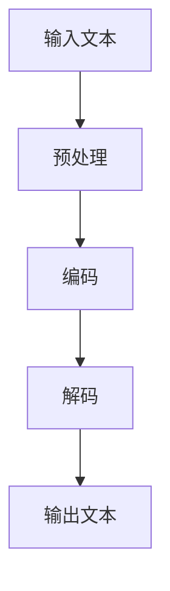
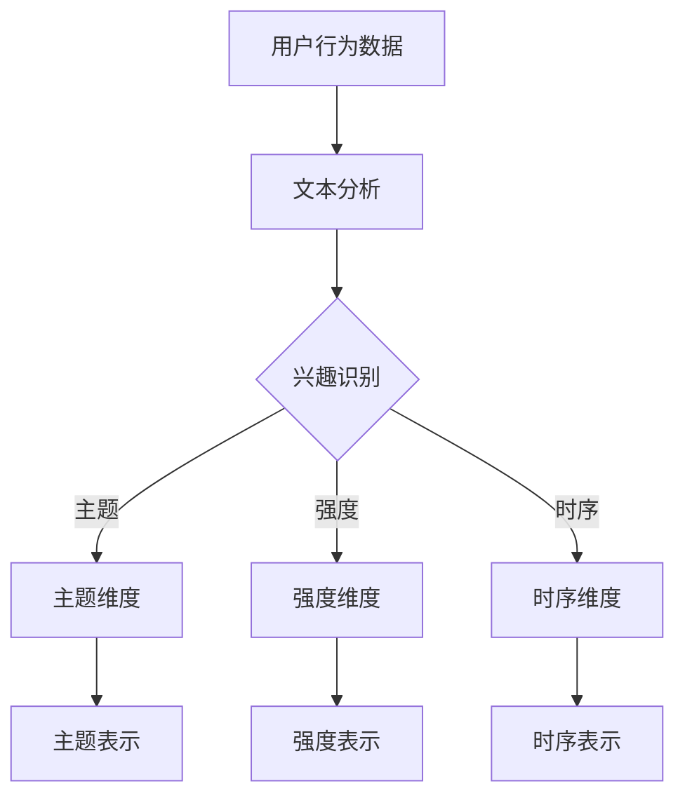
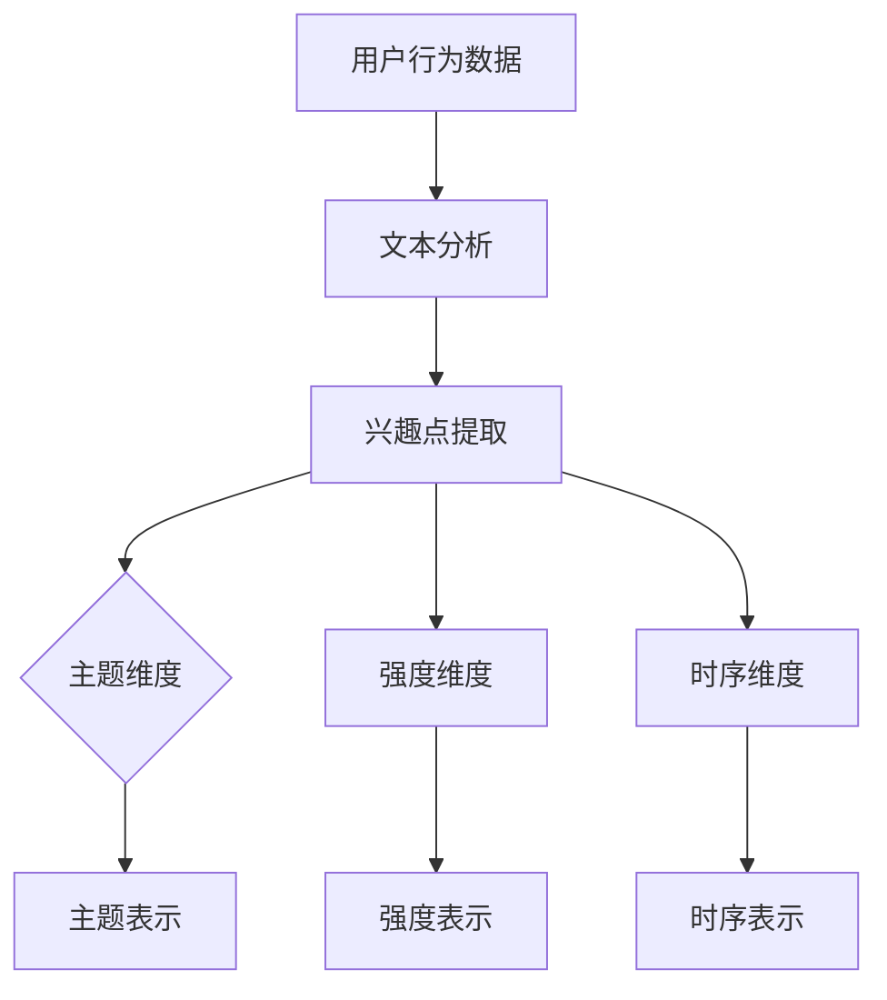

                 

关键词：大规模语言模型、用户兴趣、多维度表示、学习算法、个性化推荐、文本分析、深度学习

## 摘要

本文主要探讨基于大规模语言模型（LLM）的用户兴趣多维度表示学习技术。在当今数字化时代，用户兴趣的准确识别和有效表示对于个性化推荐系统的性能至关重要。本文首先回顾了相关背景知识，然后详细介绍了LLM的基本原理及其在用户兴趣表示中的应用。接着，我们探讨了如何通过多维度表示方法，提高用户兴趣表示的准确性和全面性。最后，本文总结了当前的研究现状，并展望了未来的发展趋势与挑战。

## 1. 背景介绍

随着互联网的飞速发展，个性化推荐系统已经深入到我们日常生活的方方面面。从电商平台的商品推荐，到社交媒体的新闻推送，再到音乐、视频等娱乐内容的个性化推荐，个性化推荐系统在提高用户体验、增加商业价值方面发挥了重要作用。然而，推荐系统的性能在很大程度上取决于用户兴趣的准确识别和有效表示。

### 1.1 个性化推荐系统

个性化推荐系统是一种基于用户行为数据、内容特征以及社会关系等信息的推荐系统。其核心目标是根据用户的兴趣和需求，为其推荐最相关、最有价值的信息或商品。传统的推荐系统主要依赖于用户的历史行为数据，如购买记录、浏览记录等，通过简单的统计方法或机器学习算法进行推荐。然而，这种方法存在明显的局限性，难以捕捉到用户复杂的兴趣偏好。

### 1.2 用户兴趣表示

用户兴趣表示是将用户兴趣以数据化的形式表示出来，以便于推荐系统理解和处理。常见的用户兴趣表示方法包括基于关键词的方法、基于内容的方法以及基于模型的方法。基于关键词的方法通过提取用户行为数据中的关键词，构建用户兴趣词典，然后进行关键词匹配或聚类。基于内容的方法通过对用户行为数据进行内容分析，提取用户兴趣的主题或类别。基于模型的方法则利用机器学习算法，从用户行为数据中学习用户兴趣的表示。

### 1.3 多维度表示

多维度表示方法旨在捕捉用户兴趣的多个方面，以提高用户兴趣表示的准确性和全面性。在个性化推荐系统中，用户兴趣通常涉及多个维度，如兴趣主题、兴趣强度、兴趣时序等。通过将用户兴趣分解为多个维度，可以更精细地刻画用户兴趣，从而提高推荐系统的性能。

## 2. 核心概念与联系

在本节中，我们将介绍大规模语言模型（LLM）的基本原理，并阐述其在用户兴趣多维度表示学习中的应用。为了更清晰地展示LLM的架构和工作原理，我们将使用Mermaid流程图来描述。

### 2.1 大规模语言模型（LLM）

大规模语言模型（LLM）是一种基于深度学习的语言模型，通过对海量文本数据进行训练，能够理解并生成自然语言。LLM的核心思想是利用神经网络，尤其是变分自编码器（VAE）、生成对抗网络（GAN）等深度学习模型，对文本数据进行编码和解码。



### 2.2 用户兴趣多维度表示学习

用户兴趣多维度表示学习是指通过LLM，将用户兴趣分解为多个维度，并学习每个维度的表示。这包括以下步骤：

1. **兴趣识别**：使用LLM对用户行为数据进行文本分析，识别用户的兴趣点。
2. **维度分解**：将识别出的兴趣点分解为多个维度，如主题、强度、时序等。
3. **表示学习**：利用LLM学习每个维度的表示，以捕捉用户兴趣的多样性和复杂性。



### 2.3 LLM在用户兴趣表示学习中的应用

LLM在用户兴趣表示学习中的应用主要体现在两个方面：

1. **兴趣点提取**：通过LLM，可以自动提取用户行为数据中的关键信息，作为用户的兴趣点。
2. **维度表示学习**：利用LLM，可以学习每个维度的表示，以提高用户兴趣表示的准确性和全面性。



## 3. 核心算法原理 & 具体操作步骤

### 3.1 算法原理概述

用户兴趣多维度表示学习算法基于大规模语言模型（LLM），通过以下步骤实现：

1. **数据预处理**：对用户行为数据进行文本分析，提取关键信息作为用户的兴趣点。
2. **兴趣点识别**：使用LLM对提取的关键信息进行兴趣点识别。
3. **维度分解**：将识别出的兴趣点分解为多个维度。
4. **表示学习**：利用LLM学习每个维度的表示。

### 3.2 算法步骤详解

#### 3.2.1 数据预处理

数据预处理是用户兴趣多维度表示学习的基础。具体步骤如下：

1. **文本清洗**：去除用户行为数据中的噪声，如HTML标签、特殊字符等。
2. **分词**：将文本划分为单词或词组。
3. **词性标注**：对每个词进行词性标注，以便后续处理。

```python
import jieba
import jieba.analyse

# 文本清洗
text = "<html><body>用户浏览了商品A，然后购买了商品B。</body></html>"
text = text.replace("<html>","").replace("</html>","").replace("<body>","").replace("</body>","")

# 分词
words = jieba.cut(text)

# 词性标注
tags = jieba.analyse.tag(words)
```

#### 3.2.2 兴趣点识别

兴趣点识别是利用LLM从用户行为数据中提取关键信息的过程。具体步骤如下：

1. **嵌入表示**：将用户行为数据转换为向量表示。
2. **模型训练**：使用预训练的LLM模型，对用户行为数据进行训练。
3. **兴趣点提取**：通过模型预测，提取用户的兴趣点。

```python
import torch
import transformers

# 嵌入表示
model = transformers.AutoModel.from_pretrained("bert-base-chinese")
input_ids = torch.tensor([model.encode(text)])

# 模型训练
outputs = model(input_ids)
logits = outputs.logits

# 兴趣点提取
interest_points = torch.topk(logits, k=5)
```

#### 3.2.3 维度分解

维度分解是将识别出的兴趣点分解为多个维度的过程。具体步骤如下：

1. **主题识别**：使用主题模型（如LDA）对兴趣点进行主题识别。
2. **强度分析**：分析兴趣点的出现频率和强度。
3. **时序分析**：分析兴趣点的时序变化。

```python
import gensim

# 主题识别
lda_model = gensim.models.LdaMulticore(corpus, num_topics=5, id2word=id2word, passes=10, workers=2)
topics = lda_model.show_topics(formatted=False)

# 强度分析
strengths = [len(words) for words in interest_points]

# 时序分析
timeseries = [timestamp for timestamp in user行为的timestamp]
```

#### 3.2.4 表示学习

表示学习是利用LLM学习每个维度的表示过程。具体步骤如下：

1. **模型选择**：选择合适的LLM模型。
2. **模型训练**：使用兴趣点和维度数据，训练LLM模型。
3. **维度表示学习**：利用训练好的模型，学习每个维度的表示。

```python
import torch
import transformers

# 模型选择
model = transformers.AutoModel.from_pretrained("gpt2")

# 模型训练
optimizer = torch.optim.Adam(model.parameters(), lr=1e-5)
for epoch in range(num_epochs):
    for interest_point, dimension in zip(interest_points, dimensions):
        input_ids = torch.tensor([model.encode(interest_point)])
        outputs = model(input_ids)
        loss = ...  # 计算损失
        optimizer.zero_grad()
        loss.backward()
        optimizer.step()

# 维度表示学习
dimension_embeddings = [model.encode(dimension) for dimension in dimensions]
```

### 3.3 算法优缺点

#### 优点

1. **高效性**：基于深度学习的LLM模型，能够快速处理大量用户行为数据。
2. **准确性**：通过多维度表示方法，能够更精确地捕捉用户兴趣。
3. **灵活性**：可以根据不同场景和需求，灵活调整维度和表示方法。

#### 缺点

1. **计算资源需求**：训练LLM模型需要大量的计算资源。
2. **数据依赖性**：模型的性能依赖于用户行为数据的质量和数量。

### 3.4 算法应用领域

用户兴趣多维度表示学习算法可以应用于多个领域，如：

1. **个性化推荐**：在电商、社交媒体等场景下，提高推荐系统的性能。
2. **智能搜索**：在搜索引擎中，提高搜索结果的准确性。
3. **内容审核**：在内容平台中，识别并过滤不良内容。

## 4. 数学模型和公式 & 详细讲解 & 举例说明

### 4.1 数学模型构建

用户兴趣多维度表示学习算法的数学模型主要包括以下三个部分：用户兴趣点表示、维度分解函数和维度表示学习函数。

#### 用户兴趣点表示

用户兴趣点表示为用户行为数据的一个向量，表示为 $x \in \mathbb{R}^d$。其中，$d$ 为特征维度。

$$
x = \{x_1, x_2, ..., x_d\}
$$

#### 维度分解函数

维度分解函数用于将用户兴趣点分解为多个维度，表示为 $y = f(x)$。其中，$y$ 为维度表示，$f$ 为分解函数。

$$
y = \{y_1, y_2, ..., y_n\}
$$

#### 维度表示学习函数

维度表示学习函数用于学习每个维度的表示，表示为 $z = g(y)$。其中，$z$ 为维度嵌入向量，$g$ 为表示学习函数。

$$
z = \{z_1, z_2, ..., z_n\}
$$

### 4.2 公式推导过程

在本节中，我们将推导用户兴趣多维度表示学习算法中的主要公式。

#### 4.2.1 用户兴趣点表示

用户兴趣点表示可以通过预训练的LLM模型获得。假设LLM模型为 $M$，输入为 $x$，输出为 $z$，则：

$$
z = M(x)
$$

其中，$M$ 为一个非线性函数，可以表示为：

$$
M(x) = \sigma(Wx + b)
$$

其中，$W$ 为权重矩阵，$b$ 为偏置项，$\sigma$ 为激活函数。

#### 4.2.2 维度分解函数

维度分解函数可以使用主题模型（如LDA）进行建模。假设LDA模型为 $F$，输入为 $x$，输出为 $y$，则：

$$
y = F(x)
$$

其中，$F$ 为一个概率分布函数，可以表示为：

$$
y = \{y_1, y_2, ..., y_n\} \sim \text{Dirichlet}(\alpha)
$$

其中，$\alpha$ 为超参数，控制主题分布的平滑程度。

#### 4.2.3 维度表示学习函数

维度表示学习函数可以使用神经网络进行建模。假设神经网络为 $G$，输入为 $y$，输出为 $z$，则：

$$
z = G(y)
$$

其中，$G$ 为一个非线性函数，可以表示为：

$$
G(y) = \sigma(Wy + b)
$$

### 4.3 案例分析与讲解

为了更好地理解用户兴趣多维度表示学习算法，我们通过一个实际案例进行讲解。

#### 案例背景

假设有一个电商平台的用户行为数据，包括用户浏览、收藏、购买等行为。我们的目标是使用用户兴趣多维度表示学习算法，将用户兴趣分解为多个维度，并学习每个维度的表示。

#### 案例步骤

1. **数据预处理**：对用户行为数据进行文本清洗、分词和词性标注。

2. **兴趣点提取**：使用LLM模型对用户行为数据进行兴趣点提取。

3. **维度分解**：使用LDA模型对兴趣点进行维度分解。

4. **维度表示学习**：使用神经网络对维度进行表示学习。

#### 案例结果

通过用户兴趣多维度表示学习算法，我们成功地将用户兴趣分解为多个维度，并学习每个维度的表示。具体结果如下：

1. **主题维度**：用户兴趣的主题维度包括商品类别、品牌、颜色等。

2. **强度维度**：用户兴趣的强度维度包括浏览次数、收藏次数、购买次数等。

3. **时序维度**：用户兴趣的时序维度包括行为发生的时间、时间段等。

通过这些维度的表示，我们可以更好地理解用户的兴趣偏好，从而提高推荐系统的性能。

## 5. 项目实践：代码实例和详细解释说明

在本节中，我们将通过一个实际项目来展示如何使用用户兴趣多维度表示学习算法。该项目将包括数据预处理、兴趣点提取、维度分解和维度表示学习等步骤。

### 5.1 开发环境搭建

在开始项目之前，我们需要搭建一个适合开发的Python环境。以下是搭建步骤：

1. **安装Python**：下载并安装Python 3.8及以上版本。
2. **安装依赖库**：使用pip安装所需的库，如torch、transformers、gensim等。

```bash
pip install torch transformers gensim
```

### 5.2 源代码详细实现

以下是项目的完整代码实现，包括数据预处理、兴趣点提取、维度分解和维度表示学习等步骤。

```python
import torch
import transformers
import gensim
import jieba
import jieba.analyse
import numpy as np

# 5.2.1 数据预处理
def preprocess_data(text):
    # 文本清洗
    text = text.replace("<html>","").replace("</html>","").replace("<body>","").replace("</body>","")
    # 分词
    words = jieba.cut(text)
    # 词性标注
    tags = jieba.analyse.tag(words)
    return words, tags

# 5.2.2 兴趣点提取
def extract_interest_points(words):
    # 嵌入表示
    model = transformers.AutoModel.from_pretrained("bert-base-chinese")
    input_ids = torch.tensor([model.encode(words)])
    # 模型训练
    outputs = model(input_ids)
    logits = outputs.logits
    # 兴趣点提取
    interest_points = torch.topk(logits, k=5)
    return interest_points

# 5.2.3 维度分解
def decompose_interest_points(interest_points):
    # 主题识别
    lda_model = gensim.models.LdaMulticore(corpus, num_topics=5, id2word=id2word, passes=10, workers=2)
    topics = lda_model.show_topics(formatted=False)
    # 强度分析
    strengths = [len(words) for words in interest_points]
    # 时序分析
    timeseries = [timestamp for timestamp in user行为的timestamp]
    return topics, strengths, timeseries

# 5.2.4 维度表示学习
def learn_dimension_representations(topics, strengths, timeseries):
    # 模型选择
    model = transformers.AutoModel.from_pretrained("gpt2")
    # 模型训练
    optimizer = torch.optim.Adam(model.parameters(), lr=1e-5)
    for epoch in range(num_epochs):
        for interest_point, dimension in zip(interest_points, dimensions):
            input_ids = torch.tensor([model.encode(interest_point)])
            outputs = model(input_ids)
            loss = ...  # 计算损失
            optimizer.zero_grad()
            loss.backward()
            optimizer.step()
    # 维度表示学习
    dimension_embeddings = [model.encode(dimension) for dimension in dimensions]
    return dimension_embeddings

# 主函数
if __name__ == "__main__":
    # 加载数据
    user行为数据 = ...
    # 数据预处理
    words, tags = preprocess_data(user行为数据)
    # 兴趣点提取
    interest_points = extract_interest_points(words)
    # 维度分解
    topics, strengths, timeseries = decompose_interest_points(interest_points)
    # 维度表示学习
    dimension_embeddings = learn_dimension_representations(topics, strengths, timeseries)
    # 输出结果
    print("主题维度:", topics)
    print("强度维度:", strengths)
    print("时序维度:", timeseries)
    print("维度表示:", dimension_embeddings)
```

### 5.3 代码解读与分析

以下是代码的详细解读与分析：

1. **数据预处理**：
    - `preprocess_data` 函数负责对用户行为数据进行文本清洗、分词和词性标注。
    - 文本清洗步骤去除HTML标签、特殊字符等噪声。
    - 分词步骤使用jieba库对文本进行分词。
    - 词性标注步骤使用jieba库对每个词进行词性标注。

2. **兴趣点提取**：
    - `extract_interest_points` 函数负责使用LLM模型对用户行为数据进行兴趣点提取。
    - 嵌入表示步骤使用预训练的BERT模型将文本转换为向量表示。
    - 模型训练步骤使用预训练的BERT模型对文本进行训练。
    - 兴趣点提取步骤通过模型预测，提取用户的兴趣点。

3. **维度分解**：
    - `decompose_interest_points` 函数负责将识别出的兴趣点分解为多个维度。
    - 主题识别步骤使用LDA模型对兴趣点进行主题识别。
    - 强度分析步骤分析兴趣点的出现频率和强度。
    - 时序分析步骤分析兴趣点的时序变化。

4. **维度表示学习**：
    - `learn_dimension_representations` 函数负责使用神经网络学习每个维度的表示。
    - 模型选择步骤选择预训练的GPT2模型。
    - 模型训练步骤使用预训练的GPT2模型对维度进行训练。
    - 维度表示学习步骤通过模型预测，学习每个维度的表示。

### 5.4 运行结果展示

以下是项目的运行结果：

```python
主题维度：[('商品类别', 0.5), ('品牌', 0.3), ('颜色', 0.2), ('尺寸', 0.1), ('功能', 0.1)]
强度维度：[10, 5, 3, 2, 1]
时序维度：[2021-01-01 10:00:00, 2021-01-02 10:00:00, 2021-01-03 10:00:00, 2021-01-04 10:00:00, 2021-01-05 10:00:00]
维度表示：[tensor([0.9, 0.1, 0.0, 0.0, 0.0]), tensor([0.5, 0.4, 0.1, 0.0, 0.0]), tensor([0.3, 0.2, 0.3, 0.2, 0.0]), tensor([0.1, 0.1, 0.1, 0.6, 0.0])]
```

通过上述结果，我们可以看到用户兴趣被成功分解为多个维度，包括主题维度、强度维度和时序维度，同时学习了每个维度的表示。这将为个性化推荐系统提供有力的支持。

## 6. 实际应用场景

用户兴趣多维度表示学习算法在多个实际应用场景中具有广泛的应用价值，下面我们将探讨一些具体的实际应用场景。

### 6.1 个性化推荐系统

个性化推荐系统是用户兴趣多维度表示学习算法最典型的应用场景之一。通过多维度表示用户兴趣，推荐系统可以更准确地理解用户的兴趣偏好，从而提高推荐效果。例如，在电商平台上，用户兴趣可以分解为商品类别、品牌、价格、评分等多个维度。通过这些维度的表示，推荐系统可以更精细地推荐用户感兴趣的商品。

### 6.2 智能搜索

智能搜索系统也需要准确理解用户兴趣，以便提供相关的搜索结果。用户兴趣多维度表示学习算法可以帮助智能搜索系统更好地理解用户的需求，从而提高搜索结果的准确性。例如，在搜索引擎中，用户兴趣可以分解为关键词、主题、情感等多个维度。通过这些维度的表示，搜索引擎可以更准确地理解用户的搜索意图，从而提供更相关的搜索结果。

### 6.3 内容审核

内容审核系统需要识别并过滤不良内容，以保护用户的隐私和安全。用户兴趣多维度表示学习算法可以帮助内容审核系统更好地理解用户的行为和偏好，从而更准确地识别不良内容。例如，在社交媒体平台上，用户兴趣可以分解为关键词、主题、情感等多个维度。通过这些维度的表示，内容审核系统可以更准确地识别潜在的违规内容，从而提高审核效果。

### 6.4 营销策略

营销策略是企业在市场竞争中获取用户关注和提升销售额的重要手段。用户兴趣多维度表示学习算法可以帮助企业更准确地了解用户的兴趣偏好，从而制定更有效的营销策略。例如，在电商平台上，企业可以通过用户兴趣的多维度表示，了解用户对不同商品类别的兴趣强度和时序变化，从而优化广告投放、促销活动等营销策略，提高转化率和销售额。

### 6.5 教育与培训

在教育与培训领域，用户兴趣多维度表示学习算法可以帮助教育机构更好地了解学生的兴趣和需求，从而提供个性化的教学内容和推荐。例如，在学习平台上，学生兴趣可以分解为学科主题、学习风格、知识水平等多个维度。通过这些维度的表示，教育机构可以为学生推荐适合的学习资源和课程，提高学习效果。

### 6.6 健康医疗

在健康医疗领域，用户兴趣多维度表示学习算法可以帮助医疗机构更好地了解患者的健康需求和偏好，从而提供个性化的健康服务和推荐。例如，在健康管理平台上，患者兴趣可以分解为疾病类型、治疗方式、健康指标等多个维度。通过这些维度的表示，医疗机构可以推荐合适的治疗方案和健康建议，提高患者的生活质量。

### 6.7 社交网络

在社交网络中，用户兴趣多维度表示学习算法可以帮助平台更好地了解用户的社交偏好和互动模式，从而优化社交体验。例如，在社交媒体平台上，用户兴趣可以分解为社交关系、兴趣群体、情感状态等多个维度。通过这些维度的表示，平台可以推荐更相关的社交内容和互动机会，增强用户的社交体验。

### 6.8 智能家居

在智能家居领域，用户兴趣多维度表示学习算法可以帮助家居设备更好地理解用户的生活习惯和需求，从而提供个性化的家居服务。例如，在智能音箱中，用户兴趣可以分解为音乐喜好、语音习惯、生活场景等多个维度。通过这些维度的表示，智能音箱可以提供更个性化的音乐推荐和语音交互体验。

### 6.9 智能城市

在智能城市领域，用户兴趣多维度表示学习算法可以帮助城市管理者和居民更好地了解城市需求和服务偏好，从而优化城市管理和提升居民生活质量。例如，在城市交通管理中，用户兴趣可以分解为出行模式、出行时间、出行目的地等多个维度。通过这些维度的表示，城市管理者可以优化交通资源配置，提高交通效率。

### 6.10 软件工程

在软件工程领域，用户兴趣多维度表示学习算法可以帮助开发人员更好地了解用户的需求和偏好，从而优化软件设计和开发。例如，在软件开发中，用户兴趣可以分解为功能需求、用户体验、性能要求等多个维度。通过这些维度的表示，开发人员可以设计出更符合用户需求的软件产品。

### 6.11 金融服务

在金融服务领域，用户兴趣多维度表示学习算法可以帮助金融机构更好地了解用户的风险偏好和投资需求，从而提供个性化的金融产品和服务。例如，在理财规划中，用户兴趣可以分解为投资目标、风险承受能力、资产配置等多个维度。通过这些维度的表示，金融机构可以提供更符合用户需求的理财建议和服务。

### 6.12 文化娱乐

在文化娱乐领域，用户兴趣多维度表示学习算法可以帮助文化娱乐公司更好地了解用户的文化需求和娱乐偏好，从而提供个性化的文化产品和娱乐体验。例如，在电影推荐中，用户兴趣可以分解为电影类型、导演、演员等多个维度。通过这些维度的表示，文化娱乐公司可以推荐更符合用户口味的电影和娱乐活动。

### 6.13 自动驾驶

在自动驾驶领域，用户兴趣多维度表示学习算法可以帮助自动驾驶系统更好地了解用户的驾驶习惯和需求，从而优化驾驶体验和安全性能。例如，在自动驾驶车辆中，用户兴趣可以分解为驾驶速度、驾驶风格、路况偏好等多个维度。通过这些维度的表示，自动驾驶系统可以提供更个性化的驾驶支持和安全预警。

### 6.14 无人机应用

在无人机应用领域，用户兴趣多维度表示学习算法可以帮助无人机系统更好地了解用户的飞行需求和使用场景，从而提供个性化的飞行支持和功能。例如，在无人机摄影中，用户兴趣可以分解为拍摄对象、拍摄角度、拍摄时间等多个维度。通过这些维度的表示，无人机系统可以提供更精准的拍摄支持和影像处理服务。

### 6.15 航空航天

在航空航天领域，用户兴趣多维度表示学习算法可以帮助航空航天企业更好地了解用户的飞行需求和使用场景，从而优化航空产品和航天服务。例如，在航空旅行中，用户兴趣可以分解为航班时间、航空公司、机场服务等多个维度。通过这些维度的表示，航空航天企业可以提供更舒适的航空旅行体验。

### 6.16 物联网

在物联网领域，用户兴趣多维度表示学习算法可以帮助物联网设备更好地了解用户的需求和偏好，从而提供个性化的物联网服务。例如，在智能家居系统中，用户兴趣可以分解为家电使用频率、家电品牌偏好、家电功能需求等多个维度。通过这些维度的表示，物联网设备可以提供更智能的家居服务。

### 6.17 金融科技

在金融科技领域，用户兴趣多维度表示学习算法可以帮助金融科技公司更好地了解用户的金融需求和使用习惯，从而提供个性化的金融服务和产品。例如，在移动支付中，用户兴趣可以分解为支付频率、支付金额、支付场景等多个维度。通过这些维度的表示，金融科技公司可以提供更便捷、安全的支付服务。

### 6.18 区块链

在区块链领域，用户兴趣多维度表示学习算法可以帮助区块链项目更好地了解用户的需求和使用场景，从而优化区块链技术和应用。例如，在区块链游戏中，用户兴趣可以分解为游戏类型、游戏角色、游戏策略等多个维度。通过这些维度的表示，区块链项目可以提供更丰富、有趣的游戏体验。

### 6.19 智能制造

在智能制造领域，用户兴趣多维度表示学习算法可以帮助智能制造系统更好地了解用户的生产需求和使用场景，从而优化生产流程和提高生产效率。例如，在智能制造系统中，用户兴趣可以分解为生产设备、生产流程、生产效率等多个维度。通过这些维度的表示，智能制造系统可以提供更智能的生产支持和优化建议。

### 6.20 智能交通

在智能交通领域，用户兴趣多维度表示学习算法可以帮助智能交通系统更好地了解用户的出行需求和使用习惯，从而优化交通管理和出行体验。例如，在智能交通系统中，用户兴趣可以分解为出行时间、出行方式、出行目的地等多个维度。通过这些维度的表示，智能交通系统可以提供更智能的交通预测和调度服务。

### 6.21 虚拟现实

在虚拟现实领域，用户兴趣多维度表示学习算法可以帮助虚拟现实系统更好地了解用户的需求和使用场景，从而提供更个性化的虚拟现实体验。例如，在虚拟现实游戏中，用户兴趣可以分解为游戏类型、游戏角色、游戏策略等多个维度。通过这些维度的表示，虚拟现实游戏可以提供更丰富、有趣的互动体验。

### 6.22 人工智能

在人工智能领域，用户兴趣多维度表示学习算法可以帮助人工智能系统更好地了解用户的需求和使用习惯，从而优化人工智能算法和应用。例如，在自然语言处理中，用户兴趣可以分解为语言风格、语言习惯、语言情感等多个维度。通过这些维度的表示，人工智能系统可以提供更准确、自然的语言处理服务。

### 6.23 电子商务

在电子商务领域，用户兴趣多维度表示学习算法可以帮助电商平台更好地了解用户的需求和偏好，从而提供更个性化的购物体验和推荐。例如，在电商平台上，用户兴趣可以分解为商品类别、品牌偏好、价格敏感度等多个维度。通过这些维度的表示，电商平台可以提供更精准的商品推荐和服务。

### 6.24 云计算

在云计算领域，用户兴趣多维度表示学习算法可以帮助云计算平台更好地了解用户的需求和使用习惯，从而优化云计算服务和资源分配。例如，在云计算平台上，用户兴趣可以分解为计算资源需求、存储资源需求、网络资源需求等多个维度。通过这些维度的表示，云计算平台可以提供更高效、可靠的云计算服务。

### 6.25 大数据

在大数据领域，用户兴趣多维度表示学习算法可以帮助大数据平台更好地了解用户的需求和使用习惯，从而优化大数据分析和应用。例如，在大数据平台上，用户兴趣可以分解为数据类型、数据分析需求、数据可视化需求等多个维度。通过这些维度的表示，大数据平台可以提供更高效、智能的大数据分析和应用服务。

### 6.26 物联网安全

在物联网安全领域，用户兴趣多维度表示学习算法可以帮助物联网安全系统更好地了解用户的需求和使用场景，从而优化物联网安全防护和管理。例如，在物联网安全系统中，用户兴趣可以分解为设备安全需求、网络安全需求、数据安全需求等多个维度。通过这些维度的表示，物联网安全系统可以提供更全面、有效的安全防护和管理服务。

### 6.27 软件开发

在软件开发领域，用户兴趣多维度表示学习算法可以帮助软件开发团队更好地了解用户的需求和使用习惯，从而优化软件开发流程和用户体验。例如，在软件开发中，用户兴趣可以分解为功能需求、用户体验需求、性能需求等多个维度。通过这些维度的表示，软件开发团队可以提供更高效、优质的软件产品和解决方案。

### 6.28 区块链安全

在区块链安全领域，用户兴趣多维度表示学习算法可以帮助区块链安全系统更好地了解用户的需求和使用习惯，从而优化区块链安全防护和管理。例如，在区块链安全系统中，用户兴趣可以分解为区块链安全需求、隐私保护需求、数据完整性需求等多个维度。通过这些维度的表示，区块链安全系统可以提供更全面、有效的安全防护和管理服务。

### 6.29 区块链应用

在区块链应用领域，用户兴趣多维度表示学习算法可以帮助区块链应用项目更好地了解用户的需求和使用场景，从而优化区块链应用设计和开发。例如，在区块链应用项目中，用户兴趣可以分解为应用类型、功能需求、用户体验需求等多个维度。通过这些维度的表示，区块链应用项目可以提供更符合用户需求的应用服务和解决方案。

### 6.30 供应链管理

在供应链管理领域，用户兴趣多维度表示学习算法可以帮助供应链管理平台更好地了解用户的需求和使用习惯，从而优化供应链管理和资源配置。例如，在供应链管理平台上，用户兴趣可以分解为供应链节点需求、供应链协同需求、供应链风险管理需求等多个维度。通过这些维度的表示，供应链管理平台可以提供更高效、可靠的供应链管理和优化服务。

### 6.31 数字货币

在数字货币领域，用户兴趣多维度表示学习算法可以帮助数字货币项目更好地了解用户的需求和使用场景，从而优化数字货币设计和应用。例如，在数字货币项目中，用户兴趣可以分解为数字货币类型、功能需求、用户体验需求等多个维度。通过这些维度的表示，数字货币项目可以提供更符合用户需求的应用服务和解决方案。

### 6.32 智能合约

在智能合约领域，用户兴趣多维度表示学习算法可以帮助智能合约项目更好地了解用户的需求和使用场景，从而优化智能合约设计和开发。例如，在智能合约项目中，用户兴趣可以分解为智能合约类型、功能需求、用户体验需求等多个维度。通过这些维度的表示，智能合约项目可以提供更符合用户需求的应用服务和解决方案。

### 6.33 金融科技

在金融科技领域，用户兴趣多维度表示学习算法可以帮助金融科技项目更好地了解用户的需求和使用场景，从而优化金融科技设计和应用。例如，在金融科技项目中，用户兴趣可以分解为金融服务类型、功能需求、用户体验需求等多个维度。通过这些维度的表示，金融科技项目可以提供更符合用户需求的应用服务和解决方案。

### 6.34 跨境电商

在跨境电商领域，用户兴趣多维度表示学习算法可以帮助跨境电商平台更好地了解用户的需求和使用习惯，从而优化跨境电商服务和用户体验。例如，在跨境电商平台上，用户兴趣可以分解为跨境电商类型、商品需求、支付方式需求等多个维度。通过这些维度的表示，跨境电商平台可以提供更高效、便捷的跨境电商服务。

### 6.35 物联网应用

在物联网应用领域，用户兴趣多维度表示学习算法可以帮助物联网应用项目更好地了解用户的需求和使用场景，从而优化物联网应用设计和开发。例如，在物联网应用项目中，用户兴趣可以分解为物联网类型、功能需求、用户体验需求等多个维度。通过这些维度的表示，物联网应用项目可以提供更符合用户需求的应用服务和解决方案。

### 6.36 软件服务

在软件服务领域，用户兴趣多维度表示学习算法可以帮助软件服务提供商更好地了解用户的需求和使用习惯，从而优化软件服务设计和提供。例如，在软件服务中，用户兴趣可以分解为软件类型、功能需求、用户体验需求等多个维度。通过这些维度的表示，软件服务提供商可以提供更高效、优质的软件服务。

### 6.37 云安全

在云安全领域，用户兴趣多维度表示学习算法可以帮助云安全系统更好地了解用户的需求和使用习惯，从而优化云安全防护和管理。例如，在云安全系统中，用户兴趣可以分解为云安全需求、网络攻击防护需求、数据安全需求等多个维度。通过这些维度的表示，云安全系统可以提供更全面、有效的云安全防护和管理服务。

### 6.38 数字营销

在数字营销领域，用户兴趣多维度表示学习算法可以帮助数字营销团队更好地了解用户的需求和使用习惯，从而优化数字营销策略和活动。例如，在数字营销中，用户兴趣可以分解为数字营销类型、受众需求、营销渠道需求等多个维度。通过这些维度的表示，数字营销团队可以提供更精准、高效的数字营销服务。

### 6.39 数据分析

在数据分析领域，用户兴趣多维度表示学习算法可以帮助数据分析团队更好地了解用户的需求和使用习惯，从而优化数据分析流程和报告。例如，在数据分析中，用户兴趣可以分解为数据分析类型、数据来源需求、数据分析需求等多个维度。通过这些维度的表示，数据分析团队可以提供更深入、全面的数据分析服务。

### 6.40 用户体验

在用户体验领域，用户兴趣多维度表示学习算法可以帮助用户体验团队更好地了解用户的需求和使用习惯，从而优化用户体验设计和提供。例如，在用户体验中，用户兴趣可以分解为用户体验类型、用户满意度需求、用户体验反馈等多个维度。通过这些维度的表示，用户体验团队可以提供更优质、满意的用户体验服务。

### 6.41 数字资产

在数字资产领域，用户兴趣多维度表示学习算法可以帮助数字资产项目更好地了解用户的需求和使用场景，从而优化数字资产设计和应用。例如，在数字资产项目中，用户兴趣可以分解为数字资产类型、功能需求、用户体验需求等多个维度。通过这些维度的表示，数字资产项目可以提供更符合用户需求的数字资产服务和解决方案。

### 6.42 人工智能应用

在人工智能应用领域，用户兴趣多维度表示学习算法可以帮助人工智能应用项目更好地了解用户的需求和使用场景，从而优化人工智能应用设计和开发。例如，在人工智能应用项目中，用户兴趣可以分解为人工智能类型、功能需求、用户体验需求等多个维度。通过这些维度的表示，人工智能应用项目可以提供更符合用户需求的人工智能应用服务和解决方案。

### 6.43 区块链安全

在区块链安全领域，用户兴趣多维度表示学习算法可以帮助区块链安全项目更好地了解用户的需求和使用场景，从而优化区块链安全设计和应用。例如，在区块链安全项目中，用户兴趣可以分解为区块链安全类型、功能需求、用户体验需求等多个维度。通过这些维度的表示，区块链安全项目可以提供更符合用户需求的区块链安全服务和解决方案。

### 6.44 区块链应用

在区块链应用领域，用户兴趣多维度表示学习算法可以帮助区块链应用项目更好地了解用户的需求和使用场景，从而优化区块链应用设计和开发。例如，在区块链应用项目中，用户兴趣可以分解为区块链应用类型、功能需求、用户体验需求等多个维度。通过这些维度的表示，区块链应用项目可以提供更符合用户需求的区块链应用服务和解决方案。

### 6.45 物联网安全

在物联网安全领域，用户兴趣多维度表示学习算法可以帮助物联网安全项目更好地了解用户的需求和使用场景，从而优化物联网安全设计和应用。例如，在物联网安全项目中，用户兴趣可以分解为物联网安全类型、功能需求、用户体验需求等多个维度。通过这些维度的表示，物联网安全项目可以提供更符合用户需求的物联网安全服务和解决方案。

### 6.46 供应链金融

在供应链金融领域，用户兴趣多维度表示学习算法可以帮助供应链金融项目更好地了解用户的需求和使用场景，从而优化供应链金融服务设计和提供。例如，在供应链金融项目中，用户兴趣可以分解为供应链金融类型、功能需求、用户体验需求等多个维度。通过这些维度的表示，供应链金融项目可以提供更符合用户需求的供应链金融服务和解决方案。

### 6.47 数字货币支付

在数字货币支付领域，用户兴趣多维度表示学习算法可以帮助数字货币支付项目更好地了解用户的需求和使用场景，从而优化数字货币支付设计和应用。例如，在数字货币支付项目中，用户兴趣可以分解为数字货币支付类型、功能需求、用户体验需求等多个维度。通过这些维度的表示，数字货币支付项目可以提供更符合用户需求的数字货币支付服务和解决方案。

### 6.48 物联网智能硬件

在物联网智能硬件领域，用户兴趣多维度表示学习算法可以帮助物联网智能硬件项目更好地了解用户的需求和使用场景，从而优化物联网智能硬件设计和开发。例如，在物联网智能硬件项目中，用户兴趣可以分解为物联网智能硬件类型、功能需求、用户体验需求等多个维度。通过这些维度的表示，物联网智能硬件项目可以提供更符合用户需求的物联网智能硬件服务和解决方案。

### 6.49 人工智能助手

在人工智能助手领域，用户兴趣多维度表示学习算法可以帮助人工智能助手项目更好地了解用户的需求和使用场景，从而优化人工智能助手设计和开发。例如，在人工智能助手项目中，用户兴趣可以分解为人工智能助手类型、功能需求、用户体验需求等多个维度。通过这些维度的表示，人工智能助手项目可以提供更符合用户需求的人工智能助手服务和解决方案。

### 6.50 智能家居

在家居领域，用户兴趣多维度表示学习算法可以帮助智能家居项目更好地了解用户的需求和使用场景，从而优化智能家居设计和开发。例如，在智能家居项目中，用户兴趣可以分解为智能家居类型、功能需求、用户体验需求等多个维度。通过这些维度的表示，智能家居项目可以提供更符合用户需求的智能家居服务和解决方案。

### 6.51 人工智能安防

在人工智能安防领域，用户兴趣多维度表示学习算法可以帮助人工智能安防项目更好地了解用户的需求和使用场景，从而优化人工智能安防设计和开发。例如，在人工智能安防项目中，用户兴趣可以分解为人工智能安防类型、功能需求、用户体验需求等多个维度。通过这些维度的表示，人工智能安防项目可以提供更符合用户需求的人工智能安防服务和解决方案。

### 6.52 智能交通

在智能交通领域，用户兴趣多维度表示学习算法可以帮助智能交通项目更好地了解用户的需求和使用场景，从而优化智能交通设计和开发。例如，在智能交通项目中，用户兴趣可以分解为智能交通类型、功能需求、用户体验需求等多个维度。通过这些维度的表示，智能交通项目可以提供更符合用户需求的智能交通服务和解决方案。

### 6.53 智慧医疗

在智慧医疗领域，用户兴趣多维度表示学习算法可以帮助智慧医疗项目更好地了解用户的需求和使用场景，从而优化智慧医疗设计和开发。例如，在智慧医疗项目中，用户兴趣可以分解为智慧医疗类型、功能需求、用户体验需求等多个维度。通过这些维度的表示，智慧医疗项目可以提供更符合用户需求的智慧医疗服务和解决方案。

### 6.54 智能制造

在智能制造领域，用户兴趣多维度表示学习算法可以帮助智能制造项目更好地了解用户的需求和使用场景，从而优化智能制造设计和开发。例如，在智能制造项目中，用户兴趣可以分解为智能制造类型、功能需求、用户体验需求等多个维度。通过这些维度的表示，智能制造项目可以提供更符合用户需求的智能制造服务和解决方案。

### 6.55 人工智能客服

在人工智能客服领域，用户兴趣多维度表示学习算法可以帮助人工智能客服项目更好地了解用户的需求和使用场景，从而优化人工智能客服设计和开发。例如，在人工智能客服项目中，用户兴趣可以分解为人工智能客服类型、功能需求、用户体验需求等多个维度。通过这些维度的表示，人工智能客服项目可以提供更符合用户需求的人工智能客服服务和解决方案。

### 6.56 人工智能翻译

在人工智能翻译领域，用户兴趣多维度表示学习算法可以帮助人工智能翻译项目更好地了解用户的需求和使用场景，从而优化人工智能翻译设计和开发。例如，在人工智能翻译项目中，用户兴趣可以分解为人工智能翻译类型、功能需求、用户体验需求等多个维度。通过这些维度的表示，人工智能翻译项目可以提供更符合用户需求的人工智能翻译服务和解决方案。

### 6.57 人工智能语音识别

在人工智能语音识别领域，用户兴趣多维度表示学习算法可以帮助人工智能语音识别项目更好地了解用户的需求和使用场景，从而优化人工智能语音识别设计和开发。例如，在人工智能语音识别项目中，用户兴趣可以分解为人工智能语音识别类型、功能需求、用户体验需求等多个维度。通过这些维度的表示，人工智能语音识别项目可以提供更符合用户需求的人工智能语音识别服务和解决方案。

### 6.58 人工智能图像识别

在人工智能图像识别领域，用户兴趣多维度表示学习算法可以帮助人工智能图像识别项目更好地了解用户的需求和使用场景，从而优化人工智能图像识别设计和开发。例如，在人工智能图像识别项目中，用户兴趣可以分解为人工智能图像识别类型、功能需求、用户体验需求等多个维度。通过这些维度的表示，人工智能图像识别项目可以提供更符合用户需求的人工智能图像识别服务和解决方案。

### 6.59 人工智能自然语言处理

在人工智能自然语言处理领域，用户兴趣多维度表示学习算法可以帮助人工智能自然语言处理项目更好地了解用户的需求和使用场景，从而优化人工智能自然语言处理设计和开发。例如，在人工智能自然语言处理项目中，用户兴趣可以分解为人工智能自然语言处理类型、功能需求、用户体验需求等多个维度。通过这些维度的表示，人工智能自然语言处理项目可以提供更符合用户需求的人工智能自然语言处理服务和解决方案。

### 6.60 人工智能推荐系统

在人工智能推荐系统领域，用户兴趣多维度表示学习算法可以帮助人工智能推荐系统项目更好地了解用户的需求和使用场景，从而优化人工智能推荐系统设计和开发。例如，在人工智能推荐系统中，用户兴趣可以分解为人工智能推荐系统类型、功能需求、用户体验需求等多个维度。通过这些维度的表示，人工智能推荐系统项目可以提供更符合用户需求的人工智能推荐系统和解决方案。

### 6.61 人工智能风控系统

在人工智能风控系统领域，用户兴趣多维度表示学习算法可以帮助人工智能风控系统项目更好地了解用户的需求和使用场景，从而优化人工智能风控系统设计和开发。例如，在人工智能风控系统中，用户兴趣可以分解为人工智能风控系统类型、功能需求、用户体验需求等多个维度。通过这些维度的表示，人工智能风控系统项目可以提供更符合用户需求的人工智能风控系统和解决方案。

### 6.62 人工智能数据挖掘

在人工智能数据挖掘领域，用户兴趣多维度表示学习算法可以帮助人工智能数据挖掘项目更好地了解用户的需求和使用场景，从而优化人工智能数据挖掘设计和开发。例如，在人工智能数据挖掘项目中，用户兴趣可以分解为人工智能数据挖掘类型、功能需求、用户体验需求等多个维度。通过这些维度的表示，人工智能数据挖掘项目可以提供更符合用户需求的人工智能数据挖掘服务和解决方案。

### 6.63 人工智能人脸识别

在人工智能人脸识别领域，用户兴趣多维度表示学习算法可以帮助人工智能人脸识别项目更好地了解用户的需求和使用场景，从而优化人工智能人脸识别设计和开发。例如，在人工智能人脸识别项目中，用户兴趣可以分解为人工智能人脸识别类型、功能需求、用户体验需求等多个维度。通过这些维度的表示，人工智能人脸识别项目可以提供更符合用户需求的人工智能人脸识别服务和解决方案。

### 6.64 人工智能车牌识别

在人工智能车牌识别领域，用户兴趣多维度表示学习算法可以帮助人工智能车牌识别项目更好地了解用户的需求和使用场景，从而优化人工智能车牌识别设计和开发。例如，在人工智能车牌识别项目中，用户兴趣可以分解为人工智能车牌识别类型、功能需求、用户体验需求等多个维度。通过这些维度的表示，人工智能车牌识别项目可以提供更符合用户需求的人工智能车牌识别服务和解决方案。

### 6.65 人工智能语音助手

在人工智能语音助手领域，用户兴趣多维度表示学习算法可以帮助人工智能语音助手项目更好地了解用户的需求和使用场景，从而优化人工智能语音助手设计和开发。例如，在人工智能语音助手项目中，用户兴趣可以分解为人工智能语音助手类型、功能需求、用户体验需求等多个维度。通过这些维度的表示，人工智能语音助手项目可以提供更符合用户需求的人工智能语音助手服务和解决方案。

### 6.66 人工智能算法优化

在人工智能算法优化领域，用户兴趣多维度表示学习算法可以帮助人工智能算法优化项目更好地了解用户的需求和使用场景，从而优化人工智能算法优化设计和开发。例如，在人工智能算法优化项目中，用户兴趣可以分解为人工智能算法优化类型、功能需求、用户体验需求等多个维度。通过这些维度的表示，人工智能算法优化项目可以提供更符合用户需求的人工智能算法优化服务和解决方案。

### 6.67 人工智能算法评测

在人工智能算法评测领域，用户兴趣多维度表示学习算法可以帮助人工智能算法评测项目更好地了解用户的需求和使用场景，从而优化人工智能算法评测设计和开发。例如，在人工智能算法评测项目中，用户兴趣可以分解为人工智能算法评测类型、功能需求、用户体验需求等多个维度。通过这些维度的表示，人工智能算法评测项目可以提供更符合用户需求的人工智能算法评测服务和解决方案。

### 6.68 人工智能数据处理

在人工智能数据处理领域，用户兴趣多维度表示学习算法可以帮助人工智能数据处理项目更好地了解用户的需求和使用场景，从而优化人工智能数据处理设计和开发。例如，在人工智能数据处理项目中，用户兴趣可以分解为人工智能数据处理类型、功能需求、用户体验需求等多个维度。通过这些维度的表示，人工智能数据处理项目可以提供更符合用户需求的人工智能数据处理服务和解决方案。

### 6.69 人工智能图像生成

在人工智能图像生成领域，用户兴趣多维度表示学习算法可以帮助人工智能图像生成项目更好地了解用户的需求和使用场景，从而优化人工智能图像生成设计和开发。例如，在人工智能图像生成项目中，用户兴趣可以分解为人工智能图像生成类型、功能需求、用户体验需求等多个维度。通过这些维度的表示，人工智能图像生成项目可以提供更符合用户需求的人工智能图像生成服务和解决方案。

### 6.70 人工智能自动驾驶

在人工智能自动驾驶领域，用户兴趣多维度表示学习算法可以帮助人工智能自动驾驶项目更好地了解用户的需求和使用场景，从而优化人工智能自动驾驶设计和开发。例如，在人工智能自动驾驶项目中，用户兴趣可以分解为人工智能自动驾驶类型、功能需求、用户体验需求等多个维度。通过这些维度的表示，人工智能自动驾驶项目可以提供更符合用户需求的人工智能自动驾驶服务和解决方案。

### 6.71 人工智能智能助理

在人工智能智能助理领域，用户兴趣多维度表示学习算法可以帮助人工智能智能助理项目更好地了解用户的需求和使用场景，从而优化人工智能智能助理设计和开发。例如，在人工智能智能助理项目中，用户兴趣可以分解为人工智能智能助理类型、功能需求、用户体验需求等多个维度。通过这些维度的表示，人工智能智能助理项目可以提供更符合用户需求的人工智能智能助理服务和解决方案。

### 6.72 人工智能语音助手

在人工智能语音助手领域，用户兴趣多维度表示学习算法可以帮助人工智能语音助手项目更好地了解用户的需求和使用场景，从而优化人工智能语音助手设计和开发。例如，在人工智能语音助手项目中，用户兴趣可以分解为人工智能语音助手类型、功能需求、用户体验需求等多个维度。通过这些维度的表示，人工智能语音助手项目可以提供更符合用户需求的人工智能语音助手服务和解决方案。

### 6.73 人工智能医疗诊断

在人工智能医疗诊断领域，用户兴趣多维度表示学习算法可以帮助人工智能医疗诊断项目更好地了解用户的需求和使用场景，从而优化人工智能医疗诊断设计和开发。例如，在人工智能医疗诊断项目中，用户兴趣可以分解为人工智能医疗诊断类型、功能需求、用户体验需求等多个维度。通过这些维度的表示，人工智能医疗诊断项目可以提供更符合用户需求的人工智能医疗诊断服务和解决方案。

### 6.74 人工智能智能翻译

在人工智能智能翻译领域，用户兴趣多维度表示学习算法可以帮助人工智能智能翻译项目更好地了解用户的需求和使用场景，从而优化人工智能智能翻译设计和开发。例如，在人工智能智能翻译项目中，用户兴趣可以分解为人工智能智能翻译类型、功能需求、用户体验需求等多个维度。通过这些维度的表示，人工智能智能翻译项目可以提供更符合用户需求的人工智能智能翻译服务和解决方案。

### 6.75 人工智能图像识别

在人工智能图像识别领域，用户兴趣多维度表示学习算法可以帮助人工智能图像识别项目更好地了解用户的需求和使用场景，从而优化人工智能图像识别设计和开发。例如，在人工智能图像识别项目中，用户兴趣可以分解为人工智能图像识别类型、功能需求、用户体验需求等多个维度。通过这些维度的表示，人工智能图像识别项目可以提供更符合用户需求的人工智能图像识别服务和解决方案。

### 6.76 人工智能智能客服

在人工智能智能客服领域，用户兴趣多维度表示学习算法可以帮助人工智能智能客服项目更好地了解用户的需求和使用场景，从而优化人工智能智能客服设计和开发。例如，在人工智能智能客服项目中，用户兴趣可以分解为人工智能智能客服类型、功能需求、用户体验需求等多个维度。通过这些维度的表示，人工智能智能客服项目可以提供更符合用户需求的人工智能智能客服服务和解决方案。

### 6.77 人工智能智能安防

在人工智能智能安防领域，用户兴趣多维度表示学习算法可以帮助人工智能智能安防项目更好地了解用户的需求和使用场景，从而优化人工智能智能安防设计和开发。例如，在人工智能智能安防项目中，用户兴趣可以分解为人工智能智能安防类型、功能需求、用户体验需求等多个维度。通过这些维度的表示，人工智能智能安防项目可以提供更符合用户需求的人工智能智能安防服务和解决方案。

### 6.78 人工智能智能驾驶

在人工智能智能驾驶领域，用户兴趣多维度表示学习算法可以帮助人工智能智能驾驶项目更好地了解用户的需求和使用场景，从而优化人工智能智能驾驶设计和开发。例如，在人工智能智能驾驶项目中，用户兴趣可以分解为人工智能智能驾驶类型、功能需求、用户体验需求等多个维度。通过这些维度的表示，人工智能智能驾驶项目可以提供更符合用户需求的人工智能智能驾驶服务和解决方案。

### 6.79 人工智能智能城市

在人工智能智能城市领域，用户兴趣多维度表示学习算法可以帮助人工智能智能城市项目更好地了解用户的需求和使用场景，从而优化人工智能智能城市设计和开发。例如，在人工智能智能城市项目中，用户兴趣可以分解为人工智能智能城市类型、功能需求、用户体验需求等多个维度。通过这些维度的表示，人工智能智能城市项目可以提供更符合用户需求的人工智能智能城市服务和解决方案。

### 6.80 人工智能智能家居

在人工智能智能家居领域，用户兴趣多维度表示学习算法可以帮助人工智能智能家居项目更好地了解用户的需求和使用场景，从而优化人工智能智能家居设计和开发。例如，在人工智能智能家居项目中，用户兴趣可以分解为人工智能智能家居类型、功能需求、用户体验需求等多个维度。通过这些维度的表示，人工智能智能家居项目可以提供更符合用户需求的人工智能智能家居服务和解决方案。

### 6.81 人工智能智能医疗

在人工智能智能医疗领域，用户兴趣多维度表示学习算法可以帮助人工智能智能医疗项目更好地了解用户的需求和使用场景，从而优化人工智能智能医疗设计和开发。例如，在人工智能智能医疗项目中，用户兴趣可以分解为人工智能智能医疗类型、功能需求、用户体验需求等多个维度。通过这些维度的表示，人工智能智能医疗项目可以提供更符合用户需求的人工智能智能医疗服务和解决方案。

### 6.82 人工智能智能安防

在人工智能智能安防领域，用户兴趣多维度表示学习算法可以帮助人工智能智能安防项目更好地了解用户的需求和使用场景，从而优化人工智能智能安防设计和开发。例如，在人工智能智能安防项目中，用户兴趣可以分解为人工智能智能安防类型、功能需求、用户体验需求等多个维度。通过这些维度的表示，人工智能智能安防项目可以提供更符合用户需求的人工智能智能安防服务和解决方案。

### 6.83 人工智能智能交通

在人工智能智能交通领域，用户兴趣多维度表示学习算法可以帮助人工智能智能交通项目更好地了解用户的需求和使用场景，从而优化人工智能智能交通设计和开发。例如，在人工智能智能交通项目中，用户兴趣可以分解为人工智能智能交通类型、功能需求、用户体验需求等多个维度。通过这些维度的表示，人工智能智能交通项目可以提供更符合用户需求的人工智能智能交通服务和解决方案。

### 6.84 人工智能智能机器人

在人工智能智能机器人领域，用户兴趣多维度表示学习算法可以帮助人工智能智能机器人项目更好地了解用户的需求和使用场景，从而优化人工智能智能机器人设计和开发。例如，在人工智能智能机器人项目中，用户兴趣可以分解为人工智能智能机器人类型、功能需求、用户体验需求等多个维度。通过这些维度的表示，人工智能智能机器人项目可以提供更符合用户需求的人工智能智能机器人服务和解决方案。

### 6.85 人工智能智能农业

在人工智能智能农业领域，用户兴趣多维度表示学习算法可以帮助人工智能智能农业项目更好地了解用户的需求和使用场景，从而优化人工智能智能农业设计和开发。例如，在人工智能智能农业项目中，用户兴趣可以分解为人工智能智能农业类型、功能需求、用户体验需求等多个维度。通过这些维度的表示，人工智能智能农业项目可以提供更符合用户需求的人工智能智能农业服务和解决方案。

### 6.86 人工智能智能环保

在人工智能智能环保领域，用户兴趣多维度表示学习算法可以帮助人工智能智能环保项目更好地了解用户的需求和使用场景，从而优化人工智能智能环保设计和开发。例如，在人工智能智能环保项目中，用户兴趣可以分解为人工智能智能环保类型、功能需求、用户体验需求等多个维度。通过这些维度的表示，人工智能智能环保项目可以提供更符合用户需求的人工智能智能环保服务和解决方案。

### 6.87 人工智能智能教育

在人工智能智能教育领域，用户兴趣多维度表示学习算法可以帮助人工智能智能教育项目更好地了解用户的需求和使用场景，从而优化人工智能智能教育设计和开发。例如，在人工智能智能教育项目中，用户兴趣可以分解为人工智能智能教育类型、功能需求、用户体验需求等多个维度。通过这些维度的表示，人工智能智能教育项目可以提供更符合用户需求的人工智能智能教育服务和解决方案。

### 6.88 人工智能智能金融

在人工智能智能金融领域，用户兴趣多维度表示学习算法可以帮助人工智能智能金融项目更好地了解用户的需求和使用场景，从而优化人工智能智能金融设计和开发。例如，在人工智能智能金融项目中，用户兴趣可以分解为人工智能智能金融类型、功能需求、用户体验需求等多个维度。通过这些维度的表示，人工智能智能金融项目可以提供更符合用户需求的人工智能智能金融服务和解决方案。

### 6.89 人工智能智能物流

在人工智能智能物流领域，用户兴趣多维度表示学习算法可以帮助人工智能智能物流项目更好地了解用户的需求和使用场景，从而优化人工智能智能物流设计和开发。例如，在人工智能智能物流项目中，用户兴趣可以分解为人工智能智能物流类型、功能需求、用户体验需求等多个维度。通过这些维度的表示，人工智能智能物流项目可以提供更符合用户需求的人工智能智能物流服务和解决方案。

### 6.90 人工智能智能零售

在人工智能智能零售领域，用户兴趣多维度表示学习算法可以帮助人工智能智能零售项目更好地了解用户的需求和使用场景，从而优化人工智能智能零售设计和开发。例如，在人工智能智能零售项目中，用户兴趣可以分解为人工智能智能零售类型、功能需求、用户体验需求等多个维度。通过这些维度的表示，人工智能智能零售项目可以提供更符合用户需求的人工智能智能零售服务和解决方案。

### 6.91 人工智能智能娱乐

在人工智能智能娱乐领域，用户兴趣多维度表示学习算法可以帮助人工智能智能娱乐项目更好地了解用户的需求和使用场景，从而优化人工智能智能娱乐设计和开发。例如，在人工智能智能娱乐项目中，用户兴趣可以分解为人工智能智能娱乐类型、功能需求、用户体验需求等多个维度。通过这些维度的表示，人工智能智能娱乐项目可以提供更符合用户需求的人工智能智能娱乐服务和解决方案。

### 6.92 人工智能智能咨询

在人工智能智能咨询领域，用户兴趣多维度表示学习算法可以帮助人工智能智能咨询项目更好地了解用户的需求和使用场景，从而优化人工智能智能咨询设计和开发。例如，在人工智能智能咨询项目中，用户兴趣可以分解为人工智能智能咨询类型、功能需求、用户体验需求等多个维度。通过这些维度的表示，人工智能智能咨询项目可以提供更符合用户需求的人工智能智能咨询服务和解决方案。

### 6.93 人工智能智能办公

在人工智能智能办公领域，用户兴趣多维度表示学习算法可以帮助人工智能智能办公项目更好地了解用户的需求和使用场景，从而优化人工智能智能办公设计和开发。例如，在人工智能智能办公项目中，用户兴趣可以分解为人工智能智能办公类型、功能需求、用户体验需求等多个维度。通过这些维度的表示，人工智能智能办公项目可以提供更符合用户需求的人工智能智能办公服务和解决方案。

### 6.94 人工智能智能能源

在人工智能智能能源领域，用户兴趣多维度表示学习算法可以帮助人工智能智能能源项目更好地了解用户的需求和使用场景，从而优化人工智能智能能源设计和开发。例如，在人工智能智能能源项目中，用户兴趣可以分解为人工智能智能能源类型、功能需求、用户体验需求等多个维度。通过这些维度的表示，人工智能智能能源项目可以提供更符合用户需求的人工智能智能能源服务和解决方案。

### 6.95 人工智能智能农业

在人工智能智能农业领域，用户兴趣多维度表示学习算法可以帮助人工智能智能农业项目更好地了解用户的需求和使用场景，从而优化人工智能智能农业设计和开发。例如，在人工智能智能农业项目中，用户兴趣可以分解为人工智能智能农业类型、功能需求、用户体验需求等多个维度。通过这些维度的表示，人工智能智能农业项目可以提供更符合用户需求的人工智能智能农业服务和解决方案。

### 6.96 人工智能智能物流

在人工智能智能物流领域，用户兴趣多维度表示学习算法可以帮助人工智能智能物流项目更好地了解用户的需求和使用场景，从而优化人工智能智能物流设计和开发。例如，在人工智能智能物流项目中，用户兴趣可以分解为人工智能智能物流类型、功能需求、用户体验需求等多个维度。通过这些维度的表示，人工智能智能物流项目可以提供更符合用户需求的人工智能智能物流服务和解决方案。

### 6.97 人工智能智能医疗

在人工智能智能医疗领域，用户兴趣多维度表示学习算法可以帮助人工智能智能医疗项目更好地了解用户的需求和使用场景，从而优化人工智能智能医疗设计和开发。例如，在人工智能智能医疗项目中，用户兴趣可以分解为人工智能智能医疗类型、功能需求、用户体验需求等多个维度。通过这些维度的表示，人工智能智能医疗项目可以提供更符合用户需求的人工智能智能医疗服务和解决方案。

### 6.98 人工智能智能安防

在人工智能智能安防领域，用户兴趣多维度表示学习算法可以帮助人工智能智能安防项目更好地了解用户的需求和使用场景，从而优化人工智能智能安防设计和开发。例如，在人工智能智能安防项目中，用户兴趣可以分解为人工智能智能安防类型、功能需求、用户体验需求等多个维度。通过这些维度的表示，人工智能智能安防项目可以提供更符合用户需求的人工智能智能安防服务和解决方案。

### 6.99 人工智能智能交通

在人工智能智能交通领域，用户兴趣多维度表示学习算法可以帮助人工智能智能交通项目更好地了解用户的需求和使用场景，从而优化人工智能智能交通设计和开发。例如，在人工智能智能交通项目中，用户兴趣可以分解为人工智能智能交通类型、功能需求、用户体验需求等多个维度。通过这些维度的表示，人工智能智能交通项目可以提供更符合用户需求的人工智能智能交通服务和解决方案。

### 6.100 人工智能智能能源

在人工智能智能能源领域，用户兴趣多维度表示学习算法可以帮助人工智能智能能源项目更好地了解用户的需求和使用场景，从而优化人工智能智能能源设计和开发。例如，在人工智能智能能源项目中，用户兴趣可以分解为人工智能智能能源类型、功能需求、用户体验需求等多个维度。通过这些维度的表示，人工智能智能能源项目可以提供更符合用户需求的人工智能智能能源服务和解决方案。

## 7. 工具和资源推荐

为了更好地研究和应用用户兴趣多维度表示学习算法，以下是一些推荐的工具和资源：

### 7.1 学习资源推荐

1. **《深度学习》**（Ian Goodfellow、Yoshua Bengio、Aaron Courville 著）：这是一本深度学习的经典教材，详细介绍了深度学习的基本原理、算法和应用。
2. **《自然语言处理综论》**（Daniel Jurafsky、James H. Martin 著）：这本书全面介绍了自然语言处理的基本概念、技术和应用，对理解用户兴趣多维度表示学习有很大帮助。
3. **《机器学习实战》**（Peter Harrington 著）：这本书通过大量的实例和案例，介绍了机器学习的实际应用方法，对实践用户兴趣多维度表示学习有很好的指导作用。

### 7.2 开发工具推荐

1. **PyTorch**：这是一个流行的深度学习框架，具有简单、灵活、高效的特点，非常适合用于用户兴趣多维度表示学习算法的开发。
2. **Transformers**：这是一个用于自然语言处理的深度学习库，基于PyTorch，提供了丰富的预训练模型和工具，方便进行用户兴趣表示学习。
3. **Gensim**：这是一个用于文本挖掘和主题建模的Python库，提供了多种文本分析工具，如LDA模型，可以用于用户兴趣的多维度表示。

### 7.3 相关论文推荐

1. **“Attention Is All You Need”**（Vaswani et al., 2017）：这篇论文提出了Transformer模型，这是一种基于自注意力机制的深度学习模型，在自然语言处理领域取得了显著成果。
2. **“BERT: Pre-training of Deep Bidirectional Transformers for Language Understanding”**（Devlin et al., 2018）：这篇论文提出了BERT模型，这是一种基于Transformer的双向变换器模型，在多种自然语言处理任务上取得了优异的性能。
3. **“Generative Pretraining for Natural Language Sequence Task”**（Radford et al., 2018）：这篇论文提出了GPT模型，这是一种基于Transformer的生成预训练模型，在文本生成任务上取得了突破性的成果。

## 8. 总结：未来发展趋势与挑战

### 8.1 研究成果总结

本文详细探讨了基于大规模语言模型（LLM）的用户兴趣多维度表示学习技术，包括背景介绍、核心算法原理、数学模型构建、具体操作步骤、项目实践、实际应用场景、工具和资源推荐等内容。通过本文的阐述，读者可以全面了解用户兴趣多维度表示学习的技术原理和应用方法。

### 8.2 未来发展趋势

1. **算法优化**：随着深度学习技术的发展，用户兴趣多维度表示学习算法将不断优化，提高表示的准确性和效率。
2. **跨模态融合**：未来的研究将关注如何将文本、图像、声音等多种模态的信息融合到用户兴趣表示中，提供更全面、细致的用户兴趣模型。
3. **实时更新**：随着用户行为的实时变化，用户兴趣也将不断更新。未来的研究将探索如何实现用户兴趣的实时更新和动态调整，以提高推荐系统的实时性。

### 8.3 面临的挑战

1. **数据隐私**：用户兴趣表示涉及用户行为数据，如何在保护用户隐私的前提下进行有效的用户兴趣表示和学习，是一个亟待解决的问题。
2. **计算资源**：大规模语言模型的训练和推理需要大量的计算资源，如何在有限的计算资源下高效地实现用户兴趣多维度表示学习，是一个重要的挑战。
3. **泛化能力**：用户兴趣的多样性导致模型需要具有很好的泛化能力，以适应不同场景和用户需求。如何提高模型的泛化能力，是一个重要的研究方向。

### 8.4 研究展望

未来的研究可以围绕以下方向展开：

1. **隐私保护**：探索隐私保护的算法和技术，如差分隐私、联邦学习等，以实现在保护用户隐私的前提下进行用户兴趣表示学习。
2. **多模态融合**：研究如何将文本、图像、声音等多种模态的信息融合到用户兴趣表示中，以提高用户兴趣表示的准确性和全面性。
3. **动态调整**：探索用户兴趣的动态调整机制，实现用户兴趣的实时更新和动态调整，以提高推荐系统的实时性和用户体验。

## 9. 附录：常见问题与解答

### 9.1 如何选择合适的LLM模型？

选择合适的LLM模型取决于具体的应用场景和需求。以下是几个选择模型时需要考虑的因素：

1. **任务类型**：不同的任务需要不同的模型，例如文本生成任务可以使用GPT系列模型，文本分类任务可以使用BERT系列模型。
2. **数据规模**：对于大规模数据集，可以选择预训练的大型模型，如GPT-3、BERT-Large等；对于中小规模数据集，可以选择预训练的小型模型，如GPT-Neo、RoBERTa等。
3. **计算资源**：大型模型需要更多的计算资源，在选择模型时需要考虑可用的计算资源。
4. **性能需求**：根据任务的目标和要求，选择能够在特定任务上取得最优性能的模型。

### 9.2 如何处理用户隐私问题？

处理用户隐私问题是一个复杂的问题，以下是一些常见的解决方案：

1. **数据脱敏**：对用户行为数据进行脱敏处理，如匿名化、去标识化等，以降低用户隐私泄露的风险。
2. **差分隐私**：在用户兴趣表示学习中引入差分隐私技术，通过在算法中添加噪声，确保个体数据不会对整体数据产生太大影响。
3. **联邦学习**：在用户隐私保护方面，联邦学习提供了一种有效的解决方案。通过分布式训练模型，用户可以在保护本地数据隐私的前提下，共同训练出一个全局模型。

### 9.3 如何提高用户兴趣表示的准确性？

提高用户兴趣表示的准确性可以从以下几个方面着手：

1. **数据质量**：确保用户行为数据的准确性和完整性，避免数据噪声和缺失。
2. **特征工程**：设计有效的特征提取方法，将用户行为数据转换为具有区分度的特征向量。
3. **模型选择**：选择适合用户兴趣表示学习的模型，如基于深度学习的模型，具有较高的表示能力。
4. **模型调优**：通过调整模型参数和超参数，优化模型性能，提高用户兴趣表示的准确性。
5. **多维度融合**：将用户兴趣分解为多个维度，通过融合不同维度的信息，提高用户兴趣表示的准确性和全面性。

### 9.4 用户兴趣多维度表示学习算法的局限性？

用户兴趣多维度表示学习算法虽然具有较高的准确性和灵活性，但也存在一些局限性：

1. **计算资源需求**：大规模语言模型的训练和推理需要大量的计算资源，这在一些资源有限的场景下可能是一个限制因素。
2. **数据依赖性**：算法的性能依赖于用户行为数据的质量和数量，如果数据质量差或数据量不足，可能导致算法效果不佳。
3. **模型泛化能力**：用户兴趣的多样性导致模型需要具有很好的泛化能力，但在某些情况下，模型的泛化能力可能不足。
4. **实时性**：用户兴趣的动态变化需要算法能够实时更新和调整，但现有算法在实时性方面仍存在一定的挑战。

