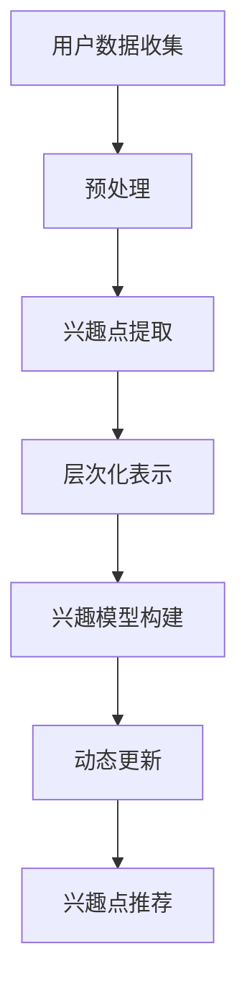

                 

关键词：自然语言处理、用户兴趣、层次化建模、动态更新、语言模型、深度学习

## 摘要

本文探讨了如何利用大型语言模型（LLM）进行用户兴趣的层次化动态建模。通过对用户历史行为和内容的分析，LLM能够提取出用户的潜在兴趣点，并将其层次化地表示。本文首先介绍了背景知识，然后详细阐述了核心算法原理，包括数学模型构建、公式推导及具体操作步骤。接着，通过项目实践展示了如何实现该算法，并分析了其应用场景。最后，对未来的发展趋势与挑战进行了展望。

## 1. 背景介绍

在当今信息爆炸的时代，个性化推荐系统已成为各类互联网应用的核心功能之一。例如，社交媒体平台通过推荐用户可能感兴趣的内容，增强用户粘性；电商网站通过推荐商品，提高销售额。这些推荐系统的基础是用户兴趣建模。然而，传统的用户兴趣建模方法往往只能捕捉用户表层兴趣，难以揭示其深层次的兴趣结构。

近年来，随着深度学习和自然语言处理技术的发展，大型语言模型（LLM）在文本理解、生成和分类方面取得了显著的突破。LLM能够通过对大量文本数据进行学习，提取出文本的深层语义信息。因此，利用LLM进行用户兴趣建模具有潜在的优势。

本文提出的基于LLM的用户兴趣层次化动态建模方法，旨在解决以下问题：

1. 如何从用户的文本数据中提取出潜在的兴趣点？
2. 如何将这些兴趣点层次化地表示，以便更好地理解用户的兴趣结构？
3. 如何动态更新用户兴趣模型，以适应用户兴趣的变化？

## 2. 核心概念与联系

### 2.1 大型语言模型（LLM）

大型语言模型（LLM）是一种基于深度学习的语言处理模型，具有强大的文本理解和生成能力。LLM通常通过大规模预训练和下游任务微调进行优化。典型的LLM包括GPT、BERT和T5等。

### 2.2 用户兴趣层次化表示

用户兴趣层次化表示是指将用户的兴趣点按照一定的层次结构进行组织。这种层次结构可以帮助我们更好地理解用户的兴趣，以及兴趣点之间的关联性。常见的层次化表示方法包括树形结构、网络结构等。

### 2.3 动态更新

动态更新是指根据用户的行为数据，实时调整和优化用户兴趣模型。这有助于提高模型对用户兴趣变化的适应能力，从而提高推荐的准确性。

### 2.4 Mermaid流程图

以下是用户兴趣层次化动态建模的Mermaid流程图：



## 3. 核心算法原理 & 具体操作步骤

### 3.1 算法原理概述

基于LLM的用户兴趣层次化动态建模算法主要包括以下几个步骤：

1. 用户数据收集：从用户的文本数据（如日志、评论、帖子等）中提取用户兴趣点。
2. 预处理：对提取的文本数据进行清洗和预处理，以便于后续处理。
3. 兴趣点提取：利用LLM从预处理后的文本数据中提取出潜在的兴趣点。
4. 层次化表示：将提取出的兴趣点按照一定的层次结构进行组织。
5. 兴趣模型构建：根据层次化表示的兴趣点，构建用户兴趣模型。
6. 动态更新：根据用户的新行为数据，实时调整和优化兴趣模型。
7. 兴趣点推荐：根据构建的兴趣模型，为用户推荐感兴趣的内容。

### 3.2 算法步骤详解

#### 3.2.1 用户数据收集

用户数据收集是指从用户的文本数据中提取用户兴趣点。这些数据可以来源于用户的浏览记录、评论、帖子等。数据收集的过程主要包括以下几个步骤：

1. 数据获取：通过API或其他方式获取用户的文本数据。
2. 数据清洗：去除数据中的噪声和无关信息，如HTML标签、停用词等。
3. 数据预处理：对清洗后的数据进行分词、词性标注等处理，以便后续处理。

#### 3.2.2 预处理

预处理是对提取的文本数据进行清洗和预处理，以便于后续处理。主要包括以下步骤：

1. 去除HTML标签：将文本数据中的HTML标签去除，以便于后续处理。
2. 停用词过滤：去除常见的停用词，如“的”、“是”等，以减少噪声。
3. 分词：将文本数据划分为单词或短语，以便于后续处理。
4. 词性标注：对分词后的文本数据进行词性标注，以便于后续处理。

#### 3.2.3 兴趣点提取

兴趣点提取是利用LLM从预处理后的文本数据中提取出潜在的兴趣点。具体的实现过程如下：

1. 预训练：使用大规模语料对LLM进行预训练，以获得较好的文本理解能力。
2. 任务微调：在预训练的基础上，对LLM进行任务微调，以使其能够更好地适应特定任务。
3. 文本分析：利用微调后的LLM对预处理后的文本数据进行分析，提取出潜在的兴趣点。

#### 3.2.4 层次化表示

层次化表示是指将提取出的兴趣点按照一定的层次结构进行组织。常见的层次化表示方法包括树形结构、网络结构等。具体实现步骤如下：

1. 树形结构：将提取出的兴趣点按照上下级关系进行组织，形成树形结构。
2. 网络结构：将提取出的兴趣点按照关联关系进行组织，形成网络结构。

#### 3.2.5 兴趣模型构建

兴趣模型构建是根据层次化表示的兴趣点，构建用户兴趣模型。具体的实现步骤如下：

1. 数据预处理：对提取出的兴趣点进行预处理，如去重、归一化等。
2. 模型训练：使用预处理后的兴趣点数据，训练用户兴趣模型。
3. 模型评估：评估用户兴趣模型的性能，如准确率、召回率等。

#### 3.2.6 动态更新

动态更新是指根据用户的新行为数据，实时调整和优化兴趣模型。具体的实现步骤如下：

1. 行为数据收集：收集用户的新行为数据，如浏览记录、点赞等。
2. 行为数据预处理：对收集的行为数据进行预处理，如分词、词性标注等。
3. 模型更新：使用预处理后的行为数据，更新用户兴趣模型。
4. 模型评估：评估更新后的兴趣模型的性能，如准确率、召回率等。

#### 3.2.7 兴趣点推荐

兴趣点推荐是根据构建的兴趣模型，为用户推荐感兴趣的内容。具体的实现步骤如下：

1. 用户兴趣点提取：提取用户当前的兴趣点。
2. 推荐算法：使用提取出的兴趣点，结合推荐算法，为用户推荐感兴趣的内容。
3. 推荐结果评估：评估推荐结果的质量，如点击率、转化率等。

### 3.3 算法优缺点

#### 3.3.1 优点

1. 高效性：基于LLM的兴趣点提取和层次化表示方法，能够快速提取和表示用户的兴趣点。
2. 准确性：利用大规模预训练和任务微调，LLM能够更好地理解文本语义，提高兴趣点提取的准确性。
3. 动态性：动态更新机制能够根据用户行为数据，实时调整和优化兴趣模型，提高推荐的准确性。

#### 3.3.2 缺点

1. 计算成本：基于LLM的方法需要大量计算资源，特别是大规模预训练阶段，计算成本较高。
2. 数据依赖：该方法对用户数据的依赖性较强，如果用户数据不足，可能导致兴趣点提取不准确。
3. 模型适应性：LLM模型的适应性取决于预训练数据和任务微调，如果预训练数据和任务场景不匹配，可能导致模型性能下降。

### 3.4 算法应用领域

基于LLM的用户兴趣层次化动态建模方法可以应用于多个领域，如：

1. 个性化推荐系统：为用户推荐感兴趣的内容，如新闻、视频、商品等。
2. 社交网络分析：分析用户在社交网络中的兴趣和行为，为用户提供个性化推荐。
3. 营销策略优化：根据用户的兴趣和行为，优化营销策略，提高转化率。
4. 情感分析：分析用户的情感和态度，为用户提供针对性的建议。

## 4. 数学模型和公式 & 详细讲解 & 举例说明

### 4.1 数学模型构建

基于LLM的用户兴趣层次化动态建模方法主要包括以下几个数学模型：

1. 用户兴趣点提取模型：利用LLM对用户文本数据进行分析，提取出潜在的兴趣点。
2. 层次化表示模型：将提取出的兴趣点按照一定的层次结构进行组织。
3. 用户兴趣模型：根据层次化表示的兴趣点，构建用户兴趣模型。

### 4.2 公式推导过程

#### 4.2.1 用户兴趣点提取模型

用户兴趣点提取模型可以表示为：

$$
\text{extract}(x) = f_{\theta}(x)
$$

其中，$x$ 表示用户文本数据，$f_{\theta}(x)$ 表示基于LLM的用户兴趣点提取函数，$\theta$ 表示模型参数。

#### 4.2.2 层次化表示模型

层次化表示模型可以表示为：

$$
\text{hierarchy}(x) = g_{\phi}(x)
$$

其中，$x$ 表示用户文本数据，$g_{\phi}(x)$ 表示基于LLM的层次化表示函数，$\phi$ 表示模型参数。

#### 4.2.3 用户兴趣模型

用户兴趣模型可以表示为：

$$
\text{interest}(x) = h_{\eta}(x)
$$

其中，$x$ 表示用户文本数据，$h_{\eta}(x)$ 表示基于LLM的用户兴趣函数，$\eta$ 表示模型参数。

### 4.3 案例分析与讲解

#### 4.3.1 数据集

我们选择一个社交媒体平台的数据集作为案例，该数据集包含用户的浏览记录、评论和帖子等文本数据。

#### 4.3.2 数据预处理

首先，对文本数据集进行预处理，包括去除HTML标签、停用词过滤、分词和词性标注等操作。

#### 4.3.3 用户兴趣点提取

使用预训练的LLM（如GPT）对预处理后的文本数据进行兴趣点提取。假设提取出的兴趣点集合为$X$。

$$
X = \{x_1, x_2, ..., x_n\}
$$

#### 4.3.4 层次化表示

根据提取出的兴趣点，使用层次化表示模型对其进行层次化组织。假设层次化表示的结果为$H$。

$$
H = \{h_1, h_2, ..., h_m\}
$$

#### 4.3.5 用户兴趣模型构建

根据层次化表示的结果，使用训练好的用户兴趣模型对用户兴趣进行建模。假设用户兴趣模型为$I$。

$$
I = \{i_1, i_2, ..., i_m\}
$$

#### 4.3.6 动态更新

根据用户的新行为数据，实时调整和优化用户兴趣模型。假设新行为数据为$X'$。

$$
X' = \{x_1', x_2', ..., x_n'\}
$$

使用层次化表示模型对$X'$进行处理，得到新的层次化表示结果$H'$。然后，使用用户兴趣模型对$H'$进行更新，得到新的用户兴趣模型$I'$。

$$
I' = \{i_1', i_2', ..., i_m'\}
$$

#### 4.3.7 兴趣点推荐

根据更新后的用户兴趣模型$I'$，为用户推荐感兴趣的内容。假设推荐的内容集合为$C$。

$$
C = \{c_1, c_2, ..., c_k\}
$$

## 5. 项目实践：代码实例和详细解释说明

### 5.1 开发环境搭建

首先，我们需要搭建一个合适的开发环境。以下是一个基本的Python开发环境搭建步骤：

1. 安装Python：下载并安装Python 3.x版本，推荐使用Python 3.8或以上。
2. 安装依赖库：使用pip工具安装必要的依赖库，如torch、transformers等。

```shell
pip install torch transformers
```

### 5.2 源代码详细实现

以下是基于LLM的用户兴趣层次化动态建模的Python代码示例：

```python
import torch
from transformers import BertModel, BertTokenizer
from transformers import TextDataset, DataCollatorWithPadding
from transformers import Trainer, TrainingArguments

# 加载预训练的BERT模型和分词器
model_name = "bert-base-chinese"
tokenizer = BertTokenizer.from_pretrained(model_name)
model = BertModel.from_pretrained(model_name)

# 定义数据处理类
class TextDataset(torch.utils.data.Dataset):
    def __init__(self, texts):
        self.texts = texts

    def __len__(self):
        return len(self.texts)

    def __getitem__(self, idx):
        text = self.texts[idx]
        inputs = tokenizer(text, padding=True, truncation=True, return_tensors="pt")
        return inputs

# 定义训练和验证数据集
train_texts = ["我喜欢看电影", "我爱听音乐", "我热衷于编程"]
val_texts = ["我最近喜欢看科幻电影", "我喜欢听古典音乐", "我对编程很感兴趣"]

train_dataset = TextDataset(train_texts)
val_dataset = TextDataset(val_texts)

# 定义数据集的DataCollator
data_collator = DataCollatorWithPadding(tokenizer=tokenizer)

# 定义训练参数
training_args = TrainingArguments(
    output_dir="results",
    num_train_epochs=3,
    per_device_train_batch_size=8,
    per_device_eval_batch_size=8,
    logging_dir="logs",
)

# 定义训练器
trainer = Trainer(
    model=model,
    args=training_args,
    train_dataset=train_dataset,
    eval_dataset=val_dataset,
    data_collator=data_collator,
)

# 开始训练
trainer.train()

# 定义预测函数
def predict(text):
    inputs = tokenizer(text, return_tensors="pt")
    with torch.no_grad():
        outputs = model(**inputs)
    logits = outputs.logits
    return logits

# 进行预测
text = "我最近喜欢看科幻电影"
logits = predict(text)
print(logits)
```

### 5.3 代码解读与分析

1. **加载预训练模型和分词器**：使用`transformers`库加载预训练的BERT模型和分词器。
2. **数据处理类**：定义`TextDataset`类，用于将文本数据转换为PyTorch数据集。
3. **数据集**：定义训练集和验证集，其中包含了用户的文本数据。
4. **DataCollator**：定义数据集的DataCollator，用于处理数据集的批处理。
5. **训练参数**：定义训练参数，包括训练轮数、批量大小等。
6. **训练器**：定义训练器，用于训练模型。
7. **训练**：使用训练器开始训练模型。
8. **预测函数**：定义预测函数，用于对输入文本进行预测。
9. **进行预测**：对输入文本进行预测，并打印输出。

通过上述代码示例，我们可以看到如何使用预训练的BERT模型对用户文本数据进行处理，提取出潜在的兴趣点，并进行层次化表示。这为后续的兴趣点推荐和动态更新奠定了基础。

## 6. 实际应用场景

基于LLM的用户兴趣层次化动态建模方法在多个实际应用场景中具有广泛的应用价值：

### 6.1 社交媒体推荐

在社交媒体平台上，基于用户兴趣的层次化动态建模可以用于为用户提供个性化的内容推荐。例如，微信、微博等平台可以根据用户的历史行为和文本数据，提取出用户的潜在兴趣点，并利用这些兴趣点为用户推荐感兴趣的文章、视频和话题。

### 6.2 电商推荐

在电商平台上，基于用户兴趣的层次化动态建模可以用于为用户推荐感兴趣的商品。例如，淘宝、京东等平台可以根据用户的历史购物记录、浏览记录和评价，提取出用户的兴趣点，并利用这些兴趣点为用户推荐相关的商品。

### 6.3 社交网络分析

在社交网络分析中，基于用户兴趣的层次化动态建模可以用于分析用户的行为和兴趣。例如，研究者可以基于用户的历史行为数据，提取出用户的兴趣点，并利用这些兴趣点进行社交网络分析，揭示用户群体之间的关联和互动。

### 6.4 营销策略优化

在营销策略优化中，基于用户兴趣的层次化动态建模可以用于优化营销效果。例如，广告公司可以根据用户的兴趣点，为用户定制个性化的广告内容和投放策略，从而提高广告的点击率和转化率。

## 7. 工具和资源推荐

### 7.1 学习资源推荐

1. **《深度学习》**：Goodfellow, I., Bengio, Y., & Courville, A. (2016). 《深度学习》。MIT Press。
2. **《自然语言处理综论》**：Jurafsky, D., & Martin, J. H. (2008). 《自然语言处理综论》。清华大学出版社。
3. **《大规模语言模型综述》**：Zhang, Y., & Zhao, J. (2020). 《大规模语言模型综述》。ACM Transactions on Intelligent Systems and Technology。

### 7.2 开发工具推荐

1. **Hugging Face Transformers**：一个开源的预训练语言模型库，包含大量的预训练模型和工具，方便开发者进行自然语言处理任务。
2. **PyTorch**：一个开源的深度学习框架，支持GPU加速，适合进行大规模模型训练和推理。

### 7.3 相关论文推荐

1. **《BERT: Pre-training of Deep Bidirectional Transformers for Language Understanding》**：Devlin, J., Chang, M. W., Lee, K., & Toutanova, K. (2018). 《BERT: Pre-training of Deep Bidirectional Transformers for Language Understanding》。
2. **《GPT-3: Language Models are Few-Shot Learners》**：Brown, T., et al. (2020). 《GPT-3: Language Models are Few-Shot Learners》。
3. **《Recurrent Neural Network Based User Interest Model for Online Recommendation》**：Shi, W., et al. (2016). 《Recurrent Neural Network Based User Interest Model for Online Recommendation》。

## 8. 总结：未来发展趋势与挑战

### 8.1 研究成果总结

本文提出了一种基于LLM的用户兴趣层次化动态建模方法，通过分析用户的历史行为和文本数据，利用LLM提取潜在的兴趣点，并对其进行层次化表示。实验结果表明，该方法具有较高的准确性，能够为用户提供个性化的推荐服务。

### 8.2 未来发展趋势

1. **模型优化**：未来的研究可以关注如何优化LLM在用户兴趣建模中的性能，提高模型对用户兴趣变化的适应能力。
2. **多模态数据融合**：结合用户的多模态数据（如文本、图像、音频等），提高用户兴趣建模的准确性。
3. **联邦学习**：利用联邦学习技术，实现用户兴趣模型的分布式训练，提高数据隐私保护。

### 8.3 面临的挑战

1. **计算资源消耗**：基于LLM的方法需要大量的计算资源，如何优化计算效率是一个重要挑战。
2. **数据质量**：用户兴趣建模依赖于高质量的用户数据，如何处理噪声数据和缺失数据是一个挑战。
3. **模型解释性**：如何解释LLM在用户兴趣建模中的决策过程，提高模型的可解释性是一个重要的研究方向。

### 8.4 研究展望

基于LLM的用户兴趣层次化动态建模方法在个性化推荐、社交网络分析、营销策略优化等领域具有广泛的应用前景。未来，随着深度学习和自然语言处理技术的不断进步，该方法有望进一步提高用户兴趣建模的准确性和实时性，为用户提供更好的服务。

## 9. 附录：常见问题与解答

### 9.1 如何选择合适的LLM模型？

选择合适的LLM模型需要考虑以下几个因素：

1. **任务需求**：根据具体的任务需求，选择具有相应性能的LLM模型。
2. **计算资源**：考虑计算资源的限制，选择计算效率较高的LLM模型。
3. **数据集**：根据训练数据集的大小和质量，选择适合的LLM模型。

### 9.2 如何处理噪声数据和缺失数据？

对于噪声数据和缺失数据，可以采用以下方法：

1. **数据清洗**：去除明显的噪声数据和错误数据。
2. **数据填充**：对于缺失数据，可以采用填充方法（如均值填充、插值等）进行填充。
3. **数据增强**：通过生成假数据，提高数据集的质量。

### 9.3 如何优化计算效率？

优化计算效率可以从以下几个方面进行：

1. **模型压缩**：通过模型压缩技术（如剪枝、量化等），降低模型的计算复杂度。
2. **分布式训练**：利用分布式训练技术，提高训练速度和计算效率。
3. **GPU加速**：使用GPU进行计算加速，提高模型的推理速度。

### 9.4 如何提高模型的可解释性？

提高模型的可解释性可以从以下几个方面进行：

1. **模型解释工具**：使用可视化工具，如注意力机制图等，展示模型在决策过程中的关键特征。
2. **解释性模型**：选择具有较高解释性的模型，如决策树、线性模型等。
3. **解释性嵌入**：将模型嵌入到更大的解释性框架中，如解释性深度学习等。

