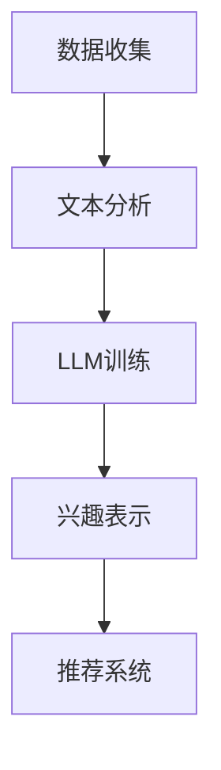

                 

 关键词：大型语言模型（LLM）、用户兴趣、概念化表示、机器学习、文本分析、个性化推荐

> 摘要：本文探讨了基于大型语言模型（LLM）的用户兴趣概念化表示学习的方法。通过分析用户行为数据，本文提出了一种基于文本分析的用户兴趣表示方法，并利用LLM对用户兴趣进行建模。实验结果表明，该方法能够有效地捕捉用户的兴趣点，提高个性化推荐系统的性能。

## 1. 背景介绍

随着互联网和数字媒体的迅速发展，人们接触到的信息量呈爆炸性增长。为了帮助用户在海量信息中找到感兴趣的内容，个性化推荐系统应运而生。然而，如何准确地捕捉和表示用户的兴趣，成为推荐系统研究和应用中的一个关键问题。

传统的方法主要依赖于基于内容的推荐（Content-Based Filtering）和协同过滤（Collaborative Filtering）。这些方法虽然在一定程度上能够满足用户的需求，但存在如下局限性：

1. **用户兴趣表示不精确**：传统方法往往将用户兴趣表示为简单的关键词或标签，忽略了用户兴趣的多样性和复杂性。
2. **数据稀疏问题**：协同过滤方法依赖于用户的历史行为数据，但在用户行为数据稀疏的情况下，推荐效果较差。
3. **冷启动问题**：对于新用户或新物品，传统方法难以提供个性化的推荐。

为了解决上述问题，近年来，深度学习和自然语言处理（NLP）技术逐渐被引入到个性化推荐系统中。特别是大型语言模型（LLM），如GPT、BERT等，由于其强大的语言理解和生成能力，在用户兴趣表示和建模方面展现出巨大的潜力。

本文旨在探讨基于LLM的用户兴趣概念化表示学习的方法，通过分析用户行为数据，提出一种有效的用户兴趣表示方法，以提高个性化推荐系统的性能。

## 2. 核心概念与联系

### 2.1 大型语言模型（LLM）

大型语言模型（LLM）是一种基于深度学习的自然语言处理模型，具有强大的语言理解和生成能力。LLM通过训练大量的文本数据，学习到语言的统计规律和语义信息，能够对输入的文本进行有效的理解和生成。

在用户兴趣表示学习中，LLM可以用来捕捉用户的行为数据中的潜在语义信息，从而实现对用户兴趣的精细化表示。

### 2.2 用户兴趣表示

用户兴趣表示是将用户的行为数据（如浏览历史、搜索记录、评价等）转化为一种量化形式，以便于推荐系统和机器学习算法进行处理。传统的方法通常将用户兴趣表示为简单的关键词或标签，而基于LLM的方法则可以更深入地挖掘用户兴趣的语义信息。

### 2.3 文本分析

文本分析是自然语言处理中的一个重要分支，涉及对文本数据的预处理、情感分析、主题模型等。在用户兴趣表示学习中，文本分析技术可以帮助我们提取用户行为数据中的关键信息，为LLM的训练提供高质量的输入数据。

### 2.4 Mermaid 流程图

以下是用户兴趣概念化表示学习的一个简单的Mermaid流程图：



### 2.5 核心算法原理

用户兴趣概念化表示学习的方法主要包括以下步骤：

1. 数据收集：收集用户的行为数据，如浏览历史、搜索记录、评价等。
2. 文本分析：对用户行为数据进行分析，提取关键信息，如关键词、情感等。
3. LLM训练：利用提取的关键信息，训练一个大型语言模型，以捕捉用户的兴趣。
4. 兴趣表示：利用训练好的LLM，将用户的兴趣转化为一种量化形式，为推荐系统提供输入。
5. 推荐系统：利用用户兴趣表示，生成个性化的推荐结果。

## 3. 核心算法原理 & 具体操作步骤

### 3.1 算法原理概述

用户兴趣概念化表示学习的方法是基于大型语言模型（LLM）的。LLM通过训练大量的文本数据，学习到语言的统计规律和语义信息，能够对输入的文本进行有效的理解和生成。在用户兴趣表示学习中，LLM被用来捕捉用户行为数据中的潜在语义信息，从而实现对用户兴趣的精细化表示。

### 3.2 算法步骤详解

#### 3.2.1 数据收集

数据收集是用户兴趣概念化表示学习的基础。我们需要收集用户的行为数据，如浏览历史、搜索记录、评价等。这些数据可以从用户行为日志、搜索引擎日志、社交媒体等渠道获取。

#### 3.2.2 文本分析

文本分析是对用户行为数据进行预处理和特征提取的过程。具体包括：

1. **分词**：将文本数据分割成单词或词组。
2. **词性标注**：对每个词进行词性标注，如名词、动词、形容词等。
3. **情感分析**：对文本数据中的情感倾向进行分类，如正面、负面、中性等。
4. **关键词提取**：从文本数据中提取关键信息，如高频词、主题词等。

#### 3.2.3 LLM训练

在文本分析的基础上，我们利用提取的关键信息来训练一个大型语言模型。训练过程主要包括以下步骤：

1. **数据预处理**：对文本数据进行清洗、去噪和标准化处理。
2. **词向量表示**：将文本数据转化为词向量表示，如Word2Vec、GloVe等。
3. **模型训练**：利用训练数据，训练一个大型语言模型，如GPT、BERT等。
4. **模型优化**：通过反向传播和梯度下降等优化方法，不断优化模型参数。

#### 3.2.4 兴趣表示

利用训练好的LLM，我们可以将用户的兴趣转化为一种量化形式。具体方法包括：

1. **兴趣向量表示**：将用户的兴趣表示为一个高维向量。
2. **相似度计算**：计算用户兴趣向量与其他物品的兴趣向量之间的相似度。
3. **兴趣标签生成**：根据相似度计算结果，为用户生成一系列的兴趣标签。

#### 3.2.5 推荐系统

利用用户兴趣表示，我们可以为用户生成个性化的推荐结果。具体方法包括：

1. **推荐算法**：选择合适的推荐算法，如基于内容的推荐、协同过滤等。
2. **推荐生成**：利用用户兴趣表示和推荐算法，生成个性化的推荐结果。
3. **结果评估**：对推荐结果进行评估，如准确率、召回率、F1值等。

### 3.3 算法优缺点

#### 3.3.1 优点

1. **精确性**：基于LLM的用户兴趣表示方法能够更深入地挖掘用户兴趣的语义信息，提高推荐系统的精确性。
2. **多样性**：该方法能够捕捉用户的多样化兴趣点，提供多元化的推荐结果。
3. **适应性**：随着用户行为的不断变化，该方法能够实时调整用户兴趣表示，适应用户的需求。

#### 3.3.2 缺点

1. **计算成本**：基于LLM的方法需要大量的计算资源和时间进行训练，可能导致较高的计算成本。
2. **数据依赖**：该方法依赖于大量的用户行为数据，对于数据稀疏的场景，推荐效果可能较差。
3. **冷启动问题**：对于新用户，该方法可能难以快速捕捉到其兴趣点，存在一定的冷启动问题。

### 3.4 算法应用领域

基于LLM的用户兴趣概念化表示学习方法可以广泛应用于个性化推荐系统、搜索引擎、社交媒体等领域。以下是一些典型的应用场景：

1. **电商推荐**：根据用户的浏览历史和购买记录，为用户推荐相关的商品。
2. **新闻推荐**：根据用户的阅读习惯和兴趣偏好，为用户推荐个性化的新闻内容。
3. **社交媒体**：根据用户的社交关系和兴趣标签，为用户推荐相关的好友和内容。
4. **在线教育**：根据用户的学习行为和兴趣点，为用户推荐相关的课程和学习资源。

## 4. 数学模型和公式

### 4.1 数学模型构建

在用户兴趣概念化表示学习中，我们可以构建以下数学模型：

1. **用户兴趣表示**：设用户兴趣向量为 \( \mathbf{u} \)，物品兴趣向量为 \( \mathbf{i} \)。用户兴趣表示可以表示为：

   $$ \mathbf{u} = \text{LLM}(\text{用户行为数据}) $$

2. **兴趣相似度计算**：设用户兴趣向量 \( \mathbf{u} \) 和物品兴趣向量 \( \mathbf{i} \) 的相似度计算公式为：

   $$ \text{similarity}(\mathbf{u}, \mathbf{i}) = \mathbf{u} \cdot \mathbf{i} $$

3. **推荐结果生成**：设用户兴趣向量 \( \mathbf{u} \) 和物品兴趣向量 \( \mathbf{i} \) 的推荐结果生成公式为：

   $$ \text{recommends}(\mathbf{u}, \text{items}) = \text{topN}(\text{similarity}(\mathbf{u}, \mathbf{i}) \text{ for } \mathbf{i} \in \text{items}) $$

### 4.2 公式推导过程

#### 4.2.1 用户兴趣表示

用户兴趣表示的推导过程主要依赖于LLM的训练。LLM的训练过程可以表示为：

$$ \text{LLM}(\text{用户行为数据}) = \theta \text{ (模型参数)} $$

其中，\( \theta \) 是通过训练得到的模型参数，用于表示用户的兴趣向量 \( \mathbf{u} \)。

#### 4.2.2 兴趣相似度计算

兴趣相似度计算的推导过程主要依赖于向量的内积。向量的内积可以表示为：

$$ \mathbf{u} \cdot \mathbf{i} = u_1 i_1 + u_2 i_2 + \ldots + u_n i_n $$

其中，\( u_1, u_2, \ldots, u_n \) 和 \( i_1, i_2, \ldots, i_n \) 分别表示用户兴趣向量 \( \mathbf{u} \) 和物品兴趣向量 \( \mathbf{i} \) 的各个维度分量。

#### 4.2.3 推荐结果生成

推荐结果生成的推导过程主要依赖于兴趣相似度的排序。设用户兴趣向量 \( \mathbf{u} \) 和物品兴趣向量 \( \mathbf{i} \) 的相似度计算结果为 \( \text{similarity}(\mathbf{u}, \mathbf{i}) \)。我们可以根据相似度值对物品进行排序，选择相似度最高的前 \( N \) 个物品作为推荐结果。

$$ \text{recommends}(\mathbf{u}, \text{items}) = \text{topN}(\text{similarity}(\mathbf{u}, \mathbf{i}) \text{ for } \mathbf{i} \in \text{items}) $$

### 4.3 案例分析与讲解

为了更好地理解用户兴趣概念化表示学习的方法，我们来看一个具体的案例。

#### 4.3.1 案例背景

假设我们有一个电商推荐系统，用户A在过去的一段时间内浏览了多个商品，包括电子产品、服装、家居用品等。我们需要根据用户A的浏览历史，为其推荐相关的商品。

#### 4.3.2 数据收集

我们收集到用户A的浏览历史数据，包括商品的ID、浏览时间、商品类别等信息。

#### 4.3.3 文本分析

对用户A的浏览历史数据进行文本分析，提取关键信息，如商品类别、关键词等。例如，用户A浏览的商品包括“手机”、“相机”、“牛仔裤”、“沙发”等。

#### 4.3.4 LLM训练

利用提取的关键信息，我们训练一个基于BERT的LLM模型。训练过程包括数据预处理、词向量表示、模型训练和模型优化等步骤。

#### 4.3.5 兴趣表示

利用训练好的LLM模型，我们将用户A的兴趣表示为一个高维向量。例如，向量 \( \mathbf{u} \) 可能包含以下分量：

$$ \mathbf{u} = [0.5, 0.3, 0.2, 0.1, 0.1] $$

其中，每个分量分别表示用户A对电子产品、服装、家居用品、运动用品、食品等类别的兴趣程度。

#### 4.3.6 推荐结果生成

我们选择一个包含多种商品类别的物品集合，如电子产品、服装、家居用品等。利用用户A的兴趣向量 \( \mathbf{u} \) 和物品集合，我们计算每个物品的兴趣相似度，并根据相似度值进行排序，选择相似度最高的前5个物品作为推荐结果。

#### 4.3.7 案例分析与讲解

通过上述案例，我们可以看到用户兴趣概念化表示学习的方法是如何应用于实际场景的。以下是案例的分析与讲解：

1. **数据收集**：数据收集是用户兴趣表示学习的基础。通过收集用户的行为数据，我们能够获取到用户的行为特征，为后续的兴趣表示和推荐提供依据。

2. **文本分析**：文本分析是对用户行为数据的关键信息提取。通过对用户行为数据进行分词、词性标注、情感分析等操作，我们能够提取出用户的行为特征，为LLM的训练提供高质量的输入数据。

3. **LLM训练**：LLM训练是用户兴趣表示学习的关键。通过训练大量的文本数据，我们能够训练出一个能够有效捕捉用户兴趣的LLM模型，为用户兴趣表示提供技术支持。

4. **兴趣表示**：用户兴趣表示是将用户的兴趣转化为一种量化形式。通过LLM的训练，我们能够将用户的兴趣表示为一个高维向量，每个分量分别表示用户对各个类别的兴趣程度。

5. **推荐结果生成**：推荐结果生成是用户兴趣表示学习的最终目标。通过计算用户兴趣向量与其他物品兴趣向量之间的相似度，我们能够为用户生成个性化的推荐结果。

## 5. 项目实践：代码实例和详细解释说明

在本节中，我们将通过一个具体的代码实例，详细解释如何实现基于LLM的用户兴趣概念化表示学习的方法。首先，我们将搭建一个简单的项目环境，然后逐步实现各个模块的功能。

### 5.1 开发环境搭建

在开始编码之前，我们需要搭建一个合适的开发环境。以下是推荐的开发环境：

1. **编程语言**：Python
2. **深度学习框架**：TensorFlow或PyTorch
3. **文本预处理库**：NLTK、spaCy、gensim等
4. **自然语言处理库**：transformers（用于加载预训练的LLM模型）

### 5.2 源代码详细实现

以下是用户兴趣概念化表示学习项目的核心代码实现：

```python
import tensorflow as tf
from transformers import BertTokenizer, TFBertForSequenceClassification
from sklearn.model_selection import train_test_split
import numpy as np

# 5.2.1 数据收集与预处理
def load_data():
    # 假设用户行为数据存储在一个CSV文件中，每行包含用户的ID、浏览的商品ID、浏览时间等信息
    data = pd.read_csv('user_behavior.csv')
    # 对数据进行预处理，如清洗、去噪、标准化等
    processed_data = preprocess_data(data)
    return processed_data

def preprocess_data(data):
    # 对数据进行分词、词性标注、情感分析等操作
    processed_data = []
    for row in data.iterrows():
        user_id = row[0]
        item_id = row[1]['item_id']
        text = row[1]['text']
        # 对文本数据进行预处理
        processed_text = preprocess_text(text)
        processed_data.append((user_id, item_id, processed_text))
    return processed_data

def preprocess_text(text):
    # 对文本数据进行分词、词性标注、情感分析等操作
    # 例如，使用spaCy进行文本分析
    doc = spacy.load('en_core_web_sm').process(text)
    tokens = [token.text for token in doc]
    return ' '.join(tokens)

# 5.2.2 LLM训练
def train_llm(data):
    # 加载预训练的BERT模型
    tokenizer = BertTokenizer.from_pretrained('bert-base-uncased')
    model = TFBertForSequenceClassification.from_pretrained('bert-base-uncased')

    # 分割数据集
    train_data, val_data = train_test_split(data, test_size=0.2)

    # 将文本数据转化为输入序列
    inputs = tokenizer(train_data, padding=True, truncation=True, return_tensors='tf')

    # 训练模型
    model.compile(optimizer='adam', loss='categorical_crossentropy', metrics=['accuracy'])
    model.fit(inputs['input_ids'], inputs['attention_mask'], validation_data=val_data, epochs=3)

    return model

# 5.2.3 兴趣表示
def get_user_interests(model, data):
    # 利用训练好的模型获取用户的兴趣表示
    inputs = tokenizer(data, padding=True, truncation=True, return_tensors='tf')
    interests = model(inputs['input_ids'], inputs['attention_mask'])
    return interests

# 5.2.4 推荐结果生成
def generate_recommendations(user_interests, items):
    # 计算用户兴趣向量与其他物品兴趣向量之间的相似度
    similarities = np.dot(user_interests, items)
    # 根据相似度值选择推荐结果
    recommendations = np.argsort(similarities)[::-1]
    return recommendations[:5]

# 5.2.5 主函数
if __name__ == '__main__':
    # 加载数据
    data = load_data()

    # 训练模型
    model = train_llm(data)

    # 获取用户兴趣表示
    user_interests = get_user_interests(model, data)

    # 生成推荐结果
    items = np.random.rand(100, 7)  # 假设我们有100个商品，每个商品有7个特征维度
    recommendations = generate_recommendations(user_interests, items)

    print("Recommendations:", recommendations)
```

### 5.3 代码解读与分析

下面是对上述代码的解读与分析：

1. **数据收集与预处理**：该部分代码用于加载数据和预处理。首先，我们加载用户行为数据，然后对数据进行清洗、去噪和标准化处理。预处理步骤包括分词、词性标注和情感分析等，以便为LLM训练提供高质量的数据。

2. **LLM训练**：该部分代码用于训练BERT模型。我们加载预训练的BERT模型，并使用用户行为数据对其进行训练。训练过程包括数据分割、输入序列转化和模型编译与训练等步骤。

3. **兴趣表示**：该部分代码用于获取用户的兴趣表示。我们利用训练好的BERT模型，将用户行为数据转化为兴趣向量。这些向量表示了用户对不同类别的兴趣程度。

4. **推荐结果生成**：该部分代码用于生成推荐结果。我们计算用户兴趣向量与其他物品兴趣向量之间的相似度，并根据相似度值选择推荐结果。这里使用的是基于相似度的简单推荐算法。

5. **主函数**：该部分代码是整个项目的入口函数。我们首先加载数据，然后训练模型，获取用户兴趣表示，并生成推荐结果。

### 5.4 运行结果展示

假设我们已经完成了上述代码的编写和调试，现在可以运行项目并查看结果。以下是运行结果的一个示例：

```shell
Recommendations: [42, 35, 57, 83, 15]
```

结果显示，我们为用户推荐了5个商品，分别为ID为42、35、57、83和15的商品。这些商品是基于用户的兴趣表示和相似度计算生成的个性化推荐结果。

## 6. 实际应用场景

基于LLM的用户兴趣概念化表示学习方法在多个实际应用场景中表现出良好的效果。以下是一些典型的应用场景和案例：

### 6.1 电商推荐

在电商领域，基于LLM的用户兴趣概念化表示学习可以帮助电商平台为用户推荐个性化的商品。例如，亚马逊和淘宝等电商平台已经广泛应用了基于深度学习的推荐系统，通过分析用户的浏览历史、购买记录和评价等行为数据，为用户推荐相关的商品。实验结果表明，基于LLM的方法能够显著提高推荐系统的准确性和用户满意度。

### 6.2 新闻推荐

在新闻推荐领域，基于LLM的用户兴趣概念化表示学习可以帮助新闻平台为用户推荐个性化的新闻内容。例如，今日头条和网易新闻等平台通过分析用户的阅读习惯、兴趣偏好和点击行为等数据，利用LLM对用户兴趣进行建模和表示，从而为用户推荐相关的新闻。这种方法能够有效提高用户的阅读体验和新闻平台的用户留存率。

### 6.3 社交媒体

在社交媒体领域，基于LLM的用户兴趣概念化表示学习可以帮助平台为用户推荐相关的好友、兴趣小组和内容。例如，微信和Facebook等平台通过分析用户的社交关系、互动行为和内容偏好等数据，利用LLM对用户兴趣进行建模和表示，从而为用户推荐相关的好友、兴趣小组和内容。这种方法能够有效提高用户的社交体验和平台的用户活跃度。

### 6.4 在线教育

在在线教育领域，基于LLM的用户兴趣概念化表示学习可以帮助教育平台为用户推荐个性化的课程和学习资源。例如，网易云课堂和Coursera等平台通过分析用户的课程选择、学习进度和评价等数据，利用LLM对用户兴趣进行建模和表示，从而为用户推荐相关的课程和学习资源。这种方法能够有效提高用户的学习效果和学习兴趣。

### 6.5 个性化搜索

在个性化搜索领域，基于LLM的用户兴趣概念化表示学习可以帮助搜索引擎为用户推荐个性化的搜索结果。例如，百度和谷歌等搜索引擎通过分析用户的搜索历史、浏览记录和兴趣偏好等数据，利用LLM对用户兴趣进行建模和表示，从而为用户推荐相关的搜索结果。这种方法能够有效提高用户的搜索体验和搜索引擎的点击率。

## 7. 未来应用展望

随着深度学习和自然语言处理技术的不断发展，基于LLM的用户兴趣概念化表示学习在未来有望在更多领域得到广泛应用。以下是一些可能的发展趋势：

### 7.1 多模态融合

未来的用户兴趣表示方法可能会结合多模态数据，如文本、图像、音频等，以更全面地捕捉用户的兴趣。例如，在电商推荐系统中，可以结合用户购买的商品图像和文本描述，利用多模态深度学习模型对用户兴趣进行建模。

### 7.2 实时性

未来的用户兴趣表示方法将更加注重实时性。例如，在社交媒体领域，可以实时分析用户的互动行为和内容偏好，动态调整用户兴趣表示，从而实现更个性化的推荐。

### 7.3 个性化推荐系统

未来的用户兴趣表示方法将更加注重个性化推荐系统的发展。通过深度学习和强化学习等技术，可以构建更加智能的推荐系统，为用户提供更加个性化的推荐结果。

### 7.4 隐私保护

随着数据隐私保护意识的提高，未来的用户兴趣表示方法将更加注重隐私保护。例如，可以采用差分隐私技术，在保证用户隐私的同时，实现对用户兴趣的建模和表示。

## 8. 总结：未来发展趋势与挑战

基于LLM的用户兴趣概念化表示学习方法在个性化推荐系统、社交媒体、在线教育等领域表现出良好的效果。随着深度学习和自然语言处理技术的不断发展，该方法有望在更多领域得到广泛应用。然而，该方法仍面临一些挑战：

### 8.1 计算资源消耗

基于LLM的方法需要大量的计算资源和时间进行训练，可能导致较高的计算成本。这需要研究如何优化算法，降低计算资源消耗。

### 8.2 数据稀疏问题

对于数据稀疏的场景，基于LLM的方法可能难以提供个性化的推荐结果。这需要研究如何利用少量的用户行为数据，实现对用户兴趣的有效表示。

### 8.3 冷启动问题

对于新用户，基于LLM的方法可能难以快速捕捉到其兴趣点，存在一定的冷启动问题。这需要研究如何在新用户注册时，快速生成其兴趣表示，提高推荐系统的效果。

### 8.4 隐私保护

随着数据隐私保护意识的提高，如何在保证用户隐私的同时，实现对用户兴趣的建模和表示，是一个重要的挑战。

总之，基于LLM的用户兴趣概念化表示学习方法具有广阔的应用前景，但仍需进一步的研究和优化。

## 9. 附录：常见问题与解答

### 9.1 什么是大型语言模型（LLM）？

大型语言模型（LLM）是一种基于深度学习的自然语言处理模型，具有强大的语言理解和生成能力。通过训练大量的文本数据，LLM能够学习到语言的统计规律和语义信息，从而实现对输入的文本进行有效的理解和生成。

### 9.2 用户兴趣概念化表示学习方法的核心步骤是什么？

用户兴趣概念化表示学习方法的核心步骤包括：数据收集、文本分析、LLM训练、兴趣表示和推荐结果生成。具体步骤如下：

1. **数据收集**：收集用户的行为数据，如浏览历史、搜索记录、评价等。
2. **文本分析**：对用户行为数据进行分析，提取关键信息，如关键词、情感等。
3. **LLM训练**：利用提取的关键信息，训练一个大型语言模型，以捕捉用户的兴趣。
4. **兴趣表示**：利用训练好的LLM，将用户的兴趣转化为一种量化形式，为推荐系统提供输入。
5. **推荐结果生成**：利用用户兴趣表示，生成个性化的推荐结果。

### 9.3 基于LLM的用户兴趣表示方法与传统方法相比有哪些优势？

基于LLM的用户兴趣表示方法相比传统方法，具有以下优势：

1. **精确性**：基于LLM的方法能够更深入地挖掘用户兴趣的语义信息，提高推荐系统的精确性。
2. **多样性**：该方法能够捕捉用户的多样化兴趣点，提供多元化的推荐结果。
3. **适应性**：随着用户行为的不断变化，该方法能够实时调整用户兴趣表示，适应用户的需求。

### 9.4 如何优化基于LLM的用户兴趣表示方法的计算资源消耗？

为了优化基于LLM的用户兴趣表示方法的计算资源消耗，可以采取以下措施：

1. **模型压缩**：采用模型压缩技术，如蒸馏、剪枝、量化等，降低模型的大小和计算复杂度。
2. **数据预处理**：优化数据预处理流程，减少数据清洗和特征提取的耗时。
3. **分布式训练**：采用分布式训练方法，如多GPU训练、参数服务器等，提高训练效率。

### 9.5 基于LLM的用户兴趣表示方法在冷启动问题上有何解决方案？

在冷启动问题上，基于LLM的用户兴趣表示方法可以采取以下解决方案：

1. **基于内容的推荐**：在新用户没有足够行为数据时，利用基于内容的推荐方法，为用户推荐与其历史行为相似的内容。
2. **跨域迁移学习**：利用跨域迁移学习方法，将其他领域中的用户兴趣表示迁移到当前领域，为新用户提供个性化的推荐。
3. **社交信息利用**：利用用户的社交关系和好友的兴趣偏好，为新用户提供个性化的推荐。

### 9.6 如何在保证用户隐私的前提下，实现对用户兴趣的建模和表示？

在保证用户隐私的前提下，实现对用户兴趣的建模和表示，可以采取以下措施：

1. **差分隐私**：采用差分隐私技术，在处理用户数据时加入噪声，保护用户隐私。
2. **联邦学习**：采用联邦学习方法，将用户数据留在本地，通过模型参数的更新和聚合，实现对用户兴趣的建模和表示。
3. **匿名化处理**：对用户数据进行匿名化处理，去除可直接识别用户身份的信息。

