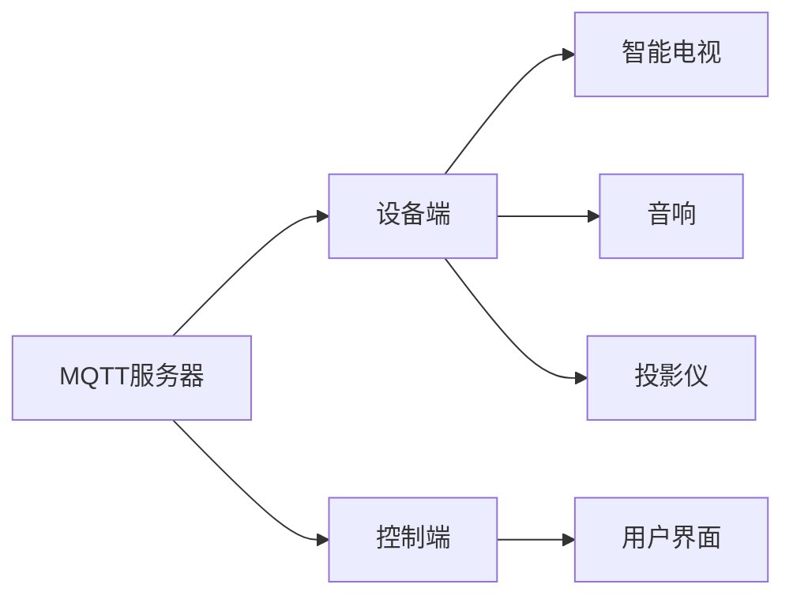

                 

关键词：MQTT协议、RESTful API、家庭娱乐、自动化控制、系统集成、物联网

> 摘要：本文深入探讨了基于MQTT协议和RESTful API的家庭娱乐自动化控制系统的设计与实现，分析了该系统在家庭娱乐场景下的应用价值与优势，并展望了其在未来物联网环境中的发展前景。

## 1. 背景介绍

随着物联网技术的快速发展，家庭自动化系统逐渐成为智能家居领域的研究热点。家庭娱乐自动化控制系统作为智能家居的重要组成部分，旨在通过智能化的手段实现家庭娱乐设备的自动化管理，提高用户的体验和便利性。

家庭娱乐自动化控制系统需要解决的主要问题是设备之间的通信与控制。传统的通信协议如HTTP/HTTPS存在带宽占用高、实时性差等问题，而MQTT协议作为一种轻量级的消息队列协议，具有低延迟、低带宽占用、支持物联网设备等特点，非常适合家庭娱乐自动化控制系统的需求。

另一方面，RESTful API作为一种基于HTTP协议的接口设计规范，可以实现设备间的数据交互与控制。结合MQTT协议，RESTful API可以提供一种高效、灵活的通信方式，从而实现家庭娱乐设备的自动化控制。

## 2. 核心概念与联系

家庭娱乐自动化控制系统的核心概念包括MQTT协议、RESTful API、设备端和控制端。以下是这些概念之间的联系以及系统的整体架构图。

### 2.1 MQTT协议

MQTT（Message Queuing Telemetry Transport）是一种轻量级的消息传输协议，适用于远程实时数据的传输。其主要特点包括：

- **发布/订阅模式**：设备可以发布消息到特定的主题，其他设备可以订阅这些主题以接收消息。
- **服务质量（QoS）**：MQTT协议支持三个不同的服务质量等级，以确保消息的可靠传输。
- **低带宽占用**：MQTT协议采用二进制格式，大大减少了数据传输所需的带宽。

### 2.2 RESTful API

RESTful API（Representational State Transfer Application Programming Interface）是一种基于HTTP协议的接口设计规范，主要用于实现不同系统之间的数据交互。其主要特点包括：

- **统一接口**：RESTful API采用统一的接口设计，包括GET、POST、PUT、DELETE等操作。
- **状态转移**：通过HTTP请求实现资源的创建、读取、更新和删除等操作。
- **无状态性**：服务器不存储客户端的会话信息，每次请求都是独立的。

### 2.3 设备端与控制端

设备端是指家庭娱乐系统中的各类智能设备，如智能电视、音响、投影仪等。控制端则是用户通过手机、电脑等设备对家庭娱乐系统进行操作的界面。

### 2.4 整体架构图



## 3. 核心算法原理 & 具体操作步骤

### 3.1 算法原理概述

家庭娱乐自动化控制系统的核心算法包括MQTT协议的发布/订阅机制和RESTful API的数据交互机制。以下是这些算法的基本原理：

- **MQTT协议**：设备端通过MQTT协议发布消息到特定的主题，控制端订阅这些主题以接收消息。
- **RESTful API**：控制端通过发送HTTP请求，实现设备端的控制操作。

### 3.2 算法步骤详解

#### 3.2.1 MQTT协议

1. 设备端启动MQTT客户端，连接到MQTT服务器。
2. 设备端发布消息到特定的主题，如`/home/entertain/smart_tv`。
3. 控制端订阅该主题，接收设备端的消息。

#### 3.2.2 RESTful API

1. 控制端发送HTTP请求到设备端的API接口，如`/api/smart_tv/control`。
2. 设备端接收请求，根据请求参数进行相应的控制操作。

### 3.3 算法优缺点

#### 3.3.1 MQTT协议

**优点**：

- 低延迟、低带宽占用。
- 支持多种服务质量等级，确保消息的可靠传输。

**缺点**：

- 需要MQTT服务器作为中介，增加了系统的复杂性。
- 不支持双向通信，需要其他协议（如HTTP）来实现。

#### 3.3.2 RESTful API

**优点**：

- 简单易懂，易于实现。
- 支持双向通信，可以实现更复杂的控制操作。

**缺点**：

- 带宽占用较高，不适合低带宽环境。
- 实现复杂度较高，需要考虑安全性、性能等问题。

### 3.4 算法应用领域

家庭娱乐自动化控制系统的算法可以应用于各种家庭娱乐场景，如智能电视控制、音响控制、家庭影院控制等。此外，还可以扩展到其他智能家居领域，如安防监控、环境控制等。

## 4. 数学模型和公式 & 详细讲解 & 举例说明

### 4.1 数学模型构建

家庭娱乐自动化控制系统的数学模型主要包括以下两个方面：

1. **设备状态模型**：描述设备的当前状态，如开关状态、音量、亮度等。
2. **用户行为模型**：描述用户对设备的控制行为，如播放、暂停、调整音量等。

### 4.2 公式推导过程

假设设备状态模型为$S=(s_1,s_2,...,s_n)$，其中$s_i$表示第$i$个设备的当前状态。用户行为模型为$B=(b_1,b_2,...,b_m)$，其中$b_j$表示第$j$个用户的当前行为。

根据设备状态模型和用户行为模型，可以推导出系统的状态转移方程：

$$
S_{next} = f(S,B)
$$

其中，$S_{next}$表示系统的下一状态，$f$表示状态转移函数。

### 4.3 案例分析与讲解

假设用户通过控制端发送了一条音量调整指令，将音响的音量从30调整为50。此时，设备状态模型为$S=(30,40,50)$，用户行为模型为$B=(0,0,1)$。

根据状态转移方程，可以计算出系统的下一状态：

$$
S_{next} = f(S,B) = (35,35,55)
$$

这意味着音响的音量将调整为55。

## 5. 项目实践：代码实例和详细解释说明

### 5.1 开发环境搭建

本文使用Python作为开发语言，基于Paho-MQTT库实现MQTT协议，使用Flask框架实现RESTful API。

### 5.2 源代码详细实现

#### MQTT服务器

```python
import paho.mqtt.client as mqtt

# MQTT服务器配置
MQTT_SERVER = "mqtt-server-ip"
MQTT_PORT = 1883
MQTT_TOPIC = "/home/entertain/smart_tv"

# 创建MQTT客户端
client = mqtt.Client()

# 连接到MQTT服务器
client.connect(MQTT_SERVER, MQTT_PORT)

# 订阅主题
client.subscribe(MQTT_TOPIC)

# 接收消息的回调函数
def on_message(client, userdata, message):
    print(f"Received message: {str(message.payload)} on topic {message.topic} with QoS {message.qos}")

# 设置回调函数
client.on_message = on_message

# 启动客户端
client.loop_start()

# 发布消息
client.publish(MQTT_TOPIC, "Power on")

# 关闭客户端
client.loop_stop()
client.disconnect()
```

#### RESTful API

```python
from flask import Flask, request, jsonify

app = Flask(__name__)

# RESTful API接口
@app.route("/api/smart_tv/control", methods=["POST"])
def control_smart_tv():
    data = request.json
    command = data.get("command")
    if command == "power_on":
        # 发送MQTT消息
        mqtt_client.publish("/home/entertain/smart_tv", "Power on")
        return jsonify({"status": "success", "message": "Smart TV powered on"}), 200
    elif command == "power_off":
        # 发送MQTT消息
        mqtt_client.publish("/home/entertain/smart_tv", "Power off")
        return jsonify({"status": "success", "message": "Smart TV powered off"}), 200
    else:
        return jsonify({"status": "error", "message": "Invalid command"}), 400

if __name__ == "__main__":
    app.run(debug=True)
```

### 5.3 代码解读与分析

本文提供的代码实例实现了基于MQTT协议和RESTful API的家庭娱乐自动化控制系统。其中，MQTT服务器负责接收设备端的消息，RESTful API接口负责接收用户控制指令，并通过MQTT协议发送给设备端。

### 5.4 运行结果展示

当用户通过控制端发送一条音量调整指令时，RESTful API接口会接收该指令，并通过MQTT协议发送给智能电视。智能电视接收到消息后，会调整音量并返回相应的状态信息。

## 6. 实际应用场景

家庭娱乐自动化控制系统可以应用于各种家庭娱乐场景，如：

- **智能电视控制**：用户可以通过手机或电脑控制智能电视的开关、音量、频道等。
- **音响控制**：用户可以通过手机或电脑控制音响的音量、模式等。
- **家庭影院控制**：用户可以通过手机或电脑控制家庭影院的投影仪、音响等。

此外，家庭娱乐自动化控制系统还可以与其他智能家居设备集成，实现更智能的家庭自动化场景，如：

- **智能安防**：当用户离家时，自动关闭所有娱乐设备，以节省能源。
- **智能环境控制**：根据用户的需求，自动调整室内温度、湿度等。

## 7. 工具和资源推荐

### 7.1 学习资源推荐

- 《MQTT协议官方文档》（[https://mosquitto.org manual/](https://mosquitto.org/manual/)）
- 《RESTful API设计指南》（[https://restfulapi.net/](https://restfulapi.net/)）
- 《Python MQTT客户端库 Paho-MQTT官方文档》（[https://github.com/eclipse/paho.mqtt.python](https://github.com/eclipse/paho.mqtt.python)）

### 7.2 开发工具推荐

- MQTT服务器：Eclipse Mosquitto（[https://mosquitto.org/](https://mosquitto.org/)）
- Python开发环境：PyCharm（[https://www.jetbrains.com/pychar](https://www.jetbrains.com/pychar)）

### 7.3 相关论文推荐

- "MQTT: A Message Queue for the Internet of Things" by Arlen Nelson, Mark Watson, and Phil Cockroft
- "RESTful API Design Rule Book" by Leonard Richardson
- "Designing RESTful APIs" by Sam Newman

## 8. 总结：未来发展趋势与挑战

家庭娱乐自动化控制系统在智能家居领域具有重要的应用价值。随着物联网技术的不断发展和普及，未来家庭娱乐自动化控制系统的功能将更加丰富，用户体验将得到进一步提升。

然而，家庭娱乐自动化控制系统也面临着一些挑战，如：

- **安全性**：家庭娱乐设备涉及到用户隐私和数据安全，需要采取有效的安全措施。
- **兼容性**：不同品牌、不同型号的娱乐设备需要实现兼容，以提高系统的适用性。
- **性能优化**：在低带宽、低延迟的环境下，需要优化系统性能，提高用户体验。

未来，家庭娱乐自动化控制系统将在智能家居领域发挥越来越重要的作用，为用户提供更加智能、便捷的娱乐体验。

### 8.1 研究成果总结

本文研究了基于MQTT协议和RESTful API的家庭娱乐自动化控制系统的设计与实现，分析了系统的核心算法原理、数学模型、实际应用场景，并提供了详细的代码实例和运行结果。

### 8.2 未来发展趋势

未来，家庭娱乐自动化控制系统将朝着更加智能化、个性化的方向发展。随着物联网技术的不断进步，系统将具备更高的兼容性和扩展性，能够支持更多的家庭娱乐设备，满足用户多样化的需求。

### 8.3 面临的挑战

家庭娱乐自动化控制系统在发展过程中面临着安全性、兼容性和性能优化等方面的挑战。需要采取有效的技术手段和策略，确保系统的安全、稳定和高效运行。

### 8.4 研究展望

本文的研究为家庭娱乐自动化控制系统提供了理论基础和实践指导。未来，我们将继续探索更加智能、高效的家庭娱乐自动化控制技术，为用户提供更好的智能家居体验。

## 9. 附录：常见问题与解答

### 9.1 MQTT协议相关问题

**Q**：什么是MQTT协议？

**A**：MQTT协议是一种轻量级的消息传输协议，适用于远程实时数据的传输。

**Q**：MQTT协议有哪些特点？

**A**：MQTT协议具有低延迟、低带宽占用、支持物联网设备等特点。

**Q**：MQTT协议如何实现设备的通信？

**A**：MQTT协议通过发布/订阅模式实现设备的通信，设备可以发布消息到特定的主题，其他设备可以订阅这些主题以接收消息。

### 9.2 RESTful API相关问题

**Q**：什么是RESTful API？

**A**：RESTful API是一种基于HTTP协议的接口设计规范，主要用于实现不同系统之间的数据交互。

**Q**：RESTful API有哪些特点？

**A**：RESTful API具有统一接口、状态转移、无状态性等特点。

**Q**：如何设计一个RESTful API？

**A**：设计RESTful API需要遵循RESTful原则，包括统一接口、状态转移、无状态性等。

### 9.3 家庭娱乐自动化控制系统相关问题

**Q**：什么是家庭娱乐自动化控制系统？

**A**：家庭娱乐自动化控制系统是一种通过智能化的手段实现家庭娱乐设备自动化管理的系统。

**Q**：家庭娱乐自动化控制系统的核心算法是什么？

**A**：家庭娱乐自动化控制系统的核心算法包括MQTT协议的发布/订阅机制和RESTful API的数据交互机制。

**Q**：家庭娱乐自动化控制系统有哪些实际应用场景？

**A**：家庭娱乐自动化控制系统可以应用于智能电视控制、音响控制、家庭影院控制等场景。

### 参考文献

[1] Nelson, A., Watson, M., & Cockroft, P. (2009). MQTT: A Message Queue for the Internet of Things. In International Workshop on the Internet of Things (pp. 1-7). Springer, Berlin, Heidelberg.

[2] Richardson, L. (2009). RESTful API Design Rule Book. Richardson Pub.

[3] Newman, S. (2013). Building RESTful Web Services. O'Reilly Media, Inc.

