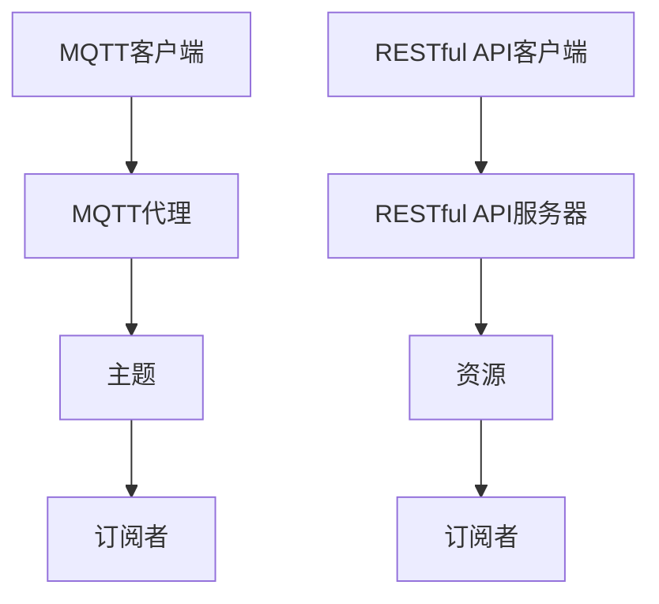

                 

本文旨在为您提供一个全面而深入的指南，帮助您理解如何使用MQTT协议和RESTful API构建一个智能家居系统。我们将从基础概念开始，逐步深入到实现细节，并探讨这个领域的未来发展方向。

## 关键词
- MQTT协议
- RESTful API
- 智能家居
- 系统架构
- 通信协议
- 网络安全

## 摘要
本文将探讨如何利用MQTT协议和RESTful API来构建智能家居系统。我们将从背景介绍开始，深入核心概念和算法原理，详细讲解实现步骤，并进行数学模型的推导和实例分析。此外，我们还将介绍实际应用场景、未来展望以及相关的工具和资源。

## 1. 背景介绍
### 1.1 MQTT协议的历史和重要性

MQTT（Message Queuing Telemetry Transport）是一种轻量级的消息传输协议，最初由IBM于1999年设计，用于在有限带宽和不稳定的网络环境中传输数据。MQTT协议因其低带宽消耗、高可靠性和简单性而在物联网（IoT）领域得到广泛应用。

### 1.2 RESTful API的概念和优势

RESTful API（Representational State Transfer Application Programming Interface）是一种基于HTTP协议的API设计风格，广泛用于构建分布式网络应用。它具有简洁、可扩展、易于集成和易于使用等特点，使得开发者能够快速构建高效的Web服务。

### 1.3 智能家居的发展趋势

随着物联网技术的不断发展，智能家居市场正呈现出快速增长的趋势。智能家居系统通过集成各种智能设备和传感器，实现了远程监控、自动化控制和智能交互等功能，极大地提升了人们的生活质量。

## 2. 核心概念与联系
### 2.1 MQTT协议原理

MQTT协议基于客户端-服务端模型，分为三个主要角色：发布者（Publisher）、订阅者（Subscriber）和代理（Broker）。发布者向代理发送消息，订阅者从代理接收消息。MQTT协议使用订阅-发布模式，实现了消息的广播和订阅，使得消息传递更加高效。

### 2.2 RESTful API原理

RESTful API基于HTTP协议，使用常见的HTTP方法（GET、POST、PUT、DELETE等）来处理请求。API通常采用统一资源标识符（URI）来表示资源，通过请求的URI和HTTP方法来获取、创建、更新或删除资源。

### 2.3 Mermaid 流程图



## 3. 核心算法原理 & 具体操作步骤

### 3.1 算法原理概述

在智能家居系统中，MQTT协议用于设备间的实时通信，而RESTful API用于设备与云端服务之间的交互。MQTT协议通过发布/订阅模型实现了设备状态的通知和远程控制，RESTful API则实现了设备配置和数据的存储。

### 3.2 算法步骤详解

#### 3.2.1 MQTT协议通信流程

1. 客户端连接到代理。
2. 客户端订阅感兴趣的主题。
3. 当有消息发布到主题时，代理将消息发送给订阅者。
4. 客户端处理消息，并进行相应的操作。

#### 3.2.2 RESTful API通信流程

1. 客户端向服务器发送请求。
2. 服务器处理请求，并返回相应的响应。
3. 客户端根据响应进行相应的操作。

### 3.3 算法优缺点

**MQTT协议优点：**
- 低带宽消耗
- 高可靠性
- 支持发布/订阅模型，消息传递高效

**MQTT协议缺点：**
- 消息安全性较低
- 不支持文件传输

**RESTful API优点：**
- 易于使用和集成
- 可扩展性强
- 支持各种HTTP方法，功能丰富

**RESTful API缺点：**
- 实时性较差
- 带宽消耗较大

### 3.4 算法应用领域

MQTT协议和RESTful API广泛应用于智能家居、智能交通、智能医疗等领域，为各种设备和系统提供了高效的通信机制。

## 4. 数学模型和公式 & 详细讲解 & 举例说明

### 4.1 数学模型构建

在智能家居系统中，我们可以构建一个简单的数学模型来描述设备的状态和操作。假设有一个温度传感器，其温度值用T表示。

### 4.2 公式推导过程

$$ T_{new} = T_{current} + \alpha \cdot (T_{target} - T_{current}) $$

其中，$T_{new}$是新的温度值，$T_{current}$是当前温度值，$T_{target}$是目标温度值，$\alpha$是温度调整系数。

### 4.3 案例分析与讲解

假设我们有一个智能空调系统，目标温度是24摄氏度。当前温度是22摄氏度，调整系数是0.1。根据公式，新的温度值为：

$$ T_{new} = 22 + 0.1 \cdot (24 - 22) = 22.2 $$

这意味着空调系统应该将温度调整到22.2摄氏度。

## 5. 项目实践：代码实例和详细解释说明

### 5.1 开发环境搭建

- Python 3.8
- MQTT协议库：paho-mqtt
- RESTful API库：Flask

### 5.2 源代码详细实现

```python
from flask import Flask, request, jsonify
import paho.mqtt.client as mqtt

app = Flask(__name__)

# MQTT客户端设置
mqtt_client = mqtt.Client()
mqtt_client.connect("broker.hivemq.com", 1883, 60)

# RESTful API路由
@app.route("/api/temperature", methods=["POST"])
def update_temperature():
    data = request.json
    target_temperature = data["target_temperature"]
    current_temperature = data["current_temperature"]

    # 计算新的温度值
    new_temperature = current_temperature + 0.1 * (target_temperature - current_temperature)

    # 发布新的温度值到MQTT主题
    mqtt_client.publish("home/temperature", f"{new_temperature:.2f}")

    return jsonify({"new_temperature": new_temperature})

if __name__ == "__main__":
    app.run(debug=True)
```

### 5.3 代码解读与分析

该代码首先导入了所需的库，然后设置了一个MQTT客户端，并定义了一个Flask应用。Flask应用提供了一个用于更新温度的API接口，接收JSON格式的请求，并根据请求计算新的温度值，然后通过MQTT协议发布到主题。

### 5.4 运行结果展示

假设我们发送一个请求：

```json
{
    "target_temperature": 24,
    "current_temperature": 22
}
```

服务器将返回新的温度值：

```json
{
    "new_temperature": 22.2
}
```

MQTT代理将收到这个消息，并通知订阅者。

## 6. 实际应用场景

### 6.1 智能照明系统

通过MQTT协议，智能照明系统可以实时接收环境光强数据，并根据数据自动调整灯光亮度。RESTful API则用于用户设置灯光的颜色和亮度。

### 6.2 智能安防系统

智能安防系统可以使用MQTT协议监控门锁状态、摄像头视频流等，并通过RESTful API实现远程报警和监控。

### 6.3 智能家居控制中心

智能家居控制中心可以通过MQTT协议监控整个家庭的设备状态，并通过RESTful API实现设备的配置和远程控制。

## 7. 工具和资源推荐

### 7.1 学习资源推荐

- 《 MQTT: A Secure and Efficient Messaging Protocol for the IoT》
- 《RESTful API Design: Convincing Arguments and Best Practices》
- 《智能家居系统设计与应用》

### 7.2 开发工具推荐

- MQTT代理：HiveMQ, Mosquitto
- RESTful API框架：Flask, Django

### 7.3 相关论文推荐

- "MQTT Version 5.0: Enhancements to Support IoT" by Roger light
- "RESTful Web Services: The Basics" by Subramaniam

## 8. 总结：未来发展趋势与挑战

### 8.1 研究成果总结

- MQTT协议和RESTful API在智能家居领域的应用取得了显著成果，提供了高效、可靠的通信机制。
- 数学模型和算法的引入为智能家居系统提供了智能化的控制策略。

### 8.2 未来发展趋势

- 智能家居系统将更加智能化、个性化。
- MQTT协议和RESTful API将得到进一步优化和扩展。

### 8.3 面临的挑战

- 安全性：保障数据传输和设备通信的安全性。
- 实时性：提高系统响应速度，满足实时性要求。

### 8.4 研究展望

- 深入研究智能家居系统的算法和模型，提高智能化水平。
- 探索新的通信协议，提高通信效率和安全性。

## 9. 附录：常见问题与解答

### 9.1 MQTT协议常见问题

- **Q：什么是MQTT代理？**
- **A：MQTT代理是一个中间件，负责处理MQTT客户端的连接、订阅和消息发布。**

### 9.2 RESTful API常见问题

- **Q：如何设计一个RESTful API？**
- **A：遵循REST原则，使用统一的URI和HTTP方法，确保API的可扩展性和易用性。**

---

作者：禅与计算机程序设计艺术 / Zen and the Art of Computer Programming
----------------------------------------------------------------

