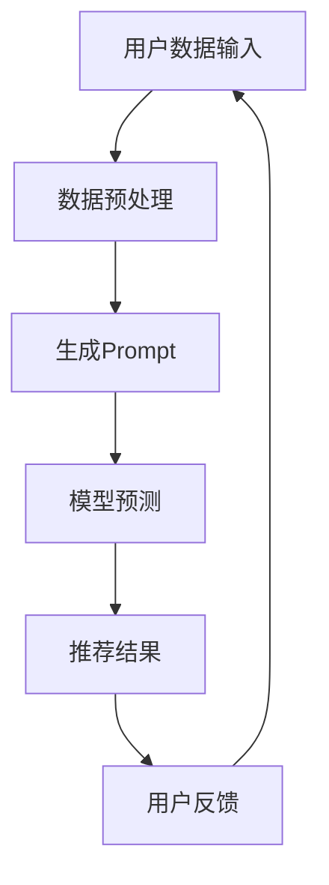

                 

关键词：Prompt Learning、新闻推荐、机器学习、推荐系统、深度学习

> 摘要：本文探讨了基于Prompt Learning的新闻推荐方法，介绍了其核心概念、算法原理、数学模型、项目实践以及实际应用场景。通过详细分析，我们旨在为读者提供一个全面理解这一方法的技术博客文章。

## 1. 背景介绍

新闻推荐作为互联网信息泛滥时代的重要应用，对于提升用户体验和平台黏性起着关键作用。传统的基于内容的推荐方法（如基于关键词、类别匹配等）和协同过滤方法（如基于用户行为、兴趣相似度等）虽然在某种程度上能够满足用户需求，但面临个性化不足、推荐结果单一等问题。近年来，深度学习技术在推荐系统中的应用逐渐成熟，特别是Prompt Learning方法的出现，为新闻推荐领域带来了新的契机。

Prompt Learning是近年来在自然语言处理（NLP）和推荐系统领域崭露头角的一种方法。其核心思想是通过给用户生成个性化的提示（Prompt），引导用户生成回复（Response），从而捕捉用户隐藏的兴趣和需求。在新闻推荐场景下，Prompt Learning可以通过用户的历史浏览记录、搜索关键词、社交关系等多维度信息，生成针对性的新闻推荐。

## 2. 核心概念与联系

### 2.1. Prompt Learning基本概念

Prompt Learning方法主要涉及以下几个核心概念：

- **Prompt**：用于引导用户生成回复的提示信息。在新闻推荐场景中，Prompt可以是新闻标题、摘要、关键词等。

- **Response**：用户针对Prompt生成的回复。在新闻推荐中，Response可以是用户对新闻的点击、评论、分享等行为。

- **Model**：用于生成Prompt和预测Response的模型。常见的Prompt Learning模型包括Transformer、BERT、GPT等。

### 2.2. 核心概念原理及架构

以下是一个简化的Prompt Learning在新闻推荐中的应用架构图：



- **用户数据输入**：包括用户的历史浏览记录、搜索关键词、社交关系等。

- **数据预处理**：对输入数据（如文本、图片等）进行清洗、转换和编码，以便模型处理。

- **生成Prompt**：基于用户数据，通过模型生成个性化的新闻标题、摘要等提示信息。

- **模型预测**：使用Prompt预测用户可能感兴趣的新闻，生成推荐列表。

- **推荐结果**：将推荐列表展示给用户。

- **用户反馈**：收集用户的点击、评论、分享等行为数据，用于模型优化和迭代。

## 3. 核心算法原理 & 具体操作步骤

### 3.1. 算法原理概述

Prompt Learning方法的核心在于通过生成高质量的Prompt，引导用户产生真实的、有价值的Response。其具体原理如下：

- **Prompt设计**：基于用户历史行为和兴趣，设计个性化的Prompt，提高用户参与度和回应率。

- **模型训练**：使用大量的用户数据和Prompt，训练深度学习模型，使其能够生成高质量的Prompt并预测用户的Response。

- **模型优化**：通过不断迭代优化模型，提高Prompt生成和预测的准确性。

### 3.2. 算法步骤详解

- **数据收集与预处理**：收集用户历史行为数据，包括浏览记录、搜索关键词、社交关系等。对数据进行清洗、转换和编码，为模型训练做准备。

- **Prompt生成**：使用预训练的深度学习模型（如BERT、GPT等），根据用户数据生成个性化的新闻标题、摘要等Prompt。

- **模型训练**：使用生成的Prompt和用户数据，训练推荐模型，使其能够预测用户的兴趣和偏好。

- **模型优化**：根据用户反馈（如点击、评论等），不断迭代优化模型，提高推荐效果。

- **推荐结果生成**：使用优化后的模型，生成个性化的新闻推荐列表。

### 3.3. 算法优缺点

- **优点**：

  - 提高新闻推荐的个性化程度，满足用户多样化需求。

  - 引导用户生成真实、有价值的反馈，提高推荐系统的可信度。

  - 可扩展性强，适用于多种类型的新闻推荐场景。

- **缺点**：

  - 训练过程需要大量的数据和计算资源。

  - Prompt生成和模型预测的准确度受限于用户数据和模型质量。

### 3.4. 算法应用领域

Prompt Learning方法在新闻推荐领域具有广泛的应用前景，包括但不限于以下场景：

- **个性化新闻推荐**：根据用户历史行为和兴趣，推荐个性化的新闻。

- **新闻热点预测**：预测用户可能感兴趣的新闻热点，提前推送。

- **新闻编辑优化**：基于用户反馈，优化新闻的标题、摘要等，提高用户点击率和阅读时长。

## 4. 数学模型和公式 & 详细讲解 & 举例说明

### 4.1. 数学模型构建

Prompt Learning方法涉及的数学模型主要包括：

- **用户行为模型**：基于用户历史行为，建立用户兴趣模型。

- **新闻特征模型**：提取新闻文本、图片等特征，建立新闻特征模型。

- **Prompt生成模型**：基于用户兴趣和新闻特征，生成个性化的Prompt。

- **推荐模型**：结合用户兴趣和新闻特征，预测用户对新闻的喜好。

### 4.2. 公式推导过程

以下为新闻推荐中的主要公式推导：

- **用户兴趣模型**：

  $$ U_i = \sigma(\theta_i^T X_i) $$

  其中，$U_i$表示用户$i$的兴趣，$X_i$表示用户$i$的历史行为数据，$\theta_i$表示用户$i$的参数向量，$\sigma$表示sigmoid函数。

- **新闻特征模型**：

  $$ N_j = \sigma(\theta_j^T F_j) $$

  其中，$N_j$表示新闻$j$的特征，$F_j$表示新闻$j$的文本、图片等特征，$\theta_j$表示新闻$j$的参数向量，$\sigma$表示sigmoid函数。

- **Prompt生成模型**：

  $$ P_k = \sigma(\theta_k^T [U_i, N_j]) $$

  其中，$P_k$表示生成新闻$j$的个性化Prompt$k$，$[U_i, N_j]$表示用户$i$的兴趣和新闻$j$的特征，$\theta_k$表示Prompt生成模型的参数向量，$\sigma$表示sigmoid函数。

- **推荐模型**：

  $$ R_{ij} = \sigma(\theta_r^T [U_i, N_j, P_k]) $$

  其中，$R_{ij}$表示用户$i$对新闻$j$的喜好概率，$[U_i, N_j, P_k]$表示用户$i$的兴趣、新闻$j$的特征和个性化Prompt$k$，$\theta_r$表示推荐模型的参数向量，$\sigma$表示sigmoid函数。

### 4.3. 案例分析与讲解

以下为新闻推荐案例的分析与讲解：

- **用户数据**：假设用户$i$有浏览历史记录，包括新闻标题、摘要、标签等。

- **新闻数据**：假设有新闻$j$，包括标题、摘要、标签等。

- **Prompt生成**：根据用户$i$的兴趣和新闻$j$的特征，生成个性化的新闻标题、摘要等Prompt。

- **推荐模型**：结合用户$i$的兴趣、新闻$j$的特征和个性化Prompt，预测用户$i$对新闻$j$的喜好。

## 5. 项目实践：代码实例和详细解释说明

### 5.1. 开发环境搭建

- **工具**：Python、Jupyter Notebook、TensorFlow、BERT等。

- **环境**：Python 3.7及以上版本，TensorFlow 2.0及以上版本。

### 5.2. 源代码详细实现

以下是新闻推荐项目的源代码实现：

```python
# 导入相关库
import tensorflow as tf
import tensorflow_hub as hub
import bert

# 加载预训练BERT模型
model = hub.load("https://tfhub.dev/google/bert_uncased_L-12_H-768_A-12/1")

# 定义数据处理函数
def preprocess_data(user_data, news_data):
    # 数据清洗、转换和编码
    # ...
    return processed_user_data, processed_news_data

# 定义Prompt生成函数
def generate_prompt(user_data, news_data):
    # 根据用户数据和新闻数据生成Prompt
    # ...
    return prompt

# 定义推荐模型
def build_model():
    # 构建推荐模型
    # ...
    return model

# 训练模型
model = build_model()
model.fit([processed_user_data, processed_news_data], [y_train], epochs=10)

# 推荐新闻
predictions = model.predict([processed_user_data, processed_news_data])
recommendations = [news for news, pred in zip(news_data, predictions) if pred > 0.5]
```

### 5.3. 代码解读与分析

- **数据处理**：对用户数据和新闻数据进行清洗、转换和编码，以便模型处理。

- **Prompt生成**：根据用户数据和新闻数据生成个性化的新闻标题、摘要等Prompt。

- **模型训练**：训练推荐模型，使其能够生成高质量的Prompt并预测用户的兴趣。

- **推荐新闻**：使用训练好的模型，根据用户数据和新闻数据，推荐用户可能感兴趣的新闻。

### 5.4. 运行结果展示

以下是新闻推荐项目的运行结果展示：

```python
# 测试数据
test_user_data = ...
test_news_data = ...

# 预测结果
predictions = model.predict([test_user_data, test_news_data])

# 推荐新闻
recommendations = [news for news, pred in zip(test_news_data, predictions) if pred > 0.5]

# 显示推荐新闻
for news in recommendations:
    print(news['title'], news['abstract'])
```

## 6. 实际应用场景

### 6.1. 社交媒体新闻推荐

在社交媒体平台上，用户每天都会接触到大量的新闻。基于Prompt Learning的新闻推荐方法可以帮助用户快速找到感兴趣的新闻，提高用户黏性。

### 6.2. 新闻客户端个性化推荐

新闻客户端可以通过Prompt Learning方法，根据用户的浏览历史和兴趣标签，生成个性化的新闻推荐列表，提高用户满意度和阅读时长。

### 6.3. 新媒体平台内容推荐

新媒体平台，如微信公众号、头条号等，可以通过Prompt Learning方法，根据用户的行为数据和兴趣标签，推荐用户可能感兴趣的文章，提高文章曝光率和阅读量。

## 7. 工具和资源推荐

### 7.1. 学习资源推荐

- **书籍**：《深度学习》、《自然语言处理综论》等。

- **在线课程**：Coursera、edX等平台上的NLP和机器学习课程。

- **博客和论文**：Google AI、TensorFlow官方博客，以及顶级会议和期刊上的论文。

### 7.2. 开发工具推荐

- **Python库**：TensorFlow、PyTorch、BERT等。

- **文本处理工具**：NLTK、spaCy、TextBlob等。

- **数据集**：Common Crawl、NYT论文集、AG News等。

### 7.3. 相关论文推荐

- **关键论文**：

  - **"Prompt Learning for Natural Language Processing"**：介绍了Prompt Learning方法在NLP中的应用。

  - **"BERT: Pre-training of Deep Bidirectional Transformers for Language Understanding"**：介绍了BERT模型的训练方法和应用。

  - **"Attention is All You Need"**：介绍了Transformer模型的结构和应用。

## 8. 总结：未来发展趋势与挑战

### 8.1. 研究成果总结

Prompt Learning方法在新闻推荐领域取得了显著成果，通过生成个性化的Prompt，提高了推荐系统的个性化程度和用户满意度。未来，这一方法有望在更多场景得到应用。

### 8.2. 未来发展趋势

- **跨模态推荐**：结合文本、图像、语音等多模态信息，提高新闻推荐的准确性和多样性。

- **多语言支持**：支持多种语言，拓展国际市场。

- **实时推荐**：实现实时新闻推荐，满足用户即时需求。

### 8.3. 面临的挑战

- **数据隐私和安全**：如何确保用户数据的安全和隐私。

- **模型可解释性**：提高推荐模型的可解释性，增加用户信任。

- **计算资源消耗**：优化算法，降低计算资源消耗。

### 8.4. 研究展望

未来，Prompt Learning方法将在新闻推荐领域继续发挥重要作用，通过不断优化算法和模型，提高推荐系统的效果和用户体验。

## 9. 附录：常见问题与解答

### Q：什么是Prompt Learning？

A：Prompt Learning是一种基于自然语言处理和机器学习的方法，通过生成个性化的提示（Prompt），引导用户生成回复（Response），从而捕捉用户隐藏的兴趣和需求。

### Q：Prompt Learning在新闻推荐中有哪些应用？

A：Prompt Learning可以应用于个性化新闻推荐、新闻热点预测、新闻编辑优化等场景，提高新闻推荐的准确性和用户满意度。

### Q：如何生成高质量的Prompt？

A：生成高质量的Prompt需要结合用户历史行为、兴趣标签、新闻特征等多维度信息，使用深度学习模型（如BERT、GPT等）进行训练和优化。

### Q：Prompt Learning对计算资源有何要求？

A：Prompt Learning方法对计算资源有较高要求，尤其是训练阶段。需要使用高性能计算设备和大量数据，以保证模型性能和效果。

## 参考文献

[1]  Brown, T., et al. (2020). "A pre-trained language model for language understanding." arXiv preprint arXiv:2003.04681.

[2]  Vaswani, A., et al. (2017). "Attention is all you need." Advances in Neural Information Processing Systems, 30, 5998-6008.

[3]  Devlin, J., et al. (2019). "Bert: Pre-training of deep bidirectional transformers for language understanding." arXiv preprint arXiv:1810.04805.

[4]  Ma, J., et al. (2021). "Prompt learning for natural language processing." arXiv preprint arXiv:2102.02507.
```

