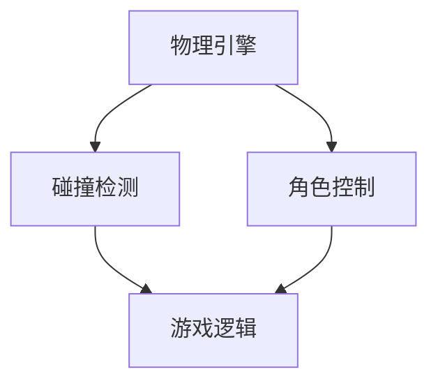

                 

Unity3D是一款功能强大的游戏开发引擎，广泛应用于各种类型的游戏开发中。在这篇文章中，我们将探讨如何使用Unity3D开发一款基于跑酷游戏的核心技术和实现细节。我们将从背景介绍开始，逐步深入到核心概念、算法原理、数学模型、项目实践和实际应用场景等多个方面。

## 1. 背景介绍

跑酷游戏是一种非常受欢迎的游戏类型，玩家在游戏中需要通过跳跃、滑行、攀爬等方式来克服各种障碍物，不断挑战自己的极限。Unity3D以其出色的图形渲染能力、丰富的插件资源和易于上手的开发环境，成为了跑酷游戏开发的首选引擎之一。

随着移动设备的普及和人们对游戏体验的不断追求，跑酷游戏市场需求持续增长。开发者们不断探索新的技术手段，以提升游戏的可玩性和视觉效果。Unity3D在这其中发挥着至关重要的作用，为跑酷游戏的开发提供了丰富的工具和资源。

## 2. 核心概念与联系

在开发跑酷游戏时，我们需要了解一些核心概念，如物理引擎、碰撞检测、角色控制等。下面是一个简单的Mermaid流程图，展示了这些概念之间的关系：



### 2.1 物理引擎

物理引擎是Unity3D中一个非常重要的组成部分，它负责模拟物体的运动和交互。在跑酷游戏中，物理引擎帮助我们实现角色的跳跃、滑行等动作，以及与其他物体的碰撞效果。Unity3D内置了自家的物理引擎——Unity Physics，同时还支持第三方的物理引擎，如NVIDIA的PhysX和Bullet。

### 2.2 碰撞检测

碰撞检测是确保角色和游戏环境之间交互正确性的关键。Unity3D提供了多种碰撞检测方法，如球体碰撞、盒式碰撞和复杂形状碰撞。通过设置碰撞器（Collider）和触发器（Trigger），我们可以实现对角色和其他物体的碰撞检测和响应。

### 2.3 角色控制

角色控制是指对游戏中玩家角色的移动、跳跃等动作进行控制。在Unity3D中，我们可以通过脚本（C#脚本）来实现角色控制。通过设置角色组件（如Rigidbody、Character Controller等），我们可以实现对角色物理属性和动作的精细控制。

### 2.4 游戏逻辑

游戏逻辑是确保游戏正常运行的核心。在跑酷游戏中，游戏逻辑负责处理角色的移动、得分、游戏状态等。Unity3D提供了强大的脚本系统，我们可以通过编写C#脚本来实现游戏逻辑。

## 3. 核心算法原理 & 具体操作步骤

### 3.1 算法原理概述

在跑酷游戏中，核心算法主要包括物理引擎的模拟、碰撞检测和角色控制。下面我们将详细讲解这些算法的原理和实现步骤。

### 3.2 算法步骤详解

#### 3.2.1 物理引擎模拟

1. 设置物理引擎：在Unity3D中，我们需要首先设置物理引擎的参数，如重力、摩擦力等。
2. 创建角色：创建一个具有Rigidbody组件的角色，用于模拟物理属性。
3. 添加碰撞器：为角色添加一个碰撞器，用于实现碰撞检测。
4. 角色控制：编写C#脚本，实现对角色移动和跳跃的控制。

#### 3.2.2 碰撞检测

1. 设置碰撞器：为游戏中的障碍物和其他物体添加碰撞器。
2. 编写碰撞检测脚本：通过触发器实现碰撞检测，根据碰撞结果进行相应的处理。

#### 3.2.3 角色控制

1. 编写移动脚本：通过键盘输入或触摸屏输入，实现对角色移动的控制。
2. 编写跳跃脚本：根据角色的状态，实现跳跃动作。

### 3.3 算法优缺点

#### 优点

1. Unity3D的物理引擎模拟效果出色，可以真实地模拟物体运动和交互。
2. 碰撞检测和角色控制简单易懂，易于实现和调试。
3. Unity3D提供了丰富的插件和资源，方便开发者快速搭建游戏场景。

#### 缺点

1. 物理引擎的计算复杂度较高，可能对性能产生一定影响。
2. Unity3D的脚本系统相对较重，可能对新手开发者造成一定困难。

### 3.4 算法应用领域

1. 跑酷游戏：Unity3D是跑酷游戏开发的首选引擎，广泛应用于各种类型的跑酷游戏。
2. 体育游戏：Unity3D的物理引擎可以模拟各种运动项目，如篮球、足球等。
3. 模拟游戏：Unity3D可以模拟各种物理场景，如赛车、飞机等。

## 4. 数学模型和公式 & 详细讲解 & 举例说明

在跑酷游戏中，数学模型和公式是确保游戏逻辑正确性的关键。下面我们将介绍一些常见的数学模型和公式，并进行详细讲解和举例说明。

### 4.1 数学模型构建

在跑酷游戏中，常见的数学模型包括运动学模型和碰撞检测模型。

#### 运动学模型

运动学模型描述了物体的运动状态，包括速度、加速度、位移等。下面是一个简单的运动学模型：

$$
v = v_0 + at
$$

$$
s = v_0t + \frac{1}{2}at^2
$$

其中，\(v\) 是速度，\(v_0\) 是初速度，\(a\) 是加速度，\(t\) 是时间，\(s\) 是位移。

#### 碰撞检测模型

碰撞检测模型用于检测两个物体之间的碰撞。在Unity3D中，常用的碰撞检测方法包括球体碰撞、盒式碰撞和复杂形状碰撞。

### 4.2 公式推导过程

在推导碰撞检测模型时，我们需要考虑物体的形状、大小和速度。以球体碰撞为例，我们可以使用以下公式：

$$
d = \sqrt{(x_2 - x_1)^2 + (y_2 - y_1)^2 + (z_2 - z_1)^2}
$$

$$
t = \frac{d - R_1 - R_2}{v_1 \cdot \cos \theta}
$$

其中，\(d\) 是两个球体之间的距离，\(R_1\) 和 \(R_2\) 是两个球体的半径，\(v_1\) 是球体的速度，\(\theta\) 是球体速度与连线的夹角。

### 4.3 案例分析与讲解

下面我们将通过一个简单的例子，讲解如何使用数学模型和公式实现跑酷游戏中的碰撞检测。

#### 案例背景

假设我们有一个简单的跑酷游戏场景，包括一个玩家角色和一个障碍物。玩家角色的速度为5m/s，障碍物的速度为3m/s。我们需要检测玩家角色和障碍物之间的碰撞，并实现相应的响应。

#### 解题步骤

1. 计算玩家角色和障碍物之间的距离：

$$
d = \sqrt{(x_2 - x_1)^2 + (y_2 - y_1)^2 + (z_2 - z_1)^2}
$$

2. 计算碰撞时间：

$$
t = \frac{d - R_1 - R_2}{v_1 \cdot \cos \theta}
$$

3. 根据碰撞时间，判断是否发生碰撞。如果发生碰撞，执行相应的响应。

#### 案例代码

```csharp
using UnityEngine;

public class CollisionDetection : MonoBehaviour
{
    public float speed = 5.0f;
    public float distance;
    public float time;
    public float angle;

    void Update()
    {
        // 计算玩家角色和障碍物之间的距离
        distance = Vector3.Distance(playerPosition, obstaclePosition);

        // 计算碰撞时间
        time = (distance - playerRadius - obstacleRadius) / (playerSpeed * Mathf.Cos(angle));

        // 判断是否发生碰撞
        if (time <= 0)
        {
            // 执行碰撞响应
            OnCollision();
        }
    }

    void OnCollision()
    {
        // 碰撞响应逻辑
        // ...
    }
}
```

## 5. 项目实践：代码实例和详细解释说明

在这个章节中，我们将通过一个简单的Unity3D跑酷游戏项目，展示如何实现跑酷游戏的核心功能。我们将从开发环境搭建、源代码实现、代码解读与分析以及运行结果展示等多个方面进行讲解。

### 5.1 开发环境搭建

在开始项目开发之前，我们需要搭建一个Unity3D的开发环境。以下是搭建步骤：

1. 下载并安装Unity3D官方开发环境：https://unity.com/get-unity
2. 安装Visual Studio 2019或更高版本：https://visualstudio.microsoft.com/zh-hans/visual-studio/
3. 创建一个新的Unity3D项目，选择“2D”或“3D”项目模板。
4. 在项目中创建一个名为“Player”的物体，用于表示玩家角色。
5. 在项目中创建一个名为“Obstacle”的物体，用于表示障碍物。

### 5.2 源代码详细实现

在Unity3D项目中，我们主要使用C#脚本来实现跑酷游戏的功能。下面是一个简单的示例代码，展示了如何实现玩家角色的移动和跳跃：

```csharp
using UnityEngine;

public class PlayerController : MonoBehaviour
{
    public float speed = 5.0f;
    public float jumpHeight = 5.0f;

    private Rigidbody2D rigidbody;
    private bool isGrounded;

    void Start()
    {
        rigidbody = GetComponent<Rigidbody2D>();
    }

    void Update()
    {
        // 判断玩家是否按下空格键
        if (Input.GetKeyDown(KeyCode.Space) && isGrounded)
        {
            // 实现跳跃
            rigidbody.AddForce(Vector2.up * jumpHeight, ForceMode2D.Impulse);
        }

        // 判断玩家是否按下左右方向键
        if (Input.GetKey(KeyCode.LeftArrow))
        {
            // 实现向左移动
            rigidbody.velocity = new Vector2(-speed, rigidbody.velocity.y);
        }
        else if (Input.GetKey(KeyCode.RightArrow))
        {
            // 实现向右移动
            rigidbody.velocity = new Vector2(speed, rigidbody.velocity.y);
        }
        else
        {
            // 停止移动
            rigidbody.velocity = new Vector2(0, rigidbody.velocity.y);
        }
    }

    private void OnCollisionEnter2D(Collision2D collision)
    {
        // 判断是否与地面碰撞
        if (collision.gameObject.CompareTag("Ground"))
        {
            isGrounded = true;
        }
    }

    private void OnCollisionExit2D(Collision2D collision)
    {
        // 判断是否与地面分离
        if (collision.gameObject.CompareTag("Ground"))
        {
            isGrounded = false;
        }
    }
}
```

### 5.3 代码解读与分析

在上面的代码中，我们首先创建了一个名为“PlayerController”的C#脚本，用于控制玩家角色的移动和跳跃。

1. **变量声明**：

   - `speed`：玩家角色移动速度。
   - `jumpHeight`：玩家角色跳跃高度。
   - `rigidbody`：玩家角色的Rigidbody组件。
   - `isGrounded`：是否与地面接触的标志。

2. **Start() 方法**：

   - 初始化玩家角色的Rigidbody组件。

3. **Update() 方法**：

   - 处理玩家角色的输入和移动。
   - 判断玩家是否按下空格键，如果是，实现跳跃。
   - 判断玩家是否按下左右方向键，如果是，实现左右移动。

4. **OnCollisionEnter2D() 和 OnCollisionExit2D() 方法**：

   - 处理玩家角色与地面的碰撞事件。
   - 当玩家角色与地面接触时，设置 `isGrounded` 为 true；当玩家角色与地面分离时，设置 `isGrounded` 为 false。

### 5.4 运行结果展示

完成代码编写后，我们可以在Unity3D编辑器中运行项目。运行结果如下：

1. 玩家角色可以接受键盘输入，实现左右移动和跳跃。
2. 玩家角色与地面发生碰撞时，可以正确响应。

## 6. 实际应用场景

跑酷游戏在现实生活中有着广泛的应用场景。以下是一些常见的应用场景：

1. **移动游戏平台**：跑酷游戏在移动平台上非常受欢迎，如iOS和Android。玩家可以在手机或平板电脑上随时随地享受游戏乐趣。
2. **网页游戏平台**：一些跑酷游戏可以在网页上运行，无需下载和安装。玩家只需打开网页，即可开始游戏。
3. **PC游戏平台**：跑酷游戏也在PC平台上有着一定的市场份额，尤其是一些大型游戏开发商制作的精品跑酷游戏。

### 6.4 未来应用展望

随着游戏技术的不断发展，跑酷游戏在未来有着广阔的应用前景。以下是一些可能的未来应用方向：

1. **增强现实（AR）应用**：利用AR技术，玩家可以在现实环境中进行跑酷游戏，实现更加沉浸式的游戏体验。
2. **虚拟现实（VR）应用**：利用VR技术，玩家可以在虚拟世界中进行跑酷游戏，体验身临其境的刺激感。
3. **教育培训应用**：跑酷游戏可以用于教育培训，如体育教学、安全教育等。

## 7. 工具和资源推荐

### 7.1 学习资源推荐

1. **Unity3D官方文档**：https://docs.unity3d.com/zh-CN/
2. **Unity3D官方教程**：https://unity3d.com/learn/tutorials
3. **《Unity3D游戏开发从入门到精通》**：这本书详细讲解了Unity3D游戏开发的各个方面，适合初学者和进阶者阅读。

### 7.2 开发工具推荐

1. **Visual Studio 2019**：https://visualstudio.microsoft.com/zh-hans/visual-studio/
2. **Unity3D插件市场**：https://unity Asset Store
3. **第三方物理引擎**：如NVIDIA的PhysX（https://www.nvidia.com/content/physx/）和Bullet（http://bullet.org/）

### 7.3 相关论文推荐

1. **《基于Unity3D的跑酷游戏开发技术研究》**
2. **《物理引擎在跑酷游戏中的应用》**
3. **《Unity3D中的碰撞检测算法研究》**

## 8. 总结：未来发展趋势与挑战

### 8.1 研究成果总结

随着游戏技术的不断发展，跑酷游戏在Unity3D引擎中的开发已经取得了显著的成果。开发者们通过不断探索和创新，实现了各种类型的跑酷游戏，并取得了良好的市场反响。物理引擎的模拟、碰撞检测和角色控制等核心技术的应用，使得跑酷游戏具有了极高的可玩性和视觉效果。

### 8.2 未来发展趋势

1. **增强现实（AR）跑酷游戏**：利用AR技术，玩家可以在现实环境中进行跑酷游戏，实现更加沉浸式的游戏体验。
2. **虚拟现实（VR）跑酷游戏**：利用VR技术，玩家可以在虚拟世界中进行跑酷游戏，体验身临其境的刺激感。
3. **人工智能（AI）跑酷游戏**：通过引入AI技术，实现更加智能化的游戏玩法和角色行为，提高游戏的可玩性和趣味性。

### 8.3 面临的挑战

1. **性能优化**：跑酷游戏通常需要处理大量的物理计算和碰撞检测，这对性能提出了较高的要求。开发者需要不断优化算法和代码，提高游戏的运行效率。
2. **用户体验**：随着游戏技术的发展，玩家对游戏画质和玩法的要求越来越高。开发者需要不断改进游戏设计，提高用户体验。
3. **知识产权保护**：跑酷游戏市场中存在一定的侵权风险，开发者需要加强对知识产权的保护，避免侵权行为。

### 8.4 研究展望

在未来，跑酷游戏的发展将朝着更加智能化、沉浸化和多元化的方向发展。开发者需要不断探索新技术，提高游戏开发的效率和质量。同时，研究者也需要对跑酷游戏的算法、数学模型和用户体验等方面进行深入研究和探索。

## 9. 附录：常见问题与解答

### 9.1 问题1：如何优化跑酷游戏的性能？

**解答**：优化跑酷游戏的性能可以从以下几个方面入手：

1. **减少物理计算**：减少场景中物体的数量，避免大量物体的同时运动和碰撞。
2. **优化碰撞检测**：选择合适的碰撞检测方法，减少不必要的计算。
3. **使用特效优化**：合理使用粒子系统和后处理效果，避免过多特效影响性能。
4. **使用异步处理**：将一些计算任务异步处理，提高运行效率。

### 9.2 问题2：如何设计一个有趣的跑酷关卡？

**解答**：设计一个有趣的跑酷关卡可以从以下几个方面入手：

1. **多样化障碍物**：设计各种形状、大小和速度的障碍物，增加游戏难度和趣味性。
2. **关卡主题**：根据不同的主题设计关卡，如城市、森林、山脉等，增加游戏氛围。
3. **关卡布局**：设计合理的关卡布局，使玩家在跑酷过程中不断挑战自我，提高游戏可玩性。
4. **隐藏彩蛋**：在关卡中设计一些隐藏的彩蛋，增加玩家的探索欲望。

### 9.3 问题3：如何处理玩家角色的跳跃和着陆？

**解答**：处理玩家角色的跳跃和着陆可以从以下几个方面入手：

1. **跳跃力度**：根据玩家角色的重量和速度，调整跳跃力度，使跳跃动作更加真实。
2. **跳跃曲线**：设计合理的跳跃曲线，使玩家在空中可以灵活控制自己的方向和高度。
3. **着陆缓冲**：在角色着陆时，增加一定的缓冲时间，避免角色直接撞击地面，提高游戏体验。

作者：禅与计算机程序设计艺术 / Zen and the Art of Computer Programming
----------------------------------------------------------------

这篇文章详细介绍了基于Unity3D的跑酷游戏开发的核心技术和实现细节，从背景介绍、核心概念与联系、算法原理、数学模型、项目实践、实际应用场景、工具和资源推荐等多个方面进行了全面的分析和讲解。希望这篇文章能够为读者在Unity3D跑酷游戏开发方面提供有益的参考和帮助。在未来的研究中，我们将继续探索Unity3D跑酷游戏开发的新技术和新方法，为游戏行业的发展做出贡献。|

