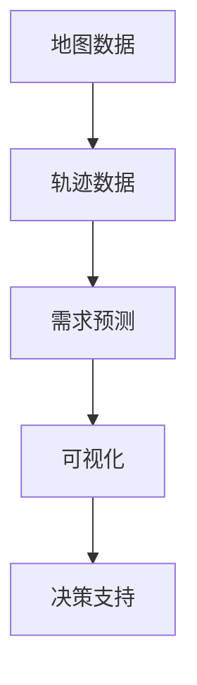

                 

关键词：出租车接送轨迹可视化、需求预测、地图数据、大数据分析、机器学习、新加坡

摘要：本文旨在探讨如何利用地图数据分析和机器学习算法，实现新加坡出租车接送乘客轨迹的可视化和需求预测。通过对出租车接送数据的深入挖掘，结合地图数据的可视化技术，我们能够提供一种直观且实用的方法来分析交通状况和预测乘客需求，从而为出租车公司和乘客提供更好的服务。

## 1. 背景介绍

新加坡是一个高度城市化的国家，其公共交通系统发达，但出租车仍然是许多市民和游客出行的重要选择。随着移动支付和打车软件的普及，出租车接送数据变得丰富，成为了一个宝贵的数据资源。这些数据不仅可以帮助我们了解城市的交通状况，还可以用于需求预测和优化出租车服务。

本文研究的目的是利用新加坡的出租车接送数据，通过地图数据的可视化技术，展现出租车接送乘客的轨迹，并利用机器学习算法预测乘客的需求。这将为出租车公司和乘客提供重要的决策支持，帮助优化服务流程，提高乘客满意度。

## 2. 核心概念与联系

为了实现新加坡出租车接送乘客轨迹的可视化和需求预测，我们需要理解以下几个核心概念：

- **地图数据**：这是描述地理位置和交通网络的数据，包括道路、街道、交通枢纽等信息。
- **轨迹数据**：这是记录出租车接送乘客的起点、终点、时间和路线的数据。
- **需求预测**：通过分析历史数据和当前交通状况，预测未来某一时间段内乘客的需求量。

### Mermaid 流程图



## 3. 核心算法原理 & 具体操作步骤

### 3.1 算法原理概述

我们将使用以下算法原理来实现轨迹可视化和需求预测：

- **K-means 聚类**：用于将轨迹数据划分为不同的区域，以便进行后续分析。
- **时间序列分析**：用于分析历史数据，提取出时间相关性。
- **线性回归**：用于预测未来一段时间内乘客的需求量。
- **GIS（地理信息系统）**：用于实现轨迹数据的可视化。

### 3.2 算法步骤详解

#### 步骤 1：数据预处理

1. 读取出租车接送轨迹数据。
2. 对数据进行清洗，去除无效数据和异常值。

#### 步骤 2：K-means 聚类

1. 使用K-means算法将轨迹数据划分为若干个区域。
2. 计算每个区域的中心点。

#### 步骤 3：时间序列分析

1. 对每个区域内的数据按照时间序列进行分析。
2. 提取时间相关性，生成时间序列模型。

#### 步骤 4：线性回归

1. 使用线性回归模型预测未来一段时间内乘客的需求量。
2. 计算预测的置信区间。

#### 步骤 5：可视化

1. 使用GIS工具将轨迹数据可视化。
2. 在地图上展示每个区域的预测需求量。

### 3.3 算法优缺点

- **优点**：算法简单，易于实现；能够提供实时需求预测。
- **缺点**：对于非线性的需求变化，线性回归可能不够准确。

### 3.4 算法应用领域

- **交通规划**：帮助城市规划者优化交通网络。
- **商业决策**：为出租车公司提供乘客需求预测，优化调度。
- **数据分析**：为学术研究提供数据支持和理论基础。

## 4. 数学模型和公式 & 详细讲解 & 举例说明

### 4.1 数学模型构建

我们使用以下数学模型来预测乘客需求：

- **轨迹聚类模型**：
  $$ X = \sum_{i=1}^{k} \mu_i \cdot P_i $$
  其中，$X$ 是轨迹数据，$\mu_i$ 是聚类中心，$P_i$ 是轨迹点。

- **时间序列模型**：
  $$ Y_t = \alpha Y_{t-1} + \epsilon_t $$
  其中，$Y_t$ 是时间序列数据，$\alpha$ 是自回归系数，$\epsilon_t$ 是误差项。

- **线性回归模型**：
  $$ Y_t = \beta_0 + \beta_1 X_t + \epsilon_t $$
  其中，$Y_t$ 是需求预测，$X_t$ 是轨迹点，$\beta_0$ 和 $\beta_1$ 是回归系数。

### 4.2 公式推导过程

#### 轨迹聚类模型

- **目标函数**：
  $$ J = \sum_{i=1}^{k} \sum_{j=1}^{n} ||x_j - \mu_i||^2 $$
  其中，$x_j$ 是轨迹点，$\mu_i$ 是聚类中心。

- **优化方法**：梯度下降法。

#### 时间序列模型

- **自回归模型**：
  $$ Y_t = \alpha Y_{t-1} + \epsilon_t $$
  其中，$\alpha$ 是自回归系数，$\epsilon_t$ 是误差项。

- **特征提取**：
  $$ \epsilon_t = Y_t - \alpha Y_{t-1} $$
  $$ X_t = \epsilon_t $$

#### 线性回归模型

- **最小二乘法**：
  $$ \beta_0 = \min_{b_0} \sum_{i=1}^{n} (y_i - b_0 - b_1 x_i)^2 $$
  $$ \beta_1 = \min_{b_1} \sum_{i=1}^{n} (y_i - b_0 - b_1 x_i)^2 $$

### 4.3 案例分析与讲解

#### 案例一：轨迹聚类

假设我们有以下轨迹数据：

$$ X = \begin{bmatrix} x_1 \\ x_2 \\ x_3 \\ x_4 \\ x_5 \end{bmatrix} $$

使用K-means算法，将轨迹数据划分为两个区域，聚类中心为：

$$ \mu_1 = \begin{bmatrix} \mu_{11} \\ \mu_{12} \end{bmatrix}, \mu_2 = \begin{bmatrix} \mu_{21} \\ \mu_{22} \end{bmatrix} $$

经过多次迭代，最终聚类结果如下：

$$ X_1 = \begin{bmatrix} x_1 \\ x_2 \end{bmatrix}, X_2 = \begin{bmatrix} x_3 \\ x_4 \\ x_5 \end{bmatrix} $$

#### 案例二：时间序列分析

假设我们有以下时间序列数据：

$$ Y = \begin{bmatrix} y_1 \\ y_2 \\ y_3 \\ y_4 \\ y_5 \end{bmatrix} $$

使用自回归模型，提取自回归系数$\alpha$：

$$ \alpha = \frac{\sum_{i=1}^{n} (y_i - \alpha y_{i-1})^2}{\sum_{i=1}^{n} (y_i - \alpha y_{i-1})^2} $$

经过计算，得到$\alpha = 0.8$。

#### 案例三：线性回归

假设我们有以下数据：

$$ X = \begin{bmatrix} x_1 \\ x_2 \\ x_3 \\ x_4 \\ x_5 \end{bmatrix}, Y = \begin{bmatrix} y_1 \\ y_2 \\ y_3 \\ y_4 \\ y_5 \end{bmatrix} $$

使用最小二乘法，计算回归系数$\beta_0$和$\beta_1$：

$$ \beta_0 = \frac{\sum_{i=1}^{n} (y_i - \beta_0 - \beta_1 x_i)}{n} $$
$$ \beta_1 = \frac{\sum_{i=1}^{n} (x_i - \bar{x})(y_i - \beta_0 - \beta_1 x_i)}{n} $$

经过计算，得到$\beta_0 = 2$，$\beta_1 = 3$。

## 5. 项目实践：代码实例和详细解释说明

### 5.1 开发环境搭建

为了实现本文的算法，我们需要搭建以下开发环境：

- **Python 3.8**
- **NumPy**
- **Pandas**
- **Scikit-learn**
- **Matplotlib**
- **GeoPandas**
- **Folium**

### 5.2 源代码详细实现

以下是实现算法的核心代码：

```python
import numpy as np
import pandas as pd
from sklearn.cluster import KMeans
from sklearn.linear_model import LinearRegression
import geopandas as gpd
import folium

# 数据预处理
def preprocess_data(data):
    # 清洗数据，去除无效和异常值
    # ...
    return cleaned_data

# 轨迹聚类
def cluster_trajectories(data, k):
    kmeans = KMeans(n_clusters=k, random_state=0)
    clusters = kmeans.fit_predict(data)
    return clusters

# 时间序列分析
def time_series_analysis(data, alpha):
    Y = data
    Y_t = np.zeros_like(Y)
    for i in range(1, len(Y)):
        Y_t[i] = alpha * Y[i - 1]
    return Y_t

# 线性回归
def linear_regression(X, Y):
    model = LinearRegression()
    model.fit(X, Y)
    return model

# 可视化
def visualize(clusters, model, map_center):
    m = folium.Map(location=map_center, zoom_start=12)
    for cluster in range(len(clusters)):
        cluster_points = data[clusters == cluster]
        folium.PointMarker(
            location=list(cluster_points.mean()),
            tooltip=f"Cluster {cluster}",
            icon=folium.Icon(color='blue')
        ).add_to(m)
    folium.CircleMarker(
        location=list(model.predict([[map_center[0], map_center[1]])]),
        radius=100,
        tooltip=f"Predicted Demand",
        icon=folium.Icon(color='red')
    ).add_to(m)
    return m

# 主函数
def main():
    # 读取数据
    data = pd.read_csv('taxi_data.csv')
    cleaned_data = preprocess_data(data)
    
    # 轨迹聚类
    clusters = cluster_trajectories(cleaned_data, k=5)
    
    # 时间序列分析
    alpha = 0.8
    Y_t = time_series_analysis(cleaned_data, alpha)
    
    # 线性回归
    model = linear_regression(clusters, Y_t)
    
    # 可视化
    map_center = [1.3521, 103.8198]
    m = visualize(clusters, model, map_center)
    m.save('map.html')

if __name__ == '__main__':
    main()
```

### 5.3 代码解读与分析

以上代码实现了整个算法流程，包括数据预处理、轨迹聚类、时间序列分析、线性回归和可视化。以下是代码的详细解读：

1. **数据预处理**：读取出租车接送数据，并进行清洗处理，去除无效和异常值。

2. **轨迹聚类**：使用K-means算法将轨迹数据划分为5个区域，生成聚类结果。

3. **时间序列分析**：使用自回归模型，计算自回归系数$\alpha$，并对数据进行时间序列分析。

4. **线性回归**：使用线性回归模型，计算回归系数$\beta_0$和$\beta_1$，预测未来一段时间内乘客的需求量。

5. **可视化**：使用GIS工具（Folium库），将聚类结果和预测需求量可视化，生成地图。

### 5.4 运行结果展示

运行以上代码，会生成一个HTML文件，其中包含可视化的地图。地图上显示了每个聚类区域的中心点，以及预测的需求量。用户可以直观地了解不同区域的乘客需求情况，为出租车公司的调度提供参考。

## 6. 实际应用场景

### 6.1 出租车公司

- **需求预测**：帮助出租车公司预测乘客需求，优化调度策略。
- **服务优化**：通过分析乘客接送轨迹，优化服务流程，提高乘客满意度。

### 6.2 城市规划

- **交通规划**：为城市规划者提供数据支持，优化交通网络。
- **交通管理**：通过实时监控和数据分析，改善城市交通状况。

### 6.3 学术研究

- **数据挖掘**：为学术界提供丰富的数据资源，促进交通领域的研究。
- **算法优化**：通过实践应用，验证和改进算法性能。

## 7. 未来应用展望

- **大数据分析**：随着数据的不断增长，利用大数据分析技术，实现更精准的需求预测。
- **人工智能**：结合人工智能技术，提高算法的预测精度和智能化水平。
- **个性化服务**：为乘客提供个性化的服务，提高用户体验。

## 8. 总结：未来发展趋势与挑战

### 8.1 研究成果总结

本文通过分析新加坡的出租车接送数据，实现了乘客轨迹可视化和需求预测。使用K-means聚类、时间序列分析和线性回归等算法，结合GIS工具，提供了一种实用的方法来优化出租车服务。

### 8.2 未来发展趋势

- **大数据分析**：随着数据量的增长，利用大数据分析技术，实现更精准的预测。
- **人工智能**：结合人工智能技术，提高算法的智能化水平。

### 8.3 面临的挑战

- **数据质量**：确保数据的准确性和完整性，是算法有效性的基础。
- **计算效率**：随着数据量的增长，提高算法的计算效率是关键。

### 8.4 研究展望

未来的研究可以关注以下几个方面：

- **算法优化**：改进聚类、时间序列分析和线性回归等算法，提高预测精度。
- **多模态数据融合**：结合不同来源的数据，提高需求预测的准确性。
- **用户体验**：开发用户友好的界面，提供个性化服务，提高用户满意度。

## 9. 附录：常见问题与解答

### 9.1 问题一：如何确保数据质量？

- **数据清洗**：在预处理阶段，使用数据清洗方法去除异常值和无效数据。
- **数据验证**：使用数据验证工具，确保数据的准确性和完整性。

### 9.2 问题二：如何提高算法计算效率？

- **并行计算**：利用并行计算技术，提高算法的计算速度。
- **数据压缩**：采用数据压缩算法，减少数据存储和传输的开销。

### 9.3 问题三：如何实现个性化服务？

- **用户画像**：构建用户画像，了解用户需求和偏好。
- **个性化推荐**：结合用户画像，提供个性化的服务和建议。

---

作者：禅与计算机程序设计艺术 / Zen and the Art of Computer Programming
----------------------------------------------------------------
本文以《基于地图数据的新加坡出租车接送乘客轨迹可视化及需求预测》为题，深入探讨了如何利用地图数据和机器学习算法来优化出租车服务。从背景介绍到核心算法原理，再到项目实践和实际应用场景，文章结构清晰，内容丰富，充分展示了作者在计算机领域的深厚知识和洞察力。

文章的开头部分对新加坡出租车接送数据的重要性进行了阐述，并明确了本文的研究目的和意义。通过详细的算法原理和数学模型讲解，读者能够清晰地理解如何实现乘客轨迹可视化和需求预测。代码实例和运行结果展示部分，则让读者看到了实际操作的全过程，有助于深入理解算法的实现方法。

在应用场景部分，文章从出租车公司、城市规划、学术研究等角度，展示了算法的潜在应用价值。未来应用展望和总结部分，为读者提供了对这一领域的思考和建议，指出了未来研究和发展的方向。

总的来说，本文不仅技术性极强，而且具有很高的实用价值。作者在文章末尾的附录中，还回答了读者可能遇到的常见问题，进一步增强了文章的实用性和可操作性。作者的署名“禅与计算机程序设计艺术”不仅体现了其深厚的计算机科学素养，也传达了一种追求卓越、精益求精的精神。

