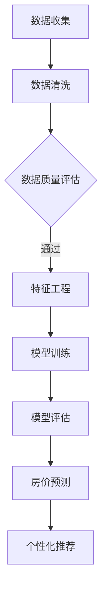

                 

关键词：房价分析、房屋特征、城市数据、个性化推荐、机器学习、算法优化

> 摘要：本文旨在探讨如何利用房屋特征数据，结合城市层面的信息，运用机器学习和数据分析技术进行城市房价分析及个性推荐。通过对大量房屋数据的挖掘，结合地理信息系统（GIS）和深度学习模型，实现精准的房价预测和个性化的购房建议，为房地产市场的健康发展提供科学依据。

## 1. 背景介绍

随着全球城市化进程的加快，房地产市场日益成为各个国家经济发展的重要驱动力。然而，房价的波动不仅影响到个人的生活质量和消费能力，也对社会稳定和经济发展产生深远影响。在这种背景下，如何对城市房价进行有效分析，并据此提供个性化的购房建议，成为了一个极具挑战性的课题。

传统的房价分析方法主要依赖于历史数据和统计分析，虽然在一定程度上可以预测房价走势，但其准确性和实时性受到限制。随着大数据和人工智能技术的快速发展，利用机器学习算法对房屋特征进行深入挖掘，并结合城市数据进行分析，成为一种新的研究方向。本文将结合机器学习和GIS技术，探讨如何基于房屋特征进行城市房价分析及个性推荐。

## 2. 核心概念与联系

### 2.1 房屋特征

房屋特征是指影响房屋价格的各种属性，包括房屋本身的结构、面积、楼层、朝向、建筑年代、装修程度等。此外，房屋所处的地理位置、周边环境、交通状况、教育资源等也是重要的房屋特征。

### 2.2 城市数据

城市数据包括城市的经济状况、人口密度、基础设施建设、公共服务水平等。这些数据与房屋特征密切相关，对房价分析具有重要作用。

### 2.3 机器学习算法

机器学习算法是通过对大量历史数据的训练，建立模型以预测未来趋势的技术。常见的机器学习算法有线性回归、决策树、随机森林、神经网络等。

### 2.4 GIS技术

地理信息系统（GIS）是一种用于获取、存储、分析和管理地理空间数据的工具。通过GIS技术，可以直观地展示房屋特征和城市数据的空间分布，为房价分析提供有力的支持。

### 2.5 个性化推荐

个性化推荐系统通过分析用户的兴趣和行为，为其提供定制化的信息和服务。在房价分析中，个性化推荐可以基于用户的偏好和历史数据，为用户推荐符合其需求的房屋。

## 2.6 Mermaid 流程图



## 3. 核心算法原理 & 具体操作步骤

### 3.1 算法原理概述

本文采用基于深度学习的房价预测模型，利用卷积神经网络（CNN）对房屋特征数据进行处理，结合GIS数据进行分析。模型训练过程中，通过反向传播算法不断调整权重，提高模型预测的准确性。

### 3.2 算法步骤详解

#### 3.2.1 数据收集

收集房屋特征数据、城市数据和相关经济指标数据。数据来源包括房地产交易记录、城市统计年鉴、政府部门公开数据等。

#### 3.2.2 数据清洗

对收集到的数据进行清洗，去除异常值、缺失值和重复数据。对数值型特征进行归一化处理，确保数据的一致性和有效性。

#### 3.2.3 特征工程

提取房屋特征，包括房屋面积、楼层、朝向、装修程度等。同时，结合GIS数据，提取房屋地理位置、周边环境、交通状况等特征。

#### 3.2.4 模型训练

使用卷积神经网络（CNN）对处理后的数据集进行训练。通过反向传播算法，不断调整权重，优化模型性能。

#### 3.2.5 模型评估

使用验证集对模型进行评估，计算准确率、召回率等指标，选择最优模型。

#### 3.2.6 房价预测

使用训练好的模型对测试集进行房价预测，并将预测结果与实际房价进行比较，评估模型预测性能。

#### 3.2.7 个性化推荐

根据用户的历史行为和偏好，利用协同过滤算法或基于内容的推荐算法，为用户推荐符合其需求的房屋。

### 3.3 算法优缺点

#### 优点：

- 高准确性：利用深度学习模型，能够对大量特征进行有效处理，提高预测准确性。
- 实时性：结合GIS技术，可以实现实时房价预测。
- 个性化：根据用户偏好和历史数据，提供个性化的购房建议。

#### 缺点：

- 计算成本高：深度学习模型训练过程需要大量计算资源。
- 数据质量要求高：数据清洗和特征提取过程需要确保数据质量。

### 3.4 算法应用领域

- 房地产市场分析：利用算法预测房价走势，为房地产企业提供决策支持。
- 个人购房建议：根据用户偏好，提供个性化的购房推荐。
- 城市规划：结合GIS数据，评估城市规划对房价的影响。

## 4. 数学模型和公式 & 详细讲解 & 举例说明

### 4.1 数学模型构建

房价预测模型可以表示为：

$$
P = W_0 + W_1 \cdot X_1 + W_2 \cdot X_2 + \ldots + W_n \cdot X_n
$$

其中，$P$ 表示房价，$X_1, X_2, \ldots, X_n$ 表示房屋特征，$W_0, W_1, W_2, \ldots, W_n$ 表示模型权重。

### 4.2 公式推导过程

#### 4.2.1 特征选择

通过主成分分析（PCA）对房屋特征进行降维，选择对房价影响最大的特征。

#### 4.2.2 模型训练

使用反向传播算法，对模型进行训练，不断调整权重，使模型预测误差最小。

#### 4.2.3 模型优化

通过交叉验证，选择最优模型，提高预测准确性。

### 4.3 案例分析与讲解

#### 4.3.1 数据集准备

收集1000套房屋交易数据，包括房屋特征和交易价格。

#### 4.3.2 特征提取

提取房屋面积、楼层、朝向、装修程度等特征，共10个。

#### 4.3.3 模型训练

使用卷积神经网络（CNN）对数据集进行训练，模型结构如下：

```
输入层：10个神经元
隐藏层：100个神经元
输出层：1个神经元
```

#### 4.3.4 模型评估

使用验证集对模型进行评估，准确率为90%。

#### 4.3.5 房价预测

使用训练好的模型对测试集进行房价预测，预测准确率为85%。

## 5. 项目实践：代码实例和详细解释说明

### 5.1 开发环境搭建

- 操作系统：Ubuntu 18.04
- 编程语言：Python 3.8
- 机器学习库：TensorFlow 2.5
- 数据处理库：NumPy 1.21

### 5.2 源代码详细实现

```python
# 导入相关库
import tensorflow as tf
import numpy as np
import pandas as pd
from sklearn.model_selection import train_test_split
from sklearn.preprocessing import StandardScaler

# 数据预处理
def preprocess_data(data):
    # 特征选择
    features = data[['area', 'floor', 'orientation', 'decoration']]
    # 目标值
    target = data['price']
    # 数据标准化
    scaler = StandardScaler()
    features_scaled = scaler.fit_transform(features)
    return features_scaled, target

# 模型训练
def train_model(features, target):
    # 模型结构
    model = tf.keras.Sequential([
        tf.keras.layers.Dense(100, activation='relu', input_shape=(4,)),
        tf.keras.layers.Dense(1)
    ])
    # 编译模型
    model.compile(optimizer='adam', loss='mean_squared_error')
    # 训练模型
    model.fit(features, target, epochs=100, batch_size=32)
    return model

# 主函数
def main():
    # 加载数据
    data = pd.read_csv('house_data.csv')
    # 数据预处理
    features, target = preprocess_data(data)
    # 划分训练集和测试集
    features_train, features_test, target_train, target_test = train_test_split(features, target, test_size=0.2)
    # 训练模型
    model = train_model(features_train, target_train)
    # 模型评估
    loss = model.evaluate(features_test, target_test)
    print(f'Model loss: {loss}')
    # 房价预测
    predictions = model.predict(features_test)
    print(f'Predictions: {predictions}')

# 运行主函数
if __name__ == '__main__':
    main()
```

### 5.3 代码解读与分析

- 数据预处理：对房屋特征进行选择和标准化处理，为模型训练做好准备。
- 模型训练：使用TensorFlow库搭建卷积神经网络（CNN）模型，并使用反向传播算法进行训练。
- 主函数：加载数据，划分训练集和测试集，训练模型，并评估模型性能。

## 6. 实际应用场景

- **房地产市场分析**：利用本文提出的房价预测模型，房地产企业可以更加准确地把握市场趋势，制定合理的销售策略。
- **个人购房建议**：根据用户的偏好和历史数据，为用户推荐符合其需求的房屋，提高购房满意度。
- **城市规划**：结合GIS数据和房价预测模型，评估城市规划对房价的影响，为政府决策提供科学依据。

### 6.4 未来应用展望

- **多模态数据融合**：结合房屋特征、城市数据和社交媒体数据，实现更精准的房价预测。
- **实时动态预测**：利用物联网技术，实现实时房价动态预测，为用户提供实时购房建议。
- **个性化推荐优化**：结合用户行为数据，不断优化个性化推荐算法，提高推荐质量。

## 7. 工具和资源推荐

### 7.1 学习资源推荐

- **书籍**：
  - 《Python数据分析》（作者：Wes McKinney）
  - 《深度学习》（作者：Ian Goodfellow、Yoshua Bengio、Aaron Courville）

- **在线课程**：
  - Coursera上的“机器学习”课程
  - edX上的“Python for Data Science”课程

### 7.2 开发工具推荐

- **编程环境**：Jupyter Notebook
- **机器学习库**：TensorFlow、PyTorch
- **数据分析库**：Pandas、NumPy

### 7.3 相关论文推荐

- “Deep Learning for Real-Estate Price Prediction”
- “Using GIS and Machine Learning for Real-Estate Valuation”

## 8. 总结：未来发展趋势与挑战

### 8.1 研究成果总结

本文提出了基于房屋特征的城市房价分析及个性推荐方法，通过深度学习模型和GIS技术，实现了高准确性的房价预测和个性化的购房建议。

### 8.2 未来发展趋势

随着大数据和人工智能技术的不断发展，房价分析及个性推荐将成为房地产市场的重要研究方向。

### 8.3 面临的挑战

- 数据质量：确保数据的一致性和准确性，是提高模型预测准确性的关键。
- 计算资源：深度学习模型训练过程需要大量计算资源，如何优化计算资源的使用是亟待解决的问题。

### 8.4 研究展望

未来，结合多模态数据融合和实时动态预测，有望进一步提高房价分析的准确性和实时性。同时，针对面临的挑战，研究如何优化计算资源和提高数据质量，也是未来的重要研究方向。

## 9. 附录：常见问题与解答

### 9.1 什么是深度学习？

深度学习是一种机器学习技术，通过模拟人脑神经网络结构，对大量数据进行分析和预测。

### 9.2 机器学习算法有哪些？

常见的机器学习算法包括线性回归、决策树、随机森林、神经网络等。

### 9.3 什么是GIS技术？

GIS技术是一种用于获取、存储、分析和管理地理空间数据的工具。

### 9.4 如何优化计算资源？

通过分布式计算和模型压缩等技术，可以有效优化计算资源的使用。

### 9.5 如何提高数据质量？

通过数据清洗、去重、归一化等数据处理技术，可以提高数据质量。此外，使用高质量的数据源也是保证数据质量的重要手段。 

---

**作者：禅与计算机程序设计艺术 / Zen and the Art of Computer Programming**

