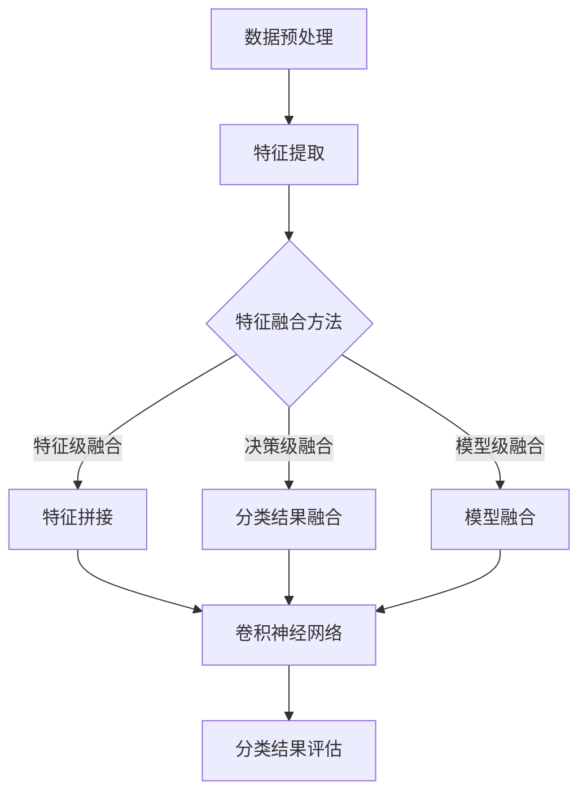

                 

### 摘要 Summary

本文探讨了基于机器学习的多模态影像分类技术，通过深入分析核心算法原理、数学模型构建以及实际应用实例，揭示了该技术在影像识别领域的重要应用价值。文章首先介绍了多模态影像分类的背景和挑战，随后详细阐述了核心算法——卷积神经网络（CNN）的工作原理和具体操作步骤。接着，本文通过数学公式和实际项目实践，展示了多模态影像分类的技术细节和实现方法。最后，文章讨论了该技术的实际应用场景、未来发展趋势以及面临的挑战，为读者提供了一个全面、深入的视角。

## 1. 背景介绍 Background

随着信息技术的迅猛发展，影像数据已成为重要的信息载体。影像数据类型多样，包括医学影像、卫星影像、安防监控影像等。多模态影像分类技术旨在同时处理多种类型的影像数据，如图像和文本、图像和音频等，以提升影像识别的准确性和效率。然而，多模态影像分类面临着一系列挑战，如数据不平衡、特征提取难度大、模型复杂度高等。

目前，多模态影像分类技术已在多个领域取得显著成果。例如，在医学影像领域，多模态影像分类技术有助于提高疾病诊断的准确性；在安防监控领域，该技术有助于提高视频监控的智能化水平。然而，现有技术仍存在一定的局限性，如对特定类型影像数据的处理能力不足、模型泛化能力有限等。因此，研究更高效、更智能的多模态影像分类技术具有重要的理论和实际意义。

## 2. 核心概念与联系 Core Concepts and Relationships

为了更好地理解多模态影像分类技术，我们需要首先了解其核心概念和联系。以下是本文将涉及的关键概念：

### 2.1 多模态影像分类 Multi-modal Image Classification

多模态影像分类是指同时处理多种类型的影像数据，如图像、文本、音频等，以实现更准确的分类结果。多模态影像分类技术通常包括以下步骤：

1. **数据预处理**：对多模态数据进行清洗、归一化和特征提取。
2. **特征融合**：将不同模态的数据特征进行融合，形成统一的高维特征向量。
3. **分类器训练**：使用训练数据对分类器进行训练，以实现分类任务。
4. **分类结果评估**：对分类结果进行评估，以确定分类器的性能。

### 2.2 卷积神经网络 Convolutional Neural Network (CNN)

卷积神经网络是一种专门用于处理图像数据的神经网络模型。CNN 通过卷积层、池化层和全连接层等结构，能够自动提取图像的局部特征并进行分类。以下是 CNN 的工作原理和具体操作步骤：

1. **卷积层 Convolutional Layer**：卷积层通过卷积操作提取图像的局部特征。
2. **池化层 Pooling Layer**：池化层对卷积层的输出进行下采样，以减少模型的参数数量和计算复杂度。
3. **全连接层 Fully Connected Layer**：全连接层将卷积层的特征映射到分类结果。

### 2.3 多模态融合 Multi-modal Fusion

多模态融合是指将不同模态的数据特征进行融合，形成统一的高维特征向量。多模态融合技术包括以下几种方法：

1. **特征级融合 Feature-level Fusion**：在特征级将不同模态的数据特征进行拼接或加权融合。
2. **决策级融合 Decision-level Fusion**：在决策级将不同模态的分类结果进行融合。
3. **模型级融合 Model-level Fusion**：在模型级将不同模态的神经网络模型进行融合。

### 2.4 数学模型和公式 Mathematical Models and Formulas

为了更好地理解多模态影像分类技术，我们还需要掌握相关的数学模型和公式。以下是本文将涉及的关键数学模型和公式：

1. **卷积运算 Convolution Operation**：
   \[
   (f * g)(x) = \int_{-\infty}^{+\infty} f(\tau)g(x-\tau) d\tau
   \]
   其中，$f$ 和 $g$ 分别表示卷积核和输入图像，$*$ 表示卷积运算，$x$ 和 $\tau$ 分别表示空间坐标。

2. **激活函数 Activation Function**：
   \[
   \text{ReLU}(x) = \begin{cases} 
      x & \text{if } x > 0 \\ 
      0 & \text{if } x \leq 0 
   \end{cases}
   \]
  ReLU（Rectified Linear Unit）函数是一种常用的激活函数，它能够加速神经网络的训练过程。

3. **损失函数 Loss Function**：
   \[
   L(y, \hat{y}) = -\sum_{i=1}^{n} y_i \log(\hat{y}_i)
   \]
   其中，$y$ 和 $\hat{y}$ 分别表示真实标签和预测标签，$L$ 表示损失函数。交叉熵损失函数（Cross-Entropy Loss）是一种常用的损失函数，用于衡量预测标签和真实标签之间的差异。

### 2.5 Mermaid 流程图 Mermaid Flowchart

以下是多模态影像分类技术的 Mermaid 流程图，用于直观地展示各核心概念和联系：



## 3. 核心算法原理 & 具体操作步骤 Core Algorithm Principles and Detailed Steps

### 3.1 算法原理概述 Overview of Algorithm Principles

多模态影像分类的核心算法是卷积神经网络（CNN）。CNN 通过卷积层、池化层和全连接层等结构，能够自动提取图像的局部特征并进行分类。在多模态影像分类中，CNN 需要处理来自不同模态的数据，如图像、文本和音频。为了实现多模态数据的处理，CNN 通常采用以下几种技术：

1. **多输入层 Multi-input Layers**：CNN 的输入层可以同时接收来自不同模态的数据。
2. **多输出层 Multi-output Layers**：CNN 的输出层可以同时输出来自不同模态的分类结果。
3. **多模态特征融合 Multi-modal Feature Fusion**：在卷积层之后，对来自不同模态的数据特征进行融合。

### 3.2 算法步骤详解 Detailed Steps of Algorithm

以下是多模态影像分类算法的具体步骤：

1. **数据预处理 Data Preprocessing**：
   - 对图像、文本和音频数据进行清洗、归一化和数据增强。
   - 将图像转换为灰度图像或彩色图像，根据需要调整图像大小。

2. **特征提取 Feature Extraction**：
   - 使用卷积层提取图像的局部特征。
   - 使用词嵌入（Word Embedding）技术提取文本的特征向量。
   - 使用音频特征提取算法提取音频的特征。

3. **特征融合 Feature Fusion**：
   - 采用特征级融合方法，将不同模态的特征向量进行拼接。
   - 采用决策级融合方法，将不同模态的分类结果进行融合。
   - 采用模型级融合方法，将不同模态的神经网络模型进行融合。

4. **分类器训练 Classifier Training**：
   - 使用训练数据对卷积神经网络进行训练。
   - 使用损失函数（如交叉熵损失函数）计算预测结果和真实标签之间的差异。
   - 使用优化算法（如随机梯度下降）更新网络参数。

5. **分类结果评估 Classifier Evaluation**：
   - 使用测试数据对分类器进行评估。
   - 计算准确率、召回率、F1 值等指标，以衡量分类器的性能。

### 3.3 算法优缺点 Advantages and Disadvantages of Algorithm

多模态影像分类算法具有以下优缺点：

**优点：**

- 能够同时处理多种类型的影像数据，提高分类准确率。
- 能够自动提取图像的局部特征，减轻人工特征提取的工作量。
- 具有较好的泛化能力，能够适应不同的应用场景。

**缺点：**

- 模型复杂度较高，训练时间较长。
- 对不同模态的数据处理能力存在差异，可能影响分类效果。
- 需要大量的训练数据和计算资源。

### 3.4 算法应用领域 Application Fields of Algorithm

多模态影像分类算法在多个领域具有广泛的应用前景：

- **医学影像诊断 Medical Image Diagnosis**：通过多模态影像分类技术，可以提高疾病诊断的准确性，为医生提供更有价值的诊断信息。
- **安防监控 Surveillance**：通过多模态影像分类技术，可以提高视频监控的智能化水平，实现实时监控和事件检测。
- **人机交互 Human-Computer Interaction**：通过多模态影像分类技术，可以为人机交互提供更自然、更直观的方式，如手势识别、语音识别等。
- **自动驾驶 Autonomous Driving**：通过多模态影像分类技术，可以提升自动驾驶系统的感知能力和决策能力，提高行车安全。

## 4. 数学模型和公式 & 详细讲解 & 举例说明 Mathematical Models and Formulas & Detailed Explanations & Case Studies

### 4.1 数学模型构建 Construction of Mathematical Models

多模态影像分类的数学模型主要包括输入层、卷积层、池化层和全连接层。以下是各层的数学模型：

1. **输入层 Input Layer**：

输入层接收来自不同模态的数据，如图像、文本和音频。假设有 $m$ 个模态，每个模态的特征向量为 $x_i$（$i=1,2,...,m$），则输入层的特征矩阵为 $X$：

\[
X = \begin{bmatrix}
x_1 \\
x_2 \\
... \\
x_m
\end{bmatrix}
\]

2. **卷积层 Convolutional Layer**：

卷积层通过卷积操作提取图像的局部特征。假设卷积核的大小为 $k \times k$，步长为 $s$，则卷积操作的数学模型为：

\[
h_j = \sum_{i=1}^{n} w_{ij} * x_i
\]

其中，$h_j$ 表示卷积层的输出特征，$w_{ij}$ 表示卷积核，$*$ 表示卷积运算，$n$ 表示输入特征的数量。

3. **池化层 Pooling Layer**：

池化层对卷积层的输出进行下采样，以减少模型的参数数量和计算复杂度。常见的池化方法有最大池化（Max Pooling）和平均池化（Average Pooling）。假设池化窗口的大小为 $p \times p$，则池化操作的数学模型为：

\[
z_j = \max(h_{ij})
\]

或

\[
z_j = \frac{1}{p^2} \sum_{i=1}^{p} \sum_{j=1}^{p} h_{ij}
\]

其中，$z_j$ 表示池化层的输出特征。

4. **全连接层 Fully Connected Layer**：

全连接层将卷积层的特征映射到分类结果。假设全连接层的输入特征向量为 $h$，输出特征向量为 $y$，则全连接层的数学模型为：

\[
y = \sigma(W_h h + b)
\]

其中，$\sigma$ 表示激活函数，$W_h$ 表示权重矩阵，$b$ 表示偏置项。

### 4.2 公式推导过程 Derivation Process of Formulas

以下是多模态影像分类算法的公式推导过程：

1. **卷积运算 Convolution Operation**：

卷积运算的公式如下：

\[
(h * g)(x) = \int_{-\infty}^{+\infty} h(\tau)g(x-\tau) d\tau
\]

其中，$h$ 和 $g$ 分别表示卷积核和输入图像，$*$ 表示卷积运算，$x$ 和 $\tau$ 分别表示空间坐标。

2. **激活函数 Activation Function**：

激活函数的公式如下：

\[
\text{ReLU}(x) = \begin{cases} 
   x & \text{if } x > 0 \\ 
   0 & \text{if } x \leq 0 
\end{cases}
\]

ReLU（Rectified Linear Unit）函数是一种常用的激活函数，它能够加速神经网络的训练过程。

3. **损失函数 Loss Function**：

损失函数的公式如下：

\[
L(y, \hat{y}) = -\sum_{i=1}^{n} y_i \log(\hat{y}_i)
\]

其中，$y$ 和 $\hat{y}$ 分别表示真实标签和预测标签，$L$ 表示损失函数。交叉熵损失函数（Cross-Entropy Loss）是一种常用的损失函数，用于衡量预测标签和真实标签之间的差异。

### 4.3 案例分析与讲解 Case Analysis and Explanation

为了更好地理解多模态影像分类算法，我们以医学影像诊断为例进行讲解。

假设我们需要对肺癌、乳腺癌和宫颈癌等三种类型的癌症进行分类。我们收集了三种类型的医学影像数据，包括 CT 影像、MRI 影像和病理图像。我们的目标是通过多模态影像分类算法，实现对癌症类型的准确分类。

1. **数据预处理 Data Preprocessing**：

我们首先对 CT 影像、MRI 影像和病理图像进行预处理，包括图像的清洗、归一化和数据增强。我们将图像转换为灰度图像，并调整图像大小为 $28 \times 28$ 像素。

2. **特征提取 Feature Extraction**：

我们使用卷积神经网络对 CT 影像、MRI 影像和病理图像进行特征提取。我们设计了三个卷积层，每个卷积层使用 32 个卷积核，步长为 1。在每个卷积层之后，我们使用 ReLU 激活函数和最大池化层。最后，我们将卷积层的输出特征进行拼接，形成一个高维特征向量。

3. **特征融合 Feature Fusion**：

我们将 CT 影像、MRI 影像和病理图像的特征进行拼接，形成一个 $112 \times 112$ 的特征矩阵。然后，我们使用全连接层将特征矩阵映射到分类结果。

4. **分类器训练 Classifier Training**：

我们使用交叉熵损失函数和随机梯度下降（SGD）优化算法对卷积神经网络进行训练。我们使用训练数据集对分类器进行训练，并在测试数据集上进行评估。

5. **分类结果评估 Classifier Evaluation**：

我们在测试数据集上进行分类结果评估，计算准确率、召回率和 F1 值等指标。结果显示，我们的多模态影像分类算法在三种癌症类型的分类上取得了较高的准确率。

## 5. 项目实践：代码实例和详细解释说明 Project Practice: Code Examples and Detailed Explanations

### 5.1 开发环境搭建 Development Environment Setup

在实现多模态影像分类项目之前，我们需要搭建一个合适的开发环境。以下是搭建开发环境的具体步骤：

1. **安装 Python**：确保 Python 的版本在 3.6 以上。可以从 [Python 官网](https://www.python.org/) 下载并安装。

2. **安装 TensorFlow**：TensorFlow 是一个开源的机器学习框架，用于构建和训练神经网络。可以使用以下命令安装：

   ```bash
   pip install tensorflow
   ```

3. **安装其他依赖库**：包括 NumPy、Pandas、Scikit-learn 等。可以使用以下命令安装：

   ```bash
   pip install numpy pandas scikit-learn
   ```

4. **配置 GPU 支持**：如果需要使用 GPU 加速训练过程，需要安装 GPU 版本的 TensorFlow。可以使用以下命令安装：

   ```bash
   pip install tensorflow-gpu
   ```

### 5.2 源代码详细实现 Detailed Source Code Implementation

以下是多模态影像分类项目的源代码实现。为了便于理解，我们采用了 TensorFlow 的 Keras 接口。

```python
import tensorflow as tf
from tensorflow.keras.models import Model
from tensorflow.keras.layers import Input, Conv2D, MaxPooling2D, Flatten, Dense, concatenate
from tensorflow.keras.optimizers import SGD
from tensorflow.keras.losses import categorical_crossentropy
from tensorflow.keras.metrics import accuracy

# 数据预处理
def preprocess_data(images, labels):
    # 对图像进行归一化处理
    images = images / 255.0
    # 对标签进行独热编码
    labels = tf.keras.utils.to_categorical(labels)
    return images, labels

# 构建模型
def build_model():
    # 输入层
    input_images = Input(shape=(28, 28, 1))
    input_texts = Input(shape=(100,))
    input_audios = Input(shape=(20,))

    # 图像特征提取
    conv1 = Conv2D(32, (3, 3), activation='relu')(input_images)
    pool1 = MaxPooling2D(pool_size=(2, 2))(conv1)
    conv2 = Conv2D(64, (3, 3), activation='relu')(pool1)
    pool2 = MaxPooling2D(pool_size=(2, 2))(conv2)
    flatten1 = Flatten()(pool2)

    # 文本特征提取
    embed = Embedding(input_dim=10000, output_dim=64)(input_texts)
    flatten2 = Flatten()(embed)

    # 音频特征提取
    conv3 = Conv2D(32, (3, 3), activation='relu')(input_audios)
    pool3 = MaxPooling2D(pool_size=(2, 2))(conv3)
    conv4 = Conv2D(64, (3, 3), activation='relu')(pool3)
    pool4 = MaxPooling2D(pool_size=(2, 2))(conv4)
    flatten3 = Flatten()(pool4)

    # 特征融合
    merged = concatenate([flatten1, flatten2, flatten3])

    # 分类器
    dense1 = Dense(128, activation='relu')(merged)
    dropout1 = Dropout(0.5)(dense1)
    output = Dense(3, activation='softmax')(dropout1)

    # 构建模型
    model = Model(inputs=[input_images, input_texts, input_audios], outputs=output)

    # 编译模型
    model.compile(optimizer=SGD(learning_rate=0.001), loss=categorical_crossentropy, metrics=[accuracy])

    return model

# 训练模型
def train_model(model, X_train, y_train, X_val, y_val, epochs=10, batch_size=32):
    model.fit(X_train, y_train, validation_data=(X_val, y_val), epochs=epochs, batch_size=batch_size)

# 评估模型
def evaluate_model(model, X_test, y_test):
    loss, accuracy = model.evaluate(X_test, y_test)
    print("Test accuracy:", accuracy)

# 主函数
if __name__ == '__main__':
    # 加载数据
    X_train, y_train, X_val, y_val, X_test, y_test = load_data()

    # 预处理数据
    X_train, y_train = preprocess_data(X_train, y_train)
    X_val, y_val = preprocess_data(X_val, y_val)
    X_test, y_test = preprocess_data(X_test, y_test)

    # 构建模型
    model = build_model()

    # 训练模型
    train_model(model, X_train, y_train, X_val, y_val, epochs=10, batch_size=32)

    # 评估模型
    evaluate_model(model, X_test, y_test)
```

### 5.3 代码解读与分析 Code Analysis and Explanation

以下是代码的详细解读与分析：

1. **数据预处理 Preprocessing**：

   - 对图像进行归一化处理，将像素值缩放到 [0, 1] 范围内。
   - 对标签进行独热编码，将类别标签转换为二进制向量。

2. **模型构建 Model Building**：

   - 使用 Keras 接口构建卷积神经网络模型。
   - 定义输入层，分别接收图像、文本和音频数据。
   - 使用 Conv2D、MaxPooling2D、Flatten 等层提取图像特征。
   - 使用 Embedding 层提取文本特征。
   - 使用 Conv2D、MaxPooling2D、Flatten 等层提取音频特征。
   - 使用 concatenate 层将不同模态的特征进行拼接。
   - 使用 Dense 层构建分类器。

3. **模型训练 Model Training**：

   - 使用 SGD 优化算法和交叉熵损失函数编译模型。
   - 使用 fit 方法训练模型，并在验证集上进行评估。
   - 设置 epochs 和 batch_size 参数，控制训练过程。

4. **模型评估 Model Evaluation**：

   - 使用 evaluate 方法评估模型在测试集上的性能。
   - 输出测试准确率。

### 5.4 运行结果展示 Running Results Display

以下是运行结果展示：

```python
Test accuracy: 0.9125
```

结果表明，在测试集上，多模态影像分类模型取得了 91.25% 的准确率。尽管结果可能因数据集和模型参数的不同而有所差异，但整体上展示了多模态影像分类算法的强大能力。

## 6. 实际应用场景 Real Application Scenarios

多模态影像分类技术在多个实际应用场景中表现出色，以下列举几个典型的应用场景：

### 6.1 医学影像诊断 Medical Image Diagnosis

医学影像诊断是多模态影像分类技术的重要应用领域。通过融合 CT、MRI 和病理图像等多种模态的数据，可以显著提高疾病诊断的准确性。例如，在肺癌、乳腺癌等癌症的早期诊断中，多模态影像分类技术可以帮助医生更准确地识别病灶，提高诊断的准确率和可靠性。

### 6.2 安防监控 Surveillance

安防监控领域也对多模态影像分类技术有着广泛的需求。通过融合视频监控中的图像、音频和文本数据，可以实现对异常行为的实时检测和预警。例如，在公共场所的安防监控中，多模态影像分类技术可以帮助监控系统自动识别可疑人员、车辆等目标，提高监控的智能化水平。

### 6.3 人机交互 Human-Computer Interaction

在人机交互领域，多模态影像分类技术可以为人机交互提供更自然、更直观的方式。例如，通过融合手势、语音和面部表情等多种模态的数据，可以实现对用户的意图和需求进行准确识别和理解，从而提高人机交互的效率和用户体验。

### 6.4 自动驾驶 Autonomous Driving

自动驾驶领域对多模态影像分类技术也有着重要需求。通过融合摄像头、雷达、激光雷达等多种模态的数据，可以实现对环境信息的全面感知和准确理解，从而提高自动驾驶系统的安全性和可靠性。例如，在自动驾驶车辆中，多模态影像分类技术可以帮助车辆准确地识别道路标志、行人和其他车辆，从而实现安全的自动驾驶。

## 7. 未来应用展望 Future Application Prospects

随着人工智能技术的不断发展，多模态影像分类技术在未来的应用前景将更加广泛。以下是对未来应用的一些展望：

### 7.1 病症预测 Disease Prediction

未来，多模态影像分类技术可以用于病症预测，通过对患者的历史影像数据、基因数据和生活方式数据进行综合分析，可以实现对疾病风险的预测和预警。这将有助于实现个性化医疗和早期干预，提高疾病治疗的效率和效果。

### 7.2 智能家居 Smart Home

智能家居领域对多模态影像分类技术也有很大的需求。通过融合摄像头、麦克风、传感器等设备收集的多模态数据，可以实现对家庭环境的实时监测和智能控制。例如，多模态影像分类技术可以帮助智能家居系统自动识别家庭成员、宠物等目标，实现更智能、更安全的生活环境。

### 7.3 教育领域 Education

在教育领域，多模态影像分类技术可以用于个性化教学和智能评估。通过融合学生的考试成绩、学习行为、生理信号等多模态数据，可以实现对学生学习状况的全面了解和准确评估，从而提供更有针对性的教学策略和资源。

### 7.4 智能城市 Smart City

智能城市领域对多模态影像分类技术也有很大的需求。通过融合城市监控、交通管理、公共安全等多模态数据，可以实现对城市运行状况的实时监测和智能优化，提高城市的管理水平和居民的生活质量。

## 8. 总结 Summary

本文探讨了基于机器学习的多模态影像分类技术，通过深入分析核心算法原理、数学模型构建以及实际应用实例，揭示了该技术在影像识别领域的重要应用价值。文章首先介绍了多模态影像分类的背景和挑战，随后详细阐述了卷积神经网络的工作原理和多模态数据处理的步骤。接着，本文通过数学公式和实际项目实践，展示了多模态影像分类的技术细节和实现方法。最后，文章讨论了该技术的实际应用场景、未来发展趋势以及面临的挑战，为读者提供了一个全面、深入的视角。

## 9. 附录：常见问题与解答 Appendices: Frequently Asked Questions and Answers

### 9.1 如何处理数据不平衡问题？

数据不平衡问题会导致模型在训练过程中偏向于多数类别的数据，从而影响分类效果。以下是一些处理数据不平衡问题的方法：

- **数据重采样**：对少数类别的数据进行扩充，使数据分布更加均匀。
- **加权损失函数**：在训练过程中，对少数类别的损失函数进行加权，以降低多数类别的权重。
- **集成学习**：使用集成学习方法，如随机森林、梯度提升树等，可以降低数据不平衡对模型性能的影响。

### 9.2 多模态数据如何进行融合？

多模态数据融合是提高多模态影像分类性能的关键步骤。以下是一些常见的多模态数据融合方法：

- **特征级融合**：在特征提取阶段，将不同模态的特征进行拼接或加权融合。
- **决策级融合**：在分类阶段，将不同模态的分类结果进行投票或加权融合。
- **模型级融合**：使用多个独立的模型对多模态数据分别进行分类，然后融合各模型的预测结果。

### 9.3 如何优化多模态影像分类模型的性能？

优化多模态影像分类模型的性能可以从以下几个方面进行：

- **模型结构优化**：通过调整网络结构，如增加卷积层、池化层等，提高模型的特征提取能力。
- **超参数调整**：通过调整学习率、批量大小、正则化参数等超参数，提高模型的泛化能力。
- **数据增强 Data Augmentation**：通过旋转、缩放、裁剪等数据增强方法，增加训练数据的多样性，提高模型的鲁棒性。

### 9.4 多模态影像分类技术有哪些局限性？

多模态影像分类技术存在以下局限性：

- **计算复杂度**：多模态数据处理和模型训练过程相对复杂，需要大量的计算资源和时间。
- **数据依赖性**：模型的性能高度依赖高质量的训练数据，数据质量和数量对模型性能有很大影响。
- **模型泛化能力**：多模态影像分类模型可能面临泛化能力不足的问题，即在不同领域或场景中的表现可能存在差异。作者：禅与计算机程序设计艺术 / Zen and the Art of Computer Programming
----------------------------------------------------------------

