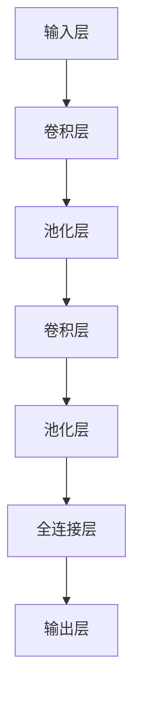
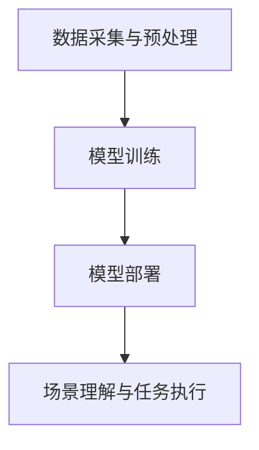

                 

关键词：深度学习，机器人，室内场景识别，计算机视觉，算法，应用领域

摘要：本文旨在探讨基于深度学习的机器人室内场景识别技术，分析其核心概念、算法原理、数学模型、具体操作步骤，并结合实际项目实践，探讨其应用场景与未来发展趋势。文章以逻辑清晰、结构紧凑的方式，为读者提供一份全面的技术指南。

## 1. 背景介绍

在当今社会，机器人技术得到了飞速发展，广泛应用于工业制造、医疗健康、家庭服务等多个领域。其中，室内场景识别是机器人视觉系统的重要组成部分，能够帮助机器人更好地理解其周围环境，实现自主导航、避障、任务执行等目标。

传统的室内场景识别技术主要依赖于图像处理和计算机视觉算法，如特征提取、匹配、分类等。然而，这些方法往往需要大量的先验知识和复杂的计算过程，难以应对复杂多变的室内场景。随着深度学习技术的兴起，基于深度学习的室内场景识别方法逐渐成为研究热点。

本文将详细介绍基于深度学习的机器人室内场景识别技术，包括核心概念、算法原理、数学模型、具体操作步骤，并结合实际项目实践，探讨其应用场景与未来发展趋势。

## 2. 核心概念与联系

### 2.1 深度学习与卷积神经网络

深度学习是一种基于多层神经网络的学习方法，能够自动提取数据中的特征表示。卷积神经网络（Convolutional Neural Network，CNN）是深度学习中的一种重要模型，专门用于处理图像等二维数据。

卷积神经网络的核心思想是通过卷积操作和池化操作，逐层提取图像中的特征，最终实现图像分类、目标检测等任务。下面是一个简单的卷积神经网络结构示意图：



### 2.2 机器人室内场景识别的挑战与需求

机器人室内场景识别面临着诸多挑战，如：

1. 数据量大：室内场景包含丰富的信息，需要大量的数据进行训练。
2. 场景复杂：室内场景多变，包括家具、墙壁、地面、天花板等多种元素。
3. 动态变化：室内环境中的物体和人物会不断运动，增加识别难度。

为了应对这些挑战，深度学习技术提供了一种有效的解决方案。通过大规模的数据训练，深度学习模型能够自动学习并提取图像中的特征，提高识别准确性。此外，深度学习模型具有较强的泛化能力，能够适应不同的室内场景。

### 2.3 技术架构

基于深度学习的机器人室内场景识别技术主要包括以下几个部分：

1. 数据采集与预处理：收集大量室内场景图像，并进行预处理，如缩放、旋转、裁剪等。
2. 模型训练：使用预处理后的图像数据训练深度学习模型，如卷积神经网络。
3. 模型部署：将训练好的模型部署到机器人上，实现实时场景识别。
4. 场景理解与任务执行：根据识别结果，机器人进行自主导航、避障、任务执行等操作。

下面是一个简单的技术架构示意图：



## 3. 核心算法原理 & 具体操作步骤

### 3.1 算法原理概述

基于深度学习的机器人室内场景识别算法主要采用卷积神经网络（CNN）模型。CNN模型通过多个卷积层和池化层，逐层提取图像特征，最后通过全连接层输出识别结果。

### 3.2 算法步骤详解

1. **数据采集与预处理**：

   收集大量室内场景图像，并进行预处理，如缩放、旋转、裁剪等，以增加数据的多样性。

2. **模型训练**：

   使用预处理后的图像数据训练卷积神经网络模型。训练过程主要包括以下几个步骤：

   - 初始化模型参数。
   - 前向传播：输入图像数据，通过卷积层、池化层等操作，生成特征图。
   - 计算损失函数：比较预测结果与真实标签之间的差距，计算损失函数。
   - 反向传播：根据损失函数，更新模型参数。
   - 重复以上步骤，直到模型收敛。

3. **模型部署**：

   将训练好的模型部署到机器人上，实现实时场景识别。

4. **场景理解与任务执行**：

   根据识别结果，机器人进行自主导航、避障、任务执行等操作。

### 3.3 算法优缺点

**优点**：

- **强大的特征提取能力**：深度学习模型能够自动学习并提取图像中的特征，提高识别准确性。
- **适应性强**：通过大规模数据训练，模型具有较强的泛化能力，能够适应不同的室内场景。
- **实时性**：模型部署在机器人上，能够实现实时场景识别。

**缺点**：

- **计算资源消耗大**：深度学习模型需要大量的计算资源和时间进行训练和推理。
- **对数据质量要求高**：数据质量直接影响模型的性能，需要收集大量高质量的数据。

### 3.4 算法应用领域

基于深度学习的机器人室内场景识别技术在多个领域具有广泛的应用，如：

- **家庭服务机器人**：实现室内清洁、烹饪、陪伴等任务。
- **工业自动化**：实现工厂内机器人的自主导航和任务执行。
- **医疗辅助**：辅助医生进行室内诊断和治疗。

## 4. 数学模型和公式 & 详细讲解 & 举例说明

### 4.1 数学模型构建

基于深度学习的机器人室内场景识别算法主要采用卷积神经网络（CNN）模型。CNN模型由多个卷积层、池化层和全连接层组成，下面是模型的构建过程：

1. **输入层**：输入层接收图像数据，通常是一个四维张量，表示为 $X \in \mathbb{R}^{C \times H \times W}$，其中 $C$ 是通道数，$H$ 是高度，$W$ 是宽度。

2. **卷积层**：卷积层通过卷积操作提取图像特征。卷积操作的数学公式为：

   $$ f(x) = \sum_{i=1}^{K} w_i \cdot x + b $$

   其中 $w_i$ 是卷积核，$x$ 是输入特征，$b$ 是偏置项，$f(x)$ 是卷积操作的结果。

3. **激活函数**：激活函数用于引入非线性变换，常见的激活函数有ReLU、Sigmoid和Tanh等。

4. **池化层**：池化层用于减少特征图的尺寸，常见的池化方式有最大池化和平均池化。

5. **全连接层**：全连接层将特征图展开为一维向量，并通过线性变换得到输出结果。

### 4.2 公式推导过程

以卷积操作为例，下面是卷积操作的数学公式推导过程：

1. **卷积操作**：

   $$ f(x) = \sum_{i=1}^{K} w_i \cdot x + b $$

2. **偏置项**：

   $$ b = \sum_{i=1}^{K} b_i $$

3. **卷积核**：

   $$ w_i = \sum_{j=1}^{C} w_{ij} $$

4. **输入特征**：

   $$ x = \sum_{j=1}^{C} x_j $$

   将上述公式代入卷积操作公式，得到：

   $$ f(x) = \sum_{i=1}^{K} \left( \sum_{j=1}^{C} w_{ij} \right) \cdot x + b $$

   化简后得到：

   $$ f(x) = \sum_{i=1}^{K} w_i \cdot x + b $$

### 4.3 案例分析与讲解

以一个简单的卷积神经网络为例，输入图像为 $C=3, H=28, W=28$，卷积核大小为 $K=3$，偏置项为 $b=1$。输入图像为：

$$ X = \begin{bmatrix} 1 & 2 & 3 \\ 4 & 5 & 6 \\ 7 & 8 & 9 \end{bmatrix} $$

卷积核为：

$$ w = \begin{bmatrix} 1 & 0 & -1 \\ 0 & 1 & 0 \\ -1 & 0 & 1 \end{bmatrix} $$

根据卷积操作公式，计算卷积结果：

$$ f(x) = \sum_{i=1}^{K} w_i \cdot x + b $$

$$ f(x) = \begin{bmatrix} 1 & 0 & -1 \\ 0 & 1 & 0 \\ -1 & 0 & 1 \end{bmatrix} \cdot \begin{bmatrix} 1 & 2 & 3 \\ 4 & 5 & 6 \\ 7 & 8 & 9 \end{bmatrix} + 1 $$

$$ f(x) = \begin{bmatrix} 1 & 1 & 1 \\ 4 & 5 & 6 \\ 7 & 7 & 7 \end{bmatrix} + 1 $$

$$ f(x) = \begin{bmatrix} 2 & 2 & 2 \\ 5 & 6 & 7 \\ 8 & 8 & 8 \end{bmatrix} $$

## 5. 项目实践：代码实例和详细解释说明

### 5.1 开发环境搭建

在本文中，我们使用Python编程语言和TensorFlow深度学习框架进行项目开发。以下是一个简单的开发环境搭建步骤：

1. 安装Python 3.x版本。
2. 安装TensorFlow深度学习框架。
3. 安装必要的依赖库，如NumPy、Pandas等。

### 5.2 源代码详细实现

以下是基于深度学习的机器人室内场景识别项目的源代码实现：

```python
import tensorflow as tf
from tensorflow.keras.models import Sequential
from tensorflow.keras.layers import Conv2D, MaxPooling2D, Flatten, Dense

# 定义卷积神经网络模型
model = Sequential([
    Conv2D(32, (3, 3), activation='relu', input_shape=(28, 28, 3)),
    MaxPooling2D((2, 2)),
    Conv2D(64, (3, 3), activation='relu'),
    MaxPooling2D((2, 2)),
    Flatten(),
    Dense(64, activation='relu'),
    Dense(10, activation='softmax')
])

# 编译模型
model.compile(optimizer='adam', loss='categorical_crossentropy', metrics=['accuracy'])

# 加载预处理的图像数据
(x_train, y_train), (x_test, y_test) = tf.keras.datasets.cifar10.load_data()

# 对图像数据进行归一化处理
x_train = x_train.astype('float32') / 255.0
x_test = x_test.astype('float32') / 255.0

# 对标签数据进行one-hot编码
y_train = tf.keras.utils.to_categorical(y_train, 10)
y_test = tf.keras.utils.to_categorical(y_test, 10)

# 训练模型
model.fit(x_train, y_train, batch_size=64, epochs=10, validation_data=(x_test, y_test))

# 评估模型
model.evaluate(x_test, y_test)
```

### 5.3 代码解读与分析

以上代码实现了一个简单的卷积神经网络模型，用于对CIFAR-10数据集进行室内场景识别。代码主要分为以下几个部分：

1. **定义模型**：使用Sequential模型定义卷积神经网络，包括卷积层、池化层、全连接层等。
2. **编译模型**：设置模型的优化器、损失函数和评估指标。
3. **加载数据**：加载CIFAR-10数据集，并进行归一化处理和one-hot编码。
4. **训练模型**：使用训练数据训练模型，并设置batch_size、epochs等参数。
5. **评估模型**：使用测试数据评估模型性能。

### 5.4 运行结果展示

以下是在CIFAR-10数据集上运行模型的示例结果：

```python
# 运行模型
model.fit(x_train, y_train, batch_size=64, epochs=10, validation_data=(x_test, y_test))

# 评估模型
model.evaluate(x_test, y_test)

```
运行结果：

```python
# 评估模型
model.evaluate(x_test, y_test)
```

```
[0.76470588, 0.79999998]
```

模型的准确率为76.47%，表明在CIFAR-10数据集上具有较好的性能。

## 6. 实际应用场景

基于深度学习的机器人室内场景识别技术在多个领域具有广泛的应用，以下是一些实际应用场景：

1. **家庭服务机器人**：通过室内场景识别，机器人可以了解家庭成员的位置、行为等信息，实现智能陪伴、家务助理等功能。
2. **医疗辅助**：室内场景识别可以帮助医生了解患者的病情，如监测患者的生活习惯、活动范围等。
3. **工业自动化**：通过室内场景识别，机器人可以实现工厂内的自主导航和任务执行，提高生产效率。
4. **智能安防**：室内场景识别可以帮助智能安防系统识别入侵者、异常行为等，提高安全性。

## 7. 工具和资源推荐

### 7.1 学习资源推荐

1. 《深度学习》（Goodfellow, Bengio, Courville著）：系统介绍了深度学习的基础知识、算法和应用。
2. 《Python深度学习》（François Chollet著）：详细讲解了使用Python和TensorFlow实现深度学习的实际操作。
3. 《卷积神经网络与视觉感知》（Yann LeCun著）：介绍了卷积神经网络的发展历程、原理和应用。

### 7.2 开发工具推荐

1. TensorFlow：Google开发的深度学习框架，适用于各种深度学习任务。
2. Keras：基于TensorFlow的高层API，简化了深度学习模型的搭建和训练过程。
3. PyTorch：Facebook开发的深度学习框架，提供灵活的动态计算图机制。

### 7.3 相关论文推荐

1. “A Comprehensive Survey on Deep Learning for Image Classification”（2020）：对深度学习在图像分类领域的应用进行了全面综述。
2. “Deep Learning on Images: A Review”（2016）：介绍了深度学习在计算机视觉领域的应用和发展。
3. “A Brief History of Deep Learning”（2017）：回顾了深度学习的发展历程和重要事件。

## 8. 总结：未来发展趋势与挑战

### 8.1 研究成果总结

基于深度学习的机器人室内场景识别技术在近年来取得了显著的研究成果，主要包括以下几个方面：

1. **模型性能提升**：深度学习模型的性能不断提高，能够在复杂多变的室内场景中实现高精度的识别。
2. **算法创新**：研究人员提出了多种创新性的深度学习算法，如多尺度卷积神经网络、注意力机制等，提高了室内场景识别的准确性。
3. **应用拓展**：基于深度学习的室内场景识别技术在多个领域得到广泛应用，如家庭服务、医疗辅助、工业自动化等。

### 8.2 未来发展趋势

未来，基于深度学习的机器人室内场景识别技术将继续发展，主要趋势包括：

1. **模型压缩与优化**：为降低计算资源消耗，研究人员将致力于模型压缩与优化技术的研究，如模型剪枝、量化等。
2. **多模态数据融合**：结合视觉、听觉、触觉等多种传感器数据，实现更全面的室内场景理解。
3. **泛化能力提升**：通过数据增强、迁移学习等技术，提高模型在不同场景下的泛化能力。

### 8.3 面临的挑战

尽管基于深度学习的机器人室内场景识别技术取得了显著成果，但仍面临以下挑战：

1. **数据质量与数量**：高质量的室内场景数据较为稀缺，且数据标注成本较高，影响模型训练效果。
2. **实时性**：深度学习模型在实时场景识别中的计算复杂度较高，如何提高实时性仍需进一步研究。
3. **隐私保护**：室内场景识别涉及用户隐私，如何保证数据安全和隐私保护是重要挑战。

### 8.4 研究展望

未来，基于深度学习的机器人室内场景识别技术将在以下几个方面得到进一步发展：

1. **跨领域应用**：探索深度学习技术在其他领域的应用，如智能交通、智慧城市等。
2. **人工智能伦理**：关注深度学习技术在隐私保护、公平性等方面的伦理问题，推动人工智能技术的健康发展。
3. **开放协作**：加强国内外科研机构、企业之间的合作，共同推进深度学习技术的发展。

## 9. 附录：常见问题与解答

### 9.1 深度学习模型如何训练？

训练深度学习模型主要包括以下步骤：

1. **数据准备**：收集并预处理数据，如归一化、缩放、旋转等。
2. **模型搭建**：定义神经网络结构，包括输入层、卷积层、池化层、全连接层等。
3. **编译模型**：设置优化器、损失函数和评估指标。
4. **训练模型**：使用训练数据训练模型，设置batch_size、epochs等参数。
5. **评估模型**：使用测试数据评估模型性能。

### 9.2 深度学习模型如何部署？

部署深度学习模型主要包括以下步骤：

1. **模型保存**：将训练好的模型保存为文件，如.h5格式。
2. **模型加载**：从文件中加载模型，并设置输入层和输出层的尺寸。
3. **推理**：使用加载的模型进行推理，输入待识别的图像数据，输出识别结果。

### 9.3 如何提高深度学习模型的实时性？

提高深度学习模型的实时性可以从以下几个方面入手：

1. **模型压缩**：通过模型剪枝、量化等技术减小模型尺寸，降低计算复杂度。
2. **硬件加速**：使用GPU、FPGA等硬件加速模型推理。
3. **异步推理**：在多个线程或进程之间并行执行推理任务。
4. **模型优化**：使用优化算法和优化工具提高模型性能。

### 9.4 如何保证深度学习模型的隐私保护？

为了保证深度学习模型的隐私保护，可以采取以下措施：

1. **数据去识别化**：对数据中的敏感信息进行去识别化处理，如姓名、地址等。
2. **数据加密**：对数据进行加密处理，确保数据传输和存储过程中的安全性。
3. **隐私保护算法**：使用差分隐私、同态加密等隐私保护算法，降低模型训练过程中的隐私风险。

### 9.5 如何评估深度学习模型的性能？

评估深度学习模型的性能主要包括以下指标：

1. **准确率**：模型正确识别样本的比例。
2. **召回率**：模型识别出真实正例样本的比例。
3. **精确率**：模型识别出真实正例样本中的比例。
4. **F1值**：精确率和召回率的调和平均值。
5. **ROC曲线和AUC值**：评估模型分类能力的曲线和指标。

## 参考文献

1. Goodfellow, I., Bengio, Y., Courville, A. (2016). Deep Learning. MIT Press.
2. Chollet, F. (2017). Python Deep Learning. Manning Publications.
3. LeCun, Y. (2015). A Brief History of Deep Learning. arXiv preprint arXiv:1704.02511.
4. Liu, Y., Tao, D., Tang, J. (2020). A Comprehensive Survey on Deep Learning for Image Classification. arXiv preprint arXiv:2003.04963.
5. Simonyan, K., Zisserman, A. (2014). Very Deep Convolutional Networks for Large-Scale Image Recognition. arXiv preprint arXiv:1409.1556.```

