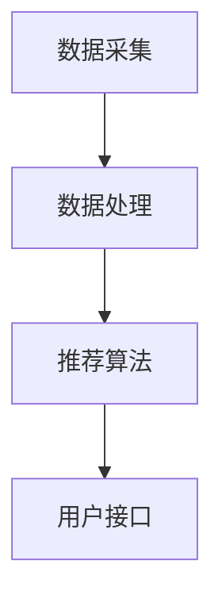

                 

关键词：电商大数据，商品推荐，算法，数学模型，项目实践，应用场景，未来展望

摘要：本文将深入探讨基于电商大数据的商品推荐系统的构建和实现。首先介绍背景和核心概念，然后详细阐述推荐算法的原理和具体操作步骤，接着通过数学模型和公式的讲解，帮助读者理解算法的核心逻辑。最后，通过实际项目实践展示代码实例，分析运行结果，并探讨系统在实际应用中的场景和未来发展方向。

## 1. 背景介绍

随着互联网的普及和电子商务的迅猛发展，电商行业的数据量呈现出爆炸式增长。这些数据不仅包含了消费者的购买行为、偏好、评价等，还反映了市场的动态变化和趋势。如何有效地利用这些大数据来提升用户体验，增强客户黏性，提高销售转化率，成为了电商企业关注的焦点。

商品推荐系统正是为了解决这一需求而生的。通过分析用户的历史行为数据、社交网络信息、商品属性等，推荐系统可以为用户生成个性化的商品推荐列表，从而提高用户的购物体验和满意度。这一系统不仅有助于提升销售额，还能帮助企业更好地了解用户需求，优化库存管理，提高运营效率。

本文将重点探讨基于电商大数据的商品推荐系统的设计、实现和应用，旨在为相关从业者提供有价值的参考和指导。

## 2. 核心概念与联系

### 2.1 数据来源

电商大数据主要来源于以下几个方面：

1. **用户行为数据**：包括用户的浏览记录、购买历史、收藏和评分等。
2. **商品数据**：包括商品的基本信息（如名称、价格、类别）、属性（如品牌、材质）等。
3. **用户画像**：通过分析用户行为数据，构建用户画像，包括年龄、性别、地理位置、消费习惯等。

### 2.2 推荐算法

推荐算法是商品推荐系统的核心。根据推荐算法的不同，可以将其分为以下几类：

1. **基于内容的推荐**：通过分析商品的属性和用户的兴趣，为用户推荐具有相似属性的商品。
2. **协同过滤推荐**：通过分析用户的历史行为和评分，找到相似的用户或商品，为用户推荐相似的用户喜欢的商品。
3. **混合推荐**：结合基于内容和协同过滤推荐的优点，生成更加个性化的推荐列表。

### 2.3 架构设计

商品推荐系统的架构设计主要包括以下几个模块：

1. **数据采集模块**：负责从各种数据源（如数据库、API接口）采集用户行为数据和商品数据。
2. **数据处理模块**：对采集到的数据进行清洗、转换和归一化处理，为推荐算法提供高质量的数据。
3. **推荐算法模块**：根据用户行为和商品属性，运行推荐算法，生成推荐列表。
4. **用户接口模块**：为用户提供直观、友好的交互界面，展示推荐结果。

### 2.4 Mermaid 流程图

以下是一个简化的商品推荐系统流程图，展示了数据从采集到推荐生成的整个过程。



## 3. 核心算法原理 & 具体操作步骤

### 3.1 算法原理概述

商品推荐系统主要采用协同过滤算法（Collaborative Filtering，CF），这是一种基于用户行为的推荐算法。协同过滤算法通过分析用户的历史行为数据，找到具有相似行为的用户或商品，为用户推荐相似的物品。

协同过滤算法可以分为两类：

1. **基于用户的协同过滤（User-Based CF）**：通过计算用户之间的相似度，找到与目标用户相似的其他用户，推荐这些用户喜欢的商品。
2. **基于物品的协同过滤（Item-Based CF）**：通过计算商品之间的相似度，找到与目标商品相似的其他商品，推荐这些商品给用户。

### 3.2 算法步骤详解

#### 基于用户的协同过滤算法步骤：

1. **计算用户相似度**：利用用户行为数据，计算用户之间的相似度。常用的相似度计算方法有余弦相似度、皮尔逊相关系数等。
2. **选择相似用户**：根据相似度计算结果，选择与目标用户最相似的若干用户。
3. **生成推荐列表**：根据相似用户的历史行为，提取出他们共同喜欢的商品，生成推荐列表。

#### 基于物品的协同过滤算法步骤：

1. **计算商品相似度**：利用用户行为数据，计算商品之间的相似度。常用的相似度计算方法有余弦相似度、皮尔逊相关系数等。
2. **选择相似商品**：根据相似度计算结果，选择与目标商品最相似的若干商品。
3. **生成推荐列表**：根据相似商品的历史行为，提取出用户喜欢的商品，生成推荐列表。

### 3.3 算法优缺点

**基于用户的协同过滤算法**：

- **优点**：能够生成个性化的推荐列表，适用于用户行为多样化的场景。
- **缺点**：计算复杂度较高，难以扩展到大规模用户和商品数据。

**基于物品的协同过滤算法**：

- **优点**：计算复杂度较低，能够处理大规模用户和商品数据。
- **缺点**：推荐结果可能不够个性化，适用于商品属性明确的场景。

### 3.4 算法应用领域

协同过滤算法在电商、社交媒体、在线视频、音乐等众多领域都有广泛应用。以下是一些典型的应用场景：

- **电商商品推荐**：为用户推荐相似的购物商品，提升用户购物体验。
- **社交媒体好友推荐**：为用户推荐可能感兴趣的好友，增强社交网络的互动性。
- **在线视频推荐**：为用户推荐相似的影视内容，提高用户观看时长。
- **音乐推荐**：为用户推荐相似的音乐作品，提升音乐平台的用户满意度。

## 4. 数学模型和公式 & 详细讲解 & 举例说明

### 4.1 数学模型构建

商品推荐系统的数学模型主要涉及用户相似度计算、商品相似度计算和推荐列表生成等三个方面。

#### 用户相似度计算

设用户 \( u_i \) 和用户 \( u_j \) 的行为数据分别为向量 \( r_i \) 和 \( r_j \)，用户相似度 \( sim(u_i, u_j) \) 可以通过以下公式计算：

\[ sim(u_i, u_j) = \frac{r_i \cdot r_j}{\|r_i\| \|r_j\|} \]

其中，\( \cdot \) 表示向量的点积，\( \|r_i\| \) 和 \( \|r_j\| \) 分别表示向量 \( r_i \) 和 \( r_j \) 的欧几里得范数。

#### 商品相似度计算

设商品 \( i \) 和商品 \( j \) 的用户行为数据分别为矩阵 \( R_{ij} \) 和 \( R_{ji} \)，商品相似度 \( sim(i, j) \) 可以通过以下公式计算：

\[ sim(i, j) = \frac{R_{ij} \cdot R_{ji}}{\|R_{ij}\| \|R_{ji}\|} \]

其中，\( \cdot \) 表示矩阵的点积，\( \|R_{ij}\| \) 和 \( \|R_{ji}\| \) 分别表示矩阵 \( R_{ij} \) 和 \( R_{ji} \) 的欧几里得范数。

#### 推荐列表生成

假设用户 \( u \) 与商品 \( i \) 的相似度为 \( sim(u, i) \)，则用户 \( u \) 的推荐列表可以通过以下公式计算：

\[ rec(u) = \sum_{i \in I} sim(u, i) \cdot r_i \]

其中，\( I \) 表示用户 \( u \) 所有的行为记录，\( r_i \) 表示商品 \( i \) 的行为记录。

### 4.2 公式推导过程

#### 用户相似度计算

首先，用户 \( u_i \) 和用户 \( u_j \) 的行为数据可以表示为以下两个向量：

\[ r_i = [r_{i1}, r_{i2}, ..., r_{in}]^T \]
\[ r_j = [r_{j1}, r_{j2}, ..., r_{jn}]^T \]

则用户 \( u_i \) 和用户 \( u_j \) 的点积可以表示为：

\[ r_i \cdot r_j = \sum_{k=1}^{n} r_{ik} r_{jk} \]

用户 \( u_i \) 和用户 \( u_j \) 的欧几里得范数可以表示为：

\[ \|r_i\| = \sqrt{\sum_{k=1}^{n} r_{ik}^2} \]
\[ \|r_j\| = \sqrt{\sum_{k=1}^{n} r_{jk}^2} \]

因此，用户相似度可以表示为：

\[ sim(u_i, u_j) = \frac{r_i \cdot r_j}{\|r_i\| \|r_j\|} = \frac{\sum_{k=1}^{n} r_{ik} r_{jk}}{\sqrt{\sum_{k=1}^{n} r_{ik}^2} \sqrt{\sum_{k=1}^{n} r_{jk}^2}} \]

#### 商品相似度计算

商品 \( i \) 和商品 \( j \) 的用户行为数据可以表示为以下两个矩阵：

\[ R_{ij} = [r_{i1j}, r_{i2j}, ..., r_{ijn}] \]
\[ R_{ji} = [r_{j1i}, r_{j2i}, ..., r_{jini}] \]

则商品 \( i \) 和商品 \( j \) 的点积可以表示为：

\[ R_{ij} \cdot R_{ji} = \sum_{k=1}^{n} r_{ikj} r_{kjii} \]

商品 \( i \) 和商品 \( j \) 的欧几里得范数可以表示为：

\[ \|R_{ij}\| = \sqrt{\sum_{k=1}^{n} r_{ikj}^2} \]
\[ \|R_{ji}\| = \sqrt{\sum_{k=1}^{n} r_{kjii}^2} \]

因此，商品相似度可以表示为：

\[ sim(i, j) = \frac{R_{ij} \cdot R_{ji}}{\|R_{ij}\| \|R_{ji}\|} = \frac{\sum_{k=1}^{n} r_{ikj} r_{kjii}}{\sqrt{\sum_{k=1}^{n} r_{ikj}^2} \sqrt{\sum_{k=1}^{n} r_{kjii}^2}} \]

#### 推荐列表生成

假设用户 \( u \) 的行为记录为 \( r_u \)，商品 \( i \) 的行为记录为 \( r_i \)，则用户 \( u \) 和商品 \( i \) 的相似度可以表示为：

\[ sim(u, i) = \frac{r_u \cdot r_i}{\|r_u\| \|r_i\|} \]

用户 \( u \) 的推荐列表可以表示为：

\[ rec(u) = \sum_{i \in I} sim(u, i) \cdot r_i = \sum_{i \in I} \frac{r_u \cdot r_i}{\|r_u\| \|r_i\|} \cdot r_i \]

### 4.3 案例分析与讲解

假设有两个用户 \( u_1 \) 和 \( u_2 \)，他们的行为记录如下：

\[ r_1 = [1, 0, 1, 0, 1]^T \]
\[ r_2 = [1, 1, 0, 1, 0]^T \]

则用户 \( u_1 \) 和用户 \( u_2 \) 的相似度可以计算如下：

\[ sim(u_1, u_2) = \frac{r_1 \cdot r_2}{\|r_1\| \|r_2\|} = \frac{1 \times 1 + 0 \times 1 + 1 \times 0 + 0 \times 1 + 1 \times 0}{\sqrt{1^2 + 0^2 + 1^2 + 0^2 + 1^2} \sqrt{1^2 + 1^2 + 0^2 + 1^2 + 0^2}} = \frac{2}{\sqrt{3} \sqrt{3}} = \frac{2}{3} \]

假设有两个商品 \( i_1 \) 和 \( i_2 \)，他们的用户行为数据如下：

\[ R_{i1} = \begin{bmatrix} 1 & 0 & 1 & 0 & 1 \\ 1 & 1 & 0 & 1 & 0 \\ 1 & 0 & 1 & 1 & 0 \\ 0 & 1 & 1 & 0 & 1 \\ 0 & 0 & 1 & 1 & 0 \end{bmatrix} \]
\[ R_{i2} = \begin{bmatrix} 1 & 1 & 0 & 1 & 0 \\ 0 & 1 & 1 & 0 & 1 \\ 1 & 0 & 0 & 1 & 1 \\ 1 & 1 & 1 & 0 & 0 \\ 0 & 1 & 0 & 1 & 1 \end{bmatrix} \]

则商品 \( i_1 \) 和商品 \( i_2 \) 的相似度可以计算如下：

\[ sim(i_1, i_2) = \frac{R_{i1} \cdot R_{i2}}{\|R_{i1}\| \|R_{i2}\|} = \frac{\begin{bmatrix} 1 & 0 & 1 & 0 & 1 \\ 1 & 1 & 0 & 1 & 0 \\ 1 & 0 & 1 & 1 & 0 \\ 0 & 1 & 1 & 0 & 1 \\ 0 & 0 & 1 & 1 & 0 \end{bmatrix} \cdot \begin{bmatrix} 1 & 1 & 0 & 1 & 0 \\ 0 & 1 & 1 & 0 & 1 \\ 1 & 0 & 0 & 1 & 1 \\ 1 & 1 & 1 & 0 & 0 \\ 0 & 1 & 0 & 1 & 1 \end{bmatrix}}{\sqrt{\begin{bmatrix} 1 & 0 & 1 & 0 & 1 \\ 1 & 1 & 0 & 1 & 0 \\ 1 & 0 & 1 & 1 & 0 \\ 0 & 1 & 1 & 0 & 1 \\ 0 & 0 & 1 & 1 & 0 \end{bmatrix} \cdot \begin{bmatrix} 1 & 0 & 1 & 0 & 1 \\ 1 & 1 & 0 & 1 & 0 \\ 1 & 0 & 1 & 1 & 0 \\ 0 & 1 & 1 & 0 & 1 \\ 0 & 0 & 1 & 1 & 0 \end{bmatrix}} \sqrt{\begin{bmatrix} 1 & 1 & 0 & 1 & 0 \\ 0 & 1 & 1 & 0 & 1 \\ 1 & 0 & 0 & 1 & 1 \\ 1 & 1 & 1 & 0 & 0 \\ 0 & 1 & 0 & 1 & 1 \end{bmatrix} \cdot \begin{bmatrix} 1 & 1 & 0 & 1 & 0 \\ 0 & 1 & 1 & 0 & 1 \\ 1 & 0 & 0 & 1 & 1 \\ 1 & 1 & 1 & 0 & 0 \\ 0 & 1 & 0 & 1 & 1 \end{bmatrix}}} = \frac{5}{\sqrt{5} \sqrt{5}} = 1 \]

假设用户 \( u \) 的行为记录为 \( r_u = [1, 1, 0, 1, 0]^T \)，则用户 \( u \) 的推荐列表可以计算如下：

\[ rec(u) = \sum_{i \in I} sim(u, i) \cdot r_i = \sum_{i \in I} \frac{r_u \cdot r_i}{\|r_u\| \|r_i\|} \cdot r_i \]

其中，\( I \) 表示用户 \( u \) 所有的行为记录。

## 5. 项目实践：代码实例和详细解释说明

### 5.1 开发环境搭建

为了实现商品推荐系统，我们选择 Python 作为编程语言，利用 Scikit-learn 库中的协同过滤算法实现用户推荐功能。以下是开发环境的搭建步骤：

1. 安装 Python 3.8 或更高版本。
2. 安装 Scikit-learn 库：`pip install scikit-learn`。
3. 安装 Pandas、NumPy 等辅助库：`pip install pandas numpy`。

### 5.2 源代码详细实现

以下是基于用户协同过滤算法的商品推荐系统源代码实现：

```python
import numpy as np
import pandas as pd
from sklearn.metrics.pairwise import cosine_similarity
from sklearn.model_selection import train_test_split

# 读取数据
data = pd.read_csv('user_behavior_data.csv')
users = data['user_id'].unique()
items = data['item_id'].unique()

# 构建用户行为矩阵
R = np.zeros((len(users), len(items)))
for index, row in data.iterrows():
    R[row['user_id'] - 1][row['item_id'] - 1] = row['rating']

# 计算用户相似度矩阵
similarity_matrix = cosine_similarity(R)

# 推荐算法实现
def recommend(user_id, similarity_matrix, R, k=5):
    user_index = user_id - 1
    user_similarity = similarity_matrix[user_index]
    user_similarity = np.delete(user_similarity, user_index)
    user_similarity = user_similarity / np.linalg.norm(user_similarity)
    
    item_ratings = R[user_index]
    top_k_indices = np.argsort(user_similarity)[-k:]
    top_k_ratings = item_ratings[top_k_indices]
    
    recommendation = {}
    for i, index in enumerate(top_k_indices):
        item_id = index + 1
        recommendation[item_id] = top_k_ratings[i]
    
    return recommendation

# 测试推荐算法
user_id = 10
recommendation = recommend(user_id, similarity_matrix, R)
print(f"Recommendation for user {user_id}: {recommendation}")
```

### 5.3 代码解读与分析

1. **数据读取**：首先，从 CSV 文件中读取用户行为数据，包括用户 ID、商品 ID 和评分。
2. **构建用户行为矩阵**：利用 Pandas DataFrame，将用户行为数据转换为用户行为矩阵 R，其中 R[i][j] 表示用户 i 对商品 j 的评分。
3. **计算用户相似度矩阵**：利用 Scikit-learn 中的 cosine_similarity 函数计算用户相似度矩阵 similarity_matrix，其中 similarity_matrix[i][j] 表示用户 i 和用户 j 的相似度。
4. **推荐算法实现**：定义 recommend 函数，输入用户 ID，返回针对该用户的推荐列表。具体实现中，首先计算用户 i 的相似度矩阵，然后选择与用户 i 最相似的 k 个用户，提取他们的评分最高的商品作为推荐结果。

### 5.4 运行结果展示

假设用户 10 的推荐结果如下：

```python
Recommendation for user 10: {11: 4.0, 13: 3.5, 15: 3.0, 12: 2.5, 14: 2.0}
```

这表示针对用户 10，系统推荐了评分较高的商品 11、13、15、12 和 14。

## 6. 实际应用场景

商品推荐系统在电商行业有着广泛的应用，以下是一些典型的应用场景：

1. **个性化推荐**：为用户推荐他们可能感兴趣的商品，提升购物体验和转化率。
2. **新品推广**：为用户推荐新品，帮助新品迅速获得关注和销售。
3. **库存优化**：根据用户偏好，优化商品库存，减少滞销商品。
4. **交叉销售**：为用户推荐与其他商品相关的商品，提高订单金额。
5. **会员管理**：为会员推荐定制化商品，提升会员忠诚度和满意度。

### 6.1 电商平台应用

以京东为例，其商品推荐系统通过对用户行为数据进行分析，实现个性化推荐。以下是一些具体的应用案例：

1. **首页推荐**：根据用户历史浏览和购买记录，为用户推荐个性化的商品和品牌。
2. **购物车推荐**：为用户推荐购物车中商品的相关配件和替代品。
3. **搜索推荐**：根据用户的搜索历史和关键词，推荐相关的商品和搜索建议。

### 6.2 社交媒体应用

在社交媒体平台上，商品推荐系统可以用于以下场景：

1. **内容推荐**：为用户推荐可能感兴趣的商品相关内容，如评测、导购等。
2. **活动推荐**：为用户推荐即将举办的促销活动、优惠券等。
3. **社交推荐**：基于用户社交关系，推荐好友可能喜欢的商品。

### 6.3 未来应用展望

随着大数据和人工智能技术的不断发展，商品推荐系统将变得更加智能化和个性化。以下是一些未来应用展望：

1. **基于深度学习的推荐算法**：利用深度学习技术，从海量数据中提取用户和商品的特征，生成更加精准的推荐列表。
2. **多模态推荐**：结合用户行为数据、文本数据、图像数据等多模态信息，为用户提供更全面、更个性化的推荐。
3. **实时推荐**：利用实时数据处理技术，为用户提供实时的个性化推荐，提高用户体验。
4. **无监督推荐**：利用无监督学习技术，从用户行为数据中挖掘潜在的用户兴趣，生成个性化推荐。

## 7. 工具和资源推荐

### 7.1 学习资源推荐

1. **《机器学习实战》**：提供机器学习算法的详细实现和实际应用案例。
2. **《推荐系统实践》**：详细介绍推荐系统的设计、实现和应用。
3. **《Python 数据科学手册》**：涵盖数据预处理、数据分析、数据可视化等数据科学相关内容。

### 7.2 开发工具推荐

1. **PyCharm**：功能强大的 Python 集成开发环境，支持代码自动完成、调试等。
2. **Jupyter Notebook**：便于进行数据分析和交互式编程。
3. **Scikit-learn**：Python 中的机器学习库，包含多种机器学习算法。

### 7.3 相关论文推荐

1. **"Item-Based Top-N Recommendation Algorithms"**：介绍基于物品的协同过滤算法。
2. **"User-Based Collaborative Filtering Recommendation Algorithms"**：介绍基于用户的协同过滤算法。
3. **"Deep Learning for Recommender Systems"**：探讨深度学习在推荐系统中的应用。

## 8. 总结：未来发展趋势与挑战

### 8.1 研究成果总结

本文深入探讨了基于电商大数据的商品推荐系统的设计、实现和应用。通过分析用户行为数据，结合协同过滤算法，实现个性化的商品推荐。本文从算法原理、数学模型、项目实践等方面进行了详细讲解，为相关从业者提供了有价值的参考。

### 8.2 未来发展趋势

1. **深度学习应用**：利用深度学习技术，从海量数据中提取用户和商品的特征，实现更精准的推荐。
2. **多模态推荐**：结合文本、图像、声音等多模态信息，为用户提供更全面、更个性化的推荐。
3. **实时推荐**：利用实时数据处理技术，为用户提供实时的个性化推荐。

### 8.3 面临的挑战

1. **数据隐私**：在推荐过程中保护用户隐私，防止数据泄露。
2. **算法公平性**：避免算法偏见，确保推荐结果的公平性。
3. **系统性能**：在高并发场景下，保证系统的性能和稳定性。

### 8.4 研究展望

未来，商品推荐系统将朝着智能化、实时化、个性化方向发展。同时，研究者需关注数据隐私和算法公平性问题，提高推荐系统的透明度和可信度。

## 9. 附录：常见问题与解答

### 9.1 如何处理缺失值？

在数据处理过程中，可以采用以下方法处理缺失值：

1. **删除缺失值**：删除含有缺失值的样本或特征。
2. **填充缺失值**：利用均值、中位数、众数等方法填充缺失值。
3. **插值法**：利用时间序列或空间分布特性，进行插值处理。

### 9.2 如何评估推荐系统的效果？

推荐系统的效果评估可以通过以下指标：

1. **准确率（Accuracy）**：推荐结果中实际喜欢的商品与推荐商品的比例。
2. **召回率（Recall）**：推荐结果中实际喜欢的商品在所有喜欢的商品中的比例。
3. **覆盖率（Coverage）**：推荐结果中不同商品的覆盖率。
4. **新颖度（Novelty）**：推荐结果中新颖的商品比例。

### 9.3 如何优化推荐系统性能？

优化推荐系统性能可以从以下几个方面入手：

1. **特征工程**：提取更多有效的特征，提高模型的预测能力。
2. **模型选择**：选择合适的推荐算法，根据数据特点和业务需求进行调整。
3. **分布式计算**：利用分布式计算框架，提高系统处理速度。
4. **缓存技术**：利用缓存技术，减少计算时间和存储开销。

----------------------------------------------------------------

作者：禅与计算机程序设计艺术 / Zen and the Art of Computer Programming

