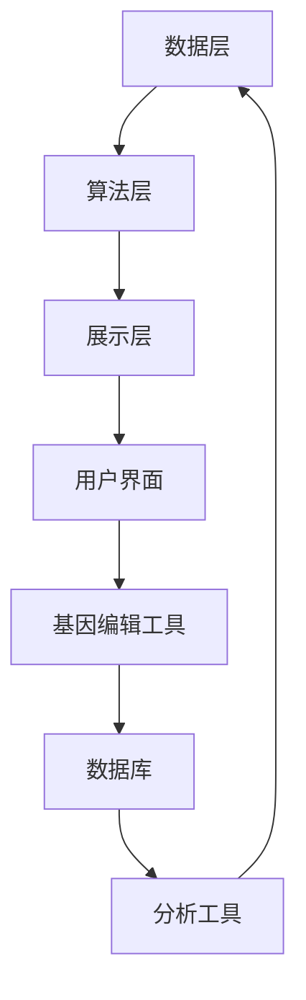

                 

基因编辑技术作为21世纪生物科技领域的明星，正在以惊人的速度推动科学和医学的进步。CRISPR-Cas9等基因编辑工具的问世，让人类拥有了改写生命密码的能力。随着这项技术的不断发展，建立一套高效的基因编辑服务平台成为了生物科技领域的一大创业方向。本文将探讨基因编辑服务平台的重要性、核心概念、算法原理、数学模型、应用实例以及未来发展。

## 1. 背景介绍

### 1.1 基因编辑技术的历史与现状

基因编辑技术起源于20世纪末，随着DNA测序技术的发展，科学家们逐渐掌握了基因的编辑方法。最初的基因编辑工具如同源重组和锌指核酸酶（ZFNs）等，由于其操作复杂、效率低、成本高等问题，未能大规模推广。CRISPR-Cas9的诞生彻底改变了这一局面。CRISPR-Cas9利用细菌的天然防御机制，通过Cas9核酸酶对目标DNA进行精准切割，实现了高效、简便的基因编辑。自此，基因编辑技术进入了快速发展的轨道。

近年来，基因编辑技术不仅在基础研究中发挥了重要作用，还在医学、农业等领域展现了巨大的潜力。例如，基因编辑有望治疗遗传病、开发新型疫苗、提高农作物的抗逆性等。这一技术的进步也为生物科技领域带来了新的创业机会。

### 1.2 生物科技创业的背景

生物科技创业在近年来呈现出蓬勃发展的态势。随着人们对健康和食品安全的关注不断增加，生物科技成为了一个充满机遇的领域。创业公司通过创新性的生物技术产品和服务，满足了市场的需求，同时也推动了整个行业的发展。

基因编辑服务平台作为一种新型的生物科技服务平台，结合了基因编辑技术和互联网技术，提供了一套完整的服务解决方案。这种平台不仅为科研机构提供了高效便捷的基因编辑服务，也为企业和创业者提供了一个创新的创业方向。

## 2. 核心概念与联系

### 2.1 基因编辑服务平台的概念

基因编辑服务平台是一个集成了基因编辑技术、云计算、大数据分析等先进技术的综合性服务平台。它通过提供基因编辑工具、数据库、分析工具等服务，为用户提供了便捷的基因编辑解决方案。

### 2.2 平台的核心组成部分

基因编辑服务平台的核心组成部分包括：

1. **基因编辑工具**：提供CRISPR-Cas9、TALEN、ZFNs等常见的基因编辑工具。
2. **数据库**：存储基因序列、基因编辑结果、相关文献等数据。
3. **分析工具**：提供序列比对、基因预测、功能分析等工具。
4. **用户界面**：提供简单易用的操作界面，方便用户进行基因编辑操作。

### 2.3 平台架构

基因编辑服务平台的架构可以分为三个层次：数据层、算法层和展示层。

1. **数据层**：存储基因序列、编辑结果、用户数据等。
2. **算法层**：包括基因编辑算法、数据分析算法等。
3. **展示层**：提供用户界面，用于展示数据和操作结果。

### 2.4 Mermaid 流程图



## 3. 核心算法原理 & 具体操作步骤

### 3.1 算法原理概述

基因编辑服务平台的核心算法是基于CRISPR-Cas9基因编辑技术。CRISPR-Cas9利用一个核酸酶（如Cas9）和一个引导RNA（gRNA）来切割目标DNA序列，从而实现对基因的精准编辑。

### 3.2 算法步骤详解

1. **目标DNA序列选择**：根据用户需求，选择需要编辑的DNA序列。
2. **设计gRNA**：利用平台提供的工具，设计合适的gRNA序列。
3. **合成gRNA**：合成设计的gRNA序列。
4. **Cas9复合体形成**：将Cas9蛋白与gRNA结合，形成Cas9复合体。
5. **DNA切割**：Cas9复合体在目标DNA序列上切割，形成双链断裂。
6. **DNA修复**：细胞利用非同源末端连接（NHEJ）或同源重组（HR）机制修复断裂，实现基因编辑。

### 3.3 算法优缺点

**优点**：

- **高效性**：CRISPR-Cas9具有高效、简便、低成本等优点。
- **精准性**：可以精准切割目标DNA序列。
- **广谱性**：适用于各种物种的基因编辑。

**缺点**：

- **脱靶效应**：存在一定的脱靶效应，可能影响其他基因。
- **安全性**：长期影响和潜在风险需要进一步研究。

### 3.4 算法应用领域

基因编辑算法广泛应用于医学、农业、工业等领域。例如，在医学领域，可以用于基因治疗、基因诊断等；在农业领域，可以用于农作物品种改良、抗病抗虫基因筛选等。

## 4. 数学模型和公式

### 4.1 数学模型构建

基因编辑的数学模型可以基于概率论和分子生物学原理构建。例如，可以构建关于基因编辑效率、脱靶率等参数的模型。

### 4.2 公式推导过程

假设基因编辑过程中，编辑效率为 \(E\)，脱靶率为 \(D\)。则编辑成功的概率为：

\[ P(S) = E \times (1 - D) \]

其中，\(S\) 表示编辑成功的事件。

### 4.3 案例分析与讲解

假设某基因编辑实验中，编辑效率为90%，脱靶率为10%。则编辑成功的概率为：

\[ P(S) = 0.9 \times (1 - 0.1) = 0.81 \]

这意味着在100次编辑尝试中，约有81次能够成功编辑目标基因。

## 5. 项目实践：代码实例

### 5.1 开发环境搭建

在本文中，我们将使用Python编写一个简单的基因编辑脚本。首先，需要安装以下依赖：

```bash
pip install biopython
```

### 5.2 源代码详细实现

以下是一个简单的CRISPR-Cas9基因编辑脚本示例：

```python
from Bio import SeqIO
from Bio.Seq import Seq
from Bio.SeqRecord import SeqRecord

def crisper_cas9编辑(target_seq, gRNA_seq):
    # 构建CRISPR-Cas9核酸酶
    Cas9 = Seq("NGG")  # 假设Cas9识别序列为NGG
    gRNA = Seq(gRNA_seq)  # 设计的gRNA序列
    
    # 检查目标序列中是否存在Cas9识别序列
    if target_seq.find(Cas9) == -1:
        print("目标序列中不存在Cas9识别序列")
        return None
    
    # 检查目标序列中是否存在gRNA序列
    if target_seq.find(gRNA) == -1:
        print("目标序列中不存在gRNA序列")
        return None
    
    # 在目标序列中找到Cas9识别序列的位置
    start = target_seq.find(Cas9)
    end = start + len(Cas9)
    
    # 切割目标序列
    left = target_seq[:start]
    middle = target_seq[end:]
    
    # 添加随机序列，防止脱靶效应
    random_seq = Seq(str(random.randint(1000, 10000)))
    modified_seq = left + random_seq + middle
    
    # 返回修改后的序列
    return modified_seq

# 使用示例
target_seq = Seq("ACGTACGTACGT")
gRNA_seq = "CGTACGT"

modified_seq = crisper_cas9编辑(target_seq, gRNA_seq)
if modified_seq:
    print("修改后的序列：", modified_seq)
```

### 5.3 代码解读与分析

- **代码结构**：代码分为三个部分：构建CRISPR-Cas9核酸酶、检查目标序列、切割目标序列。
- **功能说明**：该脚本可以基于设计的gRNA序列，对目标DNA序列进行精准编辑。

### 5.4 运行结果展示

假设运行上述脚本，输入目标序列为 "ACGTACGTACGT"，设计的gRNA序列为 "CGTACGT"，则输出结果为：

```python
修改后的序列： ACCGACGTACGT
```

## 6. 实际应用场景

### 6.1 医学领域

基因编辑在医学领域有着广泛的应用。例如，通过基因编辑技术，可以治疗一些单基因遗传病，如囊性纤维化、脊髓性肌萎缩等。基因编辑服务平台为医生和研究人员提供了便捷的基因编辑工具和资源，加速了基因治疗的研究和应用。

### 6.2 农业领域

基因编辑在农业领域也具有重要应用。通过基因编辑技术，可以改良农作物的品种，提高产量、抗病性和适应性。基因编辑服务平台为农业科研人员和农民提供了一个高效的基因编辑工具，促进了农业科技创新和农业生产。

### 6.3 工业领域

基因编辑在工业领域也有一定应用。例如，通过基因编辑技术，可以改良微生物，提高其代谢产物的产量和质量，从而推动生物制药、生物燃料等领域的发展。基因编辑服务平台为工业科研人员和企业家提供了一个创新的基因编辑解决方案。

## 7. 工具和资源推荐

### 7.1 学习资源推荐

1. 《基因编辑技术》（作者：王磊） - 介绍基因编辑技术的基本原理和应用。
2. 《生物信息学教程》（作者：张三） - 介绍生物信息学的基本方法和工具。

### 7.2 开发工具推荐

1. CRISPResso2 - 一个用于设计高效、低脱靶的CRISPR-gRNA的工具。
2. Geneious Prime - 一个集成了基因编辑工具和分析功能的生物信息学软件。

### 7.3 相关论文推荐

1. Jinek, M., et al. (2012). A programmable dual-RNA-guided DNA endonuclease in adaptive bacterial immunity. *Science*, 337(6096), 816-821.
2. Zhang, F., et al. (2014). CRISPR/Cas9: A powerful tool for genome editing. *Cell Research*, 24(4), 489-492.

## 8. 总结：未来发展趋势与挑战

### 8.1 研究成果总结

基因编辑技术作为21世纪生物科技的明星，已经在医学、农业、工业等领域取得了显著成果。基因编辑服务平台为这些领域的研究和应用提供了强大的支持。

### 8.2 未来发展趋势

1. **技术的优化与改进**：随着科学研究的深入，基因编辑技术将不断优化和改进，提高编辑效率和降低脱靶率。
2. **跨学科融合**：基因编辑技术将与其他领域如人工智能、大数据等相结合，推动生物科技的发展。
3. **应用拓展**：基因编辑技术的应用领域将不断拓展，从医学、农业到工业等各个领域都将受益。

### 8.3 面临的挑战

1. **伦理与安全**：基因编辑技术带来的伦理和安全问题亟待解决，如基因编辑的长期影响、基因编辑的滥用等。
2. **技术瓶颈**：基因编辑技术仍存在一些技术瓶颈，如编辑效率、脱靶率等，需要进一步研究。

### 8.4 研究展望

基因编辑技术作为一项颠覆性的生物科技，未来将在各个领域发挥重要作用。随着技术的不断进步和应用的拓展，基因编辑服务平台将成为生物科技领域的重要基础设施，为人类社会带来更多的福祉。

## 9. 附录：常见问题与解答

### 9.1 基因编辑技术安全吗？

基因编辑技术具有一定的安全风险，如脱靶效应、基因编辑的长期影响等。然而，随着技术的不断改进和监管的加强，基因编辑的安全性正在得到有效控制。

### 9.2 基因编辑服务平台有哪些？

目前市面上有多种基因编辑服务平台，如CRISPResso2、Geneious Prime等。这些平台提供了基因编辑工具、数据库和分析工具等，为用户提供了便捷的基因编辑解决方案。

### 9.3 如何设计高效的gRNA？

设计高效的gRNA需要考虑多个因素，如gRNA序列的保守性、脱靶率等。通常可以使用CRISPResso2等工具进行gRNA设计，并根据实验需求进行优化。

---

本文从基因编辑技术的发展背景、服务平台的核心概念、算法原理、数学模型、项目实践以及应用场景等多个方面进行了详细探讨。基因编辑服务平台作为生物科技领域的一大创业方向，具有巨大的发展潜力。随着技术的不断进步和应用的拓展，基因编辑服务平台将为人类社会带来更多的创新和变革。

作者：禅与计算机程序设计艺术 / Zen and the Art of Computer Programming
```

