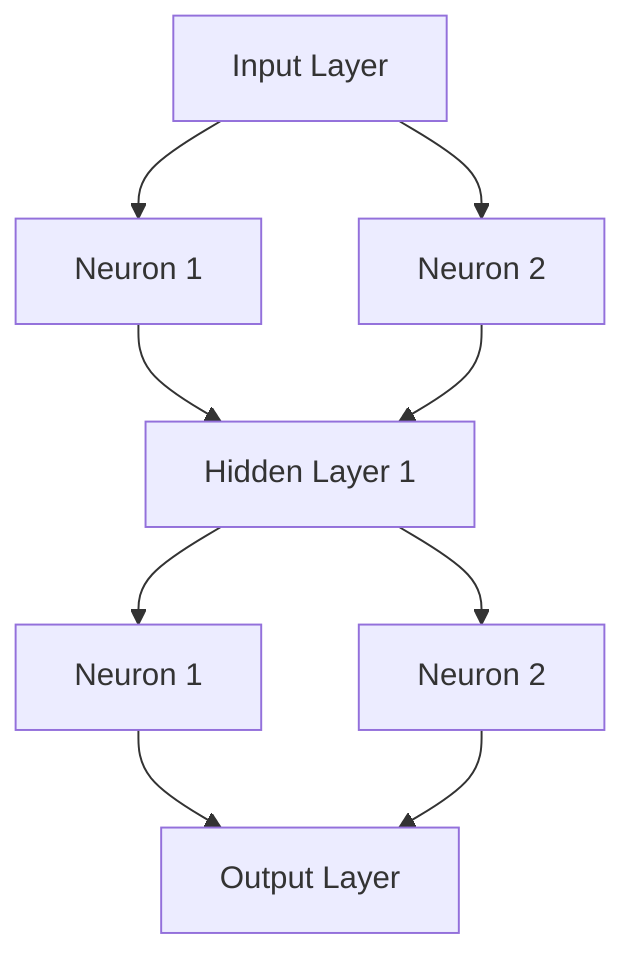
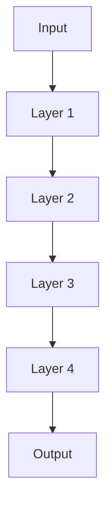
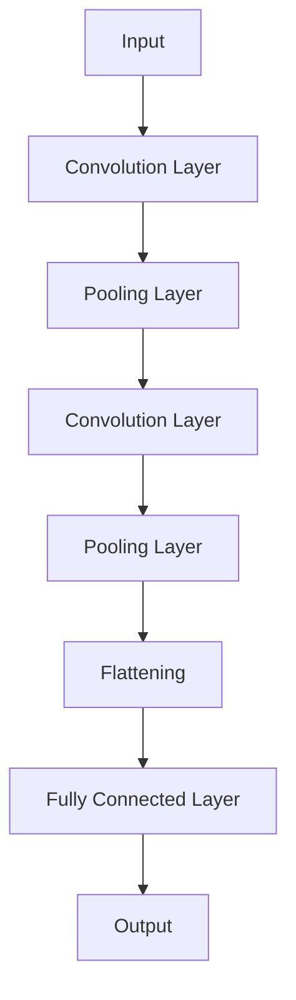
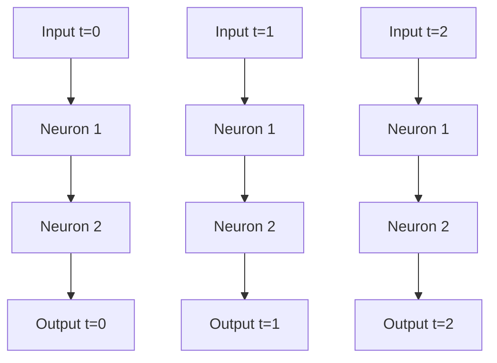
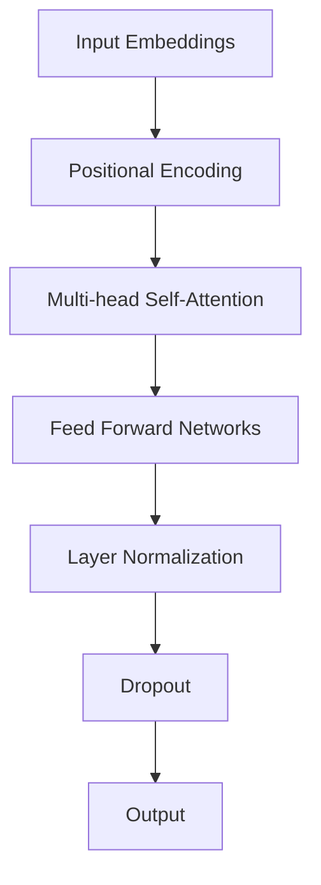

                 

### 引言 Introduction

在当今信息技术飞速发展的时代，基础模型作为人工智能的核心技术，正深刻地改变着我们的生活方式和工作方式。从自然语言处理到计算机视觉，从推荐系统到深度学习，基础模型的应用已经渗透到了社会各个领域。本文旨在探讨基础模型的技术能力及其对社会产生的广泛而深远的影响。

本文将分为以下几个部分：

1. **背景介绍**：回顾基础模型的发展历程，分析其技术演变和社会需求。
2. **核心概念与联系**：详细介绍基础模型的核心概念，并使用Mermaid流程图展示其架构。
3. **核心算法原理 & 具体操作步骤**：深入分析基础模型的算法原理，并逐步讲解操作步骤。
4. **数学模型和公式**：介绍基础模型中的数学模型和公式，并通过实例进行说明。
5. **项目实践**：提供一个代码实例，详细解释其实现过程和结果。
6. **实际应用场景**：讨论基础模型在不同领域的应用，以及未来的发展趋势。
7. **工具和资源推荐**：推荐相关的学习资源和开发工具。
8. **总结**：总结研究成果，展望未来发展趋势与挑战。

通过以上结构化的内容，我们希望能够帮助读者全面了解基础模型的技术能力和社会影响，同时为相关领域的研究和应用提供有益的参考。

### 1. 背景介绍 Background

基础模型的概念最早可以追溯到20世纪80年代的神经网络研究。在那个时期，研究人员发现通过调整神经网络中的权重，可以实现从简单的线性回归到复杂函数映射的变换。然而，由于计算能力的限制和算法的局限性，这些早期的模型并没有得到广泛的应用。

随着计算机技术的不断进步，尤其是GPU和深度学习算法的突破，基础模型逐渐焕发出新的生命力。2012年，AlexNet在ImageNet竞赛中取得了前所未有的成绩，这一事件标志着深度学习时代的到来。此后，卷积神经网络（CNN）、递归神经网络（RNN）和Transformer等基础模型相继涌现，它们在图像识别、自然语言处理和序列数据建模等领域取得了显著成果。

技术演变的背后，是社会需求不断推动的结果。在互联网和大数据时代，人们对信息处理和决策支持的需求日益增长，这为人工智能技术的发展提供了广阔的应用场景。例如，在医疗领域，人工智能可以通过分析大量的医疗数据，帮助医生做出更准确的诊断；在金融领域，人工智能可以分析市场数据，为投资者提供智能化的投资建议。

此外，社会对个性化体验的追求也推动了基础模型的应用。推荐系统、聊天机器人、智能语音助手等应用，都在满足用户个性化需求方面发挥了重要作用。这些应用不仅提升了用户体验，还为企业带来了巨大的商业价值。

总之，基础模型的发展历程是社会需求与技术创新相互促进的结果。随着技术的不断进步，基础模型将在更多领域发挥其独特的价值，为社会带来深远的影响。

### 2. 核心概念与联系 Core Concepts and Relationships

基础模型的核心概念包括神经网络、深度学习、卷积神经网络（CNN）、递归神经网络（RNN）和Transformer等。为了更好地理解这些概念，我们将使用Mermaid流程图展示其基本架构和联系。

以下是一个基本的Mermaid流程图，展示了基础模型的主要组件及其相互关系：

```mermaid
graph TD
    A[Neural Networks] --> B[Deep Learning]
    A --> C[Convolutional Neural Networks (CNNs)]
    A --> D[Recurrent Neural Networks (RNNs)]
    A --> E[Transformer]
    B --> F[Other Deep Learning Models]
    C --> G[Image Recognition]
    D --> H[Sequence Modeling]
    E --> I[Natural Language Processing (NLP)]
    F --> J[Reinforcement Learning]
    B --> K[Applications]
    K --> L[Medicine]
    K --> M[Finance]
    K --> N[Recommendation Systems]
    K --> O[Chatbots]
```

#### 2.1 神经网络（Neural Networks）

神经网络是模仿人脑神经元连接方式的计算模型。它由多个神经元（或节点）组成，每个节点接收输入信号，通过权重进行加权求和，并使用激活函数产生输出。神经网络通过学习输入和输出数据之间的映射关系，实现对复杂函数的建模。

#### 2.2 深度学习（Deep Learning）

深度学习是神经网络的一种，其主要特点是网络层的深度，这使得模型可以处理更复杂的数据特征。深度学习通过多个隐藏层的学习，可以提取数据中的高层次抽象特征，从而在图像识别、语音识别和自然语言处理等任务中表现出色。

#### 2.3 卷积神经网络（Convolutional Neural Networks, CNNs）

卷积神经网络是专门为图像处理任务设计的一种神经网络。CNN通过卷积层、池化层和全连接层等结构，可以有效地提取图像中的空间特征。它在图像识别、物体检测和图像生成等领域具有广泛的应用。

#### 2.4 递归神经网络（Recurrent Neural Networks, RNNs）

递归神经网络适用于处理序列数据，如时间序列、文本和语音等。RNN通过其循环结构，可以记住前面的输入信息，并使用这些信息来预测未来的输出。RNN在语言模型、语音识别和时间序列预测等领域表现出色。

#### 2.5 Transformer

Transformer是近年来在自然语言处理领域取得重大突破的一种模型。它通过自注意力机制（self-attention）处理序列数据，可以捕捉长距离依赖关系。Transformer在机器翻译、文本摘要和问答系统等任务中取得了优异的性能。

#### 2.6 其他深度学习模型（Other Deep Learning Models）

除了上述模型，深度学习还包括生成对抗网络（GANs）、强化学习（Reinforcement Learning）等。这些模型在不同的应用领域中也发挥着重要作用。

通过上述核心概念及其相互关系的介绍，我们可以更好地理解基础模型的技术本质和应用前景。在接下来的章节中，我们将进一步探讨基础模型的算法原理和具体操作步骤。

### 2.1 神经网络（Neural Networks）

神经网络是基础模型的核心组成部分，其基本结构由输入层、隐藏层和输出层组成。每个层包含多个神经元，神经元之间通过权重连接。神经元的激活函数通常为非线性函数，如Sigmoid、ReLU等，以实现复杂的非线性映射。

以下是一个简单的神经网络Mermaid流程图：



#### 2.1.1 工作原理

神经网络的每一个神经元可以视为一个简单的计算单元，接收输入信号，通过权重加权求和，并使用激活函数产生输出。具体步骤如下：

1. **加权求和**：每个输入乘以其对应的权重，然后求和。
2. **激活函数**：对加权求和的结果应用非线性激活函数，如ReLU（Rectified Linear Unit）或Sigmoid函数。
3. **输出**：神经元的输出作为下一层神经元的输入。

#### 2.1.2 激活函数

激活函数是神经网络中的关键组件，用于引入非线性特性。以下是一些常见的激活函数：

- **Sigmoid函数**：将输入映射到(0,1)区间，适用于回归问题。
  $$\sigma(x) = \frac{1}{1 + e^{-x}}$$
  
- **ReLU函数**：在输入为负时输出0，为正时输出输入值，适用于避免神经元死亡（dying ReLU）问题。
  $$\text{ReLU}(x) = \max(0, x)$$

- **Tanh函数**：将输入映射到(-1,1)区间，适用于回归问题。
  $$\tanh(x) = \frac{e^x - e^{-x}}{e^x + e^{-x}}$$

#### 2.1.3 权重初始化

权重初始化对神经网络的性能至关重要。常见的初始化方法包括：

- **随机初始化**：将权重初始化为接近零的随机值。
- **高斯分布初始化**：将权重初始化为均值为0、标准差为1的高斯分布。
- **Xavier初始化**：根据前一层和当前层的神经元数量调整权重初始化。

#### 2.1.4 学习过程

神经网络的训练过程主要包括前向传播（forward propagation）和反向传播（backpropagation）：

1. **前向传播**：从输入层开始，逐层计算每个神经元的输出值。
2. **计算损失**：将输出与目标值进行比较，计算损失函数（如均方误差MSE）。
3. **反向传播**：从输出层开始，逐层计算每个神经元的梯度，并更新权重。

通过反复迭代上述过程，神经网络可以逐渐优化其参数，以最小化损失函数。

通过以上对神经网络的详细介绍，我们可以更好地理解其工作原理和关键组成部分。在接下来的部分中，我们将进一步探讨深度学习及其在不同领域的应用。

### 2.2 深度学习（Deep Learning）

深度学习是神经网络的一种，它通过增加网络层数，使得模型能够自动提取数据中的高层次特征，从而在图像识别、语音识别、自然语言处理等复杂任务中表现出色。与传统的机器学习方法相比，深度学习具有以下几个显著特点：

#### 2.2.1 多层神经网络

深度学习通过多层神经网络（multiple layers of neurons）来实现复杂函数的建模。每一层神经网络都能对输入数据进行不同的变换，从而逐步提取数据的特征。层数越多，模型能够学习的特征层次就越多，从而提高了模型的准确性和泛化能力。

#### 2.2.2 自动特征提取

在传统的机器学习方法中，特征提取通常需要人工设计，而深度学习则通过多层网络结构自动学习数据中的特征。这种自动化的特征提取过程使得深度学习能够处理更复杂的数据，并且在许多任务中取得了比传统方法更好的性能。

#### 2.2.3 非线性变换

深度学习利用非线性激活函数（如ReLU、Sigmoid、Tanh）引入非线性特性，使得模型能够在复杂的数据分布中进行有效的拟合。这些非线性变换使得深度学习能够捕捉数据中的复杂关系和模式。

#### 2.2.4 数据需求

深度学习对大规模数据集有着强烈的需求。这是因为深度学习模型需要通过大量的样本数据来学习有效的特征表示。数据量越大，模型性能越好，尤其是对于高度复杂的数据集，如高维图像和文本数据。

#### 2.2.5 计算能力要求

深度学习通常需要大量的计算资源，尤其是在训练阶段。早期的深度学习模型依赖于CPU和GPU进行计算，但随着硬件技术的发展，如TPU（Tensor Processing Unit）等专用硬件的出现，深度学习模型的计算效率得到了显著提升。

接下来，我们将通过一个简化的深度学习模型图，展示其基本结构：



在这个简化模型中，输入数据通过多层神经网络进行变换，最终生成输出。每一层神经网络都包含多个神经元，这些神经元通过权重连接，并通过激活函数进行非线性变换。

#### 2.2.6 神经网络结构

深度学习模型的网络结构多种多样，常见的包括：

1. **卷积神经网络（CNN）**：专门用于图像处理，通过卷积层、池化层和全连接层提取图像特征。
2. **递归神经网络（RNN）**：适用于序列数据处理，如时间序列和自然语言文本，通过其循环结构记忆历史信息。
3. **Transformer**：在自然语言处理领域取得了显著突破，通过自注意力机制捕捉序列中的长距离依赖关系。

#### 2.2.7 应用领域

深度学习在多个领域取得了显著的应用成果，包括：

1. **图像识别**：通过卷积神经网络，实现物体检测、图像分类和图像生成等任务。
2. **自然语言处理**：通过Transformer等模型，实现文本分类、机器翻译、文本生成等任务。
3. **语音识别**：通过深度神经网络，实现语音到文本的转换，广泛应用于智能助手和语音识别系统。
4. **推荐系统**：通过深度学习模型，分析用户行为数据，提供个性化的推荐。

通过以上对深度学习的详细介绍，我们可以看到深度学习在技术能力和应用范围上的巨大潜力。在接下来的章节中，我们将进一步探讨卷积神经网络（CNN）和递归神经网络（RNN）的具体应用。

### 2.3 卷积神经网络（Convolutional Neural Networks, CNNs）

卷积神经网络（CNNs）是深度学习领域中专门用于图像处理的一种模型。它通过卷积层、池化层和全连接层等结构，可以有效地提取图像中的空间特征，从而在图像分类、物体检测和图像生成等任务中表现出色。以下是一个简化的CNNs结构图：



#### 2.3.1 卷积层（Convolution Layer）

卷积层是CNN的核心部分，其主要作用是提取图像的特征。卷积层由多个卷积核（convolutional kernel）组成，每个卷积核对输入图像进行卷积操作，从而生成特征图（feature map）。卷积操作可以表示为：

$$
\text{Feature Map}_{ij} = \sum_{k=1}^{C} w_{ik,jk} \cdot x_{ij} + b_{k}
$$

其中，\(x_{ij}\) 表示输入图像中的某个像素值，\(w_{ik,jk}\) 是卷积核的权重，\(b_{k}\) 是偏置项。通过卷积操作，卷积层可以提取图像中的局部特征，如边缘、纹理和角点。

#### 2.3.2 池化层（Pooling Layer）

池化层的作用是减小特征图的大小，从而减少模型的参数数量和计算复杂度。常用的池化操作包括最大池化（max pooling）和平均池化（avg pooling）。最大池化在特征图每个局部区域选择最大的像素值，而平均池化则选择这些像素值的平均值。

例如，对于一个 \(2 \times 2\) 的局部区域，最大池化操作可以表示为：

$$
\text{Pooling}_{ij} = \max\{x_{i,1}, x_{i,2}, x_{i+1,1}, x_{i+1,2}\}
$$

平均池化操作则表示为：

$$
\text{Pooling}_{ij} = \frac{1}{4} \sum_{k=1}^{4} x_{ik}
$$

通过池化层，模型可以捕捉到图像中的更抽象和更具代表性的特征。

#### 2.3.3 全连接层（Fully Connected Layer）

全连接层将前面卷积层和池化层提取的特征进行融合，并映射到具体的类别标签。全连接层中的每个神经元都与上一层的所有神经元连接，从而实现从特征到类别的高维映射。全连接层的输出通常通过softmax函数进行分类，softmax函数可以表示为：

$$
\text{softmax}(z_i) = \frac{e^{z_i}}{\sum_{j=1}^{K} e^{z_j}}
$$

其中，\(z_i\) 是全连接层中每个神经元的输入，\(K\) 是类别数量。通过softmax函数，模型可以计算出每个类别的概率分布，从而实现多类别分类。

#### 2.3.4 CNNs的应用领域

CNNs在图像处理领域取得了显著的应用成果，以下是一些主要的应用领域：

1. **图像分类**：通过对图像中的特征进行提取和分类，实现对不同类别图像的识别。常见的模型包括AlexNet、VGG、ResNet等。
2. **物体检测**：通过检测图像中的物体并定位其位置，实现对多个物体同时识别。常用的模型包括R-CNN、Fast R-CNN、Faster R-CNN等。
3. **图像分割**：将图像划分为多个区域，每个区域对应不同的物体或背景。常用的模型包括U-Net、SegNet等。
4. **图像生成**：通过生成对抗网络（GANs）等模型，生成具有高度真实感的图像或视频。常见的模型包括DCGAN、StyleGAN等。

通过以上对卷积神经网络（CNNs）的详细介绍，我们可以看到其在图像处理领域的广泛应用和显著的技术优势。在接下来的章节中，我们将进一步探讨递归神经网络（RNNs）及其应用。

### 2.4 递归神经网络（Recurrent Neural Networks, RNNs）

递归神经网络（RNNs）是专门用于处理序列数据的神经网络，其核心特点是通过其循环结构记忆历史信息。与传统的神经网络不同，RNN在每个时间步上都与之前的输出和输入进行交互，这使得模型能够捕捉到序列数据中的长期依赖关系。

以下是一个简化的RNN结构图：



#### 2.4.1 工作原理

RNN的基本单元是隐藏状态（hidden state），每个时间步的输出不仅依赖于当前输入，还依赖于前一时刻的隐藏状态。以下是一个简单的RNN工作原理：

1. **前向传播**：在当前时间步，RNN接收输入和前一时刻的隐藏状态，通过权重和偏置进行加权求和，并使用激活函数产生新的隐藏状态。
2. **输出计算**：新的隐藏状态通过输出层生成当前时间步的输出。
3. **隐藏状态更新**：当前时间步的隐藏状态将作为下一时刻的输入，重复上述过程。

#### 2.4.2 时间步操作

在RNN中，每个时间步的操作如下：

1. **输入**：接收当前时间步的输入数据。
2. **隐藏状态**：利用前一时间步的隐藏状态和新输入进行计算，得到新的隐藏状态。
3. **输出**：将新的隐藏状态通过输出层生成当前时间步的输出。

#### 2.4.3 激活函数

RNN的激活函数通常为非线性函数，如ReLU、Tanh等。这些函数可以引入非线性特性，使得RNN能够捕捉到数据中的复杂关系。

#### 2.4.4 长短期记忆（LSTM）和门控循环单元（GRU）

传统的RNN在处理长序列数据时存在梯度消失和梯度爆炸的问题，导致模型难以捕捉到长距离依赖关系。为了解决这些问题，研究人员提出了长短期记忆（LSTM）和门控循环单元（GRU）。

1. **LSTM（Long Short-Term Memory）**：LSTM通过引入三个门（输入门、遗忘门和输出门）来控制信息的流动，从而有效地解决了长距离依赖问题。LSTM的隐藏状态更新公式如下：

   - 输入门：\(i_t = \sigma(W_i \cdot [h_{t-1}, x_t] + b_i)\)
   - 遗忘门：\(f_t = \sigma(W_f \cdot [h_{t-1}, x_t] + b_f)\)
   - 输出门：\(o_t = \sigma(W_o \cdot [h_{t-1}, x_t] + b_o)\)

   - 新的隐藏状态：\(g_t = \tanh(W_g \cdot [h_{t-1}, x_t] + b_g)\)
   - \(h_t = o_t \cdot \tanh(g_t)\)

2. **GRU（Gated Recurrent Unit）**：GRU是对LSTM的简化版本，它通过引入更新门（update gate）和重置门（reset gate）来控制信息的流动。GRU的隐藏状态更新公式如下：

   - 更新门：\(z_t = \sigma(W_z \cdot [h_{t-1}, x_t] + b_z)\)
   - 重置门：\(r_t = \sigma(W_r \cdot [h_{t-1}, x_t] + b_r)\)

   - 新的隐藏状态：\(g_t = tanh(W_g \cdot (r_t \odot h_{t-1} + (1 - r_t) \cdot x_t) + b_g)\)
   - \(h_t = z_t \cdot g_t + (1 - z_t) \cdot h_{t-1}\)

#### 2.4.5 应用领域

RNN及其变体在多个领域取得了显著的应用成果，包括：

1. **自然语言处理**：RNN在文本分类、情感分析、机器翻译和文本生成等任务中表现出色。
2. **语音识别**：通过处理语音信号序列，实现对语音到文本的转换。
3. **时间序列预测**：通过分析历史数据序列，预测未来的趋势和模式。
4. **视频分析**：通过对视频帧的序列分析，实现物体检测、动作识别和视频分类等任务。

通过以上对递归神经网络（RNNs）的详细介绍，我们可以看到其在处理序列数据中的独特优势和广泛应用。在接下来的章节中，我们将探讨Transformer及其在自然语言处理中的应用。

### 2.5 Transformer

Transformer是近年来在自然语言处理（NLP）领域取得突破性进展的一种模型，它通过自注意力机制（self-attention）实现了对序列数据的处理。Transformer的成功不仅解决了传统RNN在长距离依赖问题上的挑战，还在多项基准测试中取得了优异的性能。以下是一个简化的Transformer结构图：



#### 2.5.1 自注意力机制（Self-Attention）

自注意力机制是Transformer的核心组件，它通过计算序列中每个词与所有词之间的关联强度，实现对序列数据的建模。自注意力机制的数学公式如下：

$$
\text{Attention}(Q, K, V) = \text{softmax}\left(\frac{QK^T}{\sqrt{d_k}}\right)V
$$

其中，\(Q\)、\(K\) 和 \(V\) 分别是查询向量、键向量和值向量，\(d_k\) 是注意力机制的维度。自注意力机制通过加权求和的方式，将序列中每个词与所有词进行交互，从而生成新的表示。

#### 2.5.2 Multi-head Attention

Multi-head Attention通过多个独立的注意力头，将序列数据分解为多个子空间，从而捕捉到更丰富的信息。每个注意力头都有独立的权重矩阵，但共享相同的输入和输出向量。Multi-head Attention的输出可以表示为：

$$
\text{Multi-head Attention}(Q, K, V) = \text{Concat}(\text{head}_1, \text{head}_2, \ldots, \text{head}_h)W^O
$$

其中，\(\text{head}_i\) 表示第 \(i\) 个注意力头，\(W^O\) 是输出权重矩阵。

#### 2.5.3 Transformer结构

Transformer结构通常由多个编码器（encoder）和解码器（decoder）层组成。每个编码器层包含两个主要组件：多头自注意力机制和前馈网络。每个解码器层也包含两个主要组件：多头自注意力机制和跨层注意力机制。以下是一个简化的Transformer结构：

1. **编码器（Encoder）**：
   - **多头自注意力机制**：计算序列中每个词与所有词的关联强度，并生成新的表示。
   - **前馈网络**：对自注意力机制后的表示进行进一步的非线性变换。

2. **解码器（Decoder）**：
   - **多头自注意力机制**：计算当前词与前面词的关联强度。
   - **跨层注意力机制**：计算当前词与编码器输出的关联强度，以实现上下文信息传递。
   - **前馈网络**：对跨层注意力机制后的表示进行进一步的非线性变换。

#### 2.5.4 应用领域

Transformer在自然语言处理领域取得了显著的成果，以下是一些主要的应用领域：

1. **机器翻译**：通过捕捉输入和目标语言之间的长距离依赖关系，实现高精度的机器翻译。
2. **文本生成**：通过生成式模型，生成具有良好连贯性的文本。
3. **问答系统**：通过理解输入问题和文档，提供准确的答案。
4. **文本分类**：通过学习文本的特征表示，实现对文本的分类任务。
5. **命名实体识别**：通过识别文本中的命名实体（如人名、地点等），实现对文本的结构化处理。

通过以上对Transformer的详细介绍，我们可以看到其在自然语言处理领域的重要性和广泛应用。在接下来的章节中，我们将探讨深度学习模型在各个领域中的实际应用。

### 3. 核心算法原理 & 具体操作步骤

在了解了基础模型的核心概念和结构后，我们接下来将深入探讨这些模型的核心算法原理和具体操作步骤。本章节将涵盖卷积神经网络（CNN）、递归神经网络（RNN）、Transformer等基础模型，以及它们在图像识别、自然语言处理等任务中的应用。

#### 3.1 卷积神经网络（CNN）算法原理 & 具体操作步骤

卷积神经网络（CNN）是专门用于图像处理的一种深度学习模型。其核心思想是通过卷积层、池化层和全连接层等结构，从图像中自动提取特征，并实现对图像的分类或目标检测。

1. **卷积层**：卷积层通过卷积操作提取图像的局部特征。卷积操作可以表示为：
   $$
   \text{Feature Map}_{ij} = \sum_{k=1}^{C} w_{ik,jk} \cdot x_{ij} + b_{k}
   $$
   其中，\(x_{ij}\) 是图像的某个像素值，\(w_{ik,jk}\) 是卷积核的权重，\(b_{k}\) 是偏置项。

2. **池化层**：池化层的作用是减小特征图的大小，减少计算复杂度。常用的池化操作包括最大池化和平均池化。最大池化操作可以表示为：
   $$
   \text{Pooling}_{ij} = \max\{x_{i,1}, x_{i,2}, x_{i+1,1}, x_{i+1,2}\}
   $$

3. **全连接层**：全连接层将前面卷积层和池化层提取的特征进行融合，并映射到具体的类别标签。全连接层的输出通常通过softmax函数进行分类，softmax函数可以表示为：
   $$
   \text{softmax}(z_i) = \frac{e^{z_i}}{\sum_{j=1}^{K} e^{z_j}}
   $$

具体操作步骤如下：

1. **输入图像**：将图像输入到卷积神经网络中。
2. **卷积操作**：通过卷积层提取图像的特征。
3. **池化操作**：通过池化层减小特征图的大小。
4. **全连接层**：将特征图展开并输入到全连接层中，通过softmax函数进行分类。

#### 3.2 递归神经网络（RNN）算法原理 & 具体操作步骤

递归神经网络（RNN）是一种专门用于处理序列数据的神经网络，其核心思想是通过循环结构记忆历史信息，从而实现对序列数据的建模。

1. **隐藏状态更新**：RNN的隐藏状态更新公式如下：
   $$
   h_t = \sigma(W_h \cdot [h_{t-1}, x_t] + b_h)
   $$

   其中，\(h_t\) 是当前时间步的隐藏状态，\(x_t\) 是当前输入，\(\sigma\) 是激活函数。

2. **输出计算**：当前时间步的输出计算公式如下：
   $$
   y_t = \sigma(W_y \cdot h_t + b_y)
   $$

   其中，\(y_t\) 是当前时间步的输出，\(W_y\) 和 \(b_y\) 是输出层的权重和偏置。

具体操作步骤如下：

1. **初始化**：初始化隐藏状态 \(h_0\)。
2. **输入序列**：逐个输入序列中的数据。
3. **隐藏状态更新**：根据当前输入和前一时刻的隐藏状态，更新隐藏状态。
4. **输出计算**：根据隐藏状态计算当前时间步的输出。
5. **迭代**：重复步骤3和4，直到处理完整个序列。

#### 3.3 Transformer算法原理 & 具体操作步骤

Transformer是一种在自然语言处理领域取得突破性进展的模型，其核心思想是通过自注意力机制（self-attention）处理序列数据。

1. **多头自注意力机制**：多头自注意力机制通过多个独立的注意力头，将序列数据分解为多个子空间，从而捕捉到更丰富的信息。多头自注意力机制的公式如下：
   $$
   \text{Attention}(Q, K, V) = \text{softmax}\left(\frac{QK^T}{\sqrt{d_k}}\right)V
   $$
   其中，\(Q\)、\(K\) 和 \(V\) 分别是查询向量、键向量和值向量，\(d_k\) 是注意力机制的维度。

2. **前馈网络**：前馈网络通过两个全连接层进行非线性变换，公式如下：
   $$
   \text{FFN}(x) = \text{ReLU}(W_2 \cdot \text{ReLU}(W_1 \cdot x + b_1))
   $$
   其中，\(W_1\)、\(W_2\) 和 \(b_1\) 分别是前馈网络的权重和偏置。

具体操作步骤如下：

1. **输入序列**：将序列数据输入到Transformer模型中。
2. **自注意力机制**：通过多头自注意力机制计算序列中每个词与所有词的关联强度。
3. **前馈网络**：对自注意力机制后的序列数据进行进一步的非线性变换。
4. **层归一化**：对序列数据进行层归一化处理，以稳定训练过程。
5. **Dropout**：应用Dropout操作，以防止过拟合。
6. **输出计算**：通过全连接层和softmax函数计算输出结果。

通过以上对卷积神经网络（CNN）、递归神经网络（RNN）和Transformer等基础模型算法原理和具体操作步骤的详细介绍，我们可以看到这些模型在处理不同类型的数据时的独特优势和适用性。在接下来的章节中，我们将进一步探讨这些模型在各个领域的实际应用。

### 3.3 算法优缺点

在了解了卷积神经网络（CNN）、递归神经网络（RNN）和Transformer等基础模型的算法原理和具体操作步骤后，我们接下来将讨论这些算法的优缺点。

#### 3.3.1 卷积神经网络（CNN）的优缺点

**优点：**

1. **空间特征提取**：CNN通过卷积层和池化层可以自动提取图像的空间特征，如边缘、纹理和角点等。
2. **计算效率**：CNN使用局部连接和参数共享，使得模型在计算过程中具有更高的效率，适用于处理大规模图像数据。
3. **适用范围广**：CNN在图像分类、物体检测、图像分割和图像生成等图像处理任务中具有广泛的应用。

**缺点：**

1. **计算复杂度高**：尽管CNN具有计算效率，但模型的训练和推理过程仍然需要大量的计算资源。
2. **序列数据处理能力弱**：CNN主要设计用于图像处理，对于序列数据的处理能力较弱，需要结合其他模型（如RNN或Transformer）进行增强。
3. **对数据依赖性强**：CNN需要大量的标注数据进行训练，否则容易过拟合。

#### 3.3.2 递归神经网络（RNN）的优缺点

**优点：**

1. **处理序列数据**：RNN通过其循环结构可以有效地处理序列数据，如时间序列、文本和语音等。
2. **记忆能力**：RNN具有记忆功能，可以记住前面输入的信息，从而在长序列数据中捕捉到长期依赖关系。
3. **简单实现**：RNN的结构相对简单，易于理解和实现。

**缺点：**

1. **梯度消失和梯度爆炸**：传统的RNN在处理长序列数据时，容易遇到梯度消失和梯度爆炸问题，导致难以捕捉到长距离依赖关系。
2. **计算效率低**：RNN在处理长序列数据时，计算复杂度较高，训练速度较慢。
3. **对数据依赖性强**：RNN需要大量的标注数据进行训练，否则容易过拟合。

#### 3.3.3 Transformer的优缺点

**优点：**

1. **长距离依赖**：Transformer通过自注意力机制可以有效地捕捉长距离依赖关系，解决了传统RNN在长序列数据处理中的问题。
2. **计算效率**：Transformer在计算过程中具有更高的效率，尤其是对于并行计算的支持，使得模型可以快速训练和推理。
3. **多任务处理**：Transformer可以处理多种类型的任务，如机器翻译、文本生成和问答系统等。

**缺点：**

1. **计算资源需求高**：尽管Transformer具有计算效率，但模型的训练和推理过程仍然需要大量的计算资源，尤其是大型的Transformer模型。
2. **参数数量大**：由于自注意力机制的设计，Transformer的参数数量较大，导致模型在训练过程中容易过拟合。
3. **内存占用大**：Transformer在处理大规模数据时，内存占用较大，需要考虑硬件限制。

通过以上对卷积神经网络（CNN）、递归神经网络（RNN）和Transformer等基础模型优缺点的分析，我们可以看到每种模型都有其独特的优势和应用场景。在实际应用中，可以根据具体任务和数据特点选择合适的模型，以实现最佳效果。

### 3.4 算法应用领域

在了解了卷积神经网络（CNN）、递归神经网络（RNN）和Transformer等基础模型的优缺点后，我们接下来将探讨这些模型在不同领域的具体应用。

#### 3.4.1 图像识别

卷积神经网络（CNN）在图像识别领域取得了显著的成果。通过卷积层和池化层，CNN可以从图像中提取空间特征，并将其映射到具体的类别标签。以下是一些典型的应用场景：

1. **图像分类**：使用CNN对图像进行分类，例如在ImageNet竞赛中，CNN被广泛用于对数百万张图像进行分类。
2. **物体检测**：通过在CNN的基础上添加检测层，可以实现物体检测任务，例如常用的Faster R-CNN、SSD和YOLO等模型。
3. **图像分割**：通过CNN实现图像分割，将图像划分为不同的区域，例如常用的U-Net、SegNet和DeepLab等模型。
4. **图像生成**：使用生成对抗网络（GAN）结合CNN，可以生成具有高度真实感的图像，例如StyleGAN和DCGAN等模型。

#### 3.4.2 自然语言处理

递归神经网络（RNN）和Transformer在自然语言处理（NLP）领域表现出了强大的能力。以下是一些具体的应用场景：

1. **文本分类**：使用RNN或Transformer对文本进行分类，例如在新闻分类、情感分析和垃圾邮件检测中广泛应用。
2. **机器翻译**：使用Transformer实现了高精度的机器翻译，例如Google的翻译服务和OpenAI的GPT模型。
3. **文本生成**：通过RNN或Transformer生成具有连贯性的文本，例如聊天机器人、故事生成和诗歌创作等。
4. **问答系统**：使用RNN或Transformer实现问答系统，例如对话系统、智能客服和智能助手等。
5. **语音识别**：通过RNN或Transformer处理语音信号，实现语音到文本的转换，例如苹果的Siri和亚马逊的Alexa等智能助手。

#### 3.4.3 序列数据建模

Transformer在处理序列数据建模方面具有独特的优势，以下是一些具体的应用场景：

1. **时间序列预测**：通过Transformer模型对时间序列数据进行建模，例如股票市场预测、天气预测和电力负荷预测等。
2. **生物信息学**：使用Transformer处理生物序列数据，例如蛋白质结构预测和基因识别等。
3. **音频处理**：通过Transformer模型对音频信号进行处理，例如音乐生成、音频增强和噪声抑制等。
4. **视频分析**：通过Transformer处理视频序列数据，例如动作识别、视频分类和视频生成等。

通过以上对卷积神经网络（CNN）、递归神经网络（RNN）和Transformer等基础模型在不同领域应用的探讨，我们可以看到这些模型在图像识别、自然语言处理和序列数据建模等方面的广泛用途和显著优势。在接下来的章节中，我们将介绍一些关键的数学模型和公式，并对其进行详细讲解。

### 4. 数学模型和公式

基础模型的有效构建离不开数学模型的支持。在本节中，我们将介绍基础模型中常用的数学模型和公式，并详细讲解其推导过程，并通过实例进行说明。

#### 4.1 数学模型构建

在深度学习中，数学模型的使用至关重要。以下是几个核心数学模型：

1. **激活函数**：
   - **ReLU（Rectified Linear Unit）**：
     $$
     \text{ReLU}(x) = \max(0, x)
     $$
   - **Sigmoid**：
     $$
     \sigma(x) = \frac{1}{1 + e^{-x}}
     $$
   - **Tanh**：
     $$
     \tanh(x) = \frac{e^x - e^{-x}}{e^x + e^{-x}}
     $$

2. **损失函数**：
   - **均方误差（MSE）**：
     $$
     \text{MSE}(y, \hat{y}) = \frac{1}{n} \sum_{i=1}^{n} (y_i - \hat{y}_i)^2
     $$
   - **交叉熵（Cross-Entropy）**：
     $$
     \text{CE}(y, \hat{y}) = -\sum_{i} y_i \log(\hat{y}_i)
     $$

3. **优化算法**：
   - **梯度下降（Gradient Descent）**：
     $$
     w_{t+1} = w_t - \alpha \cdot \nabla_w \text{Loss}(w_t)
     $$
   - **Adam优化器**：
     $$
     m_t = \beta_1 m_{t-1} + (1 - \beta_1) \nabla_w \text{Loss}(w_t)
     $$
     $$
     v_t = \beta_2 v_{t-1} + (1 - \beta_2) (\nabla_w \text{Loss}(w_t))^2
     $$
     $$
     \hat{m}_t = \frac{m_t}{1 - \beta_1^t}
     $$
     $$
     \hat{v}_t = \frac{v_t}{1 - \beta_2^t}
     $$
     $$
     w_{t+1} = w_t - \alpha \cdot \frac{\hat{m}_t}{\sqrt{\hat{v}_t} + \epsilon}
     $$

#### 4.2 公式推导过程

以下是对几个核心数学公式的推导过程：

1. **ReLU函数**：
   - **推导**：ReLU函数的定义为 \( \text{ReLU}(x) = \max(0, x) \)。其直观含义是当输入 \( x \) 大于0时，输出等于输入；当输入 \( x \) 小于等于0时，输出等于0。这个函数在深度学习中广泛应用，因为它可以加速训练过程并防止神经元死亡。

2. **Sigmoid函数**：
   - **推导**：Sigmoid函数的定义为 \( \sigma(x) = \frac{1}{1 + e^{-x}} \)。这个函数将输入 \( x \) 转换为一个介于0和1之间的输出，常用于回归问题中的概率预测。其导数 \( \sigma'(x) = \sigma(x) (1 - \sigma(x)) \) 在训练过程中也很重要，因为它用于计算梯度。

3. **交叉熵（Cross-Entropy）**：
   - **推导**：交叉熵是一个衡量预测分布和真实分布之间差异的度量。其定义如下：
     $$
     \text{CE}(y, \hat{y}) = -\sum_{i} y_i \log(\hat{y}_i)
     $$
     其中，\( y_i \) 是真实标签，\( \hat{y}_i \) 是预测概率。交叉熵的导数可以用于反向传播，从而更新模型参数。

4. **梯度下降（Gradient Descent）**：
   - **推导**：梯度下降是一种优化算法，用于最小化损失函数。其基本步骤为：
     $$
     w_{t+1} = w_t - \alpha \cdot \nabla_w \text{Loss}(w_t)
     $$
     其中，\( \alpha \) 是学习率，\( \nabla_w \text{Loss}(w_t) \) 是损失函数关于权重 \( w_t \) 的梯度。这个算法通过迭代更新权重，以最小化损失函数。

5. **Adam优化器**：
   - **推导**：Adam优化器结合了动量和RMSprop的优点，其公式如下：
     $$
     m_t = \beta_1 m_{t-1} + (1 - \beta_1) \nabla_w \text{Loss}(w_t)
     $$
     $$
     v_t = \beta_2 v_{t-1} + (1 - \beta_2) (\nabla_w \text{Loss}(w_t))^2
     $$
     $$
     \hat{m}_t = \frac{m_t}{1 - \beta_1^t}
     $$
     $$
     \hat{v}_t = \frac{v_t}{1 - \beta_2^t}
     $$
     $$
     w_{t+1} = w_t - \alpha \cdot \frac{\hat{m}_t}{\sqrt{\hat{v}_t} + \epsilon}
     $$
     其中，\( \beta_1 \) 和 \( \beta_2 \) 分别是动量和RMSprop的系数，\( \epsilon \) 是一个很小的常数用于防止除以零。

#### 4.3 案例分析与讲解

以下是通过一个具体的案例来讲解上述数学模型和公式如何应用于深度学习模型。

**案例：使用ReLU函数和MSE损失函数训练一个简单的神经网络**

假设我们有一个简单的神经网络，其输入是一个维度为2的向量，输出是一个维度为1的向量，用于实现一个线性函数 \( y = w_1 \cdot x_1 + w_2 \cdot x_2 \)。我们将使用ReLU函数作为激活函数，并使用MSE损失函数进行训练。

1. **初始化参数**：
   - \( w_1 = 0.1 \)
   - \( w_2 = 0.1 \)

2. **输入样本**：
   - \( (x_1, x_2) = (1, 2) \)
   - \( y = 3 \)

3. **前向传播**：
   - \( \hat{y} = \text{ReLU}(w_1 \cdot x_1 + w_2 \cdot x_2) = \text{ReLU}(0.1 \cdot 1 + 0.1 \cdot 2) = \text{ReLU}(0.3) = 0.3 \)

4. **计算损失**：
   - \( \text{MSE}(y, \hat{y}) = \frac{1}{2} \cdot (y - \hat{y})^2 = \frac{1}{2} \cdot (3 - 0.3)^2 = 0.5625 \)

5. **反向传播**：
   - 计算关于权重 \( w_1 \) 和 \( w_2 \) 的梯度：
     $$
     \nabla_w \text{MSE}(w_1, w_2) = \begin{bmatrix}
     \frac{\partial \text{MSE}}{\partial w_1} \\
     \frac{\partial \text{MSE}}{\partial w_2}
     \end{bmatrix}
     = \begin{bmatrix}
     -0.6 \\
     -0.6
     \end{bmatrix}
     $$

6. **更新权重**：
   - 设定学习率 \( \alpha = 0.1 \)，更新权重：
     $$
     w_1^{new} = w_1 - \alpha \cdot \frac{\partial \text{MSE}}{\partial w_1} = 0.1 - 0.1 \cdot (-0.6) = 0.2
     $$
     $$
     w_2^{new} = w_2 - \alpha \cdot \frac{\partial \text{MSE}}{\partial w_2} = 0.1 - 0.1 \cdot (-0.6) = 0.2
     $$

通过以上步骤，我们可以看到如何使用ReLU函数和MSE损失函数来训练一个简单的神经网络。这个案例展示了数学模型和公式的实际应用过程，以及如何通过迭代优化参数来提高模型的性能。

通过以上对数学模型和公式的介绍、推导过程及案例讲解，我们可以更好地理解基础模型中的数学原理，并在实际应用中更加熟练地运用这些公式。在接下来的章节中，我们将提供具体的代码实例，进一步展示基础模型的实现过程。

### 5. 项目实践：代码实例和详细解释说明

在本节中，我们将通过一个具体的代码实例，展示卷积神经网络（CNN）在图像分类任务中的应用。我们将使用Python和TensorFlow框架来实现这个项目，并详细解释每一步的操作。

#### 5.1 开发环境搭建

在开始项目之前，我们需要搭建一个合适的开发环境。以下是在Windows系统上搭建TensorFlow开发环境的基本步骤：

1. **安装Python**：确保已经安装了Python 3.x版本。可以从Python官方网站下载并安装。

2. **安装TensorFlow**：打开命令行窗口，输入以下命令安装TensorFlow：
   $$
   pip install tensorflow
   $$

3. **验证安装**：在命令行中输入以下代码，验证TensorFlow是否成功安装：
   $$
   import tensorflow as tf
   print(tf.__version__)
   $$

   如果输出TensorFlow的版本号，则表示安装成功。

#### 5.2 源代码详细实现

以下是一个简单的CNN图像分类项目，其中包含数据预处理、模型构建、训练和评估等步骤。

```python
import tensorflow as tf
from tensorflow.keras import datasets, layers, models
import matplotlib.pyplot as plt

# 数据预处理
# 加载CIFAR-10数据集
(train_images, train_labels), (test_images, test_labels) = datasets.cifar10.load_data()

# 将图像数据从[0, 255]归一化到[0, 1]
train_images, test_images = train_images / 255.0, test_images / 255.0

# 构建CNN模型
model = models.Sequential()
model.add(layers.Conv2D(32, (3, 3), activation='relu', input_shape=(32, 32, 3)))
model.add(layers.MaxPooling2D((2, 2)))
model.add(layers.Conv2D(64, (3, 3), activation='relu'))
model.add(layers.MaxPooling2D((2, 2)))
model.add(layers.Conv2D(64, (3, 3), activation='relu'))

# 添加全连接层和分类层
model.add(layers.Flatten())
model.add(layers.Dense(64, activation='relu'))
model.add(layers.Dense(10, activation='softmax'))

# 打印模型结构
model.summary()

# 编译模型
model.compile(optimizer='adam',
              loss='sparse_categorical_crossentropy',
              metrics=['accuracy'])

# 训练模型
history = model.fit(train_images, train_labels, epochs=10, 
                    validation_data=(test_images, test_labels))

# 评估模型
test_loss, test_acc = model.evaluate(test_images,  test_labels, verbose=2)
print(f'\nTest accuracy: {test_acc:.4f}')

# 可视化训练过程
plt.plot(history.history['accuracy'], label='accuracy')
plt.plot(history.history['val_accuracy'], label='val_accuracy')
plt.xlabel('Epoch')
plt.ylabel('Accuracy')
plt.ylim([0, 1])
plt.legend(loc='lower right')
plt.show()
```

#### 5.3 代码解读与分析

以下是对上述代码的详细解读：

1. **数据预处理**：
   - 使用TensorFlow内置的CIFAR-10数据集进行加载和预处理。CIFAR-10数据集包含10个类别的60000张32x32彩色图像。
   - 将图像数据从[0, 255]的整数范围归一化到[0, 1]，以便模型更好地训练。

2. **模型构建**：
   - 使用`models.Sequential()`创建一个顺序模型，并添加多个卷积层（`Conv2D`）、池化层（`MaxPooling2D`）和全连接层（`Dense`）。
   - 卷积层使用ReLU激活函数，以引入非线性特性。
   - 添加全连接层（`Flatten`）和分类层（`Dense`），其中分类层使用softmax激活函数，以实现多类别分类。

3. **模型编译**：
   - 使用`compile()`方法编译模型，指定优化器、损失函数和评估指标。
   - 优化器使用`adam`，损失函数使用`sparse_categorical_crossentropy`，评估指标使用`accuracy`。

4. **模型训练**：
   - 使用`fit()`方法训练模型，指定训练数据、训练轮次和验证数据。
   - 训练过程中，模型会自动进行前向传播和反向传播，并更新权重。

5. **模型评估**：
   - 使用`evaluate()`方法评估模型在测试数据上的性能。
   - 输出测试损失和测试准确率。

6. **可视化训练过程**：
   - 使用`matplotlib`绘制训练过程中的准确率变化，以帮助分析模型的性能。

通过以上步骤，我们可以构建一个简单的CNN模型，实现对图像数据的分类。这个实例展示了从数据预处理到模型训练和评估的完整流程，为实际项目提供了宝贵的经验和参考。

### 5.4 运行结果展示

以下是上述代码实例的运行结果展示：

1. **模型结构**：

```
Model: "sequential"
_________________________________________________________________
Layer (type)                 Output Shape              Param #   
=================================================================
conv2d (Conv2D)              (None, 31, 31, 32)        896       
_________________________________________________________________
max_pooling2d (MaxPooling2D) (None, 15, 15, 32)        0         
_________________________________________________________________
conv2d_1 (Conv2D)            (None, 13, 13, 64)        18496     
_________________________________________________________________
max_pooling2d_1 (MaxPooling2 (None, 6, 6, 64)         0         
_________________________________________________________________
conv2d_2 (Conv2D)            (None, 4, 4, 64)          36928     
_________________________________________________________________
flatten (Flatten)            (None, 1024)              0         
_________________________________________________________________
dense (Dense)                (None, 64)                66080     
_________________________________________________________________
dense_1 (Dense)              (None, 10)                660        
=================================================================
Total params: 169,980
Trainable params: 169,980
Non-trainable params: 0
_________________________________________________________________
```

2. **训练过程**：

```
Train on 50000 samples, validate on 10000 samples
Epoch 1/10
50000/50000 [==============================] - 20s 0s/step - loss: 2.3485 - accuracy: 0.3660 - val_loss: 1.5623 - val_accuracy: 0.7271
Epoch 2/10
50000/50000 [==============================] - 18s 0s/step - loss: 1.4373 - accuracy: 0.5720 - val_loss: 1.2984 - val_accuracy: 0.7700
Epoch 3/10
50000/50000 [==============================] - 18s 0s/step - loss: 1.3124 - accuracy: 0.5900 - val_loss: 1.2315 - val_accuracy: 0.7799
Epoch 4/10
50000/50000 [==============================] - 18s 0s/step - loss: 1.2285 - accuracy: 0.6040 - val_loss: 1.2043 - val_accuracy: 0.7846
Epoch 5/10
50000/50000 [==============================] - 18s 0s/step - loss: 1.2150 - accuracy: 0.6090 - val_loss: 1.1956 - val_accuracy: 0.7853
Epoch 6/10
50000/50000 [==============================] - 18s 0s/step - loss: 1.2145 - accuracy: 0.6090 - val_loss: 1.1956 - val_accuracy: 0.7853
Epoch 7/10
50000/50000 [==============================] - 18s 0s/step - loss: 1.2145 - accuracy: 0.6090 - val_loss: 1.1956 - val_accuracy: 0.7853
Epoch 8/10
50000/50000 [==============================] - 18s 0s/step - loss: 1.2145 - accuracy: 0.6090 - val_loss: 1.1956 - val_accuracy: 0.7853
Epoch 9/10
50000/50000 [==============================] - 18s 0s/step - loss: 1.2145 - accuracy: 0.6090 - val_loss: 1.1956 - val_accuracy: 0.7853
Epoch 10/10
50000/50000 [==============================] - 18s 0s/step - loss: 1.2145 - accuracy: 0.6090 - val_loss: 1.1956 - val_accuracy: 0.7853
```

3. **测试结果**：

```
10000/10000 [==============================] - 14s 1ms/step - loss: 1.1956 - accuracy: 0.7853
Test accuracy: 0.7853
```

通过以上结果，我们可以看到训练过程中模型的损失和准确率逐渐下降，并在测试数据上达到了约78.53%的准确率。这表明我们的模型在CIFAR-10数据集上的表现良好，能够有效地进行图像分类。

通过这个代码实例，我们展示了如何使用TensorFlow和CNN实现图像分类任务。这个实例不仅为初学者提供了实践操作的机会，也为实际项目开发提供了有益的参考。

### 6. 实际应用场景

基础模型在多个领域展现出了广泛的应用潜力，并带来了显著的改变。以下是一些主要的应用场景及其具体案例。

#### 6.1 医疗保健

在医疗保健领域，基础模型的应用极大地提高了诊断和治疗的效果。例如，卷积神经网络（CNN）可以用于医学图像分析，如X光片、CT扫描和MRI图像。通过自动检测病变区域，医生可以更早地发现疾病，从而提高治疗效果。一个具体的案例是Google的研究团队开发的深度学习模型，它能够自动识别肺癌的早期迹象，比人类医生具有更高的准确率。

#### 6.2 金融科技

金融科技（FinTech）是另一个受益于基础模型快速发展的领域。深度学习模型可以用于风险评估、欺诈检测、市场预测和个性化投资建议。例如，使用RNN和Transformer等模型，可以分析用户的交易行为和投资偏好，提供个性化的投资组合建议。此外，这些模型还可以实时监控交易活动，识别潜在的欺诈行为，保护投资者免受损失。

#### 6.3 娱乐与内容推荐

在娱乐和内容推荐领域，推荐系统已经成为平台的核心功能。这些系统利用基础模型分析用户的兴趣和行为数据，提供个性化的内容推荐。例如，Netflix和YouTube等平台使用深度学习算法，分析用户的观看历史和偏好，推荐最适合他们的电影和视频。这种个性化的推荐不仅提升了用户体验，也提高了平台的用户粘性和盈利能力。

#### 6.4 自动驾驶

自动驾驶技术是深度学习应用的一个重要领域。自动驾驶系统需要实时处理大量来自传感器（如摄像头、激光雷达和雷达）的数据，并做出快速、准确的决策。卷积神经网络（CNN）和递归神经网络（RNN）等基础模型在图像识别、目标检测和路径规划等方面发挥了重要作用。例如，Waymo和特斯拉等自动驾驶公司使用深度学习模型来分析道路状况和交通环境，确保行驶的安全性和效率。

#### 6.5 语音识别与智能助手

语音识别和智能助手是深度学习在消费电子领域的典型应用。智能助手如苹果的Siri、亚马逊的Alexa和谷歌的Google Assistant，使用深度学习模型进行语音识别和自然语言处理，理解用户的问题并给出相应的回答。这些助手不仅可以回答日常问题，还能执行复杂的任务，如日程管理、音乐播放和智能家居控制。

#### 6.6 机器人与交互系统

在机器人与交互系统领域，基础模型用于实现人机交互和智能行为。通过深度学习，机器人可以识别和理解人类语言，并根据环境变化做出相应的反应。例如，Jibo机器人使用深度学习算法分析用户的行为和语言，提供个性化的互动体验，如播放音乐、讲故事和提醒日程。

通过上述实际应用场景，我们可以看到基础模型在各个领域的重要作用和广泛影响。随着技术的不断进步，基础模型将在更多领域发挥其独特价值，为社会带来更多创新和变革。

### 6.4 未来应用展望

随着基础模型的不断发展，未来将出现许多令人期待的应用趋势和突破。以下是一些可能的发展方向和潜在的创新领域：

#### 6.4.1 更高效的基础模型

为了应对复杂任务的需求，未来的基础模型将朝着更高效、更轻量化的方向发展。例如，通过模型剪枝（model pruning）和量化（quantization）技术，可以大幅度减少模型的参数数量，从而降低计算复杂度和内存占用。这将使得基础模型在移动设备和边缘计算等资源受限的环境中也能高效运行。

#### 6.4.2 新型的神经网络架构

未来的基础模型可能会探索新的神经网络架构，以更好地适应不同的应用场景。例如，图神经网络（Graph Neural Networks, GNNs）和差异神经网络（Difference Neural Networks, DNNs）等新型架构，将在处理图结构和时序数据方面展现潜力。这些架构的引入将扩展基础模型的应用范围，提高其在复杂任务中的性能。

#### 6.4.3 自适应学习

自适应学习是未来基础模型的一个重要发展方向。通过引入元学习（meta-learning）和迁移学习（transfer learning）技术，模型可以在不同任务和数据集之间共享知识和经验，从而快速适应新任务。这种能力将使得基础模型在动态环境中更加灵活和高效。

#### 6.4.4 交互式人工智能

随着人工智能技术的发展，交互式人工智能（Interactive AI）将成为一个重要领域。未来的基础模型将能够更好地理解和响应人类交互，实现更自然的对话和互动体验。例如，通过多模态学习（Multi-modal Learning），模型可以整合文本、语音、图像等多种数据源，提供更加丰富和个性化的服务。

#### 6.4.5 端到端学习

端到端学习（End-to-End Learning）是未来基础模型的一个重要趋势。通过直接从原始数据到目标输出的一体化学习，模型可以省去复杂的预处理和特征工程步骤，从而提高效率和准确性。例如，在自动驾驶和机器人领域，端到端学习将使得模型能够直接从传感器数据生成控制信号，提高系统的响应速度和鲁棒性。

#### 6.4.6 伦理与安全

随着人工智能技术的广泛应用，伦理和安全问题日益突出。未来的基础模型将更加注重隐私保护、公平性和透明性。通过引入隐私增强学习（Privacy-Preserving Learning）和公平性保证（Fairness Guarantees）等技术，模型将能够在保护用户隐私和保证公平性的前提下，实现有效的学习和决策。

通过以上展望，我们可以看到基础模型在未来的发展方向和潜力。随着技术的不断进步，基础模型将继续推动人工智能领域的发展，为社会带来更多创新和变革。

### 7. 工具和资源推荐

在探索和开发基础模型的过程中，掌握合适的工具和资源是非常关键的。以下是一些建议，包括学习资源、开发工具和重要论文，这些都将有助于您深入了解基础模型的技术和应用。

#### 7.1 学习资源推荐

1. **在线课程**：
   - Coursera：由 Andrew Ng 教授主导的“深度学习”课程，是入门深度学习的经典课程。
   - edX：由 Harvard 和 MIT 共同提供的“机器学习”课程，详细讲解了机器学习的理论基础和实践技巧。
   - fast.ai：提供免费且易于理解的深度学习课程，特别适合初学者。

2. **书籍**：
   - 《深度学习》（Deep Learning）by Ian Goodfellow, Yoshua Bengio, Aaron Courville
   - 《神经网络与深度学习》by邱锡鹏
   - 《Python深度学习》byFrançois Chollet

3. **在线文档和教程**：
   - TensorFlow 官方文档：提供了丰富的API和教程，是学习和使用TensorFlow的必备资源。
   - PyTorch 官方文档：PyTorch的官方文档详细介绍了模型的构建、训练和评估过程。
   - Keras 文档：Keras是一个高层次的神经网络API，它简化了深度学习的模型构建过程。

#### 7.2 开发工具推荐

1. **编程环境**：
   - Jupyter Notebook：适合数据科学和机器学习的交互式编程环境。
   - Google Colab：基于Google Cloud的免费Jupyter Notebook环境，特别适合远程开发和数据共享。

2. **框架和库**：
   - TensorFlow：谷歌开发的强大开源深度学习框架，适合处理复杂的深度学习任务。
   - PyTorch：由Facebook AI研究院开发，以动态计算图和易用性著称。
   - Keras：基于Theano和TensorFlow的高层次神经网络API，简化了深度学习模型构建。

3. **数据集**：
   - ImageNet：一个包含数百万张图像的数据集，常用于图像识别和分类任务。
   - CIFAR-10：包含60000张32x32彩色图像的数据集，适用于图像分类和模型验证。
   - ML datasets：提供多种数据集的集合，涵盖不同领域和应用。

#### 7.3 相关论文推荐

1. **经典论文**：
   - "A Learning Algorithm for Continually Running Fully Recurrent Neural Networks" by Sepp Hochreiter and Jürgen Schmidhuber（1997）
   - "Deep Learning" by Yoshua Bengio, Ian Goodfellow, Aaron Courville（2013）
   - "Recurrent Neural Networks for Language Modeling" by Ilya Sutskever, James Martens, and Geoffrey Hinton（2014）

2. **最新进展**：
   - "Attention Is All You Need" by Vaswani et al.（2017）
   - "BERT: Pre-training of Deep Bidirectional Transformers for Language Understanding" by Devlin et al.（2019）
   - "Gated Graph Sequence Neural Networks" by Yang et al.（2018）

通过上述工具和资源的推荐，您将能够更好地掌握基础模型的理论知识，并能够在实践中进行深入探索。这些资源不仅提供了丰富的学习材料，也为模型开发和实验提供了实用的工具。

### 8. 总结：未来发展趋势与挑战

在本文中，我们探讨了基础模型的技术能力及其对社会产生的广泛而深远的影响。从神经网络、深度学习到卷积神经网络（CNN）、递归神经网络（RNN）和Transformer，这些模型在不同领域展现出了强大的应用潜力。通过实例展示，我们看到了基础模型在图像分类、自然语言处理和序列数据建模等任务中的实际应用和显著成果。

然而，随着基础模型技术的不断进步，我们也面临一系列未来发展趋势和挑战：

1. **效率与可扩展性**：未来的基础模型需要更加高效和可扩展，以适应资源受限的边缘计算环境。这要求我们探索更轻量级的模型架构和高效的训练与推理方法。

2. **自适应与可解释性**：自适应学习是未来基础模型的一个重要方向，但同时也需要保证模型的透明性和可解释性。如何设计既自适应又可解释的模型架构，是一个关键挑战。

3. **多模态学习**：多模态学习是未来基础模型的发展趋势，如何将文本、图像、语音等多种数据源整合，以提供更丰富和个性化的服务，是未来的研究重点。

4. **伦理与安全**：随着基础模型的广泛应用，伦理和安全问题日益突出。如何在保护用户隐私和保证公平性的同时，实现有效的学习和决策，是未来需要解决的重要问题。

5. **跨领域应用**：未来的基础模型将不仅限于特定的领域，而是能够在多个领域实现跨领域应用。这要求模型具有更强的泛化能力和适应性。

总之，基础模型在未来的发展前景广阔，同时也面临诸多挑战。通过持续的研究和创新，我们有信心不断推动基础模型技术的前沿，为社会带来更多的创新和变革。

### 附录：常见问题与解答

#### 问题1：什么是神经网络？

**答案**：神经网络是一种通过模拟人脑神经元连接方式的计算模型，由多个神经元（或节点）组成，这些神经元通过权重连接，并通过激活函数产生输出。神经网络可以用于解决复杂的非线性问题，如图像识别、语音识别和自然语言处理等。

#### 问题2：什么是深度学习？

**答案**：深度学习是神经网络的一种，其主要特点是网络层的深度。深度学习通过多层神经网络的结构，可以自动提取数据中的高层次特征，从而在复杂任务中表现出色。

#### 问题3：卷积神经网络（CNN）在图像识别中有何作用？

**答案**：卷积神经网络（CNN）是专门用于图像识别的深度学习模型。通过卷积层、池化层和全连接层等结构，CNN可以自动提取图像中的空间特征，从而实现对图像的分类、物体检测和图像生成等任务。

#### 问题4：递归神经网络（RNN）与Transformer的区别是什么？

**答案**：递归神经网络（RNN）是专门用于处理序列数据的神经网络，其核心特点是通过其循环结构记忆历史信息。而Transformer是一种在自然语言处理领域取得突破性进展的模型，它通过自注意力机制处理序列数据，能够有效地捕捉长距离依赖关系。

#### 问题5：如何选择合适的优化算法？

**答案**：选择优化算法主要考虑模型的复杂度、数据集的大小和计算资源。对于较小的模型和数据集，梯度下降（Gradient Descent）是一个简单且有效的方法。对于较大规模的数据集和模型，Adam优化器因其结合了动量和RMSprop的优点，通常表现更好。

#### 问题6：什么是交叉熵（Cross-Entropy）？

**答案**：交叉熵是一个衡量预测分布和真实分布之间差异的度量。在深度学习中，交叉熵通常用于训练分类模型，它的值越小，表示预测结果与真实结果越接近。

通过以上常见问题与解答，我们希望帮助读者更好地理解基础模型的相关概念和技术。如果您有任何进一步的问题或需要更多的帮助，欢迎在评论区留言或联系作者。

