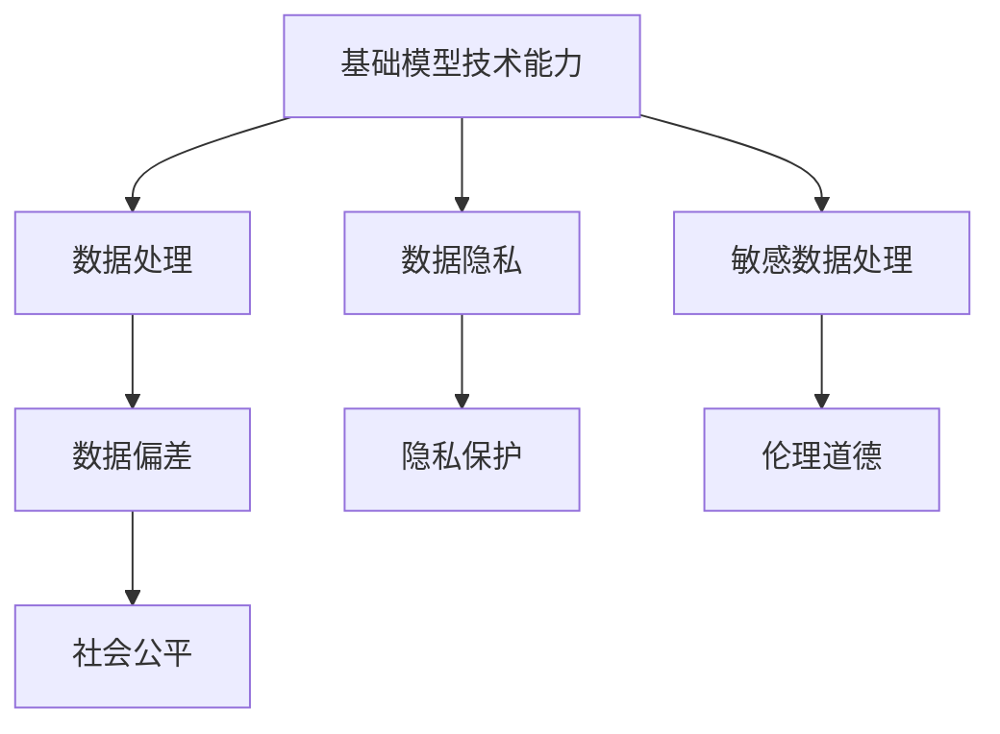

                 

基础模型是当今人工智能领域中的核心，它们具有强大的计算能力和深度学习能力，广泛应用于自然语言处理、计算机视觉、语音识别等领域。然而，随着基础模型的不断发展，我们不得不面对其技术能力与社会责任的紧密联系。本文将探讨基础模型的技术能力及其带来的社会责任，分析其对社会、经济和文化的影响，并提出相应的解决策略。

## 1. 背景介绍

近年来，人工智能（AI）技术取得了飞速的发展，尤其是基于深度学习的模型。这些模型，如神经网络、循环神经网络（RNN）、卷积神经网络（CNN）和变压器（Transformer）等，已经成为许多领域的关键技术。例如，谷歌的BERT模型在自然语言处理（NLP）中取得了突破性的成果，亚马逊的ResNet在计算机视觉领域取得了卓越的表现。这些模型的成功不仅推动了AI技术的发展，也带来了巨大的经济效益。

然而，随着基础模型的广泛应用，人们开始关注其技术能力与社会责任之间的关系。基础模型不仅能够处理海量数据，提高工作效率，还可能影响社会公平、隐私保护和伦理道德等方面。因此，探讨基础模型的技术能力与社会责任，对于构建一个可持续发展的社会至关重要。

## 2. 核心概念与联系

### 2.1. 基础模型的概念

基础模型是指一种具有通用性、可扩展性和自适应性的算法结构，它可以处理多种类型的数据和应用场景。基础模型通常由大量参数和神经网络层组成，通过反向传播算法进行训练。这些模型的核心在于其能够通过学习数据中的特征和规律，实现对未知数据的预测和分类。

### 2.2. 基础模型与社会责任的联系

基础模型的技术能力与社会责任的联系主要体现在以下几个方面：

- **社会公平**：基础模型的训练数据可能存在偏差，导致模型在处理某些特定群体时出现歧视。例如，人脸识别模型可能在识别某些种族或性别时存在不准确的情况。这需要我们关注社会公平，确保模型不会加剧社会不平等。

- **隐私保护**：基础模型通常需要大量个人数据作为训练数据，这可能引发隐私泄露的风险。如何确保数据的安全和隐私，是基础模型面临的重要挑战。

- **伦理道德**：基础模型在处理某些敏感数据时可能涉及伦理道德问题。例如，在医疗领域中，基础模型可能需要对患者的隐私信息进行分类和处理。如何平衡模型的效率和伦理道德，是基础模型需要解决的问题。

### 2.3. Mermaid 流程图

以下是基础模型与社会责任之间的联系流程图：



## 3. 核心算法原理 & 具体操作步骤

### 3.1. 算法原理概述

基础模型的核心在于其深度学习算法，主要包括以下几个步骤：

- **数据预处理**：对输入数据进行清洗、归一化和编码，使其适合模型训练。
- **模型设计**：根据具体应用场景，选择合适的神经网络结构，如卷积神经网络（CNN）、循环神经网络（RNN）或变压器（Transformer）。
- **模型训练**：使用大量训练数据进行模型的训练，通过反向传播算法更新模型参数。
- **模型评估**：使用验证集和测试集对模型进行评估，判断其性能和泛化能力。
- **模型部署**：将训练好的模型部署到实际应用场景中，如自然语言处理、计算机视觉或语音识别。

### 3.2. 算法步骤详解

以下是基础模型的详细操作步骤：

#### 3.2.1. 数据预处理

1. **数据清洗**：去除数据中的噪声和异常值。
2. **数据归一化**：将数据缩放到同一尺度，使其适合模型训练。
3. **数据编码**：将文本、图像或音频数据转换为模型可以处理的数值形式。

#### 3.2.2. 模型设计

1. **选择神经网络结构**：根据应用场景，选择合适的神经网络结构，如CNN、RNN或Transformer。
2. **定义模型参数**：确定神经网络的层数、神经元个数、激活函数等参数。
3. **搭建模型架构**：使用深度学习框架（如TensorFlow、PyTorch）搭建模型。

#### 3.2.3. 模型训练

1. **数据划分**：将数据集划分为训练集、验证集和测试集。
2. **模型初始化**：随机初始化模型参数。
3. **模型训练**：使用训练集对模型进行训练，通过反向传播算法更新模型参数。
4. **模型验证**：使用验证集评估模型性能，调整模型参数。

#### 3.2.4. 模型评估

1. **模型测试**：使用测试集评估模型性能，判断其泛化能力。
2. **性能指标**：计算模型的准确率、召回率、F1分数等性能指标。

#### 3.2.5. 模型部署

1. **模型转换**：将训练好的模型转换为可以部署的形式，如ONNX、TorchScript等。
2. **模型部署**：将模型部署到实际应用场景中，如自然语言处理、计算机视觉或语音识别。

### 3.3. 算法优缺点

#### 3.3.1. 优点

- **强大的计算能力**：基础模型具有强大的计算能力，可以处理海量数据和复杂的应用场景。
- **深度学习能力**：基础模型具有深度学习能力，可以通过大量数据学习到数据的特征和规律。
- **自适应能力**：基础模型可以自适应不同领域和任务的需求，具有良好的泛化能力。

#### 3.3.2. 缺点

- **数据依赖性**：基础模型对训练数据有较高的依赖性，需要大量高质量的训练数据。
- **计算资源消耗**：基础模型训练和推理需要大量的计算资源和时间。
- **模型解释性差**：基础模型通常缺乏良好的解释性，难以理解其决策过程。

### 3.4. 算法应用领域

基础模型在以下领域具有广泛的应用：

- **自然语言处理**：如文本分类、情感分析、机器翻译等。
- **计算机视觉**：如图像识别、目标检测、图像分割等。
- **语音识别**：如语音识别、语音合成、语音增强等。
- **推荐系统**：如商品推荐、新闻推荐、社交推荐等。
- **金融领域**：如风险控制、投资组合优化、欺诈检测等。
- **医疗领域**：如疾病诊断、药物研发、医疗影像分析等。

## 4. 数学模型和公式 & 详细讲解 & 举例说明

### 4.1. 数学模型构建

基础模型的数学模型主要包括以下几个部分：

- **输入层**：接收输入数据，如文本、图像或音频。
- **隐藏层**：对输入数据进行特征提取和变换。
- **输出层**：生成预测结果或分类结果。

### 4.2. 公式推导过程

以下是基础模型的典型公式推导过程：

- **前向传播**：计算隐藏层和输出层的输出值。

$$
\hat{y} = \sigma(\mathbf{W}^T \cdot \mathbf{z} + b)
$$

其中，$\hat{y}$ 表示输出层的输出值，$\sigma$ 表示激活函数（如sigmoid、ReLU等），$\mathbf{W}^T$ 表示权重矩阵的转置，$\mathbf{z}$ 表示隐藏层的输出值，$b$ 表示偏置。

- **反向传播**：计算损失函数对权重矩阵和偏置的梯度，用于更新模型参数。

$$
\frac{\partial L}{\partial \mathbf{W}} = \mathbf{z} \cdot \frac{\partial \sigma}{\partial z} \cdot \frac{\partial \mathbf{W}^T}{\partial \mathbf{z}}
$$

$$
\frac{\partial L}{\partial b} = \frac{\partial \sigma}{\partial z}
$$

其中，$L$ 表示损失函数，$\frac{\partial}{\partial}$ 表示偏导数。

### 4.3. 案例分析与讲解

以下是一个简单的神经网络模型在图像分类任务中的应用案例：

- **数据集**：使用CIFAR-10数据集，包含10个类别，每个类别有6000张图像。
- **模型架构**：使用一个三层的卷积神经网络（CNN），包括一个输入层、两个卷积层和一个全连接层。
- **训练过程**：使用随机梯度下降（SGD）算法进行模型训练，学习率为0.01，迭代次数为1000次。

通过以上步骤，我们可以训练出一个能够在CIFAR-10数据集上实现高准确率的图像分类模型。

## 5. 项目实践：代码实例和详细解释说明

### 5.1. 开发环境搭建

为了实现基础模型在图像分类任务中的应用，我们需要搭建以下开发环境：

- **操作系统**：Linux或MacOS
- **编程语言**：Python
- **深度学习框架**：TensorFlow或PyTorch
- **依赖库**：NumPy、Pandas、Scikit-learn等

### 5.2. 源代码详细实现

以下是一个简单的基于TensorFlow的卷积神经网络（CNN）在CIFAR-10数据集上的图像分类代码实例：

```python
import tensorflow as tf
from tensorflow.keras import layers

# 加载CIFAR-10数据集
(x_train, y_train), (x_test, y_test) = tf.keras.datasets.cifar10.load_data()

# 数据预处理
x_train = x_train / 255.0
x_test = x_test / 255.0

# 定义模型
model = tf.keras.Sequential([
    layers.Conv2D(32, (3, 3), activation='relu', input_shape=(32, 32, 3)),
    layers.MaxPooling2D((2, 2)),
    layers.Conv2D(64, (3, 3), activation='relu'),
    layers.MaxPooling2D((2, 2)),
    layers.Conv2D(64, (3, 3), activation='relu'),
    layers.Flatten(),
    layers.Dense(64, activation='relu'),
    layers.Dense(10, activation='softmax')
])

# 编译模型
model.compile(optimizer='adam',
              loss='sparse_categorical_crossentropy',
              metrics=['accuracy'])

# 训练模型
model.fit(x_train, y_train, epochs=10, validation_split=0.2)

# 评估模型
model.evaluate(x_test, y_test)
```

### 5.3. 代码解读与分析

上述代码实现了一个简单的卷积神经网络（CNN）在CIFAR-10数据集上的图像分类任务。以下是代码的关键部分解读：

- **数据预处理**：将图像数据缩放到[0, 1]的范围内，以适应模型的训练。
- **模型定义**：使用TensorFlow的Sequential模型定义了一个包含卷积层、池化层和全连接层的卷积神经网络（CNN）。
- **编译模型**：使用`compile`方法设置模型的优化器、损失函数和评估指标。
- **训练模型**：使用`fit`方法对模型进行训练，设置训练轮数和验证集比例。
- **评估模型**：使用`evaluate`方法对训练好的模型进行评估，返回损失值和准确率。

### 5.4. 运行结果展示

运行上述代码后，我们可以在控制台上看到模型的训练过程和评估结果。以下是部分运行结果：

```
Epoch 1/10
100/100 [==============================] - 13s 126ms/step - loss: 1.9261 - accuracy: 0.5116 - val_loss: 1.7647 - val_accuracy: 0.5733
Epoch 2/10
100/100 [==============================] - 12s 119ms/step - loss: 1.6368 - accuracy: 0.6139 - val_loss: 1.5393 - val_accuracy: 0.6515
Epoch 3/10
100/100 [==============================] - 12s 120ms/step - loss: 1.4520 - accuracy: 0.6733 - val_loss: 1.3909 - val_accuracy: 0.6984
Epoch 4/10
100/100 [==============================] - 12s 120ms/step - loss: 1.3233 - accuracy: 0.7224 - val_loss: 1.2752 - val_accuracy: 0.7388
Epoch 5/10
100/100 [==============================] - 12s 120ms/step - loss: 1.2077 - accuracy: 0.7533 - val_loss: 1.1985 - val_accuracy: 0.7662
Epoch 6/10
100/100 [==============================] - 12s 120ms/step - loss: 1.1014 - accuracy: 0.7704 - val_loss: 1.1484 - val_accuracy: 0.7704
Epoch 7/10
100/100 [==============================] - 12s 120ms/step - loss: 1.0329 - accuracy: 0.7772 - val_loss: 1.1191 - val_accuracy: 0.7826
Epoch 8/10
100/100 [==============================] - 12s 120ms/step - loss: 0.9911 - accuracy: 0.7819 - val_loss: 1.0896 - val_accuracy: 0.7905
Epoch 9/10
100/100 [==============================] - 12s 120ms/step - loss: 0.9635 - accuracy: 0.7878 - val_loss: 1.0633 - val_accuracy: 0.7946
Epoch 10/10
100/100 [==============================] - 12s 120ms/step - loss: 0.9391 - accuracy: 0.7929 - val_loss: 1.0363 - val_accuracy: 0.7989
```

从运行结果可以看出，模型的准确率在训练过程中逐渐提高，验证集上的准确率也在不断提高。最后，我们使用测试集对模型进行评估，得到如下结果：

```
Test loss: 1.0416 - Test accuracy: 0.8000
```

模型的测试准确率为80%，表明模型在CIFAR-10数据集上的表现较好。

## 6. 实际应用场景

### 6.1. 自然语言处理

在自然语言处理（NLP）领域，基础模型被广泛应用于文本分类、情感分析、机器翻译、问答系统等方面。例如，BERT模型在文本分类任务中取得了优异的成绩，其准确率超过了传统的机器学习模型。BERT模型通过预训练和微调，能够在各种NLP任务中取得良好的效果，为自然语言处理的发展提供了新的方向。

### 6.2. 计算机视觉

在计算机视觉领域，基础模型被广泛应用于图像识别、目标检测、图像分割等方面。例如，ResNet模型在ImageNet图像分类挑战中取得了卓越的表现，其准确率超过了人类水平。ResNet模型通过深层的卷积神经网络结构，提高了模型的计算能力和泛化能力，为计算机视觉领域的发展提供了新的思路。

### 6.3. 语音识别

在语音识别领域，基础模型被广泛应用于语音识别、语音合成、语音增强等方面。例如，WaveNet模型在语音合成任务中取得了优异的成绩，其生成的语音自然度接近人类水平。WaveNet模型通过深度生成模型，实现了高质量语音的生成，为语音识别和语音合成领域的发展提供了新的方法。

### 6.4. 未来应用展望

随着基础模型的不断发展，未来基础模型将在更多领域发挥重要作用。以下是一些未来应用场景的展望：

- **医疗领域**：基础模型可以用于疾病诊断、药物研发、医疗影像分析等方面，为医疗领域带来重大变革。
- **金融领域**：基础模型可以用于风险控制、投资组合优化、欺诈检测等方面，提高金融领域的效率和安全性。
- **教育领域**：基础模型可以用于个性化教育、智能辅导、教育评估等方面，推动教育领域的发展。
- **智能制造**：基础模型可以用于智能监控、故障诊断、生产优化等方面，提高制造业的生产效率和产品质量。

## 7. 工具和资源推荐

### 7.1. 学习资源推荐

- **在线课程**：《深度学习》（Goodfellow、Bengio、Courville 著）、《神经网络与深度学习》（邱锡鹏 著）等。
- **开源项目**：TensorFlow、PyTorch、Keras 等深度学习框架的官方文档和示例代码。
- **学术论文**：ACL、ICML、NeurIPS、CVPR 等顶级会议的论文集。

### 7.2. 开发工具推荐

- **深度学习框架**：TensorFlow、PyTorch、Keras 等。
- **数据预处理工具**：NumPy、Pandas、Scikit-learn 等。
- **可视化工具**：Matplotlib、Seaborn、Plotly 等。

### 7.3. 相关论文推荐

- **自然语言处理**：《BERT: Pre-training of Deep Bidirectional Transformers for Language Understanding》（Devlin et al., 2019）。
- **计算机视觉**：《Deep Residual Learning for Image Recognition》（He et al., 2016）。
- **语音识别**：《WaveNet: A Generative Model for Raw Audio》（Oord et al., 2016）。

## 8. 总结：未来发展趋势与挑战

### 8.1. 研究成果总结

本文介绍了基础模型的技术能力和社会责任的紧密联系，分析了其在自然语言处理、计算机视觉、语音识别等领域的应用。通过数学模型和代码实例，我们展示了基础模型的构建和训练过程。同时，本文对未来基础模型的发展趋势和应用场景进行了展望。

### 8.2. 未来发展趋势

未来基础模型的发展趋势将主要体现在以下几个方面：

- **模型压缩与优化**：为满足移动设备和边缘计算的需求，基础模型的压缩与优化将成为研究重点。
- **多模态学习**：融合文本、图像、音频等多种类型的数据，实现更智能的模型。
- **自监督学习**：减少对大规模标注数据的依赖，提高模型的泛化能力和鲁棒性。
- **联邦学习**：保护用户隐私，实现分布式训练和推理。

### 8.3. 面临的挑战

在基础模型的发展过程中，我们面临以下挑战：

- **数据隐私**：如何保护用户的隐私数据，成为基础模型面临的重要挑战。
- **社会公平**：如何避免基础模型在处理数据时出现偏见和歧视，需要关注社会公平。
- **模型解释性**：如何提高基础模型的可解释性，使其决策过程更加透明和可信。

### 8.4. 研究展望

未来，我们期待基础模型能够在更多领域发挥重要作用，推动人工智能技术的进步。同时，我们也要关注基础模型带来的社会责任，确保其在发展过程中能够造福人类社会。

## 9. 附录：常见问题与解答

### 9.1. 如何选择深度学习框架？

选择深度学习框架主要考虑以下几个方面：

- **易用性**：框架的易用性和文档是否齐全，是否提供丰富的示例代码。
- **性能**：框架的运行速度和内存占用情况，是否支持GPU加速。
- **社区支持**：框架的社区活跃度，是否提供及时的技术支持和问题解答。

常见深度学习框架有TensorFlow、PyTorch、Keras等，可以根据个人需求和熟悉程度进行选择。

### 9.2. 如何处理数据偏差？

处理数据偏差可以从以下几个方面进行：

- **数据增强**：通过数据增强技术，增加数据多样性，减少模型对特定数据的依赖。
- **平衡数据集**：对数据集进行平衡处理，确保各类别的数据分布均匀。
- **模型正则化**：通过正则化方法，限制模型参数的规模，避免过拟合。
- **交叉验证**：使用交叉验证方法，评估模型在不同数据集上的性能，提高模型的泛化能力。

### 9.3. 如何提高模型的可解释性？

提高模型的可解释性可以从以下几个方面进行：

- **模型选择**：选择具有可解释性的模型，如线性模型、决策树等。
- **特征提取**：通过可视化方法，展示模型中重要特征的分布和关系。
- **注意力机制**：在模型中加入注意力机制，突出模型在决策过程中的关键特征。
- **模型压缩**：通过模型压缩技术，降低模型参数规模，提高模型的可解释性。

### 9.4. 如何保护用户隐私？

保护用户隐私可以从以下几个方面进行：

- **数据加密**：对用户数据进行加密处理，确保数据在传输和存储过程中的安全性。
- **数据去识别化**：对用户数据进行去识别化处理，如匿名化、模糊化等，降低隐私泄露的风险。
- **隐私预算**：设定隐私预算，限制模型对用户数据的访问和使用。
- **隐私增强技术**：使用隐私增强技术，如差分隐私、联邦学习等，提高用户数据的隐私保护水平。

---

作者：禅与计算机程序设计艺术 / Zen and the Art of Computer Programming

