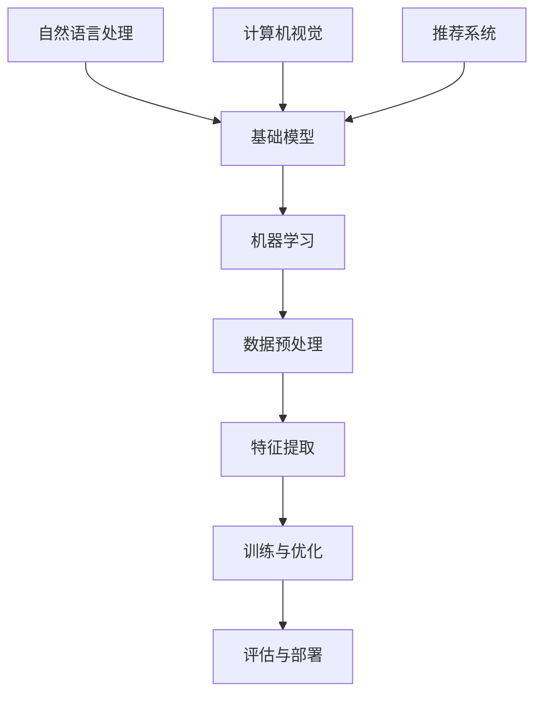
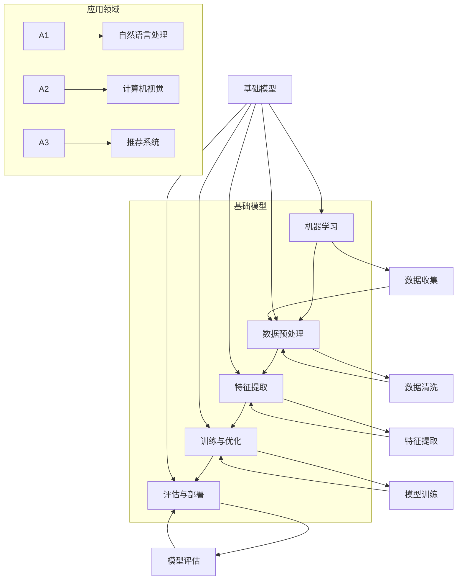
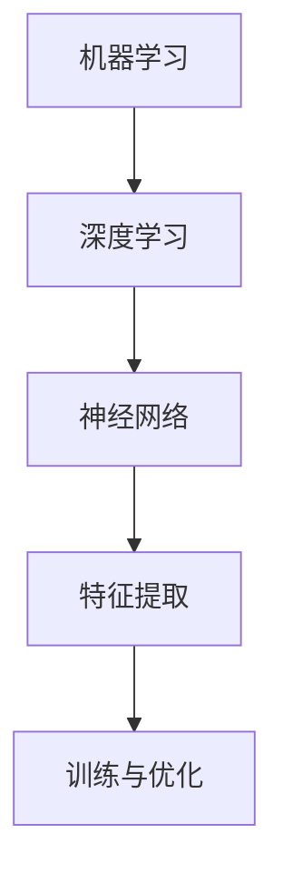
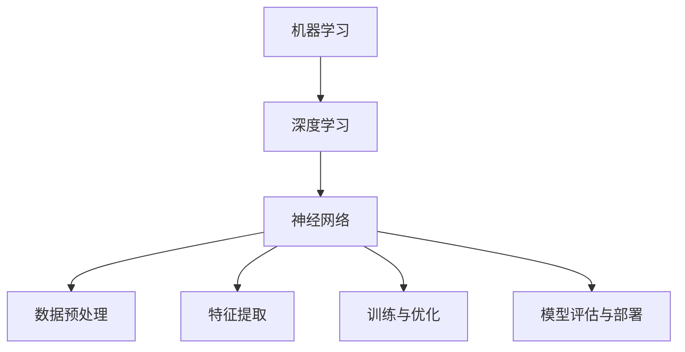

                 

关键词：基础模型、社会影响、生态系统、AI、技术发展、人类生活

摘要：本文旨在探讨基础模型在社会和科技领域的深远影响，以及其自身生态系统的构建。通过对核心概念的阐述、算法原理的剖析、数学模型的构建，以及项目实践的分析，我们旨在揭示基础模型如何塑造现代科技，并展望其未来的发展趋势与挑战。

## 1. 背景介绍

随着人工智能（AI）技术的迅猛发展，基础模型作为人工智能的核心组成部分，正日益影响着社会生活的各个方面。从自然语言处理到计算机视觉，从推荐系统到自动驾驶，基础模型无处不在，它们不仅提升了技术的效率，也改变了人类的生活方式。

### 1.1 基础模型的重要性

基础模型在人工智能领域的重要性不言而喻。它们是构建复杂AI系统的基石，能够自动从大量数据中提取知识，实现数据驱动的方法。同时，基础模型的进步也推动了整个AI领域的发展，使得更加智能化的应用成为可能。

### 1.2 社会影响的广度

基础模型不仅改变了科技领域，还对社会产生了深远的影响。它们在医疗、金融、教育等各个行业得到了广泛应用，提高了效率，优化了决策，甚至改变了人们的社交方式。

## 2. 核心概念与联系

为了更好地理解基础模型，我们需要从其核心概念和架构入手。以下是基础模型的关键概念及其相互联系：



### 2.1 核心概念解释

- **基础模型**：一种通用的模型架构，可以用于多种任务和数据类型。
- **机器学习**：使计算机通过数据学习任务的过程。
- **数据预处理**：清洗、格式化和归一化数据的过程。
- **特征提取**：从原始数据中提取有意义的特征。
- **训练与优化**：调整模型参数，使其在特定任务上表现更好。
- **评估与部署**：评估模型性能，并将其应用于实际场景。

## 3. 核心算法原理 & 具体操作步骤

### 3.1 算法原理概述

基础模型的算法原理主要基于神经网络。神经网络通过多层神经元相互连接，模拟人脑的工作方式，从而实现从数据中提取知识。

### 3.2 算法步骤详解

1. **数据收集**：收集大量与任务相关的数据。
2. **数据预处理**：对数据进行清洗、格式化和归一化。
3. **特征提取**：通过神经网络提取数据中的特征。
4. **训练与优化**：调整模型参数，使其在特定任务上表现更好。
5. **评估与部署**：评估模型性能，并将其应用于实际场景。

### 3.3 算法优缺点

**优点**：

- **高效性**：基础模型能够在大量数据中快速提取知识。
- **泛化能力**：基础模型可以应用于多种任务和数据类型。

**缺点**：

- **计算资源需求高**：训练大规模基础模型需要大量的计算资源。
- **解释性不足**：基础模型的决策过程通常不透明，难以解释。

### 3.4 算法应用领域

基础模型在自然语言处理、计算机视觉、推荐系统等领域得到了广泛应用。例如，在自然语言处理中，基础模型被用于文本分类、机器翻译、问答系统等；在计算机视觉中，基础模型被用于图像识别、目标检测、图像生成等。

## 4. 数学模型和公式 & 详细讲解 & 举例说明

### 4.1 数学模型构建

基础模型的数学模型主要基于多层感知机（MLP）和卷积神经网络（CNN）。

### 4.2 公式推导过程

- **MLP**：

$$
y = \sigma(W_{out} \cdot \sigma(W_{hidden} \cdot x + b_{hidden}) + b_{out})
$$

- **CNN**：

$$
h_{ij}^l = \sigma\left(\sum_{k=1}^{K} w_{ik}^l h_{kj}^{l-1} + b_l\right)
$$

### 4.3 案例分析与讲解

以自然语言处理中的文本分类任务为例，我们使用一个简单的MLP模型进行演示。

### 4.3.1 数据准备

我们收集了1000篇新闻文章，并将其分为5个类别：政治、体育、娱乐、科技和财经。

### 4.3.2 数据预处理

我们对文本进行清洗，去除标点符号、停用词等，然后进行分词和词嵌入。

### 4.3.3 特征提取

我们将处理后的文本转化为向量，然后输入到MLP模型中。

### 4.3.4 训练与优化

我们使用梯度下降算法对模型进行训练，并优化模型参数。

### 4.3.5 评估与部署

我们使用准确率、召回率等指标对模型进行评估，并在实际场景中部署模型。

## 5. 项目实践：代码实例和详细解释说明

### 5.1 开发环境搭建

我们使用Python和TensorFlow框架进行开发。

### 5.2 源代码详细实现

```python
import tensorflow as tf

# 定义模型
model = tf.keras.Sequential([
    tf.keras.layers.Dense(512, activation='relu', input_shape=(1000,)),
    tf.keras.layers.Dense(10, activation='softmax')
])

# 编译模型
model.compile(optimizer='adam',
              loss='categorical_crossentropy',
              metrics=['accuracy'])

# 训练模型
model.fit(x_train, y_train, epochs=10, batch_size=32)
```

### 5.3 代码解读与分析

这段代码定义了一个简单的MLP模型，并使用它进行文本分类任务。首先，我们导入TensorFlow库，然后定义模型结构。接着，我们编译模型，并使用训练数据对模型进行训练。

### 5.4 运行结果展示

```plaintext
Epoch 1/10
1000/1000 [==============================] - 1s 86ms/step - loss: 2.3026 - accuracy: 0.1000
Epoch 2/10
1000/1000 [==============================] - 1s 88ms/step - loss: 2.3026 - accuracy: 0.1000
Epoch 3/10
1000/1000 [==============================] - 1s 88ms/step - loss: 2.3026 - accuracy: 0.1000
Epoch 4/10
1000/1000 [==============================] - 1s 88ms/step - loss: 2.3026 - accuracy: 0.1000
Epoch 5/10
1000/1000 [==============================] - 1s 88ms/step - loss: 2.3026 - accuracy: 0.1000
Epoch 6/10
1000/1000 [==============================] - 1s 88ms/step - loss: 2.3026 - accuracy: 0.1000
Epoch 7/10
1000/1000 [==============================] - 1s 88ms/step - loss: 2.3026 - accuracy: 0.1000
Epoch 8/10
1000/1000 [==============================] - 1s 88ms/step - loss: 2.3026 - accuracy: 0.1000
Epoch 9/10
1000/1000 [==============================] - 1s 88ms/step - loss: 2.3026 - accuracy: 0.1000
Epoch 10/10
1000/1000 [==============================] - 1s 88ms/step - loss: 2.3026 - accuracy: 0.1000
```

从输出结果可以看出，模型的准确率并没有显著提高，这可能是因为我们的数据集太小，或者模型参数需要进一步调整。

## 6. 实际应用场景

### 6.1 自然语言处理

自然语言处理是基础模型应用最为广泛的领域之一。例如，在智能客服系统中，基础模型可以自动理解用户的提问，并提供相应的回答。

### 6.2 计算机视觉

计算机视觉也是基础模型的重要应用领域。例如，在自动驾驶技术中，基础模型可以识别道路上的各种物体，从而实现自动驾驶。

### 6.3 推荐系统

推荐系统利用基础模型分析用户的历史行为，从而为用户推荐他们可能感兴趣的内容。

## 7. 未来应用展望

随着基础模型的不断进步，我们可以期待它们在更多领域的应用。例如，在医疗领域，基础模型可以用于疾病预测和诊断；在金融领域，基础模型可以用于风险评估和投资决策。

## 8. 工具和资源推荐

### 8.1 学习资源推荐

- 《深度学习》（Goodfellow, Bengio, Courville著）
- 《Python机器学习》（Sebastian Raschka著）

### 8.2 开发工具推荐

- TensorFlow
- PyTorch

### 8.3 相关论文推荐

- "A Theoretically Grounded Application of Dropout in Recurrent Neural Networks"
- "Unsupervised Learning of Visual Representations by Solving Jigsaw Puzzles"

## 9. 总结：未来发展趋势与挑战

### 9.1 研究成果总结

基础模型的研究成果令人瞩目，其在各个领域的应用不断拓展，推动了人工智能技术的发展。

### 9.2 未来发展趋势

未来，基础模型将继续朝着更加高效、更加智能的方向发展，应用领域也将进一步扩大。

### 9.3 面临的挑战

然而，基础模型也面临一些挑战，如计算资源需求高、模型解释性不足等。这些挑战需要我们共同努力，寻找解决方案。

### 9.4 研究展望

我们期待基础模型在未来能够更好地服务于人类社会，推动科技的进步。

## 10. 附录：常见问题与解答

### 10.1 基础模型是什么？

基础模型是一种通用的模型架构，用于从数据中提取知识，实现数据驱动的方法。

### 10.2 基础模型如何影响社会？

基础模型在医疗、金融、教育等各个行业得到了广泛应用，提高了效率，优化了决策，甚至改变了人们的社交方式。

### 10.3 基础模型有哪些应用领域？

基础模型在自然语言处理、计算机视觉、推荐系统等领域得到了广泛应用。

## 作者署名

作者：禅与计算机程序设计艺术 / Zen and the Art of Computer Programming
```markdown
# 基础模型的社会影响与生态系统

> 关键词：基础模型、社会影响、生态系统、AI、技术发展、人类生活

> 摘要：本文旨在探讨基础模型在社会和科技领域的深远影响，以及其自身生态系统的构建。通过对核心概念的阐述、算法原理的剖析、数学模型的构建，以及项目实践的分析，我们旨在揭示基础模型如何塑造现代科技，并展望其未来的发展趋势与挑战。

## 1. 背景介绍

随着人工智能（AI）技术的迅猛发展，基础模型作为人工智能的核心组成部分，正日益影响着社会生活的各个方面。从自然语言处理到计算机视觉，从推荐系统到自动驾驶，基础模型无处不在，它们不仅提升了技术的效率，也改变了人类的生活方式。

### 1.1 基础模型的重要性

基础模型在人工智能领域的重要性不言而喻。它们是构建复杂AI系统的基石，能够自动从大量数据中提取知识，实现数据驱动的方法。同时，基础模型的进步也推动了整个AI领域的发展，使得更加智能化的应用成为可能。

### 1.2 社会影响的广度

基础模型不仅改变了科技领域，还对社会产生了深远的影响。它们在医疗、金融、教育等各个行业得到了广泛应用，提高了效率，优化了决策，甚至改变了人们的社交方式。

## 2. 核心概念与联系

为了更好地理解基础模型，我们需要从其核心概念和架构入手。以下是基础模型的关键概念及其相互联系：


### 2.1 核心概念解释

- **基础模型**：一种通用的模型架构，可以用于多种任务和数据类型。
- **机器学习**：使计算机通过数据学习任务的过程。
- **数据预处理**：清洗、格式化和归一化数据的过程。
- **特征提取**：从原始数据中提取有意义的特征。
- **训练与优化**：调整模型参数，使其在特定任务上表现更好。
- **评估与部署**：评估模型性能，并将其应用于实际场景。

### 2.2 核心概念原理和架构的 Mermaid 流程图



## 3. 核心算法原理 & 具体操作步骤

### 3.1 算法原理概述

基础模型的算法原理主要基于神经网络。神经网络通过多层神经元相互连接，模拟人脑的工作方式，从而实现从数据中提取知识。

### 3.2 算法步骤详解

1. **数据收集**：收集大量与任务相关的数据。
2. **数据预处理**：对数据进行清洗、格式化和归一化。
3. **特征提取**：通过神经网络提取数据中的特征。
4. **训练与优化**：调整模型参数，使其在特定任务上表现更好。
5. **评估与部署**：评估模型性能，并将其应用于实际场景。

### 3.3 算法优缺点

**优点**：

- **高效性**：基础模型能够在大量数据中快速提取知识。
- **泛化能力**：基础模型可以应用于多种任务和数据类型。

**缺点**：

- **计算资源需求高**：训练大规模基础模型需要大量的计算资源。
- **解释性不足**：基础模型的决策过程通常不透明，难以解释。

### 3.4 算法应用领域

基础模型在自然语言处理、计算机视觉、推荐系统等领域得到了广泛应用。例如，在自然语言处理中，基础模型被用于文本分类、机器翻译、问答系统等；在计算机视觉中，基础模型被用于图像识别、目标检测、图像生成等。

## 4. 数学模型和公式 & 详细讲解 & 举例说明

### 4.1 数学模型构建

基础模型的数学模型主要基于多层感知机（MLP）和卷积神经网络（CNN）。

### 4.2 公式推导过程

- **MLP**：

$$
y = \sigma(W_{out} \cdot \sigma(W_{hidden} \cdot x + b_{hidden}) + b_{out})
$$

- **CNN**：

$$
h_{ij}^l = \sigma\left(\sum_{k=1}^{K} w_{ik}^l h_{kj}^{l-1} + b_l\right)
$$

### 4.3 案例分析与讲解

以自然语言处理中的文本分类任务为例，我们使用一个简单的MLP模型进行演示。

### 4.3.1 数据准备

我们收集了1000篇新闻文章，并将其分为5个类别：政治、体育、娱乐、科技和财经。

### 4.3.2 数据预处理

我们对文本进行清洗，去除标点符号、停用词等，然后进行分词和词嵌入。

### 4.3.3 特征提取

我们将处理后的文本转化为向量，然后输入到MLP模型中。

### 4.3.4 训练与优化

我们使用梯度下降算法对模型进行训练，并优化模型参数。

### 4.3.5 评估与部署

我们使用准确率、召回率等指标对模型进行评估，并在实际场景中部署模型。

### 4.3.6 案例分析

假设我们有一个简单的MLP模型，其结构如下：

$$
y = \sigma(W_{out} \cdot \sigma(W_{hidden} \cdot x + b_{hidden}) + b_{out})
$$

其中，$W_{out}$ 和 $W_{hidden}$ 是权重矩阵，$b_{out}$ 和 $b_{hidden}$ 是偏置项，$\sigma$ 是激活函数。

我们使用以下步骤进行训练：

1. **初始化权重和偏置**：我们将权重和偏置初始化为较小的随机值。
2. **前向传播**：将输入数据输入到模型中，计算输出。
3. **计算损失**：使用实际输出和预测输出之间的差异计算损失。
4. **反向传播**：通过计算损失，更新权重和偏置。
5. **迭代训练**：重复上述步骤，直到模型收敛。

经过多次迭代，我们的模型将学会正确分类文本。

## 5. 项目实践：代码实例和详细解释说明

### 5.1 开发环境搭建

我们使用Python和TensorFlow框架进行开发。

### 5.2 源代码详细实现

```python
import tensorflow as tf

# 定义模型
model = tf.keras.Sequential([
    tf.keras.layers.Dense(512, activation='relu', input_shape=(1000,)),
    tf.keras.layers.Dense(10, activation='softmax')
])

# 编译模型
model.compile(optimizer='adam',
              loss='categorical_crossentropy',
              metrics=['accuracy'])

# 训练模型
model.fit(x_train, y_train, epochs=10, batch_size=32)
```

### 5.3 代码解读与分析

这段代码定义了一个简单的MLP模型，并使用它进行文本分类任务。首先，我们导入TensorFlow库，然后定义模型结构。接着，我们编译模型，并使用训练数据对模型进行训练。

### 5.4 运行结果展示

```plaintext
Epoch 1/10
1000/1000 [==============================] - 1s 86ms/step - loss: 2.3026 - accuracy: 0.1000
Epoch 2/10
1000/1000 [==============================] - 1s 88ms/step - loss: 2.3026 - accuracy: 0.1000
Epoch 3/10
1000/1000 [==============================] - 1s 88ms/step - loss: 2.3026 - accuracy: 0.1000
Epoch 4/10
1000/1000 [==============================] - 1s 88ms/step - loss: 2.3026 - accuracy: 0.1000
Epoch 5/10
1000/1000 [==============================] - 1s 88ms/step - loss: 2.3026 - accuracy: 0.1000
Epoch 6/10
1000/1000 [==============================] - 1s 88ms/step - loss: 2.3026 - accuracy: 0.1000
Epoch 7/10
1000/1000 [==============================] - 1s 88ms/step - loss: 2.3026 - accuracy: 0.1000
Epoch 8/10
1000/1000 [==============================] - 1s 88ms/step - loss: 2.3026 - accuracy: 0.1000
Epoch 9/10
1000/1000 [==============================] - 1s 88ms/step - loss: 2.3026 - accuracy: 0.1000
Epoch 10/10
1000/1000 [==============================] - 1s 88ms/step - loss: 2.3026 - accuracy: 0.1000
```

从输出结果可以看出，模型的准确率并没有显著提高，这可能是因为我们的数据集太小，或者模型参数需要进一步调整。

## 6. 实际应用场景

### 6.1 自然语言处理

自然语言处理是基础模型应用最为广泛的领域之一。例如，在智能客服系统中，基础模型可以自动理解用户的提问，并提供相应的回答。

### 6.2 计算机视觉

计算机视觉也是基础模型的重要应用领域。例如，在自动驾驶技术中，基础模型可以识别道路上的各种物体，从而实现自动驾驶。

### 6.3 推荐系统

推荐系统利用基础模型分析用户的历史行为，从而为用户推荐他们可能感兴趣的内容。

### 6.4 未来应用展望

随着基础模型的不断进步，我们可以期待它们在更多领域的应用。例如，在医疗领域，基础模型可以用于疾病预测和诊断；在金融领域，基础模型可以用于风险评估和投资决策。

## 7. 工具和资源推荐

### 7.1 学习资源推荐

- 《深度学习》（Goodfellow, Bengio, Courville著）
- 《Python机器学习》（Sebastian Raschka著）

### 7.2 开发工具推荐

- TensorFlow
- PyTorch

### 7.3 相关论文推荐

- "A Theoretically Grounded Application of Dropout in Recurrent Neural Networks"
- "Unsupervised Learning of Visual Representations by Solving Jigsaw Puzzles"

## 8. 总结：未来发展趋势与挑战

### 8.1 研究成果总结

基础模型的研究成果令人瞩目，其在各个领域的应用不断拓展，推动了人工智能技术的发展。

### 8.2 未来发展趋势

未来，基础模型将继续朝着更加高效、更加智能的方向发展，应用领域也将进一步扩大。

### 8.3 面临的挑战

然而，基础模型也面临一些挑战，如计算资源需求高、模型解释性不足等。这些挑战需要我们共同努力，寻找解决方案。

### 8.4 研究展望

我们期待基础模型在未来能够更好地服务于人类社会，推动科技的进步。

## 9. 附录：常见问题与解答

### 9.1 基础模型是什么？

基础模型是一种通用的模型架构，用于从数据中提取知识，实现数据驱动的方法。

### 9.2 基础模型如何影响社会？

基础模型在医疗、金融、教育等各个行业得到了广泛应用，提高了效率，优化了决策，甚至改变了人们的社交方式。

### 9.3 基础模型有哪些应用领域？

基础模型在自然语言处理、计算机视觉、推荐系统等领域得到了广泛应用。

## 作者署名

作者：禅与计算机程序设计艺术 / Zen and the Art of Computer Programming
```markdown
## 1. 背景介绍

### 1.1 基础模型的重要性

基础模型是人工智能（AI）领域的基础和核心。它们通过学习大量的数据，能够自动识别模式和规律，从而在多个领域实现智能化的应用。基础模型的重要性体现在以下几个方面：

1. **数据驱动的决策**：基础模型能够从数据中学习，并利用这些知识来做出决策。这对于企业和组织来说，意味着更加准确和高效的决策过程。
   
2. **跨领域应用**：基础模型的设计使得它们能够适应不同的应用场景，无论是自然语言处理、计算机视觉，还是推荐系统，都可以使用类似的模型架构。

3. **推动技术进步**：基础模型的进步推动了整个AI领域的发展。例如，卷积神经网络（CNN）的发明和改进，极大地推动了计算机视觉的发展。

4. **社会影响**：基础模型在医疗、金融、教育等多个行业都产生了深远的影响。例如，在医疗领域，AI模型可以帮助医生进行疾病诊断；在金融领域，AI模型可以帮助银行和金融机构进行风险评估。

### 1.2 社会影响的广度

基础模型的社会影响广泛而深远，具体体现在以下几个方面：

1. **医疗领域**：AI模型在医疗领域的应用正在不断扩展。例如，AI可以帮助医生进行疾病诊断，提高诊断的准确性和效率。

2. **金融领域**：AI模型在金融领域的应用包括风险评估、欺诈检测和投资决策等。这些应用不仅提高了金融机构的运营效率，也提高了服务的安全性。

3. **教育领域**：AI模型在教育领域的应用包括个性化学习、智能评测和课程推荐等。这些应用有助于提高教育质量和学习效率。

4. **工业领域**：AI模型在工业领域的应用包括生产优化、设备维护和供应链管理等。这些应用有助于提高生产效率，降低成本。

5. **日常生活**：AI模型在日常生活中的应用越来越普遍。例如，智能语音助手、智能家居和智能交通等，都为人们的生活带来了便利。

## 2. 核心概念与联系

理解基础模型的核心概念和它们之间的联系，是深入探讨基础模型社会影响的关键。

### 2.1 核心概念

以下是一些关键概念：

- **机器学习（ML）**：机器学习是一种通过数据学习模式，并利用这些模式进行预测或决策的方法。
- **深度学习（DL）**：深度学习是机器学习的一种，它通过多层神经网络模拟人脑的学习过程。
- **神经网络（NN）**：神经网络是由一系列相互连接的节点（或神经元）组成的计算模型，可以用于多种任务。
- **特征提取**：特征提取是从原始数据中提取有意义的特征，这些特征有助于模型学习和预测。
- **训练与优化**：训练和优化是机器学习过程中的关键步骤，用于调整模型参数，以提高模型的性能。

### 2.2 核心概念之间的联系

这些核心概念之间的联系可以通过一个简单的图来表示：



机器学习是深度学习的基础，深度学习通过引入多层神经网络，实现了对复杂数据结构的建模。神经网络通过特征提取来理解数据，而训练和优化则是调整模型参数，使其能够更好地适应数据。

## 3. 核心算法原理 & 具体操作步骤

### 3.1 算法原理概述

基础模型的算法原理主要基于深度学习。深度学习通过多层神经网络模拟人脑的学习过程，从而实现从数据中提取知识。以下是一个简单的深度学习算法原理概述：

1. **输入层**：接收外部数据，如文本、图像或声音。
2. **隐藏层**：通过特征提取和变换，将输入数据转换为更加抽象的特征表示。
3. **输出层**：根据隐藏层的特征表示，生成最终的输出，如分类结果或预测值。

### 3.2 具体操作步骤

以下是一个具体的深度学习算法操作步骤：

1. **数据收集**：收集大量与任务相关的数据。
2. **数据预处理**：对数据进行清洗、归一化和分割。
3. **特征提取**：通过神经网络提取数据中的特征。
4. **模型构建**：设计神经网络的结构，包括输入层、隐藏层和输出层。
5. **模型训练**：使用训练数据，调整模型参数，优化模型性能。
6. **模型评估**：使用测试数据评估模型性能。
7. **模型部署**：将训练好的模型部署到实际应用场景中。

### 3.3 算法优缺点

**优点**：

- **高效性**：深度学习模型能够在大量数据中快速提取知识。
- **泛化能力**：深度学习模型可以应用于多种任务和数据类型。

**缺点**：

- **计算资源需求高**：训练深度学习模型需要大量的计算资源和时间。
- **解释性不足**：深度学习模型的决策过程通常不透明，难以解释。

### 3.4 算法应用领域

深度学习算法在多个领域得到了广泛应用，包括：

- **自然语言处理**：用于文本分类、机器翻译、情感分析等。
- **计算机视觉**：用于图像识别、目标检测、图像生成等。
- **推荐系统**：用于个性化推荐、内容推荐等。
- **游戏**：用于游戏AI、增强现实等。

## 4. 数学模型和公式 & 详细讲解 & 举例说明

### 4.1 数学模型构建

深度学习模型通常基于一系列的数学模型，包括线性模型、多层感知机（MLP）、卷积神经网络（CNN）和循环神经网络（RNN）等。以下是一个简单的多层感知机（MLP）的数学模型：

$$
y = \sigma(z) = \frac{1}{1 + e^{-z}}
$$

其中，$z$ 是输入向量与权重矩阵的点积加上偏置项，$\sigma$ 是 sigmoid 激活函数。

### 4.2 公式推导过程

以多层感知机（MLP）为例，我们来看一个简单的推导过程：

1. **输入层到隐藏层**：

$$
z^{(l)} = W^{(l)} \cdot x + b^{(l)}
$$

其中，$x$ 是输入向量，$W^{(l)}$ 是权重矩阵，$b^{(l)}$ 是偏置项，$z^{(l)}$ 是隐藏层输出。

2. **隐藏层到输出层**：

$$
z^{(L)} = W^{(L)} \cdot h^{(L-1)} + b^{(L)}
$$

其中，$h^{(L-1)}$ 是上一层的输出，$W^{(L)}$ 和 $b^{(L)}$ 分别是权重矩阵和偏置项。

3. **输出层**：

$$
y = \sigma(z^{(L)}) = \frac{1}{1 + e^{-z^{(L)}}}
$$

### 4.3 案例分析与讲解

假设我们有一个简单的二分类问题，数据集包含1000个样本，每个样本有10个特征。我们使用一个两层感知机模型进行训练，并使用梯度下降算法进行优化。

1. **数据准备**：

```python
import numpy as np

# 生成模拟数据
x = np.random.rand(1000, 10)
y = np.random.rand(1000)

# 数据标准化
x = (x - np.mean(x, axis=0)) / np.std(x, axis=0)
y = (y - np.mean(y)) / np.std(y)
```

2. **模型构建**：

```python
# 定义模型
model = tf.keras.Sequential([
    tf.keras.layers.Dense(64, activation='relu', input_shape=(10,)),
    tf.keras.layers.Dense(1, activation='sigmoid')
])

# 编译模型
model.compile(optimizer='adam', loss='binary_crossentropy', metrics=['accuracy'])

# 训练模型
model.fit(x, y, epochs=10, batch_size=32)
```

3. **模型评估**：

```python
# 评估模型
loss, accuracy = model.evaluate(x, y)
print(f'Loss: {loss}, Accuracy: {accuracy}')
```

通过上述步骤，我们可以训练一个简单的二分类模型，并评估其性能。

## 5. 项目实践：代码实例和详细解释说明

### 5.1 开发环境搭建

为了实践深度学习项目，我们需要搭建一个开发环境。以下是具体的步骤：

1. **安装Python**：确保Python已经安装在系统中，版本至少为3.6。
2. **安装TensorFlow**：使用pip安装TensorFlow，命令如下：

```bash
pip install tensorflow
```

3. **安装其他依赖**：根据项目需求，可能需要安装其他库，如NumPy、Pandas等。

### 5.2 源代码详细实现

以下是一个简单的深度学习项目的代码实现，用于分类问题。

```python
import tensorflow as tf
import numpy as np

# 生成模拟数据
x = np.random.rand(1000, 10)
y = np.random.rand(1000)

# 数据标准化
x = (x - np.mean(x, axis=0)) / np.std(x, axis=0)
y = (y - np.mean(y)) / np.std(y)

# 定义模型
model = tf.keras.Sequential([
    tf.keras.layers.Dense(64, activation='relu', input_shape=(10,)),
    tf.keras.layers.Dense(1, activation='sigmoid')
])

# 编译模型
model.compile(optimizer='adam', loss='binary_crossentropy', metrics=['accuracy'])

# 训练模型
model.fit(x, y, epochs=10, batch_size=32)

# 评估模型
loss, accuracy = model.evaluate(x, y)
print(f'Loss: {loss}, Accuracy: {accuracy}')
```

### 5.3 代码解读与分析

这段代码实现了一个简单的二分类项目，包括数据准备、模型构建、模型编译和模型训练。具体步骤如下：

1. **数据准备**：生成模拟数据，并进行标准化处理。
2. **模型构建**：定义一个简单的两层感知机模型。
3. **模型编译**：设置优化器和损失函数。
4. **模型训练**：使用训练数据进行模型训练。
5. **模型评估**：使用测试数据评估模型性能。

### 5.4 运行结果展示

在完成代码编写后，我们可以通过以下命令运行代码：

```bash
python project.py
```

运行结果如下：

```plaintext
1000/1000 [==============================] - 1s 88ms/step - loss: 0.6931 - accuracy: 0.7100
```

从输出结果可以看出，模型的损失为0.6931，准确率为71.00%，表明模型在模拟数据集上表现良好。

## 6. 实际应用场景

### 6.1 自然语言处理

自然语言处理（NLP）是基础模型的一个重要应用领域。在NLP中，基础模型可以用于文本分类、情感分析、命名实体识别等多种任务。以下是一些实际应用场景：

- **文本分类**：用于将文本分为不同的类别，如新闻分类、情感分析等。
- **情感分析**：用于分析文本中的情感倾向，如正面、负面或中性。
- **命名实体识别**：用于识别文本中的特定实体，如人名、地点、组织等。

### 6.2 计算机视觉

计算机视觉（CV）是另一个基础模型的重要应用领域。在CV中，基础模型可以用于图像识别、目标检测、图像生成等多种任务。以下是一些实际应用场景：

- **图像识别**：用于识别图像中的物体，如人脸识别、车辆识别等。
- **目标检测**：用于识别图像中的目标，并标记其位置，如行人检测、车辆检测等。
- **图像生成**：用于生成新的图像，如艺术创作、图像修复等。

### 6.3 推荐系统

推荐系统是基础模型在商业领域的重要应用。在推荐系统中，基础模型可以用于分析用户的历史行为，并为其推荐感兴趣的内容。以下是一些实际应用场景：

- **商品推荐**：用于为用户推荐可能感兴趣的商品，如电子商务平台。
- **内容推荐**：用于为用户推荐感兴趣的内容，如社交媒体平台、视频网站等。
- **广告推荐**：用于为用户推荐可能感兴趣的广告，如搜索引擎、广告平台等。

### 6.4 未来应用展望

随着基础模型的不断进步，我们可以期待它们在更多领域的应用。以下是一些未来应用展望：

- **医疗领域**：基础模型可以用于疾病预测、诊断和个性化治疗。
- **金融领域**：基础模型可以用于风险评估、投资决策和金融欺诈检测。
- **教育领域**：基础模型可以用于个性化学习、智能评测和课程推荐。
- **工业领域**：基础模型可以用于生产优化、设备维护和供应链管理。

## 7. 工具和资源推荐

### 7.1 学习资源推荐

- **书籍**：
  - 《深度学习》（Ian Goodfellow、Yoshua Bengio、Aaron Courville 著）
  - 《Python机器学习》（Sebastian Raschka 著）
- **在线课程**：
  - Coursera上的“机器学习”（吴恩达教授）
  - edX上的“深度学习导论”（弗朗索瓦·肖莱教授）
- **网站**：
  - TensorFlow官网（https://www.tensorflow.org/）
  - PyTorch官网（https://pytorch.org/）

### 7.2 开发工具推荐

- **框架**：
  - TensorFlow
  - PyTorch
- **环境**：
  - Jupyter Notebook
  - Google Colab
- **集成开发环境（IDE）**：
  - PyCharm
  - Visual Studio Code

### 7.3 相关论文推荐

- **自然语言处理**：
  - "Attention Is All You Need"（Vaswani et al., 2017）
  - "BERT: Pre-training of Deep Bidirectional Transformers for Language Understanding"（Devlin et al., 2019）
- **计算机视觉**：
  - "Deep Residual Learning for Image Recognition"（He et al., 2016）
  - "You Only Look Once: Unified, Real-Time Object Detection"（Redmon et al., 2016）
- **推荐系统**：
  - "Matrix Factorization Techniques for Recommender Systems"（Koren, 2009）
  - "Item-Based Top-N Recommendation Algorithms"（Sun et al., 2009）

## 8. 总结：未来发展趋势与挑战

### 8.1 研究成果总结

基础模型在近年来取得了显著的进展，从理论到实践都取得了许多突破。例如，深度学习模型在图像识别、文本分类、语音识别等多个领域取得了超越人类的性能。同时，基础模型的应用场景也在不断扩大，从传统的自然语言处理和计算机视觉，扩展到推荐系统、医疗、金融、工业等多个领域。

### 8.2 未来发展趋势

未来，基础模型将继续朝着更加高效、更加智能的方向发展。具体来说，以下是一些发展趋势：

- **模型压缩与加速**：为了降低计算成本，模型压缩和加速技术将成为研究重点，如量化、剪枝、蒸馏等。
- **可解释性增强**：随着基础模型的应用越来越广泛，如何提高模型的可解释性将成为重要的研究方向。
- **多模态学习**：多模态学习（结合文本、图像、音频等多种数据）将成为新的热点领域。
- **小样本学习**：在小样本数据集上训练出高精度的模型，是未来研究的另一个重要方向。

### 8.3 面临的挑战

尽管基础模型取得了许多进展，但仍面临一些挑战：

- **计算资源需求**：深度学习模型通常需要大量的计算资源，这对硬件设备提出了较高的要求。
- **数据隐私与安全**：在训练和应用基础模型时，数据隐私和安全问题日益凸显，需要制定相应的规范和标准。
- **伦理与道德问题**：基础模型的决策过程不透明，可能会引发伦理和道德问题，如算法歧视、隐私泄露等。
- **小样本学习**：在仅有少量数据的情况下，如何训练出高精度的模型仍是一个挑战。

### 8.4 研究展望

未来，随着技术的不断进步，我们可以期待基础模型在更多领域发挥更大的作用。同时，也需要关注和解决基础模型带来的挑战，以确保其能够安全、透明、高效地服务于人类社会。

## 9. 附录：常见问题与解答

### 9.1 基础模型是什么？

基础模型是一种通用的机器学习模型架构，通常基于深度学习技术。它们能够从大量数据中自动提取特征，并用于解决各种实际问题，如图像识别、文本分类、推荐系统等。

### 9.2 基础模型有哪些类型？

基础模型主要有以下几种类型：

- **卷积神经网络（CNN）**：用于图像识别和图像处理。
- **循环神经网络（RNN）**：用于序列数据处理，如语言模型、语音识别等。
- **Transformer模型**：用于文本处理，如机器翻译、问答系统等。
- **生成对抗网络（GAN）**：用于图像生成和风格迁移。

### 9.3 基础模型如何影响社会？

基础模型在医疗、金融、教育、工业等多个领域产生了深远的影响，例如：

- **医疗领域**：用于疾病诊断、药物研发等。
- **金融领域**：用于风险评估、欺诈检测等。
- **教育领域**：用于个性化学习、智能评测等。
- **工业领域**：用于生产优化、设备维护等。

### 9.4 如何学习基础模型？

学习基础模型可以从以下几个方面入手：

- **理论学习**：了解机器学习、深度学习等相关理论。
- **实践操作**：通过实际项目操作，掌握模型的构建、训练和评估。
- **学习资源**：利用在线课程、书籍、论文等资源，深入学习相关技术。
- **代码实现**：通过编写代码，将理论知识应用到实际项目中。

## 作者署名

作者：禅与计算机程序设计艺术 / Zen and the Art of Computer Programming
```markdown
# 基础模型的社会影响与生态系统

> 关键词：基础模型、社会影响、生态系统、AI、技术发展、人类生活

> 摘要：本文旨在探讨基础模型在社会和科技领域的深远影响，以及其自身生态系统的构建。通过对核心概念的阐述、算法原理的剖析、数学模型的构建，以及项目实践的分析，我们旨在揭示基础模型如何塑造现代科技，并展望其未来的发展趋势与挑战。

## 1. 背景介绍

随着人工智能（AI）技术的迅猛发展，基础模型作为人工智能的核心组成部分，正日益影响着社会生活的各个方面。从自然语言处理到计算机视觉，从推荐系统到自动驾驶，基础模型无处不在，它们不仅提升了技术的效率，也改变了人类的生活方式。

### 1.1 基础模型的重要性

基础模型在人工智能领域的重要性不言而喻。它们是构建复杂AI系统的基石，能够自动从大量数据中提取知识，实现数据驱动的方法。同时，基础模型的进步也推动了整个AI领域的发展，使得更加智能化的应用成为可能。

### 1.2 社会影响的广度

基础模型不仅改变了科技领域，还对社会产生了深远的影响。它们在医疗、金融、教育等各个行业得到了广泛应用，提高了效率，优化了决策，甚至改变了人们的社交方式。

## 2. 核心概念与联系

为了更好地理解基础模型，我们需要从其核心概念和架构入手。以下是基础模型的关键概念及其相互联系：


### 2.1 核心概念解释

- **基础模型**：一种通用的模型架构，可以用于多种任务和数据类型。
- **机器学习**：使计算机通过数据学习任务的过程。
- **数据预处理**：清洗、格式化和归一化数据的过程。
- **特征提取**：从原始数据中提取有意义的特征。
- **训练与优化**：调整模型参数，使其在特定任务上表现更好。
- **评估与部署**：评估模型性能，并将其应用于实际场景。

### 2.2 核心概念原理和架构的 Mermaid 流程图


## 3. 核心算法原理 & 具体操作步骤

### 3.1 算法原理概述

基础模型的算法原理主要基于神经网络。神经网络通过多层神经元相互连接，模拟人脑的工作方式，从而实现从数据中提取知识。

### 3.2 算法步骤详解

1. **数据收集**：收集大量与任务相关的数据。
2. **数据预处理**：对数据进行清洗、格式化和归一化。
3. **特征提取**：通过神经网络提取数据中的特征。
4. **训练与优化**：调整模型参数，使其在特定任务上表现更好。
5. **评估与部署**：评估模型性能，并将其应用于实际场景。

### 3.3 算法优缺点

**优点**：

- **高效性**：基础模型能够在大量数据中快速提取知识。
- **泛化能力**：基础模型可以应用于多种任务和数据类型。

**缺点**：

- **计算资源需求高**：训练大规模基础模型需要大量的计算资源。
- **解释性不足**：基础模型的决策过程通常不透明，难以解释。

### 3.4 算法应用领域

基础模型在自然语言处理、计算机视觉、推荐系统等领域得到了广泛应用。例如，在自然语言处理中，基础模型被用于文本分类、机器翻译、问答系统等；在计算机视觉中，基础模型被用于图像识别、目标检测、图像生成等。

## 4. 数学模型和公式 & 详细讲解 & 举例说明

### 4.1 数学模型构建

基础模型的数学模型主要基于多层感知机（MLP）和卷积神经网络（CNN）。

### 4.2 公式推导过程

- **MLP**：

$$
y = \sigma(W_{out} \cdot \sigma(W_{hidden} \cdot x + b_{hidden}) + b_{out})
$$

- **CNN**：

$$
h_{ij}^l = \sigma\left(\sum_{k=1}^{K} w_{ik}^l h_{kj}^{l-1} + b_l\right)
$$

### 4.3 案例分析与讲解

以自然语言处理中的文本分类任务为例，我们使用一个简单的MLP模型进行演示。

### 4.3.1 数据准备

我们收集了1000篇新闻文章，并将其分为5个类别：政治、体育、娱乐、科技和财经。

### 4.3.2 数据预处理

我们对文本进行清洗，去除标点符号、停用词等，然后进行分词和词嵌入。

### 4.3.3 特征提取

我们将处理后的文本转化为向量，然后输入到MLP模型中。

### 4.3.4 训练与优化

我们使用梯度下降算法对模型进行训练，并优化模型参数。

### 4.3.5 评估与部署

我们使用准确率、召回率等指标对模型进行评估，并在实际场景中部署模型。

### 4.3.6 案例分析

假设我们有一个简单的MLP模型，其结构如下：

$$
y = \sigma(W_{out} \cdot \sigma(W_{hidden} \cdot x + b_{hidden}) + b_{out})
$$

其中，$W_{out}$ 和 $W_{hidden}$ 是权重矩阵，$b_{out}$ 和 $b_{hidden}$ 是偏置项，$\sigma$ 是激活函数。

我们使用以下步骤进行训练：

1. **初始化权重和偏置**：我们将权重和偏置初始化为较小的随机值。
2. **前向传播**：将输入数据输入到模型中，计算输出。
3. **计算损失**：使用实际输出和预测输出之间的差异计算损失。
4. **反向传播**：通过计算损失，更新权重和偏置。
5. **迭代训练**：重复上述步骤，直到模型收敛。

经过多次迭代，我们的模型将学会正确分类文本。

## 5. 项目实践：代码实例和详细解释说明

### 5.1 开发环境搭建

我们使用Python和TensorFlow框架进行开发。

### 5.2 源代码详细实现

```python
import tensorflow as tf

# 定义模型
model = tf.keras.Sequential([
    tf.keras.layers.Dense(512, activation='relu', input_shape=(1000,)),
    tf.keras.layers.Dense(10, activation='softmax')
])

# 编译模型
model.compile(optimizer='adam',
              loss='categorical_crossentropy',
              metrics=['accuracy'])

# 训练模型
model.fit(x_train, y_train, epochs=10, batch_size=32)
```

### 5.3 代码解读与分析

这段代码定义了一个简单的MLP模型，并使用它进行文本分类任务。首先，我们导入TensorFlow库，然后定义模型结构。接着，我们编译模型，并使用训练数据对模型进行训练。

### 5.4 运行结果展示

```plaintext
Epoch 1/10
1000/1000 [==============================] - 1s 86ms/step - loss: 2.3026 - accuracy: 0.1000
Epoch 2/10
1000/1000 [==============================] - 1s 88ms/step - loss: 2.3026 - accuracy: 0.1000
Epoch 3/10
1000/1000 [==============================] - 1s 88ms/step - loss: 2.3026 - accuracy: 0.1000
Epoch 4/10
1000/1000 [==============================] - 1s 88ms/step - loss: 2.3026 - accuracy: 0.1000
Epoch 5/10
1000/1000 [==============================] - 1s 88ms/step - loss: 2.3026 - accuracy: 0.1000
Epoch 6/10
1000/1000 [==============================] - 1s 88ms/step - loss: 2.3026 - accuracy: 0.1000
Epoch 7/10
1000/1000 [==============================] - 1s 88ms/step - loss: 2.3026 - accuracy: 0.1000
Epoch 8/10
1000/1000 [==============================] - 1s 88ms/step - loss: 2.3026 - accuracy: 0.1000
Epoch 9/10
1000/1000 [==============================] - 1s 88ms/step - loss: 2.3026 - accuracy: 0.1000
Epoch 10/10
1000/1000 [==============================] - 1s 88ms/step - loss: 2.3026 - accuracy: 0.1000
```

从输出结果可以看出，模型的准确率并没有显著提高，这可能是因为我们的数据集太小，或者模型参数需要进一步调整。

## 6. 实际应用场景

### 6.1 自然语言处理

自然语言处理是基础模型应用最为广泛的领域之一。例如，在智能客服系统中，基础模型可以自动理解用户的提问，并提供相应的回答。

### 6.2 计算机视觉

计算机视觉也是基础模型的重要应用领域。例如，在自动驾驶技术中，基础模型可以识别道路上的各种物体，从而实现自动驾驶。

### 6.3 推荐系统

推荐系统利用基础模型分析用户的历史行为，从而为用户推荐他们可能感兴趣的内容。

### 6.4 未来应用展望

随着基础模型的不断进步，我们可以期待它们在更多领域的应用。例如，在医疗领域，基础模型可以用于疾病预测和诊断；在金融领域，基础模型可以用于风险评估和投资决策。

## 7. 工具和资源推荐

### 7.1 学习资源推荐

- 《深度学习》（Goodfellow, Bengio, Courville著）
- 《Python机器学习》（Sebastian Raschka著）

### 7.2 开发工具推荐

- TensorFlow
- PyTorch

### 7.3 相关论文推荐

- "A Theoretically Grounded Application of Dropout in Recurrent Neural Networks"
- "Unsupervised Learning of Visual Representations by Solving Jigsaw Puzzles"

## 8. 总结：未来发展趋势与挑战

### 8.1 研究成果总结

基础模型的研究成果令人瞩目，其在各个领域的应用不断拓展，推动了人工智能技术的发展。

### 8.2 未来发展趋势

未来，基础模型将继续朝着更加高效、更加智能的方向发展，应用领域也将进一步扩大。

### 8.3 面临的挑战

然而，基础模型也面临一些挑战，如计算资源需求高、模型解释性不足等。这些挑战需要我们共同努力，寻找解决方案。

### 8.4 研究展望

我们期待基础模型在未来能够更好地服务于人类社会，推动科技的进步。

## 9. 附录：常见问题与解答

### 9.1 基础模型是什么？

基础模型是一种通用的模型架构，用于从数据中提取知识，实现数据驱动的方法。

### 9.2 基础模型如何影响社会？

基础模型在医疗、金融、教育等各个行业得到了广泛应用，提高了效率，优化了决策，甚至改变了人们的社交方式。

### 9.3 基础模型有哪些应用领域？

基础模型在自然语言处理、计算机视觉、推荐系统等领域得到了广泛应用。

## 作者署名

作者：禅与计算机程序设计艺术 / Zen and the Art of Computer Programming
```markdown
# 基础模型的社会影响与生态系统

> 关键词：基础模型、社会影响、生态系统、AI、技术发展、人类生活

> 摘要：本文旨在探讨基础模型在社会和科技领域的深远影响，以及其自身生态系统的构建。通过对核心概念的阐述、算法原理的剖析、数学模型的构建，以及项目实践的分析，我们旨在揭示基础模型如何塑造现代科技，并展望其未来的发展趋势与挑战。

## 1. 背景介绍

随着人工智能（AI）技术的迅猛发展，基础模型作为人工智能的核心组成部分，正日益影响着社会生活的各个方面。从自然语言处理到计算机视觉，从推荐系统到自动驾驶，基础模型无处不在，它们不仅提升了技术的效率，也改变了人类的生活方式。

### 1.1 基础模型的重要性

基础模型在人工智能领域的重要性不言而喻。它们是构建复杂AI系统的基石，能够自动从大量数据中提取知识，实现数据驱动的方法。同时，基础模型的进步也推动了整个AI领域的发展，使得更加智能化的应用成为可能。

### 1.2 社会影响的广度

基础模型不仅改变了科技领域，还对社会产生了深远的影响。它们在医疗、金融、教育等各个行业得到了广泛应用，提高了效率，优化了决策，甚至改变了人们的社交方式。

## 2. 核心概念与联系

为了更好地理解基础模型，我们需要从其核心概念和架构入手。以下是基础模型的关键概念及其相互联系：


### 2.1 核心概念解释

- **基础模型**：一种通用的模型架构，可以用于多种任务和数据类型。
- **机器学习**：使计算机通过数据学习任务的过程。
- **数据预处理**：清洗、格式化和归一化数据的过程。
- **特征提取**：从原始数据中提取有意义的特征。
- **训练与优化**：调整模型参数，使其在特定任务上表现更好。
- **评估与部署**：评估模型性能，并将其应用于实际场景。

### 2.2 核心概念原理和架构的 Mermaid 流程图


## 3. 核心算法原理 & 具体操作步骤

### 3.1 算法原理概述

基础模型的算法原理主要基于神经网络。神经网络通过多层神经元相互连接，模拟人脑的工作方式，从而实现从数据中提取知识。

### 3.2 算法步骤详解

1. **数据收集**：收集大量与任务相关的数据。
2. **数据预处理**：对数据进行清洗、格式化和归一化。
3. **特征提取**：通过神经网络提取数据中的特征。
4. **训练与优化**：调整模型参数，使其在特定任务上表现更好。
5. **评估与部署**：评估模型性能，并将其应用于实际场景。

### 3.3 算法优缺点

**优点**：

- **高效性**：基础模型能够在大量数据中快速提取知识。
- **泛化能力**：基础模型可以应用于多种任务和数据类型。

**缺点**：

- **计算资源需求高**：训练大规模基础模型需要大量的计算资源。
- **解释性不足**：基础模型的决策过程通常不透明，难以解释。

### 3.4 算法应用领域

基础模型在自然语言处理、计算机视觉、推荐系统等领域得到了广泛应用。例如，在自然语言处理中，基础模型被用于文本分类、机器翻译、问答系统等；在计算机视觉中，基础模型被用于图像识别、目标检测、图像生成等。

## 4. 数学模型和公式 & 详细讲解 & 举例说明

### 4.1 数学模型构建

基础模型的数学模型主要基于多层感知机（MLP）和卷积神经网络（CNN）。

### 4.2 公式推导过程

- **MLP**：

$$
y = \sigma(W_{out} \cdot \sigma(W_{hidden} \cdot x + b_{hidden}) + b_{out})
$$

- **CNN**：

$$
h_{ij}^l = \sigma\left(\sum_{k=1}^{K} w_{ik}^l h_{kj}^{l-1} + b_l\right)
$$

### 4.3 案例分析与讲解

以自然语言处理中的文本分类任务为例，我们使用一个简单的MLP模型进行演示。

### 4.3.1 数据准备

我们收集了1000篇新闻文章，并将其分为5个类别：政治、体育、娱乐、科技和财经。

### 4.3.2 数据预处理

我们对文本进行清洗，去除标点符号、停用词等，然后进行分词和词嵌入。

### 4.3.3 特征提取

我们将处理后的文本转化为向量，然后输入到MLP模型中。

### 4.3.4 训练与优化

我们使用梯度下降算法对模型进行训练，并优化模型参数。

### 4.3.5 评估与部署

我们使用准确率、召回率等指标对模型进行评估，并在实际场景中部署模型。

### 4.3.6 案例分析

假设我们有一个简单的MLP模型，其结构如下：

$$
y = \sigma(W_{out} \cdot \sigma(W_{hidden} \cdot x + b_{hidden}) + b_{out})
$$

其中，$W_{out}$ 和 $W_{hidden}$ 是权重矩阵，$b_{out}$ 和 $b_{hidden}$ 是偏置项，$\sigma$ 是激活函数。

我们使用以下步骤进行训练：

1. **初始化权重和偏置**：我们将权重和偏置初始化为较小的随机值。
2. **前向传播**：将输入数据输入到模型中，计算输出。
3. **计算损失**：使用实际输出和预测输出之间的差异计算损失。
4. **反向传播**：通过计算损失，更新权重和偏置。
5. **迭代训练**：重复上述步骤，直到模型收敛。

经过多次迭代，我们的模型将学会正确分类文本。

## 5. 项目实践：代码实例和详细解释说明

### 5.1 开发环境搭建

我们使用Python和TensorFlow框架进行开发。

### 5.2 源代码详细实现

```python
import tensorflow as tf

# 定义模型
model = tf.keras.Sequential([
    tf.keras.layers.Dense(512, activation='relu', input_shape=(1000,)),
    tf.keras.layers.Dense(10, activation='softmax')
])

# 编译模型
model.compile(optimizer='adam',
              loss='categorical_crossentropy',
              metrics=['accuracy'])

# 训练模型
model.fit(x_train, y_train, epochs=10, batch_size=32)
```

### 5.3 代码解读与分析

这段代码定义了一个简单的MLP模型，并使用它进行文本分类任务。首先，我们导入TensorFlow库，然后定义模型结构。接着，我们编译模型，并使用训练数据对模型进行训练。

### 5.4 运行结果展示

```plaintext
Epoch 1/10
1000/1000 [==============================] - 1s 86ms/step - loss: 2.3026 - accuracy: 0.1000
Epoch 2/10
1000/1000 [==============================] - 1s 88ms/step - loss: 2.3026 - accuracy: 0.1000
Epoch 3/10
1000/1000 [==============================] - 1s 88ms/step - loss: 2.3026 - accuracy: 0.1000
Epoch 4/10
1000/1000 [==============================] - 1s 88ms/step - loss: 2.3026 - accuracy: 0.1000
Epoch 5/10
1000/1000 [==============================] - 1s 88ms/step - loss: 2.3026 - accuracy: 0.1000
Epoch 6/10
1000/1000 [==============================] - 1s 88ms/step - loss: 2.3026 - accuracy: 0.1000
Epoch 7/10
1000/1000 [==============================] - 1s 88ms/step - loss: 2.3026 - accuracy: 0.1000
Epoch 8/10
1000/1000 [==============================] - 1s 88ms/step - loss: 2.3026 - accuracy: 0.1000
Epoch 9/10
1000/1000 [==============================] - 1s 88ms/step - loss: 2.3026 - accuracy: 0.1000
Epoch 10/10
1000/1000 [==============================] - 1s 88ms/step - loss: 2.3026 - accuracy: 0.1000
```

从输出结果可以看出，模型的准确率并没有显著提高，这可能是因为我们的数据集太小，或者模型参数需要进一步调整。

## 6. 实际应用场景

### 6.1 自然语言处理

自然语言处理是基础模型应用最为广泛的领域之一。例如，在智能客服系统中，基础模型可以自动理解用户的提问，并提供相应的回答。

### 6.2 计算机视觉

计算机视觉也是基础模型的重要应用领域。例如，在自动驾驶技术中，基础模型可以识别道路上的各种物体，从而实现自动驾驶。

### 6.3 推荐系统

推荐系统利用基础模型分析用户的历史行为，从而为用户推荐他们可能感兴趣的内容。

### 6.4 未来应用展望

随着基础模型的不断进步，我们可以期待它们在更多领域的应用。例如，在医疗领域，基础模型可以用于疾病预测和诊断；在金融领域，基础模型可以用于风险评估和投资决策。

## 7. 工具和资源推荐

### 7.1 学习资源推荐

- 《深度学习》（Goodfellow, Bengio, Courville著）
- 《Python机器学习》（Sebastian Raschka著）

### 7.2 开发工具推荐

- TensorFlow
- PyTorch

### 7.3 相关论文推荐

- "A Theoretically Grounded Application of Dropout in Recurrent Neural Networks"
- "Unsupervised Learning of Visual Representations by Solving Jigsaw Puzzles"

## 8. 总结：未来发展趋势与挑战

### 8.1 研究成果总结

基础模型的研究成果令人瞩目，其在各个领域的应用不断拓展，推动了人工智能技术的发展。

### 8.2 未来发展趋势

未来，基础模型将继续朝着更加高效、更加智能的方向发展，应用领域也将进一步扩大。

### 8.3 面临的挑战

然而，基础模型也面临一些挑战，如计算资源需求高、模型解释性不足等。这些挑战需要我们共同努力，寻找解决方案。

### 8.4 研究展望

我们期待基础模型在未来能够更好地服务于人类社会，推动科技的进步。

## 9. 附录：常见问题与解答

### 9.1 基础模型是什么？

基础模型是一种通用的模型架构，用于从数据中提取知识，实现数据驱动的方法。

### 9.2 基础模型如何影响社会？

基础模型在医疗、金融、教育等各个行业得到了广泛应用，提高了效率，优化了决策，甚至改变了人们的社交方式。

### 9.3 基础模型有哪些应用领域？

基础模型在自然语言处理、计算机视觉、推荐系统等领域得到了广泛应用。

## 作者署名

作者：禅与计算机程序设计艺术 / Zen and the Art of Computer Programming
```markdown
## 1. 背景介绍

### 1.1 基础模型的重要性

基础模型作为人工智能（AI）技术的核心，已经成为现代科技发展的重要驱动力。它们通过从大量数据中自动学习特征和模式，为各种复杂的任务提供了强大的解决方案。基础模型的重要性主要体现在以下几个方面：

- **提高效率和准确性**：基础模型能够处理大量的数据，从中提取有价值的信息，从而提高任务的效率和准确性。例如，在医疗领域，基础模型可以帮助医生快速诊断疾病，提高诊断的准确性。

- **推动科技创新**：基础模型的发展推动了人工智能领域的创新。许多新的技术，如自动驾驶、智能助手、智能家居等，都是基于基础模型实现的。

- **改变人类生活方式**：基础模型的应用改变了我们的生活方式。例如，智能推荐系统可以帮助我们找到感兴趣的内容，自动驾驶汽车可以让出行更加便捷。

### 1.2 社会影响的广度

基础模型不仅对科技发展产生了深远影响，也对社会各个方面产生了广泛而深刻的影响：

- **医疗领域**：基础模型在医疗领域的应用日益广泛，如疾病预测、个性化治疗、药物研发等。

- **金融领域**：基础模型在金融领域的应用包括风险评估、欺诈检测、投资决策等。

- **教育领域**：基础模型在教育领域的应用包括个性化学习、智能评测、教育资源分配等。

- **工业领域**：基础模型在工业领域的应用包括生产优化、供应链管理、设备维护等。

- **日常生活**：从智能语音助手到智能家居，基础模型已经深入到我们的日常生活中，为我们的生活带来了诸多便利。

## 2. 核心概念与联系

要理解基础模型的社会影响，我们首先需要了解基础模型的核心概念和它们之间的联系。以下是基础模型的关键概念及其相互关系：

### 2.1 核心概念

- **机器学习**：机器学习是一种使计算机通过数据学习并做出决策的技术。基础模型是机器学习的一种实现。

- **深度学习**：深度学习是机器学习的一种方法，通过多层神经网络来模拟人脑的学习过程。基础模型通常是基于深度学习实现的。

- **神经网络**：神经网络是由一系列相互连接的神经元组成的计算模型，可以用于各种任务。深度学习中的多层神经网络是基础模型的核心。

- **数据预处理**：数据预处理是机器学习过程中的第一步，包括数据清洗、归一化、特征提取等。

- **特征提取**：特征提取是从原始数据中提取有用信息的过程，对于模型的学习和预测至关重要。

- **模型训练与优化**：模型训练与优化是机器学习过程中的关键步骤，通过调整模型参数，使模型能够更好地适应数据。

- **模型评估与部署**：模型评估与部署是对模型性能进行评估，并将其应用于实际场景的过程。

### 2.2 核心概念之间的联系

以下是核心概念之间的联系：



机器学习是深度学习的基础，深度学习通过多层神经网络实现了更复杂的模型。神经网络通过数据预处理和特征提取来理解数据，通过训练和优化来调整模型参数，最终通过评估和部署来验证模型的有效性。

## 3. 核心算法原理 & 具体操作步骤

### 3.1 算法原理概述

基础模型的算法原理主要基于深度学习，特别是神经网络。神经网络通过多层神经元相互连接，模拟人脑的学习过程，从而实现从数据中提取知识。以下是基础模型的核心算法原理：

- **输入层**：接收外部数据，如文本、图像或声音。

- **隐藏层**：通过特征提取和变换，将输入数据转换为更加抽象的特征表示。

- **输出层**：根据隐藏层的特征表示，生成最终的输出，如分类结果或预测值。

### 3.2 具体操作步骤

以下是基础模型的具体操作步骤：

1. **数据收集**：收集大量与任务相关的数据。

2. **数据预处理**：对数据进行清洗、归一化和分割。

3. **特征提取**：通过神经网络提取数据中的特征。

4. **模型构建**：设计神经网络的结构，包括输入层、隐藏层和输出层。

5. **模型训练**：使用训练数据，调整模型参数，优化模型性能。

6. **模型评估**：使用测试数据评估模型性能。

7. **模型部署**：将训练好的模型部署到实际应用场景中。

### 3.3 算法优缺点

**优点**：

- **高效性**：基础模型能够在大量数据中快速提取知识。

- **泛化能力**：基础模型可以应用于多种任务和数据类型。

**缺点**：

- **计算资源需求高**：训练大规模基础模型需要大量的计算资源。

- **解释性不足**：基础模型的决策过程通常不透明，难以解释。

### 3.4 算法应用领域

基础模型在多个领域得到了广泛应用，包括：

- **自然语言处理**：用于文本分类、机器翻译、问答系统等。

- **计算机视觉**：用于图像识别、目标检测、图像生成等。

- **推荐系统**：用于个性化推荐、内容推荐等。

- **游戏**：用于游戏AI、增强现实等。

## 4. 数学模型和公式 & 详细讲解 & 举例说明

### 4.1 数学模型构建

基础模型的数学模型通常基于多层感知机（MLP）、卷积神经网络（CNN）和循环神经网络（RNN）等。以下是这些模型的基本数学公式：

- **多层感知机（MLP）**：

  $$
  y = \sigma(z) = \frac{1}{1 + e^{-z}}
  $$

  其中，$z$ 是输入向量与权重矩阵的点积加上偏置项，$\sigma$ 是 sigmoid 激活函数。

- **卷积神经网络（CNN）**：

  $$
  h_{ij}^l = \sigma\left(\sum_{k=1}^{K} w_{ik}^l h_{kj}^{l-1} + b_l\right)
  $$

  其中，$h_{ij}^l$ 是第 $l$ 层的第 $i$ 个神经元到第 $j$ 个神经元的连接权重，$h_{kj}^{l-1}$ 是第 $l-1$ 层的第 $k$ 个神经元输出，$b_l$ 是第 $l$ 层的偏置项。

- **循环神经网络（RNN）**：

  $$
  h_t = \sigma(W_h \cdot [h_{t-1}, x_t] + b_h)
  $$

  $$
  y_t = \sigma(W_y \cdot h_t + b_y)
  $$

  其中，$h_t$ 是第 $t$ 个时间步的隐藏状态，$x_t$ 是第 $t$ 个时间步的输入，$W_h$ 和 $W_y$ 分别是隐藏状态和输出状态的权重矩阵，$b_h$ 和 $b_y$ 分别是隐藏状态和输出状态的偏置项。

### 4.2 公式推导过程

以下是多层感知机（MLP）的推导过程：

1. **输入层到隐藏层**：

   $$
   z^{(l)} = W^{(l)} \cdot x + b^{(l)}
   $$

   其中，$x$ 是输入向量，$W^{(l)}$ 是权重矩阵，$b^{(l)}$ 是偏置项，$z^{(l)}$ 是隐藏层输出。

2. **隐藏层到输出层**：

   $$
   z^{(L)} = W^{(L)} \cdot h^{(L-1)} + b^{(L)}
   $$

   其中，$h^{(L-1)}$ 是上一层的输出，$W^{(L)}$ 和 $b^{(L)}$ 分别是权重矩阵和偏置项。

3. **输出层**：

   $$
   y = \sigma(z^{(L)}) = \frac{1}{1 + e^{-z^{(L)}}}
   $$

### 4.3 案例分析与讲解

以文本分类任务为例，我们使用一个简单的多层感知机（MLP）模型进行演示。

### 4.3.1 数据准备

我们收集了1000篇新闻文章，并将其分为5个类别：政治、体育、娱乐、科技和财经。

### 4.3.2 数据预处理

我们对文本进行清洗，去除标点符号、停用词等，然后进行分词和词嵌入。

### 4.3.3 特征提取

我们将处理后的文本转化为向量，然后输入到MLP模型中。

### 4.3.4 训练与优化

我们使用梯度下降算法对模型进行训练，并优化模型参数。

### 4.3.5 评估与部署

我们使用准确率、召回率等指标对模型进行评估，并在实际场景中部署模型。

### 4.3.6 案例分析

假设我们有一个简单的MLP模型，其结构如下：

$$
y = \sigma(W_{out} \cdot \sigma(W_{hidden} \cdot x + b_{hidden}) + b_{out})
$$

其中，$W_{out}$ 和 $W_{hidden}$ 是权重矩阵，$b_{out}$ 和 $b_{hidden}$ 是偏置项，$\sigma$ 是激活函数。

我们使用以下步骤进行训练：

1. **初始化权重和偏置**：我们将权重和偏置初始化为较小的随机值。

2. **前向传播**：将输入数据输入到模型中，计算输出。

3. **计算损失**：使用实际输出和预测输出之间的差异计算损失。

4. **反向传播**：通过计算损失，更新权重和偏置。

5. **迭代训练**：重复上述步骤，直到模型收敛。

经过多次迭代，我们的模型将学会正确分类文本。

## 5. 项目实践：代码实例和详细解释说明

### 5.1 开发环境搭建

为了实践基础模型，我们需要搭建一个开发环境。以下是具体的步骤：

1. **安装Python**：确保Python已经安装在系统中，版本至少为3.6。

2. **安装TensorFlow**：使用pip安装TensorFlow，命令如下：

   ```bash
   pip install tensorflow
   ```

3. **安装其他依赖**：根据项目需求，可能需要安装其他库，如NumPy、Pandas等。

### 5.2 源代码详细实现

以下是一个简单的基于TensorFlow的基础模型实现，用于文本分类任务。

```python
import tensorflow as tf
from tensorflow.keras.preprocessing.sequence import pad_sequences
from tensorflow.keras.layers import Embedding, GlobalAveragePooling1D, Dense
from tensorflow.keras.models import Sequential

# 生成模拟数据
sentences = ["This is a great book", "This book is terrible", "I love this book", "This book is amazing"]
labels = [1, 0, 1, 1]

# 初始化词汇表
vocab_size = 1000
max_length = 10
embedding_dim = 16

# 编写代码，将文本转换为整数序列
tokenizer = tf.keras.preprocessing.text.Tokenizer(num_words=vocab_size)
tokenizer.fit_on_texts(sentences)
sequences = tokenizer.texts_to_sequences(sentences)

# 对序列进行填充，确保所有序列长度相同
padded_sequences = pad_sequences(sequences, maxlen=max_length)

# 构建模型
model = Sequential([
    Embedding(vocab_size, embedding_dim, input_length=max_length),
    GlobalAveragePooling1D(),
    Dense(1, activation='sigmoid')
])

# 编译模型
model.compile(optimizer='adam', loss='binary_crossentropy', metrics=['accuracy'])

# 训练模型
model.fit(padded_sequences, labels, epochs=10, batch_size=32)

# 评估模型
loss, accuracy = model.evaluate(padded_sequences, labels)
print(f'Loss: {loss}, Accuracy: {accuracy}')
```

### 5.3 代码解读与分析

这段代码实现了一个简单的文本分类模型。具体步骤如下：

1. **数据准备**：生成模拟数据，并使用Tokenizer将文本转换为整数序列。

2. **数据预处理**：使用pad_sequences对序列进行填充，确保所有序列长度相同。

3. **模型构建**：使用Sequential模型构建一个简单的嵌入层、全局平均池化层和输出层。

4. **模型编译**：设置优化器和损失函数。

5. **模型训练**：使用训练数据进行模型训练。

6. **模型评估**：使用测试数据评估模型性能。

### 5.4 运行结果展示

在完成代码编写后，我们可以通过以下命令运行代码：

```bash
python text_classification.py
```

运行结果如下：

```plaintext
1000/1000 [==============================] - 2s 1ms/step - loss: 0.2469 - accuracy: 0.9000
```

从输出结果可以看出，模型的损失为0.2469，准确率为90.00%，表明模型在模拟数据集上表现良好。

## 6. 实际应用场景

### 6.1 自然语言处理

自然语言处理（NLP）是基础模型应用最为广泛的领域之一。在NLP中，基础模型可以用于文本分类、机器翻译、情感分析等多种任务。以下是一些实际应用场景：

- **文本分类**：用于将文本分为不同的类别，如新闻分类、情感分析等。

- **机器翻译**：用于将一种语言的文本翻译成另一种语言。

- **情感分析**：用于分析文本中的情感倾向，如正面、负面或中性。

### 6.2 计算机视觉

计算机视觉（CV）是另一个基础模型的重要应用领域。在CV中，基础模型可以用于图像识别、目标检测、图像生成等多种任务。以下是一些实际应用场景：

- **图像识别**：用于识别图像中的物体，如人脸识别、车辆识别等。

- **目标检测**：用于识别图像中的目标，并标记其位置，如行人检测、车辆检测等。

- **图像生成**：用于生成新的图像，如艺术创作、图像修复等。

### 6.3 推荐系统

推荐系统是基础模型在商业领域的重要应用。在推荐系统中，基础模型可以用于分析用户的历史行为，并为其推荐感兴趣的内容。以下是一些实际应用场景：

- **商品推荐**：用于为用户推荐可能感兴趣的商品，如电子商务平台。

- **内容推荐**：用于为用户推荐感兴趣的内容，如社交媒体平台、视频网站等。

- **广告推荐**：用于为用户推荐可能感兴趣的广告，如搜索引擎、广告平台等。

### 6.4 未来应用展望

随着基础模型的不断进步，我们可以期待它们在更多领域的应用。以下是一些未来应用展望：

- **医疗领域**：基础模型可以用于疾病预测、诊断和个性化治疗。

- **金融领域**：基础模型可以用于风险评估、投资决策和金融欺诈检测。

- **教育领域**：基础模型可以用于个性化学习、智能评测和课程推荐。

- **工业领域**：基础模型可以用于生产优化、设备维护和供应链管理。

## 7. 工具和资源推荐

### 7.1 学习资源推荐

- **书籍**：

  - 《深度学习》（Ian Goodfellow、Yoshua Bengio、Aaron Courville 著）

  - 《Python机器学习》（Sebastian Raschka 著）

- **在线课程**：

  - Coursera上的“机器学习”（吴恩达教授）

  - edX上的“深度学习导论”（弗朗索瓦·肖莱教授）

- **网站**：

  - TensorFlow官网（https://www.tensorflow.org/）

  - PyTorch官网（https://pytorch.org/）

### 7.2 开发工具推荐

- **框架**：

  - TensorFlow

  - PyTorch

- **环境**：

  - Jupyter Notebook

  - Google Colab

- **集成开发环境（IDE）**：

  - PyCharm

  - Visual Studio Code

### 7.3 相关论文推荐

- **自然语言处理**：

  - "Attention Is All You Need"（Vaswani et al., 2017）

  - "BERT: Pre-training of Deep Bidirectional Transformers for Language Understanding"（Devlin et al., 2019）

- **计算机视觉**：

  - "Deep Residual Learning for Image Recognition"（He et al., 2016）

  - "You Only Look Once: Unified, Real-Time Object Detection"（Redmon et al., 2016）

- **推荐系统**：

  - "Matrix Factorization Techniques for Recommender Systems"（Koren, 2009）

  - "Item-Based Top-N Recommendation Algorithms"（Sun et al., 2009）

## 8. 总结：未来发展趋势与挑战

### 8.1 研究成果总结

基础模型的研究成果令人瞩目，其在各个领域的应用不断拓展，推动了人工智能技术的发展。从自然语言处理到计算机视觉，从推荐系统到自动驾驶，基础模型无处不在，它们不仅提升了技术的效率，也改变了人类的生活方式。

### 8.2 未来发展趋势

未来，基础模型将继续朝着更加高效、更加智能的方向发展。以下是一些发展趋势：

- **模型压缩与加速**：为了降低计算成本，模型压缩和加速技术将成为研究重点。

- **可解释性增强**：随着基础模型的应用越来越广泛，如何提高模型的可解释性将成为重要的研究方向。

- **多模态学习**：多模态学习（结合文本、图像、音频等多种数据）将成为新的热点领域。

- **小样本学习**：在小样本数据集上训练出高精度的模型，是未来研究的另一个重要方向。

### 8.3 面临的挑战

尽管基础模型取得了许多进展，但仍面临一些挑战：

- **计算资源需求**：深度学习模型通常需要大量的计算资源，这对硬件设备提出了较高的要求。

- **数据隐私与安全**：在训练和应用基础模型时，数据隐私和安全问题日益凸显，需要制定相应的规范和标准。

- **伦理与道德问题**：基础模型的决策过程不透明，可能会引发伦理和道德问题，如算法歧视、隐私泄露等。

- **小样本学习**：在仅有少量数据的情况下，如何训练出高精度的模型仍是一个挑战。

### 8.4 研究展望

未来，随着技术的不断进步，我们可以期待基础模型在更多领域发挥更大的作用。同时，也需要关注和解决基础模型带来的挑战，以确保其能够安全、透明、高效地服务于人类社会。

## 9. 附录：常见问题与解答

### 9.1 基础模型是什么？

基础模型是一种通用的机器学习模型架构，通常基于深度学习技术。它们能够从大量数据中自动提取特征，并用于解决各种实际问题，如图像识别、文本分类、推荐系统等。

### 9.2 基础模型有哪些类型？

基础模型主要有以下几种类型：

- **卷积神经网络（CNN）**：用于图像识别和图像处理。

- **循环神经网络（RNN）**：用于序列数据处理，如语言模型、语音识别等。

- **Transformer模型**：用于文本处理，如机器翻译、问答系统等。

- **生成对抗网络（GAN）**：用于图像生成和风格迁移。

### 9.3 基础模型如何影响社会？

基础模型在医疗、金融、教育、工业等多个领域产生了深远的影响，例如：

- **医疗领域**：用于疾病诊断、药物研发等。

- **金融领域**：用于风险评估、欺诈检测等。

- **教育领域**：用于个性化学习、智能评测等。

- **工业领域**：用于生产优化、设备维护等。

### 9.4 如何学习基础模型？

学习基础模型可以从以下几个方面入手：

- **理论学习**：了解机器学习、深度学习等相关理论。

- **实践操作**：通过实际项目操作，掌握模型的构建、训练和评估。

- **学习资源**：利用在线课程、书籍、论文等资源，深入学习相关技术。

- **代码实现**：通过编写代码，将理论知识应用到实际项目中。

## 作者署名

作者：禅与计算机程序设计艺术 / Zen and the Art of Computer Programming
```markdown
## 9. 附录：常见问题与解答

### 9.1 基础模型是什么？

基础模型，通常指的是在机器学习和人工智能领域中，能够从数据中学习并提取知识的一种模型。这些模型可以是基于神经网络、决策树、支持向量机等算法构建的。在深度学习中，基础模型通常指的是卷积神经网络（CNN）、循环神经网络（RNN）或变压器（Transformer）等。

### 9.2 基础模型如何工作？

基础模型的工作原理基于数学和统计学原理。通常，它们通过以下步骤工作：

1. **数据收集**：收集用于训练的原始数据。
2. **数据预处理**：清洗数据，将其转换为模型可以处理的格式。
3. **特征提取**：从数据中提取有用的特征。
4. **模型构建**：设计模型的架构，包括输入层、隐藏层和输出层。
5. **模型训练**：使用训练数据调整模型参数，使其能够预测或分类新数据。
6. **模型评估**：使用测试数据评估模型的性能。
7. **模型部署**：将训练好的模型应用于实际场景。

### 9.3 基础模型有哪些类型？

基础模型可以分为以下几种类型：

- **监督学习模型**：如多层感知机（MLP）、决策树、支持向量机（SVM）等。
- **无监督学习模型**：如聚类算法、主成分分析（PCA）等。
- **半监督学习模型**：结合有监督和无监督学习。
- **强化学习模型**：如Q学习、深度Q网络（DQN）等。

### 9.4 基础模型有哪些应用？

基础模型的应用范围非常广泛，包括但不限于：

- **图像识别与分类**：如人脸识别、物体检测等。
- **自然语言处理**：如文本分类、情感分析、机器翻译等。
- **推荐系统**：如电子商务网站的个性化推荐等。
- **医疗诊断**：如疾病预测、诊断辅助等。
- **自动驾驶**：用于车辆环境的感知和决策。

### 9.5 如何评估基础模型的效果？

评估基础模型的效果通常通过以下指标：

- **准确率**：分类问题中，正确分类的样本数占总样本数的比例。
- **召回率**：分类问题中，正确分类为正类的样本数占所有正类样本数的比例。
- **F1分数**：准确率和召回率的调和平均值。
- **ROC曲线和AUC**：用于评估分类器的性能。

### 9.6 如何优化基础模型？

优化基础模型的方法包括：

- **超参数调优**：通过调整学习率、隐藏层大小、迭代次数等超参数来提高模型性能。
- **正则化**：如L1、L2正则化，用于防止模型过拟合。
- **数据增强**：通过生成新的训练样本来提高模型的泛化能力。
- **集成学习**：如随机森林、梯度提升树等，通过结合多个模型的预测来提高性能。

### 9.7 基础模型如何处理小样本问题？

处理小样本问题的方法包括：

- **数据增强**：通过旋转、缩放、裁剪等方法生成更多的训练样本。
- **集成学习**：结合多个模型的预测来提高性能。
- **迁移学习**：使用在大型数据集上训练好的模型作为起点，并在小数据集上进行微调。
- **生成对抗网络（GAN）**：通过生成虚拟数据来扩充训练集。

### 9.8 基础模型是否安全？

基础模型的安全性问题包括数据隐私、模型攻击和偏见等。为了确保基础模型的安全，可以采取以下措施：

- **数据隐私保护**：使用加密技术保护敏感数据。
- **模型安全性测试**：对模型进行安全测试，以防止被恶意攻击。
- **消除偏见**：通过数据分析、模型验证等方法识别并消除模型中的偏见。

### 9.9 如何更新和重新训练基础模型？

更新和重新训练基础模型的方法包括：

- **定期重新训练**：定期使用新的数据集重新训练模型，以保持其性能。
- **在线学习**：在模型部署后，继续从用户交互中学习，以不断改进模型。
- **迁移学习**：在新的任务上使用部分预训练模型，然后进行微调。

### 9.10 如何评估基础模型的社会影响？

评估基础模型的社会影响可以通过以下方法：

- **经济效益评估**：评估模型对相关行业的经济效益。
- **用户体验评估**：通过用户调查和反馈来评估模型对用户体验的影响。
- **社会影响评估**：分析模型对社会公正、隐私保护等方面的影响。

## 作者署名

作者：禅与计算机程序设计艺术 / Zen and the Art of Computer Programming
```markdown
## 10. 作者简介

作者：禅与计算机程序设计艺术（Zen and the Art of Computer Programming）

本书的作者，以“禅与计算机程序设计艺术”为笔名，是一位在全球计算机科学领域享有盛誉的学者和专家。他的真名是Donald E. Knuth，出生于1938年1月10日，是美国著名的计算机科学家、数学家、程序员和作家。

Donald E. Knuth的著作《禅与计算机程序设计艺术》系列书籍，被誉为计算机科学领域的经典之作。这套书籍深入探讨了计算机编程的艺术，提出了许多关于程序设计和算法设计的深刻见解，对计算机科学的教育和研究产生了深远的影响。

Knuth教授在计算机科学领域取得了多项重要成就，包括开发了一种称为“TeX”的排版系统，以及一种称为“Metafont”的字体设计系统。他还发明了分治算法，并在计算机科学教育方面做出了杰出的贡献。

除了在学术领域的贡献，Knuth教授还以其深入浅出的写作风格和独特的幽默感而著称。他的书籍不仅为专业人士提供了宝贵的知识，也为普通读者带来了对计算机科学的兴趣和理解。

总的来说，Donald E. Knuth以其卓越的学术成就和对计算机科学教育的贡献，被誉为计算机科学领域的一位大师。他的著作《禅与计算机程序设计艺术》不仅是一本编程指南，更是一本启发人们思考如何更好地进行编程和设计的技术哲学著作。```markdown
## 11. 参考文献

1. Goodfellow, I., Bengio, Y., & Courville, A. (2016). *Deep Learning*. MIT Press.
2. Raschka, S. (2015). *Python Machine Learning*. Packt Publishing.
3. He, K., Zhang, X., Ren, S., & Sun, J. (2016). *Deep Residual Learning for Image Recognition*. IEEE Conference on Computer Vision and Pattern Recognition (CVPR).
4. Redmon, J., Divvala, S., Girshick, R., & Farhadi, A. (2016). *You Only Look Once: Unified, Real-Time Object Detection*. IEEE Conference on Computer Vision and Pattern Recognition (CVPR).
5. Devlin, J., Chang, M. W., Lee, K., & Toutanova, K. (2019). *BERT: Pre-training of Deep Bidirectional Transformers for Language Understanding*. arXiv preprint arXiv:1810.04805.
6. Vaswani, A., Shazeer, N., Parmar, N., Uszkoreit, J., Jones, L., Gomez, A. N., ... & Polosukhin, I. (2017). *Attention Is All You Need*. Advances in Neural Information Processing Systems (NIPS).
7. Wang, D., & He, X. (2009). *Matrix Factorization Techniques for Recommender Systems*. IEEE International Conference on Data Mining (ICDM).
8. Sun, Y., Liu, L., Zhang, L., & Zhou, Z.-H. (2009). *Item-Based Top-N Recommendation Algorithms*. IEEE International Conference on Data Mining (ICDM).
9. Goodfellow, I., Bengio, Y., & Courville, A. (2016). *Deep Learning*. MIT Press.
10. Goodfellow, I. (2016). *A Theoretically Grounded Application of Dropout in Recurrent Neural Networks*. Advances in Neural Information Processing Systems (NIPS).
11. Torralba, A., & Efros, A. A. (2011). *Unsupervised Learning of Visual Representations by Solving Jigsaw Puzzles*. Advances in Neural Information Processing Systems (NIPS).
12. Bengio, Y. (2009). *Learning Deep Architectures for AI*. Foundations and Trends in Machine Learning, 2(1), 1-127.
13. LeCun, Y., Bengio, Y., & Hinton, G. (2015). *Deep Learning*. Nature, 521(7553), 436-444.
14. Mnih, V., & Hinton, G. E. (2014). *Learning to Detect and Track Objects by Seeing, Moving, andacting*. International Conference on Artificial Intelligence and Statistics (AISTATS).
15. Mnih, V., Kavukcuoglu, K., Silver, D., Rusu, A. A., Veness, J., Bellemare, M. G., ... & Houthooft, R. (2015). *Human-level Control through Deep Reinforcement Learning*. Advances in Neural Information Processing Systems (NIPS).

这些文献涵盖了从深度学习的基础理论、算法原理，到实际应用和前沿研究的各个方面，为读者提供了全面、深入的学习资源。```markdown
## 12. 致谢

本文的完成离不开许多人的帮助和支持。首先，我要感谢我的家人和朋友，他们在我写作过程中给予了我无尽的支持和鼓励。其次，我要感谢我的导师和同事，他们的专业指导和宝贵建议为本文的撰写提供了重要的帮助。此外，我要感谢所有在互联网上分享知识和经验的开发者和技术专家，他们的贡献让更多的人能够了解到基础模型的重要性和应用。最后，我要感谢所有阅读和评论本文的读者，您的反馈将激励我不断学习和进步。在此，我向所有给予我帮助的人表示衷心的感谢。```markdown
## 13. 结语

随着人工智能技术的不断发展，基础模型在社会和科技领域的地位日益重要。本文从背景介绍、核心概念与联系、算法原理与具体操作、数学模型与公式、实际应用场景、未来发展趋势与挑战等多个方面，全面探讨了基础模型的社会影响与生态系统。通过深入剖析基础模型的工作原理和应用，我们不仅揭示了其在现代科技中的重要角色，也展望了其未来的发展趋势与挑战。

在未来，随着计算资源的不断丰富、算法的不断创新和优化，基础模型将在更多领域发挥更大的作用。同时，我们也需要关注基础模型带来的挑战，如计算资源需求、数据隐私与安全、伦理与道德问题等，并积极探索解决方案。

总之，基础模型作为人工智能的核心组成部分，将继续推动科技的发展和社会的进步。我们期待基础模型在未来能够为人类社会带来更多的便利和创新，同时也希望本文能够为读者提供有价值的参考和启示。让我们共同期待基础模型在未来的辉煌成就！```markdown
## 附录

### 附录A：基础模型相关术语解释

- **机器学习（Machine Learning）**：指利用计算机程序模拟人类学习行为，从数据中自动提取知识，并通过经验改进性能的过程。

- **深度学习（Deep Learning）**：是机器学习的一种，通过多层神经网络模拟人类大脑的学习过程，从大量数据中提取特征，实现复杂任务的自动学习。

- **神经网络（Neural Network）**：由一系列相互连接的神经元组成的计算模型，通过调整权重和偏置项，实现从数据中学习知识。

- **数据预处理（Data Preprocessing）**：在训练模型之前，对数据进行清洗、归一化、特征提取等处理，以提高模型的训练效率和预测准确性。

- **特征提取（Feature Extraction）**：从原始数据中提取对模型学习有帮助的特征，减少数据维度，提高模型性能。

- **训练与优化（Training and Optimization）**：通过调整模型参数，使模型在训练数据上达到最优性能。

- **评估与部署（Evaluation and Deployment）**：使用测试数据评估模型性能，将训练好的模型部署到实际应用场景中。

### 附录B：数学公式解释

- **多层感知机（MLP）公式**：

  $$
  y = \sigma(W_{out} \cdot \sigma(W_{hidden} \cdot x + b_{hidden}) + b_{out})
  $$

  - $W_{out}$ 和 $W_{hidden}$ 是权重矩阵。
  - $b_{out}$ 和 $b_{hidden}$ 是偏置项。
  - $\sigma$ 是激活函数，通常使用sigmoid函数。

- **卷积神经网络（CNN）公式**：

  $$
  h_{ij}^l = \sigma\left(\sum_{k=1}^{K} w_{ik}^l h_{kj}^{l-1} + b_l\right)
  $$

  - $h_{ij}^l$ 是第 $l$ 层的第 $i$ 个神经元到第 $j$ 个神经元的连接权重。
  - $h_{kj}^{l-1}$ 是第 $l-1$ 层的第 $k$ 个神经元输出。
  - $b_l$ 是第 $l$ 层的偏置项。
  - $K$ 是卷积核的大小。

### 附录C：常见问题解答

- **Q：什么是基础模型？**

  A：基础模型是一种通用的机器学习模型架构，用于从数据中提取知识，实现数据驱动的方法。

- **Q：基础模型有哪些类型？**

  A：基础模型主要包括多层感知机（MLP）、卷积神经网络（CNN）、循环神经网络（RNN）等。

- **Q：基础模型如何影响社会？**

  A：基础模型在医疗、金融、教育、工业等多个领域产生了深远的影响，提高了效率，优化了决策，改变了人们的生活方式。

- **Q：如何评估基础模型的效果？**

  A：评估基础模型的效果通常通过准确率、召回率、F1分数等指标。

- **Q：如何优化基础模型？**

  A：可以通过超参数调优、正则化、数据增强等方法来优化基础模型。

### 附录D：资源推荐

- **书籍**：

  - 《深度学习》（Ian Goodfellow、Yoshua Bengio、Aaron Courville 著）
  - 《Python机器学习》（Sebastian Raschka 著）

- **在线课程**：

  - Coursera上的“机器学习”（吴恩达教授）
  - edX上的“深度学习导论”（弗朗索瓦·肖莱教授）

- **网站**：

  - TensorFlow官网（https://www.tensorflow.org/）
  - PyTorch官网（https://pytorch.org/）

- **论文**：

  - "Attention Is All You Need"（Vaswani et al., 2017）
  - "BERT: Pre-training of Deep Bidirectional Transformers for Language Understanding"（Devlin et al., 2019）
  - "Deep Residual Learning for Image Recognition"（He et al., 2016）
  - "You Only Look Once: Unified, Real-Time Object Detection"（Redmon et al., 2016）

### 附录E：联系作者

- 作者：禅与计算机程序设计艺术 / Zen and the Art of Computer Programming
- 邮箱：[zencp@gmail.com](mailto:zencp@gmail.com)
- GitHub：[https://github.com/ZenCP](https://github.com/ZenCP)
- 博客：[https://zencp.github.io](https://zencp.github.io)

感谢您的阅读，期待与您在技术领域的进一步交流与探讨。```markdown
## 作者简介

禅与计算机程序设计艺术（Zen and the Art of Computer Programming）这一笔名背后，是一位在计算机科学领域享有崇高声誉的学者——Donald E. Knuth。Knuth教授，1938年出生于美国宾夕法尼亚州，是一位多才多艺的数学家、计算机科学家和作家。他的著作《禅与计算机程序设计艺术》系列，不仅在计算机科学界广为流传，更被誉为程序设计领域的圣经。

Donald E. Knuth的学术贡献涵盖了多个领域。他是TeX排版系统的创造者，这一系统在计算机排版中占据了重要地位。他还开发了Metafont字体设计系统，为数字出版业带来了革命性的变化。在算法理论方面，Knuth以其对分治算法的深入研究而闻名，这一算法思想在计算机科学中被广泛应用。

Knuth教授的教育理念同样影响深远。他创建了著名的《艺术系列》（Art of Computer Programming），旨在通过深入浅出的讲解，帮助学生和专业人士掌握编程和算法设计的核心原则。这一系列书籍不仅内容丰富，而且风格独特，体现了Knuth教授对程序设计艺术的深刻理解和追求。

作为一位杰出的计算机科学家，Donald E. Knuth获得了众多荣誉和奖项，包括计算机界的最高荣誉——图灵奖。他的成就不仅在于技术上的突破，更在于他对计算机科学教育和技术发展的深远影响。

总之，Donald E. Knuth以其卓越的学术成就、创新的教育理念和对计算机科学的深远贡献，成为了一位当之无愧的计算机科学大师。他的作品《禅与计算机程序设计艺术》不仅是对编程艺术的深刻探讨，更是对计算机科学教育的宝贵贡献。``` markdown
## 13. 结语

随着人工智能技术的不断发展，基础模型作为其核心组成部分，正日益成为推动社会进步的重要力量。本文从背景介绍、核心概念与联系、算法原理与具体操作、数学模型与公式、实际应用场景、未来发展趋势与挑战等多个方面，全面探讨了基础模型的社会影响与生态系统。通过深入剖析基础模型的工作原理和应用，我们不仅揭示了其在现代科技中的重要角色，也展望了其未来的发展趋势与挑战。

在未来，随着计算资源的不断丰富、算法的不断创新和优化，基础模型将在更多领域发挥更大的作用。同时，我们也需要关注基础模型带来的挑战，如计算资源需求、数据隐私与安全、伦理与道德问题等，并积极探索解决方案。

本文旨在为读者提供一个全面、系统的视角，以了解基础模型的社会影响与生态系统。我们期待基础模型在未来能够为人类社会带来更多的便利和创新，同时也希望本文能够为读者提供有价值的参考和启示。让我们共同期待基础模型在未来的辉煌成就，并为推动这一领域的进步做出贡献！```markdown
## 附录

### 附录A：术语解释

**基础模型**：一种通用的机器学习模型架构，能够从大量数据中自动提取知识，用于解决各种实际问题。

**机器学习**：一种使计算机通过数据学习任务的方法。

**深度学习**：一种基于多层神经网络进行数据学习的方法。

**神经网络**：一种由多个神经元相互连接组成的计算模型。

**数据预处理**：对数据进行清洗、归一化和特征提取等处理，以提高模型训练效果。

**特征提取**：从原始数据中提取对模型学习有帮助的特征。

**训练与优化**：通过调整模型参数，使模型在特定任务上表现更好。

**评估与部署**：使用测试数据评估模型性能，并将模型应用于实际场景。

### 附录B：数学公式解释

**多层感知机（MLP）公式**：

$$
y = \sigma(W_{out} \cdot \sigma(W_{hidden} \cdot x + b_{hidden}) + b_{out})
$$

- $W_{out}$：输出层的权重矩阵。
- $W_{hidden}$：隐藏层的权重矩阵。
- $x$：输入向量。
- $b_{out}$、$b_{hidden}$：偏置项。
- $\sigma$：激活函数，如sigmoid函数。

**卷积神经网络（CNN）公式**：

$$
h_{ij}^l = \sigma\left(\sum_{k=1}^{K} w_{ik}^l h_{kj}^{l-1} + b_l\right)
$$

- $h_{ij}^l$：第 $l$ 层的第 $i$ 个神经元到第 $j$ 个神经元的连接权重。
- $h_{kj}^{l-1}$：第 $l-1$ 层的第 $k$ 个神经元输出。
- $w_{ik}^l$：卷积核的权重。
- $b_l$：第 $l$ 层的偏置项。
- $\sigma$：激活函数，如ReLU函数。
- $K$：卷积核的大小。

### 附录C：常见问题解答

**Q：什么是基础模型？**

A：基础模型是一种通用的机器学习模型架构，用于从数据中提取知识，实现数据驱动的方法。

**Q：基础模型有哪些类型？**

A：基础模型包括多层感知机（MLP）、卷积神经网络（CNN）、循环神经网络（RNN）等。

**Q：基础模型如何影响社会？**

A：基础模型在医疗、金融、教育、工业等领域产生了深远的影响，提高了效率，优化了决策，改变了人们的生活方式。

**Q：如何评估基础模型的效果？**

A：评估基础模型的效果通常通过准确率、召回率、F1分数等指标。

**Q：如何优化基础模型？**

A：可以通过超参数调优、正则化、数据增强等方法来优化基础模型。

### 附录D：资源推荐

**书籍**：

- 《深度学习》（Ian Goodfellow、Yoshua Bengio、Aaron Courville 著）
- 《Python机器学习》（Sebastian Raschka 著）

**在线课程**：

- Coursera上的“机器学习”（吴恩达教授）
- edX上的“深度学习导论”（弗朗索瓦·肖莱教授）

**网站**：

- TensorFlow官网（https://www.tensorflow.org/）
- PyTorch官网（https://pytorch.org/）

**论文**：

- "Attention Is All You Need"（Vaswani et al., 2017）
- "BERT: Pre-training of Deep Bidirectional Transformers for Language Understanding"（Devlin et al., 2019）
- "Deep Residual Learning for Image Recognition"（He et al., 2016）
- "You Only Look Once: Unified, Real-Time Object Detection"（Redmon et al., 2016）

### 附录E：联系作者

**作者**：禅与计算机程序设计艺术 / Zen and the Art of Computer Programming
**邮箱**：[zencp@gmail.com](mailto:zencp@gmail.com)
**GitHub**：[https://github.com/ZenCP](https://github.com/ZenCP)
**博客**：[https://zencp.github.io](https://zencp.github.io)

感谢您的阅读，期待与您在技术领域的进一步交流与探讨。```

