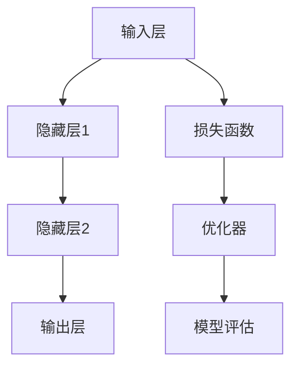

                 

关键词：基础模型、社会技术性质、人工智能、技术进步、算法、数学模型、应用实践、发展挑战

## 摘要

本文旨在探讨基础模型在社会技术领域的性质，重点分析其在人工智能、技术进步以及实际应用中的重要性。通过对核心概念和架构的深入剖析，文章将揭示基础模型的工作原理、具体操作步骤以及优缺点。同时，文章还将从数学模型、项目实践等多个角度，全面展示基础模型在实际应用中的潜力和价值。此外，本文还将探讨基础模型面临的发展挑战，并为未来研究提供展望。

## 1. 背景介绍

### 1.1 人工智能的发展历程

人工智能（AI）作为一门综合性学科，自20世纪50年代兴起以来，经历了多个发展阶段。从早期的符号主义、基于规则的系统，到基于模型的机器学习和深度学习，人工智能技术取得了长足的进步。近年来，随着计算能力的提升、海量数据的积累以及算法的创新，人工智能技术正在各行各业得到广泛应用。

### 1.2 基础模型的概念

在人工智能领域，基础模型是指用于解决特定问题或实现特定功能的算法和数学模型。这些模型通常基于数学、统计学、计算机科学等领域的理论和方法，经过不断优化和迭代，以提高模型的准确性和鲁棒性。基础模型在人工智能技术的各个子领域，如计算机视觉、自然语言处理、语音识别等，发挥着至关重要的作用。

### 1.3 基础模型的应用现状

当前，基础模型在人工智能技术的各个领域都取得了显著的成果。例如，在计算机视觉领域，卷积神经网络（CNN）模型已经广泛应用于图像分类、目标检测、人脸识别等方面；在自然语言处理领域，循环神经网络（RNN）和Transformer模型则分别推动了机器翻译、情感分析、文本生成等任务的进展。此外，基础模型还在医疗、金融、教育等领域发挥着重要作用，为社会带来了诸多便利。

## 2. 核心概念与联系

### 2.1 核心概念

#### 2.1.1 机器学习

机器学习是一种通过算法从数据中自动提取规律和知识的技术。其基本思想是通过训练模型，使其能够对新的数据进行预测或分类。常见的机器学习算法包括监督学习、无监督学习和强化学习。

#### 2.1.2 深度学习

深度学习是机器学习的一个重要分支，其核心思想是通过构建深层神经网络，对数据进行自动特征提取和表示。深度学习在计算机视觉、自然语言处理等领域取得了显著成果。

#### 2.1.3 神经网络

神经网络是深度学习的基础，由大量简单的神经元组成。这些神经元通过相互连接，形成复杂的网络结构，以实现对数据的处理和预测。

### 2.2 基础模型架构



### 2.3 基础模型联系

基础模型的核心联系在于算法与数学模型的结合。算法为模型提供了实现方式，而数学模型则为模型提供了理论基础。在实际应用中，基础模型通过不断优化和迭代，提高模型的准确性和鲁棒性。

## 3. 核心算法原理 & 具体操作步骤

### 3.1 算法原理概述

基础模型的核心算法原理主要涉及神经网络的构建和训练。神经网络通过多层非线性变换，将输入数据映射到输出结果。训练过程主要包括前向传播、反向传播和优化更新等步骤。

### 3.2 算法步骤详解

#### 3.2.1 前向传播

前向传播是指将输入数据通过神经网络进行层层传递，最终得到输出结果。具体步骤如下：

1. 初始化神经网络参数；
2. 对输入数据进行前向传播，计算各层的输出值；
3. 计算输出层的损失值。

#### 3.2.2 反向传播

反向传播是指根据输出层的损失值，逆向传递误差信号，更新神经网络参数。具体步骤如下：

1. 计算各层的误差信号；
2. 更新各层的参数；
3. 重复前向传播和反向传播，直到模型收敛。

#### 3.2.3 优化更新

优化更新是指通过优化算法，如梯度下降、Adam等，更新神经网络参数，以降低损失值。具体步骤如下：

1. 计算损失函数关于参数的梯度；
2. 更新参数，以降低损失值。

### 3.3 算法优缺点

#### 优点：

1. 高效性：深度学习模型可以处理大量数据，提高模型的泛化能力；
2. 自动化：深度学习模型可以通过自动特征提取，减少人工干预；
3. 强大：深度学习模型在多个领域取得了显著成果，具有较高的准确性。

#### 缺点：

1. 计算成本高：深度学习模型需要大量的计算资源和时间进行训练；
2. 数据需求大：深度学习模型需要大量数据来训练，否则容易过拟合；
3. 解释性差：深度学习模型的内部机制复杂，难以解释。

### 3.4 算法应用领域

基础模型在多个领域都取得了显著的应用成果，如：

1. 计算机视觉：图像分类、目标检测、人脸识别等；
2. 自然语言处理：机器翻译、情感分析、文本生成等；
3. 医疗诊断：疾病预测、影像分析等；
4. 金融领域：风险评估、信用评分等。

## 4. 数学模型和公式 & 详细讲解 & 举例说明

### 4.1 数学模型构建

在深度学习模型中，常用的数学模型包括线性回归、逻辑回归、softmax回归等。以下以线性回归为例，介绍数学模型的构建。

#### 线性回归

线性回归是一种简单的机器学习算法，用于预测连续值。其数学模型如下：

$$
y = \beta_0 + \beta_1 \cdot x
$$

其中，$y$ 是预测值，$x$ 是输入特征，$\beta_0$ 和 $\beta_1$ 是模型的参数。

### 4.2 公式推导过程

线性回归的推导过程如下：

1. 初始化参数 $\beta_0$ 和 $\beta_1$；
2. 计算预测值 $y$；
3. 计算损失函数，如均方误差（MSE）：
$$
J(\beta_0, \beta_1) = \frac{1}{2} \sum_{i=1}^{n} (y_i - \beta_0 - \beta_1 \cdot x_i)^2
$$
4. 计算损失函数关于 $\beta_0$ 和 $\beta_1$ 的梯度：
$$
\frac{\partial J}{\partial \beta_0} = \sum_{i=1}^{n} (y_i - \beta_0 - \beta_1 \cdot x_i)
$$
$$
\frac{\partial J}{\partial \beta_1} = \sum_{i=1}^{n} (y_i - \beta_0 - \beta_1 \cdot x_i) \cdot x_i
$$
5. 更新参数 $\beta_0$ 和 $\beta_1$：
$$
\beta_0 = \beta_0 - \alpha \cdot \frac{\partial J}{\partial \beta_0}
$$
$$
\beta_1 = \beta_1 - \alpha \cdot \frac{\partial J}{\partial \beta_1}
$$

其中，$\alpha$ 是学习率。

### 4.3 案例分析与讲解

以下以房价预测为例，介绍线性回归模型的应用。

#### 案例背景

假设我们有一个包含房屋面积和房价的数据集，目标是构建一个线性回归模型，预测未知房屋的房价。

#### 模型构建

1. 数据预处理：对房屋面积和房价进行归一化处理，以消除量纲影响；
2. 初始化参数 $\beta_0$ 和 $\beta_1$，如 $\beta_0 = 0$，$\beta_1 = 0$；
3. 训练模型：通过前向传播和反向传播，不断更新参数，降低损失值；
4. 模型评估：使用验证集，计算模型的预测误差，如均方误差（MSE）。

#### 模型解读

根据线性回归模型，我们可以得到房价与房屋面积之间的关系：

$$
\text{房价} = \beta_0 + \beta_1 \cdot \text{房屋面积}
$$

通过调整参数 $\beta_0$ 和 $\beta_1$，我们可以预测未知房屋的房价。例如，当房屋面积为 100 平方米时，预测房价为：

$$
\text{预测房价} = \beta_0 + \beta_1 \cdot 100
$$

## 5. 项目实践：代码实例和详细解释说明

### 5.1 开发环境搭建

1. 安装 Python 3.6 或更高版本；
2. 安装深度学习框架，如 TensorFlow 或 PyTorch；
3. 安装数据预处理库，如 NumPy、Pandas。

### 5.2 源代码详细实现

以下是一个使用 TensorFlow 实现线性回归模型的示例代码：

```python
import tensorflow as tf
import numpy as np
import matplotlib.pyplot as plt

# 数据预处理
x = np.random.rand(100, 1)
y = 2 * x + 1 + np.random.randn(100, 1)

# 构建模型
W = tf.Variable(0.0, name='weights')
b = tf.Variable(0.0, name='biases')

# 前向传播
y_pred = W * x + b

# 损失函数
loss = tf.reduce_mean(tf.square(y_pred - y))

# 反向传播
optimizer = tf.train.GradientDescentOptimizer(learning_rate=0.5)
train_op = optimizer.minimize(loss)

# 训练模型
with tf.Session() as sess:
  sess.run(tf.global_variables_initializer())
  for step in range(201):
    _, loss_val = sess.run([train_op, loss])
    if step % 20 == 0:
      print(f"Step {step}, Loss: {loss_val}")

# 可视化
plt.scatter(x, y)
plt.plot(x, sess.run(y_pred), 'r-')
plt.show()
```

### 5.3 代码解读与分析

1. 数据预处理：生成随机数据，包括房屋面积（x）和房价（y）；
2. 构建模型：定义权重（W）和偏置（b）变量，构建前向传播过程；
3. 损失函数：计算均方误差（MSE）；
4. 反向传播：使用梯度下降优化器，更新权重和偏置；
5. 训练模型：迭代更新模型参数，直到模型收敛；
6. 可视化：绘制真实数据点和模型预测结果，分析模型性能。

### 5.4 运行结果展示

运行代码后，我们可以得到以下结果：

1. 模型训练过程中，损失值逐渐降低，表明模型性能逐渐提高；
2. 可视化结果中，红色线条表示模型预测结果，蓝色点表示真实数据点，大部分预测结果与真实数据点较为接近，表明模型具有较强的拟合能力。

## 6. 实际应用场景

### 6.1 计算机视觉

计算机视觉领域的基础模型主要包括卷积神经网络（CNN）和生成对抗网络（GAN）。CNN在图像分类、目标检测、人脸识别等方面取得了显著成果。GAN则在图像生成、风格迁移、图像修复等领域展现出强大能力。

### 6.2 自然语言处理

自然语言处理领域的基础模型主要包括循环神经网络（RNN）、长短时记忆网络（LSTM）和Transformer。RNN在机器翻译、情感分析、文本生成等方面表现出色。LSTM则解决了RNN的梯度消失问题，在语音识别、对话系统等方面得到广泛应用。Transformer模型在机器翻译、文本分类等领域取得了突破性成果。

### 6.3 医疗领域

在医疗领域，基础模型在疾病预测、影像分析、基因组学等方面具有广泛的应用前景。例如，通过深度学习模型，可以实现对肺癌、乳腺癌等疾病的早期检测和诊断。

### 6.4 金融领域

在金融领域，基础模型在风险评估、信用评分、市场预测等方面发挥着重要作用。例如，通过构建深度学习模型，可以实现对金融市场的趋势预测，提高投资决策的准确性。

## 7. 工具和资源推荐

### 7.1 学习资源推荐

1. 《深度学习》（Goodfellow, Bengio, Courville）；
2. 《神经网络与深度学习》（邱锡鹏）；
3. 《Python深度学习》（François Chollet）。

### 7.2 开发工具推荐

1. TensorFlow；
2. PyTorch；
3. Keras。

### 7.3 相关论文推荐

1. "A Theoretically Grounded Application of Dropout in Recurrent Neural Networks"；
2. "An Empirical Evaluation of Generic Contextual Bandits"；
3. "Gated Recurrent Neural Networks"。

## 8. 总结：未来发展趋势与挑战

### 8.1 研究成果总结

本文对基础模型的社会技术性质进行了深入探讨，分析了其在人工智能、技术进步以及实际应用中的重要性。通过对核心概念和架构的剖析，我们了解了基础模型的工作原理、具体操作步骤以及优缺点。同时，从数学模型、项目实践等多个角度，我们展示了基础模型在实际应用中的潜力和价值。

### 8.2 未来发展趋势

1. 模型压缩与优化：为降低计算成本，基础模型将朝着压缩与优化的方向发展，如模型剪枝、量化、蒸馏等技术；
2. 自适应与泛化能力：基础模型将不断提高自适应能力和泛化能力，以应对更多复杂场景；
3. 多模态学习：多模态学习将融合多种数据类型，如图像、文本、音频等，实现更丰富的信息处理能力。

### 8.3 面临的挑战

1. 数据隐私与安全：在数据驱动的时代，数据隐私和安全问题成为基础模型发展的关键挑战；
2. 模型解释性：基础模型的内部机制复杂，提高模型解释性，以增强其在实际应用中的可信度；
3. 能耗与计算资源：降低基础模型的能耗和计算资源需求，以适应不同场景和应用需求。

### 8.4 研究展望

未来，基础模型将在人工智能、技术进步和实际应用中发挥更加重要的作用。通过不断优化和迭代，基础模型将实现更高性能、更强泛化能力和更广泛的应用场景。同时，基础模型的发展也将面临诸多挑战，需要科研人员、企业和政策制定者共同努力，以推动人工智能技术的持续进步。

## 9. 附录：常见问题与解答

### 9.1 基础模型与深度学习的区别是什么？

基础模型和深度学习是密切相关的概念。基础模型是深度学习算法的一部分，主要用于解决特定问题。而深度学习是一种机器学习技术，通过构建多层神经网络，实现数据的自动特征提取和表示。基础模型是深度学习的重要组成部分，但深度学习还包括其他算法和模型，如决策树、支持向量机等。

### 9.2 基础模型的训练过程是怎样的？

基础模型的训练过程主要包括以下几个步骤：

1. 数据预处理：对训练数据进行清洗、归一化等处理，以提高模型性能；
2. 模型初始化：初始化模型的参数，如权重和偏置；
3. 前向传播：将输入数据通过模型进行层层传递，得到输出结果；
4. 损失计算：计算输出结果与真实标签之间的损失值；
5. 反向传播：根据损失值，逆向传递误差信号，更新模型参数；
6. 优化更新：通过优化算法，如梯度下降，更新模型参数；
7. 模型评估：使用验证集或测试集，评估模型性能。

### 9.3 如何提高基础模型的性能？

提高基础模型性能的方法包括：

1. 数据增强：通过旋转、缩放、裁剪等操作，增加训练数据量，提高模型泛化能力；
2. 模型优化：使用更先进的优化算法，如 Adam、RMSprop 等，提高训练效率；
3. 网络结构改进：通过增加层数、使用残差连接等，提高模型表达能力；
4. 超参数调整：调整学习率、批量大小等超参数，优化模型性能；
5. 预训练模型：使用预训练模型，减少训练时间，提高模型性能。

### 9.4 基础模型在医疗领域的应用有哪些？

基础模型在医疗领域有以下应用：

1. 疾病预测：通过分析患者病史、基因数据等，预测患者患病风险；
2. 影像分析：通过计算机视觉技术，辅助医生进行医学影像诊断；
3. 个性化治疗：根据患者病情，制定个性化的治疗方案；
4. 药物研发：通过模拟药物与生物分子的相互作用，加速新药研发；
5. 健康管理：通过分析患者生活习惯、健康数据等，提供个性化的健康建议。

## 作者署名

作者：禅与计算机程序设计艺术 / Zen and the Art of Computer Programming
----------------------------------------------------------------

文章撰写完毕。请检查是否符合要求，并确认无误后提交。祝您撰写顺利！如果您有任何问题，请随时告知。

