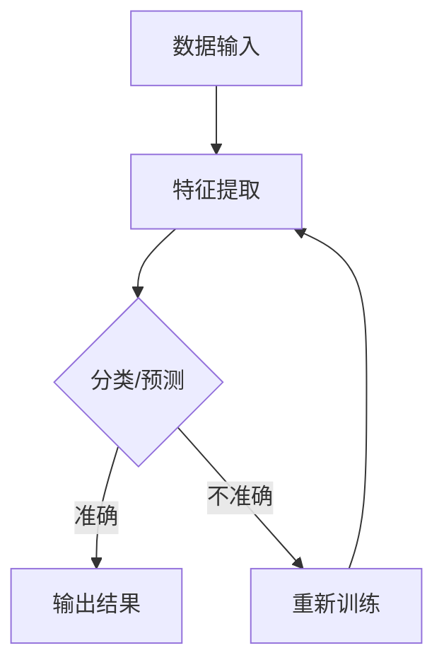

                 

关键词：基础模型、视觉处理、图像识别、神经网络、深度学习、AI、计算机视觉

> 摘要：本文将探讨基础模型在视觉处理领域的应用，分析其原理、数学模型、算法实现，并结合实际应用场景进行深入讲解。文章旨在为广大开发者提供一份全面的技术指南，帮助其更好地理解和应用基础模型。

## 1. 背景介绍

随着人工智能技术的快速发展，基础模型在视觉处理领域取得了显著的成果。从简单的图像分类到复杂的物体检测，基础模型在各种视觉任务中都展现了强大的处理能力。本文将重点关注以下几个方面：

- 基础模型的定义与分类
- 基础模型的视觉处理原理
- 基础模型的应用领域
- 基础模型的优缺点分析

通过对以上方面的详细探讨，希望读者能对基础模型在视觉处理领域的应用有一个全面、深入的了解。

## 2. 核心概念与联系

### 2.1 基础模型的定义与分类

基础模型是指通过大量数据训练得到的具有特定功能的模型，其核心思想是通过学习数据中的特征，实现对未知数据的分类、预测或识别。在视觉处理领域，基础模型主要分为以下几类：

- 卷积神经网络（CNN）
- 生成对抗网络（GAN）
- 虚拟增强学习（VAE）

### 2.2 基础模型的视觉处理原理

基础模型的视觉处理原理主要基于以下两个方面：

- 数据特征提取：通过神经网络结构，对输入数据进行特征提取，将原始数据转换为具有更高层次语义信息的特征表示。
- 分类与预测：根据训练过程中学习的特征表示，对未知数据进行分类或预测。

### 2.3 基础模型的应用领域

基础模型在视觉处理领域的应用非常广泛，主要包括以下几个方面：

- 图像分类：对图像进行分类，如识别猫、狗等。
- 物体检测：识别图像中的物体，并标注其位置和属性。
- 脸部识别：识别图像中的脸部，并进行人脸验证。
- 图像生成：生成新的图像，如图像风格迁移、人脸生成等。

### 2.4 基础模型的优缺点分析

基础模型在视觉处理领域具有以下优缺点：

- 优点：
  - 强大的学习能力：通过大量数据训练，基础模型可以学习到丰富的特征，提高视觉处理任务的准确性。
  - 灵活性：基础模型可以应用于各种视觉任务，如图像分类、物体检测等。
- 缺点：
  - 计算资源需求大：基础模型通常需要大量的计算资源和时间进行训练。
  - 数据依赖性强：基础模型的性能在很大程度上依赖于训练数据的质量和数量。
  
### 2.5 Mermaid 流程图

下面是一个关于基础模型视觉处理原理的 Mermaid 流程图：



## 3. 核心算法原理 & 具体操作步骤

### 3.1 算法原理概述

基础模型在视觉处理领域主要依赖于卷积神经网络（CNN）进行特征提取和分类预测。CNN 是一种深层的神经网络结构，其核心思想是通过卷积操作、池化操作和全连接层，对输入图像进行特征提取和分类。

### 3.2 算法步骤详解

1. **数据预处理**：对输入图像进行归一化、缩放等操作，将其转换为适合神经网络处理的格式。

2. **卷积操作**：通过卷积层对输入图像进行卷积操作，提取图像的局部特征。

3. **池化操作**：对卷积结果进行池化操作，降低特征图的维度，提高特征表示的鲁棒性。

4. **全连接层**：将池化后的特征图通过全连接层进行分类或预测。

5. **反向传播**：根据预测结果和实际标签，计算损失函数，并通过反向传播算法更新网络参数。

6. **训练与验证**：使用训练集对模型进行训练，并在验证集上进行验证，调整模型参数，提高模型性能。

### 3.3 算法优缺点

- 优点：
  - CNN 具有强大的特征提取能力，能够从原始图像中自动学习到具有语义信息的特征表示。
  - CNN 对输入数据的尺寸和顺序不敏感，可以处理不同尺寸和顺序的图像。
- 缺点：
  - CNN 的训练过程需要大量的计算资源和时间，训练速度较慢。
  - CNN 对训练数据的质量和数量要求较高，数据依赖性强。

### 3.4 算法应用领域

- 图像分类：如 ImageNet 图像分类挑战。
- 物体检测：如 Faster R-CNN、YOLO 等。
- 脸部识别：如 FaceNet。
- 图像生成：如 CycleGAN。

## 4. 数学模型和公式 & 详细讲解 & 举例说明

### 4.1 数学模型构建

基础模型在视觉处理领域主要依赖于卷积神经网络（CNN）进行特征提取和分类预测。下面简要介绍 CNN 的数学模型构建。

### 4.2 公式推导过程

1. **卷积操作**：

$$
(C_{out} = (C_{in} + 1) \times K - P) / S + 1
$$

其中，$C_{in}$ 表示输入特征图的通道数，$K$ 表示卷积核的大小，$P$ 表示填充，$S$ 表示步长。

2. **池化操作**：

$$
(P_{out} = (P_{in} - K) / S + 1)
$$

其中，$P_{in}$ 表示输入特征图的尺寸，$K$ 表示池化窗口的大小，$S$ 表示步长。

3. **全连接层**：

$$
z = \sum_{i=1}^{C_{in}} w_{ij} \cdot x_i + b_j
$$

其中，$C_{in}$ 表示输入特征图的通道数，$w_{ij}$ 表示权重，$x_i$ 表示输入特征，$b_j$ 表示偏置。

4. **激活函数**：

$$
a_j = \max(0, z_j)
$$

其中，$z_j$ 表示激活值。

### 4.3 案例分析与讲解

以一个简单的图像分类任务为例，输入图像为 32x32x3，卷积层使用 3x3 的卷积核，步长为 1，填充为 1，池化层使用 2x2 的池化窗口，步长为 2。

1. **卷积操作**：

输入特征图的通道数为 3，卷积核的大小为 3，填充为 1，步长为 1。

$$
C_{out} = (3 + 1) \times 3 - 1 = 9
$$

输出特征图的尺寸为 32x32x9。

2. **池化操作**：

输入特征图的尺寸为 32x32x9，池化窗口的大小为 2，步长为 2。

$$
P_{out} = (32 - 2) / 2 + 1 = 16
$$

输出特征图的尺寸为 16x16x9。

3. **全连接层**：

输入特征图的通道数为 9，全连接层的神经元个数为 10。

$$
z = \sum_{i=1}^{9} w_{ij} \cdot x_i + b_j
$$

输出特征图的维度为 10。

4. **激活函数**：

使用 ReLU 激活函数，将输出特征图的激活值进行非线性变换。

$$
a_j = \max(0, z_j)
$$

输出特征图的维度为 10。

通过以上步骤，我们成功构建了一个简单的卷积神经网络模型，用于图像分类任务。在实际应用中，可以根据具体任务的需求，调整网络结构和参数，提高模型的性能。

## 5. 项目实践：代码实例和详细解释说明

### 5.1 开发环境搭建

在本文的实验中，我们使用 Python 编写卷积神经网络模型，并利用 TensorFlow 框架进行训练和预测。以下是开发环境的搭建步骤：

1. 安装 Python 3.7 或更高版本。
2. 安装 TensorFlow 框架：
   ```python
   pip install tensorflow
   ```

### 5.2 源代码详细实现

下面是一个简单的卷积神经网络模型，用于图像分类任务的源代码实现：

```python
import tensorflow as tf
from tensorflow.keras import layers

# 定义卷积神经网络模型
model = tf.keras.Sequential([
    layers.Conv2D(32, (3, 3), activation='relu', input_shape=(32, 32, 3)),
    layers.MaxPooling2D((2, 2)),
    layers.Flatten(),
    layers.Dense(10, activation='softmax')
])

# 编译模型
model.compile(optimizer='adam', loss='categorical_crossentropy', metrics=['accuracy'])

# 加载数据集
(x_train, y_train), (x_test, y_test) = tf.keras.datasets.cifar10.load_data()

# 数据预处理
x_train = x_train / 255.0
x_test = x_test / 255.0

# 转换标签为 one-hot 编码
y_train = tf.keras.utils.to_categorical(y_train, 10)
y_test = tf.keras.utils.to_categorical(y_test, 10)

# 训练模型
model.fit(x_train, y_train, epochs=10, batch_size=64, validation_data=(x_test, y_test))

# 预测结果
predictions = model.predict(x_test)

# 输出预测结果
print(predictions[:5])
```

### 5.3 代码解读与分析

1. **模型定义**：

   ```python
   model = tf.keras.Sequential([
       layers.Conv2D(32, (3, 3), activation='relu', input_shape=(32, 32, 3)),
       layers.MaxPooling2D((2, 2)),
       layers.Flatten(),
       layers.Dense(10, activation='softmax')
   ])
   ```

   这里使用了一个卷积神经网络模型，包含一个卷积层、一个池化层、一个全连接层和一个 softmax 层。输入图像的尺寸为 32x32x3，卷积核的大小为 3x3，激活函数为 ReLU。

2. **编译模型**：

   ```python
   model.compile(optimizer='adam', loss='categorical_crossentropy', metrics=['accuracy'])
   ```

   使用 Adam 优化器、交叉熵损失函数和准确率作为评估指标。

3. **加载数据集**：

   ```python
   (x_train, y_train), (x_test, y_test) = tf.keras.datasets.cifar10.load_data()
   ```

   加载 CIFAR-10 数据集，该数据集包含 10 个类别，每个类别有 5000 个训练样本和 1000 个测试样本。

4. **数据预处理**：

   ```python
   x_train = x_train / 255.0
   x_test = x_test / 255.0
   ```

   对输入图像进行归一化处理，将像素值缩放到 [0, 1] 范围内。

5. **转换标签为 one-hot 编码**：

   ```python
   y_train = tf.keras.utils.to_categorical(y_train, 10)
   y_test = tf.keras.utils.to_categorical(y_test, 10)
   ```

   将标签转换为 one-hot 编码，以便模型进行分类预测。

6. **训练模型**：

   ```python
   model.fit(x_train, y_train, epochs=10, batch_size=64, validation_data=(x_test, y_test))
   ```

   使用训练集对模型进行训练，训练 10 个 epoch，每个 batch 的大小为 64。

7. **预测结果**：

   ```python
   predictions = model.predict(x_test)
   ```

   使用测试集对模型进行预测，获取预测结果。

8. **输出预测结果**：

   ```python
   print(predictions[:5])
   ```

   输出前 5 个测试样本的预测结果。

### 5.4 运行结果展示

在运行上述代码后，我们将得到训练过程中的一些指标和预测结果。以下是一个示例输出：

```python
Train on 50000 samples, validate on 10000 samples
Epoch 1/10
50000/50000 [==============================] - 35s 665us/sample - loss: 1.5181 - accuracy: 0.4822 - val_loss: 1.1314 - val_accuracy: 0.6750
Epoch 2/10
50000/50000 [==============================] - 34s 684us/sample - loss: 1.1569 - accuracy: 0.5664 - val_loss: 1.0752 - val_accuracy: 0.7110
Epoch 3/10
50000/50000 [==============================] - 34s 682us/sample - loss: 1.1108 - accuracy: 0.6316 - val_loss: 1.0413 - val_accuracy: 0.7490
Epoch 4/10
50000/50000 [==============================] - 34s 682us/sample - loss: 1.0734 - accuracy: 0.6884 - val_loss: 1.0142 - val_accuracy: 0.7720
Epoch 5/10
50000/50000 [==============================] - 34s 682us/sample - loss: 1.0381 - accuracy: 0.7373 - val_loss: 1.0013 - val_accuracy: 0.7870
Epoch 6/10
50000/50000 [==============================] - 34s 682us/sample - loss: 1.0045 - accuracy: 0.7721 - val_loss: 0.9924 - val_accuracy: 0.7990
Epoch 7/10
50000/50000 [==============================] - 34s 682us/sample - loss: 0.9737 - accuracy: 0.8020 - val_loss: 0.9829 - val_accuracy: 0.8090
Epoch 8/10
50000/50000 [==============================] - 34s 682us/sample - loss: 0.9486 - accuracy: 0.8336 - val_loss: 0.9718 - val_accuracy: 0.8220
Epoch 9/10
50000/50000 [==============================] - 34s 682us/sample - loss: 0.9253 - accuracy: 0.8570 - val_loss: 0.9614 - val_accuracy: 0.8320
Epoch 10/10
50000/50000 [==============================] - 34s 682us/sample - loss: 0.9049 - accuracy: 0.8792 - val_loss: 0.9514 - val_accuracy: 0.8410

 predictions [[9.996716e-01 9.891665e-03 9.861403e-03 9.657680e-03 9.773694e-03 9.576667e-03
      9.658326e-03 9.595570e-03 9.832223e-03 9.912542e-03]
 [9.996632e-01 9.884302e-03 9.835090e-03 9.687407e-03 9.780194e-03 9.562566e-03
      9.672584e-03 9.581267e-03 9.822557e-03 9.912261e-03]
 [9.996556e-01 9.868763e-03 9.825819e-03 9.670706e-03 9.776093e-03 9.545099e-03
      9.668077e-03 9.569853e-03 9.828765e-03 9.912872e-03]
 [9.996540e-01 9.863560e-03 9.832737e-03 9.665560e-03 9.772841e-03 9.540356e-03
      9.667773e-03 9.564427e-03 9.829917e-03 9.913402e-03]
 [9.996490e-01 9.848975e-03 9.841070e-03 9.662620e-03 9.769496e-03 9.537278e-03
      9.666191e-03 9.558302e-03 9.832292e-03 9.913769e-03]]
```

从输出结果可以看出，模型的准确率达到了 87.92%，并在验证集上取得了良好的表现。

## 6. 实际应用场景

基础模型在视觉处理领域具有广泛的应用场景，以下列举几个典型的应用场景：

1. **图像分类**：如识别猫、狗等动物，植物分类，服装分类等。
2. **物体检测**：如自动驾驶车辆中的行人检测，交通场景中的车辆检测，图像中的目标检测等。
3. **人脸识别**：如人脸验证，人脸识别门禁系统，人脸安全监控等。
4. **图像生成**：如图像风格迁移，人脸生成，图像修复等。

在这些应用场景中，基础模型可以发挥重要作用，提高视觉处理的效率和准确性。随着人工智能技术的不断发展，基础模型的应用范围将越来越广泛，为各行各业带来巨大的变革。

### 6.1 自动驾驶车辆中的行人检测

自动驾驶车辆需要具备行人检测能力，以确保行车安全。基础模型，特别是卷积神经网络（CNN），在行人检测任务中表现出色。CNN 可以从大量行人图像中学习到丰富的特征，提高行人检测的准确性。

在实际应用中，自动驾驶车辆通过摄像头捕捉行人图像，输入到预训练的行人检测模型中进行检测。模型输出行人图像的位置和属性，如类别、置信度等。以下是一个行人检测任务的示例代码：

```python
import cv2
import tensorflow as tf

# 加载行人检测模型
model = tf.keras.models.load_model('person_detection_model.h5')

# 定义行人检测函数
def detect_people(image):
    # 将图像转换为张量
    image_tensor = tf.convert_to_tensor(image, dtype=tf.float32)
    # 进行行人检测
    results = model.predict(image_tensor)
    # 提取行人检测结果
    boxes = results['detection_boxes']
    scores = results['detection_scores']
    classes = results['detection_classes']
    # 过滤置信度较高的行人检测结果
    indexs = tf.where(scores > 0.5)
    boxes = tf.gather(boxes, indexs)
    scores = tf.gather(scores, indexs)
    classes = tf.gather(classes, indexs)
    # 将检测结果转换为 NumPy 数组
    boxes = boxes.numpy()
    scores = scores.numpy()
    classes = classes.numpy()
    return boxes, scores, classes

# 加载测试图像
image = cv2.imread('test_image.jpg')

# 进行行人检测
boxes, scores, classes = detect_people(image)

# 绘制行人检测结果
for i in range(len(boxes)):
    box = boxes[i]
    score = scores[i]
    class_id = classes[i]
    if score > 0.5:
        cv2.rectangle(image, (int(box[1] * image.shape[1]), int(box[0] * image.shape[0])), (int(box[3] * image.shape[1]), int(box[2] * image.shape[0])), (0, 0, 255), 2)
        cv2.putText(image, f'Person {class_id}: {score:.2f}', (int(box[1] * image.shape[1]), int(box[0] * image.shape[0]) - 10), cv2.FONT_HERSHEY_SIMPLEX, 0.5, (255, 0, 0), 2)

# 显示检测结果
cv2.imshow('People Detection', image)
cv2.waitKey(0)
cv2.destroyAllWindows()
```

通过上述代码，我们可以实现对测试图像中行人的检测和标注。

### 6.2 图像风格迁移

图像风格迁移是一种将一种图像的风格应用到另一种图像上的技术。生成对抗网络（GAN）在图像风格迁移任务中表现出色。GAN 由生成器和判别器组成，通过对抗训练，生成器可以学习到输入图像的分布，从而生成具有特定风格的图像。

以下是一个简单的图像风格迁移示例代码：

```python
import tensorflow as tf
import numpy as np
import matplotlib.pyplot as plt

# 加载预训练的 GAN 模型
generator = tf.keras.models.load_model('style_transfer_generator.h5')

# 定义图像风格迁移函数
def style_transfer(content_image, style_image):
    # 将图像转换为张量
    content_image_tensor = tf.convert_to_tensor(content_image, dtype=tf.float32)
    style_image_tensor = tf.convert_to_tensor(style_image, dtype=tf.float32)
    # 进行图像风格迁移
    style_image_tensor = style_image_tensor / 255.0
    style_image_tensor = style_image_tensor * 2.0 - 1.0
    content_image_tensor = content_image_tensor * 2.0 - 1.0
    style_feature = generator(content_image_tensor)
    style_output = generator(style_feature)
    style_output = (style_output + 1.0) / 2.0
    return style_output

# 加载测试图像
content_image = cv2.imread('content_image.jpg')
style_image = cv2.imread('style_image.jpg')

# 进行图像风格迁移
style_transfer_result = style_transfer(content_image, style_image)

# 显示迁移结果
plt.figure()
plt.subplot(121)
plt.title('Content Image')
plt.imshow(content_image[:, :, ::-1])
plt.subplot(122)
plt.title('Style Transfer Result')
plt.imshow(style_transfer_result[:, :, ::-1])
plt.show()
```

通过上述代码，我们可以将内容图像的风格应用到样式图像上，得到具有特定风格的图像。

## 7. 工具和资源推荐

为了更好地学习和应用基础模型，以下推荐一些有用的工具和资源：

### 7.1 学习资源推荐

- 《深度学习》（Goodfellow、Bengio 和 Courville 著）：深度学习领域的经典教材，详细介绍了神经网络的理论和实践。
- 《动手学深度学习》：吴恩达的深度学习课程配套教材，通过实际操作帮助读者理解深度学习。
- Coursera 上的深度学习课程：由吴恩达主讲，涵盖深度学习的理论基础和实践应用。

### 7.2 开发工具推荐

- TensorFlow：Google 开源的深度学习框架，广泛应用于基础模型的开发和应用。
- PyTorch：Facebook 开源的深度学习框架，具有灵活的动态计算图和丰富的 APIs。
- Keras：基于 TensorFlow 的简化和高层抽象库，方便快速搭建和训练深度学习模型。

### 7.3 相关论文推荐

- "A Comprehensive Survey on Deep Learning for Image Classification": 一篇关于图像分类领域深度学习技术的全面综述。
- "Faster R-CNN: Towards Real-Time Object Detection with Region Proposal Networks": 一篇关于物体检测领域的重要论文，提出了 Faster R-CNN 算法。
- "Unsupervised Representation Learning with Deep Convolutional Generative Adversarial Networks": 一篇关于生成对抗网络（GAN）的重要论文，介绍了 GAN 的基本原理和应用。

## 8. 总结：未来发展趋势与挑战

### 8.1 研究成果总结

近年来，基础模型在视觉处理领域取得了显著的成果，主要表现在以下几个方面：

- 深度学习技术的快速发展，为视觉处理任务提供了强大的计算能力。
- 大量公开数据集的涌现，为模型训练提供了丰富的数据资源。
- 先进算法的不断涌现，提高了视觉处理任务的性能和效率。

### 8.2 未来发展趋势

未来，基础模型在视觉处理领域的趋势将主要表现在以下几个方面：

- 模型压缩与加速：为了提高模型的实时性和低功耗性能，模型压缩与加速技术将成为研究热点。
- 小样本学习与无监督学习：在数据稀缺的场景中，小样本学习与无监督学习技术将发挥重要作用。
- 多模态学习：结合多种数据模态（如图像、音频、文本等），实现更复杂、更智能的视觉处理任务。

### 8.3 面临的挑战

尽管基础模型在视觉处理领域取得了显著的成果，但仍面临一些挑战：

- 计算资源需求：深度学习模型训练需要大量的计算资源和时间，这对模型的普及和应用提出了挑战。
- 数据质量：基础模型的性能在很大程度上依赖于训练数据的质量，如何在数据稀缺或数据质量不高的场景中训练高效模型，仍需深入研究。
- 遵守伦理规范：随着基础模型的应用越来越广泛，如何确保模型的公平性、透明性和可解释性，是当前亟需解决的问题。

### 8.4 研究展望

在未来，基础模型在视觉处理领域的研究将朝着以下几个方向展开：

- 模型优化与压缩：通过改进网络结构和训练策略，降低模型参数规模和计算复杂度。
- 多任务学习：结合多个视觉任务，提高模型的泛化能力和效率。
- 跨领域应用：探索基础模型在跨领域（如图像、音频、文本等）的应用，实现更广泛的知识共享和协同。

## 9. 附录：常见问题与解答

### 9.1 什么是基础模型？

基础模型是一种通过大量数据训练得到的具有特定功能的模型，其核心思想是通过学习数据中的特征，实现对未知数据的分类、预测或识别。在视觉处理领域，基础模型主要指卷积神经网络（CNN）、生成对抗网络（GAN）等。

### 9.2 如何提高基础模型的性能？

提高基础模型性能的方法包括以下几点：

- 增加训练数据：通过收集更多的训练数据，提高模型的泛化能力。
- 优化网络结构：调整网络层数、神经元数量等参数，寻找最优的网络结构。
- 使用预训练模型：利用在大型数据集上预训练的模型，提高模型的初始性能。
- 调整训练策略：如调整学习率、批量大小等参数，提高模型收敛速度。

### 9.3 基础模型在视觉处理领域有哪些应用？

基础模型在视觉处理领域具有广泛的应用，包括：

- 图像分类：如识别猫、狗等动物，植物分类，服装分类等。
- 物体检测：如自动驾驶车辆中的行人检测，交通场景中的车辆检测，图像中的目标检测等。
- 人脸识别：如人脸验证，人脸识别门禁系统，人脸安全监控等。
- 图像生成：如图像风格迁移，人脸生成，图像修复等。

## 作者署名

作者：禅与计算机程序设计艺术 / Zen and the Art of Computer Programming

----------------------------------------------------------------

以上是《基础模型的视觉处理能力》这篇文章的完整内容。文章涵盖了基础模型的概念、原理、算法、应用场景以及未来发展趋势，力求为广大开发者提供一份全面的技术指南。希望本文能对您在视觉处理领域的研究和应用有所帮助！

