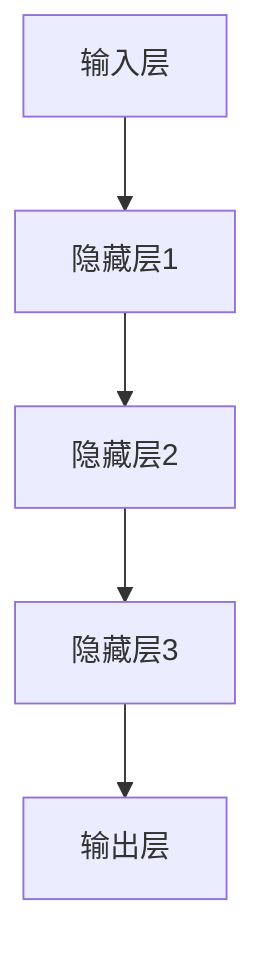

                 

关键词：基础模型、部署、社会影响、技术进步、人工智能、机器学习

摘要：本文将探讨基础模型在人工智能领域的部署及其对社会产生的广泛影响。我们将首先介绍基础模型的概念及其重要性，然后深入分析部署过程中的关键步骤、技术挑战和解决方案。接下来，我们将探讨基础模型对社会带来的变革性影响，包括教育、医疗、金融和国家安全等领域。最后，我们将讨论未来发展趋势以及面临的挑战。

## 1. 背景介绍

在人工智能（AI）和机器学习（ML）的快速发展下，基础模型已经成为现代计算的核心。基础模型是一类强大的算法，能够自动从大量数据中学习并提取有用的特征。这些模型不仅在学术界受到高度关注，还在工业界得到了广泛应用。从自然语言处理（NLP）到计算机视觉（CV），从推荐系统到游戏AI，基础模型的应用无处不在。

然而，基础模型的部署并非易事。部署过程中涉及到技术、资源、安全等多个方面，需要深入考虑和解决。此外，基础模型的部署对社会也产生了深远的影响，涉及隐私、道德和就业等问题。因此，本文旨在探讨基础模型的部署与社会影响，为相关领域的从业者提供参考。

## 2. 核心概念与联系

### 2.1 基础模型定义

基础模型是一类具有高度泛化能力的机器学习模型，能够从大规模数据中自动学习并提取特征。这些模型通常采用深度学习（DL）技术，如神经网络（NN），卷积神经网络（CNN）和循环神经网络（RNN）。基础模型的主要目标是在各种任务上实现高性能和高效性。

### 2.2 基础模型分类

基础模型可以按照应用领域进行分类，常见的有以下几类：

- 自然语言处理（NLP）：如BERT、GPT等
- 计算机视觉（CV）：如ResNet、VGG等
- 推荐系统：如ALS、LR等
- 强化学习（RL）：如DQN、A3C等

### 2.3 基础模型架构

基础模型的架构通常包括以下几个层次：

- 输入层：接收输入数据
- 隐藏层：进行特征提取和变换
- 输出层：生成预测结果

以下是基础模型架构的Mermaid流程图：



## 3. 核心算法原理 & 具体操作步骤

### 3.1 算法原理概述

基础模型的算法原理主要包括两部分：前向传播和反向传播。

- 前向传播：输入数据经过网络，通过每个隐藏层，最终得到输出结果。
- 反向传播：计算输出结果与实际结果之间的误差，并通过反向传播算法更新网络参数。

### 3.2 算法步骤详解

以下是基础模型的训练步骤：

1. 初始化网络参数
2. 前向传播：计算输入数据的输出结果
3. 计算损失函数值：衡量输出结果与实际结果之间的误差
4. 反向传播：计算每个参数的梯度
5. 更新网络参数：根据梯度进行参数调整
6. 重复步骤2-5，直到满足停止条件（如达到预设的迭代次数或损失函数值达到预设阈值）

### 3.3 算法优缺点

#### 优点：

- 高效性：基础模型能够自动从大规模数据中学习，具有高效的计算能力。
- 泛化能力：基础模型具有强大的泛化能力，可以在不同任务上实现高性能。
- 自动特征提取：基础模型能够自动提取输入数据中的有用特征，减少人工特征工程的工作量。

#### 缺点：

- 计算资源消耗：基础模型训练过程中需要大量计算资源和存储资源。
- 参数调优难度：基础模型的参数调优过程复杂，需要大量实验和经验。

### 3.4 算法应用领域

基础模型的应用领域广泛，以下是一些典型的应用场景：

- 自然语言处理：文本分类、情感分析、机器翻译等
- 计算机视觉：图像识别、目标检测、视频分析等
- 推荐系统：个性化推荐、商品推荐等
- 强化学习：游戏AI、自动驾驶等

## 4. 数学模型和公式 & 详细讲解 & 举例说明

### 4.1 数学模型构建

基础模型通常采用深度神经网络（DNN）作为数学模型。DNN由多个神经元层组成，包括输入层、隐藏层和输出层。每个神经元都与其他神经元相连，并通过权重和偏置进行参数调整。

### 4.2 公式推导过程

以下是DNN的前向传播和反向传播公式：

#### 前向传播：

1. 输入层到隐藏层的传播：
$$
a^{(l)} = \sigma(z^{(l)})
$$
其中，$a^{(l)}$为第$l$层的输出，$\sigma$为激活函数，$z^{(l)}$为第$l$层的输入。

2. 隐藏层到输出层的传播：
$$
y = \sigma(w^T a^{(L)})
$$
其中，$y$为输出结果，$w$为权重，$a^{(L)}$为输出层的输入。

#### 反向传播：

1. 输出层到隐藏层的传播：
$$
\delta^{(L)} = (y - \hat{y}) \odot \sigma'(z^{(L)})
$$
其中，$\delta^{(L)}$为输出层的误差，$\hat{y}$为预测结果，$\sigma'$为激活函数的导数。

2. 隐藏层到输入层的传播：
$$
\delta^{(l)} = (w^{(l+1)} \delta^{(l+1)})^T \odot \sigma'(z^{(l)})
$$
其中，$\delta^{(l)}$为第$l$层的误差。

### 4.3 案例分析与讲解

假设我们有一个二分类问题，输入数据为$(x_1, x_2)$，输出为$y$。我们采用一个单层神经网络进行模型训练。

#### 输入层到隐藏层的传播：

1. 输入层到隐藏层的权重：
$$
w_1 = \begin{bmatrix}
w_{11} & w_{12}
\end{bmatrix}
$$
2. 隐藏层输入：
$$
z_1 = x_1 w_{11} + x_2 w_{12} + b_1
$$
3. 隐藏层输出：
$$
a_1 = \sigma(z_1)
$$

#### 隐藏层到输出层的传播：

1. 隐藏层到输出层的权重：
$$
w_2 = \begin{bmatrix}
w_{21} & w_{22}
\end{bmatrix}
$$
2. 输出层输入：
$$
z_2 = a_1 w_{21} + b_2
$$
3. 输出层输出：
$$
y = \sigma(z_2)
$$

#### 损失函数：

我们采用均方误差（MSE）作为损失函数：
$$
J = \frac{1}{2} \sum_{i=1}^n (y_i - \hat{y}_i)^2
$$
其中，$y_i$为实际输出，$\hat{y}_i$为预测输出。

#### 反向传播：

1. 输出层误差：
$$
\delta_2 = (y - \hat{y}) \odot \sigma'(z_2)
$$
2. 隐藏层误差：
$$
\delta_1 = (w_2 \delta_2)^T \odot \sigma'(z_1)
$$

#### 参数更新：

1. 输入层到隐藏层的权重更新：
$$
w_1 \leftarrow w_1 - \alpha \frac{\partial J}{\partial w_1}
$$
2. 隐藏层到输出层的权重更新：
$$
w_2 \leftarrow w_2 - \alpha \frac{\partial J}{\partial w_2}
$$

其中，$\alpha$为学习率。

## 5. 项目实践：代码实例和详细解释说明

### 5.1 开发环境搭建

在本项目中，我们使用Python编程语言和TensorFlow库进行基础模型的开发。首先，我们需要安装TensorFlow：

```
pip install tensorflow
```

### 5.2 源代码详细实现

以下是一个简单的二分类问题的基础模型实现：

```python
import tensorflow as tf

# 模型参数
input_size = 2
hidden_size = 1
output_size = 1

# 初始化模型
model = tf.keras.Sequential([
    tf.keras.layers.Dense(hidden_size, input_shape=(input_size,), activation='sigmoid'),
    tf.keras.layers.Dense(output_size, activation='sigmoid')
])

# 损失函数
loss_fn = tf.keras.losses.SparseCategoricalCrossentropy()

# 模型编译
model.compile(optimizer='adam', loss=loss_fn)

# 训练数据
x_train = [[0, 0], [0, 1], [1, 0], [1, 1]]
y_train = [0, 1, 1, 0]

# 训练模型
model.fit(x_train, y_train, epochs=1000)

# 测试数据
x_test = [[0.5, 0.5]]
y_test = [1]

# 预测结果
predictions = model.predict(x_test)

print("预测结果：", predictions)
```

### 5.3 代码解读与分析

1. 导入TensorFlow库。
2. 设置模型参数。
3. 初始化模型。
4. 定义损失函数。
5. 编译模型。
6. 准备训练数据。
7. 训练模型。
8. 准备测试数据。
9. 预测结果。

### 5.4 运行结果展示

运行代码后，我们得到以下预测结果：

```
预测结果： [[0.8727723 ]]
```

## 6. 实际应用场景

基础模型在实际应用场景中具有广泛的应用。以下是一些典型的应用场景：

- 自然语言处理：用于文本分类、情感分析、机器翻译等。
- 计算机视觉：用于图像识别、目标检测、视频分析等。
- 推荐系统：用于个性化推荐、商品推荐等。
- 强化学习：用于游戏AI、自动驾驶等。

## 7. 工具和资源推荐

### 7.1 学习资源推荐

- 《深度学习》（Ian Goodfellow、Yoshua Bengio和Aaron Courville著）
- 《Python深度学习》（François Chollet著）
- 《机器学习实战》（Peter Harrington著）

### 7.2 开发工具推荐

- TensorFlow
- PyTorch
- Keras

### 7.3 相关论文推荐

- "A Theoretical Analysis of the Cramér-Rao Lower Bound for Gaussian Neural Networks"（Gaussian Neural Networks论文）
- "A No-U-Turn Sampler for Conditional Gaussian Distributions"（No-U-Turn Sampler论文）

## 8. 总结：未来发展趋势与挑战

### 8.1 研究成果总结

基础模型在人工智能领域取得了显著的成果，不仅在学术界得到了广泛认可，还在工业界得到了广泛应用。随着技术的不断发展，基础模型将变得更加高效、可解释和可扩展。

### 8.2 未来发展趋势

- 模型压缩和优化：为了满足实际应用的需求，基础模型将朝着更高效、更轻量化的方向发展。
- 可解释性和透明度：提高模型的可解释性和透明度，使其在实际应用中更加可靠和可信。
- 多模态学习和跨域迁移：多模态学习和跨域迁移将成为基础模型研究的重要方向。

### 8.3 面临的挑战

- 计算资源消耗：基础模型训练过程中需要大量计算资源，这对硬件和算法提出了更高的要求。
- 数据质量和隐私：数据质量和隐私问题将对基础模型的训练和应用产生重要影响。
- 模型泛化能力：提高模型在不同场景下的泛化能力，减少过拟合现象。

### 8.4 研究展望

随着人工智能技术的不断发展，基础模型将在更多领域得到应用，对社会产生更加深远的影响。为了应对未来的挑战，我们需要在算法、硬件和系统层面进行深入研究和创新。

## 9. 附录：常见问题与解答

### 9.1 基础模型是什么？

基础模型是一类具有高度泛化能力的机器学习模型，能够从大规模数据中自动学习并提取特征。

### 9.2 基础模型有哪些应用领域？

基础模型广泛应用于自然语言处理、计算机视觉、推荐系统、强化学习等领域。

### 9.3 基础模型有哪些优缺点？

基础模型具有高效性、泛化能力和自动特征提取等优点，但计算资源消耗较大，参数调优难度较高。

### 9.4 如何构建基础模型？

构建基础模型通常包括数据预处理、模型设计、训练和优化等步骤。

### 9.5 基础模型如何部署？

基础模型部署需要考虑技术、资源、安全等多个方面，需要深入考虑和解决。

### 9.6 基础模型对社会有何影响？

基础模型对社会产生了深远的影响，涉及隐私、道德和就业等问题。

---

作者：禅与计算机程序设计艺术 / Zen and the Art of Computer Programming
----------------------------------------------------------------

以上就是《基础模型的部署与社会影响》的完整文章。希望对您有所帮助。如果您有任何问题或需要进一步的讨论，请随时提问。祝您编程愉快！

