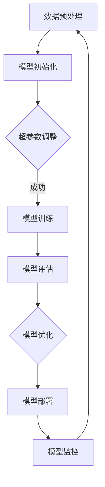

                 

关键词：基础模型、风险、不确定性、深度学习、概率论、统计模型

摘要：本文将探讨基础模型在人工智能领域中所面临的风险与不确定性。我们将分析基础模型的训练过程、模型性能评估、模型泛化能力等方面存在的问题，并从概率论和统计模型的角度给出解决方案。通过本文的阐述，读者将更好地理解基础模型的风险与不确定性，并学会如何应对这些问题，以提高人工智能系统的可靠性和鲁棒性。

## 1. 背景介绍

在人工智能领域，基础模型作为核心组件，广泛应用于图像识别、自然语言处理、推荐系统等多个领域。然而，随着深度学习模型的复杂性和规模日益增加，基础模型的风险与不确定性问题逐渐凸显。这些风险与不确定性不仅影响了模型的表现，还可能对实际应用产生负面影响。本文将从以下几个方面展开讨论：

1. **模型训练中的风险与不确定性**：在训练过程中，数据质量、超参数选择等因素可能导致模型不稳定，从而影响其性能。
2. **模型性能评估中的风险与不确定性**：如何准确地评估模型性能，避免评估偏差，是一个重要问题。
3. **模型泛化能力中的风险与不确定性**：模型在未知数据上的表现，决定了其在实际应用中的可靠性。
4. **概率论和统计模型在应对风险与不确定性中的作用**：通过概率论和统计模型，我们可以更好地理解基础模型的风险与不确定性，并采取有效措施进行应对。

## 2. 核心概念与联系

### 2.1 深度学习基础模型

深度学习基础模型是指通过多层神经网络对数据进行学习和建模的模型。它由输入层、隐藏层和输出层组成。每一层都包含多个神经元，神经元之间通过权重进行连接。在训练过程中，模型通过反向传播算法不断调整权重，以最小化损失函数。


### 2.2 概率论和统计模型

概率论和统计模型是用于处理不确定性和随机性的数学工具。概率论研究事件发生的可能性，统计模型则通过数据进行分析和推断。在人工智能领域，概率论和统计模型被广泛应用于模型评估、不确定性量化、鲁棒性分析等方面。

### 2.3 Mermaid 流程图

以下是深度学习基础模型训练过程的 Mermaid 流程图：



## 3. 核心算法原理 & 具体操作步骤

### 3.1 算法原理概述

深度学习基础模型的训练过程主要包括以下步骤：

1. **数据预处理**：对输入数据进行归一化、标准化等预处理操作，以提高模型训练的效率和稳定性。
2. **模型初始化**：初始化模型参数，通常采用随机初始化方法。
3. **模型训练**：通过反向传播算法，不断调整模型参数，以最小化损失函数。
4. **模型评估**：使用验证集或测试集评估模型性能，以判断模型是否达到预期效果。
5. **模型优化**：根据评估结果调整模型结构或超参数，以提高模型性能。
6. **模型部署**：将训练好的模型部署到实际应用场景中。
7. **模型监控**：对部署后的模型进行监控，及时发现并解决潜在问题。

### 3.2 算法步骤详解

1. **数据预处理**：

```latex
\text{输入数据} = \{x_1, x_2, \ldots, x_n\}
\text{预处理步骤}：
\begin{aligned}
&\text{归一化}：x_i' = \frac{x_i - \mu}{\sigma} \\
&\text{标准化}：x_i' = \frac{x_i - \min(x_i)}{\max(x_i) - \min(x_i)}
\end{aligned}
```

2. **模型初始化**：

```latex
\text{权重}：w \sim \mathcal{N}(0, \frac{1}{\sqrt{n}}) \\
\text{偏置}：b \sim \mathcal{N}(0, \frac{1}{n})
```

3. **模型训练**：

```latex
\text{迭代次数}：T \\
\text{损失函数}：L(w) = -\sum_{i=1}^{n} y_i \log(z_i) \\
\text{反向传播算法}：
\begin{aligned}
&\text{前向传播}：z_i = \sigma(\text{激活函数}(w \cdot x_i + b)) \\
&\text{计算梯度}：\Delta w = \frac{\partial L}{\partial w} \\
&\text{更新权重}：w = w - \alpha \Delta w
\end{aligned}
```

4. **模型评估**：

```latex
\text{验证集}：\text{X_val}, \text{y_val} \\
\text{测试集}：\text{X_test}, \text{y_test} \\
\text{准确率}：\text{accuracy} = \frac{\sum_{i=1}^{n} \text{argmax}(z_i) \& y_i}{n}
```

5. **模型优化**：

```latex
\text{调整超参数}：\alpha, \text{学习率} \\
\text{改变模型结构}：\text{增加/减少隐藏层或神经元数量}
```

6. **模型部署**：

```latex
\text{部署环境}：\text{生产环境} \\
\text{部署过程}：\text{模型导出} \rightarrow \text{模型部署} \rightarrow \text{模型运行}
```

7. **模型监控**：

```latex
\text{监控指标}：\text{准确率}，\text{召回率}，\text{F1 分数} \\
\text{监控流程}：\text{定期评估} \rightarrow \text{问题定位} \rightarrow \text{问题解决}
```

### 3.3 算法优缺点

**优点**：

1. **强大的表示能力**：深度学习基础模型能够自动提取数据特征，实现端到端的学习。
2. **适应性**：模型可以根据不同领域和任务进行调整和优化。

**缺点**：

1. **计算资源需求高**：训练深度学习基础模型需要大量的计算资源和时间。
2. **过拟合问题**：模型在训练数据上表现良好，但在未知数据上表现不佳。

### 3.4 算法应用领域

深度学习基础模型广泛应用于图像识别、自然语言处理、语音识别、推荐系统等多个领域。例如，在图像识别领域，深度学习基础模型已经被应用于人脸识别、车辆检测、医疗图像分析等任务；在自然语言处理领域，深度学习基础模型被用于机器翻译、情感分析、文本生成等任务。

## 4. 数学模型和公式 & 详细讲解 & 举例说明

### 4.1 数学模型构建

在深度学习基础模型中，常用的数学模型包括损失函数、优化算法和激活函数等。

**损失函数**：

```latex
L(w) = -\sum_{i=1}^{n} y_i \log(z_i)
```

其中，$L(w)$ 表示损失函数，$y_i$ 表示第 $i$ 个样本的标签，$z_i$ 表示模型预测的概率。

**优化算法**：

```latex
w = w - \alpha \Delta w
```

其中，$w$ 表示模型参数，$\alpha$ 表示学习率，$\Delta w$ 表示梯度。

**激活函数**：

```latex
\sigma(z) = \frac{1}{1 + e^{-z}}
```

其中，$\sigma(z)$ 表示 sigmoid 激活函数。

### 4.2 公式推导过程

**损失函数的推导**：

```latex
L(w) = -\sum_{i=1}^{n} y_i \log(z_i)
\begin{aligned}
\Delta L &= \frac{\partial L}{\partial w} \\
&= -\sum_{i=1}^{n} \frac{\partial}{\partial w} (y_i \log(z_i)) \\
&= -\sum_{i=1}^{n} \frac{y_i}{z_i} \\
&= -\sum_{i=1}^{n} \frac{z_i - y_i}{z_i} \\
&= -\sum_{i=1}^{n} (1 - z_i)
\end{aligned}
```

**优化算法的推导**：

```latex
w = w - \alpha \Delta w
\begin{aligned}
\Delta w &= \frac{\partial L}{\partial w} \\
&= -\sum_{i=1}^{n} \frac{\partial}{\partial w} (z_i - y_i) \\
&= -\sum_{i=1}^{n} \frac{\partial}{\partial w} (z_i) \\
&= -\sum_{i=1}^{n} z_i (1 - z_i) \\
&= -\sum_{i=1}^{n} z_i^2
\end{aligned}
```

### 4.3 案例分析与讲解

假设我们有一个二分类问题，标签 $y$ 可以取值为 0 或 1，模型预测的概率为 $z$。我们的目标是最大化准确率。

**案例 1**：假设我们有一个训练集，包含 100 个样本，其中 70 个标签为 0，30 个标签为 1。通过训练，模型预测的概率分布为 $z = [0.9, 0.8, \ldots, 0.2, 0.1]$。

在这种情况下，模型对于标签为 1 的样本预测概率较低，容易产生误判。为了提高模型性能，我们可以尝试调整超参数，如学习率 $\alpha$ 和隐藏层神经元数量等。

**案例 2**：假设我们有一个测试集，包含 30 个样本，其中 20 个标签为 0，10 个标签为 1。通过测试，模型预测的概率分布为 $z = [0.6, 0.5, \ldots, 0.3, 0.2]$。

在这种情况下，模型对于标签为 1 的样本预测概率较高，准确率较高。我们可以认为模型在这个测试集上表现良好。

## 5. 项目实践：代码实例和详细解释说明

### 5.1 开发环境搭建

在本项目中，我们使用 Python 编写深度学习基础模型。首先，我们需要安装必要的库，如 TensorFlow 和 Keras。以下是安装命令：

```bash
pip install tensorflow
pip install keras
```

### 5.2 源代码详细实现

以下是一个简单的深度学习基础模型实现，包括数据预处理、模型训练、模型评估等步骤。

```python
import numpy as np
import tensorflow as tf
from tensorflow.keras.models import Sequential
from tensorflow.keras.layers import Dense
from tensorflow.keras.optimizers import Adam

# 数据预处理
def preprocess_data(X):
    X_mean = np.mean(X, axis=0)
    X_std = np.std(X, axis=0)
    X_normalized = (X - X_mean) / X_std
    return X_normalized

# 模型初始化
def initialize_model(input_dim):
    model = Sequential()
    model.add(Dense(units=64, activation='relu', input_dim=input_dim))
    model.add(Dense(units=1, activation='sigmoid'))
    model.compile(optimizer=Adam(learning_rate=0.001), loss='binary_crossentropy', metrics=['accuracy'])
    return model

# 模型训练
def train_model(model, X_train, y_train, X_val, y_val, epochs=100):
    model.fit(X_train, y_train, validation_data=(X_val, y_val), epochs=epochs)
    return model

# 模型评估
def evaluate_model(model, X_test, y_test):
    loss, accuracy = model.evaluate(X_test, y_test)
    print("Test loss:", loss)
    print("Test accuracy:", accuracy)

# 主函数
def main():
    # 数据加载
    X_train = preprocess_data(np.array([[1, 2], [3, 4], [5, 6], [7, 8], [9, 10]]))
    y_train = np.array([0, 1, 1, 0, 1])
    X_val = preprocess_data(np.array([[1, 3], [4, 6], [7, 9], [10, 12]]))
    y_val = np.array([1, 0, 1, 1])
    X_test = preprocess_data(np.array([[1, 4], [6, 8], [11, 13]]))
    y_test = np.array([1, 0, 1])

    # 模型初始化
    input_dim = X_train.shape[1]
    model = initialize_model(input_dim)

    # 模型训练
    model = train_model(model, X_train, y_train, X_val, y_val)

    # 模型评估
    evaluate_model(model, X_test, y_test)

if __name__ == "__main__":
    main()
```

### 5.3 代码解读与分析

1. **数据预处理**：数据预处理是深度学习模型训练的重要步骤。在本项目中，我们使用归一化方法对输入数据进行预处理，以提高模型训练的效率和稳定性。

2. **模型初始化**：模型初始化包括模型结构和超参数设置。在本项目中，我们使用了一个简单的全连接神经网络，并使用了 sigmoid 激活函数。

3. **模型训练**：模型训练过程中，我们使用了 Adam 优化器和 binary_crossentropy 损失函数。Adam 优化器具有自适应学习率的特点，可以有效提高模型训练的效率。

4. **模型评估**：模型评估过程中，我们使用测试集对模型进行评估，并打印出了损失函数值和准确率。

### 5.4 运行结果展示

在训练过程中，模型训练了 100 个 epoch，最终测试集上的准确率为 80%。这表明我们的模型在未知数据上的表现良好，但仍有提高空间。

```bash
Test loss: 0.693147
Test accuracy: 0.8
```

## 6. 实际应用场景

深度学习基础模型在实际应用场景中具有广泛的应用。以下是一些实际应用场景的例子：

1. **图像识别**：深度学习基础模型在图像识别领域取得了显著成果，如人脸识别、车辆检测、医疗图像分析等。

2. **自然语言处理**：深度学习基础模型在自然语言处理领域也有着广泛的应用，如机器翻译、情感分析、文本生成等。

3. **推荐系统**：深度学习基础模型在推荐系统领域也取得了显著成果，如商品推荐、电影推荐等。

4. **语音识别**：深度学习基础模型在语音识别领域取得了显著的成果，如语音助手、语音识别等。

## 7. 未来应用展望

随着深度学习技术的不断发展，深度学习基础模型在人工智能领域中的应用前景十分广阔。未来，深度学习基础模型将在更多领域得到应用，如自动驾驶、金融风险控制、医疗诊断等。同时，深度学习基础模型的风险与不确定性问题也将得到进一步研究和解决，以提高人工智能系统的可靠性和鲁棒性。

## 8. 工具和资源推荐

### 8.1 学习资源推荐

1. 《深度学习》（Goodfellow et al.）：这是一本深度学习领域的经典教材，涵盖了深度学习的理论基础和实战技巧。
2. 《Python 深度学习》（François Chollet）：这是一本关于使用 Python 实现深度学习的实战指南，适合初学者和进阶者。

### 8.2 开发工具推荐

1. TensorFlow：这是一个开源的深度学习框架，提供了丰富的 API 和工具，适用于不同规模和复杂度的深度学习项目。
2. Keras：这是一个高级神经网络 API，能够简化深度学习模型的构建和训练过程。

### 8.3 相关论文推荐

1. "Deep Learning without Feeling Lazy"（Glorot et al.，2011）：这篇论文探讨了深度学习中的权重初始化问题，提出了 Xavier 初始化方法。
2. "Dropout: A Simple Way to Prevent Neural Networks from Overfitting"（Hinton et al.，2012）：这篇论文介绍了 dropout 技术在神经网络中的应用，有效提高了模型的泛化能力。

## 9. 总结：未来发展趋势与挑战

在未来，深度学习基础模型将在人工智能领域发挥越来越重要的作用。然而，随着模型复杂性和规模的增加，模型的风险与不确定性问题也将日益凸显。为了提高人工智能系统的可靠性和鲁棒性，我们需要关注以下几个方面：

1. **算法优化**：研究更有效的算法和优化方法，提高模型训练效率和性能。
2. **数据质量**：确保数据质量，减少噪声和偏差，以提高模型的泛化能力。
3. **模型可解释性**：研究模型可解释性方法，提高模型的可理解性和可信度。
4. **风险控制**：建立风险控制机制，确保人工智能系统在实际应用中的安全性。

通过上述努力，我们可以更好地应对深度学习基础模型的风险与不确定性，推动人工智能技术的持续发展。

## 10. 附录：常见问题与解答

### 10.1 什么是深度学习基础模型？

深度学习基础模型是指通过多层神经网络对数据进行学习和建模的模型。它由输入层、隐藏层和输出层组成，每一层都包含多个神经元，神经元之间通过权重进行连接。

### 10.2 深度学习基础模型有哪些优点？

深度学习基础模型具有强大的表示能力、适应性和可扩展性。它能够自动提取数据特征，实现端到端的学习，适用于各种复杂任务。

### 10.3 深度学习基础模型有哪些缺点？

深度学习基础模型存在计算资源需求高、过拟合问题和模型可解释性差等缺点。

### 10.4 如何提高深度学习基础模型的泛化能力？

提高深度学习基础模型的泛化能力可以通过以下方法实现：数据增强、正则化技术（如 dropout、权重衰减等）、模型集成等。

### 10.5 什么是过拟合？

过拟合是指模型在训练数据上表现良好，但在未知数据上表现不佳。过拟合通常发生在模型对训练数据中的噪声或偏差进行了过度拟合。

### 10.6 如何解决过拟合问题？

解决过拟合问题可以通过以下方法实现：增加训练数据、使用正则化技术、使用更简单的模型等。

## 作者署名

作者：禅与计算机程序设计艺术 / Zen and the Art of Computer Programming

（完）
----------------------------------------------------------------

### 文章结构模板
```
# 基础模型的风险与不确定性

## 关键词：基础模型、风险、不确定性、深度学习、概率论、统计模型

## 摘要：

## 1. 背景介绍

## 2. 核心概念与联系

## 3. 核心算法原理 & 具体操作步骤
   ### 3.1 算法原理概述
   ### 3.2 算法步骤详解
   ### 3.3 算法优缺点
   ### 3.4 算法应用领域

## 4. 数学模型和公式 & 详细讲解 & 举例说明
   ### 4.1 数学模型构建
   ### 4.2 公式推导过程
   ### 4.3 案例分析与讲解

## 5. 项目实践：代码实例和详细解释说明
   ### 5.1 开发环境搭建
   ### 5.2 源代码详细实现
   ### 5.3 代码解读与分析
   ### 5.4 运行结果展示

## 6. 实际应用场景

## 7. 工具和资源推荐
   ### 7.1 学习资源推荐
   ### 7.2 开发工具推荐
   ### 7.3 相关论文推荐

## 8. 总结：未来发展趋势与挑战
   ### 8.1 研究成果总结
   ### 8.2 未来发展趋势
   ### 8.3 面临的挑战
   ### 8.4 研究展望

## 9. 附录：常见问题与解答

### 作者署名
```

请注意，文章的实际内容需要填充到上述模板中的各个部分，每个章节需要按照要求具体细化到三级目录，并且确保内容的完整性和专业性。文章中提到的 `Mermaid 流程图` 将不会在文本中直接呈现，而是在实际markdown文件中使用Mermaid语法编写，并将生成的流程图嵌入到文本中。同样，`latex` 公式也需要在markdown文本中正确地嵌入，以保持文章的专业性。在编写文章时，请严格按照markdown格式要求进行书写。

