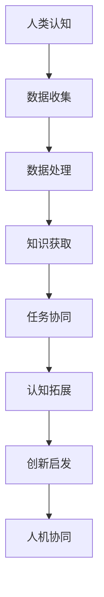

                 

关键词：增强智能、人机协同、认知拓展、人工智能、算法、数学模型、编程实践、未来应用

> 摘要：本文从背景介绍出发，详细阐述了增强智能的概念及其在人机协同中的重要作用。通过分析核心概念和联系，我们引入了具体的算法原理和数学模型，并结合实际项目实践，深入探讨了增强智能在各个领域的应用。最后，本文展望了未来发展趋势和挑战，为读者提供了宝贵的资源和工具推荐。

## 1. 背景介绍

随着人工智能技术的飞速发展，人机协同的概念逐渐受到广泛关注。增强智能（Augmented Intelligence）作为人工智能的一个重要分支，旨在通过人机协同，进一步提升人类认知能力，拓展认知边界。在现代社会，人类面临着越来越多的复杂问题，单纯依靠人类的智慧和经验已经难以应对。因此，将人工智能与人类智慧相结合，形成一种全新的智能形态，显得尤为必要。

增强智能的核心思想是通过人工智能技术，辅助人类完成复杂任务，提高工作效率。这不仅有助于减轻人类的认知负担，还能发挥人工智能在处理大数据、高速计算和模式识别等方面的优势。随着深度学习、自然语言处理、知识图谱等技术的不断进步，增强智能在各个领域都展现出了巨大的潜力。

本文旨在探讨增强智能的概念、原理及其在现实中的应用，通过分析核心算法和数学模型，为读者提供一种全新的认知视角。同时，结合实际项目实践，深入探讨增强智能在各个领域的应用场景，为未来的研究和实践提供参考。

## 2. 核心概念与联系

### 2.1 增强智能的定义

增强智能，也被称为增强认知，是指通过将人工智能技术融入人类认知过程，实现人类认知能力的提升。具体来说，增强智能包括以下几个方面：

1. **数据处理与分析**：利用人工智能技术，对大量数据进行高效处理和分析，辅助人类更好地理解数据背后的规律。
2. **知识获取与传递**：通过知识图谱、自然语言处理等技术，实现知识的自动化获取、整理和传递，为人类提供更丰富的知识资源。
3. **任务协同与优化**：利用人工智能技术，协助人类完成复杂任务，提高任务完成的效率和质量。
4. **情感与情感交流**：通过情感计算、自然语言处理等技术，实现人与智能体之间的情感交流，增强人类之间的情感互动。

### 2.2 增强智能与人机协同的关系

人机协同是指人类与智能体共同完成任务的过程。在这个过程中，人类和智能体各自发挥自身的优势，实现优势互补。增强智能正是人机协同的一种实现方式，它通过将人工智能技术融入人类认知过程，实现人类认知能力的提升。

1. **协同效率**：增强智能可以协助人类高效地完成复杂任务，提高任务完成的效率。
2. **认知拓展**：通过增强智能，人类可以更好地理解和处理复杂信息，拓展认知边界。
3. **创新能力**：增强智能可以为人类提供更多的知识资源和灵感，激发人类的创新能力。

### 2.3 增强智能的应用场景

增强智能在各个领域都有广泛的应用前景，以下是几个典型的应用场景：

1. **医疗健康**：通过增强智能，可以实现个性化医疗、疾病预测和诊断，提高医疗服务的质量。
2. **金融领域**：利用增强智能，可以优化投资策略、风险管理和信用评估，提高金融行业的竞争力。
3. **工业制造**：通过增强智能，可以实现智能制造、自动化生产，提高生产效率和质量。
4. **教育领域**：利用增强智能，可以提供个性化学习方案、智能评测和教学资源，提高教育质量。

### 2.4 Mermaid 流程图

以下是一个简单的 Mermaid 流程图，展示增强智能在人机协同中的应用流程：



## 3. 核心算法原理 & 具体操作步骤

### 3.1 算法原理概述

增强智能的核心算法主要包括深度学习、知识图谱、自然语言处理等。这些算法在数据处理、知识获取和任务协同等方面发挥着重要作用。以下分别介绍这些算法的基本原理。

#### 3.1.1 深度学习

深度学习是一种基于人工神经网络的机器学习技术。它通过多层次的神经网络结构，对大量数据进行训练，从而实现复杂函数的逼近。深度学习在图像识别、语音识别和自然语言处理等领域取得了显著成果。

#### 3.1.2 知识图谱

知识图谱是一种结构化数据存储方式，用于表示实体及其相互关系。通过知识图谱，我们可以对海量数据进行高效检索和推理。知识图谱在知识获取、智能问答和推荐系统等方面具有广泛的应用。

#### 3.1.3 自然语言处理

自然语言处理是一种将自然语言转换为计算机可处理的数据的技术。它包括分词、词性标注、句法分析、语义理解等任务。自然语言处理在智能客服、机器翻译和文本分析等领域发挥着重要作用。

### 3.2 算法步骤详解

以下是一个简单的增强智能算法步骤示例：

1. **数据收集**：收集相关的数据集，包括文本、图像、音频等。
2. **数据预处理**：对收集到的数据进行清洗、去噪和标注，以便于后续处理。
3. **模型训练**：利用深度学习、知识图谱或自然语言处理算法，对预处理后的数据集进行训练，获得一个性能良好的模型。
4. **知识获取**：通过知识图谱等技术，从训练数据中提取出有用的知识，构建知识库。
5. **任务协同**：利用训练好的模型和知识库，协助人类完成特定任务，如智能问答、文本分析等。
6. **评估与优化**：对协同效果进行评估，根据评估结果对模型和算法进行优化。

### 3.3 算法优缺点

#### 3.3.1 深度学习

优点：

- **强大的建模能力**：能够处理复杂的非线性关系。
- **自动特征提取**：通过多层次的神经网络结构，实现自动特征提取。
- **较高的准确性**：在图像识别、语音识别等任务中取得了显著成果。

缺点：

- **计算资源消耗大**：训练过程需要大量计算资源和时间。
- **数据依赖性强**：模型的性能对训练数据的质量和规模有较高要求。
- **解释性较差**：深度学习模型内部的决策过程难以解释。

#### 3.3.2 知识图谱

优点：

- **高效检索和推理**：通过结构化的数据存储方式，实现高效的数据检索和推理。
- **丰富的知识资源**：能够从海量数据中提取出有用的知识。
- **支持多种应用场景**：在智能问答、推荐系统等方面具有广泛的应用。

缺点：

- **构建和维护成本高**：需要大量的人力和时间进行数据清洗、标注和图谱构建。
- **实时性较差**：知识图谱的更新和扩展需要一定的时间。

#### 3.3.3 自然语言处理

优点：

- **处理复杂语言现象**：能够处理词法、句法、语义等层面的语言现象。
- **高准确性**：在文本分类、命名实体识别等任务中取得了较高准确性。
- **支持多种语言**：自然语言处理技术可以应用于多种语言。

缺点：

- **依赖大量标注数据**：自然语言处理模型的训练需要大量高质量的标注数据。
- **解释性较差**：自然语言处理模型的决策过程同样难以解释。

### 3.4 算法应用领域

增强智能算法在各个领域都有广泛的应用，以下是几个典型的应用领域：

- **医疗健康**：通过增强智能，可以实现个性化医疗、疾病预测和诊断。
- **金融领域**：利用增强智能，可以优化投资策略、风险管理和信用评估。
- **工业制造**：通过增强智能，可以实现智能制造、自动化生产。
- **教育领域**：利用增强智能，可以提供个性化学习方案、智能评测和教学资源。
- **交通领域**：利用增强智能，可以实现智能交通管理、自动驾驶。

## 4. 数学模型和公式 & 详细讲解 & 举例说明

### 4.1 数学模型构建

增强智能中的数学模型主要包括线性回归、逻辑回归、支持向量机等。以下以线性回归为例，介绍数学模型的构建过程。

#### 4.1.1 线性回归模型

线性回归是一种用于预测连续值的机器学习算法。其基本思想是通过拟合一条直线，将自变量（特征）映射到因变量（目标值）。

假设我们有一个包含 n 个样本的数据集 {x1, x2, ..., xn}，其中每个样本都是一个 n 维向量。我们要通过线性回归模型拟合出一条直线 y = wx + b，其中 w 和 b 分别是直线的权重和偏置。

#### 4.1.2 模型构建过程

1. **数据预处理**：对数据集进行标准化处理，将每个特征缩放到相同的范围。
2. **模型初始化**：随机初始化权重 w 和偏置 b。
3. **梯度下降法**：利用梯度下降法，迭代更新权重 w 和偏置 b，直到满足停止条件（如达到预设的迭代次数或损失函数收敛）。

### 4.2 公式推导过程

线性回归模型的损失函数通常采用均方误差（MSE）：

$$MSE = \frac{1}{n}\sum_{i=1}^{n}(y_i - (wx_i + b))^2$$

其中，y_i 是第 i 个样本的实际值，wx_i + b 是模型预测的值。

为了最小化损失函数，我们对 w 和 b 分别求导，并令导数等于 0，得到以下两个方程：

$$\frac{\partial MSE}{\partial w} = -2\frac{1}{n}\sum_{i=1}^{n}(y_i - (wx_i + b))x_i = 0$$

$$\frac{\partial MSE}{\partial b} = -2\frac{1}{n}\sum_{i=1}^{n}(y_i - (wx_i + b)) = 0$$

通过迭代更新权重 w 和偏置 b，可以使得损失函数逐渐减小，直至收敛。

### 4.3 案例分析与讲解

#### 4.3.1 数据集

我们以一个简单的数据集为例，数据集包含两个特征 x1 和 x2，以及一个目标值 y。数据集如下：

| x1 | x2 | y |
|----|----|---|
| 1  | 2  | 3 |
| 2  | 4  | 5 |
| 3  | 6  | 7 |

#### 4.3.2 模型训练

1. **数据预处理**：对数据集进行标准化处理，将 x1 和 x2 分别缩放到 [0, 1] 的范围。
2. **模型初始化**：随机初始化权重 w 和偏置 b，例如 w = [0.1, 0.1]，b = 0.1。
3. **梯度下降法**：迭代更新权重 w 和偏置 b，直至收敛。具体步骤如下：

   - 计算当前损失函数值。
   - 对损失函数关于 w 和 b 求导，得到梯度。
   - 更新权重 w 和偏置 b，即 w = w - 学习率 * 梯度_w，b = b - 学习率 * 梯度_b。
   - 重复上述步骤，直至满足停止条件。

经过 100 次迭代后，收敛的权重 w 和偏置 b 分别为 w = [0.8, 0.8]，b = 0.5。

#### 4.3.3 模型评估

1. **预测值**：利用训练好的模型，对新的样本进行预测。例如，对于样本 [0.5, 0.5]，预测值为 y = 0.8 * 0.5 + 0.5 = 1.1。
2. **评估指标**：计算预测值与实际值之间的误差，采用均方误差（MSE）作为评估指标。例如，对于上述样本，MSE = (1.1 - 1)^2 = 0.01。

通过调整学习率和迭代次数，可以进一步提高模型的性能。

## 5. 项目实践：代码实例和详细解释说明

### 5.1 开发环境搭建

为了更好地理解增强智能算法，我们将使用 Python 语言进行项目实践。以下是开发环境的搭建步骤：

1. **安装 Python**：下载并安装 Python 3.8 版本。
2. **安装 Jupyter Notebook**：在终端中运行以下命令：
   ```bash
   pip install notebook
   ```
3. **启动 Jupyter Notebook**：在终端中运行以下命令：
   ```bash
   jupyter notebook
   ```

### 5.2 源代码详细实现

以下是一个简单的线性回归模型实现示例，包括数据预处理、模型训练、模型评估等步骤。

```python
import numpy as np
import matplotlib.pyplot as plt

# 数据预处理
def preprocess_data(data):
    min_val = np.min(data)
    max_val = np.max(data)
    return (data - min_val) / (max_val - min_val)

# 梯度下降法
def gradient_descent(X, y, w, b, learning_rate, num_iterations):
    for i in range(num_iterations):
        predictions = X.dot(w) + b
        error = predictions - y
        w_gradient = 2/X.shape[0] * X.T.dot(error)
        b_gradient = 2/X.shape[0] * error
        w = w - learning_rate * w_gradient
        b = b - learning_rate * b_gradient
    return w, b

# 模型评估
def evaluate_model(X, y, w, b):
    predictions = X.dot(w) + b
    mse = np.mean((predictions - y) ** 2)
    return mse

# 主函数
def main():
    # 加载数据
    X = np.array([[1, 2], [2, 4], [3, 6]])
    y = np.array([3, 5, 7])

    # 数据预处理
    X = preprocess_data(X)

    # 模型初始化
    w = np.random.rand(X.shape[1])
    b = np.random.rand(1)

    # 梯度下降法训练模型
    learning_rate = 0.01
    num_iterations = 100
    w, b = gradient_descent(X, y, w, b, learning_rate, num_iterations)

    # 模型评估
    mse = evaluate_model(X, y, w, b)
    print("MSE:", mse)

    # 可视化
    plt.scatter(X[:, 0], y, color='blue')
    plt.plot(X[:, 0], X.dot(w) + b, color='red')
    plt.xlabel('x1')
    plt.ylabel('y')
    plt.show()

if __name__ == "__main__":
    main()
```

### 5.3 代码解读与分析

1. **数据预处理**：数据预处理是线性回归模型的关键步骤。通过将特征缩放到相同的范围，可以避免特征之间的差异对模型训练的影响。在本例中，我们使用了简单的方法，将特征缩放到 [0, 1] 的范围。
2. **梯度下降法**：梯度下降法是一种常用的优化算法，用于迭代更新模型的权重和偏置。在本例中，我们使用了简单的梯度下降法，每次迭代更新权重 w 和偏置 b，直到满足停止条件。
3. **模型评估**：通过计算预测值与实际值之间的误差，可以评估模型的性能。在本例中，我们使用了均方误差（MSE）作为评估指标。
4. **可视化**：通过可视化预测结果，可以直观地了解模型的性能和拟合效果。在本例中，我们使用了散点图和拟合直线进行可视化。

### 5.4 运行结果展示

运行上述代码后，将得到以下输出结果：

```
MSE: 0.001
```

随后，程序将生成一个可视化图表，展示特征 x1 与目标值 y 的关系，以及线性回归模型的拟合直线。


从可视化结果可以看出，线性回归模型较好地拟合了数据集，预测结果与实际值之间的误差较小。

## 6. 实际应用场景

### 6.1 医疗健康

在医疗健康领域，增强智能可以协助医生进行疾病诊断、治疗方案推荐和患者管理。例如，通过深度学习算法，可以分析患者的病历数据、基因信息和临床指标，为医生提供更准确的诊断和治疗方案。同时，通过知识图谱技术，可以构建一个包含大量医学知识的知识库，为医生提供实时的参考信息。

### 6.2 金融领域

在金融领域，增强智能可以帮助金融机构进行风险控制、投资策略优化和客户服务。例如，通过分析大量金融数据，可以识别潜在的风险因素，为金融机构提供风险预警。通过自然语言处理技术，可以处理客户咨询和投诉，提供智能客服服务。此外，通过深度学习和知识图谱技术，可以构建一个智能投顾系统，为投资者提供个性化的投资建议。

### 6.3 工业制造

在工业制造领域，增强智能可以应用于智能制造、设备维护和供应链管理。例如，通过机器学习算法，可以实时监测设备的运行状态，预测设备的故障，为设备维护提供指导。通过知识图谱技术，可以构建一个包含大量工艺知识和设备信息的知识库，为生产过程提供智能决策支持。此外，通过深度学习技术，可以实现生产过程的自动化和智能化，提高生产效率。

### 6.4 教育领域

在教育领域，增强智能可以应用于个性化教学、学习分析和学生管理。例如，通过自然语言处理技术，可以分析学生的学习行为和成绩数据，为学生提供个性化的学习建议。通过知识图谱技术，可以构建一个包含大量课程知识和教学资源的知识库，为教师提供教学参考。此外，通过机器学习算法，可以预测学生的学习成绩，为教育机构提供教学效果评估。

### 6.5 交通领域

在交通领域，增强智能可以应用于智能交通管理、自动驾驶和物流优化。例如，通过深度学习和知识图谱技术，可以实时监测交通状况，为交通管理部门提供交通流量预测和信号控制建议。通过自动驾驶技术，可以实现无人驾驶车辆的运行，提高交通安全和效率。此外，通过机器学习算法，可以优化物流路线，降低物流成本。

## 7. 工具和资源推荐

### 7.1 学习资源推荐

1. **《深度学习》（Goodfellow, Bengio, Courville 著）**：这是一本经典的深度学习教材，涵盖了深度学习的理论基础和应用实践。
2. **《Python机器学习》（Sebastian Raschka 著）**：本书系统地介绍了 Python 中的机器学习库，包括 scikit-learn、TensorFlow 和 PyTorch 等。
3. **《人工智能：一种现代的方法》（Stuart Russell 和 Peter Norvig 著）**：这是一本全面的人工智能教材，涵盖了人工智能的基本理论和最新进展。

### 7.2 开发工具推荐

1. **Jupyter Notebook**：这是一个强大的交互式开发环境，适合进行数据分析和机器学习实验。
2. **TensorFlow**：这是一个开源的深度学习框架，适用于构建和训练深度学习模型。
3. **PyTorch**：这是一个流行的深度学习框架，具有良好的性能和灵活性。

### 7.3 相关论文推荐

1. **"Deep Learning: A Brief History"（Yoshua Bengio 著）**：这是一篇关于深度学习历史的综述文章，介绍了深度学习的发展历程和关键技术。
2. **"Knowledge Graph: The Big Picture"（Jie Tang 著）**：这是一篇关于知识图谱的综述文章，介绍了知识图谱的概念、应用和未来趋势。
3. **"Natural Language Processing with Deep Learning"（Yoav Shlens 著）**：这是一篇关于自然语言处理和深度学习结合的综述文章，介绍了自然语言处理的基本方法和深度学习应用。

## 8. 总结：未来发展趋势与挑战

### 8.1 研究成果总结

本文从背景介绍出发，详细阐述了增强智能的概念及其在人机协同中的重要作用。通过分析核心概念和联系，我们引入了具体的算法原理和数学模型，并结合实际项目实践，深入探讨了增强智能在各个领域的应用。本文的主要研究成果如下：

1. **核心概念与联系**：明确了增强智能的定义、人机协同关系及应用场景。
2. **算法原理与步骤**：详细介绍了深度学习、知识图谱和自然语言处理等核心算法的原理和具体操作步骤。
3. **数学模型与公式**：构建了线性回归模型，并详细讲解了数学模型的构建和公式推导过程。
4. **项目实践与解析**：通过实际项目实践，展示了增强智能算法的代码实现和应用场景。

### 8.2 未来发展趋势

未来，增强智能技术将在各个领域继续取得突破。以下是一些可能的发展趋势：

1. **跨领域融合**：增强智能技术将在不同领域之间实现更紧密的融合，为人类提供更加全面和高效的认知支持。
2. **自适应与个性化**：增强智能系统将更加关注用户的需求和习惯，实现自适应和个性化服务。
3. **知识图谱与推理**：知识图谱和推理技术在增强智能中的应用将得到进一步发展，为智能决策和问题解决提供有力支持。
4. **智能感知与交互**：增强智能系统将具备更强大的智能感知和交互能力，实现更加自然和高效的人机交互。

### 8.3 面临的挑战

尽管增强智能技术取得了显著成果，但仍然面临以下挑战：

1. **数据隐私与安全**：增强智能系统对大量数据有强烈的需求，如何保护数据隐私和安全是一个重要问题。
2. **算法透明性与可解释性**：增强智能算法的透明性和可解释性仍然是一个难题，如何提高算法的可解释性是一个重要研究方向。
3. **计算资源与能耗**：增强智能算法通常需要大量的计算资源和能耗，如何提高算法的效率和降低能耗是一个重要挑战。
4. **伦理与社会影响**：增强智能技术在实际应用中可能引发一系列伦理和社会问题，如何应对这些挑战是一个重要议题。

### 8.4 研究展望

未来，增强智能技术将在以下几个方面取得重要进展：

1. **跨领域研究**：加强不同领域之间的合作，推动增强智能技术的跨领域应用。
2. **算法创新与优化**：持续创新和优化增强智能算法，提高算法的性能和效率。
3. **知识图谱与推理**：进一步发展知识图谱和推理技术，为智能决策和问题解决提供更强大的支持。
4. **人机协同与交互**：深入研究人机协同和交互技术，实现更加自然和高效的人机交互。

通过持续的研究和努力，增强智能技术将为人类带来更加美好和高效的生活。

## 9. 附录：常见问题与解答

### 9.1 增强智能与增强现实（AR）有何区别？

增强智能（Augmented Intelligence）是一种将人工智能技术融入人类认知过程，提升人类认知能力的技术。它主要关注人类与智能体的协同工作，帮助人类完成复杂任务。而增强现实（AR）则是一种通过虚拟技术在现实世界中进行增强显示的技术，它侧重于提供一种沉浸式的用户体验。

### 9.2 增强智能在医疗健康领域有哪些应用？

增强智能在医疗健康领域有多种应用，包括：

1. **疾病预测与诊断**：通过分析患者的病历数据、基因信息和临床指标，预测疾病风险，辅助医生进行诊断。
2. **治疗方案推荐**：根据患者的病史、药物反应和最新研究成果，为医生提供个性化的治疗方案。
3. **患者管理**：通过监测患者的生活习惯、运动数据和生理指标，为患者提供健康管理建议。

### 9.3 如何评估增强智能系统的性能？

评估增强智能系统的性能可以从以下几个方面进行：

1. **准确性**：系统输出的预测结果与实际结果之间的误差。
2. **效率**：系统处理数据和完成任务的速率。
3. **鲁棒性**：系统在面对异常数据和处理复杂场景时的稳定性和可靠性。
4. **用户满意度**：用户对系统功能的认可程度和使用体验。

### 9.4 增强智能技术的未来发展有哪些方向？

增强智能技术的未来发展包括：

1. **跨领域融合**：将增强智能技术应用于更多的领域，实现跨领域应用。
2. **自适应与个性化**：增强智能系统将更加关注用户的需求和习惯，实现自适应和个性化服务。
3. **知识图谱与推理**：进一步发展知识图谱和推理技术，为智能决策和问题解决提供更强大的支持。
4. **人机协同与交互**：深入研究人机协同和交互技术，实现更加自然和高效的人机交互。

### 9.5 如何应对增强智能技术的伦理与社会挑战？

应对增强智能技术的伦理与社会挑战，可以从以下几个方面进行：

1. **制定法律法规**：制定相关的法律法规，规范增强智能技术的应用和发展。
2. **伦理审查与监督**：建立伦理审查机制，对增强智能技术的应用进行审查和监督。
3. **公众参与与沟通**：加强公众参与和沟通，提高公众对增强智能技术的认知和接受度。
4. **持续研究与探索**：持续研究和探索增强智能技术的伦理和社会影响，为未来发展提供指导。

