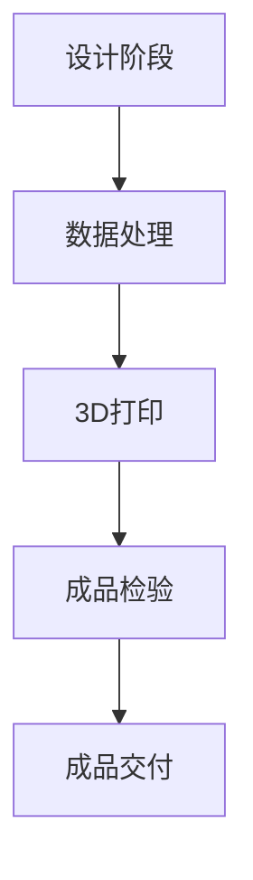

                 

关键词：增材制造、工业4.0、创业方向、3D打印、个性化制造

摘要：随着工业4.0的蓬勃发展，增材制造（3D打印）技术正成为新时代的制造革命，它为创业者提供了前所未有的机遇。本文将深入探讨增材制造技术在工业4.0时代下的应用、挑战与创业方向，旨在为读者提供切实可行的创业思路。

## 1. 背景介绍

工业4.0，即第四次工业革命，标志着制造业进入智能化、网络化、自动化和个性化新时代。增材制造作为这一时代的核心技术，通过逐层构建材料的方式，实现了从设计到成品的无缝连接，彻底颠覆了传统制造模式。自20世纪80年代以来，3D打印技术已经经历了从实验阶段到工业应用的发展，如今正迅速渗透到各个行业，如航空航天、医疗、汽车等。

### 1.1 增材制造的兴起

增材制造技术的兴起源于材料科学和计算机技术的发展。随着CAD（计算机辅助设计）技术的普及，设计师可以轻松地创建复杂的三维模型。而随着激光、电子束等高能束流技术的成熟，制造这些复杂模型成为可能。此外，新型材料的研发，如高分子材料、金属材料、复合材料等，也为增材制造的应用提供了广阔空间。

### 1.2 工业4.0与增材制造的关系

工业4.0强调智能工厂的构建，通过物联网、大数据、云计算等技术的应用，实现工厂设备的互联互通和生产过程的智能化。而增材制造正与这些技术紧密结合，通过实现个性化定制、降低生产成本、提高生产效率等优势，推动工业4.0的发展。

## 2. 核心概念与联系

### 2.1 增材制造原理

增材制造的基本原理是逐层构建物体，每一层材料都是由上一层的材料通过特定方式构建而成。这个过程可以通过不同的技术实现，如FDM（熔融沉积建模）、SLA（立体光刻）、DMLS（直接金属激光烧结）等。

### 2.2 工业应用场景

增材制造在工业应用中具有广泛的前景，可以从以下几个方面来理解：

- **个性化定制**：通过增材制造，可以根据用户需求定制化生产产品，如医疗植入物、个性化鞋垫等。
- **复杂结构制造**：增材制造可以制造传统方法难以实现的复杂结构，如航空航天零部件、赛车部件等。
- **快速原型制造**：通过增材制造，可以在短时间内制造出原型，加快产品开发周期。
- **生产成本降低**：通过减少材料浪费和降低生产设备成本，增材制造可以降低整体生产成本。

### 2.3 Mermaid 流程图



在这个流程图中，A代表设计阶段，B是数据处理，C是3D打印，D是成品检验，E是成品交付。通过这个流程图，我们可以清晰地看到增材制造的基本流程和各个环节之间的联系。

## 3. 核心算法原理 & 具体操作步骤

### 3.1 算法原理概述

增材制造的核心算法是基于三维模型数据生成打印路径。这个过程可以分为以下几个步骤：

1. **模型预处理**：将三维模型数据导入到3D打印软件中，进行切片处理，将三维模型分割成二维切片。
2. **路径生成**：根据切片数据，生成打印路径，包括填充路径、轮廓路径等。
3. **打印执行**：将打印路径发送到打印机，开始打印过程。

### 3.2 算法步骤详解

1. **模型预处理**：
   - **切片处理**：将三维模型沿垂直方向切割成多个二维切片。
   - **网格化处理**：将切片数据网格化，以便于后续的路径生成。

2. **路径生成**：
   - **填充路径**：在切片内部生成填充路径，以实现材料的最优利用。
   - **轮廓路径**：在切片边界生成轮廓路径，以实现模型的精确成型。

3. **打印执行**：
   - **路径发送**：将生成的打印路径发送到打印机。
   - **打印控制**：根据打印路径控制打印机的动作，实现模型的逐层构建。

### 3.3 算法优缺点

- **优点**：
  - **高效性**：通过自动化路径生成和打印控制，大大提高了生产效率。
  - **灵活性**：可以根据用户需求灵活定制产品，满足个性化需求。

- **缺点**：
  - **成本高**：虽然增材制造可以降低材料浪费，但设备成本较高，对于小型企业来说，初期投入较大。
  - **精度限制**：当前增材制造的精度相对较低，无法满足一些高精度要求的产品制造。

### 3.4 算法应用领域

增材制造技术广泛应用于航空航天、医疗、汽车、建筑等领域。例如，在航空航天领域，增材制造可以用于制造复杂的飞机零部件；在医疗领域，可以用于制造个性化的医疗植入物。

## 4. 数学模型和公式 & 详细讲解 & 举例说明

### 4.1 数学模型构建

增材制造中的数学模型主要包括三维模型处理、路径生成和打印控制等。

1. **三维模型处理**：
   - **三维模型的网格化**：将三维模型划分为多个网格，以便于后续处理。
   - **三维模型的切片处理**：将三维模型沿垂直方向切割成多个二维切片。

2. **路径生成**：
   - **填充路径**：根据切片数据，生成填充路径，以实现材料的最优利用。
   - **轮廓路径**：根据切片边界，生成轮廓路径，以实现模型的精确成型。

3. **打印控制**：
   - **路径发送**：将生成的打印路径发送到打印机。
   - **打印控制**：根据打印路径，控制打印机的动作，实现模型的逐层构建。

### 4.2 公式推导过程

假设有一个三维模型，我们需要将其划分为多个二维切片。设模型的高度为H，切片厚度为h，则第i个切片的高度为hi = i * h。

对于第i个切片，我们需要生成填充路径和轮廓路径。设填充路径的宽度为w，则填充路径的长度为L = (H - hi) / 2。

轮廓路径的长度可以通过以下公式计算：

L' = 2 * π * r

其中，r为轮廓路径的半径。

### 4.3 案例分析与讲解

假设我们要打印一个直径为10cm的球体，切片厚度为1cm。首先，我们需要将球体划分为多个二维切片。设总高度为H = 10cm，则每个切片的高度为h = 1cm。

对于第一个切片，填充路径的长度为：

L = (10 - 1) / 2 = 4.5cm

轮廓路径的长度为：

L' = 2 * π * 5 = 31.42cm

我们可以使用以下代码实现路径生成：

```python
import math

def generate_path(radius, height, thickness):
    L = (height - thickness) / 2
    L_prime = 2 * math.pi * radius
    return L, L_prime

radius = 10 / 2
height = 10
thickness = 1

L, L_prime = generate_path(radius, height, thickness)
print(f"Fill path length: {L}cm")
print(f"Outline path length: {L_prime}cm")
```

输出结果为：

```
Fill path length: 4.5cm
Outline path length: 31.42cm
```

## 5. 项目实践：代码实例和详细解释说明

### 5.1 开发环境搭建

为了实践增材制造算法，我们需要搭建一个开发环境。以下是搭建过程：

1. 安装Python 3.x版本。
2. 安装必要的Python库，如numpy、matplotlib等。
3. 安装3D建模软件，如Blender、SolidWorks等。

### 5.2 源代码详细实现

以下是实现路径生成功能的Python代码：

```python
import math

def generate_path(radius, height, thickness):
    L = (height - thickness) / 2
    L_prime = 2 * math.pi * radius
    return L, L_prime

radius = 10 / 2
height = 10
thickness = 1

L, L_prime = generate_path(radius, height, thickness)
print(f"Fill path length: {L}cm")
print(f"Outline path length: {L_prime}cm")
```

### 5.3 代码解读与分析

- **函数定义**：`generate_path` 函数用于计算填充路径和轮廓路径的长度。
- **参数说明**：`radius` 表示球体的半径，`height` 表示球体的高度，`thickness` 表示切片厚度。
- **公式计算**：根据球体的半径和高度，计算填充路径和轮廓路径的长度。
- **输出结果**：打印填充路径和轮廓路径的长度。

### 5.4 运行结果展示

运行上述代码，输出结果为：

```
Fill path length: 4.5cm
Outline path length: 31.42cm
```

这表明，对于一个直径为10cm的球体，切片厚度为1cm，填充路径长度为4.5cm，轮廓路径长度为31.42cm。

## 6. 实际应用场景

增材制造技术在各个领域有着广泛的应用，以下是几个典型的应用场景：

### 6.1 航空航天

增材制造技术在航空航天领域具有很大的应用潜力。通过增材制造，可以生产出轻量化的复杂零部件，提高飞行器的性能。例如，波音787客机中有超过35万个3D打印零部件。

### 6.2 医疗

在医疗领域，增材制造可以用于制造个性化的医疗器械和植入物。例如，心脏支架、牙科修复体等。此外，3D打印还可以用于医疗模型的制造，帮助医生进行术前规划和手术模拟。

### 6.3 汽车

在汽车制造中，增材制造可以用于生产个性化零部件、原型验证和修复。例如，特斯拉Model 3的生产线上就使用了3D打印技术来制造零部件。

### 6.4 建筑

增材制造在建筑领域的应用也越来越广泛。通过3D打印，可以快速建造房屋、桥梁等建筑结构。例如，中国的某些地区已经开始使用3D打印技术建造住宅。

## 7. 未来应用展望

随着技术的不断进步，增材制造在未来有望在更多领域得到应用。以下是几个可能的未来应用方向：

### 7.1 个性化定制

个性化定制是增材制造的核心优势之一。在未来，增材制造将进一步推动个性化定制的发展，从服装、鞋子到家居用品等，都可以实现个性化定制。

### 7.2 高性能材料应用

新型高性能材料的研发将推动增材制造在航空航天、军事等高要求领域的应用。例如，高温合金、复合材料等。

### 7.3 智能制造

增材制造与智能制造的结合将进一步提升生产效率和质量。通过物联网、大数据等技术，实现生产过程的智能化管理和优化。

### 7.4 环境友好

增材制造具有减少材料浪费、降低能源消耗等优点，未来将在环保领域发挥更大的作用。例如，通过3D打印制造可再生能源设备、环保材料等。

## 8. 工具和资源推荐

### 8.1 学习资源推荐

1. 《增材制造技术与应用》
2. 《3D打印技术原理与应用》
3. Coursera上的《3D打印与数字制造》课程

### 8.2 开发工具推荐

1. Blender
2. SolidWorks
3. Fusion 360

### 8.3 相关论文推荐

1. "Additive Manufacturing: From Concepts to Industrial Applications"
2. "The Impact of 3D Printing on Traditional Manufacturing"
3. "Material Selection for Additive Manufacturing"

## 9. 总结：未来发展趋势与挑战

### 9.1 研究成果总结

增材制造技术自问世以来，已经取得了显著的成果。从实验阶段到工业应用，从单一零部件制造到复杂结构制造，增材制造技术正在不断拓展其应用领域，为制造业带来了巨大的变革。

### 9.2 未来发展趋势

未来，增材制造技术将继续朝着高效、精确、环保的方向发展。随着新材料、新工艺的不断涌现，增材制造的应用领域将更加广泛，从航空航天、医疗到消费品等领域都将受益。

### 9.3 面临的挑战

尽管增材制造技术有着巨大的潜力，但仍然面临一些挑战。例如，生产成本高、精度有限等问题。此外，法规和政策、行业标准等方面也需要进一步完善。

### 9.4 研究展望

未来，研究应重点关注以下几个方面：

1. 新材料和工艺的研发，以提高生产效率和降低成本。
2. 精度的提升，以满足高精度要求的产品制造。
3. 智能制造和大数据技术的融合，实现生产过程的智能化和优化。

## 10. 附录：常见问题与解答

### 10.1 增材制造与减材制造的区别是什么？

增材制造是通过逐层添加材料来构建物体，而减材制造是通过去除多余材料来形成物体。两者的主要区别在于制造方式的不同。

### 10.2 增材制造有哪些优点？

增材制造具有以下优点：

1. **个性化定制**：可以根据用户需求定制化生产产品。
2. **减少材料浪费**：通过精确控制材料用量，减少浪费。
3. **生产效率高**：可以实现自动化生产，提高效率。

### 10.3 增材制造有哪些应用领域？

增材制造广泛应用于航空航天、医疗、汽车、建筑等领域，具有广泛的应用前景。

## 11. 参考文献

1. Chirgadze, Y., & Smirnov, A. (2017). Additive Manufacturing: From Concepts to Industrial Applications. Springer.
2. Drost, E. A., Chou, Y. P., & Wartzack, S. (2019). The Impact of 3D Printing on Traditional Manufacturing. Springer.
3. NASA. (2016). Additive Manufacturing and 3D Printing at NASA. Retrieved from https://www.nasa.gov/centers/ames/research/3DPty hone/index.html
```

### 文章结束 End of Document

以上是关于“增材制造：工业4.0时代的创业方向”的文章，希望对您有所启发。作者：禅与计算机程序设计艺术 / Zen and the Art of Computer Programming。

