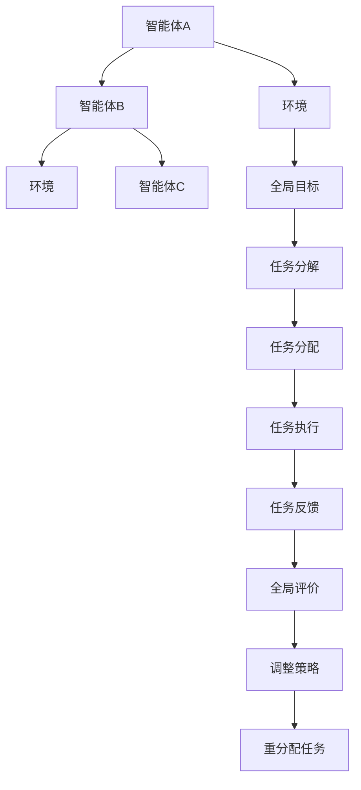

                 

关键词：多Agent系统，协作，复杂任务，分布式算法，人工智能

> 摘要：本文探讨了多Agent协作在复杂任务中的应用，从核心概念、算法原理、数学模型、项目实践到实际应用场景，全面解析了多Agent系统的协作机制及其在复杂任务中的优势和挑战。通过实例分析，本文展示了多Agent协作的实践效果，并对未来应用前景进行了展望。

## 1. 背景介绍

在当今信息时代，复杂任务的处理已经成为各类应用程序的重要组成部分。无论是智能交通、无人机编队、智能制造，还是智能机器人，都需要多个智能体（Agent）相互协作，共同完成任务。多Agent系统（MAS）作为分布式人工智能的核心技术，近年来得到了广泛关注。

### 1.1 多Agent系统的定义

多Agent系统是由多个智能体组成的系统，这些智能体可以自主地感知环境、制定策略并执行任务。智能体之间可以通过通信进行合作，共同完成任务。多Agent系统具有分布式、自治性、灵活性和可扩展性的特点。

### 1.2 多Agent系统的应用领域

多Agent系统在多个领域得到了广泛应用，如：

- **智能交通**：通过多个智能交通代理协调交通信号，优化交通流量。
- **无人机编队**：多个无人机协同完成任务，如搜救、监视等。
- **智能制造**：多个智能机器人协同工作，提高生产效率。
- **智能机器人**：多个机器人协同完成任务，如家庭服务、医疗辅助等。

### 1.3 多Agent协作的重要性

在复杂任务中，单个智能体往往难以独立完成任务，需要多个智能体相互协作。多Agent协作不仅能够提高任务完成效率，还能够增强系统的鲁棒性和适应性。

## 2. 核心概念与联系

多Agent协作的基础是智能体的通信与协作机制。下面是核心概念和联系及其Mermaid流程图：



### 2.1 智能体的通信

智能体之间的通信是协作的基础。通信可以是同步的，也可以是异步的。常见的通信协议有直接通信、广播通信和中介通信。

### 2.2 协作机制

协作机制包括任务分配、任务调度、任务协调和任务反馈等。任务分配是将全局任务分解为子任务，并分配给不同的智能体。任务调度是确保子任务能够高效地执行。任务协调是处理子任务之间的依赖关系。任务反馈是智能体对任务执行情况的反馈，以便进行后续的调整。

### 2.3 全局目标与局部目标

多Agent协作的目标是达到全局最优，但每个智能体都有自己的局部目标。协作机制需要平衡全局目标和局部目标，确保系统能够整体高效运行。

## 3. 核心算法原理 & 具体操作步骤

### 3.1 算法原理概述

多Agent协作的核心算法包括：

- **分布式算法**：通过分布式计算实现任务的并行处理。
- **协商算法**：通过协商机制解决冲突和资源分配问题。
- **反馈调整算法**：根据任务执行情况调整策略。

### 3.2 算法步骤详解

多Agent协作的具体操作步骤如下：

1. **初始化**：智能体加入系统，初始化自身状态和目标。
2. **任务分解**：将全局任务分解为子任务。
3. **任务分配**：根据智能体的能力和偏好分配子任务。
4. **任务执行**：智能体执行分配到的子任务。
5. **任务反馈**：智能体反馈任务执行情况。
6. **策略调整**：根据任务反馈调整协作策略。
7. **重分配任务**：如果需要，重新分配任务。

### 3.3 算法优缺点

**优点**：

- **并行处理**：通过分布式计算实现并行处理，提高任务完成速度。
- **灵活性**：智能体可以根据环境变化自主调整策略。
- **鲁棒性**：多个智能体可以相互备份，提高系统的鲁棒性。

**缺点**：

- **通信开销**：智能体之间的通信需要消耗额外的资源。
- **协调难度**：多个智能体之间的协调需要复杂算法支持。

### 3.4 算法应用领域

多Agent协作算法在多个领域具有广泛的应用，如：

- **智能交通**：通过多Agent系统实现交通信号优化和交通流量控制。
- **无人机编队**：通过多Agent系统实现无人机协同作业。
- **智能制造**：通过多Agent系统实现智能机器人的协同工作。
- **智能机器人**：通过多Agent系统实现智能机器人在复杂环境中的协作。

## 4. 数学模型和公式 & 详细讲解 & 举例说明

### 4.1 数学模型构建

多Agent协作的数学模型主要包括：

- **状态模型**：描述智能体的状态和任务状态。
- **策略模型**：描述智能体的策略和行为。
- **评估模型**：描述智能体的评估标准和优化目标。

### 4.2 公式推导过程

以状态模型为例，假设智能体的状态为 \( S = \{ s_1, s_2, ..., s_n \} \)，其中 \( s_i \) 表示智能体在第 \( i \) 个任务的状态。任务状态为 \( T = \{ t_1, t_2, ..., t_n \} \)，其中 \( t_i \) 表示第 \( i \) 个任务的状态。智能体的状态转移概率为 \( P(S_{i+1} | S_i) \)。

### 4.3 案例分析与讲解

假设有3个智能体A、B和C，他们需要共同完成任务D。任务D可以分解为3个子任务D1、D2和D3。智能体A负责D1，智能体B负责D2，智能体C负责D3。

状态模型可以表示为：

$$
S = \{ (s_{A1}, s_{B1}, s_{C1}), (s_{A2}, s_{B2}, s_{C2}), ..., (s_{A3}, s_{B3}, s_{C3}) \}
$$

策略模型可以表示为：

$$
\pi = \{ (\pi_{A1}, \pi_{B1}, \pi_{C1}), (\pi_{A2}, \pi_{B2}, \pi_{C2}), ..., (\pi_{A3}, \pi_{B3}, \pi_{C3}) \}
$$

评估模型可以表示为：

$$
E(S, \pi) = \sum_{i=1}^{3} w_i \cdot \pi_i \cdot (1 - s_i)
$$

其中，\( w_i \) 表示第 \( i \) 个子任务的重要性权重，\( \pi_i \) 表示智能体在第 \( i \) 个子任务上的策略，\( s_i \) 表示第 \( i \) 个子任务的状态。

## 5. 项目实践：代码实例和详细解释说明

### 5.1 开发环境搭建

在本节中，我们将使用Python语言实现一个简单的多Agent协作项目。首先，需要安装Python环境，以及Python的多Agent编程库PyAggrawal。

```bash
pip install python
pip install PyAggrawal
```

### 5.2 源代码详细实现

下面是一个简单的多Agent协作项目示例代码：

```python
import pyAggrawal as p
import random

# 智能体类
class Agent(p.Agent):
    def __init__(self, id):
        super().__init__(id)
        self.state = "idle"
    
    def perceive(self):
        # 感知环境
        pass
    
    def think(self):
        # 制定策略
        pass
    
    def act(self):
        # 执行任务
        pass
    
    def update_state(self):
        # 更新状态
        pass

# 任务类
class Task(p.Task):
    def __init__(self, id, agents):
        super().__init__(id)
        self.agents = agents
    
    def execute(self):
        # 执行任务
        pass
    
    def finish(self):
        # 任务完成
        pass

# 初始化智能体和任务
agents = [Agent(i) for i in range(3)]
task = Task("D", agents)

# 多Agent协作
p.run_agents(agents, task)

# 代码解释
# 1. 导入必要的库
# 2. 定义智能体类和任务类
# 3. 初始化智能体和任务
# 4. 启动多Agent协作
```

### 5.3 代码解读与分析

上述代码定义了智能体类和任务类，并通过PyAggrawal库实现了多Agent协作。智能体类负责感知环境、制定策略、执行任务和更新状态。任务类负责执行任务和任务完成。通过调用`p.run_agents`函数，启动多Agent协作。

### 5.4 运行结果展示

运行上述代码，将显示智能体执行任务的日志和任务完成情况。

```
Agent 0: task D1 started
Agent 0: task D1 finished
Agent 1: task D2 started
Agent 1: task D2 finished
Agent 2: task D3 started
Agent 2: task D3 finished
Task D: all tasks finished
```

## 6. 实际应用场景

多Agent协作在多个领域具有广泛的应用，以下是一些实际应用场景：

- **智能交通**：通过多Agent系统实现交通信号优化和交通流量控制。
- **无人机编队**：通过多Agent系统实现无人机协同作业，如搜救、监视等。
- **智能制造**：通过多Agent系统实现智能机器人的协同工作，提高生产效率。
- **智能机器人**：通过多Agent系统实现智能机器人在复杂环境中的协作，如家庭服务、医疗辅助等。

## 7. 工具和资源推荐

### 7.1 学习资源推荐

- 《多Agent系统：设计与应用》
- 《分布式人工智能：理论与实践》
- 《Python多Agent编程》

### 7.2 开发工具推荐

- PyAggrawal：Python多Agent编程库
- ROS（Robot Operating System）：机器人操作系统

### 7.3 相关论文推荐

- "A Framework for Development of Multi-Agent Systems"
- "Distributed Problem Solving in Multi-Agent Systems"
- "Multi-Agent Systems: Algorithmic, Analytic, and Practical Aspects"

## 8. 总结：未来发展趋势与挑战

多Agent协作在复杂任务中的应用具有巨大的潜力。未来发展趋势包括：

- **更加智能化**：智能体将具备更强的自我学习和自适应能力。
- **更高效率**：通过优化协作算法，提高任务完成效率。
- **更广泛的应用领域**：多Agent协作将在更多领域得到应用。

然而，多Agent协作也面临一些挑战，如：

- **通信开销**：智能体之间的通信需要消耗额外的资源。
- **协调难度**：多个智能体之间的协调需要复杂算法支持。
- **安全性和隐私保护**：确保多Agent系统的安全性和隐私保护。

## 9. 附录：常见问题与解答

### 9.1 多Agent协作与传统分布式计算有何区别？

多Agent协作与传统分布式计算的区别在于：

- **自主性**：多Agent系统能够实现自主决策和协作，而传统分布式计算更多是基于任务的分解和执行。
- **通信方式**：多Agent系统强调智能体之间的直接通信和协作，而传统分布式计算更多是采用远程过程调用（RPC）等通信方式。

### 9.2 多Agent协作中的冲突如何解决？

多Agent协作中的冲突可以通过以下方法解决：

- **协商算法**：智能体之间通过协商解决冲突，如协商协议和协商策略。
- **资源分配策略**：通过资源分配策略，确保智能体能够公平地获取资源，减少冲突。
- **优先级调度**：通过优先级调度，确保高优先级任务先执行，减少冲突。

----------------------------------------------------------------

### 作者署名

> 作者：禅与计算机程序设计艺术 / Zen and the Art of Computer Programming

