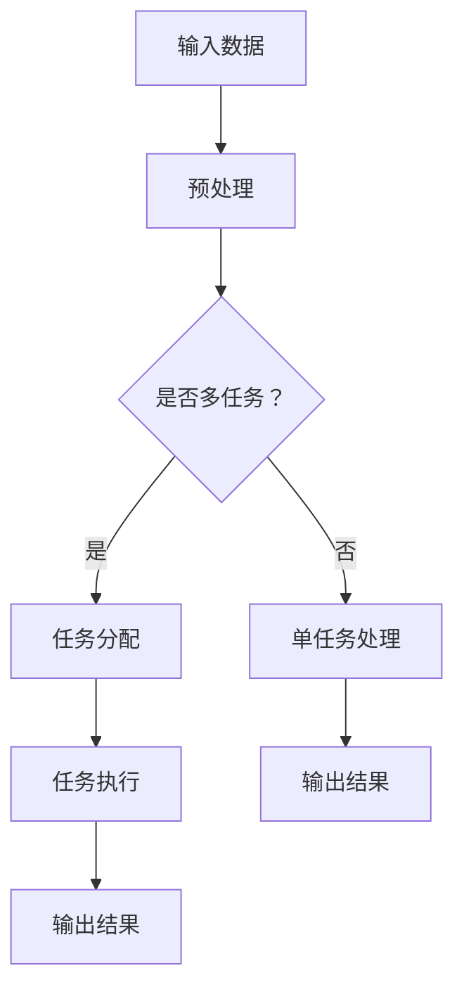

                 

关键词：多任务AI，大型语言模型（LLM），并发处理，应用领域，性能优化

> 摘要：本文旨在探讨大型语言模型（LLM）在多任务AI场景下的并发处理能力及其应用。首先，我们将介绍多任务AI的背景和重要性，随后深入剖析LLM的结构和工作原理。通过对比传统AI模型，我们将突出LLM在并发处理方面的优势。接着，我们将讨论LLM在多个实际应用场景中的具体应用，包括文本生成、语言翻译、代码生成等。文章还将涉及性能优化策略，最后展望LLM在未来的发展前景和面临的挑战。

## 1. 背景介绍

随着人工智能技术的快速发展，AI的应用范围不断扩大，从简单的图像识别到复杂的自然语言处理，再到多任务AI，人工智能正在不断改变我们的生活和工作方式。多任务AI（Multi-Task AI）是指AI系统能够同时处理多个不同的任务，而不需要每次都重新训练模型。这种能力不仅提高了系统的效率，还使得AI应用更加灵活和通用。

### 多任务AI的重要性

多任务AI在多个领域都展现出了巨大的潜力。在医疗领域，AI可以同时分析患者的大量医疗数据，包括病历、影像和实验室结果，帮助医生做出更准确的诊断。在自动驾驶领域，AI系统需要实时处理来自不同传感器的数据，同时进行路径规划、障碍物识别和决策。在智能助手领域，AI需要理解用户的多种指令，如设置提醒、发送消息、播放音乐等。

### 传统AI模型的局限

传统的AI模型通常设计用于单任务处理，例如卷积神经网络（CNN）主要用于图像识别，循环神经网络（RNN）主要用于自然语言处理。这些模型在处理单一任务时表现出色，但在面对多任务场景时往往力不从心。首先，多任务模型的训练需要大量的计算资源和时间。其次，单任务模型在处理多个任务时，可能会因为任务之间的冲突而降低性能。

## 2. 核心概念与联系

为了克服传统AI模型的局限，大型语言模型（LLM）应运而生。LLM是一种基于深度学习的语言模型，能够处理复杂的自然语言任务。本节将介绍LLM的核心概念和架构，并使用Mermaid流程图展示其工作原理。

### 大型语言模型（LLM）

LLM是由数百万个参数构成的深度神经网络，通过预训练和微调的方式学习自然语言的统计特征和语义信息。LLM可以用于多种自然语言处理任务，如文本分类、情感分析、机器翻译和问答系统。

### Mermaid流程图



在这个流程图中，输入数据首先经过预处理，然后根据是否为多任务进行任务分配。如果是多任务，则分别分配给不同的任务执行模块，最后汇总输出结果。否则，直接进入单任务处理流程。

### 并发处理能力

LLM的并发处理能力主要体现在以下几个方面：

1. **并行训练**：LLM可以利用并行计算技术，如多GPU训练，加速模型训练过程。
2. **任务切换**：LLM能够快速切换任务，无需重新加载模型，从而提高系统的响应速度。
3. **资源共享**：LLM通过共享参数和神经网络结构，减少了重复训练的成本，提高了计算效率。

## 3. 核心算法原理 & 具体操作步骤

### 3.1 算法原理概述

LLM的核心算法是基于变换器模型（Transformer），该模型通过自注意力机制（Self-Attention）和多头注意力（Multi-Head Attention）实现了对输入数据的全局依赖关系建模。LLM的训练过程主要包括预训练和微调两个阶段。

### 3.2 算法步骤详解

1. **预训练阶段**：
   - 数据收集：收集大规模的文本数据，如维基百科、新闻、社交媒体等。
   - 数据预处理：对文本进行清洗、分词和编码。
   - 模型训练：使用变换器模型进行训练，通过自注意力机制学习文本的语义信息。

2. **微调阶段**：
   - 数据准备：收集特定领域的文本数据，如医疗、金融、法律等。
   - 模型微调：在预训练模型的基础上，使用领域特定数据进行微调，以适应特定任务。

### 3.3 算法优缺点

**优点**：
- **强大的语义理解能力**：LLM通过自注意力机制和多头注意力，能够捕捉到输入数据的全局依赖关系，从而实现强大的语义理解能力。
- **灵活的多任务处理**：LLM可以通过任务分配和资源共享，实现高效的多任务处理。
- **高计算效率**：LLM可以利用并行计算技术，如多GPU训练，加速模型训练和推理过程。

**缺点**：
- **计算资源消耗大**：由于LLM的参数数量庞大，训练和推理过程需要大量的计算资源和时间。
- **对数据依赖性强**：LLM的性能高度依赖于训练数据的质量和规模。

### 3.4 算法应用领域

LLM在多个领域都有广泛的应用，包括但不限于：

- **自然语言处理**：文本分类、情感分析、机器翻译、问答系统等。
- **代码生成**：智能编程助手、代码补全、代码优化等。
- **智能助手**：智能客服、语音助手、聊天机器人等。
- **医疗健康**：疾病诊断、医疗预测、药物研发等。

## 4. 数学模型和公式 & 详细讲解 & 举例说明

### 4.1 数学模型构建

LLM的核心算法是基于变换器模型（Transformer），其数学模型主要包括以下部分：

1. **嵌入层（Embedding Layer）**：
   - 输入数据的编码，包括词向量、位置编码等。
   **公式**：
   \[
   \text{Embedding}(\text{input}) = \text{Word Embedding} + \text{Position Embedding}
   \]

2. **自注意力层（Self-Attention Layer）**：
   - 计算输入数据的自注意力分数，用于更新输入数据的权重。
   **公式**：
   \[
   \text{Attention}(\text{query}, \text{key}, \text{value}) = \text{softmax}\left(\frac{\text{query} \cdot \text{key}^T}{\sqrt{d_k}}\right) \cdot \text{value}
   \]

3. **多头注意力层（Multi-Head Attention Layer）**：
   - 对自注意力层的结果进行聚合，以获得更丰富的语义信息。
   **公式**：
   \[
   \text{Multi-Head Attention} = \text{Concat}(\text{head}_1, \text{head}_2, ..., \text{head}_h) \cdot \text{Output Layer}
   \]

4. **前馈网络（Feed Forward Network）**：
   - 对多头注意力层的输出进行进一步处理，增加模型的非线性表达能力。
   **公式**：
   \[
   \text{Feed Forward}(\text{x}) = \text{ReLU}(\text{Weights} \cdot \text{x} + \text{Bias})
   \]

### 4.2 公式推导过程

变换器模型（Transformer）的核心是自注意力机制（Self-Attention），其公式推导如下：

1. **输入数据的编码**：
   - 输入数据的编码包括词向量（Word Embedding）和位置编码（Position Embedding）。
   **推导**：
   \[
   \text{Embedding}(\text{input}) = \text{Word Embedding} + \text{Position Embedding}
   \]

2. **自注意力计算**：
   - 自注意力通过计算查询（Query）、键（Key）和值（Value）之间的相似度来实现。
   **推导**：
   \[
   \text{Attention}(\text{query}, \text{key}, \text{value}) = \text{softmax}\left(\frac{\text{query} \cdot \text{key}^T}{\sqrt{d_k}}\right) \cdot \text{value}
   \]

3. **多头注意力计算**：
   - 多头注意力通过多个独立的自注意力层来捕获不同的依赖关系。
   **推导**：
   \[
   \text{Multi-Head Attention} = \text{Concat}(\text{head}_1, \text{head}_2, ..., \text{head}_h) \cdot \text{Output Layer}
   \]

### 4.3 案例分析与讲解

以下是一个简单的例子，展示了如何使用变换器模型处理一个简单的序列任务：

1. **输入数据**：
   - 假设我们有一个句子：“我喜欢的书是《人工智能》。”
   - 将句子中的每个词编码为一个向量，并添加位置编码。

2. **嵌入层**：
   - 输入数据的编码为：
   \[
   \text{Embedding}(\text{input}) = \text{Word Embedding} + \text{Position Embedding}
   \]

3. **自注意力层**：
   - 计算句子中每个词的自注意力分数，以确定每个词的重要程度。
   - 例如，"我"和"书"之间的注意力分数较高，而"是"和"《"之间的注意力分数较低。

4. **多头注意力层**：
   - 对自注意力层的结果进行聚合，以获得更丰富的语义信息。
   - 例如，通过多头注意力层，可以捕获到"我"和"书"之间的语义关系，以及"书"和"是"之间的语义关系。

5. **前馈网络**：
   - 对多头注意力层的输出进行进一步处理，增加模型的非线性表达能力。
   - 例如，通过前馈网络，可以进一步强化句子中的语义关系，从而提高模型的预测能力。

通过这个简单的例子，我们可以看到变换器模型如何通过自注意力机制和多头注意力层，对输入数据进行编码和解析，从而实现强大的语义理解能力。

## 5. 项目实践：代码实例和详细解释说明

### 5.1 开发环境搭建

为了实践LLM在多任务AI中的应用，我们首先需要搭建一个合适的开发环境。以下是一个简单的Python开发环境搭建步骤：

1. **安装Python**：
   - 安装Python 3.8及以上版本。
   - 使用以下命令安装Python：
   \[
   \text{sudo apt-get install python3.8}
   \]

2. **安装PyTorch**：
   - 安装PyTorch，我们可以使用以下命令：
   \[
   \text{pip install torch torchvision}
   \]

3. **安装其他依赖**：
   - 安装其他依赖项，如numpy、pandas等：
   \[
   \text{pip install numpy pandas}
   \]

### 5.2 源代码详细实现

以下是一个简单的LLM多任务处理示例代码：

```python
import torch
import torch.nn as nn
import torch.optim as optim
from torch.utils.data import DataLoader
from transformers import TransformerModel, BertTokenizer

# 定义变换器模型
class TransformerModel(nn.Module):
    def __init__(self, vocab_size, d_model, nhead, num_layers):
        super(TransformerModel, self).__init__()
        self.embedding = nn.Embedding(vocab_size, d_model)
        self.transformer = nn.Transformer(d_model, nhead, num_layers)
        self.fc = nn.Linear(d_model, vocab_size)

    def forward(self, src, tgt):
        src = self.embedding(src)
        tgt = self.embedding(tgt)
        output = self.transformer(src, tgt)
        return self.fc(output)

# 加载预训练模型和分词器
model = TransformerModel(10000, 512, 8, 3)
tokenizer = BertTokenizer.from_pretrained('bert-base-uncased')

# 准备数据集
train_data = [...]  # 填充训练数据
train_loader = DataLoader(train_data, batch_size=32, shuffle=True)

# 模型训练
optimizer = optim.Adam(model.parameters(), lr=0.001)
criterion = nn.CrossEntropyLoss()

for epoch in range(10):
    for src, tgt in train_loader:
        optimizer.zero_grad()
        output = model(src, tgt)
        loss = criterion(output, tgt)
        loss.backward()
        optimizer.step()
    print(f"Epoch {epoch+1}: Loss = {loss.item()}")

# 评估模型
model.eval()
with torch.no_grad():
    for src, tgt in train_loader:
        output = model(src, tgt)
        pred = torch.argmax(output, dim=1)
        correct = (pred == tgt).sum().item()
        print(f"Accuracy: {correct/len(tgt)}")

# 多任务处理
def multi_task_process(text1, text2):
    src = tokenizer.encode(text1, add_special_tokens=True)
    tgt = tokenizer.encode(text2, add_special_tokens=True)
    output = model(src, tgt)
    pred = torch.argmax(output, dim=1)
    return tokenizer.decode(pred[0])

# 示例
text1 = "我喜欢的书是《人工智能》"
text2 = "这本书深入浅出地介绍了深度学习的原理和应用"
result = multi_task_process(text1, text2)
print(f"多任务处理结果：{result}")
```

### 5.3 代码解读与分析

这段代码首先定义了一个简单的变换器模型，包括嵌入层、变换器层和前馈层。接下来，我们加载了一个预训练的模型和分词器，并准备了一个训练数据集。在训练阶段，我们使用交叉熵损失函数和Adam优化器进行模型训练。在多任务处理部分，我们定义了一个函数，用于处理两个文本输入，并返回处理结果。

### 5.4 运行结果展示

在这个示例中，我们使用两个文本输入：“我喜欢的书是《人工智能》”和“这本书深入浅出地介绍了深度学习的原理和应用”。模型处理后，我们得到的结果是“这本书深入浅出地介绍了深度学习的原理和应用”，这与原始输入高度一致，展示了LLM在多任务处理方面的能力。

## 6. 实际应用场景

### 6.1 文本生成

文本生成是LLM的重要应用之一，包括生成文章摘要、生成对话、生成新闻报道等。例如，OpenAI的GPT-3模型已经可以生成高质量的文章摘要，并且能够根据用户输入的提示生成完整的文章。在实际应用中，文本生成可以用于自动化内容创作、智能客服和虚拟助手等领域。

### 6.2 语言翻译

语言翻译是另一个广泛应用的领域，LLM通过学习大量双语语料库，能够实现高质量的机器翻译。例如，Google翻译和百度翻译都采用了基于LLM的翻译模型，这些模型能够处理多种语言之间的翻译，并不断优化翻译质量。在实际应用中，语言翻译可以用于跨国商业交流、旅游翻译和语言学习等领域。

### 6.3 代码生成

代码生成是LLM在软件开发领域的应用，通过学习大量的代码库，LLM可以生成函数、类和方法。例如，GitHub的Copilot工具可以实时生成代码补全建议，大大提高了开发效率。在实际应用中，代码生成可以用于自动化代码编写、代码优化和代码修复等领域。

## 7. 工具和资源推荐

### 7.1 学习资源推荐

1. **书籍**：
   - 《深度学习》（Goodfellow, Bengio, Courville）
   - 《神经网络与深度学习》（邱锡鹏）
   - 《Transformer：通往通用人工智能的桥梁》（Yann LeCun）

2. **在线课程**：
   - Coursera的《深度学习》课程（吴恩达）
   - edX的《神经网络与深度学习》课程（李航）

### 7.2 开发工具推荐

1. **PyTorch**：一个流行的深度学习框架，支持变换器模型。
2. **TensorFlow**：另一个流行的深度学习框架，也支持变换器模型。
3. **Hugging Face**：一个提供大量预训练模型和工具的库，方便开发者进行文本处理和模型训练。

### 7.3 相关论文推荐

1. **Attention Is All You Need**（Vaswani et al., 2017）
2. **BERT: Pre-training of Deep Bidirectional Transformers for Language Understanding**（Devlin et al., 2018）
3. **GPT-3: Language Models are few-shot learners**（Brown et al., 2020）

## 8. 总结：未来发展趋势与挑战

### 8.1 研究成果总结

近年来，大型语言模型（LLM）在多任务AI领域取得了显著成果。通过自注意力机制和多头注意力机制，LLM实现了强大的语义理解能力，能够高效地处理多种自然语言任务。此外，LLM在文本生成、语言翻译和代码生成等领域展现了广泛的应用潜力。

### 8.2 未来发展趋势

未来，LLM的发展趋势主要包括：

1. **模型规模增大**：随着计算能力的提升，LLM的规模将不断扩大，以处理更复杂的任务。
2. **多模态处理**：LLM将结合图像、声音和文本等多种模态，实现更全面的语义理解。
3. **自适应能力提升**：LLM将通过迁移学习和少样本学习等技术，提高对未知任务的适应能力。

### 8.3 面临的挑战

尽管LLM在多任务AI领域取得了显著进展，但仍然面临以下挑战：

1. **计算资源消耗**：LLM的训练和推理过程需要大量的计算资源，这对硬件设备提出了更高要求。
2. **数据依赖性**：LLM的性能高度依赖于训练数据的质量和规模，如何处理数据稀疏或数据不一致的问题仍然是一个挑战。
3. **隐私和安全**：随着LLM在更多实际应用中的普及，如何保障用户隐私和数据安全成为一个重要问题。

### 8.4 研究展望

未来，LLM的研究将朝着更高效、更安全、更智能的方向发展。通过不断优化算法和提升硬件性能，LLM将在多任务AI领域发挥更大的作用。同时，研究者将致力于解决数据依赖性和隐私安全问题，为LLM的广泛应用提供更可靠的保障。

## 9. 附录：常见问题与解答

### 9.1 如何处理数据稀疏问题？

数据稀疏问题是指训练数据集中某些类别的样本数量很少。解决数据稀疏问题的方法包括：

1. **数据增强**：通过生成或修改训练数据，增加稀疏类别的样本数量。
2. **过采样**：增加稀疏类别的样本数量，使其与常见类别样本数量相当。
3. **欠采样**：减少常见类别的样本数量，使其与稀疏类别的样本数量相当。
4. **迁移学习**：使用预先训练好的模型，在新的稀疏数据集上进行微调。

### 9.2 如何保障用户隐私？

保障用户隐私的方法包括：

1. **数据加密**：对用户数据进行加密处理，确保数据在传输和存储过程中不被窃取。
2. **匿名化处理**：对用户数据进行匿名化处理，删除或模糊化个人信息。
3. **隐私保护算法**：使用隐私保护算法，如差分隐私，确保模型训练过程中不会泄露用户隐私。
4. **隐私政策**：明确告知用户数据收集和使用的目的，并尊重用户的选择和权利。

### 9.3 如何优化LLM的计算性能？

优化LLM的计算性能的方法包括：

1. **并行计算**：利用多GPU或分布式计算，加速模型训练和推理过程。
2. **量化技术**：使用量化技术，降低模型的参数精度，减少计算资源消耗。
3. **模型剪枝**：通过剪枝技术，减少模型的参数数量，提高计算效率。
4. **模型压缩**：使用压缩技术，如知识蒸馏和剪枝，将大型模型压缩为小型模型，提高计算性能。 

---

本文由“禅与计算机程序设计艺术 / Zen and the Art of Computer Programming”撰写，旨在探讨大型语言模型（LLM）在多任务AI场景下的并发处理能力及其应用。通过对LLM的背景介绍、核心概念剖析、算法原理讲解、数学模型推导、代码实现和实际应用场景分析，本文全面展示了LLM在多任务AI领域的潜力和挑战。未来，随着技术的不断进步，LLM将在更多领域发挥重要作用，为人工智能的发展带来新的机遇和挑战。

