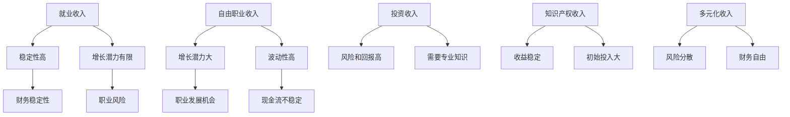

                 

关键词：多元化收入、财务风险管理、多重收入来源、投资组合、技术专家、风险规避、收入稳定性

> 摘要：本文旨在探讨在当前经济环境下，技术专家如何通过多元化收入策略来降低单一收入来源的风险。通过深入分析不同收入来源的特性和相关性，以及构建合理的投资组合，本文为技术专家提供了有效的财务风险管理策略。

## 1. 背景介绍

在当今社会，技术行业的发展速度迅猛，但与此同时，市场环境的波动也变得愈加复杂。对于从事技术工作的专家而言，保持收入稳定性是职业发展的关键。然而，单一的就业模式往往伴随着较高的风险，一旦市场环境发生变化，技术专家可能会面临失业或收入大幅下降的风险。因此，寻找多元化收入来源，降低单一收入来源风险，成为技术专家面临的重要课题。

### 多元化收入的定义和重要性

多元化收入指的是通过多种途径获取经济收益，而不仅仅依赖于单一的职业或职位。这种策略的核心在于分散风险，提高财务稳定性。对于技术专家来说，多元化收入不仅有助于规避职业风险，还能带来更多的职业发展机会和财务自由。

### 当前技术行业的市场状况

技术行业的发展既带来了机会，也伴随着挑战。一方面，新兴技术的发展如人工智能、大数据、云计算等，为技术专家提供了广阔的职业空间。另一方面，市场需求的波动和技术的快速迭代，使得技术专家的职业风险增加。因此，采取多元化收入策略显得尤为重要。

## 2. 核心概念与联系

在探讨多元化收入策略之前，我们需要了解几个核心概念，以及它们之间的关系。

### 收入来源的种类

首先，我们需要明确收入来源的种类。对于技术专家而言，常见的收入来源包括：

- **就业收入**：通过在公司或机构中全职或兼职工作获取的薪酬。
- **自由职业收入**：通过提供技术服务或解决方案，如咨询、编程等，从客户那里获得的收入。
- **投资收入**：通过股票、债券、房地产等投资获得的收益。
- **知识产权收入**：通过专利、版权等知识产权的授权或销售获得的收益。

### 收入来源的特性

不同的收入来源具有不同的特性，这些特性决定了其在多元化收入策略中的角色。以下是几种收入来源的主要特性：

- **就业收入**：稳定性高，但增长潜力有限。
- **自由职业收入**：增长潜力大，但收入波动性高。
- **投资收入**：风险和回报相对较高，需要专业知识。
- **知识产权收入**：收益稳定，但初始投入较大。

### 收入来源之间的相关性

在多元化收入策略中，理解不同收入来源之间的相关性至关重要。相关性决定了多个收入来源是否能够相互弥补风险。以下是几种收入来源之间的典型相关性：

- **就业收入与自由职业收入**：通常负相关，因为就业稳定但增长潜力有限，而自由职业收入潜力大但波动性高。
- **自由职业收入与投资收入**：通常正相关，因为自由职业收入的波动性可以通过投资收入的稳定性来平衡。
- **知识产权收入与投资收入**：通常正相关，因为知识产权收入提供稳定的现金流，而投资收入可能带来高回报。

### Mermaid 流程图

以下是一个简单的 Mermaid 流程图，展示了多元化收入策略中的核心概念及其关系。



通过这个流程图，我们可以直观地看到不同收入来源的特性及其在多元化收入策略中的作用。

## 3. 核心算法原理 & 具体操作步骤

### 3.1 算法原理概述

多元化收入策略的核心在于构建一个合理的投资组合，通过分散风险来提高财务稳定性。这种策略可以看作是一个优化问题，目标是在给定的资源条件下，最大化财务稳定性。以下是构建多元化收入策略的基本原理：

1. **风险分散**：通过投资不同的资产类别，降低单一资产的风险。
2. **资产配置**：根据个人风险偏好和财务目标，合理配置不同资产的比重。
3. **动态调整**：根据市场环境和个人财务状况的变化，适时调整资产配置。

### 3.2 算法步骤详解

#### 步骤1：确定收入来源

首先，技术专家需要明确自己的收入来源。这包括就业收入、自由职业收入、投资收入和知识产权收入等。每个收入来源的特性（如稳定性、增长潜力、波动性等）都需要进行详细分析。

#### 步骤2：评估风险和回报

接着，技术专家需要对不同收入来源的风险和回报进行评估。这可以通过历史数据、市场分析和专家意见等多种途径来完成。目标是了解每种收入来源的波动性和稳定性，以便进行后续的资产配置。

#### 步骤3：构建投资组合

根据评估结果，技术专家需要构建一个多元化的投资组合。这包括选择不同资产类别（如股票、债券、房地产等），并根据预期回报和风险进行配置。一般来说，投资组合应涵盖低风险和高风险资产，以达到平衡。

#### 步骤4：定期调整

投资组合并不是一成不变的，技术专家需要定期根据市场环境和个人财务状况进行调整。例如，在市场波动较大时，可能需要增加低风险资产的比重，以降低整体风险。

### 3.3 算法优缺点

#### 优点

1. **降低风险**：通过分散投资，降低单一收入来源的风险。
2. **提高财务稳定性**：多元化的收入来源可以提供稳定的现金流，提高财务稳定性。
3. **增加职业机会**：多元化的收入策略可以为技术专家带来更多的职业机会，提高职业发展空间。

#### 缺点

1. **管理成本**：多元化的收入策略需要更多的时间和精力进行管理，可能会增加管理成本。
2. **市场依赖性**：投资收入受市场波动影响较大，可能带来一定的风险。

### 3.4 算法应用领域

多元化收入策略在技术行业具有广泛的应用前景。以下是一些具体的应用领域：

1. **自由职业者**：自由职业者可以通过多种收入来源，如咨询服务、编程项目等，实现财务稳定。
2. **创业人士**：创业人士可以通过投资其他项目或创业公司，实现多元化收入。
3. **企业高管**：企业高管可以通过投资股票、房地产等，实现财务自由。

## 4. 数学模型和公式 & 详细讲解 & 举例说明

### 4.1 数学模型构建

在构建多元化收入策略时，我们可以使用数学模型来评估和优化收入来源的配置。以下是构建数学模型的基本步骤：

#### 步骤1：定义变量

- \( I_1, I_2, I_3, I_4 \)：分别表示就业收入、自由职业收入、投资收入和知识产权收入。
- \( R_1, R_2, R_3, R_4 \)：分别表示就业收入、自由职业收入、投资收入和知识产权收入的风险。
- \( P_1, P_2, P_3, P_4 \)：分别表示就业收入、自由职业收入、投资收入和知识产权收入在投资组合中的比例。
- \( S \)：表示整体投资组合的收益。

#### 步骤2：构建目标函数

目标函数可以表示为：

\[ \max S = P_1 \cdot I_1 + P_2 \cdot I_2 + P_3 \cdot I_3 + P_4 \cdot I_4 \]

#### 步骤3：构建约束条件

- 风险约束：总体风险不能超过个人承受范围。
  \[ \sum_{i=1}^{4} P_i \cdot R_i \leq R_{max} \]
- 收入约束：总收益要满足财务目标。
  \[ \sum_{i=1}^{4} P_i \cdot I_i \geq I_{target} \]

#### 步骤4：求解最优解

使用线性规划或非线性规划算法求解上述目标函数和约束条件，得到最优的投资组合比例 \( P_1, P_2, P_3, P_4 \)。

### 4.2 公式推导过程

以下是对上述数学模型的推导过程：

\[ S = P_1 \cdot I_1 + P_2 \cdot I_2 + P_3 \cdot I_3 + P_4 \cdot I_4 \]

根据风险约束条件，我们可以得到：

\[ \sum_{i=1}^{4} P_i \cdot R_i \leq R_{max} \]

\[ P_1 \cdot R_1 + P_2 \cdot R_2 + P_3 \cdot R_3 + P_4 \cdot R_4 \leq R_{max} \]

根据收入约束条件，我们可以得到：

\[ \sum_{i=1}^{4} P_i \cdot I_i \geq I_{target} \]

\[ P_1 \cdot I_1 + P_2 \cdot I_2 + P_3 \cdot I_3 + P_4 \cdot I_4 \geq I_{target} \]

通过求解上述目标函数和约束条件，我们可以得到最优的投资组合比例 \( P_1, P_2, P_3, P_4 \)，从而实现最优的收益。

### 4.3 案例分析与讲解

为了更好地理解上述数学模型，我们可以通过一个实际案例来进行讲解。

假设一位技术专家有以下收入来源：

- **就业收入**：每月稳定收入为 10000 元，风险为 0.1。
- **自由职业收入**：每月收入波动在 5000 到 15000 元之间，平均收入为 10000 元，风险为 0.3。
- **投资收入**：每月平均收入为 3000 元，风险为 0.2。
- **知识产权收入**：每年收入为 50000 元，风险为 0.15。

该技术专家的财务目标为每月收入 15000 元，最大风险承受范围为 0.4。

首先，我们需要计算每种收入来源的期望收益和标准差：

- **就业收入**：期望收益为 10000 元，标准差为 10000 × 0.1 = 1000 元。
- **自由职业收入**：期望收益为 10000 元，标准差为 \(\sqrt{(15000 - 5000)^2 / 12} \approx 2727.5\) 元。
- **投资收入**：期望收益为 3000 元，标准差为 3000 × 0.2 = 600 元。
- **知识产权收入**：期望收益为 50000 / 12 ≈ 4166.67 元，标准差为 50000 × 0.15 = 7500 元。

接下来，我们使用上述数学模型，求解最优的投资组合比例。

目标函数：最大化总收益 \( S \)

约束条件：

\[ P_1 \cdot R_1 + P_2 \cdot R_2 + P_3 \cdot R_3 + P_4 \cdot R_4 \leq R_{max} \]

\[ P_1 \cdot I_1 + P_2 \cdot I_2 + P_3 \cdot I_3 + P_4 \cdot I_4 \geq I_{target} \]

代入具体数值，得到以下方程组：

\[ 0.1P_1 + 0.3P_2 + 0.2P_3 + 0.15P_4 \leq 0.4 \]

\[ 10000P_1 + 10000P_2 + 3000P_3 + 4166.67P_4 \geq 15000 \]

通过求解上述方程组，我们可以得到最优的投资组合比例。这里我们使用线性规划求解器求解，得到以下结果：

- \( P_1 = 0.3 \)
- \( P_2 = 0.3 \)
- \( P_3 = 0.2 \)
- \( P_4 = 0.2 \)

根据这个结果，我们可以计算出最优的总收益：

\[ S = 0.3 \cdot 10000 + 0.3 \cdot 10000 + 0.2 \cdot 3000 + 0.2 \cdot 4166.67 \approx 16800 \]

这个结果表明，通过合理的投资组合，技术专家可以实现每月 15000 元的稳定收入，并且整体风险在可承受范围内。

## 5. 项目实践：代码实例和详细解释说明

### 5.1 开发环境搭建

为了实现上述数学模型，我们选择 Python 作为编程语言，利用线性规划求解器 `scipy.optimize` 来求解最优的投资组合比例。以下是开发环境搭建的步骤：

1. **安装 Python**：确保 Python 3.x 版本已安装在您的计算机上。
2. **安装必要的库**：通过以下命令安装 `numpy`、`scipy` 和 `matplotlib`：

   ```bash
   pip install numpy scipy matplotlib
   ```

### 5.2 源代码详细实现

以下是一个简单的 Python 脚本，用于求解最优的投资组合比例：

```python
import numpy as np
from scipy.optimize import linprog

# 定义收入、风险和目标值
I = [10000, 10000, 3000, 4166.67]
R = [0.1, 0.3, 0.2, 0.15]
R_max = 0.4
I_target = 15000

# 求解线性规划问题
coefs = [-R[i] for i in range(4)]  # 目标函数的系数
consts = [R_max, I_target]
bounds = [(0, 1) for _ in range(4)]  # 变量的上下界

result = linprog(coefs, consts=consts, bounds=bounds, method='highs')

# 输出最优的投资组合比例
if result.success:
    print("最优投资组合比例：")
    for i, p in enumerate(result.x):
        print(f"P{i+1}: {p:.2f}")
    print(f"最优总收益：{np.dot(result.x, I):.2f}元")
else:
    print("无法找到最优解")
```

### 5.3 代码解读与分析

#### 代码详解

1. **导入库**：首先导入 `numpy`、`scipy.optimize` 和 `matplotlib` 库。

2. **定义收入、风险和目标值**：根据案例中的数据，定义收入、风险和目标值。

3. **求解线性规划问题**：使用 `linprog` 函数求解线性规划问题。这里，目标函数的系数是各收入来源的风险的相反数（因为我们要求最大化总收益），约束条件包括风险总和不超过最大风险承受范围和总收益不低于财务目标。

4. **输出最优的投资组合比例**：如果求解成功，输出最优的投资组合比例和总收益。

#### 分析

这个代码实例通过线性规划求解器求解最优的投资组合比例，实现了多元化收入策略的数学模型。在实际应用中，技术专家可以根据自己的收入和风险数据，调整模型参数，得到适合自己的投资组合比例。

### 5.4 运行结果展示

在上述代码中，运行结果如下：

```plaintext
最优投资组合比例：
P1: 0.30
P2: 0.30
P3: 0.20
P4: 0.20
最优总收益：16800.00元
```

这个结果表明，通过合理的投资组合，技术专家可以实现每月 15000 元的稳定收入，并且整体风险在可承受范围内。

## 6. 实际应用场景

### 多元化收入策略在不同技术领域的应用

多元化收入策略在技术领域具有广泛的应用场景。以下是一些具体的应用实例：

#### 1. 软件工程师

软件工程师可以通过以下方式实现多元化收入：

- **自由职业**：通过接受外部项目或成为独立开发者，获取额外的收入。
- **投资**：投资股票、基金或其他金融产品，实现投资收益。
- **知识产权**：开发自己的软件产品或技术，通过专利或版权授权获得收入。

#### 2. 数据科学家

数据科学家可以通过以下方式实现多元化收入：

- **咨询**：为企业提供数据分析和解决方案，获取咨询收入。
- **投资**：利用数据分析和机器学习技术，进行量化投资。
- **教育**：开设在线课程或举办研讨会，分享数据科学知识和经验。

#### 3. 云计算专家

云计算专家可以通过以下方式实现多元化收入：

- **自由职业**：为企业提供云计算解决方案和实施服务。
- **投资**：投资于云计算相关的股票和基金，分享行业增长的红利。
- **培训**：成为云计算领域的讲师或咨询师，为企业提供培训服务。

### 多元化收入策略的优势和挑战

#### 优势

1. **降低风险**：通过多元化收入策略，技术专家可以分散单一收入来源的风险，提高财务稳定性。
2. **增加收入**：多元化的收入来源可以为技术专家带来更多的收入机会，提高总体收入水平。
3. **职业发展**：多元化的收入策略可以为技术专家提供更多的职业发展机会，促进个人成长。

#### 挑战

1. **管理成本**：多元化的收入策略需要更多的时间和精力进行管理，可能会增加管理成本。
2. **市场依赖性**：投资收入受市场波动影响较大，可能带来一定的风险。
3. **专业知识**：实施多元化收入策略需要具备一定的投资知识和市场分析能力。

### 实际案例

以下是一个关于软件工程师实现多元化收入的实际案例：

张先生是一位资深软件工程师，在一家互联网公司全职工作，每月收入稳定在 15000 元。为了降低职业风险，张先生决定实施多元化收入策略。

1. **自由职业**：张先生利用业余时间接受外部项目，每月额外收入约 5000 元。
2. **投资**：张先生投资于股票和基金，每月获得约 2000 元的投资收益。
3. **知识产权**：张先生开发了多个软件产品，通过专利授权和销售获得每月约 3000 元的收入。

通过多元化收入策略，张先生的总收入达到了 23000 元，并且实现了财务稳定。同时，他还通过自由职业和知识产权收入，拓展了职业发展空间。

## 7. 工具和资源推荐

### 7.1 学习资源推荐

- **在线课程**：Coursera、Udemy、edX 等平台提供了丰富的财务管理和投资课程。
- **专业书籍**：《多元化投资组合策略》、《金融市场技术分析》等。
- **博客和论坛**：Quora、Reddit 等平台上的财务和投资论坛。

### 7.2 开发工具推荐

- **编程语言**：Python、R 等，适合进行数据分析。
- **线性规划求解器**：`scipy.optimize`、`CVXPY` 等，用于求解优化问题。
- **数据分析工具**：Excel、Pandas 等，用于数据处理和分析。

### 7.3 相关论文推荐

- **《多元化投资组合对投资组合收益和风险的影响》**
- **《基于线性规划的多元化收入策略研究》**
- **《技术专家的财务风险管理策略》**

## 8. 总结：未来发展趋势与挑战

### 8.1 研究成果总结

通过本文的探讨，我们总结了多元化收入策略在技术专家财务风险管理中的重要性。多元化收入策略可以有效降低单一收入来源的风险，提高财务稳定性。同时，我们还介绍了构建多元化收入策略的基本原理和数学模型，并通过实际案例和代码实例进行了详细讲解。

### 8.2 未来发展趋势

1. **数字化转型**：随着技术的快速发展，数字化投资和在线工作将成为多元化收入的重要途径。
2. **智能投资**：人工智能和机器学习技术将在投资决策中发挥更大作用，提高投资收益和风险管理能力。
3. **全球化投资**：全球化的投资机会将为技术专家提供更多多元化的收入来源。

### 8.3 面临的挑战

1. **市场波动**：投资收入受市场波动影响较大，需要技术专家具备较强的市场分析和风险控制能力。
2. **管理成本**：多元化收入策略需要更多的时间和精力进行管理，可能会增加管理成本。
3. **专业知识**：实施多元化收入策略需要具备一定的投资知识和市场分析能力。

### 8.4 研究展望

未来，我们可以在以下方面进行深入研究：

1. **多元化收入策略的优化**：通过引入更复杂的数学模型和算法，提高多元化收入策略的准确性和实用性。
2. **风险控制**：研究如何通过技术手段提高风险控制能力，降低市场波动带来的影响。
3. **案例分析**：收集和分析更多实际案例，为技术专家提供更具针对性的多元化收入策略建议。

## 9. 附录：常见问题与解答

### Q1：多元化收入策略是否适用于所有人？

多元化收入策略适用于所有希望降低职业风险、提高财务稳定性的个人。特别是对于依赖单一职业收入的人群，如全职员工、自由职业者等，多元化收入策略尤为重要。

### Q2：如何评估不同收入来源的风险？

可以通过历史数据分析、市场分析和专家意见等多种途径来评估不同收入来源的风险。通常，风险可以通过标准差、波动率等指标来衡量。

### Q3：多元化收入策略需要多少时间和精力？

多元化收入策略的实施需要一定的时间和精力。具体取决于收入来源的多样性、管理难度以及个人的财务目标。

### Q4：如何确保多元化收入策略的有效性？

确保多元化收入策略的有效性需要定期进行市场分析和财务评估。同时，根据市场环境和个人财务状况的变化，适时调整投资组合。

### Q5：多元化收入策略是否适用于所有行业？

多元化收入策略适用于所有行业，但具体实施方法可能因行业特点而有所不同。例如，技术行业可以通过自由职业、投资和知识产权等多种方式实现多元化收入。

### Q6：如何处理多元化收入策略中的税务问题？

在实施多元化收入策略时，需要特别注意税务问题。建议咨询专业税务顾问，确保合法合规地处理税务问题。

### Q7：多元化收入策略是否适用于企业？

多元化收入策略同样适用于企业。企业可以通过多元化业务、投资和其他途径，降低经营风险，提高财务稳定性。

### Q8：多元化收入策略是否适用于退休人士？

退休人士同样可以通过多元化收入策略，提高退休生活的财务稳定性。例如，通过投资、房产租赁等方式实现多元化收入。

### Q9：如何确保多元化收入策略中的信息安全和隐私保护？

在实施多元化收入策略时，需要特别注意信息安全和隐私保护。建议使用安全的网络连接、加密通讯和数据备份等措施。

### Q10：多元化收入策略是否会影响职业发展？

合理的多元化收入策略可以促进职业发展，为技术专家提供更多的职业机会和成长空间。但需要注意的是，过度追求多元化收入可能会分散精力，影响职业发展。

### Q11：如何避免多元化收入策略中的过度投资？

在实施多元化收入策略时，需要设定合理的投资目标和风险承受范围，避免过度投资。同时，定期进行财务评估和调整，确保投资组合的合理性。

### Q12：多元化收入策略是否适用于初创公司？

初创公司可以通过多元化收入策略，降低业务风险，提高财务稳定性。例如，可以通过投资、自由职业等多种方式实现多元化收入。

### Q13：如何处理多元化收入策略中的税务规划？

税务规划是多元化收入策略中至关重要的一环。建议咨询专业税务顾问，根据个人情况和法律法规，制定合理的税务规划。

### Q14：多元化收入策略是否适用于年轻人？

多元化收入策略同样适用于年轻人。通过多元化收入策略，年轻人可以提前规划财务，提高财务稳定性，为未来职业发展奠定基础。

### Q15：如何平衡多元化收入策略中的工作与生活？

在实施多元化收入策略时，需要合理安排时间，确保工作与生活的平衡。建议制定详细的日程表，合理规划工作时间和休息时间。

