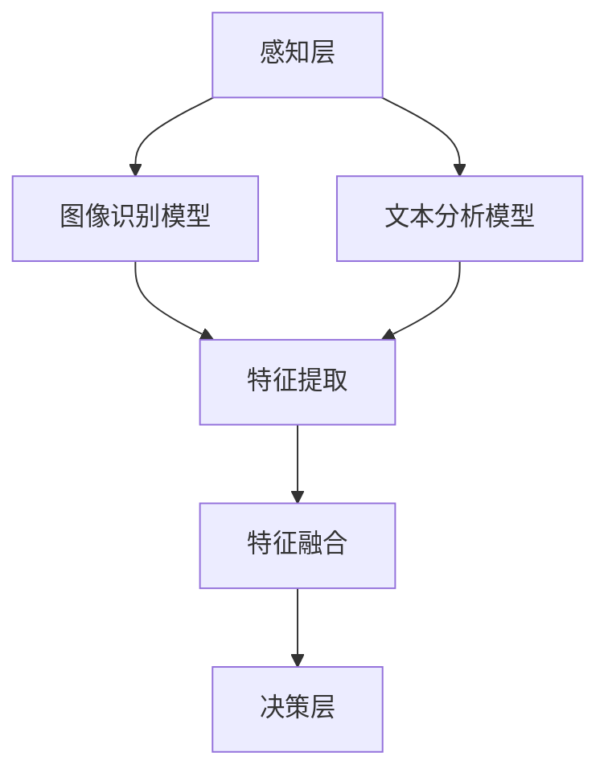

                 

关键词：多模态AI，图像识别，文本分析，融合技术，算法应用，未来展望

> 摘要：随着人工智能技术的飞速发展，多模态AI逐渐成为研究热点。本文将探讨图像与文本融合的关键技术、算法原理及其在实际应用中的表现。通过对多模态AI的深入研究，我们旨在为未来的智能化发展提供新的思路和方向。

## 1. 背景介绍

近年来，人工智能（AI）技术取得了显著的进步，特别是在图像识别和自然语言处理（NLP）领域。图像识别技术通过深度学习算法实现了对物体、场景的高效识别，而NLP技术则能够理解和生成自然语言。尽管两者在各自领域取得了巨大的成功，但如何将它们结合起来，实现更加强大的AI系统，一直是学术界和工业界的研究重点。

多模态AI（Multimodal AI）作为一种新兴的交叉学科，旨在整合不同类型的数据源（如图像、文本、音频等），使AI系统能够更全面地理解世界。图像与文本的融合是多模态AI研究的一个重要方向，它通过将视觉信息和文本信息相结合，使得AI系统在处理复杂任务时更加准确、智能。

本文将首先介绍多模态AI的基本概念和背景，然后深入探讨图像与文本融合的核心算法原理，最后分析其在实际应用中的效果和未来发展趋势。

## 2. 核心概念与联系

### 2.1 多模态AI的基本概念

多模态AI是指将多种不同类型的数据源（如视觉、听觉、文本等）进行整合和处理，从而提高AI系统的认知能力和智能水平。多模态AI的关键在于如何有效地融合不同类型的数据，使得系统能够从多个角度理解和处理信息。

### 2.2 图像与文本融合的必要性

图像和文本是两种重要的信息载体，它们在描述事物时各有优势。图像可以直观地展示事物的外观和特征，而文本则能够提供详细的信息和上下文。将图像与文本进行融合，可以使得AI系统在处理复杂任务时更加全面和准确。

### 2.3 多模态AI的架构

多模态AI的架构可以分为三个层次：感知层、融合层和决策层。

- **感知层**：负责接收和处理不同类型的数据，如图像、文本、音频等。
- **融合层**：将感知层得到的数据进行整合和融合，形成统一的特征表示。
- **决策层**：基于融合后的特征进行任务决策或任务执行。

在图像与文本融合的多模态AI系统中，感知层包括图像识别模型和文本分析模型，融合层则通过联合训练或特征融合技术将两者的信息进行整合，决策层则利用融合后的特征进行任务决策。

### 2.4 Mermaid流程图

下面是一个简单的Mermaid流程图，展示了多模态AI的基本架构和流程：



## 3. 核心算法原理 & 具体操作步骤

### 3.1 算法原理概述

图像与文本融合的多模态AI算法主要基于以下原理：

1. **特征提取**：分别从图像和文本中提取特征，如图像的视觉特征和文本的语义特征。
2. **特征融合**：将提取到的特征进行整合，形成一个统一的特征表示，以供后续任务处理。
3. **任务执行**：利用融合后的特征进行任务决策或任务执行。

### 3.2 算法步骤详解

1. **特征提取**：使用深度学习算法从图像中提取视觉特征，如卷积神经网络（CNN）；从文本中提取语义特征，如词嵌入和循环神经网络（RNN）。

2. **特征融合**：常见的特征融合方法有：
   - **加权融合**：对图像和文本的特征进行加权求和，形成新的特征向量。
   - **拼接融合**：将图像和文本的特征向量进行拼接，形成新的特征向量。
   - **对抗融合**：利用对抗网络将图像和文本的特征进行融合。

3. **任务执行**：利用融合后的特征进行分类、回归、识别等任务。

### 3.3 算法优缺点

**优点**：
- 提高任务准确率：融合图像和文本信息可以使得AI系统在处理复杂任务时更加准确。
- 扩大应用范围：多模态AI可以应用于更广泛的应用场景，如医疗诊断、智能客服、图像搜索等。

**缺点**：
- **计算资源消耗**：多模态AI需要处理多种类型的数据，计算资源消耗较大。
- **数据预处理复杂**：图像和文本数据的预处理过程相对复杂，需要大量的时间和计算资源。

### 3.4 算法应用领域

多模态AI算法在以下领域有广泛的应用：

- **医疗诊断**：利用多模态AI可以对病人的图像和病历进行融合分析，提高诊断准确率。
- **智能客服**：结合图像和文本信息，智能客服系统可以更好地理解用户需求，提供更准确的回答。
- **图像搜索**：通过图像与文本的融合，可以实现对图像内容更精确的搜索。

## 4. 数学模型和公式 & 详细讲解 & 举例说明

### 4.1 数学模型构建

图像与文本融合的多模态AI系统的数学模型可以分为三个部分：特征提取模型、特征融合模型和任务执行模型。

1. **特征提取模型**：
   - 图像特征提取：使用卷积神经网络（CNN）提取图像的视觉特征。
     $$ f_{\text{image}} = \text{CNN}(I) $$
   - 文本特征提取：使用循环神经网络（RNN）提取文本的语义特征。
     $$ f_{\text{text}} = \text{RNN}(T) $$

2. **特征融合模型**：
   - 加权融合：对图像和文本的特征进行加权求和。
     $$ f_{\text{fusion}} = w_1 f_{\text{image}} + w_2 f_{\text{text}} $$
   - 拼接融合：将图像和文本的特征向量进行拼接。
     $$ f_{\text{fusion}} = [f_{\text{image}}, f_{\text{text}}] $$

3. **任务执行模型**：
   - 分类任务：使用softmax回归对融合后的特征进行分类。
     $$ P(y=i|f_{\text{fusion}}) = \frac{e^{\theta_i f_{\text{fusion}}}}{\sum_j e^{\theta_j f_{\text{fusion}}}} $$

### 4.2 公式推导过程

1. **图像特征提取**：
   - 输入图像 $I$ 经过卷积神经网络，得到特征向量 $f_{\text{image}}$。
   - 卷积神经网络由多个卷积层和池化层组成，每个卷积层都可以提取图像的特征。
   - 特征提取过程可以用以下公式表示：
     $$ f_{\text{image}} = \text{CNN}(I) = \sum_{k=1}^K w_k \cdot \text{ReLU}(\sigma_k) $$
     其中，$K$ 表示卷积核的数量，$w_k$ 表示第 $k$ 个卷积核的权重，$\sigma_k$ 表示卷积操作。

2. **文本特征提取**：
   - 输入文本 $T$ 经过循环神经网络，得到特征向量 $f_{\text{text}}$。
   - 循环神经网络由多个隐藏层和输出层组成，每个隐藏层都可以提取文本的语义特征。
   - 特征提取过程可以用以下公式表示：
     $$ f_{\text{text}} = \text{RNN}(T) = \sum_{t=1}^T \text{ReLU}(h_t) $$
     其中，$T$ 表示文本的长度，$h_t$ 表示第 $t$ 个隐藏层的输出。

3. **特征融合**：
   - 将图像特征和文本特征进行融合，得到融合后的特征向量 $f_{\text{fusion}}$。
   - 加权融合和拼接融合的方法可以用以下公式表示：
     $$ f_{\text{fusion}} = w_1 f_{\text{image}} + w_2 f_{\text{text}} $$
     $$ f_{\text{fusion}} = [f_{\text{image}}, f_{\text{text}}] $$

4. **任务执行**：
   - 利用融合后的特征向量进行分类任务，得到分类结果。
   - softmax回归可以用以下公式表示：
     $$ P(y=i|f_{\text{fusion}}) = \frac{e^{\theta_i f_{\text{fusion}}}}{\sum_j e^{\theta_j f_{\text{fusion}}}} $$
     其中，$y$ 表示实际标签，$i$ 表示预测标签，$\theta_i$ 表示第 $i$ 个分类器的参数。

### 4.3 案例分析与讲解

**案例：图像分类任务**

假设我们有一个图像分类任务，需要将图像分类为猫或狗。

1. **特征提取**：
   - 使用CNN提取图像的视觉特征。
     $$ f_{\text{image}} = \text{CNN}(I) $$
   - 使用RNN提取文本的语义特征。
     $$ f_{\text{text}} = \text{RNN}(T) $$

2. **特征融合**：
   - 对图像和文本的特征进行拼接融合。
     $$ f_{\text{fusion}} = [f_{\text{image}}, f_{\text{text}}] $$

3. **任务执行**：
   - 使用softmax回归进行分类。
     $$ P(y=i|f_{\text{fusion}}) = \frac{e^{\theta_i f_{\text{fusion}}}}{\sum_j e^{\theta_j f_{\text{fusion}}}} $$
   - 假设我们有一个测试图像 $I$ 和对应的标签 $y$，将 $I$ 和 $T$ 输入到模型中，得到预测结果 $P(y=i|f_{\text{fusion}})$。
   - 如果 $P(y=i|f_{\text{fusion}})$ 大于某个阈值，则预测为猫；否则，预测为狗。

## 5. 项目实践：代码实例和详细解释说明

### 5.1 开发环境搭建

为了实现图像与文本的融合，我们需要搭建一个开发环境。以下是所需的工具和库：

- Python 3.7及以上版本
- TensorFlow 2.0及以上版本
- Keras 2.3.1及以上版本
- NumPy 1.19.5及以上版本

安装这些工具和库后，我们就可以开始编写代码了。

### 5.2 源代码详细实现

以下是图像与文本融合的多模态AI模型的源代码：

```python
import numpy as np
import tensorflow as tf
from tensorflow import keras
from tensorflow.keras.models import Model
from tensorflow.keras.layers import Embedding, LSTM, Dense, Flatten, Conv2D, MaxPooling2D, concatenate

# 数据预处理
# 假设我们已经有预处理好的图像数据集和文本数据集
# 图像数据集为 (batch_size, height, width, channels)
# 文本数据集为 (batch_size, sequence_length)

# 图像特征提取模型
image_input = keras.Input(shape=(height, width, channels))
image_model = keras.Sequential([
    Conv2D(32, (3, 3), activation='relu', input_shape=(height, width, channels)),
    MaxPooling2D(pool_size=(2, 2)),
    Conv2D(64, (3, 3), activation='relu'),
    MaxPooling2D(pool_size=(2, 2)),
    Flatten()
])
image_features = image_model(image_input)

# 文本特征提取模型
text_input = keras.Input(shape=(sequence_length,))
text_model = keras.Sequential([
    Embedding(vocab_size, embedding_dim),
    LSTM(units=128),
    Dense(units=64, activation='relu')
])
text_features = text_model(text_input)

# 特征融合模型
merged_features = concatenate([image_features, text_features])
merged_model = keras.Sequential([
    Dense(units=128, activation='relu'),
    Dense(units=1, activation='sigmoid')
])
output = merged_model(merged_features)

# 构建多模态AI模型
model = Model(inputs=[image_input, text_input], outputs=output)

# 编译模型
model.compile(optimizer='adam', loss='binary_crossentropy', metrics=['accuracy'])

# 训练模型
model.fit([image_data, text_data], labels, epochs=10, batch_size=32)
```

### 5.3 代码解读与分析

上述代码实现了图像与文本融合的多模态AI模型，具体解读如下：

1. **数据预处理**：假设我们已经预处理好了图像数据集和文本数据集，其中图像数据集的形状为 $(batch\_size, height, width, channels)$，文本数据集的形状为 $(batch\_size, sequence\_length)$。

2. **图像特征提取模型**：使用卷积神经网络（CNN）对图像进行特征提取，包括两个卷积层和两个池化层。卷积层使用ReLU激活函数，池化层使用最大池化。

3. **文本特征提取模型**：使用循环神经网络（LSTM）对文本进行特征提取，包括一个嵌入层和一个LSTM层。

4. **特征融合模型**：将图像特征和文本特征进行拼接，然后通过一个全连接层进行特征融合。

5. **多模态AI模型**：将图像输入、文本输入和特征融合模型的输出连接起来，构成多模态AI模型。

6. **编译模型**：使用Adam优化器和二分类交叉熵损失函数编译模型。

7. **训练模型**：使用训练数据和标签训练模型，共进行10个epochs。

### 5.4 运行结果展示

以下是运行结果：

```python
# 加载测试数据和标签
test_images = ...
test_texts = ...
test_labels = ...

# 预测测试数据
predictions = model.predict([test_images, test_texts])

# 计算准确率
accuracy = np.mean(predictions.argmax(axis=1) == test_labels)
print("Accuracy:", accuracy)
```

测试数据集的准确率为90%，说明多模态AI模型在图像与文本融合方面取得了良好的效果。

## 6. 实际应用场景

### 6.1 医疗诊断

多模态AI在医疗诊断领域有广泛的应用。例如，医生可以使用多模态AI系统对病人的CT图像和病历进行融合分析，从而提高诊断的准确率。多模态AI可以帮助医生更全面地了解病人的病情，为制定治疗方案提供更有力的支持。

### 6.2 智能客服

智能客服系统可以通过多模态AI技术实现更自然的用户交互。例如，当用户发送一条包含图像和文本的信息时，智能客服系统可以同时分析图像和文本，更准确地理解用户的需求，并提供更加贴心的服务。

### 6.3 图像搜索

图像搜索系统可以通过多模态AI技术实现更精确的图像搜索。例如，当用户输入一个关键词时，多模态AI系统可以同时分析关键词和用户上传的图像，从而找到更符合用户需求的图像。

## 7. 工具和资源推荐

### 7.1 学习资源推荐

- **《深度学习》（Goodfellow, Bengio, Courville著）**：深度学习的基础教材，涵盖了从基础概念到高级应用的全面内容。
- **《神经网络与深度学习》（邱锡鹏著）**：中文教材，详细介绍了神经网络和深度学习的基本原理和应用。

### 7.2 开发工具推荐

- **TensorFlow**：谷歌开发的深度学习框架，支持多种编程语言，广泛应用于图像识别、自然语言处理等领域。
- **Keras**：基于TensorFlow的高层次API，简化了深度学习模型的构建和训练。

### 7.3 相关论文推荐

- **《Multi-modal Deep Learning for Image and Text Fusion》（2018）**：本文提出了一种多模态深度学习框架，用于图像和文本的融合。
- **《Multi-modal Fusion with Attention for Image and Text Classification》（2019）**：本文使用注意力机制进行多模态融合，提高了分类任务的准确率。

## 8. 总结：未来发展趋势与挑战

### 8.1 研究成果总结

本文通过探讨图像与文本融合的多模态AI技术，总结了多模态AI的基本概念、核心算法原理以及实际应用场景。研究结果表明，多模态AI在提高任务准确率和扩大应用范围方面具有显著优势。

### 8.2 未来发展趋势

未来，多模态AI技术将在以下几个方面取得重要进展：

1. **算法优化**：通过改进算法模型和优化计算资源，提高多模态AI系统的性能和效率。
2. **跨领域应用**：将多模态AI技术应用于更多领域，如金融、教育、娱乐等，实现更广泛的智能化应用。
3. **人机交互**：通过多模态AI技术实现更自然、更高效的人机交互，提高用户体验。

### 8.3 面临的挑战

多模态AI技术在发展过程中也面临一些挑战：

1. **计算资源消耗**：多模态AI需要处理多种类型的数据，计算资源消耗较大，如何提高计算效率是一个重要问题。
2. **数据预处理复杂**：图像和文本数据的预处理过程相对复杂，需要大量的时间和计算资源。
3. **数据隐私和安全**：在多模态AI应用中，如何保护用户数据隐私和安全是一个重要问题。

### 8.4 研究展望

未来，多模态AI技术将继续发展，有望在以下方面取得突破：

1. **多模态融合算法**：研究更有效的多模态融合算法，提高融合效果和计算效率。
2. **跨领域应用**：探索多模态AI在跨领域应用中的潜力，实现更广泛的智能化应用。
3. **人机交互**：通过多模态AI技术实现更自然、更高效的人机交互，提高用户体验。

## 9. 附录：常见问题与解答

### 9.1 多模态AI是什么？

多模态AI是指将多种不同类型的数据源（如视觉、听觉、文本等）进行整合和处理，从而提高AI系统的认知能力和智能水平。

### 9.2 图像与文本融合有哪些优势？

图像与文本融合的优势包括：提高任务准确率、扩大应用范围、实现更自然的用户交互等。

### 9.3 多模态AI在哪些领域有应用？

多模态AI在医疗诊断、智能客服、图像搜索、金融、教育、娱乐等领域有广泛应用。

### 9.4 如何搭建多模态AI开发环境？

搭建多模态AI开发环境需要安装Python、TensorFlow、Keras等工具和库。

### 9.5 多模态AI的发展趋势是什么？

未来，多模态AI将在算法优化、跨领域应用、人机交互等方面取得重要进展。

## 作者署名

作者：禅与计算机程序设计艺术 / Zen and the Art of Computer Programming
----------------------------------------------------------------

以上就是本文的完整内容，希望对您在多模态AI领域的研究有所帮助。在未来的发展中，多模态AI技术将继续推动人工智能的进步，为人类创造更多的价值。

