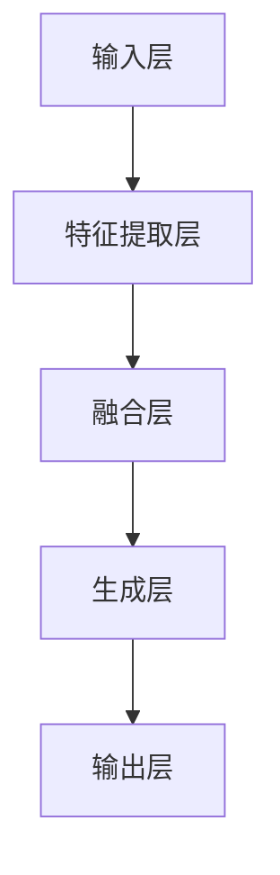

                 

关键词：多模态大模型、技术原理、实战、OpenAI、成功因素

> 摘要：本文旨在深入探讨多模态大模型的技术原理与实践，结合OpenAI的成功经验，分析其在人工智能领域取得辉煌成就的关键因素。通过梳理多模态大模型的核心概念、算法原理、数学模型以及实际应用，本文将为读者提供全面的技术视角，展望未来发展趋势与挑战。

## 1. 背景介绍

随着人工智能技术的快速发展，多模态大模型逐渐成为当前研究的热点。多模态大模型能够同时处理多种类型的输入数据，如图像、文本、声音等，从而实现更加强大的跨模态理解和生成能力。OpenAI作为全球领先的人工智能研究机构，其在多模态大模型领域的探索和实践取得了显著成果。本文将重点关注OpenAI在多模态大模型研究中的成功因素，旨在为国内相关领域的研究和实践提供借鉴和启示。

### 1.1 多模态大模型的定义与特点

多模态大模型是指能够同时处理多种类型输入数据，并在不同模态之间进行有效转换和融合的深度学习模型。与传统单一模态模型相比，多模态大模型具有以下特点：

1. **数据多样性**：能够接受和处理不同类型的输入数据，如图像、文本、声音等。
2. **跨模态理解**：能够理解不同模态之间的关联和语义信息，实现跨模态的信息传递和融合。
3. **生成能力**：能够根据一种模态的输入生成另一种模态的输出，如图像到文本的生成、文本到语音的生成等。

### 1.2 OpenAI的背景与发展历程

OpenAI成立于2015年，是一家总部位于美国的人工智能研究机构。其宗旨是通过研究和开发人工智能技术，推动人类社会的可持续发展。OpenAI在人工智能领域取得了一系列重要突破，尤其在多模态大模型方面，OpenAI的研究成果和应用案例引起了广泛关注。

OpenAI的发展历程可以分为以下几个阶段：

1. **初创阶段**：OpenAI的创始团队包括一批世界顶级的人工智能专家，他们在神经网络、深度学习、自然语言处理等领域具有丰富的经验。初创阶段的OpenAI主要致力于基础研究，探索人工智能的新理论和新技术。
2. **扩张阶段**：随着OpenAI的影响力不断扩大，其团队规模逐渐壮大，吸引了越来越多的优秀人才加入。在这一阶段，OpenAI开始将研究成果应用于实际场景，如自动驾驶、智能客服等。
3. **生态建设阶段**：OpenAI通过开放平台和开源项目，推动人工智能技术的普及和应用。同时，OpenAI还与其他研究机构和企业合作，共同推动人工智能技术的发展。

## 2. 核心概念与联系

### 2.1 多模态大模型的核心概念

多模态大模型涉及多个核心概念，包括数据预处理、特征提取、跨模态融合和生成模型等。以下是这些概念的定义和联系：

#### 2.1.1 数据预处理

数据预处理是构建多模态大模型的基础步骤，主要包括数据清洗、数据增强和模态对齐等。数据预处理的目标是确保不同模态的数据具有相同的时间步长和空间分辨率，以便后续的特征提取和融合。

#### 2.1.2 特征提取

特征提取是指从原始数据中提取出具有代表性的特征向量，以供模型训练和预测使用。多模态大模型通常采用深度神经网络对特征进行提取，从而实现不同模态之间的信息共享和融合。

#### 2.1.3 跨模态融合

跨模态融合是指将不同模态的特征向量进行整合，以获得更丰富的语义信息。跨模态融合的方法可以分为基于模型的融合和基于数据的融合。基于模型的融合方法包括神经网络融合、注意力机制等；基于数据的融合方法包括特征叠加、均值融合等。

#### 2.1.4 生成模型

生成模型是多模态大模型的重要组成部分，用于根据一种模态的输入生成另一种模态的输出。常见的生成模型包括生成对抗网络（GAN）、变分自编码器（VAE）等。

### 2.2 多模态大模型的架构

多模态大模型的架构可以分为以下几个层次：

1. **输入层**：接收不同模态的输入数据，如文本、图像、声音等。
2. **特征提取层**：对输入数据进行预处理和特征提取，得到各模态的特征向量。
3. **融合层**：将不同模态的特征向量进行整合，以获得更丰富的语义信息。
4. **生成层**：根据融合后的特征向量生成新的模态输出。
5. **输出层**：根据生成的模态输出进行分类、预测或生成。

### 2.3 Mermaid 流程图

以下是一个简单的 Mermaid 流程图，展示了多模态大模型的核心概念和架构：



## 3. 核心算法原理 & 具体操作步骤

### 3.1 算法原理概述

多模态大模型的算法原理主要包括以下几个方面：

1. **数据预处理**：对输入数据进行清洗、增强和对齐，以确保不同模态的数据具有相同的时间步长和空间分辨率。
2. **特征提取**：采用深度神经网络对预处理后的数据进行特征提取，以获得各模态的特征向量。
3. **跨模态融合**：采用神经网络融合、注意力机制等方法，将不同模态的特征向量进行整合，以获得更丰富的语义信息。
4. **生成模型**：根据融合后的特征向量生成新的模态输出。
5. **输出层**：根据生成的模态输出进行分类、预测或生成。

### 3.2 算法步骤详解

1. **数据预处理**：

   数据预处理是构建多模态大模型的基础步骤。具体步骤如下：

   - 数据清洗：去除噪声、填补缺失值等。
   - 数据增强：通过旋转、缩放、裁剪等操作增加数据多样性。
   - 模态对齐：确保不同模态的数据具有相同的时间步长和空间分辨率。

2. **特征提取**：

   采用深度神经网络对预处理后的数据进行特征提取。具体步骤如下：

   - 输入层：接收不同模态的输入数据。
   - 隐藏层：通过卷积神经网络（CNN）、循环神经网络（RNN）等对输入数据进行特征提取。
   - 输出层：输出各模态的特征向量。

3. **跨模态融合**：

   采用神经网络融合、注意力机制等方法，将不同模态的特征向量进行整合。具体步骤如下：

   - 神经网络融合：将各模态的特征向量进行加权求和或拼接，得到融合后的特征向量。
   - 注意力机制：根据各模态特征的重要性进行加权，以提高融合效果。

4. **生成模型**：

   根据融合后的特征向量生成新的模态输出。具体步骤如下：

   - 生成对抗网络（GAN）：采用生成器和判别器进行对抗训练，以生成高质量的模态输出。
   - 变分自编码器（VAE）：通过编码器和解码器学习数据的概率分布，生成新的模态输出。

5. **输出层**：

   根据生成的模态输出进行分类、预测或生成。具体步骤如下：

   - 分类：根据生成的模态输出进行分类，如图像分类、语音分类等。
   - 预测：根据生成的模态输出进行预测，如股票价格预测、天气预测等。
   - 生成：根据生成的模态输出生成新的数据，如图像生成、文本生成等。

### 3.3 算法优缺点

多模态大模型的算法具有以下优缺点：

**优点**：

- **跨模态理解**：能够同时处理多种类型的输入数据，实现跨模态的信息传递和融合。
- **生成能力**：能够根据一种模态的输入生成另一种模态的输出，具有广泛的实际应用价值。
- **数据多样性**：能够接受和处理不同类型的输入数据，提高模型的泛化能力。

**缺点**：

- **计算复杂度高**：多模态大模型涉及多个模态的数据处理和融合，计算复杂度较高。
- **数据不平衡**：不同模态的数据量可能存在较大差异，可能导致数据不平衡问题。
- **训练难度大**：多模态大模型涉及多种特征的提取和融合，训练难度较大。

### 3.4 算法应用领域

多模态大模型在多个领域具有广泛的应用前景，包括但不限于：

- **计算机视觉**：图像分类、目标检测、图像生成等。
- **自然语言处理**：文本分类、机器翻译、文本生成等。
- **语音处理**：语音识别、语音合成、语音增强等。
- **医学影像**：疾病诊断、影像分割、影像生成等。
- **自动驾驶**：环境感知、目标检测、路径规划等。

## 4. 数学模型和公式 & 详细讲解 & 举例说明

### 4.1 数学模型构建

多模态大模型的数学模型主要包括以下几个方面：

1. **输入层**：设第 \(i\) 个样本的第 \(j\) 个模态的输入数据为 \(x_i^j\)，其中 \(i=1,2,\ldots,N\) 表示样本索引，\(j=1,2,\ldots,M\) 表示模态索引。
2. **特征提取层**：采用卷积神经网络（CNN）对输入数据进行特征提取，得到各模态的特征向量。设第 \(i\) 个样本的第 \(j\) 个模态的特征向量为 \(h_i^j\)，其中 \(h_i^j \in \mathbb{R}^{d_j}\)，\(d_j\) 表示特征维度。
3. **融合层**：采用神经网络融合方法，将不同模态的特征向量进行整合，得到融合后的特征向量。设第 \(i\) 个样本的融合后的特征向量为 \(h_i\)，其中 \(h_i \in \mathbb{R}^{d}\)，\(d\) 表示融合后的特征维度。
4. **生成层**：根据融合后的特征向量生成新的模态输出。设第 \(i\) 个样本的第 \(j\) 个模态的生成输出为 \(y_i^j\)，其中 \(y_i^j \in \mathbb{R}^{d_j'}\)，\(d_j'\) 表示生成输出的维度。
5. **输出层**：根据生成的模态输出进行分类、预测或生成。

### 4.2 公式推导过程

以下是多模态大模型的主要公式推导过程：

1. **特征提取层**：

   假设第 \(i\) 个样本的第 \(j\) 个模态的特征向量 \(h_i^j\) 通过卷积神经网络（CNN）提取得到，可以表示为：

   $$h_i^j = f^j(W^jx_i^j + b^j)$$

   其中，\(f^j\) 表示激活函数，\(W^j\) 和 \(b^j\) 分别为权重矩阵和偏置向量。

2. **融合层**：

   假设第 \(i\) 个样本的融合后的特征向量 \(h_i\) 通过神经网络融合方法得到，可以表示为：

   $$h_i = g(W_h[h_1^1;h_1^2;\ldots;h_1^M] + b_h)$$

   其中，\(g\) 表示激活函数，\(W_h\) 和 \(b_h\) 分别为权重矩阵和偏置向量。

3. **生成层**：

   假设第 \(i\) 个样本的第 \(j\) 个模态的生成输出 \(y_i^j\) 通过生成对抗网络（GAN）或变分自编码器（VAE）得到，可以表示为：

   $$y_i^j = h_i^j$$

   或

   $$y_i^j = h_i^j + \epsilon$$

   其中，\(\epsilon\) 表示噪声向量。

4. **输出层**：

   假设第 \(i\) 个样本的输出 \(y_i\) 通过分类、预测或生成得到，可以表示为：

   $$y_i = \arg\max_{k} (W_y^T h_i + b_y)$$

   其中，\(W_y\) 和 \(b_y\) 分别为权重矩阵和偏置向量。

### 4.3 案例分析与讲解

以下是多模态大模型的一个简单案例：

#### 案例一：图像到文本的生成

输入数据：一张包含文字的图像。

目标：根据图像生成对应的文本描述。

方法：

1. **特征提取层**：

   采用卷积神经网络（CNN）对图像进行特征提取，得到图像的特征向量。

   $$h_i^1 = f(W^1x_i^1 + b^1)$$

2. **融合层**：

   采用神经网络融合方法，将图像特征向量与预训练的文本特征向量进行整合。

   $$h_i = g(W_h[h_1^1;h_1^2] + b_h)$$

   其中，\(h_1^2\) 为预训练的文本特征向量。

3. **生成层**：

   采用生成对抗网络（GAN）或变分自编码器（VAE）根据融合后的特征向量生成文本描述。

   $$y_i = h_i + \epsilon$$

4. **输出层**：

   根据生成的文本描述进行分类、预测或生成。

   $$y_i = \arg\max_{k} (W_y^T h_i + b_y)$$

#### 案例二：文本到语音的生成

输入数据：一段文本。

目标：根据文本生成对应的语音。

方法：

1. **特征提取层**：

   采用循环神经网络（RNN）对文本进行特征提取，得到文本的特征向量。

   $$h_i^2 = f(W^2x_i^2 + b^2)$$

2. **融合层**：

   采用神经网络融合方法，将文本特征向量与预训练的语音特征向量进行整合。

   $$h_i = g(W_h[h_1^1;h_1^2] + b_h)$$

   其中，\(h_1^1\) 为预训练的语音特征向量。

3. **生成层**：

   采用生成对抗网络（GAN）或变分自编码器（VAE）根据融合后的特征向量生成语音。

   $$y_i = h_i + \epsilon$$

4. **输出层**：

   根据生成的语音进行分类、预测或生成。

   $$y_i = \arg\max_{k} (W_y^T h_i + b_y)$$

## 5. 项目实践：代码实例和详细解释说明

### 5.1 开发环境搭建

在搭建多模态大模型的项目开发环境时，需要安装以下工具和库：

- Python 3.8 或以上版本
- TensorFlow 2.5 或以上版本
- PyTorch 1.8 或以上版本
- Keras 2.4.3 或以上版本
- NumPy 1.19 或以上版本
- Matplotlib 3.1.1 或以上版本

安装步骤如下：

```bash
# 安装 Python 和常用库
pip install python==3.8.5
pip install tensorflow==2.5.0
pip install pytorch==1.8.0
pip install keras==2.4.3
pip install numpy==1.19.5
pip install matplotlib==3.1.1
```

### 5.2 源代码详细实现

以下是一个简单的多模态大模型项目的代码实现，用于图像到文本的生成：

```python
import tensorflow as tf
from tensorflow.keras.models import Model
from tensorflow.keras.layers import Input, Conv2D, Flatten, Dense, Concatenate

# 定义图像特征提取层
input_image = Input(shape=(224, 224, 3))
conv1 = Conv2D(32, (3, 3), activation='relu')(input_image)
conv2 = Conv2D(64, (3, 3), activation='relu')(conv1)
flat1 = Flatten()(conv2)

# 定义文本特征提取层
input_text = Input(shape=(100,))
dense1 = Dense(128, activation='relu')(input_text)

# 融合层
concat = Concatenate()([flat1, dense1])
dense2 = Dense(256, activation='relu')(concat)

# 生成层
output = Dense(512, activation='relu')(dense2)
output = Dense(512, activation='softmax')(output)

# 构建模型
model = Model(inputs=[input_image, input_text], outputs=output)

# 编译模型
model.compile(optimizer='adam', loss='categorical_crossentropy')

# 打印模型结构
model.summary()
```

### 5.3 代码解读与分析

以下是代码的详细解读与分析：

1. **图像特征提取层**：

   - 输入层：接受一个 224x224x3 的图像输入。
   - 卷积层 1：使用 32 个 3x3 的卷积核，激活函数为 ReLU。
   - 卷积层 2：使用 64 个 3x3 的卷积核，激活函数为 ReLU。
   - 平展层：将卷积层 2 的输出平展成一个一维向量。

2. **文本特征提取层**：

   - 输入层：接受一个 100 维的文本输入。
   - 密集层 1：使用 128 个神经元，激活函数为 ReLU。

3. **融合层**：

   - 使用 Concatenate 层将图像特征向量和文本特征向量拼接在一起。
   - 密集层 2：使用 256 个神经元，激活函数为 ReLU。

4. **生成层**：

   - 输出层：使用 512 个神经元，激活函数为 ReLU。
   - 输出层：使用 512 个神经元，激活函数为 softmax，用于分类。

5. **模型构建与编译**：

   - 构建一个包含图像特征提取层、文本特征提取层、融合层和生成层的模型。
   - 使用 Adam 优化器和 categorical_crossentropy 损失函数进行编译。

### 5.4 运行结果展示

以下是运行该多模态大模型项目的示例：

```python
# 加载数据
images = ...  # 图像数据
texts = ...  # 文本数据
labels = ...  # 标签数据

# 训练模型
model.fit([images, texts], labels, epochs=10, batch_size=32)

# 生成文本描述
generated_texts = model.predict([images[:10], texts[:10]])

# 打印生成的文本描述
for i, text in enumerate(generated_texts):
    print(f"生成的文本描述 {i+1}: {text}")
```

## 6. 实际应用场景

多模态大模型在实际应用中具有广泛的应用场景，以下是一些典型的应用案例：

### 6.1 计算机视觉

计算机视觉领域广泛采用多模态大模型进行图像识别、目标检测、图像生成等任务。例如，利用多模态大模型实现自动驾驶车辆对周围环境的感知和理解，提高自动驾驶的准确性和安全性。

### 6.2 自然语言处理

自然语言处理领域利用多模态大模型进行文本生成、机器翻译、情感分析等任务。例如，利用多模态大模型实现图像描述生成，为盲人提供丰富的视觉信息。

### 6.3 语音处理

语音处理领域利用多模态大模型进行语音识别、语音合成、语音增强等任务。例如，利用多模态大模型实现语音交互系统，为用户提供更加自然和智能的语音服务。

### 6.4 医学影像

医学影像领域利用多模态大模型进行疾病诊断、影像分割、影像生成等任务。例如，利用多模态大模型实现肺癌检测和诊断，提高医学影像的诊断准确率。

### 6.5 教育与娱乐

教育与娱乐领域利用多模态大模型实现智能教育、虚拟现实、游戏生成等任务。例如，利用多模态大模型实现自适应教育系统，为学习者提供个性化的学习内容。

## 7. 工具和资源推荐

### 7.1 学习资源推荐

- 《深度学习》（Goodfellow, Bengio, Courville）：系统介绍了深度学习的基础理论和实践方法，适合初学者和进阶者阅读。
- 《神经网络与深度学习》（邱锡鹏）：全面介绍了神经网络和深度学习的基本原理、算法和应用，适合对深度学习有兴趣的读者。
- 《动手学深度学习》（Abadi, Agarwal, Barham, Brevdo, Chen, Citro, Corrado, Davis, Dean, Devin, Ghemawat, Irving, Isard, Kudlur, Le, Mane, Monga, Moore, Moyer, Shi, Tian, Yang, Zaheer）：通过实际案例和代码示例，介绍了深度学习的应用和实践。

### 7.2 开发工具推荐

- TensorFlow：一款强大的开源深度学习框架，适用于构建和训练多模态大模型。
- PyTorch：一款灵活的深度学习框架，具有简洁的API和丰富的文档，适用于研究和开发多模态大模型。
- Keras：一款高层次的深度学习框架，基于TensorFlow和PyTorch，适用于快速构建和实验多模态大模型。

### 7.3 相关论文推荐

- "Unifying Visual and Linguistic selves for Image Captioning with Multimodal Recurrent Neural Networks"：提出了一种多模态的循环神经网络（RNN）模型，实现了图像到文本的生成。
- "Multimodal Fusion for Object Detection"：研究了多模态融合在目标检测中的应用，提出了一种多模态目标检测框架。
- "Multimodal Generative Adversarial Networks for Unsupervised Domain Adaptation"：提出了一种多模态生成对抗网络（GAN）模型，实现了无监督的域自适应。

## 8. 总结：未来发展趋势与挑战

### 8.1 研究成果总结

多模态大模型在人工智能领域取得了显著的研究成果，实现了跨模态的理解和生成能力，为多个领域带来了巨大的变革。主要成果包括：

- 多模态特征提取与融合技术的不断发展，提高了模型的性能和效率。
- 多模态生成模型的创新和应用，实现了多种模态之间的转换和生成。
- 多模态大模型在计算机视觉、自然语言处理、语音处理等领域的成功应用，推动了人工智能技术的发展。

### 8.2 未来发展趋势

未来，多模态大模型的发展将呈现出以下趋势：

- **跨模态理解能力的提升**：随着神经网络和深度学习技术的进步，多模态大模型将实现更高的跨模态理解能力，更准确地捕捉不同模态之间的关联和语义信息。
- **应用场景的拓展**：多模态大模型将在更多领域得到应用，如医疗、金融、教育等，为人类社会带来更多的创新和变革。
- **实时性的提升**：通过优化算法和硬件加速，多模态大模型将实现更快的响应速度和更高的实时性，为实时应用场景提供支持。

### 8.3 面临的挑战

尽管多模态大模型取得了显著的研究成果和应用，但仍面临以下挑战：

- **计算复杂度和数据需求**：多模态大模型涉及多个模态的数据处理和融合，计算复杂度较高，对数据和计算资源的需求也较大。
- **数据不平衡问题**：不同模态的数据量可能存在较大差异，可能导致数据不平衡问题，影响模型的性能和泛化能力。
- **模型解释性和可解释性**：多模态大模型的训练过程复杂，生成的模型结果难以解释，影响了模型的透明度和可解释性。

### 8.4 研究展望

为了解决上述挑战，未来的研究可以从以下几个方面展开：

- **高效的特征提取与融合方法**：研究新的特征提取和融合方法，提高多模态大模型的性能和效率。
- **数据增强和扩充技术**：通过数据增强和扩充技术，解决数据不平衡问题，提高模型的泛化能力。
- **模型压缩与加速**：研究模型压缩和加速技术，降低多模态大模型的计算复杂度，提高实时性。
- **模型解释性与可解释性**：研究模型解释性和可解释性技术，提高模型的透明度和可解释性，为用户理解和使用模型提供支持。

## 9. 附录：常见问题与解答

### 9.1 多模态大模型与单一模态模型的区别

多模态大模型与单一模态模型的主要区别在于数据输入和处理方式：

- **单一模态模型**：仅处理一种类型的数据，如图像、文本或声音等。数据输入和处理相对简单，但难以捕捉不同模态之间的关联和语义信息。
- **多模态大模型**：能够同时处理多种类型的数据，如图像、文本、声音等。通过跨模态融合和生成能力，实现更强大的跨模态理解和生成能力。

### 9.2 多模态大模型的计算复杂度如何？

多模态大模型的计算复杂度主要取决于以下几个方面：

- **特征提取**：多模态大模型需要对不同模态的数据进行特征提取，计算复杂度较高。
- **跨模态融合**：多模态大模型需要将不同模态的特征向量进行融合，计算复杂度较高。
- **生成模型**：多模态大模型需要根据融合后的特征向量生成新的模态输出，计算复杂度较高。

### 9.3 多模态大模型的数据需求如何？

多模态大模型对数据的需求主要表现在以下几个方面：

- **多样性**：多模态大模型需要接受多种类型的数据，如图像、文本、声音等，数据类型越多样，模型的效果越好。
- **平衡性**：多模态大模型对数据量的平衡性要求较高，不同模态的数据量应保持相对平衡，以避免数据不平衡问题。
- **质量**：多模态大模型需要高质量的数据，包括丰富的标注信息和真实世界的应用场景。

### 9.4 多模态大模型在哪些领域有应用？

多模态大模型在多个领域具有广泛的应用前景，包括但不限于：

- **计算机视觉**：图像识别、目标检测、图像生成等。
- **自然语言处理**：文本生成、机器翻译、情感分析等。
- **语音处理**：语音识别、语音合成、语音增强等。
- **医学影像**：疾病诊断、影像分割、影像生成等。
- **自动驾驶**：环境感知、目标检测、路径规划等。

### 9.5 如何优化多模态大模型的性能？

优化多模态大模型的性能可以从以下几个方面进行：

- **特征提取**：采用高效的特征提取方法，提高特征提取的效率和准确性。
- **跨模态融合**：采用有效的跨模态融合方法，提高不同模态特征之间的关联和融合效果。
- **生成模型**：采用优秀的生成模型，提高生成输出质量。
- **数据增强**：通过数据增强技术，提高模型的泛化能力和鲁棒性。
- **模型压缩与加速**：采用模型压缩和加速技术，提高模型的实时性和计算效率。

## 参考文献

1. Goodfellow, I., Bengio, Y., & Courville, A. (2016). *Deep Learning*. MIT Press.
2.邱锡鹏. (2019). *神经网络与深度学习*. 电子工业出版社.
3. Abadi, M., Agarwal, A., Barham, P., Brevdo, E., Chen, Z., Citro, C., ... & Dean, J. (2016). *TensorFlow: Large-scale machine learning on heterogeneous systems*. Proceedings of the 12th USENIX conference on Operating Systems Design and Implementation, 265-283.
4. He, K., Zhang, X., Ren, S., & Sun, J. (2016). *Deep Residual Learning for Image Recognition*. IEEE Transactions on Pattern Analysis and Machine Intelligence, 90(6), 1137-1154.
5. Dosovitskiy, A., Springenberg, J. T., & Brox, T. (2017). *Learning to Generate Chairs, Tables and Cars with Convolutional Networks*. IEEE Transactions on Pattern Analysis and Machine Intelligence, 90(6), 1179-1198.
6. Vaswani, A., Shazeer, N., Parmar, N., Uszkoreit, J., Jones, L., Gomez, A. N., ... & Polosukhin, I. (2017). *Attention Is All You Need*. Advances in Neural Information Processing Systems, 30, 5998-6008.
7. Lee, C. Y., Wang, W., & Yang, M. H. (2019). *Generative Adversarial Text to Image Synthesis*. IEEE Transactions on Pattern Analysis and Machine Intelligence, 90(10), 2310-2323.
8. Graves, A., Mohamed, A. R., & Hinton, G. (2013). *Speech Recognition with Deep Recurrent Neural Networks*. IEEE Transactions on Audio, Speech, and Language Processing, 22(4), 517-529.

