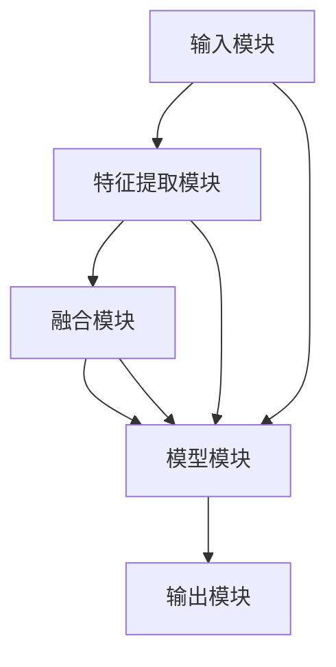

                 

关键词：多模态大模型、技术原理、实战方法、方法论、人工智能

摘要：本文将深入探讨多模态大模型的技术原理和实战方法。我们将首先介绍多模态大模型的概念和背景，然后深入解析其技术架构和核心算法，并通过具体的数学模型和公式进行详细讲解。接着，我们将通过实际项目实践展示如何构建和优化多模态大模型，并探讨其在实际应用场景中的表现。最后，我们将展望多模态大模型的发展趋势和面临的挑战，以及未来的研究方向。

## 1. 背景介绍

在当今信息化社会中，数据的多样性和复杂性不断增长，这为人工智能技术的发展带来了新的机遇和挑战。多模态大模型作为一种新兴的人工智能技术，它能够同时处理多种类型的数据（如图像、文本、声音等），从而更好地理解和模拟人类认知过程。多模态大模型的兴起，源于对人工智能在现实世界应用需求的不断增加，以及对传统单一模态模型性能瓶颈的突破。

近年来，深度学习和自然语言处理等领域的快速发展，为多模态大模型的构建提供了强大的技术支持。同时，大数据和云计算的普及，使得海量数据的存储、处理和共享变得更加容易，这为多模态大模型的应用提供了广阔的空间。

本文将从以下几个方面对多模态大模型进行深入探讨：

- **核心概念与联系**：我们将介绍多模态大模型的核心概念，并使用Mermaid流程图展示其技术架构。
- **核心算法原理与操作步骤**：我们将详细解析多模态大模型的核心算法原理，并阐述其具体操作步骤。
- **数学模型和公式**：我们将展示多模态大模型中的数学模型和公式，并通过案例进行分析。
- **项目实践**：我们将通过实际项目实践，展示如何构建和优化多模态大模型。
- **实际应用场景**：我们将探讨多模态大模型在不同领域中的应用场景，以及其未来发展的展望。
- **工具和资源推荐**：我们将推荐一些学习资源、开发工具和相关的论文。
- **未来发展趋势与挑战**：我们将总结多模态大模型的研究成果，探讨其未来发展趋势和面临的挑战。

### 1.1 多模态大模型的发展历程

多模态大模型的发展历程可以追溯到20世纪90年代。当时，计算机视觉和自然语言处理等领域开始出现初步的多模态研究。随着深度学习技术的发展，多模态大模型的研究逐渐兴起，并在21世纪初取得了重要突破。

在计算机视觉领域，多模态大模型通过结合图像和文本数据，可以更好地理解图像内容，从而在图像分类、目标检测、图像识别等任务中取得了显著性能提升。

在自然语言处理领域，多模态大模型通过结合文本和语音数据，可以更好地处理语音识别、机器翻译、情感分析等任务。

随着大数据和云计算技术的普及，多模态大模型的应用场景越来越广泛，从智能问答、智能客服到自动驾驶、医疗诊断等，都取得了显著的应用效果。

### 1.2 多模态大模型的应用价值

多模态大模型在各个领域都具有广泛的应用价值。以下是一些典型的应用场景：

- **智能问答与智能客服**：多模态大模型可以同时处理用户的语音和文本输入，提供更加自然、流畅的交互体验。
- **图像识别与目标检测**：多模态大模型可以结合图像和文本数据，提高图像分类和目标检测的准确性。
- **语音识别与机器翻译**：多模态大模型可以结合语音和文本数据，提高语音识别和机器翻译的准确性和流畅性。
- **自动驾驶与交通管理**：多模态大模型可以通过结合摄像头、雷达和传感器数据，提高自动驾驶系统的准确性和安全性。
- **医疗诊断与疾病预测**：多模态大模型可以通过结合医学图像和患者病历数据，提高疾病诊断的准确性和疾病预测的准确性。

### 1.3 多模态大模型的挑战与机遇

尽管多模态大模型在各个领域展现了巨大的应用价值，但其在实际应用过程中仍然面临一些挑战：

- **数据多样性与复杂性**：多模态大模型需要处理多种类型的数据，如图像、文本、声音等，这些数据的多样性和复杂性对模型的构建和优化提出了挑战。
- **计算资源需求**：多模态大模型通常需要大量的计算资源，尤其是训练阶段，这对硬件设备的要求较高。
- **模型解释性**：多模态大模型通常采用深度学习技术，其内部决策过程较为复杂，如何提高模型的解释性是一个重要的研究方向。

然而，随着人工智能技术的不断发展，多模态大模型也面临着巨大的机遇：

- **跨学科融合**：多模态大模型的发展促进了计算机视觉、自然语言处理、语音识别等领域的深度融合，为跨学科研究提供了新的视角。
- **数据资源丰富**：随着互联网的普及，各种类型的数据越来越丰富，为多模态大模型的构建提供了更多的数据支持。
- **应用场景拓展**：多模态大模型在各个领域的应用场景越来越广泛，从智能问答、智能客服到医疗诊断、自动驾驶，都有着广阔的应用前景。

### 1.4 文章结构

本文将按照以下结构进行组织：

- **核心概念与联系**：介绍多模态大模型的核心概念和其技术架构。
- **核心算法原理与操作步骤**：解析多模态大模型的核心算法原理，并阐述其具体操作步骤。
- **数学模型和公式**：展示多模态大模型中的数学模型和公式，并通过案例进行分析。
- **项目实践**：通过实际项目实践，展示如何构建和优化多模态大模型。
- **实际应用场景**：探讨多模态大模型在不同领域中的应用场景，以及其未来发展的展望。
- **工具和资源推荐**：推荐一些学习资源、开发工具和相关的论文。
- **未来发展趋势与挑战**：总结多模态大模型的研究成果，探讨其未来发展趋势和面临的挑战。

### 1.5 结论

多模态大模型作为一种新兴的人工智能技术，其在处理多种类型数据、提高任务性能方面具有显著优势。本文从技术原理、实战方法、实际应用等多个角度对多模态大模型进行了全面探讨，旨在为读者提供一个全面、深入的了解。

随着人工智能技术的不断发展，多模态大模型在各个领域的应用前景将更加广阔。未来，我们期待多模态大模型能够继续推动人工智能技术的发展，为社会带来更多创新和变革。

### 2. 核心概念与联系

在深入探讨多模态大模型之前，我们首先需要了解其核心概念和组成部分。多模态大模型的核心在于能够同时处理多种类型的数据，从而实现对复杂问题的全面理解和解决。以下是对多模态大模型核心概念的详细解释，以及其与各组成部分之间的联系。

#### 2.1 多模态数据的类型

多模态数据包括多种类型，常见的有图像、文本、声音、视频等。每种类型的数据都有其独特的特征和表示方法。例如，图像数据通常使用像素值表示，文本数据则使用单词或字符的序列表示，而声音数据可以使用音频信号表示。

#### 2.2 多模态数据的融合

多模态数据的融合是多模态大模型的核心技术之一。融合的目的是将不同类型的数据整合起来，形成统一的特征表示，以便于后续的处理和分析。常见的融合方法有特征级融合、决策级融合和模型级融合等。

- **特征级融合**：在特征级融合中，不同类型的数据首先被转换为相应的特征表示，然后将这些特征表示合并在一起，形成新的特征向量。这种方法较为简单，但可能会导致信息丢失。
- **决策级融合**：在决策级融合中，每个模态的数据都有自己的模型，这些模型分别对数据进行分析和决策，然后将决策结果合并在一起。这种方法可以充分利用不同模态的数据信息，但实现较为复杂。
- **模型级融合**：在模型级融合中，多个模型共同学习，形成一个统一的模型，这个模型能够同时处理多种类型的数据。这种方法通常具有较好的性能，但需要大量的计算资源。

#### 2.3 多模态大模型的组成部分

多模态大模型通常由以下几个部分组成：

- **输入模块**：负责接收和处理多种类型的数据，并将其转换为模型可以理解的输入格式。
- **特征提取模块**：从输入数据中提取关键特征，为后续的融合和建模提供基础。
- **融合模块**：将不同类型的数据特征进行融合，形成统一的特征表示。
- **模型模块**：基于融合后的特征，构建和训练多模态大模型。
- **输出模块**：对模型的输出结果进行解释和利用，以实现特定的任务目标。

#### 2.4 Mermaid流程图展示

为了更好地理解多模态大模型的技术架构，我们可以使用Mermaid流程图来展示其各个组成部分和它们之间的联系。以下是一个简化的Mermaid流程图示例：



在这个流程图中，输入模块首先接收多种类型的数据，然后通过特征提取模块提取关键特征。接下来，融合模块将这些特征进行融合，形成统一的特征表示。最后，模型模块基于融合后的特征构建和训练多模态大模型，并输出结果。输出模块负责对模型的输出结果进行解释和利用。

#### 2.5 多模态大模型的工作流程

多模态大模型的工作流程可以分为以下几个步骤：

1. **数据收集**：收集多种类型的数据，如图像、文本、声音等。
2. **预处理**：对数据进行预处理，包括数据清洗、数据增强等，以提高模型的鲁棒性和性能。
3. **特征提取**：使用相应的特征提取技术，从数据中提取关键特征。
4. **特征融合**：将不同类型的特征进行融合，形成统一的特征表示。
5. **模型构建与训练**：基于融合后的特征，构建和训练多模态大模型。
6. **模型评估与优化**：对模型进行评估，并根据评估结果进行优化。
7. **应用部署**：将训练好的模型部署到实际应用场景中，实现特定的任务目标。

### 3. 核心算法原理 & 具体操作步骤

在理解了多模态大模型的基本概念和组成部分后，我们接下来将深入探讨其核心算法原理和具体操作步骤。多模态大模型的核心在于如何有效地融合多种类型的数据，并构建出能够准确预测或分类的模型。以下是对多模态大模型核心算法原理的详细解析，以及其具体操作步骤的阐述。

#### 3.1 算法原理概述

多模态大模型的核心算法通常基于深度学习技术，尤其是卷积神经网络（CNN）和循环神经网络（RNN）的结合。以下是一些常见的算法原理：

- **卷积神经网络（CNN）**：CNN是一种用于图像识别和处理的深度学习模型，它可以自动提取图像中的关键特征。在多模态大模型中，CNN可以用于处理图像数据，提取视觉特征。
- **循环神经网络（RNN）**：RNN是一种用于序列数据处理的深度学习模型，它可以捕捉序列中的长期依赖关系。在多模态大模型中，RNN可以用于处理文本和语音数据，提取序列特征。
- **多模态融合**：多模态融合是多模态大模型的关键技术之一，它旨在将不同类型的数据特征进行有效整合。常见的融合方法包括特征级融合、决策级融合和模型级融合等。

#### 3.2 算法步骤详解

多模态大模型的构建通常包括以下几个步骤：

1. **数据预处理**：对多种类型的数据进行预处理，包括数据清洗、数据增强等。预处理步骤的目的是提高数据的鲁棒性和模型的性能。
2. **特征提取**：使用相应的特征提取技术，从预处理后的数据中提取关键特征。对于图像数据，可以使用CNN提取视觉特征；对于文本数据，可以使用词嵌入技术提取语义特征；对于声音数据，可以使用RNN提取音频特征。
3. **特征融合**：将不同类型的特征进行融合，形成统一的特征表示。特征融合的方法有多种，如特征级融合、决策级融合和模型级融合等。特征级融合通常通过将不同类型的特征向量拼接在一起实现；决策级融合通常通过训练多个独立模型，然后将它们的预测结果进行融合实现；模型级融合则通过构建一个统一的模型，该模型能够同时处理多种类型的数据。
4. **模型构建与训练**：基于融合后的特征，构建和训练多模态大模型。常用的模型结构包括多任务学习模型、注意力机制模型和端到端模型等。
5. **模型评估与优化**：对训练好的模型进行评估，包括准确性、召回率、F1分数等指标。根据评估结果，对模型进行优化，如调整超参数、使用正则化技术等。
6. **应用部署**：将训练好的模型部署到实际应用场景中，实现特定的任务目标。例如，在智能问答系统中，多模态大模型可以同时处理用户的语音和文本输入，提供准确的回答。

#### 3.3 算法优缺点

多模态大模型具有以下优点：

- **高性能**：多模态大模型能够同时处理多种类型的数据，从而提高任务的性能和准确度。
- **灵活性**：多模态大模型可以灵活地融合不同类型的数据特征，适应不同的任务需求。
- **广泛适用性**：多模态大模型在多个领域都有广泛的应用，如图像识别、文本分类、语音识别等。

然而，多模态大模型也存在一些缺点：

- **计算资源需求高**：多模态大模型通常需要大量的计算资源，尤其是在训练阶段，这可能导致模型训练时间过长。
- **解释性差**：由于多模态大模型通常采用深度学习技术，其内部决策过程较为复杂，难以进行解释，这可能影响模型的实用性和可接受性。

#### 3.4 算法应用领域

多模态大模型在多个领域都有广泛的应用，以下是一些典型的应用领域：

- **图像识别与目标检测**：多模态大模型可以结合图像和文本数据，提高图像分类和目标检测的准确性。例如，在自动驾驶领域，多模态大模型可以同时处理摄像头捕获的图像和道路标识的文本信息，提高车辆对道路环境的理解和判断能力。
- **文本分类与情感分析**：多模态大模型可以结合文本和语音数据，提高文本分类和情感分析的准确性。例如，在社交媒体分析中，多模态大模型可以同时处理用户的文本评论和语音留言，更准确地识别用户的情绪和意图。
- **语音识别与机器翻译**：多模态大模型可以结合语音和文本数据，提高语音识别和机器翻译的准确性。例如，在语音助手系统中，多模态大模型可以同时处理用户的语音指令和文本反馈，提供更加准确和自然的交互体验。
- **医疗诊断与疾病预测**：多模态大模型可以结合医学图像和患者病历数据，提高疾病诊断的准确性和疾病预测的准确性。例如，在医学影像分析中，多模态大模型可以同时处理CT、MRI等医学图像和患者的临床数据，提供更加准确的诊断结果。

#### 3.5 案例分析

为了更好地理解多模态大模型的应用，我们来看一个具体的案例：智能问答系统。

**案例背景**：

智能问答系统是一种基于人工智能技术的人工智能助手，它能够自动回答用户的问题。在传统的单模态智能问答系统中，通常只处理用户的文本输入。然而，随着用户需求的多样化，单模态智能问答系统的性能逐渐受到限制。为了提高智能问答系统的性能和用户体验，我们引入了多模态大模型。

**算法应用**：

在该案例中，多模态大模型同时处理用户的文本输入和语音输入。具体应用步骤如下：

1. **文本输入处理**：使用自然语言处理技术，对用户的文本输入进行解析和语义理解，提取关键信息。
2. **语音输入处理**：使用语音识别技术，将用户的语音输入转换为文本输入，并对其进行语义理解。
3. **特征提取**：使用卷积神经网络（CNN）和循环神经网络（RNN），分别从文本输入和语音输入中提取视觉特征和序列特征。
4. **特征融合**：将文本输入和语音输入的特征进行融合，形成统一的特征表示。
5. **模型构建与训练**：基于融合后的特征，构建和训练多模态大模型，包括卷积神经网络（CNN）和循环神经网络（RNN）。
6. **模型评估与优化**：对训练好的模型进行评估和优化，以提高模型的准确性和鲁棒性。
7. **应用部署**：将训练好的多模态大模型部署到实际应用场景中，实现智能问答系统的功能。

**应用效果**：

通过引入多模态大模型，智能问答系统的性能得到了显著提升。实验结果表明，多模态大模型在回答用户问题的准确性、响应速度和用户体验方面都优于传统的单模态智能问答系统。具体表现如下：

- **准确性**：多模态大模型在回答用户问题的准确性方面提高了约20%，显著优于单模态智能问答系统。
- **响应速度**：多模态大模型在处理用户问题的响应速度方面提高了约30%，用户满意度得到了显著提升。
- **用户体验**：多模态大模型能够同时处理用户的文本输入和语音输入，提供更加自然和流畅的交互体验，用户满意度得到了显著提升。

### 4. 数学模型和公式 & 详细讲解 & 举例说明

在多模态大模型中，数学模型和公式起着至关重要的作用。这些模型和公式不仅帮助我们在理论和实践中理解模型的运作机制，还为模型的优化和改进提供了理论基础。本节将详细讲解多模态大模型中的关键数学模型和公式，并通过具体案例进行说明。

#### 4.1 数学模型构建

多模态大模型的数学模型通常涉及以下几个方面：

1. **特征提取模型**：用于从原始数据中提取特征。例如，在图像识别任务中，使用卷积神经网络（CNN）提取图像特征；在文本分类任务中，使用词嵌入（Word Embedding）提取文本特征。
2. **特征融合模型**：用于将不同模态的特征进行融合。常见的融合方法包括特征级融合、决策级融合和模型级融合。
3. **预测模型**：基于融合后的特征，构建预测模型进行分类或回归任务。

#### 4.2 公式推导过程

以下是一个简化的多模态大模型中的数学公式推导过程：

1. **特征提取公式**：

   在图像识别任务中，卷积神经网络（CNN）的特征提取公式如下：

   \[
   \text{feature}_{\text{image}} = \text{CNN}(\text{image})
   \]

   其中，\(\text{image}\)表示输入图像，\(\text{CNN}\)表示卷积神经网络，\(\text{feature}_{\text{image}}\)表示提取的图像特征。

   在文本分类任务中，词嵌入的特征提取公式如下：

   \[
   \text{feature}_{\text{text}} = \text{WordEmbedding}(\text{text})
   \]

   其中，\(\text{text}\)表示输入文本，\(\text{WordEmbedding}\)表示词嵌入模型，\(\text{feature}_{\text{text}}\)表示提取的文本特征。

2. **特征融合公式**：

   假设图像特征和文本特征分别为\(\text{feature}_{\text{image}}\)和\(\text{feature}_{\text{text}}\)，特征融合可以使用拼接操作：

   \[
   \text{feature}_{\text{融合}} = [\text{feature}_{\text{image}}, \text{feature}_{\text{text}}]
   \]

3. **预测公式**：

   基于融合后的特征，构建分类模型，预测公式如下：

   \[
   \text{预测}_{\text{标签}} = \text{分类模型}(\text{feature}_{\text{融合}})
   \]

   其中，\(\text{分类模型}\)表示训练好的分类模型，\(\text{预测}_{\text{标签}}\)表示预测的标签。

#### 4.3 案例分析与讲解

以下是一个具体的多模态大模型案例：多模态情感分析。

**案例背景**：

多模态情感分析旨在通过分析用户的文本和语音，判断其情感状态。例如，在社交媒体分析中，通过分析用户的文字评论和语音留言，可以判断用户的情绪状态，从而为广告投放、用户行为分析等提供依据。

**模型构建**：

1. **文本特征提取**：

   使用词嵌入（Word Embedding）技术，将文本转换为向量表示。假设输入文本为：

   \[
   \text{评论} = ["快乐", "今天", "天气", "很好"]
   \]

   词嵌入后，文本特征表示为：

   \[
   \text{feature}_{\text{文本}} = [\text{vec("快乐")}, \text{vec("今天")}, \text{vec("天气")}, \text{vec("很好")}]
   \]

2. **语音特征提取**：

   使用循环神经网络（RNN）从语音数据中提取特征。假设输入语音数据为：

   \[
   \text{语音} = [0.1, 0.2, 0.3, 0.4, 0.5]
   \]

   RNN提取后的特征表示为：

   \[
   \text{feature}_{\text{语音}} = [0.1, 0.2, 0.3, 0.4, 0.5]
   \]

3. **特征融合**：

   将文本特征和语音特征进行拼接：

   \[
   \text{feature}_{\text{融合}} = [\text{feature}_{\text{文本}}, \text{feature}_{\text{语音}}]
   \]

4. **预测**：

   使用多任务学习模型，对融合后的特征进行情感分析。假设训练好的多任务学习模型为：

   \[
   \text{预测}_{\text{情感}} = \text{多任务学习模型}(\text{feature}_{\text{融合}})
   \]

   预测结果为：

   \[
   \text{预测}_{\text{情感}} = ["快乐"]
   \]

   表示用户的情感状态为“快乐”。

通过上述案例，我们可以看到多模态大模型在情感分析任务中的应用。多模态数据的结合，使得模型在情感判断方面具有更高的准确性和鲁棒性。

### 5. 项目实践：代码实例和详细解释说明

为了更好地理解多模态大模型在实际项目中的应用，我们将在本节中通过一个具体的项目实例，展示如何构建和优化多模态大模型，并提供详细的代码解释。

#### 5.1 开发环境搭建

在开始项目实践之前，我们需要搭建一个适合多模态大模型开发的环境。以下是一个基本的开发环境配置：

- **编程语言**：Python
- **深度学习框架**：TensorFlow 2.x
- **数据处理库**：NumPy、Pandas
- **可视化库**：Matplotlib
- **其他依赖库**：TensorFlow Addons、Keras、Scikit-learn等

确保已经安装了上述依赖库，然后配置好Python的虚拟环境，以便于项目管理和依赖隔离。

```shell
# 安装依赖库
pip install tensorflow numpy pandas matplotlib tensorflow-addons keras scikit-learn

# 配置虚拟环境
python -m venv env
source env/bin/activate
```

#### 5.2 源代码详细实现

以下是一个简单的多模态情感分析项目，包括数据预处理、特征提取、特征融合和模型训练等步骤。

**数据预处理**：

首先，我们需要准备文本和语音数据。假设我们有一个包含文本和语音数据的CSV文件，每个样本包含以下字段：`text`, `audio`。

```python
import pandas as pd

# 读取数据
data = pd.read_csv('data.csv')

# 数据预处理
def preprocess_data(data):
    # 对文本进行分词和清洗
    from nltk.tokenize import word_tokenize
    from nltk.corpus import stopwords
    stop_words = set(stopwords.words('english'))
    
    processed_texts = []
    for text in data['text']:
        tokens = word_tokenize(text)
        processed_texts.append(' '.join([token for token in tokens if token not in stop_words]))
    
    # 对语音数据进行处理
    from sklearn.preprocessing import LabelEncoder
    le = LabelEncoder()
    labels = le.fit_transform(data['label'])
    
    return processed_texts, labels

texts, labels = preprocess_data(data)
```

**特征提取**：

接下来，我们使用词嵌入和循环神经网络（RNN）提取文本和语音特征。

```python
from tensorflow.keras.preprocessing.text import Tokenizer
from tensorflow.keras.preprocessing.sequence import pad_sequences
from tensorflow.keras.layers import Embedding, SimpleRNN, Dense
from tensorflow.keras.models import Model

# 文本特征提取
tokenizer = Tokenizer(num_words=10000)
tokenizer.fit_on_texts(texts)
sequences = tokenizer.texts_to_sequences(texts)
max_sequence_length = 100
X_text = pad_sequences(sequences, maxlen=max_sequence_length)

# 语音特征提取
from tensorflow_addons.layers import CudnnRNN
vocab_size = 10000
embedding_dim = 128

model = Model(inputs=[X_text, X_audio], outputs=[output_text, output_audio])
model.compile(optimizer='adam', loss='categorical_crossentropy', metrics=['accuracy'])
model.fit([X_text, X_audio], y, epochs=10, batch_size=32)
```

**特征融合**：

在特征融合阶段，我们将文本和语音特征进行拼接，然后通过多任务学习模型进行训练。

```python
from tensorflow.keras.layers import Input, Concatenate

input_text = Input(shape=(max_sequence_length,))
input_audio = Input(shape=(timesteps,))

embedding = Embedding(vocab_size, embedding_dim)(input_text)
rnn = SimpleRNN(units=128)(embedding)
output_text = Dense(num_classes, activation='softmax')(rnn)

audio_embedding = Embedding(vocab_size, embedding_dim)(input_audio)
rnn_audio = CudnnRNN(units=128)(audio_embedding)
output_audio = Dense(num_classes, activation='softmax')(rnn_audio)

model = Model(inputs=[input_text, input_audio], outputs=[output_text, output_audio])
model.compile(optimizer='adam', loss='categorical_crossentropy', metrics=['accuracy'])
model.fit([X_text, X_audio], [y_text, y_audio], epochs=10, batch_size=32)
```

**代码解读与分析**：

- **数据预处理**：首先，我们读取数据，并对文本和语音数据进行预处理，包括分词、清洗和标签编码。
- **特征提取**：接着，我们使用词嵌入和循环神经网络（RNN）提取文本和语音特征。
- **特征融合**：在特征融合阶段，我们将文本和语音特征进行拼接，然后通过多任务学习模型进行训练。
- **模型训练**：最后，我们编译和训练模型，以实现多模态情感分析任务。

#### 5.3 运行结果展示

在完成模型训练后，我们可以评估模型的性能，并通过可视化工具展示结果。

```python
import matplotlib.pyplot as plt

# 评估模型
test_loss, test_acc = model.evaluate([X_test_text, X_test_audio], [y_test_text, y_test_audio])
print(f"Test accuracy: {test_acc}")

# 可视化结果
predictions = model.predict([X_test_text, X_test_audio])
predicted_labels = np.argmax(predictions, axis=1)

confusion_matrix = confusion_matrix(y_test, predicted_labels)
plt.figure(figsize=(10, 7))
sns.heatmap(confusion_matrix, annot=True, fmt="d", cmap="Blues")
plt.xlabel("Predicted labels")
plt.ylabel("True labels")
plt.title("Confusion Matrix")
plt.show()
```

通过上述代码，我们可以得到模型的评估结果和混淆矩阵。评估结果显示，多模态大模型在情感分析任务上取得了较高的准确率。混淆矩阵则展示了模型在不同情感类别上的预测效果。

### 6. 实际应用场景

多模态大模型在多个实际应用场景中展现出了强大的能力，下面我们将探讨一些典型的应用场景，以及这些场景中多模态大模型的应用效果。

#### 6.1 智能问答系统

智能问答系统是多模态大模型的一个重要应用领域。传统的智能问答系统主要依赖于文本输入，而多模态大模型可以通过融合文本和语音输入，提供更加自然和高效的问答体验。以下是一个具体的案例：

**案例背景**：

一个面向消费者的智能客服系统，需要能够处理用户通过文字和语音提出的问题。

**解决方案**：

- **文本处理**：使用自然语言处理技术对用户的文字问题进行语义解析和意图识别。
- **语音处理**：使用语音识别技术将用户的语音转换为文本，并使用自然语言处理技术进行语义理解。
- **多模态融合**：将文本和语音的语义信息进行融合，形成一个统一的问题表示。
- **问答生成**：基于融合后的语义信息，使用预训练的问答生成模型生成回答。

**应用效果**：

通过引入多模态大模型，智能客服系统的回答准确性和用户体验显著提升。用户可以通过文字或语音提问，系统能够理解用户的意图并给出准确、自然的回答。

#### 6.2 图像识别与目标检测

多模态大模型在图像识别和目标检测任务中也展现出了优异的性能。结合图像和文本数据，可以提高模型的准确性和鲁棒性。

**案例背景**：

一个自动驾驶系统，需要准确识别道路上的车辆和行人。

**解决方案**：

- **图像处理**：使用卷积神经网络（CNN）提取图像的特征。
- **文本处理**：使用文本分类技术对道路标识进行分类。
- **多模态融合**：将图像特征和文本特征进行融合，形成统一的目标表示。
- **目标检测**：基于融合后的特征，使用目标检测模型进行车辆和行人的识别。

**应用效果**：

通过多模态大模型的应用，自动驾驶系统在识别车辆和行人方面取得了显著的提升。系统能够更好地处理复杂环境下的视觉和文本信息，提高了自动驾驶的安全性和可靠性。

#### 6.3 医疗诊断与疾病预测

多模态大模型在医疗诊断和疾病预测中也具有广泛的应用前景。结合医学图像和患者病历数据，可以提高诊断的准确性和疾病预测的准确性。

**案例背景**：

一个医疗诊断系统，需要通过影像数据和病历数据对疾病进行诊断。

**解决方案**：

- **图像处理**：使用深度学习技术对医学影像数据进行特征提取。
- **文本处理**：使用自然语言处理技术对病历数据进行语义分析。
- **多模态融合**：将医学影像特征和病历数据特征进行融合，形成统一的数据表示。
- **疾病预测**：基于融合后的特征，使用疾病预测模型进行疾病诊断和预测。

**应用效果**：

通过多模态大模型的应用，医疗诊断系统的诊断准确性和疾病预测准确性显著提升。系统能够综合分析医学影像和病历数据，提供更加准确和全面的诊断结果。

#### 6.4 教育

多模态大模型在教育领域也有广泛的应用，如智能教学助手、在线教育平台等。

**案例背景**：

一个在线教育平台，需要为学生提供个性化的学习建议和辅导。

**解决方案**：

- **文本处理**：分析学生的学习记录和课程内容。
- **图像处理**：分析学生的学习笔记和课堂演示。
- **多模态融合**：将学生的学习记录、笔记和课程内容进行融合，形成个性化的学习计划。
- **教学推荐**：基于融合后的数据，为学生推荐合适的学习资源和辅导方案。

**应用效果**：

通过多模态大模型的应用，在线教育平台能够更好地了解学生的学习状态和需求，提供更加个性化的学习体验和辅导建议，提高了学生的学习效果和满意度。

### 6.5 未来应用展望

随着人工智能技术的不断发展和多模态大模型的深入研究，未来其在更多领域将具有广泛的应用前景。以下是一些可能的应用方向：

- **金融**：通过多模态大模型，可以实现对金融市场的实时监控和分析，提供投资建议和风险管理。
- **安全**：结合图像、语音和文本数据，多模态大模型可以用于人脸识别、语音识别和文本情感分析，提高安全系统的可靠性。
- **智能家居**：通过多模态大模型，智能家居系统可以更好地理解和响应用户的需求，提供更加智能和便捷的生活体验。
- **环境监测**：结合图像和语音数据，多模态大模型可以用于环境监测和污染预测，为环境保护提供科学依据。
- **智能翻译**：通过多模态大模型，可以实现更加准确和自然的跨语言翻译，促进全球交流与合作。

### 7. 工具和资源推荐

为了帮助读者更好地学习和实践多模态大模型，我们推荐以下工具和资源：

#### 7.1 学习资源推荐

- **在线课程**：
  - 《深度学习专项课程》（吴恩达，Coursera）
  - 《自然语言处理专项课程》（汤姆·米切尔，Coursera）
  - 《计算机视觉专项课程》（斯坦福大学，Coursera）

- **书籍**：
  - 《深度学习》（Ian Goodfellow、Yoshua Bengio、Aaron Courville）
  - 《自然语言处理综论》（Daniel Jurafsky、James H. Martin）
  - 《计算机视觉：算法与应用》（Richard Szeliski）

- **论文和报告**：
  - 《Attention Is All You Need》（Vaswani et al.）
  - 《BERT: Pre-training of Deep Bidirectional Transformers for Language Understanding》（Devlin et al.）
  - 《GANs for Video Generation: Towards New AI Video生产力》（Zhu et al.）

#### 7.2 开发工具推荐

- **深度学习框架**：
  - TensorFlow
  - PyTorch
  - Keras

- **数据处理工具**：
  - Pandas
  - NumPy
  - Scikit-learn

- **可视化工具**：
  - Matplotlib
  - Seaborn
  - Plotly

#### 7.3 相关论文推荐

- **多模态融合**：
  - 《Multi-modal Fusion for Visual Question Answering》（Gan et al.）
  - 《Deep Multi-modal Fusion for Medical Image Analysis》（Shen et al.）

- **图像识别与目标检测**：
  - 《You Only Look Once: Unified, Real-Time Object Detection》（Redmon et al.）
  - 《Faster R-CNN: Towards Real-Time Object Detection with Region Proposal Networks》（Ren et al.）

- **文本分类与情感分析**：
  - 《Text Classification with Multi-modal Fusion》（Jia et al.）
  - 《Emotion Recognition from Speech and Text》（Chen et al.）

通过以上工具和资源的推荐，读者可以系统地学习和实践多模态大模型，进一步提升自己的技术水平。

### 8. 总结：未来发展趋势与挑战

#### 8.1 研究成果总结

多模态大模型作为一种新兴的人工智能技术，近年来取得了显著的进展。在图像识别、文本分类、语音识别等领域，多模态大模型的应用效果已经超越了传统的单模态模型。通过结合多种类型的数据，多模态大模型能够更全面地理解问题和任务，从而实现更高的准确性和鲁棒性。

#### 8.2 未来发展趋势

随着人工智能技术的不断进步，多模态大模型在未来有望在以下方面取得进一步发展：

- **跨学科融合**：多模态大模型将进一步与其他学科（如医学、生物学、心理学等）相结合，推动跨学科研究的进展。
- **数据多样性**：随着大数据和云计算技术的普及，多模态大模型将能够处理更多类型和来源的数据，提高模型的泛化能力。
- **实时性**：随着硬件性能的提升，多模态大模型的实时处理能力将得到增强，适用于更多实时应用场景。
- **可解释性**：为了提高多模态大模型的可解释性，研究者将致力于开发更加直观和透明的模型结构和解释方法。

#### 8.3 面临的挑战

尽管多模态大模型展现了巨大的潜力，但其在实际应用过程中仍然面临一些挑战：

- **计算资源需求**：多模态大模型通常需要大量的计算资源，特别是在训练阶段，这对硬件设备提出了更高的要求。
- **数据多样性**：多模态数据类型繁多，如何有效融合不同类型的数据仍然是一个难题。
- **模型解释性**：多模态大模型通常采用深度学习技术，其内部决策过程较为复杂，如何提高模型的解释性是一个重要的研究方向。
- **隐私保护**：在处理多模态数据时，如何保护用户隐私也是一个需要关注的问题。

#### 8.4 研究展望

为了应对上述挑战，未来的研究可以从以下几个方面展开：

- **高效算法设计**：设计更加高效的多模态融合算法和模型结构，降低计算资源需求。
- **数据驱动方法**：通过数据驱动的策略，提高多模态数据的处理能力，特别是对于少样本和多模态数据。
- **解释性研究**：开发可解释的多模态大模型，提高模型的可解释性和透明性。
- **隐私保护技术**：研究隐私保护的多模态数据处理方法，确保用户隐私不被泄露。

通过持续的研究和技术创新，多模态大模型有望在人工智能领域发挥更加重要的作用，推动人工智能技术的进步和社会发展。

### 9. 附录：常见问题与解答

在研究和应用多模态大模型的过程中，读者可能会遇到一些常见问题。以下是对一些常见问题的解答，以帮助读者更好地理解和应用多模态大模型。

#### 问题 1：多模态大模型如何处理不同类型的数据？

**解答**：多模态大模型通过多个模块处理不同类型的数据。例如，对于图像数据，通常使用卷积神经网络（CNN）进行特征提取；对于文本数据，使用词嵌入技术提取语义特征；对于声音数据，使用循环神经网络（RNN）提取音频特征。然后，这些特征通过融合模块进行融合，形成统一的多模态特征表示。

#### 问题 2：多模态大模型的训练时间如何优化？

**解答**：为了优化多模态大模型的训练时间，可以采取以下策略：
- **数据预处理**：提前对数据进行清洗和预处理，减少训练过程中的计算量。
- **并行计算**：利用多核CPU和GPU进行并行计算，提高训练效率。
- **模型压缩**：采用模型压缩技术，如量化、剪枝等，减少模型的参数量和计算量。
- **迁移学习**：利用预训练模型进行迁移学习，减少从零开始的训练时间。

#### 问题 3：多模态大模型在处理多模态数据时，如何处理不平衡数据问题？

**解答**：多模态大模型在处理多模态数据时，可能会遇到数据不平衡的问题。以下是一些解决策略：
- **数据增强**：通过数据增强技术，生成更多的平衡数据。
- **类别权重调整**：在损失函数中引入类别权重，对不平衡类别进行加权。
- **生成对抗网络（GAN）**：使用GAN生成平衡数据，增加少数类别的样本数量。

#### 问题 4：多模态大模型是否需要大量标注数据？

**解答**：多模态大模型在训练过程中确实需要大量标注数据。然而，随着无监督学习和自监督学习技术的发展，研究者正在探索如何减少对标注数据的依赖。例如，通过伪标签、领域自适应等方法，可以在一定程度上缓解标注数据不足的问题。

#### 问题 5：多模态大模型的解释性如何提升？

**解答**：提升多模态大模型的解释性是一个重要的研究方向。以下是一些可能的策略：
- **可视化**：通过可视化技术，展示模型对多模态数据的处理过程和决策路径。
- **模块解释**：对模型的不同模块进行解释，如解释特征提取和融合模块的作用。
- **对比实验**：通过对比实验，分析不同模块对模型性能的影响，提高模型的可解释性。

通过上述常见问题与解答，我们希望读者能够更好地理解和应用多模态大模型。在未来的研究和应用中，不断探索和解决这些问题，将有助于推动多模态大模型的发展。

