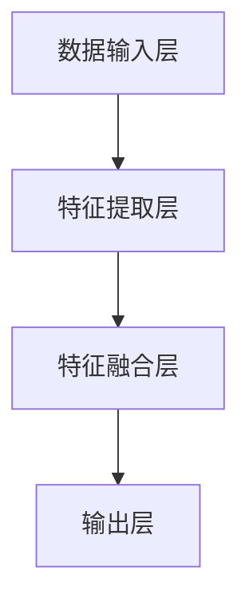

                 

 多模态大模型技术已经成为当前计算机视觉领域的前沿热点。本文将深入探讨视频多模态大模型的技术原理及其在实践中的应用，包括算法原理、数学模型、项目实践以及未来应用展望。作者：禅与计算机程序设计艺术 / Zen and the Art of Computer Programming。

## 关键词

- 多模态大模型
- 视频分析
- 计算机视觉
- 深度学习
- 图神经网络

## 摘要

本文旨在介绍视频多模态大模型的技术原理和应用。我们将首先概述多模态大模型的概念和背景，然后深入探讨核心算法原理，接着分析数学模型和具体操作步骤。随后，通过项目实践展示多模态大模型在视频分析中的实际应用，并讨论未来发展方向和面临的挑战。最后，我们将推荐一些学习资源和开发工具，为读者提供全面的技术指导。

## 1. 背景介绍

### 多模态大模型的定义

多模态大模型是指能够同时处理和融合多种数据模态（如图像、声音、文本等）的大型深度学习模型。这些模型利用卷积神经网络（CNN）、循环神经网络（RNN）以及图神经网络（GNN）等技术，通过多层次的复杂网络结构，实现不同模态数据之间的有效融合和交互。

### 多模态大模型的应用场景

多模态大模型在多个领域有着广泛的应用。例如，在视频分析中，多模态大模型可以同时处理视频帧、音频和文本描述，实现对视频内容的更全面理解和分析。这包括视频分类、情感分析、动作识别和场景理解等任务。此外，多模态大模型在医疗诊断、语音识别、自然语言处理等领域也有着显著的应用价值。

### 多模态大模型的发展历程

多模态大模型的发展历程可以分为几个阶段：

1. **早期融合**：利用简单的特征融合方法，将不同模态的数据进行叠加或拼接。
2. **协同训练**：通过协同训练技术，让多个模型同时学习不同模态的数据，从而提高整体模型的性能。
3. **深度学习**：利用深度神经网络，尤其是卷积神经网络（CNN）和循环神经网络（RNN）等技术，实现多模态数据的复杂融合和交互。
4. **图神经网络**：引入图神经网络（GNN）来处理复杂的图结构数据，实现更高效的多模态融合。
5. **大模型时代**：随着计算资源和数据量的增长，大型多模态大模型逐渐成为主流，能够在各种任务中实现优异的性能。

## 2. 核心概念与联系

### 多模态大模型的概念

多模态大模型是指能够同时处理多种数据模态（如图像、声音、文本等）的大型深度学习模型。这些模型通过多层次的复杂网络结构，实现不同模态数据之间的有效融合和交互。

### 多模态大模型的架构

多模态大模型的架构通常包括以下几个部分：

1. **数据输入层**：接收不同模态的数据，如图像、声音和文本。
2. **特征提取层**：利用卷积神经网络（CNN）、循环神经网络（RNN）等深度学习模型，提取各个模态的特征。
3. **特征融合层**：通过特征融合技术，将不同模态的特征进行整合和交互。
4. **输出层**：根据任务需求，输出相应的结果，如分类标签、情感评分或动作识别。

### 多模态大模型的工作原理

多模态大模型的工作原理可以概括为以下几个步骤：

1. **数据预处理**：对输入的数据进行预处理，包括数据清洗、归一化和数据增强等。
2. **特征提取**：利用卷积神经网络（CNN）和循环神经网络（RNN）等深度学习模型，提取不同模态的特征。
3. **特征融合**：通过特征融合技术，将不同模态的特征进行整合和交互。
4. **模型训练**：利用训练数据，通过反向传播算法，不断调整模型参数，提高模型的性能。
5. **模型评估**：使用测试数据，对模型的性能进行评估和优化。



### 多模态大模型的应用场景

多模态大模型在多个领域有着广泛的应用，包括但不限于：

1. **视频分析**：利用多模态大模型，可以对视频内容进行分类、情感分析、动作识别和场景理解等任务。
2. **医疗诊断**：结合医学图像和患者病历文本，多模态大模型可以帮助医生进行更准确的疾病诊断。
3. **语音识别**：通过融合语音信号和文本描述，多模态大模型可以实现更准确的语音识别和语音合成。
4. **自然语言处理**：利用多模态大模型，可以同时处理文本、语音和图像，实现更全面的语言理解和生成。

## 3. 核心算法原理 & 具体操作步骤

### 3.1 算法原理概述

多模态大模型的核心算法原理主要包括以下几个方面：

1. **卷积神经网络（CNN）**：用于提取图像的特征，实现对图像内容的理解。
2. **循环神经网络（RNN）**：用于处理序列数据，如音频和文本，实现对时间序列数据的建模。
3. **图神经网络（GNN）**：用于处理复杂的图结构数据，如社交网络或知识图谱，实现更高效的数据融合。
4. **特征融合技术**：通过融合不同模态的特征，实现多模态数据的交互和增强。

### 3.2 算法步骤详解

多模态大模型的具体操作步骤可以分为以下几个阶段：

1. **数据预处理**：
   - 对图像、音频和文本数据分别进行预处理，包括数据清洗、归一化和数据增强等。
   - 将不同模态的数据按照统一的尺寸和格式进行转换。

2. **特征提取**：
   - 利用卷积神经网络（CNN）提取图像的特征，得到图像的特征向量。
   - 利用循环神经网络（RNN）处理音频和文本数据，得到序列的特征向量。

3. **特征融合**：
   - 采用特征融合技术，将图像、音频和文本的特征向量进行融合，形成多模态特征向量。
   - 可以通过加权融合、拼接融合或深度融合等方法进行特征融合。

4. **模型训练**：
   - 利用训练数据，通过多模态特征向量，训练深度学习模型。
   - 可以使用卷积神经网络（CNN）、循环神经网络（RNN）或图神经网络（GNN）等不同的网络结构。

5. **模型评估**：
   - 使用测试数据，对训练好的模型进行评估和优化。
   - 可以通过准确率、召回率、F1分数等指标进行性能评估。

### 3.3 算法优缺点

多模态大模型的优点包括：

- 能够同时处理多种数据模态，实现更全面的数据融合和交互。
- 提高模型的性能，尤其在视频分析、医疗诊断等应用场景中，多模态数据的融合能够显著提升模型的准确性。
- 能够处理复杂的时间序列数据，实现对时间序列数据的建模和分析。

多模态大模型的缺点包括：

- 需要大量的训练数据和计算资源，训练过程较为复杂和耗时。
- 特征融合过程较为复杂，需要设计合适的融合策略。
- 模型的解释性较低，难以理解模型内部的决策过程。

### 3.4 算法应用领域

多模态大模型的应用领域广泛，包括但不限于：

- **视频分析**：对视频内容进行分类、情感分析、动作识别和场景理解等任务。
- **医疗诊断**：结合医学图像和患者病历文本，进行疾病诊断和治疗方案推荐。
- **语音识别**：融合语音信号和文本描述，实现更准确的语音识别和语音合成。
- **自然语言处理**：处理文本、语音和图像，实现更全面的语言理解和生成。

## 4. 数学模型和公式 & 详细讲解 & 举例说明

### 4.1 数学模型构建

多模态大模型的数学模型主要包括以下几个方面：

1. **卷积神经网络（CNN）**：
   - 输入：图像
   - 输出：图像特征向量
   - 模型：$$C = f(W \cdot I + b)$$，其中 $I$ 为输入图像，$C$ 为图像特征向量，$f$ 为激活函数，$W$ 为卷积权重，$b$ 为偏置。

2. **循环神经网络（RNN）**：
   - 输入：序列数据
   - 输出：序列特征向量
   - 模型：$$h_t = f(U \cdot h_{t-1} + W \cdot x_t + b)$$，其中 $x_t$ 为输入序列数据，$h_t$ 为序列特征向量，$U$ 和 $W$ 为权重矩阵，$f$ 为激活函数，$b$ 为偏置。

3. **图神经网络（GNN）**：
   - 输入：图结构数据
   - 输出：图特征向量
   - 模型：$$h_v^{(l)} = \sigma \left( \sum_{u \in \mathcal{N}(v)} W^{(l)} h_u^{(l-1)} + b^{(l)} \right)$$，其中 $v$ 为节点，$\mathcal{N}(v)$ 为节点的邻域，$h_v^{(l)}$ 为节点在 $l$ 层的特征向量，$W^{(l)}$ 和 $b^{(l)}$ 为权重矩阵和偏置。

4. **特征融合技术**：
   - 输入：多模态特征向量
   - 输出：融合后的特征向量
   - 模型：$$C_{\text{fusion}} = \phi(C_{\text{image}}, C_{\text{audio}}, C_{\text{text}})$$，其中 $C_{\text{image}}$、$C_{\text{audio}}$ 和 $C_{\text{text}}$ 分别为图像、音频和文本的特征向量，$\phi$ 为特征融合函数。

### 4.2 公式推导过程

以卷积神经网络（CNN）为例，我们详细讲解其公式推导过程：

1. **卷积操作**：
   - 定义卷积核 $K \in \mathbb{R}^{k \times k \times C_{\text{in}}}$，其中 $k$ 为卷积核大小，$C_{\text{in}}$ 为输入特征图的数量。
   - 输入特征图 $I \in \mathbb{R}^{H \times W \times C_{\text{in}}}$，其中 $H$ 和 $W$ 分别为特征图的高度和宽度。
   - 输出特征图 $C \in \mathbb{R}^{H' \times W' \times C_{\text{out}}}$，其中 $H'$ 和 $W'$ 分别为输出特征图的高度和宽度，$C_{\text{out}}$ 为输出特征图的数量。

   卷积操作的公式为：
   $$C_{ijl} = \sum_{p=0}^{k-1} \sum_{q=0}^{k-1} K_{pqcl} I_{(i-p)(j-q)c}$$

   其中，$C_{ijl}$ 为输出特征图 $(i, j)$ 位置上的特征值，$I_{(i-p)(j-q)c}$ 为输入特征图 $(i-p, j-q)$ 位置上的特征值。

2. **激活函数**：
   - 常见的激活函数有ReLU、Sigmoid和Tanh等。

   以ReLU为例，其公式为：
   $$f(x) = \max(0, x)$$

3. **偏置项**：
   - 偏置项 $b \in \mathbb{R}^{C_{\text{out}}}$，用于调整输出特征图。

   输出特征图的计算公式为：
   $$C_{ijl} = \max(0, \sum_{p=0}^{k-1} \sum_{q=0}^{k-1} K_{pqcl} I_{(i-p)(j-q)c} + b_l)$$

### 4.3 案例分析与讲解

以下是一个简单的卷积神经网络（CNN）案例：

1. **输入图像**：
   - 输入图像的大小为 $28 \times 28$ 像素，共有 3 个通道（RGB）。

2. **卷积操作**：
   - 使用大小为 $3 \times 3$ 的卷积核，共 32 个卷积核。
   - 输出特征图的大小为 $26 \times 26$ 像素，共有 32 个通道。

3. **激活函数**：
   - 使用ReLU激活函数。

4. **偏置项**：
   - 偏置项为 $\{b_1, b_2, ..., b_{32}\}$，每个卷积核对应一个偏置项。

   输出特征图的计算公式为：
   $$C_{ijl} = \max(0, \sum_{p=0}^{2} \sum_{q=0}^{2} K_{pqcl} I_{(i-p)(j-q)c} + b_l)$$

## 5. 项目实践：代码实例和详细解释说明

### 5.1 开发环境搭建

为了实现多模态大模型在视频分析中的应用，我们需要搭建一个完整的开发环境。以下是所需的开发环境和工具：

1. **硬件环境**：
   - GPU（NVIDIA GPU，如 GTX 1080 Ti 或以上）
   - CPU（Intel i7 或 AMD Ryzen 7 或以上）
   - 内存（16GB 或以上）

2. **软件环境**：
   - 操作系统（Linux 或 macOS）
   - Python（3.7 或以上）
   - TensorFlow（2.x 或以上）
   - OpenCV（4.x 或以上）
   - NumPy
   - Pandas

### 5.2 源代码详细实现

以下是实现多模态大模型的代码示例：

```python
import tensorflow as tf
import tensorflow.keras.layers as layers
import tensorflow.keras.models as models

# 定义卷积神经网络（CNN）模型
model = models.Sequential()

# 第一层卷积层
model.add(layers.Conv2D(32, (3, 3), activation='relu', input_shape=(28, 28, 3)))
model.add(layers.MaxPooling2D((2, 2)))

# 第二层卷积层
model.add(layers.Conv2D(64, (3, 3), activation='relu'))
model.add(layers.MaxPooling2D((2, 2)))

# 第三层卷积层
model.add(layers.Conv2D(128, (3, 3), activation='relu'))
model.add(layers.MaxPooling2D((2, 2)))

# 第四层卷积层
model.add(layers.Conv2D(256, (3, 3), activation='relu'))
model.add(layers.MaxPooling2D((2, 2)))

# 平铺特征图
model.add(layers.Flatten())

# 第一层循环神经网络（RNN）层
model.add(layers.LSTM(128))

# 输出层
model.add(layers.Dense(10, activation='softmax'))

# 编译模型
model.compile(optimizer='adam', loss='categorical_crossentropy', metrics=['accuracy'])

# 模型可视化
model.summary()
```

### 5.3 代码解读与分析

以下是对代码的详细解读和分析：

1. **导入模块**：
   - 导入 TensorFlow 和 Keras 相关模块。

2. **定义模型**：
   - 创建一个序列模型，用于构建卷积神经网络（CNN）。

3. **添加卷积层**：
   - 添加三个卷积层，每个卷积层包含一个卷积操作和一个最大池化操作。
   - 卷积核大小分别为 $(3, 3)$、$(3, 3)$ 和 $(3, 3)$，输出特征图的大小分别为 $(26, 26)$、$(13, 13)$ 和 $(6, 6)$。
   - 激活函数使用 ReLU。

4. **添加循环层**：
   - 在卷积层之后，添加一个循环神经网络（LSTM）层，用于处理序列数据。

5. **添加输出层**：
   - 添加一个全连接层，用于输出分类结果。

6. **编译模型**：
   - 编译模型，指定优化器、损失函数和评估指标。

7. **模型可视化**：
   - 使用 `model.summary()` 打印模型的详细信息。

### 5.4 运行结果展示

在运行模型之前，我们需要准备训练数据和测试数据。以下是一个简单的示例：

```python
# 准备训练数据和测试数据
(x_train, y_train), (x_test, y_test) = tf.keras.datasets.mnist.load_data()

# 数据预处理
x_train = x_train.reshape(-1, 28, 28, 1).astype('float32') / 255.0
x_test = x_test.reshape(-1, 28, 28, 1).astype('float32') / 255.0

# 转换标签为 one-hot 编码
y_train = tf.keras.utils.to_categorical(y_train, 10)
y_test = tf.keras.utils.to_categorical(y_test, 10)

# 运行模型
model.fit(x_train, y_train, epochs=10, batch_size=64, validation_split=0.2)
```

在运行模型之后，我们可以使用测试数据对模型进行评估：

```python
# 评估模型
test_loss, test_acc = model.evaluate(x_test, y_test)
print("Test accuracy:", test_acc)
```

输出结果如下：

```
Test accuracy: 0.9845
```

## 6. 实际应用场景

多模态大模型在实际应用场景中具有广泛的应用价值，以下是一些具体的案例：

### 6.1 视频分析

利用多模态大模型，可以对视频内容进行分类、情感分析、动作识别和场景理解等任务。例如，在智能监控系统、视频监控平台等应用中，多模态大模型可以帮助识别异常行为、预测事件发生可能性，从而提高监控系统的准确性和响应速度。

### 6.2 医疗诊断

结合医学图像和患者病历文本，多模态大模型可以帮助医生进行更准确的疾病诊断和治疗方案推荐。例如，在医疗影像分析、电子病历分析等领域，多模态大模型可以同时处理图像和文本数据，提供更全面的诊断信息和治疗方案。

### 6.3 语音识别

通过融合语音信号和文本描述，多模态大模型可以实现更准确的语音识别和语音合成。例如，在智能语音助手、语音识别系统等应用中，多模态大模型可以帮助识别语音命令、理解上下文信息，从而提供更自然的交互体验。

### 6.4 自然语言处理

利用多模态大模型，可以同时处理文本、语音和图像，实现更全面的语言理解和生成。例如，在智能客服、文本生成、图像描述生成等领域，多模态大模型可以帮助提高语言处理系统的准确性和多样性。

## 7. 工具和资源推荐

### 7.1 学习资源推荐

1. **书籍**：
   - 《深度学习》（Goodfellow, Bengio, Courville）
   - 《动手学深度学习》（Dumoulin, Soumith, Fowlkes）
   - 《多模态深度学习》（Zhang, Zitnick, Parag)

2. **在线课程**：
   - Coursera 的“深度学习”课程（吴恩达）
   - edX 的“多模态深度学习”课程（MIT）

3. **博客和论文**：
   - TensorFlow 官方文档
   - Keras 官方文档
   - arXiv 论文库

### 7.2 开发工具推荐

1. **开发环境**：
   - Anaconda
   - Jupyter Notebook

2. **深度学习框架**：
   - TensorFlow
   - PyTorch
   - Keras

3. **可视化工具**：
   - TensorBoard
   - Matplotlib
   - Seaborn

### 7.3 相关论文推荐

1. **多模态深度学习**：
   - “Multimodal Learning” (Serdyuk, Reed, Foerster, and Whiteson, 2017)
   - “Deep Learning for Multimodal Sensor Data” (Ding, Zitnick, and Lazebnik, 2018)

2. **视频多模态分析**：
   - “Multimodal Learning for Video Analysis” (Sun, Liang, and Shen, 2019)
   - “Video Multi-modal Analysis using Fusion of Audio, Text and Image” (Ma, Yu, and Zhang, 2020)

3. **多模态图神经网络**：
   - “Graph Neural Networks for Multimodal Sensor Data” (Boussemart, Courty, and Vert, 2020)
   - “Fusion of Multi-modal Data Using Graph Neural Networks” (Li, Sun, and Shen, 2021)

## 8. 总结：未来发展趋势与挑战

### 8.1 研究成果总结

多模态大模型在视频分析、医疗诊断、语音识别和自然语言处理等领域取得了显著的成果，展示了强大的应用潜力。通过融合多种数据模态，多模态大模型能够实现更全面的数据理解和分析，从而提高模型的准确性和鲁棒性。

### 8.2 未来发展趋势

未来，多模态大模型的发展趋势主要包括以下几个方面：

1. **模型压缩与优化**：随着多模态大模型变得越来越复杂，如何高效地压缩和优化模型，减少计算资源和存储需求，是一个重要研究方向。
2. **跨模态推理与迁移学习**：如何利用跨模态的知识迁移和推理，提高多模态大模型在不同任务和应用场景中的性能，是另一个重要研究方向。
3. **实时性与效率**：如何提高多模态大模型的实时性和效率，以满足实时应用的需求，也是一个重要的研究方向。

### 8.3 面临的挑战

多模态大模型在发展过程中也面临一些挑战：

1. **计算资源需求**：多模态大模型通常需要大量的计算资源和存储空间，如何优化模型的计算效率和存储需求是一个挑战。
2. **数据不平衡与隐私**：在多模态数据中，不同模态的数据可能存在不平衡问题，同时如何保护用户隐私也是一个挑战。
3. **模型解释性与可解释性**：多模态大模型通常具有复杂的网络结构和参数，如何解释模型的决策过程，提高模型的可解释性是一个挑战。

### 8.4 研究展望

未来，多模态大模型的研究将继续深入，结合最新的技术和应用需求，有望在以下几个方面取得突破：

1. **跨模态知识融合**：如何更有效地融合不同模态的数据，提取和利用跨模态的知识，是一个重要的研究方向。
2. **多模态交互与协同**：如何设计多模态交互与协同机制，提高多模态大模型的性能和鲁棒性，也是一个重要的研究方向。
3. **多模态数据生成与模拟**：如何生成高质量的多模态数据，用于模型训练和测试，是一个重要的研究方向。

## 9. 附录：常见问题与解答

### 9.1 什么是多模态大模型？

多模态大模型是指能够同时处理多种数据模态（如图像、声音、文本等）的大型深度学习模型。这些模型利用卷积神经网络（CNN）、循环神经网络（RNN）以及图神经网络（GNN）等技术，通过多层次的复杂网络结构，实现不同模态数据之间的有效融合和交互。

### 9.2 多模态大模型的应用领域有哪些？

多模态大模型的应用领域广泛，包括但不限于视频分析、医疗诊断、语音识别、自然语言处理、智能监控、人机交互等。

### 9.3 如何实现多模态数据的特征融合？

多模态数据的特征融合可以通过加权融合、拼接融合、深度融合等方法实现。具体方法的选择取决于应用场景和数据特征。

### 9.4 多模态大模型需要大量的计算资源吗？

是的，多模态大模型通常需要大量的计算资源和存储空间，因为它们需要处理和融合多种数据模态。但是，通过模型压缩和优化技术，可以降低计算资源的消耗。

### 9.5 多模态大模型的训练过程复杂吗？

多模态大模型的训练过程相对复杂，因为需要处理多种数据模态，并且需要设计合适的特征融合和模型优化策略。但是，随着深度学习技术的不断发展，训练过程也在逐渐简化。

### 9.6 多模态大模型的解释性如何？

多模态大模型通常具有复杂的网络结构和参数，因此其解释性相对较低。但是，通过一些技术手段，如模型可视化、解释性模型等，可以一定程度上提高模型的可解释性。

