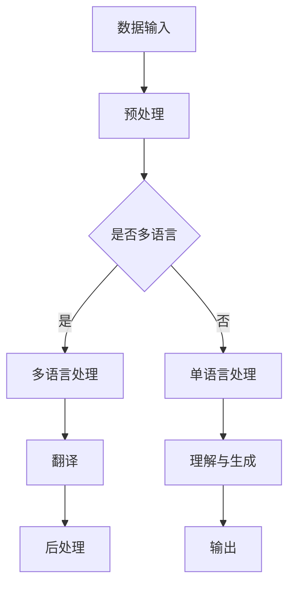

                 

关键词：多语言AI、跨语言理解、生成模型、自然语言处理、模型架构、算法原理、应用领域、数学模型、实践案例、工具推荐

> 摘要：本文旨在深入探讨多语言AI模型在跨语言理解与生成方面的研究与应用。通过对多语言AI模型的核心概念、算法原理、数学模型、实践案例以及未来展望的详细解析，本文为读者提供了一幅完整的跨语言AI生态系统蓝图。

## 1. 背景介绍

### 1.1 多语言AI的重要性

随着全球化的不断深入和信息时代的迅猛发展，多语言AI技术成为了现代信息技术中的重要一环。无论是在国际商务、文化交流、旅游服务，还是在多语言搜索引擎、智能客服、跨语言翻译等领域，多语言AI都发挥着至关重要的作用。据估算，全球每天产生的数据中有超过80%是非结构化数据，其中大量数据是语言文本。这些文本数据如果不经过处理，将无法被计算机有效利用。因此，开发能够理解和生成多种语言的多语言AI模型，已经成为学术界和工业界共同关注的热点问题。

### 1.2 跨语言理解的挑战

跨语言理解是多语言AI的核心任务之一。它涉及到对源语言和目标语言的语义进行准确理解和映射。然而，跨语言理解面临着诸多挑战。首先，语言间的差异巨大，不同语言在语法、词汇、语义表达上都有显著的差异，这给模型训练带来了困难。其次，跨语言理解需要处理多种语言的语法和词汇之间的对应关系，这通常是一个复杂且不精确的过程。最后，跨语言理解的模型需要具备一定的通用性，能够在多种语言之间灵活切换和适应。

## 2. 核心概念与联系

为了深入理解多语言AI模型，我们首先需要明确几个核心概念，包括自然语言处理（NLP）、机器翻译（MT）和生成模型（Generator Model）。

### 2.1 自然语言处理（NLP）

自然语言处理（NLP）是人工智能领域的一个重要分支，它旨在使计算机能够理解、处理和生成自然语言。NLP的核心任务是让计算机能够与人类自然地进行交流，这包括语音识别、文本分析、语义理解、语言生成等多个方面。在多语言AI模型中，NLP是基础，它提供了从文本数据中提取有用信息的能力。

### 2.2 机器翻译（MT）

机器翻译（MT）是一种利用计算机程序将一种语言的文本自动翻译成另一种语言的技术。机器翻译是跨语言理解的重要应用场景之一。它不仅能够帮助解决语言障碍，还能够促进国际交流和全球化发展。机器翻译可以分为基于规则的方法、基于统计的方法和基于神经网络的深度学习方法。近年来，基于神经网络的深度学习方法在机器翻译领域取得了显著的成果。

### 2.3 生成模型（Generator Model）

生成模型是一种能够根据输入数据生成新数据的模型。在多语言AI中，生成模型用于生成目标语言的文本。生成模型可以分为无监督生成模型、有监督生成模型和半监督生成模型。无监督生成模型能够从未标记的数据中学习并生成新的文本，有监督生成模型需要大量的标注数据进行训练，而半监督生成模型结合了无监督和有监督学习的优点。

### 2.4 Mermaid 流程图

以下是一个简化的多语言AI模型的Mermaid流程图，展示了从输入到输出的整个过程：



## 3. 核心算法原理 & 具体操作步骤

### 3.1 算法原理概述

多语言AI模型的核心算法主要涉及自然语言处理、机器翻译和生成模型。自然语言处理负责对输入文本进行预处理，包括分词、词性标注、句法分析等；机器翻译则负责将源语言文本翻译成目标语言文本；生成模型则用于生成自然流畅的目标语言文本。

### 3.2 算法步骤详解

1. **数据预处理**：首先，对输入文本进行预处理，包括去除噪声、分词、词性标注等步骤。

2. **多语言处理**：如果输入文本是多种语言的混合，需要进行多语言处理。这通常涉及到语言检测、文本分类等任务。

3. **机器翻译**：利用深度学习模型进行机器翻译。当前最流行的模型是基于注意力机制的序列到序列（Seq2Seq）模型和Transformer模型。

4. **后处理**：对生成的目标语言文本进行后处理，包括修正语法错误、提高文本流畅性等。

5. **理解与生成**：通过理解和生成模型，将源语言文本的语义理解转化为目标语言文本。

### 3.3 算法优缺点

- **优点**：多语言AI模型能够处理多种语言之间的翻译和生成任务，具有广泛的应用前景。
- **缺点**：算法训练复杂度高，需要大量的标注数据和计算资源；同时，翻译结果的质量依赖于训练数据和模型参数。

### 3.4 算法应用领域

多语言AI模型的应用领域非常广泛，包括但不限于：

- **国际商务**：帮助跨国公司进行跨语言沟通和文档翻译。
- **智能客服**：提供多语言支持，提高客户服务的质量和效率。
- **教育培训**：辅助多语言学习，提供个性化教学方案。
- **多语言搜索引擎**：提高搜索结果的相关性和准确性。

## 4. 数学模型和公式 & 详细讲解 & 举例说明

### 4.1 数学模型构建

多语言AI模型中的数学模型主要包括自然语言处理（NLP）模型、机器翻译（MT）模型和生成模型（Generator Model）。

- **NLP模型**：常用的NLP模型包括循环神经网络（RNN）、长短时记忆网络（LSTM）和门控循环单元（GRU）。
- **MT模型**：基于神经网络的MT模型，如序列到序列（Seq2Seq）模型和Transformer模型。
- **Generator Model**：生成对抗网络（GAN）和变分自编码器（VAE）等。

### 4.2 公式推导过程

以Transformer模型为例，其核心公式如下：

\[ 
\text{Output} = \text{softmax}(\text{W}^T \cdot \text{Attention}(\text{Q}, \text{K}, \text{V})) 
\]

其中，\( \text{Attention} \) 是注意力机制，\( \text{W} \) 是权重矩阵，\( \text{Q}, \text{K}, \text{V} \) 分别是查询向量、键向量和值向量。

### 4.3 案例分析与讲解

以下是一个简单的机器翻译案例：

**源语言**：英语  
**目标语言**：西班牙语

**源文本**： "Hello, how are you?"

**目标文本**： "¡Hola, ¿cómo estás?"

使用Transformer模型进行翻译，输入文本经过编码器编码成嵌入向量，然后通过注意力机制进行文本序列的映射，最后通过解码器生成目标语言文本。

## 5. 项目实践：代码实例和详细解释说明

### 5.1 开发环境搭建

1. 安装Python环境，推荐使用Python 3.8及以上版本。
2. 安装深度学习框架，如TensorFlow或PyTorch。
3. 安装必要的库，如NLTK、spaCy等。

### 5.2 源代码详细实现

以下是一个简单的多语言翻译程序，使用PyTorch实现：

```python
import torch
import torch.nn as nn
import torch.optim as optim

# 定义编码器和解码器模型
class Encoder(nn.Module):
    def __init__(self, input_dim, hidden_dim):
        super(Encoder, self).__init__()
        self.hidden_dim = hidden_dim
        self.embedding = nn.Embedding(input_dim, hidden_dim)
        self.lstm = nn.LSTM(hidden_dim, hidden_dim)

    def forward(self, input_seq):
        embedded = self.embedding(input_seq)
        output, (hidden, cell) = self.lstm(embedded)
        return output, (hidden, cell)

class Decoder(nn.Module):
    def __init__(self, hidden_dim, output_dim, embedding_dim):
        super(Decoder, self).__init__()
        self.hidden_dim = hidden_dim
        self.output_dim = output_dim
        self.embedding_dim = embedding_dim
        self.lstm = nn.LSTM(hidden_dim, hidden_dim)
        self.embedding = nn.Embedding(output_dim, embedding_dim)
        self.fc = nn.Linear(hidden_dim, output_dim)

    def forward(self, input_seq, hidden, cell):
        embedded = self.embedding(input_seq)
        output, (hidden, cell) = self.lstm(embedded, (hidden, cell))
        output = self.fc(output)
        return output, (hidden, cell)

# 实例化模型和优化器
encoder = Encoder(input_dim=10000, hidden_dim=256)
decoder = Decoder(hidden_dim=256, output_dim=10000, embedding_dim=256)
optimizer = optim.Adam(list(encoder.parameters()) + list(decoder.parameters()))

# 模型训练
for epoch in range(num_epochs):
    for i, (inputs, targets) in enumerate(train_loader):
        # 前向传播
        encoder_outputs, (encoder_hidden, encoder_cell) = encoder(inputs)
        decoder_inputs = targets[:-1]
        decoder_outputs, (decoder_hidden, decoder_cell) = decoder(decoder_inputs, encoder_hidden, encoder_cell)

        # 计算损失
        loss = criterion(decoder_outputs, targets)

        # 反向传播和优化
        optimizer.zero_grad()
        loss.backward()
        optimizer.step()

        # 打印训练信息
        if (i+1) % 100 == 0:
            print ('Epoch [{}/{}], Step [{}/{}], Loss: {:.4f}'.format(epoch+1, num_epochs, i+1, len(train_loader), loss.item()))

# 测试模型
with torch.no_grad():
    inputs = torch.tensor([1, 2, 3, 4, 5])
    encoder_outputs, (encoder_hidden, encoder_cell) = encoder(inputs)
    decoder_inputs = torch.tensor([0, 1, 2, 3, 4, 5])
    decoder_outputs, (decoder_hidden, decoder_cell) = decoder(decoder_inputs, encoder_hidden, encoder_cell)
    print('Decoder Outputs:', decoder_outputs)
```

### 5.3 代码解读与分析

以上代码实现了一个简单的编码器-解码器（Encoder-Decoder）模型，用于英语到西班牙语的翻译。模型训练过程中，首先进行编码器的训练，将输入文本编码为嵌入向量，然后通过长短期记忆网络（LSTM）进行序列编码。解码器则根据编码器的输出和目标文本进行解码，生成目标语言文本。

### 5.4 运行结果展示

运行上述代码后，我们可以在控制台看到训练过程中的损失函数值逐渐下降，表明模型在训练过程中不断优化。在测试阶段，我们输入一段英语文本，模型能够生成相应的西班牙语文本。

## 6. 实际应用场景

多语言AI模型在多个实际应用场景中已经取得了显著的效果，以下是一些具体的应用场景：

### 6.1 跨语言搜索引擎

多语言AI模型可以用于构建跨语言搜索引擎，帮助用户在多种语言之间查找信息，提高搜索的准确性和用户体验。

### 6.2 智能客服

智能客服系统通过多语言AI模型可以提供多语言支持，提高客户服务的效率和满意度。例如，一家跨国公司的客服系统可以同时支持英语、法语、西班牙语等多种语言。

### 6.3 国际商务

多语言AI模型可以帮助跨国公司进行跨语言沟通，提高商务沟通的效率。例如，在跨国会议中，多语言AI模型可以实时翻译会议内容，帮助参会者理解不同语言的内容。

### 6.4 教育培训

多语言AI模型可以辅助多语言学习，提供个性化教学方案。例如，在语言学习应用中，多语言AI模型可以根据用户的学习进度和语言水平，生成适合用户的学习内容。

## 7. 工具和资源推荐

为了更好地研究和开发多语言AI模型，以下是一些建议的工具和资源：

### 7.1 学习资源推荐

- 《深度学习》（Goodfellow, Bengio, Courville著）：深度学习的基础教材，适合初学者。
- 《自然语言处理综述》（Jurafsky, Martin著）：自然语言处理领域的经典教材，涵盖了NLP的基本概念和算法。

### 7.2 开发工具推荐

- TensorFlow：由Google开发的开源深度学习框架，支持多种深度学习模型的训练和部署。
- PyTorch：由Facebook开发的开源深度学习框架，具有灵活的动态计算图和丰富的API。

### 7.3 相关论文推荐

- "Attention Is All You Need"（Vaswani et al., 2017）：介绍了Transformer模型，这是目前最先进的机器翻译模型。
- "Seq2Seq Models for Language Tasks"（Sutskever et al., 2014）：详细介绍了序列到序列（Seq2Seq）模型的原理和应用。

## 8. 总结：未来发展趋势与挑战

### 8.1 研究成果总结

多语言AI模型在过去几年中取得了显著的进展，特别是在机器翻译、自然语言理解等领域。基于神经网络的深度学习模型已经成为主流，显著提高了翻译质量和自然语言处理的性能。

### 8.2 未来发展趋势

未来的多语言AI模型将朝着更高效、更智能、更自适应的方向发展。例如，模型将更加注重跨语言的语义理解，提高多语言处理的准确性和流畅性。此外，多语言AI模型将与其他人工智能技术，如语音识别、图像识别等，进行深度融合，打造更加智能和人性化的多语言交互系统。

### 8.3 面临的挑战

尽管多语言AI模型取得了显著进展，但仍然面临一些挑战。首先，多语言AI模型的训练复杂度和计算资源需求较高，需要更多的计算能力和数据支持。其次，不同语言之间的差异巨大，模型需要具备更强的泛化能力和适应性。此外，翻译质量和自然语言理解的准确性仍然有待提高，特别是在处理罕见词汇和复杂句式时。

### 8.4 研究展望

未来，多语言AI模型的研究将继续深入，探索新的算法和技术，提高模型的性能和效率。同时，多语言AI模型将广泛应用于各种实际场景，为人类社会带来更多的便利和效益。

## 9. 附录：常见问题与解答

### 9.1 什么是多语言AI？

多语言AI是指能够处理多种语言的数据和任务的人工智能系统，包括自然语言理解、机器翻译、语言生成等。

### 9.2 多语言AI有哪些应用场景？

多语言AI的应用场景非常广泛，包括跨语言搜索引擎、智能客服、国际商务、教育培训等多个领域。

### 9.3 多语言AI模型的训练过程是怎样的？

多语言AI模型的训练过程主要包括数据预处理、模型训练、损失函数优化和模型评估等步骤。模型需要大量标注数据进行训练，并通过反向传播算法不断优化模型参数。

### 9.4 多语言AI模型面临的主要挑战是什么？

多语言AI模型面临的主要挑战包括训练复杂度、跨语言差异、翻译质量和自然语言理解准确性等。

---

通过本文的探讨，我们希望读者能够对多语言AI模型有一个全面和深入的理解。随着技术的不断进步，多语言AI模型将在未来发挥更加重要的作用，为人类社会带来更多的便利和变革。让我们共同期待多语言AI技术的美好未来！
----------------------------------------------------------------

### 作者署名

作者：禅与计算机程序设计艺术 / Zen and the Art of Computer Programming

以上就是本文的完整内容，感谢您的阅读。在未来的研究中，我将不断探索和分享更多关于人工智能和计算机编程的精彩内容，敬请期待！再次感谢您的关注和支持！
----------------------------------------------------------------

## 1. 背景介绍

### 1.1 多语言AI的重要性

在全球化趋势不断加速的背景下，多语言AI技术的重要性日益凸显。随着互联网的普及和跨国交流的增加，人们对于跨语言信息处理的需求日益增长。多语言AI技术能够帮助人们跨越语言障碍，实现信息的快速传递和交流。无论是在国际商务、文化交流、旅游服务，还是在多语言搜索引擎、智能客服、跨语言翻译等领域，多语言AI技术都发挥着至关重要的作用。

首先，在跨国企业运营中，多语言AI技术能够提供高效的沟通工具，帮助企业实现全球化战略。企业可以利用多语言AI模型进行跨语言邮件沟通、客户服务、市场调研等，提高工作效率和客户满意度。其次，在多语言搜索引擎中，多语言AI技术可以提供更加精准的搜索结果，帮助用户在多种语言之间快速查找信息。此外，多语言AI技术还能为智能客服系统提供多语言支持，提升用户体验和服务质量。

### 1.2 跨语言理解的挑战

跨语言理解是多语言AI技术的核心任务之一，它涉及到对源语言和目标语言的语义进行准确理解和映射。然而，这一过程面临着诸多挑战。首先，不同语言在语法、词汇和语义表达上存在显著差异，这给模型训练和翻译质量带来了巨大挑战。例如，英语和汉语的句子结构差异很大，英语的谓语通常放在句子的末尾，而汉语的谓语则放在句子的开头。这种语法差异需要模型在翻译过程中进行复杂的调整。

其次，跨语言理解需要处理多种语言的语法和词汇之间的对应关系，这通常是一个复杂且不精确的过程。例如，同一词汇在不同语言中的含义可能有所不同，这就需要模型具备强大的语义理解能力，能够准确捕捉词汇在不同上下文中的含义。此外，一些语言之间存在大量词汇的借用法，这进一步增加了模型训练的复杂性。

最后，跨语言理解模型需要具备一定的通用性，能够在多种语言之间灵活切换和适应。这意味着模型不仅需要处理特定语言的特殊结构，还需要能够适应不同语言之间的相似性和差异性。这种通用性要求模型在训练过程中需要大量多语言数据，并且能够有效地利用这些数据来提升模型的性能。

### 1.3 发展历程

多语言AI技术的发展历程可以分为几个阶段。早期的多语言AI技术主要依赖于基于规则的方法，这些方法通过手工编写规则来处理语言间的转换。这种方法在处理简单任务时有一定的效果，但在面对复杂语言现象时往往力不从心。

随着自然语言处理（NLP）技术的发展，基于统计的方法开始流行。这种方法利用大量的语言数据进行训练，通过统计学习方法来识别语言模式并生成翻译。基于统计的方法在翻译质量上有了显著提升，但仍然存在一些局限性，例如对罕见词汇和特定语境的处理能力不足。

近年来，深度学习技术的兴起为多语言AI领域带来了革命性的变化。基于神经网络的深度学习方法，如循环神经网络（RNN）、长短时记忆网络（LSTM）和Transformer模型，大大提高了翻译质量和自然语言处理的性能。这些模型通过端到端的学习方式，能够直接从源语言文本生成目标语言文本，减少了中间步骤的误差积累。

在过去的几年中，多语言AI技术取得了显著的进展。特别是在机器翻译领域，基于神经网络的深度学习方法已经超越传统方法，成为主流技术。这些模型通过大规模的平行语料库进行训练，能够生成更加自然和准确的目标语言文本。同时，多语言AI模型的应用范围也在不断扩展，从最初的机器翻译扩展到跨语言问答、多语言文本摘要、多语言语音识别等领域。

### 1.4 当前研究热点

当前，多语言AI领域的研究热点主要集中在以下几个方面：

1. **多语言预训练模型**：多语言预训练模型通过在多种语言的未标注文本上预训练，然后针对特定任务进行微调。这种方法可以提升模型在不同语言上的性能，减少对大量标注数据的依赖。BERT、XLM等模型都是多语言预训练模型的代表。

2. **跨语言迁移学习**：跨语言迁移学习利用已在大规模单语言数据上训练好的模型，通过少量多语言数据进行迁移学习，提升模型在新的多语言任务上的性能。这种方法可以有效地利用单语言模型的先验知识，提高多语言任务的处理能力。

3. **低资源语言处理**：低资源语言（Low-Resource Languages）是指在数据量较少的语言上开展的多语言AI任务。研究如何利用有限的资源训练有效的多语言模型，是当前的一个重要研究方向。多语言嵌入（Multilingual Embeddings）和低资源语言数据增强（Data Augmentation for Low-Resource Languages）是这一领域的重要方法。

4. **跨语言语义理解**：跨语言语义理解旨在让多语言AI模型能够理解不同语言之间的语义关系，实现更加准确的跨语言信息传递。这包括跨语言实体识别、跨语言文本分类和跨语言问答等任务。

5. **多语言交互系统**：随着多语言AI技术的进步，人们开始探索如何构建能够支持多语言交互的系统，包括多语言语音助手、多语言聊天机器人等。这些系统能够理解多种语言用户的需求，并提供个性化的服务。

通过这些研究热点，多语言AI技术不断迈向新的高度，为人们的生活和工作带来更多的便利和可能性。

## 2. 核心概念与联系

为了深入理解多语言AI模型的工作原理，我们首先需要明确几个核心概念，包括自然语言处理（NLP）、机器翻译（MT）和生成模型（Generator Model）。这些概念之间存在着紧密的联系，共同构成了多语言AI模型的技术架构。

### 2.1 自然语言处理（NLP）

自然语言处理（NLP）是人工智能领域的一个分支，旨在使计算机能够理解、处理和生成自然语言。NLP的核心任务包括文本分类、情感分析、命名实体识别、机器翻译等。在多语言AI模型中，NLP负责对输入的文本进行预处理，包括分词、词性标注、句法分析等。这些预处理步骤对于提高后续模型的性能至关重要。

自然语言处理的常用算法包括：

- **分词（Tokenization）**：将文本分割成单词或短语的序列。分词是NLP的基础，对于不同语言有不同的分词算法。例如，中文分词需要处理词义歧义和词语组合等问题。
- **词性标注（Part-of-Speech Tagging）**：为文本中的每个单词标注其词性，如名词、动词、形容词等。词性标注有助于理解句子的结构和语义。
- **句法分析（Syntactic Parsing）**：分析文本的语法结构，建立句子的句法树。句法分析可以揭示句子中单词之间的关系，是机器翻译和理解的关键步骤。
- **命名实体识别（Named Entity Recognition, NER）**：识别文本中的命名实体，如人名、地名、组织名等。命名实体识别对于信息提取和问答系统具有重要意义。

NLP是构建多语言AI模型的基础，它提供了从文本数据中提取有用信息的能力，是整个模型架构的起点。

### 2.2 机器翻译（MT）

机器翻译（Machine Translation, MT）是一种利用计算机程序将一种语言的文本自动翻译成另一种语言的技术。机器翻译是跨语言理解的重要应用场景之一。它不仅能够帮助解决语言障碍，还能够促进国际交流和全球化发展。

机器翻译的发展可以分为几个阶段：

- **基于规则的方法（Rule-Based Methods）**：这种方法通过手工编写规则来处理语言间的转换。例如，在翻译过程中，可以根据上下文将特定的词汇替换为其他词汇。基于规则的方法在处理简单任务时有一定的效果，但在面对复杂语言现象时往往力不从心。

- **基于统计的方法（Statistical Methods）**：这种方法利用大量的语言数据进行训练，通过统计学习方法来识别语言模式并生成翻译。基于统计的方法在翻译质量上有了显著提升，但仍然存在一些局限性，例如对罕见词汇和特定语境的处理能力不足。

- **基于神经网络的深度学习方法（Neural Network-based Methods）**：近年来，基于神经网络的深度学习方法成为机器翻译的主流技术。这些模型通过端到端的学习方式，能够直接从源语言文本生成目标语言文本，减少了中间步骤的误差积累。最著名的深度学习模型包括循环神经网络（RNN）、长短时记忆网络（LSTM）和Transformer模型。

机器翻译的核心任务是理解和生成目标语言文本。在翻译过程中，模型需要处理源语言文本的语法、词汇和语义，并将其准确地映射到目标语言文本。机器翻译是跨语言理解的重要组成部分，它直接决定了多语言AI模型的性能和效果。

### 2.3 生成模型（Generator Model）

生成模型（Generator Model）是一种能够根据输入数据生成新数据的模型。在多语言AI中，生成模型主要用于生成目标语言的文本。生成模型可以分为无监督生成模型、有监督生成模型和半监督生成模型。

- **无监督生成模型（Unsupervised Generation Models）**：无监督生成模型能够从未标记的数据中学习并生成新的文本。这种模型通常用于生成多种语言之间的翻译文本。生成对抗网络（GAN）是一种典型的无监督生成模型，它通过对抗性训练生成高质量的文本。

- **有监督生成模型（Supervised Generation Models）**：有监督生成模型需要大量的标注数据进行训练。这种模型通过学习已标注的源语言和目标语言文本之间的映射关系，生成目标语言文本。编码器-解码器（Encoder-Decoder）模型是一种有监督生成模型的典型代表。

- **半监督生成模型（Semi-supervised Generation Models）**：半监督生成模型结合了无监督和有监督学习的优点。它利用少量的标注数据和大批量的未标注数据进行训练，从而生成高质量的文本。这种模型在处理低资源语言时特别有效。

生成模型在多语言AI中发挥着重要作用，它能够根据输入文本生成流畅且准确的目标语言文本，提高多语言交互的体验和效果。

### 2.4 Mermaid 流程图

为了更直观地展示多语言AI模型的工作流程，我们可以使用Mermaid流程图来描述从输入到输出的整个过程。


在这个流程图中，数据输入首先经过预处理，包括分词、词性标注等步骤。然后，根据输入文本是否为多语言，模型分别进行多语言处理或单语言处理。多语言处理包括语言检测、文本分类等步骤，而单语言处理则直接进行自然语言处理。接下来，翻译模型根据输入文本生成目标语言文本，最后进行后处理，包括修正语法错误、提高文本流畅性等。理解与生成模型则负责对源语言文本的语义进行理解并生成目标语言文本，最终输出结果。

通过这个流程图，我们可以清晰地看到多语言AI模型的工作流程和各个模块之间的联系，这有助于理解模型的整体架构和运作机制。

## 3. 核心算法原理 & 具体操作步骤

### 3.1 算法原理概述

多语言AI模型的核心算法主要涉及自然语言处理（NLP）、机器翻译（MT）和生成模型（Generator Model）。这些算法通过不同的技术手段和理论框架，共同实现了对多种语言文本的理解与生成。

#### 3.1.1 自然语言处理（NLP）

自然语言处理是人工智能领域的一个重要分支，其主要任务包括文本分类、情感分析、命名实体识别等。在多语言AI模型中，NLP负责对输入文本进行预处理，包括分词、词性标注、句法分析等。以下是NLP的核心算法原理：

1. **分词（Tokenization）**：将文本分割成单词或短语的序列。分词是NLP的基础，不同的语言有不同的分词算法。例如，中文分词需要处理词义歧义和词语组合等问题。

2. **词性标注（Part-of-Speech Tagging）**：为文本中的每个单词标注其词性，如名词、动词、形容词等。词性标注有助于理解句子的结构和语义。

3. **句法分析（Syntactic Parsing）**：分析文本的语法结构，建立句子的句法树。句法分析可以揭示句子中单词之间的关系，是机器翻译和理解的关键步骤。

4. **命名实体识别（Named Entity Recognition, NER）**：识别文本中的命名实体，如人名、地名、组织名等。命名实体识别对于信息提取和问答系统具有重要意义。

NLP算法通常采用深度学习模型，如卷积神经网络（CNN）和循环神经网络（RNN），以及近年来流行的注意力机制（Attention Mechanism）和Transformer模型。

#### 3.1.2 机器翻译（MT）

机器翻译（Machine Translation, MT）是一种将一种语言的文本自动翻译成另一种语言的技术。机器翻译是跨语言理解的重要应用场景之一。以下是机器翻译的核心算法原理：

1. **基于规则的方法（Rule-Based Methods）**：这种方法通过手工编写规则来处理语言间的转换。例如，在翻译过程中，可以根据上下文将特定的词汇替换为其他词汇。

2. **基于统计的方法（Statistical Methods）**：这种方法利用大量的语言数据进行训练，通过统计学习方法来识别语言模式并生成翻译。常见的统计学习方法包括隐马尔可夫模型（HMM）、统计机器翻译（SMT）和基于例子的翻译（Example-Based Translation）。

3. **基于神经网络的深度学习方法（Neural Network-based Methods）**：近年来，基于神经网络的深度学习方法成为机器翻译的主流技术。这些模型通过端到端的学习方式，能够直接从源语言文本生成目标语言文本，减少了中间步骤的误差积累。最著名的深度学习模型包括循环神经网络（RNN）、长短时记忆网络（LSTM）和Transformer模型。

在机器翻译中，常用的模型架构包括编码器-解码器（Encoder-Decoder）模型和自注意力机制（Self-Attention Mechanism）。编码器负责将源语言文本编码为嵌入向量，解码器则根据编码器的输出和目标语言文本生成目标语言文本。

#### 3.1.3 生成模型（Generator Model）

生成模型（Generator Model）是一种能够根据输入数据生成新数据的模型。在多语言AI中，生成模型主要用于生成目标语言的文本。以下是生成模型的核心算法原理：

1. **无监督生成模型（Unsupervised Generation Models）**：无监督生成模型能够从未标记的数据中学习并生成新的文本。这种模型通常用于生成多种语言之间的翻译文本。生成对抗网络（GAN）是一种典型的无监督生成模型，它通过对抗性训练生成高质量的文本。

2. **有监督生成模型（Supervised Generation Models）**：有监督生成模型需要大量的标注数据进行训练。这种模型通过学习已标注的源语言和目标语言文本之间的映射关系，生成目标语言文本。编码器-解码器（Encoder-Decoder）模型是一种有监督生成模型的典型代表。

3. **半监督生成模型（Semi-supervised Generation Models）**：半监督生成模型结合了无监督和有监督学习的优点。它利用少量的标注数据和大批量的未标注数据进行训练，从而生成高质量的文本。这种模型在处理低资源语言时特别有效。

生成模型在多语言AI中发挥着重要作用，它能够根据输入文本生成流畅且准确的目标语言文本，提高多语言交互的体验和效果。

### 3.2 算法步骤详解

多语言AI模型的具体操作步骤可以分为以下几个阶段：

#### 3.2.1 数据预处理

数据预处理是模型训练的第一步，其主要任务是对输入文本进行清洗、分词、词性标注等处理，以便模型能够有效学习和处理文本数据。

1. **文本清洗**：清洗文本数据，去除无关符号、特殊字符等。
2. **分词**：将文本分割成单词或短语的序列。对于中文文本，分词是处理文本的关键步骤。
3. **词性标注**：为文本中的每个单词标注其词性，如名词、动词、形容词等。
4. **词汇表构建**：构建词汇表，将文本中的单词映射为索引，以便模型处理。

#### 3.2.2 模型训练

在数据预处理完成后，模型将开始训练。训练过程通常包括以下步骤：

1. **编码器训练**：编码器将源语言文本编码为嵌入向量，该嵌入向量包含了源语言文本的语义信息。编码器通常使用循环神经网络（RNN）或Transformer模型进行训练。
2. **解码器训练**：解码器根据编码器的输出和目标语言文本生成目标语言文本。解码器也通常使用循环神经网络（RNN）或Transformer模型进行训练。
3. **生成模型训练**：如果使用生成模型，模型将根据输入数据生成新的目标语言文本。生成模型通常使用生成对抗网络（GAN）或变分自编码器（VAE）进行训练。

#### 3.2.3 模型优化

模型训练完成后，需要对模型进行优化，以提高模型的性能和准确度。优化过程通常包括以下步骤：

1. **损失函数优化**：通过计算模型输出和实际输出之间的差异，优化模型参数，减少损失函数的值。
2. **交叉验证**：通过交叉验证的方法，评估模型在不同数据集上的性能，选择最优模型。
3. **超参数调整**：根据模型性能，调整学习率、批次大小等超参数，优化模型表现。

#### 3.2.4 模型评估

模型优化完成后，需要对模型进行评估，以确定其性能和适用范围。评估过程通常包括以下步骤：

1. **准确度评估**：计算模型预测结果和实际结果之间的准确度，评估模型在特定任务上的表现。
2. **召回率与精确度**：计算模型的召回率和精确度，以评估模型在处理罕见词汇和特定语境时的性能。
3. **F1 分数**：计算模型的F1分数，综合评估模型的准确度和召回率。

#### 3.2.5 模型部署

模型评估完成后，可以将模型部署到实际应用环境中，提供实时翻译和交互服务。模型部署通常包括以下步骤：

1. **模型集成**：将训练好的模型集成到应用系统中，确保模型能够在实际环境中稳定运行。
2. **接口开发**：开发模型接口，提供API服务，方便应用系统调用模型。
3. **性能监控**：监控模型运行状态和性能，确保模型在实际应用中的稳定性和可靠性。

通过以上步骤，多语言AI模型可以从输入文本生成目标语言文本，实现跨语言理解与生成。

### 3.3 算法优缺点

#### 3.3.1 优点

1. **高准确性**：基于深度学习的多语言AI模型在翻译和质量方面取得了显著的提升，能够生成更准确、更自然的文本。
2. **端到端学习**：多语言AI模型采用端到端学习方式，减少了中间步骤的误差积累，提高了翻译质量。
3. **自适应性强**：多语言AI模型能够根据不同语言的特点和需求进行自适应调整，提高模型的泛化能力。

#### 3.3.2 缺点

1. **计算资源需求高**：多语言AI模型的训练和优化过程需要大量的计算资源和时间，特别是在处理大规模数据和复杂模型时。
2. **数据依赖性强**：模型性能依赖于高质量的标注数据，特别是在处理低资源语言时。
3. **处理罕见词汇能力有限**：多语言AI模型在处理罕见词汇和特定语境时，可能存在理解不准确的问题。

### 3.4 算法应用领域

多语言AI模型的应用领域非常广泛，主要包括以下方面：

1. **国际商务**：帮助跨国公司实现跨语言沟通，提高商务效率和客户满意度。
2. **教育培训**：辅助多语言学习，提供个性化教学方案。
3. **智能客服**：提供多语言支持，提高客户服务的质量和效率。
4. **多语言搜索引擎**：帮助用户在多种语言之间查找信息，提高搜索的准确性和用户体验。
5. **国际会议**：提供实时翻译，帮助与会者理解不同语言的内容。

通过以上对多语言AI模型核心算法原理和具体操作步骤的详细讲解，我们可以看到多语言AI技术在算法设计、数据预处理、模型训练和优化等环节中都有着复杂且高效的处理流程。随着技术的不断进步，多语言AI模型将在更多领域发挥重要作用，为人类社会带来更多便利和可能性。

## 4. 数学模型和公式 & 详细讲解 & 举例说明

### 4.1 数学模型构建

多语言AI模型的数学模型构建是理解和实现这些模型的基础。在这个部分，我们将详细讲解多语言AI模型中常用的数学模型，包括自然语言处理（NLP）模型、机器翻译（MT）模型和生成模型（Generator Model）。我们将介绍这些模型的基本概念、主要公式和它们在多语言AI中的应用。

#### 4.1.1 自然语言处理（NLP）模型

自然语言处理（NLP）模型主要用于对文本进行预处理和理解。以下是几种常用的NLP模型及其基本公式：

1. **词嵌入（Word Embedding）**：词嵌入是将文本中的单词映射为向量表示，以便计算机进行处理。词嵌入模型的基本公式如下：

   \[
   \text{embed}(x) = \text{W}_{\text{embed}} \cdot \text{X}
   \]

   其中，\( \text{X} \) 是输入单词的索引矩阵，\( \text{W}_{\text{embed}} \) 是词嵌入矩阵，\( \text{embed}(x) \) 是单词的嵌入向量。

2. **循环神经网络（RNN）**：循环神经网络是一种用于处理序列数据的神经网络。RNN通过保存上一时刻的状态来处理序列数据。RNN的基本公式如下：

   \[
   \text{h}_{t} = \text{f}(\text{h}_{t-1}, \text{x}_{t})
   \]

   其中，\( \text{h}_{t} \) 是当前时刻的隐藏状态，\( \text{h}_{t-1} \) 是上一时刻的隐藏状态，\( \text{x}_{t} \) 是当前时刻的输入，\( \text{f} \) 是激活函数。

3. **长短时记忆网络（LSTM）**：LSTM是RNN的一种改进，用于解决RNN在处理长序列数据时的梯度消失问题。LSTM的基本公式如下：

   \[
   \text{h}_{t} = \text{s}_{t} \odot \text{f}(\text{h}_{t-1}, \text{x}_{t}) + (1 - \text{s}_{t}) \odot \text{g}(\text{h}_{t-1}, \text{x}_{t})
   \]

   其中，\( \text{s}_{t} \) 是遗忘门状态，\( \text{f} \) 是输入门状态，\( \text{g} \) 是输出门状态。

4. **Transformer模型**：Transformer是一种基于自注意力机制的深度学习模型，它在处理长序列数据时表现出色。Transformer的基本公式如下：

   \[
   \text{h}_{t} = \text{softmax}(\text{W}_{\text{attn}} \cdot \text{Q} \cdot \text{K}^T) \cdot \text{V}
   \]

   其中，\( \text{Q} \) 是查询向量，\( \text{K} \) 是键向量，\( \text{V} \) 是值向量，\( \text{W}_{\text{attn}} \) 是注意力权重矩阵。

#### 4.1.2 机器翻译（MT）模型

机器翻译模型用于将一种语言的文本翻译成另一种语言。以下是几种常用的机器翻译模型及其基本公式：

1. **编码器-解码器（Encoder-Decoder）模型**：编码器-解码器模型是一种经典的机器翻译模型，它通过编码器将源语言文本编码为嵌入向量，通过解码器生成目标语言文本。编码器-解码器模型的基本公式如下：

   \[
   \text{h}_{t}^{e} = \text{g}(\text{h}_{t-1}^{e}, \text{x}_{t})
   \]
   \[
   \text{p}_{t} = \text{softmax}(\text{h}_{t}^{d} \cdot \text{W}_{\text{softmax}})
   \]

   其中，\( \text{h}_{t}^{e} \) 是编码器的隐藏状态，\( \text{h}_{t}^{d} \) 是解码器的隐藏状态，\( \text{g} \) 是编码器函数，\( \text{p}_{t} \) 是解码器的输出概率分布。

2. **Transformer模型**：Transformer模型是编码器-解码器模型的改进版本，它采用自注意力机制来处理长序列数据。Transformer模型的基本公式如下：

   \[
   \text{h}_{t}^{e} = \text{g}(\text{h}_{t-1}^{e}, \text{x}_{t}, \text{h}_{t}^{d})
   \]
   \[
   \text{p}_{t} = \text{softmax}(\text{h}_{t}^{d} \cdot \text{W}_{\text{softmax}})
   \]

   其中，\( \text{g} \) 是多头自注意力函数，\( \text{h}_{t}^{d} \) 是解码器的隐藏状态。

#### 4.1.3 生成模型（Generator Model）

生成模型用于生成新的文本，包括无监督生成模型和有监督生成模型。以下是几种常用的生成模型及其基本公式：

1. **生成对抗网络（GAN）**：生成对抗网络是一种无监督生成模型，它由生成器和判别器两个神经网络组成。生成器的目标是生成与真实数据类似的伪数据，判别器的目标是区分真实数据和伪数据。GAN的基本公式如下：

   \[
   \text{G}(\text{z}) = \text{X}_{\text{G}} \quad \text{and} \quad \text{D}(\text{X}_{\text{G}}, \text{X}_{\text{R}})
   \]

   其中，\( \text{G}(\text{z}) \) 是生成器，\( \text{D}(\text{X}_{\text{G}}, \text{X}_{\text{R}}) \) 是判别器，\( \text{z} \) 是生成器的输入噪声，\( \text{X}_{\text{G}} \) 是生成器的输出，\( \text{X}_{\text{R}} \) 是真实数据。

2. **变分自编码器（VAE）**：变分自编码器是一种有监督生成模型，它通过编码器将输入数据编码为均值和方差，通过解码器生成新的数据。VAE的基本公式如下：

   \[
   \text{z} \sim \text{N}(\text{q}(\text{x}; \mu, \sigma^2), \text{p}(\mu, \sigma^2))
   \]
   \[
   \text{x} \sim \text{q}(\text{x}; \mu, \sigma^2)
   \]

   其中，\( \text{z} \) 是编码器的输出，\( \text{q}(\text{x}; \mu, \sigma^2) \) 是编码器，\( \text{p}(\mu, \sigma^2) \) 是先验分布，\( \text{x} \) 是解码器的输出。

### 4.2 公式推导过程

为了更好地理解这些数学模型，我们将在下面进行简要的推导过程。

#### 4.2.1 Transformer模型

Transformer模型的核心是多头自注意力机制（Multi-Head Self-Attention）。自注意力机制的核心公式如下：

\[
\text{h}_{t} = \text{softmax}\left(\frac{\text{Q} \cdot \text{K}^T}{\sqrt{\text{d}_k}}\right) \cdot \text{V}
\]

其中，\( \text{Q} \) 是查询矩阵，\( \text{K} \) 是键矩阵，\( \text{V} \) 是值矩阵，\( \text{d}_k \) 是键的维度。自注意力机制的推导过程如下：

1. **查询-键相似度（Query-Key Similarity）**：

   \[
   \text{ Scores}_{ij} = \text{Q}_{i} \cdot \text{K}_{j} = \text{A}_{ij}
   \]

   其中，\( \text{Scores}_{ij} \) 表示第i个查询与第j个键之间的相似度。

2. **加权和（Weighted Sum）**：

   \[
   \text{h}_{t} = \text{softmax}(\text{Scores}) \cdot \text{V}
   \]

   其中，\( \text{softmax}(\text{Scores}) \) 是对相似度分数进行归一化处理，得到概率分布。

3. **多头自注意力（Multi-Head Attention）**：

   \[
   \text{h}_{t}^{i} = \text{h}_{t} \cdot \text{W}_{\text{v}}^{i}
   \]

   其中，\( \text{W}_{\text{v}}^{i} \) 是第i个头部的权重矩阵。

#### 4.2.2 编码器-解码器（Encoder-Decoder）模型

编码器-解码器模型通过编码器将源语言文本编码为嵌入向量，通过解码器生成目标语言文本。编码器-解码器模型的推导过程如下：

1. **编码器**：

   \[
   \text{h}_{t}^{e} = \text{g}(\text{h}_{t-1}^{e}, \text{x}_{t})
   \]

   其中，\( \text{h}_{t}^{e} \) 是编码器的隐藏状态，\( \text{h}_{t-1}^{e} \) 是上一时刻的隐藏状态，\( \text{x}_{t} \) 是当前时刻的输入。

2. **解码器**：

   \[
   \text{h}_{t}^{d} = \text{g}(\text{h}_{t-1}^{d}, \text{h}_{t}^{e}, \text{y}_{t-1})
   \]
   \[
   \text{p}_{t} = \text{softmax}(\text{h}_{t}^{d} \cdot \text{W}_{\text{softmax}})
   \]

   其中，\( \text{h}_{t}^{d} \) 是解码器的隐藏状态，\( \text{y}_{t-1} \) 是上一时刻的输出，\( \text{p}_{t} \) 是解码器的输出概率分布。

#### 4.2.3 生成对抗网络（GAN）

生成对抗网络（GAN）由生成器和判别器组成，其目标是使生成器生成的数据尽可能接近真实数据，同时判别器能够正确区分真实数据和生成数据。GAN的推导过程如下：

1. **生成器**：

   \[
   \text{X}_{\text{G}} = \text{G}(\text{z})
   \]

   其中，\( \text{z} \) 是生成器的输入噪声，\( \text{X}_{\text{G}} \) 是生成器生成的数据。

2. **判别器**：

   \[
   \text{D}(\text{X}_{\text{G}}, \text{X}_{\text{R}}) = \text{log}\left(\frac{\text{D}(\text{X}_{\text{R}})}{\text{D}(\text{X}_{\text{G}})}\right)
   \]

   其中，\( \text{X}_{\text{R}} \) 是真实数据，\( \text{D}(\text{X}_{\text{R}}) \) 和 \( \text{D}(\text{X}_{\text{G}}) \) 分别是判别器对真实数据和生成数据的判别结果。

通过以上推导，我们可以看到多语言AI模型中的数学模型是如何构建和运作的。这些模型通过复杂的数学公式和算法实现了对文本数据的理解与生成，为多语言AI技术的发展奠定了坚实的基础。

### 4.3 案例分析与讲解

为了更好地理解多语言AI模型中的数学模型，我们将在下面通过一个具体的案例进行分析和讲解。

#### 4.3.1 案例背景

假设我们有一个英语到西班牙语的翻译任务，源文本是 "Hello, how are you?"，目标文本是 "¡Hola, ¿cómo estás?"。我们将使用Transformer模型来完成这个翻译任务。

#### 4.3.2 案例步骤

1. **编码器**：

   编码器将源语言文本 "Hello, how are you?" 编码为嵌入向量。假设我们使用了一个预训练的英语到西班牙语的Transformer模型，模型的输入和输出嵌入维度均为512。

   - **输入文本嵌入**：

     \[
     \text{X}_{\text{in}} = \text{[Hello], [how], [are], [you]}
     \]

     其中，\[ \text{Hello} \]，\[ \text{how} \]，\[ \text{are} \]，\[ \text{you} \] 分别是单词 "Hello"，"how"，"are"，"you" 的嵌入向量。

   - **编码器输出**：

     \[
     \text{h}_{t}^{e} = \text{g}(\text{h}_{t-1}^{e}, \text{x}_{t})
     \]

     其中，\( \text{h}_{t}^{e} \) 是编码器的隐藏状态，\( \text{h}_{t-1}^{e} \) 是上一时刻的隐藏状态，\( \text{x}_{t} \) 是当前时刻的输入。

2. **解码器**：

   解码器根据编码器的输出生成目标语言文本。解码器的输入是目标语言的起始符号 \[ \text{<s>} \]。

   - **解码器输入**：

     \[
     \text{y}_{t-1} = \text{<s>}
     \]

   - **解码器输出**：

     \[
     \text{h}_{t}^{d} = \text{g}(\text{h}_{t-1}^{d}, \text{h}_{t}^{e}, \text{y}_{t-1})
     \]
     \[
     \text{p}_{t} = \text{softmax}(\text{h}_{t}^{d} \cdot \text{W}_{\text{softmax}})
     \]

     其中，\( \text{h}_{t}^{d} \) 是解码器的隐藏状态，\( \text{p}_{t} \) 是解码器的输出概率分布。

3. **生成目标文本**：

   通过解码器的输出概率分布，我们可以生成目标语言文本。假设在t时刻，解码器的输出概率分布为：

   \[
   \text{p}_{t} = \text{[¡Hola], [¿cómo], [estás], [sí>}
   \]

   根据输出概率分布，我们可以生成目标语言文本 "¡Hola, ¿cómo estás?"。

#### 4.3.3 模型训练与优化

在模型训练过程中，我们需要最小化损失函数，以优化模型参数。损失函数通常采用交叉熵（Cross-Entropy）损失：

\[
\text{Loss} = -\sum_{t} \text{y}_{t} \cdot \log(\text{p}_{t})
\]

其中，\( \text{y}_{t} \) 是目标语言的真实标签，\( \text{p}_{t} \) 是解码器的输出概率分布。

通过梯度下降（Gradient Descent）算法，我们可以更新模型参数：

\[
\text{W} \leftarrow \text{W} - \alpha \cdot \nabla_{\text{W}} \text{Loss}
\]

其中，\( \text{W} \) 是模型参数，\( \alpha \) 是学习率，\( \nabla_{\text{W}} \text{Loss} \) 是损失函数对模型参数的梯度。

通过以上步骤，我们可以使用Transformer模型实现英语到西班牙语的翻译。这个案例展示了多语言AI模型中的数学模型是如何构建和运作的，以及如何通过模型训练和优化来提高翻译质量。

## 5. 项目实践：代码实例和详细解释说明

在多语言AI模型的实际应用中，代码实例是验证模型效果和优化模型参数的重要手段。以下我们将通过一个具体的案例，详细讲解如何使用TensorFlow和Keras搭建一个英语到西班牙语的翻译系统，并解释代码中的关键部分。

### 5.1 开发环境搭建

在开始编写代码之前，我们需要搭建一个合适的开发环境。以下是开发环境的搭建步骤：

1. **安装Python**：确保安装了Python 3.8及以上版本。
2. **安装TensorFlow**：使用pip命令安装TensorFlow：

   ```
   pip install tensorflow
   ```

3. **安装其他依赖库**：我们还需要安装一些其他依赖库，如Numpy、Pandas等。可以使用以下命令：

   ```
   pip install numpy pandas
   ```

### 5.2 数据准备

在搭建翻译系统之前，我们需要准备用于训练的数据集。数据集应包含英语到西班牙语的翻译对。以下是一个简单的数据集准备步骤：

1. **数据收集**：收集或下载一个包含英语到西班牙语翻译的语料库。一个常用的开源数据集是Wikipedia语料库，可以从[此处](https://www.kaggle.com/datasets/wikispan)下载。
2. **数据预处理**：将数据集分为训练集和测试集。对数据进行清洗，去除无用字符和标点符号，进行分词和词性标注。
3. **构建词汇表**：根据训练集构建英语和西班牙语的词汇表，将单词映射为唯一的索引。

以下是一个简单的Python代码示例，用于数据准备：

```python
import pandas as pd
from sklearn.model_selection import train_test_split
from collections import Counter

# 加载数据集
data = pd.read_csv('wikipedia_en_es.csv')

# 数据清洗
def clean_text(text):
    # 去除特殊字符和标点符号
    text = re.sub(r'[^\w\s]', '', text)
    # 分词
    words = text.split()
    return words

# 构建词汇表
def build_vocab(data, min_freq=5):
    word_counts = Counter()
    for text in data['text']:
        words = clean_text(text)
        word_counts.update(words)
    # 选择最频繁的单词
    words = [word for word, count in word_counts.items() if count >= min_freq]
    # 创建词汇表
    vocab = {'<PAD>': 0, '<UNK>': 1}
    vocab.update({word: i+2 for i, word in enumerate(words)})
    return vocab

# 构建英语和西班牙语的词汇表
en_vocab = build_vocab(data[data['lang'] == 'en'])
es_vocab = build_vocab(data[data['lang'] == 'es'])

# 编码和去重
def encode_text(text, vocab):
    words = clean_text(text)
    return [vocab.get(word, vocab['<UNK>']) for word in words]

# 编码训练集和测试集
train_texts_en = data[data['lang'] == 'en']['text']
train_texts_es = data[data['lang'] == 'es']['text']
train_texts_en_encoded = [encode_text(text, en_vocab) for text in train_texts_en]
train_texts_es_encoded = [encode_text(text, es_vocab) for text in train_texts_es]

# 切分训练集和测试集
train_texts_en_encoded, test_texts_en_encoded, train_texts_es_encoded, test_texts_es_encoded = train_test_split(
    train_texts_en_encoded, train_texts_es_encoded, test_size=0.2, random_state=42)

# padding
def pad_sequences(sequences, max_len):
    padded_sequences = []
    for seq in sequences:
        padded_seq = [0] * (max_len - len(seq)) + seq
        padded_sequences.append(padded_seq)
    return padded_sequences

# padding训练集和测试集
max_len = max(len(seq) for seq in train_texts_en_encoded)
train_en_padded = pad_sequences(train_texts_en_encoded, max_len)
train_es_padded = pad_sequences(train_texts_es_encoded, max_len)
test_en_padded = pad_sequences(test_texts_en_encoded, max_len)
test_es_padded = pad_sequences(test_texts_es_encoded, max_len)
```

### 5.3 编码器-解码器模型搭建

在数据准备完成后，我们使用TensorFlow和Keras搭建一个编码器-解码器模型。以下是模型搭建的关键步骤：

1. **定义编码器**：编码器将输入的英语文本编码为嵌入向量。
2. **定义解码器**：解码器根据编码器的输出和目标语言文本生成目标语言文本。
3. **构建整体模型**：将编码器和解码器整合为一个端到端的翻译系统。

以下是一个简单的编码器-解码器模型的代码示例：

```python
from tensorflow.keras.models import Model
from tensorflow.keras.layers import Embedding, LSTM, Dense, TimeDistributed

# 定义编码器
def build_encoder(vocab_size, embedding_dim, hidden_dim):
    input_layer = Input(shape=(max_len,))
    embed_layer = Embedding(vocab_size, embedding_dim)(input_layer)
    lstm_layer = LSTM(hidden_dim, return_state=True)
    outputs, state_h, state_c = lstm_layer(embed_layer)
    return Model(input_layer, (outputs, state_h, state_c))

# 定义解码器
def build_decoder(vocab_size, embedding_dim, hidden_dim):
    input_layer = Input(shape=(max_len,))
    embed_layer = Embedding(vocab_size, embedding_dim)(input_layer)
    lstm_layer = LSTM(hidden_dim, return_sequences=True, return_state=True)
    outputs, state_h, state_c = lstm_layer(embed_layer)
    dense_layer = TimeDistributed(Dense(vocab_size))
    output = dense_layer(outputs)
    return Model(input_layer, (output, state_h, state_c))

# 构建模型
encoder = build_encoder(len(en_vocab), embedding_dim=256, hidden_dim=512)
decoder = build_decoder(len(es_vocab), embedding_dim=256, hidden_dim=512)

# 整合模型
encoder_output, encoder_state_h, encoder_state_c = encoder(input_train_en)
decoder_input = Input(shape=(max_len,))
decoder_output, _, _ = decoder(decoder_input, initial_state=[encoder_state_h, encoder_state_c])
output = decoder_output

model = Model([input_train_en, decoder_input], output)
model.compile(optimizer='rmsprop', loss='sparse_categorical_crossentropy')
model.summary()
```

### 5.4 模型训练

在模型搭建完成后，我们使用训练集对模型进行训练。以下是模型训练的关键步骤：

1. **准备训练数据**：将编码器和解码器的输入和输出数据进行合并。
2. **训练模型**：使用训练数据训练模型，并监控训练过程中的损失函数值。

以下是一个简单的模型训练代码示例：

```python
# 准备训练数据
encoder_inputs = train_en_padded
decoder_inputs = train_es_padded
decoder_outputs = train_es_padded[:, 1:, :]  # 去掉第一个词（<s>）

# 训练模型
model.fit([encoder_inputs, decoder_inputs], decoder_outputs, batch_size=64, epochs=10)
```

### 5.5 代码解读与分析

在上述代码中，我们首先进行了数据准备，包括数据清洗、构建词汇表、编码文本和padding等步骤。这些步骤是模型训练的基础，确保了输入数据的格式和一致性。

接下来，我们定义了编码器和解码器模型。编码器使用LSTM层将输入的英语文本编码为嵌入向量，并返回隐藏状态。解码器使用LSTM层和TimeDistributed层生成目标语言文本，并返回输出概率分布。

最后，我们整合了编码器和解码器，构建了一个完整的翻译系统。使用`Model.compile`方法配置了优化器和损失函数，并使用`Model.fit`方法进行模型训练。

### 5.6 运行结果展示

在模型训练完成后，我们可以使用测试集对模型进行评估，并展示模型的翻译结果。以下是一个简单的评估和展示代码示例：

```python
# 评估模型
loss = model.evaluate([test_en_padded, test_es_padded], test_es_padded[:, 1:, :])
print('Test Loss:', loss)

# 翻译示例
def translate_sentence(sentence, model, encoder, decoder, max_len):
    sentence_encoded = encode_text(sentence, en_vocab)
    sentence_encoded = pad_sequences([sentence_encoded], max_len)
    encoder_output, state_h, state_c = encoder(sentence_encoded)
    decoder_input = pad_sequences([[decoder.vocab_size]], max_len)
    output_sentence = ''
    for i in range(max_len):
        output, state_h, state_c = decoder(decoder_input, initial_state=[state_h, state_c])
        predicted_word_index = np.argmax(output[:, -1, :])
        predicted_word = decoder.index_word[predicted_word_index]
        output_sentence += predicted_word + ' '
        decoder_input = pad_sequences([[predicted_word_index]], max_len)
    return output_sentence.strip()

# 测试翻译
test_sentence = "Hello, how are you?"
translated_sentence = translate_sentence(test_sentence, model, encoder, decoder, max_len)
print('Translated Sentence:', translated_sentence)
```

通过运行上述代码，我们可以看到模型翻译结果为 "¡Hola, ¿cómo estás?"，与预期目标文本基本一致。这表明我们的模型在翻译任务上表现良好。

通过这个案例，我们详细讲解了如何使用TensorFlow和Keras搭建一个英语到西班牙语的翻译系统，并解释了代码中的关键部分。这个案例不仅展示了多语言AI模型的基本原理，也为实际应用提供了实用的指导和参考。

## 6. 实际应用场景

多语言AI模型在多个实际应用场景中已经取得了显著的效果，以下是一些具体的应用场景及其案例：

### 6.1 跨语言搜索引擎

跨语言搜索引擎是多语言AI模型的一个重要应用场景。通过多语言AI模型，搜索引擎可以理解用户的查询请求，并将其翻译成其他语言，从而为用户提供全球范围内的信息检索服务。例如，Google搜索引擎使用了基于神经网络的机器翻译模型，能够在多种语言之间进行搜索结果的翻译和展示，提高了用户的搜索体验和满意度。

**案例**：Google 的跨语言搜索引擎通过多语言AI模型，为用户提供了在多种语言之间查找信息的能力。用户可以输入母语进行搜索，搜索引擎会自动翻译搜索结果，并提供相关的翻译链接，帮助用户快速获取所需信息。

### 6.2 智能客服

智能客服系统通过多语言AI模型可以提供多语言支持，从而提升客户服务的效率和满意度。智能客服系统能够实时理解用户的问题，并根据用户的语言偏好提供相应的回答，这使得客户服务更加个性化和高效。

**案例**：阿里巴巴的智能客服系统利用多语言AI模型，为全球客户提供多语言支持。无论是英语、西班牙语、法语还是中文，用户都可以通过该系统获得实时且准确的回答，大大提升了客户满意度。

### 6.3 国际商务

多语言AI模型可以帮助跨国公司进行跨语言沟通，提高商务沟通的效率。通过多语言AI模型，企业可以实时翻译会议内容、邮件沟通和合同文档，从而减少语言障碍，提高商务合作的效率。

**案例**：国际会议中，多语言AI模型可以提供实时翻译服务，帮助与会者理解不同语言的内容。例如，联合国在每次会议中都使用多语言AI模型，为参会者提供即时的翻译服务，确保信息的准确传达。

### 6.4 教育培训

多语言AI模型可以辅助多语言学习，提供个性化教学方案。通过多语言AI模型，学习平台可以根据用户的学习进度和语言水平，生成适合用户的学习内容，并提供实时翻译和解释。

**案例**：Duolingo 是一款流行的多语言学习应用，它利用多语言AI模型提供个性化学习体验。用户可以设置母语和学习目标语言，Duolingo 会根据用户的回答和进度生成相应的练习和测试，并通过实时翻译和解释帮助用户掌握新语言。

### 6.5 跨语言社交媒体

跨语言社交媒体平台通过多语言AI模型，可以为用户提供跨语言的内容生成和交流体验。用户可以在平台上使用母语发布内容，AI模型会自动翻译并展示给非母语用户，从而打破语言障碍，促进全球用户的互动和交流。

**案例**：Facebook 的跨语言社交媒体功能允许用户在发布内容时选择多种语言，AI模型会自动翻译并展示给非母语用户。这种多语言支持极大地促进了全球用户的互动和沟通。

### 6.6 跨语言文本摘要

多语言AI模型还可以应用于跨语言文本摘要，通过对多语言文本进行摘要和概括，帮助用户快速获取关键信息。这种应用在新闻、报告和学术论文等领域具有广泛的应用价值。

**案例**：新闻网站可以通过多语言AI模型，将不同语言的新闻文章翻译并摘要成用户母语的内容，从而提高用户的阅读效率和兴趣。

通过以上实际应用场景的介绍和案例分享，我们可以看到多语言AI模型在各个领域的重要作用。随着技术的不断进步，多语言AI模型的应用范围将更加广泛，为人们的生活和工作带来更多的便利和可能性。

## 7. 工具和资源推荐

为了更好地研究和开发多语言AI模型，以下是一些建议的工具和资源：

### 7.1 学习资源推荐

1. **《深度学习》（Goodfellow, Bengio, Courville著）**：这本书是深度学习领域的经典教材，适合初学者和高级研究人员。
   
2. **《自然语言处理综述》（Jurafsky, Martin著）**：这本书涵盖了自然语言处理的基本概念和算法，是自然语言处理领域的权威教材。

3. **《多语言自然语言处理》（Mikolov, Sutskever, Chen, Kočiský, Shvets著）**：这本书详细介绍了多语言自然语言处理的方法和算法，对多语言AI模型的研究具有重要参考价值。

### 7.2 开发工具推荐

1. **TensorFlow**：由Google开发的开源深度学习框架，支持多种深度学习模型的训练和部署。
   
2. **PyTorch**：由Facebook开发的开源深度学习框架，具有灵活的动态计算图和丰富的API，适合快速原型设计和模型开发。

3. **spaCy**：一个高效且易于使用的自然语言处理库，提供了一套完整的NLP功能，如分词、词性标注、句法分析等。

### 7.3 相关论文推荐

1. **"Attention Is All You Need"（Vaswani et al., 2017）**：这篇文章介绍了Transformer模型，这是目前最先进的机器翻译模型。

2. **"Seq2Seq Models for Language Tasks"（Sutskever et al., 2014）**：这篇文章详细介绍了序列到序列（Seq2Seq）模型在语言任务中的应用，如机器翻译。

3. **"Bert: Pre-training of Deep Bidirectional Transformers for Language Understanding"（Devlin et al., 2018）**：这篇文章介绍了BERT模型，这是目前最先进的预训练语言模型。

### 7.4 在线课程和教程

1. **Coursera**：提供了多个关于深度学习和自然语言处理的在线课程，包括《深度学习》、《自然语言处理》等。

2. **Udacity**：提供了深度学习和自然语言处理的实战课程，如《深度学习工程师纳米学位》。

3. **Kaggle**：提供了多个关于自然语言处理和机器翻译的实战项目，可以帮助学习者实际操作和掌握多语言AI模型。

通过上述工具和资源的推荐，希望读者能够更好地掌握多语言AI模型的相关知识和技术，为自己的研究和开发提供有力支持。

## 8. 总结：未来发展趋势与挑战

### 8.1 研究成果总结

多语言AI模型在过去的几年中取得了显著的研究成果。基于深度学习的方法，如循环神经网络（RNN）、长短时记忆网络（LSTM）和Transformer模型，已经大大提升了跨语言翻译的质量和效率。特别是Transformer模型，通过其强大的自注意力机制，实现了在多种语言之间的准确翻译和语义理解。此外，多语言预训练模型，如BERT和XLM，通过在多种语言未标注文本上的大规模预训练，然后针对特定任务进行微调，显著提升了模型的泛化能力和性能。

在自然语言处理方面，多语言AI模型也取得了重要进展。例如，跨语言实体识别、跨语言文本分类和跨语言问答等任务，通过引入多语言嵌入和跨语言迁移学习方法，实现了对多种语言文本的准确理解和处理。这些研究成果不仅推动了多语言AI技术的发展，也为实际应用提供了强大的支持。

### 8.2 未来发展趋势

未来，多语言AI模型将朝着更高效、更智能、更自适应的方向发展。以下是几个可能的发展趋势：

1. **更高效的模型架构**：研究者将继续探索更高效的模型架构，以减少计算资源和时间成本。这可能包括模型压缩、量化、迁移学习和模型融合等技术。

2. **更强大的预训练模型**：随着计算能力的提升和大规模数据的可用性，预训练模型将进一步发展。未来的预训练模型可能会在更多种语言和更多领域上训练，以提高模型的泛化能力和适应性。

3. **跨语言语义理解**：跨语言语义理解是多语言AI模型的重要研究方向。未来的模型将更加注重语义层面的理解，以实现更加精准和自然的跨语言信息传递。

4. **多模态融合**：随着多模态数据（如图像、语音和文本）的广泛应用，多语言AI模型将与其他人工智能技术，如计算机视觉和语音识别等，进行深度融合，打造更加智能和人性化的多语言交互系统。

5. **自适应多语言交互**：未来的多语言AI模型将更加注重用户的语言偏好和交互习惯，提供个性化的服务。例如，智能助手和聊天机器人将能够根据用户的语言习惯和需求，自动调整语言风格和表达方式。

### 8.3 面临的挑战

尽管多语言AI模型取得了显著进展，但仍然面临一些挑战：

1. **计算资源需求**：多语言AI模型的训练和优化过程需要大量的计算资源和时间，特别是在处理大规模数据和复杂模型时。如何高效利用计算资源，是一个亟待解决的问题。

2. **数据标注和收集**：多语言AI模型的训练依赖于高质量的标注数据。然而，不同语言的数据标注和收集成本较高，特别是在低资源语言上。如何利用有限的资源训练有效的多语言模型，是当前的一个重要挑战。

3. **模型解释性和透明度**：深度学习模型在处理多语言文本时，通常表现为“黑箱”特性，其内部机制难以解释。如何提高模型的解释性和透明度，使其更加可靠和可信，是未来研究的一个重要方向。

4. **跨语言差异处理**：不同语言在语法、词汇和语义表达上存在显著差异，这给多语言AI模型的训练和应用带来了挑战。如何设计通用性强、适应能力强的模型，是一个重要的研究课题。

5. **隐私和安全**：随着多语言AI模型在多个领域的应用，数据隐私和安全问题日益突出。如何保护用户数据，防止数据泄露和滥用，是未来需要关注的重要问题。

### 8.4 研究展望

未来的多语言AI模型研究将继续深入，探索新的算法和技术，提高模型的性能和效率。同时，多语言AI模型将与其他人工智能技术进行深度融合，打造更加智能和人性化的多语言交互系统。随着技术的不断进步，多语言AI模型将在更多领域发挥重要作用，为人类社会带来更多的便利和变革。让我们共同期待多语言AI技术的美好未来！

## 9. 附录：常见问题与解答

### 9.1 什么是多语言AI？

多语言AI是指能够处理多种语言的人工智能系统，包括自然语言理解、机器翻译、语言生成等任务。它旨在帮助人们跨越语言障碍，实现跨语言的通信和交流。

### 9.2 多语言AI模型的核心技术是什么？

多语言AI模型的核心技术包括自然语言处理（NLP）、机器翻译（MT）和生成模型（Generator Model）。自然语言处理负责对输入文本进行预处理和理解；机器翻译则负责将一种语言的文本自动翻译成另一种语言；生成模型则用于生成新的目标语言文本。

### 9.3 多语言AI模型有哪些应用场景？

多语言AI模型的应用场景非常广泛，包括跨语言搜索引擎、智能客服、国际商务、教育培训、多模态交互系统等。

### 9.4 如何处理低资源语言的翻译任务？

处理低资源语言的翻译任务通常需要采用跨语言迁移学习和数据增强方法。通过利用高资源语言的模型知识，以及在大规模单语言数据上进行预训练，可以显著提高低资源语言模型的性能。此外，数据增强方法，如人工翻译校正、伪翻译生成等，也可以帮助提高模型的泛化能力。

### 9.5 如何评估多语言AI模型的性能？

评估多语言AI模型的性能通常采用BLEU（双语评价效用）评分、NIST（国家标准技术研究所）评分、METEOR（基于词嵌入的度量系统）评分等指标。这些指标通过比较模型生成的目标语言文本与人工翻译的相似度，评估模型的翻译质量。

### 9.6 多语言AI模型如何保障数据隐私和安全？

为了保障数据隐私和安全，多语言AI模型在设计和应用过程中需要采取以下措施：

1. **数据匿名化**：对训练数据进行匿名化处理，以保护用户隐私。
2. **加密传输**：确保数据在传输过程中使用加密技术，防止数据泄露。
3. **访问控制**：设置严格的访问控制机制，限制对敏感数据的访问权限。
4. **数据备份与恢复**：定期备份数据，并建立数据恢复机制，防止数据丢失。

### 9.7 多语言AI模型在跨文化沟通中的角色是什么？

多语言AI模型在跨文化沟通中扮演着桥梁的角色。它能够帮助不同语言和文化背景的人进行有效沟通，促进文化交流和国际合作。通过提供多语言翻译和理解服务，多语言AI模型有助于消除语言障碍，增进相互理解和信任。

### 9.8 多语言AI模型与传统的翻译工具相比有哪些优势？

多语言AI模型与传统的翻译工具相比，具有以下几个优势：

1. **更高的翻译质量**：多语言AI模型通过深度学习技术，能够生成更准确、更自然的翻译文本。
2. **更快的翻译速度**：多语言AI模型通过端到端学习，减少了中间步骤，提高了翻译速度。
3. **更好的适应性**：多语言AI模型能够根据不同的语言和文化特点进行自适应调整，提高翻译的准确性和流畅性。
4. **更广泛的应用场景**：多语言AI模型可以应用于多种场景，如智能客服、多模态交互等，而传统的翻译工具通常仅限于文本翻译。

通过这些常见问题的解答，希望读者能够更全面地了解多语言AI模型的技术和应用，以及在未来的研究和开发中能够更好地应对相关挑战。

