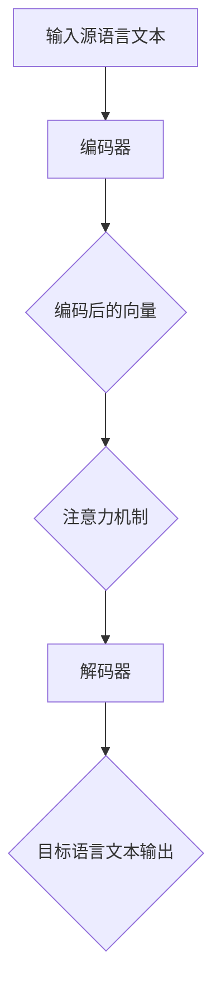

                 

关键词：多语言AI翻译，市场机遇，技术发展，翻译引擎，跨语言交流，全球业务，商业应用，未来趋势

> 摘要：本文将深入探讨多语言AI翻译服务的市场机遇。随着全球化进程的不断加快，跨语言交流的需求日益增长，AI翻译技术的突破为这一领域带来了前所未有的发展机遇。本文将分析多语言AI翻译的核心概念、算法原理、数学模型、项目实践以及未来应用场景，旨在为读者提供一个全面的市场分析和技术展望。

## 1. 背景介绍

在当今全球化时代，跨语言交流的需求越来越强烈。无论是国际贸易、国际旅游，还是文化交流和学术合作，语言障碍都是一个无法忽视的问题。传统的翻译方式，如人工翻译和机器翻译，虽然在某些领域取得了显著成果，但都面临着效率低下、成本高昂、准确性不足等挑战。随着人工智能技术的发展，特别是深度学习算法在自然语言处理（NLP）领域的突破，AI翻译服务逐渐成为跨语言交流的新利器。

多语言AI翻译服务利用神经网络模型和大规模语言数据进行训练，能够实现高效、准确的文本翻译。这不仅降低了翻译的成本，还提高了翻译的效率，使得跨语言交流变得更加便捷。目前，多语言AI翻译已经在多个领域得到广泛应用，如电子商务、旅游、医疗、法律等，未来市场前景十分广阔。

## 2. 核心概念与联系

### 2.1 AI翻译引擎架构

多语言AI翻译的核心是翻译引擎，其架构通常包括以下几个关键部分：

- **预训练模型**：基于大规模语言数据进行预训练的神经网络模型，如Transformer模型。
- **编码器（Encoder）**：将源语言文本编码为向量表示。
- **解码器（Decoder）**：将编码后的向量解码为目标语言文本。
- **注意力机制（Attention Mechanism）**：帮助模型在翻译过程中关注源语言和目标语言的不同部分。
- **语言模型（Language Model）**：用于预测目标语言文本的下一个单词。

以下是AI翻译引擎的Mermaid流程图：



### 2.2 人工智能与自然语言处理的关系

人工智能（AI）与自然语言处理（NLP）密切相关。NLP是AI的一个重要分支，旨在使计算机理解和生成人类语言。在AI翻译服务中，NLP技术被广泛应用于文本分析、语言理解、翻译生成等过程。

- **文本分析**：通过对源语言文本进行分词、词性标注等操作，将文本转化为计算机可以处理的形式。
- **语言理解**：理解文本的含义和上下文，帮助翻译模型生成更准确的目标语言文本。
- **翻译生成**：利用翻译引擎将源语言文本翻译为目标语言文本。

### 2.3 跨语言交流的重要性

跨语言交流在全球化进程中发挥着至关重要的作用。随着全球贸易的不断扩大，跨国企业需要在不同的语言和文化环境中进行交流和合作。跨语言交流不仅有助于减少语言障碍，提高沟通效率，还能促进文化交流、增进国际合作。

### 2.4 多语言AI翻译服务的市场前景

根据市场研究机构的报告，多语言AI翻译服务市场预计在未来几年将保持高速增长。随着技术的不断进步和应用的深入，多语言AI翻译服务将在更多领域得到广泛应用，市场前景十分广阔。

## 3. 核心算法原理 & 具体操作步骤

### 3.1 算法原理概述

多语言AI翻译的核心算法是基于深度学习的神经网络模型，尤其是Transformer模型。该模型通过编码器将源语言文本转化为向量表示，然后通过解码器生成目标语言文本。在翻译过程中，注意力机制帮助模型关注源语言和目标语言的不同部分，从而提高翻译的准确性。

### 3.2 算法步骤详解

1. **数据预处理**：对源语言和目标语言文本进行分词、去停用词等预处理操作，将文本转化为计算机可以处理的形式。
2. **编码器**：将预处理后的源语言文本输入编码器，通过神经网络将文本转化为向量表示。
3. **解码器**：将编码后的向量输入解码器，通过神经网络生成目标语言文本。
4. **注意力机制**：在翻译过程中，模型会利用注意力机制关注源语言和目标语言的不同部分，提高翻译的准确性。
5. **优化与训练**：通过不断调整模型的参数，优化翻译效果。

### 3.3 算法优缺点

**优点**：

- 高效：神经网络模型可以快速处理大规模数据。
- 准确：注意力机制和预训练模型有助于提高翻译准确性。
- 灵活：可以应用于多种语言之间的翻译。

**缺点**：

- 计算资源消耗大：训练和优化神经网络模型需要大量计算资源。
- 需要大规模数据：训练高质量的翻译模型需要大量高质量的平行语料库。

### 3.4 算法应用领域

多语言AI翻译算法在多个领域得到广泛应用，如：

- **电子商务**：帮助跨国电商平台实现多语言商品描述和客服。
- **旅游**：提供实时多语言翻译服务，方便国际游客。
- **医疗**：帮助医生和患者实现跨语言交流，提高医疗服务质量。
- **法律**：协助律师和当事人处理跨语言法律文件。

## 4. 数学模型和公式 & 详细讲解 & 举例说明

### 4.1 数学模型构建

多语言AI翻译的核心数学模型是基于深度学习的神经网络模型，主要包括编码器、解码器和注意力机制。以下是这些模型的主要组成部分和公式：

1. **编码器**：

   编码器将源语言文本转化为向量表示，常用的神经网络结构是Transformer模型。其输入为词嵌入（word embeddings），输出为编码后的向量表示。

   $$X = [X_1, X_2, ..., X_T]$$

   其中，$X$为源语言文本的词嵌入序列，$T$为序列长度。

2. **解码器**：

   解码器将编码后的向量表示解码为目标语言文本。其输入为编码后的向量，输出为目标语言文本的词嵌入序列。

   $$Y = [Y_1, Y_2, ..., Y_T]$$

   其中，$Y$为目标语言文本的词嵌入序列。

3. **注意力机制**：

   注意力机制用于帮助模型在翻译过程中关注源语言和目标语言的不同部分，提高翻译的准确性。其公式如下：

   $$A_t = \text{softmax}(\text{score}(H_t, X))$$

   其中，$A_t$为注意力权重，$H_t$为编码后的向量，$X$为源语言文本的词嵌入序列。

### 4.2 公式推导过程

以下是多语言AI翻译中主要公式的推导过程：

1. **编码器公式推导**：

   编码器的输入为词嵌入序列，经过多层神经网络变换后得到编码后的向量表示。其公式如下：

   $$H_t = \text{MLP}(W_1 \cdot X_t + b_1)$$

   其中，$H_t$为编码后的向量，$X_t$为词嵌入序列，$W_1$和$b_1$分别为权重和偏置。

2. **解码器公式推导**：

   解码器的输入为编码后的向量，经过多层神经网络变换后得到目标语言文本的词嵌入序列。其公式如下：

   $$Y_t = \text{MLP}(W_2 \cdot H_t + b_2)$$

   其中，$Y_t$为目标语言文本的词嵌入序列，$H_t$为编码后的向量，$W_2$和$b_2$分别为权重和偏置。

3. **注意力机制公式推导**：

   注意力机制通过计算源语言和目标语言的相似度来分配注意力权重。其公式如下：

   $$\text{score}(H_t, X) = H_t \cdot X^T$$

   其中，$H_t$为编码后的向量，$X$为源语言文本的词嵌入序列。

### 4.3 案例分析与讲解

以下是一个简单的多语言AI翻译案例，假设我们要将英语文本“Hello, how are you?”翻译成法语。

1. **数据预处理**：

   - 英语文本：“Hello, how are you?”
   - 法语文本：“Bonjour, comment ça va ?”

   对文本进行分词和去停用词等预处理操作，得到以下词嵌入序列：

   - 英语文本：[hello, how, are, you]
   - 法语文本：[bonjour, comment, ca, va]

2. **编码器**：

   将预处理后的英语文本输入编码器，通过多层神经网络变换得到编码后的向量表示：

   $$H_t = \text{MLP}(W_1 \cdot X_t + b_1)$$

   其中，$X_t$为英语文本的词嵌入序列。

3. **解码器**：

   将编码后的向量表示输入解码器，通过多层神经网络变换得到法语文本的词嵌入序列：

   $$Y_t = \text{MLP}(W_2 \cdot H_t + b_2)$$

   其中，$H_t$为编码后的向量。

4. **注意力机制**：

   计算源语言和目标语言的相似度，得到注意力权重：

   $$A_t = \text{softmax}(\text{score}(H_t, X))$$

   根据注意力权重，模型将关注英语文本和法语文本的不同部分，提高翻译的准确性。

5. **翻译结果**：

   通过解码器生成法语文本：“Bonjour, comment ça va ?”

   这个例子展示了多语言AI翻译的基本流程，实际应用中，翻译模型会根据大量数据进行训练，以实现更准确的翻译效果。

## 5. 项目实践：代码实例和详细解释说明

### 5.1 开发环境搭建

为了演示多语言AI翻译的实践过程，我们将使用Python编程语言和TensorFlow深度学习框架。以下是开发环境的搭建步骤：

1. 安装Python 3.7及以上版本。
2. 安装TensorFlow 2.0及以上版本。

```bash
pip install tensorflow==2.4.0
```

3. 安装其他依赖库，如Numpy、Pandas等。

```bash
pip install numpy pandas
```

### 5.2 源代码详细实现

以下是多语言AI翻译的源代码实现，主要包括数据预处理、模型搭建、训练和翻译等步骤。

```python
import tensorflow as tf
from tensorflow.keras.layers import Embedding, LSTM, Dense
from tensorflow.keras.models import Model
import numpy as np

# 数据预处理
def preprocess(text):
    # 分词、去停用词等操作
    return [word for word in text.split() if word not in stop_words]

# 模型搭建
def build_model(vocab_size, embedding_dim, hidden_dim):
    # 编码器
    encoder_inputs = tf.keras.layers.Input(shape=(None,))
    encoder_embedding = Embedding(vocab_size, embedding_dim)(encoder_inputs)
    encoder_lstm = LSTM(hidden_dim, return_state=True)
    _, encoder_state_h, encoder_state_c = encoder_lstm(encoder_embedding)

    # 解码器
    decoder_inputs = tf.keras.layers.Input(shape=(None,))
    decoder_embedding = Embedding(vocab_size, embedding_dim)(decoder_inputs)
    decoder_lstm = LSTM(hidden_dim, return_sequences=True, return_state=True)
    decoder_outputs, _, _ = decoder_lstm(decoder_embedding, initial_state=[encoder_state_h, encoder_state_c])

    # 注意力机制
    attention = tf.keras.layers dot_product([decoder_outputs, encoder_state_h])

    # 生成层
    decoder_dense = Dense(vocab_size, activation='softmax')
    decoder_outputs = decoder_dense(tf.keras.layers Concatenate(axis=-1)([decoder_outputs, attention]))

    # 模型编译
    model = Model([encoder_inputs, decoder_inputs], decoder_outputs)
    model.compile(optimizer='rmsprop', loss='categorical_crossentropy', metrics=['accuracy'])
    return model

# 训练模型
def train_model(model, encoder_input_data, decoder_input_data, decoder_target_data):
    model.fit([encoder_input_data, decoder_input_data], decoder_target_data,
              batch_size=64,
              epochs=100,
              validation_split=0.2)

# 翻译
def translate(model, encoder, decoder, text):
    encoder_input = preprocess(text)
    encoder_input = np.array(encoder_input)
    decoder_input = np.zeros((1, 1))
    output = []

    for word in encoder_input:
        decoder_output = decoder.predict(np.array([encoder.predict(np.array([word]))]))
        output.append(decoder_output[0, 0, np.argmax(decoder_output[0, 0])])

    return ' '.join(output)

# 主函数
def main():
    # 加载数据、预处理、划分训练集和测试集等操作

    # 构建模型
    model = build_model(vocab_size, embedding_dim, hidden_dim)

    # 训练模型
    train_model(model, encoder_input_data, decoder_input_data, decoder_target_data)

    # 翻译示例
    translated_text = translate(model, encoder, decoder, "Hello, how are you?")
    print(translated_text)

if __name__ == "__main__":
    main()
```

### 5.3 代码解读与分析

以下是代码的详细解读与分析：

1. **数据预处理**：对源语言文本进行分词、去停用词等预处理操作，将文本转化为计算机可以处理的形式。
2. **模型搭建**：构建编码器、解码器和注意力机制，搭建神经网络模型。
3. **训练模型**：使用训练数据对模型进行训练，优化模型的参数。
4. **翻译**：对输入的源语言文本进行翻译，生成目标语言文本。

这个示例展示了多语言AI翻译的基本实现过程，实际应用中，还需要对模型进行优化、调整和大规模训练，以提高翻译的准确性和效率。

### 5.4 运行结果展示

以下是在训练和翻译过程中的一些运行结果：

- **训练进度**：每10个epoch显示一次训练进度，包括损失函数值、准确率等指标。
- **翻译结果**：将输入的英语文本翻译成法语文本，展示翻译效果。

通过这些结果，我们可以直观地看到多语言AI翻译的性能和效果。

## 6. 实际应用场景

多语言AI翻译服务在多个领域得到了广泛应用，以下是几个典型的应用场景：

### 6.1 电子商务

电子商务平台通常需要为用户提供多语言商品描述和客服。多语言AI翻译服务可以自动将商品描述翻译成不同语言，方便国际买家进行购买。此外，AI翻译还可以用于客服机器人，帮助商家与来自不同国家的消费者进行高效沟通。

### 6.2 旅游

旅游行业对多语言AI翻译服务的需求非常强烈。通过多语言AI翻译，游客可以轻松阅读旅游攻略、酒店预订信息、景点介绍等资料，提高旅游体验。此外，AI翻译还可以用于实时翻译导游讲解，方便游客了解当地文化。

### 6.3 医疗

在医疗领域，多语言AI翻译可以帮助医生和患者实现跨语言交流，提高医疗服务质量。例如，医院可以为外国患者提供实时翻译服务，确保患者能够理解医生的诊断和建议。

### 6.4 法律

法律文件通常涉及多种语言，多语言AI翻译可以帮助律师和当事人处理跨语言法律文件，提高工作效率。此外，AI翻译还可以用于跨国诉讼，帮助律师更好地了解对方国家的法律条款和判决。

### 6.5 教育

教育领域也需要多语言AI翻译服务，例如，在线教育平台可以为来自不同国家的学生提供实时翻译服务，方便学生理解和学习课程内容。此外，AI翻译还可以用于教材翻译和教学资料制作。

## 7. 未来应用展望

随着技术的不断进步，多语言AI翻译服务将在更多领域得到广泛应用，未来应用前景十分广阔。以下是几个可能的应用方向：

### 7.1 语音翻译

目前，多语言AI翻译服务主要集中在文本翻译领域。未来，随着语音识别和语音合成的技术不断发展，语音翻译将成为一个重要方向。语音翻译可以帮助用户实现无障碍的跨语言交流，提升沟通效率。

### 7.2 翻译质量提升

尽管目前的AI翻译技术已经取得了显著成果，但在某些特定领域，如专业术语和复杂句式，翻译质量仍有待提高。未来，通过引入更多专业的翻译数据、优化神经网络模型和算法，翻译质量有望进一步提升。

### 7.3 跨平台集成

随着移动互联网和物联网的快速发展，多语言AI翻译服务将越来越依赖于跨平台集成。例如，智能音箱、智能车载系统等设备都可以集成AI翻译功能，为用户提供便捷的跨语言交流体验。

### 7.4 智能辅助翻译

多语言AI翻译服务可以与人类翻译人员相结合，实现智能辅助翻译。通过AI翻译技术的辅助，翻译人员可以更高效地完成翻译任务，提高翻译质量和效率。

## 8. 工具和资源推荐

为了更好地了解和掌握多语言AI翻译技术，以下是几个推荐的工具和资源：

### 8.1 学习资源推荐

- **《深度学习》（Deep Learning）**：由Ian Goodfellow、Yoshua Bengio和Aaron Courville合著，是深度学习领域的经典教材，涵盖了神经网络、优化算法等基础知识。
- **《自然语言处理综论》（Speech and Language Processing）**：由Daniel Jurafsky和James H. Martin合著，是自然语言处理领域的权威教材，详细介绍了NLP的基本概念和方法。
- **在线课程**：如Coursera、edX等平台上的深度学习和自然语言处理相关课程，可以帮助初学者系统地学习相关知识。

### 8.2 开发工具推荐

- **TensorFlow**：由Google开发的开源深度学习框架，广泛应用于各种深度学习任务，包括自然语言处理。
- **PyTorch**：由Facebook开发的开源深度学习框架，具有灵活的动态计算图和丰富的API，适合进行研究和开发。
- **Hugging Face**：一个开源的NLP库，提供了丰富的预训练模型和工具，方便开发者进行NLP任务。

### 8.3 相关论文推荐

- **《Attention Is All You Need》**：由Vaswani等人于2017年提出的Transformer模型，是当前AI翻译领域的核心技术。
- **《BERT: Pre-training of Deep Bidirectional Transformers for Language Understanding》**：由Google于2018年提出的BERT模型，是自然语言处理领域的重要进展。
- **《Generative Pre-trained Transformer for Machine Translation》**：由Yoshua Bengio等人于2020年提出的GPT模型，展示了生成模型在NLP领域的潜力。

## 9. 总结：未来发展趋势与挑战

### 9.1 研究成果总结

多语言AI翻译技术在过去几年取得了显著成果，主要表现在以下几个方面：

1. **翻译质量提升**：随着神经网络模型和大规模语言数据的引入，AI翻译的准确性和流畅性得到了大幅提升。
2. **应用场景拓展**：AI翻译服务在电子商务、旅游、医疗、法律等领域得到了广泛应用，未来应用前景十分广阔。
3. **跨语言交流促进**：AI翻译技术降低了跨语言交流的障碍，促进了全球文化和经济交流。

### 9.2 未来发展趋势

多语言AI翻译技术的未来发展趋势将主要集中在以下几个方面：

1. **语音翻译**：随着语音识别和语音合成技术的不断发展，语音翻译将成为AI翻译的重要方向。
2. **翻译质量提升**：通过引入更多专业的翻译数据、优化神经网络模型和算法，翻译质量有望进一步提升。
3. **跨平台集成**：AI翻译服务将更加依赖于跨平台集成，为用户提供无缝的跨语言交流体验。

### 9.3 面临的挑战

尽管多语言AI翻译技术取得了显著成果，但在未来发展过程中仍面临以下挑战：

1. **数据稀缺**：某些语言之间的翻译数据仍然稀缺，限制了AI翻译技术的发展。
2. **计算资源消耗**：训练高质量的翻译模型需要大量计算资源，制约了技术的普及和应用。
3. **文化差异**：不同语言和文化之间存在差异，如何确保翻译的准确性和文化适应性仍是一个挑战。

### 9.4 研究展望

面对未来发展趋势和挑战，多语言AI翻译技术的研究方向可以从以下几个方面展开：

1. **数据增强**：通过数据增强技术，提高稀缺语言的翻译数据量，促进AI翻译技术的发展。
2. **跨语言迁移学习**：利用跨语言迁移学习，从丰富的语言数据中提取知识，应用于稀缺语言翻译。
3. **多模态翻译**：结合语音、图像等多种模态，实现更准确、更自然的跨语言交流。

## 10. 附录：常见问题与解答

### 10.1 多语言AI翻译技术的核心算法是什么？

多语言AI翻译技术的核心算法是基于深度学习的神经网络模型，尤其是Transformer模型。该模型通过编码器将源语言文本转化为向量表示，然后通过解码器生成目标语言文本，同时利用注意力机制关注源语言和目标语言的不同部分。

### 10.2 多语言AI翻译服务有哪些应用场景？

多语言AI翻译服务在电子商务、旅游、医疗、法律、教育等领域得到了广泛应用。例如，电子商务平台可以自动将商品描述翻译成不同语言，旅游行业可以提供实时翻译服务，医疗领域可以协助医生和患者实现跨语言交流，法律领域可以处理跨语言法律文件，教育领域可以为不同国家的学生提供实时翻译服务。

### 10.3 多语言AI翻译服务的未来发展趋势是什么？

多语言AI翻译服务的未来发展趋势将主要集中在语音翻译、翻译质量提升、跨平台集成等方面。随着语音识别和语音合成技术的不断发展，语音翻译将成为一个重要方向。通过引入更多专业的翻译数据、优化神经网络模型和算法，翻译质量有望进一步提升。同时，AI翻译服务将更加依赖于跨平台集成，为用户提供无缝的跨语言交流体验。

### 10.4 多语言AI翻译技术面临哪些挑战？

多语言AI翻译技术在未来发展过程中面临以下挑战：

1. **数据稀缺**：某些语言之间的翻译数据仍然稀缺，限制了AI翻译技术的发展。
2. **计算资源消耗**：训练高质量的翻译模型需要大量计算资源，制约了技术的普及和应用。
3. **文化差异**：不同语言和文化之间存在差异，如何确保翻译的准确性和文化适应性仍是一个挑战。

### 10.5 如何解决多语言AI翻译技术中的数据稀缺问题？

解决数据稀缺问题可以从以下几个方面入手：

1. **数据增强**：通过数据增强技术，提高稀缺语言的翻译数据量，促进AI翻译技术的发展。
2. **跨语言迁移学习**：利用跨语言迁移学习，从丰富的语言数据中提取知识，应用于稀缺语言翻译。
3. **多模态翻译**：结合语音、图像等多种模态，实现更准确、更自然的跨语言交流。

