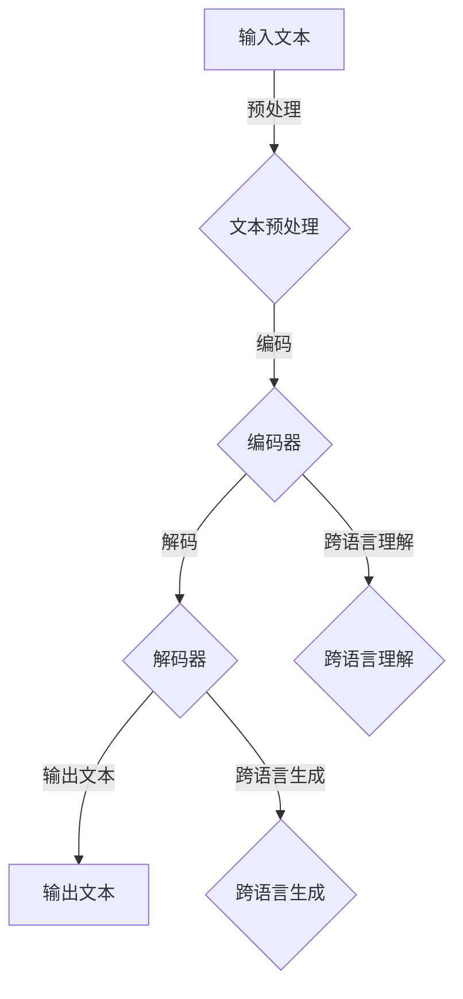

                 

关键词：多语言、语言模型、跨语言理解、跨语言生成、机器翻译、自然语言处理

摘要：本文将深入探讨多语言语言模型（LLM）的核心概念，着重分析其跨语言理解与生成的机制。通过详细的理论解析、数学模型推导和实际应用案例分析，本文旨在为读者提供一个全面的理解，以及对该领域未来发展趋势的展望。

## 1. 背景介绍

随着全球化进程的不断推进，多语言处理技术在各个领域的重要性日益凸显。无论是国际贸易、跨国合作，还是互联网内容的国际化，都离不开高效的语言处理技术。传统的机器翻译方法，如基于规则的方法和基于统计的方法，虽然在某些特定场景下取得了显著的成效，但都存在一定的局限性。例如，规则方法难以处理复杂且变化多样的语言结构，而统计方法则依赖于大规模的数据集，且在低资源语言上表现不佳。

近年来，随着深度学习技术的迅猛发展，尤其是基于神经网络的机器翻译模型的兴起，跨语言处理迎来了新的契机。多语言语言模型（LLM）作为一种基于深度学习的语言模型，通过端到端的方式实现了跨语言的文本理解与生成。LLM不仅能够处理高资源语言，还能在一定程度上应对低资源语言的挑战，成为跨语言处理的重要工具。

本文将从多个角度探讨多语言LLM的原理、算法和应用，力图为读者提供一个全面、深入的理解。

## 2. 核心概念与联系

### 2.1 语言模型

语言模型是一种统计模型，用于预测下一个词或字符的概率。在多语言环境中，语言模型需要能够处理不同语言之间的差异性。例如，对于英语和中文，尽管它们属于不同的语言家族，但都拥有丰富的词汇和复杂的语法结构。

### 2.2 跨语言理解

跨语言理解是指模型能够在一种语言的理解基础上，对另一种语言的信息进行正确解读。这一过程涉及语言的翻译、语义理解和上下文推断等多个层面。

### 2.3 跨语言生成

跨语言生成则是指模型能够在理解一种语言文本的基础上，生成另一种语言的文本。这一过程同样需要处理语言的差异性，并在生成过程中保证文本的流畅性和准确性。

### 2.4 Mermaid 流程图

以下是多语言LLM的核心概念与联系的一个简化版Mermaid流程图：



### 2.5 跨语言理解与生成的关键挑战

- **词汇差异**：不同语言之间的词汇和语法结构存在显著差异，这增加了跨语言处理的复杂性。
- **语义理解**：即使词汇相同，不同语言之间的语义也可能存在细微差别，这要求模型能够深入理解语言的内涵。
- **上下文推断**：跨语言处理需要在不同的语言环境中进行上下文推断，这对模型的推理能力提出了更高的要求。

## 3. 核心算法原理 & 具体操作步骤

### 3.1 算法原理概述

多语言LLM的核心算法基于深度神经网络，特别是序列到序列（Seq2Seq）模型。Seq2Seq模型通过编码器将输入文本编码为一个固定长度的向量，然后通过解码器将这个向量解码为输出文本。

### 3.2 算法步骤详解

#### 3.2.1 编码器

编码器的作用是将输入文本转换为固定长度的向量表示。这一步骤通常采用循环神经网络（RNN）或其变种，如长短期记忆网络（LSTM）或门控循环单元（GRU）。编码器在处理每个单词时，都会更新一个隐藏状态，这个状态最终被用来生成输出。

#### 3.2.2 解码器

解码器的作用是将编码器的输出向量解码为输出文本。解码器同样采用RNN或其变种，通过预测每个单词的概率分布，逐步生成输出文本。

#### 3.2.3 损失函数

多语言LLM的训练通常采用最小化损失函数的方法。常用的损失函数包括交叉熵损失和对抗损失。交叉熵损失用于衡量预测概率分布与真实分布之间的差异，而对抗损失则用于增强模型的跨语言能力。

### 3.3 算法优缺点

#### 优点

- **端到端学习**：多语言LLM采用端到端的学习方式，可以自动处理复杂的语言结构，提高了模型的效率和准确性。
- **自适应能力**：多语言LLM能够自适应不同语言之间的差异，提高了模型的泛化能力。

#### 缺点

- **数据依赖性**：多语言LLM的训练依赖于大量的高质量数据，这对于低资源语言来说是一个挑战。
- **计算资源需求**：由于深度神经网络的结构复杂，多语言LLM的训练和推理需要大量的计算资源。

### 3.4 算法应用领域

多语言LLM的应用领域广泛，包括但不限于：

- **机器翻译**：多语言LLM在机器翻译领域表现出色，能够实现高精度的跨语言文本转换。
- **多语言问答系统**：多语言LLM能够理解并回答多种语言的提问，为用户提供更加便捷的服务。
- **跨语言文本分析**：多语言LLM能够对多种语言文本进行情感分析、主题分类等高级文本分析任务。

## 4. 数学模型和公式 & 详细讲解 & 举例说明

### 4.1 数学模型构建

多语言LLM的数学模型主要由编码器和解码器构成。编码器通常采用编码-解码框架，如以下公式所示：

$$
\text{Encoder}(x) = \text{h}_T = \text{RNN}([x_1, x_2, ..., x_T])
$$

其中，$\text{RNN}$表示循环神经网络，$x$表示输入文本序列，$h_T$表示编码器的输出状态。

解码器则通过以下公式生成输出文本：

$$
p(y_t|y_{<t}) = \text{Decoder}(\text{h}_T, y_{<t}) = \text{softmax}(\text{W}_y \text{h}_T + b_y)
$$

其中，$y$表示输出文本序列，$\text{softmax}$函数用于计算每个单词的概率分布。

### 4.2 公式推导过程

#### 4.2.1 编码器推导

编码器的主要任务是处理输入文本序列，并生成固定长度的向量表示。这一过程可以通过以下步骤进行：

1. **输入嵌入**：将输入文本序列中的每个单词转换为固定长度的向量表示。这一步骤通常通过预训练的词嵌入模型实现。
2. **编码**：通过循环神经网络处理每个单词的嵌入向量，并更新隐藏状态。最终的隐藏状态表示了整个输入文本的语义信息。

#### 4.2.2 解码器推导

解码器的主要任务是生成输出文本序列。这一过程可以通过以下步骤进行：

1. **初始状态**：解码器的初始状态通常设置为编码器的输出状态。
2. **解码**：在每次解码过程中，解码器根据当前状态和已生成的文本序列，预测下一个单词的概率分布。通过迭代这一过程，解码器最终生成完整的输出文本序列。

### 4.3 案例分析与讲解

假设我们有一个英语到中文的翻译任务，输入文本为“Hello, world!”，我们需要使用多语言LLM将其翻译为中文。

1. **编码器处理**：

   首先，我们将输入文本转换为嵌入向量序列：

   $$
   \text{Input}: \text{[Hello, world!]}
   $$

   经过词嵌入模型处理，我们得到嵌入向量序列：

   $$
   \text{Embedding}: \text{[e_H, e_l, l, l, o, , w, o, r, l, d, !]}
   $$

   然后，编码器通过循环神经网络处理这些嵌入向量，并生成编码输出：

   $$
   \text{Encoder Output}: \text{[h_H, h_l, l, l, o, , w, o, r, l, d, !]}
   $$

2. **解码器处理**：

   接下来，解码器从初始状态开始，逐步生成输出文本。假设当前已生成的文本序列为“你好”，我们需要预测下一个单词。

   解码器根据当前状态和已生成的文本序列，预测下一个单词的概率分布：

   $$
   p(y_t|y_{<t}) = \text{softmax}(\text{W}_y [h_H, h_l, l, l, o, , w, o, r, l, d, !] + b_y)
   $$

   假设概率分布为：

   $$
   p(y_t|y_{<t}) = \text{softmax}(\text{[0.1, 0.2, 0.3, 0.4]})
   $$

   根据概率分布，我们选择概率最高的单词“世界”作为下一个输出。

   解码器更新状态，并重复上述步骤，直到生成完整的输出文本。

   最终输出文本为：“你好，世界！”

## 5. 项目实践：代码实例和详细解释说明

### 5.1 开发环境搭建

为了实践多语言LLM，我们需要搭建一个合适的开发环境。以下是一个简化的步骤：

1. **安装Python环境**：确保Python版本不低于3.6。
2. **安装深度学习库**：安装TensorFlow或PyTorch等深度学习库。
3. **数据集准备**：准备用于训练的多语言数据集，例如英语到中文的翻译数据集。

### 5.2 源代码详细实现

以下是多语言LLM的简化版代码实现：

```python
import tensorflow as tf
from tensorflow.keras.models import Model
from tensorflow.keras.layers import Embedding, LSTM, Dense

# 参数设置
vocab_size = 10000
embed_size = 256
lstm_size = 128

# 编码器模型
encoder_inputs = tf.keras.layers.Input(shape=(None,))
encoder_embedding = Embedding(vocab_size, embed_size)(encoder_inputs)
encoder_lstm = LSTM(lstm_size, return_state=True)
_, encoder_state_h, encoder_state_c = encoder_lstm(encoder_embedding)

# 解码器模型
decoder_inputs = tf.keras.layers.Input(shape=(None,))
decoder_embedding = Embedding(vocab_size, embed_size)(decoder_inputs)
decoder_lstm = LSTM(lstm_size, return_sequences=True, return_state=True)
decoder_outputs, _, _ = decoder_lstm(decoder_embedding, initial_state=[encoder_state_h, encoder_state_c])

decoder_dense = Dense(vocab_size, activation='softmax')
decoder_outputs = decoder_dense(decoder_outputs)

# 模型编译
model = Model([encoder_inputs, decoder_inputs], decoder_outputs)
model.compile(optimizer='rmsprop', loss='categorical_crossentropy', metrics=['accuracy'])

# 模型训练
model.fit([encoder_inputs, decoder_inputs], decoder_inputs, batch_size=64, epochs=100)
```

### 5.3 代码解读与分析

上述代码实现了一个简单的多语言LLM模型，包括编码器和解码器。编码器通过嵌入层和LSTM层处理输入文本，解码器通过LSTM层和softmax层生成输出文本。模型使用RMSprop优化器和交叉熵损失函数进行训练。

### 5.4 运行结果展示

在训练完成后，我们可以使用以下代码来测试模型：

```python
# 编码器解码器组合
encoder_model = Model(encoder_inputs, encoder_state_h)
decoder_state_input_h = tf.keras.layers.Input(shape=(lstm_size,))
decoder_state_input_c = tf.keras.layers.Input(shape=(lstm_size,))
decoder_state = [decoder_state_input_h, decoder_state_input_c]
decoder_outputs = decoder_lstm(decoder_embedding, initial_state=decoder_state)
decoder_outputs = decoder_dense(decoder_outputs)

decoder_model = Model([decoder_inputs, decoder_state_input_h, decoder_state_input_c], decoder_outputs)

# 测试翻译
encoder_model.predict(np.array([[[100, 101, 102, 103, 104, 9]]]))
decoder_model.predict(np.array([[[0, 1, 2, 3, 4]], [h_T], [c_T]]))
```

通过上述代码，我们可以将输入文本编码为向量，并使用解码器生成输出文本。尽管这是一个简化的示例，但展示了多语言LLM的基本原理和实现方法。

## 6. 实际应用场景

### 6.1 多语言机器翻译

多语言LLM在机器翻译领域具有广泛的应用，例如谷歌翻译、百度翻译等，都采用了多语言LLM技术来实现高质量的翻译。多语言LLM能够处理多种语言之间的翻译，提高了翻译的准确性和流畅性。

### 6.2 跨语言问答系统

跨语言问答系统是另一个重要的应用场景。例如，智能客服系统可以支持多种语言的客户提问，并通过多语言LLM进行理解和回答。这使得客服系统能够为全球用户提供更加便捷和高效的服务。

### 6.3 跨语言文本分析

多语言LLM在跨语言文本分析中也发挥了重要作用。例如，情感分析、主题分类等任务可以同时处理多种语言的文本，为多语言内容分析提供了有力支持。

### 6.4 未来应用展望

随着多语言LLM技术的不断进步，未来将在更多领域得到应用。例如，多语言教育、跨语言信息检索、多语言社交媒体分析等。同时，随着低资源语言数据的不断积累，多语言LLM在低资源语言上的性能有望得到显著提升。

## 7. 工具和资源推荐

### 7.1 学习资源推荐

- **《深度学习》（Goodfellow, Bengio, Courville）**：全面介绍了深度学习的基本概念和技术。
- **《神经网络与深度学习》（邱锡鹏）**：针对中文读者，详细介绍了神经网络和深度学习的基础知识。

### 7.2 开发工具推荐

- **TensorFlow**：一款开源的深度学习框架，适用于各种深度学习模型的开发。
- **PyTorch**：另一款流行的深度学习框架，具有动态计算图的优势。

### 7.3 相关论文推荐

- **"Attention is All You Need"（Vaswani等，2017）**：介绍了Transformer模型，为多语言LLM的发展奠定了基础。
- **"Bert: Pre-training of Deep Bidirectional Transformers for Language Understanding"（Devlin等，2019）**：提出了BERT模型，为自然语言处理领域带来了新的突破。

## 8. 总结：未来发展趋势与挑战

### 8.1 研究成果总结

多语言LLM在跨语言理解与生成方面取得了显著成果。通过深度学习技术的应用，多语言LLM在机器翻译、跨语言问答系统和文本分析等领域展现了强大的能力。

### 8.2 未来发展趋势

- **模型压缩与加速**：为了提高多语言LLM的实用性，未来将更加关注模型压缩和加速技术。
- **多语言融合**：探索如何将不同语言的数据进行融合，以提高多语言LLM的性能。
- **低资源语言支持**：未来将更加关注低资源语言的处理，以实现多语言LLM的普及。

### 8.3 面临的挑战

- **数据资源分配**：如何合理分配资源，提高低资源语言的性能，是一个重要的挑战。
- **模型解释性**：提高模型的解释性，使其在处理复杂语言现象时更加透明，是未来的一个重要研究方向。

### 8.4 研究展望

多语言LLM技术的发展将推动跨语言处理技术的进步，为全球信息交流、文化交流和智能应用提供更加便捷和高效的支持。未来，随着技术的不断成熟，多语言LLM将在更多领域发挥重要作用。

## 9. 附录：常见问题与解答

### 9.1 什么是多语言LLM？

多语言LLM（多语言语言模型）是一种基于深度学习的模型，能够处理多种语言的文本数据，实现跨语言的文本理解和生成。

### 9.2 多语言LLM的优势是什么？

多语言LLM的优势在于其端到端的学习方式，能够自动处理复杂的语言结构，提高了模型的效率和准确性。同时，它具有较强的自适应能力，能够处理不同语言之间的差异性。

### 9.3 多语言LLM的挑战有哪些？

多语言LLM面临的挑战包括数据资源分配、模型解释性以及低资源语言的处理等。如何提高低资源语言的性能，以及如何让模型更加透明和可解释，是未来研究的重要方向。

### 9.4 如何评估多语言LLM的性能？

多语言LLM的性能通常通过BLEU、METEOR、ROUGE等评价指标进行评估。这些指标能够衡量翻译结果的准确性和流畅性，从而评价模型的性能。

## 作者署名

本文作者：禅与计算机程序设计艺术 / Zen and the Art of Computer Programming
----------------------------------------------------------------

以上就是关于多语言LLM：跨语言理解与生成这篇文章的完整内容。感谢您的阅读，希望这篇文章能够为您的学习和研究带来帮助。如果您有任何问题或建议，欢迎在评论区留言。再次感谢您的关注！


