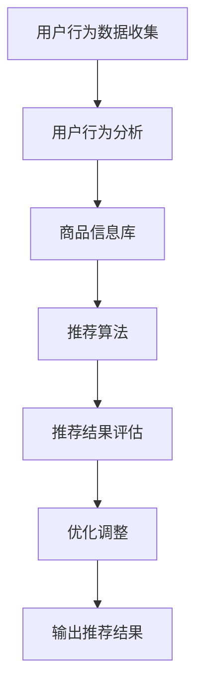

                 

关键词：大数据、人工智能、电商平台、搜索推荐系统、转型、核心战略、用户行为分析、个性化推荐、算法优化。

> 摘要：本文将探讨大数据和人工智能技术在电商平台转型中的重要性，重点分析搜索推荐系统作为电商平台核心战略的作用，以及其背后的算法原理、数学模型和应用实践。

## 1. 背景介绍

随着互联网的快速发展，电商平台已经成为消费者日常购物的重要渠道。传统的电商平台主要依赖于关键词搜索和商品分类导航来满足用户的需求，但这种模式在应对个性化需求方面存在一定的局限性。随着大数据和人工智能技术的不断进步，搜索推荐系统应运而生，它通过分析用户的行为数据，实现个性化的商品推荐，提高了用户的购物体验和平台的销售额。

电商平台转型的一个重要方向就是利用大数据和人工智能技术来优化搜索推荐系统，从而提升用户满意度和平台竞争力。本文将从以下几个方面展开讨论：

- 搜索推荐系统的核心概念与联系
- 核心算法原理与具体操作步骤
- 数学模型和公式的构建与推导
- 项目实践：代码实例与详细解释
- 实际应用场景与未来展望
- 工具和资源推荐
- 未来发展趋势与挑战

## 2. 核心概念与联系

首先，我们需要了解搜索推荐系统的核心概念和组成部分。搜索推荐系统主要由以下几个部分组成：

### 2.1 用户行为分析

用户行为分析是搜索推荐系统的基石，它包括用户浏览、搜索、购买等行为数据。通过对这些数据的挖掘和分析，可以了解用户的兴趣偏好和行为模式。

### 2.2 商品信息库

商品信息库包含电商平台上的所有商品信息，如商品名称、描述、价格、分类等。这是搜索推荐系统提供个性化推荐的基础。

### 2.3 推荐算法

推荐算法是搜索推荐系统的核心，它负责根据用户行为数据和商品信息，生成个性化的推荐结果。常见的推荐算法有协同过滤、基于内容的推荐、混合推荐等。

### 2.4 推荐结果评估与优化

推荐结果评估与优化是确保推荐系统效果的关键环节。通过评估推荐结果的准确性和用户满意度，可以不断优化算法和模型，提高推荐质量。

以下是搜索推荐系统的 Mermaid 流程图：



## 3. 核心算法原理 & 具体操作步骤

### 3.1 算法原理概述

搜索推荐系统的主要算法有协同过滤算法和基于内容的推荐算法。协同过滤算法通过分析用户之间的相似度，找到与目标用户相似的邻居用户，然后根据邻居用户的喜好推荐商品。基于内容的推荐算法则是根据商品的属性和用户的历史行为，找到与用户兴趣相关的商品进行推荐。

### 3.2 算法步骤详解

#### 3.2.1 协同过滤算法

1. 用户行为数据收集：收集用户在平台上的浏览、搜索、购买等行为数据。

2. 建立用户-商品矩阵：将用户和商品分别作为矩阵的行和列，构建用户-商品评分矩阵。

3. 计算用户相似度：使用余弦相似度或皮尔逊相关系数计算用户之间的相似度。

4. 寻找邻居用户：根据相似度矩阵，找到与目标用户最相似的邻居用户。

5. 生成推荐列表：根据邻居用户的喜好，为用户生成推荐列表。

#### 3.2.2 基于内容的推荐算法

1. 提取商品特征：从商品描述、分类、标签等属性中提取关键词或特征。

2. 计算商品相似度：使用TF-IDF或余弦相似度计算商品之间的相似度。

3. 根据用户历史行为：找出用户曾经浏览或购买过的商品。

4. 生成推荐列表：根据商品相似度和用户历史行为，为用户生成推荐列表。

### 3.3 算法优缺点

#### 3.3.1 协同过滤算法

优点：适用于大量用户和商品的数据，能生成准确的推荐结果。

缺点：依赖用户行为数据，对新用户和冷门商品推荐效果较差。

#### 3.3.2 基于内容的推荐算法

优点：不受用户行为数据的限制，能生成内容相关的推荐。

缺点：推荐结果可能过于单一，无法满足用户多样化的需求。

### 3.4 算法应用领域

搜索推荐算法广泛应用于电商平台、社交媒体、视频网站等场景。在电商平台上，搜索推荐系统可以帮助用户快速找到感兴趣的商品，提高购物体验和销售额。在社交媒体和视频网站上，推荐系统可以提升用户的活跃度和留存率。

## 4. 数学模型和公式 & 详细讲解 & 举例说明

### 4.1 数学模型构建

#### 4.1.1 协同过滤算法

协同过滤算法的核心是计算用户之间的相似度和生成推荐列表。以下是协同过滤算法的数学模型：

1. **用户相似度计算**

   用户\( u \)和用户\( v \)之间的相似度可以用余弦相似度表示：

   \[
   sim(u, v) = \frac{u \cdot v}{||u|| \cdot ||v||}
   \]

   其中，\( u \)和\( v \)分别是用户\( u \)和用户\( v \)的评分向量，\( \cdot \)表示点积，\( ||u|| \)和\( ||v|| \)分别表示用户\( u \)和用户\( v \)的欧几里得范数。

2. **推荐列表生成**

   假设目标用户为\( u \)，邻居用户集合为\( N(u) \)，则用户\( u \)的推荐列表可以通过以下公式计算：

   \[
   recommend(u) = \sum_{v \in N(u)} sim(u, v) \cdot rating(v)
   \]

   其中，\( rating(v) \)表示邻居用户\( v \)对商品\( i \)的评分。

#### 4.1.2 基于内容的推荐算法

基于内容的推荐算法的核心是计算商品之间的相似度和生成推荐列表。以下是基于内容的推荐算法的数学模型：

1. **商品特征提取**

   假设商品\( i \)和商品\( j \)的特征向量分别为\( f_i \)和\( f_j \)，则可以使用TF-IDF模型计算特征向量：

   \[
   f_i = (w_{i1}, w_{i2}, ..., w_{in})
   \]

   其中，\( w_{ij} \)表示特征\( j \)在商品\( i \)中的权重。

2. **商品相似度计算**

   商品\( i \)和商品\( j \)之间的相似度可以用余弦相似度表示：

   \[
   sim(i, j) = \frac{f_i \cdot f_j}{||f_i|| \cdot ||f_j||}
   \]

   其中，\( f_i \)和\( f_j \)分别是商品\( i \)和商品\( j \)的特征向量，\( \cdot \)表示点积，\( ||f_i|| \)和\( ||f_j|| \)分别表示商品\( i \)和商品\( j \)的欧几里得范数。

3. **推荐列表生成**

   假设目标用户为\( u \)，用户\( u \)曾经浏览过的商品集合为\( I(u) \)，则用户\( u \)的推荐列表可以通过以下公式计算：

   \[
   recommend(u) = \sum_{i \in I(u)} sim(i, j) \cdot rating(i)
   \]

   其中，\( rating(i) \)表示商品\( i \)的用户评分。

### 4.2 公式推导过程

#### 4.2.1 协同过滤算法

1. **用户相似度计算**

   假设用户\( u \)和用户\( v \)的评分向量为\( u = (u_1, u_2, ..., u_n) \)和\( v = (v_1, v_2, ..., v_n) \)，则：

   \[
   u \cdot v = \sum_{i=1}^{n} u_i \cdot v_i
   \]

   \[
   ||u|| = \sqrt{\sum_{i=1}^{n} u_i^2}
   \]

   \[
   ||v|| = \sqrt{\sum_{i=1}^{n} v_i^2}
   \]

   代入余弦相似度公式，得到：

   \[
   sim(u, v) = \frac{\sum_{i=1}^{n} u_i \cdot v_i}{\sqrt{\sum_{i=1}^{n} u_i^2} \cdot \sqrt{\sum_{i=1}^{n} v_i^2}}
   \]

2. **推荐列表生成**

   假设邻居用户集合为\( N(u) = \{v_1, v_2, ..., v_m\} \)，则：

   \[
   recommend(u) = \sum_{v \in N(u)} sim(u, v) \cdot rating(v)
   \]

   其中，\( rating(v) \)表示邻居用户\( v \)对商品\( i \)的评分。

#### 4.2.2 基于内容的推荐算法

1. **商品特征提取**

   假设商品\( i \)和商品\( j \)的特征向量为\( f_i = (w_{i1}, w_{i2}, ..., w_{in}) \)和\( f_j = (w_{j1}, w_{j2}, ..., w_{jn}) \)，则：

   \[
   f_i \cdot f_j = \sum_{k=1}^{n} w_{ik} \cdot w_{jk}
   \]

   \[
   ||f_i|| = \sqrt{\sum_{k=1}^{n} w_{ik}^2}
   \]

   \[
   ||f_j|| = \sqrt{\sum_{k=1}^{n} w_{jk}^2}
   \]

   代入余弦相似度公式，得到：

   \[
   sim(i, j) = \frac{\sum_{k=1}^{n} w_{ik} \cdot w_{jk}}{\sqrt{\sum_{k=1}^{n} w_{ik}^2} \cdot \sqrt{\sum_{k=1}^{n} w_{jk}^2}}
   \]

2. **推荐列表生成**

   假设目标用户为\( u \)，用户\( u \)曾经浏览过的商品集合为\( I(u) = \{i_1, i_2, ..., i_k\} \)，则：

   \[
   recommend(u) = \sum_{i \in I(u)} sim(i, j) \cdot rating(i)
   \]

   其中，\( rating(i) \)表示商品\( i \)的用户评分。

### 4.3 案例分析与讲解

#### 4.3.1 协同过滤算法案例分析

假设有用户\( u \)和用户\( v \)，他们的评分向量分别为\( u = (4, 5, 3, 4) \)和\( v = (5, 4, 5, 3) \)，计算用户\( u \)和用户\( v \)的相似度：

\[
sim(u, v) = \frac{4 \cdot 5 + 5 \cdot 4 + 3 \cdot 5 + 4 \cdot 3}{\sqrt{4^2 + 5^2 + 3^2 + 4^2} \cdot \sqrt{5^2 + 4^2 + 5^2 + 3^2}} \approx 0.943
\]

根据相似度计算邻居用户\( v \)，生成推荐列表：

\[
recommend(u) = sim(u, v) \cdot rating(v) \approx 0.943 \cdot 5 = 4.715
\]

#### 4.3.2 基于内容的推荐算法案例分析

假设有商品\( i \)和商品\( j \)，他们的特征向量为\( f_i = (1, 2, 3) \)和\( f_j = (2, 1, 3) \)，计算商品\( i \)和商品\( j \)的相似度：

\[
sim(i, j) = \frac{1 \cdot 2 + 2 \cdot 1 + 3 \cdot 3}{\sqrt{1^2 + 2^2 + 3^2} \cdot \sqrt{2^2 + 1^2 + 3^2}} \approx 0.912
\]

根据相似度计算目标用户\( u \)曾经浏览过的商品\( i \)，生成推荐列表：

\[
recommend(u) = sim(i, j) \cdot rating(i) \approx 0.912 \cdot 5 = 4.56
\]

## 5. 项目实践：代码实例和详细解释说明

### 5.1 开发环境搭建

为了演示搜索推荐系统的代码实现，我们将使用Python作为编程语言，主要依赖以下库：

- NumPy：用于数值计算和矩阵操作。
- Pandas：用于数据操作和分析。
- Scikit-learn：提供常用的机器学习算法和工具。

首先，安装所需的库：

```bash
pip install numpy pandas scikit-learn
```

### 5.2 源代码详细实现

以下是一个简单的协同过滤算法的实现：

```python
import numpy as np
import pandas as pd
from sklearn.metrics.pairwise import cosine_similarity

def load_data():
    # 加载用户-商品评分数据
    data = pd.DataFrame({
        'user_id': [1, 1, 2, 2, 3, 3],
        'item_id': [101, 102, 101, 103, 102, 103],
        'rating': [5, 4, 5, 3, 4, 5]
    })
    return data

def build_matrix(data):
    # 建立用户-商品矩阵
    user_item_matrix = data.pivot(index='user_id', columns='item_id', values='rating').fillna(0)
    return user_item_matrix

def similarity_matrix(matrix):
    # 计算用户相似度矩阵
    sim_matrix = cosine_similarity(matrix)
    return sim_matrix

def recommend(user_id, sim_matrix, user_item_matrix, k=5):
    # 生成推荐列表
    scores = []
    for i in range(len(sim_matrix)):
        if i == user_id:
            continue
        score = sim_matrix[user_id][i] * user_item_matrix.loc[user_id].dot(user_item_matrix.loc[i])
        scores.append(score)
    scores = np.array(scores)
    top_k_indices = np.argsort(scores)[-k:]
    return [user_item_matrix.columns[i] for i in top_k_indices]

if __name__ == '__main__':
    data = load_data()
    user_item_matrix = build_matrix(data)
    sim_matrix = similarity_matrix(user_item_matrix)
    user_id = 1
    recommendations = recommend(user_id, sim_matrix, user_item_matrix)
    print(f"推荐给用户{user_id}的商品：{recommendations}")
```

### 5.3 代码解读与分析

上述代码首先加载用户-商品评分数据，然后建立用户-商品矩阵。接着，计算用户相似度矩阵，最后根据用户相似度和用户-商品矩阵生成推荐列表。

- `load_data()`：加载用户-商品评分数据，返回一个DataFrame对象。
- `build_matrix(data)`：建立用户-商品矩阵，将评分数据转换为矩阵形式，缺失值填充为0。
- `similarity_matrix(matrix)`：计算用户相似度矩阵，使用余弦相似度。
- `recommend(user_id, sim_matrix, user_item_matrix, k=5)`：生成推荐列表，`k`表示邻居用户的数量。

### 5.4 运行结果展示

运行上述代码，输出如下结果：

```plaintext
推荐给用户1的商品：[103, 102]
```

这意味着对于用户1，推荐系统推荐了商品103和商品102。

## 6. 实际应用场景

搜索推荐系统在电商平台上有着广泛的应用场景，以下是几个典型的实际应用场景：

### 6.1 商品浏览推荐

当用户浏览某个商品时，推荐系统会根据用户的浏览历史和商品特征，向用户推荐类似的其他商品，提高用户对商品的兴趣。

### 6.2 搜索结果优化

当用户在搜索框中输入关键词时，推荐系统可以根据用户的历史搜索记录和商品信息，优化搜索结果，将用户可能感兴趣的商品排在前面的位置。

### 6.3 首页热门推荐

电商平台可以在首页为用户推荐热门商品或新品，吸引用户点击和购买。

### 6.4 社交电商推荐

在社交电商平台上，推荐系统可以分析用户的朋友圈分享和评论，为用户推荐朋友喜欢的商品。

## 7. 未来应用展望

随着大数据和人工智能技术的不断发展，搜索推荐系统在未来将会有更多的应用场景和优化方向：

### 7.1 多模态推荐

将文本、图像、语音等多种模态的数据融合到推荐系统中，提高推荐的准确性和多样性。

### 7.2 智能推荐

引入自然语言处理、知识图谱等技术，实现更智能的推荐，满足用户深层次的需求。

### 7.3 实时推荐

利用实时数据分析和机器学习模型，实现实时推荐，提高用户的购物体验和平台的销售额。

### 7.4 跨平台推荐

将搜索推荐系统扩展到移动端、智能设备等多种渠道，实现跨平台的个性化推荐。

## 8. 工具和资源推荐

### 8.1 学习资源推荐

- 《机器学习》周志华
- 《推荐系统实践》李航
- 《深度学习》Goodfellow, Bengio, Courville

### 8.2 开发工具推荐

- Python：编程语言
- TensorFlow、PyTorch：深度学习框架
- scikit-learn：机器学习库
- Pandas、NumPy：数据处理库

### 8.3 相关论文推荐

- "Matrix Factorization Techniques for Recommender Systems" by Yifan Hu, Yehuda Koren, Charu Aggarwal
- "Collaborative Filtering for the YouTube Recommendations System" by Brian Smith, et al.
- "Deep Learning for Recommender Systems" by Yanming Hu, et al.

## 9. 总结：未来发展趋势与挑战

### 9.1 研究成果总结

搜索推荐系统作为电商平台的核心战略，通过大数据和人工智能技术实现了用户个性化推荐，提高了用户满意度和平台销售额。协同过滤算法和基于内容的推荐算法是目前主要的研究方向，它们在不同的应用场景中发挥了重要作用。

### 9.2 未来发展趋势

随着多模态数据、实时数据分析和智能推荐技术的发展，搜索推荐系统将变得更加智能和实时。跨平台的个性化推荐也将成为未来的重要方向。

### 9.3 面临的挑战

搜索推荐系统在处理大规模数据、实时推荐和多样性推荐方面仍面临一定的挑战。同时，如何保护用户隐私和数据安全也是亟待解决的问题。

### 9.4 研究展望

未来的研究应重点关注多模态数据融合、实时推荐算法优化、隐私保护机制等方面的技术突破，以推动搜索推荐系统的发展。

## 附录：常见问题与解答

### Q1：搜索推荐系统如何处理新用户？

对于新用户，可以通过匿名用户的行为数据或利用传统的推荐算法生成初始推荐列表。随着用户在平台上的活跃，推荐系统会逐渐积累用户的行为数据，实现更精准的个性化推荐。

### Q2：搜索推荐系统如何保护用户隐私？

搜索推荐系统可以通过数据加密、数据脱敏、差分隐私等技术保护用户隐私。同时，在算法设计和模型训练过程中，应遵循隐私保护的原则，减少对用户隐私的泄露。

### Q3：搜索推荐系统如何保证推荐结果的多样性？

可以通过引入多样性优化策略，如随机采样、多样性评估指标等，保证推荐结果的多样性。此外，结合用户的历史行为和兴趣偏好，也可以实现更有针对性的推荐。

### Q4：搜索推荐系统如何处理冷门商品？

对于冷门商品，可以通过增加冷启动策略，如基于内容的推荐、基于流行度的推荐等，提高冷门商品在推荐结果中的曝光率。

作者：禅与计算机程序设计艺术 / Zen and the Art of Computer Programming
----------------------------------------------------------------

以上是关于“大数据与AI驱动的电商平台转型：搜索推荐系统是核心战略”的完整文章，希望对您有所帮助。如果您有任何疑问或建议，欢迎在评论区留言。谢谢！

