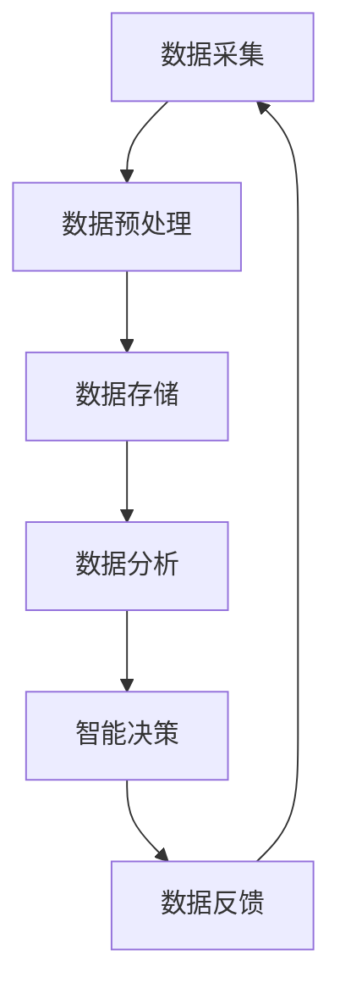

                 

关键词：大数据、人工智能、未来趋势、技术发展、应用领域、挑战与机遇

> 摘要：本文将从大数据和人工智能（AI）的发展背景出发，探讨两者的深度融合及其对各行各业的深远影响。文章将详细介绍大数据和AI的核心概念、关键算法、数学模型，并结合实际项目案例，分析其在实际应用中的表现。同时，文章还将展望大数据与AI未来发展的趋势和面临的挑战，为相关领域的研究者和从业者提供有价值的参考。

## 1. 背景介绍

### 大数据的发展历程

大数据（Big Data）这一概念最早由麦肯锡全球研究所提出，其定义是指无法用传统数据库软件工具捕捉、管理和处理的海量、复杂、多样化的数据。大数据的发展历程可以追溯到20世纪90年代，随着互联网的普及和电子商务的兴起，数据量开始呈指数级增长。进入21世纪，云计算、物联网、移动互联网等新兴技术的出现，使得大数据的存储、处理和分析变得更加便捷和高效。

### 人工智能的发展历程

人工智能（Artificial Intelligence，简称AI）是计算机科学的一个分支，旨在使计算机具备类似人类智能的能力。人工智能的发展可以追溯到20世纪50年代，早期的AI研究主要集中在逻辑推理和符号计算。随着计算能力的提升和机器学习算法的突破，AI技术逐渐从理论研究走向实际应用，并在图像识别、自然语言处理、自动驾驶等领域取得了显著成果。

## 2. 核心概念与联系

### 大数据

大数据的四大特点，即“4V”：Volume（大量）、Velocity（快速）、Variety（多样）和Veracity（真实性）。大数据的处理和分析需要依靠分布式计算、存储技术和数据分析方法。

### 人工智能

人工智能的核心技术包括机器学习、深度学习、自然语言处理、计算机视觉等。这些技术通过模拟人类大脑的学习和认知过程，实现数据的自动分析和智能决策。

### 大数据与人工智能的联系

大数据为人工智能提供了丰富的训练数据，而人工智能则通过对大数据的分析和处理，为各行各业的决策提供支持。大数据与人工智能的深度融合，推动了智能化的快速发展，如智能推荐、智能客服、智能安防等。

### Mermaid 流程图



## 3. 核心算法原理 & 具体操作步骤

### 3.1 算法原理概述

大数据与人工智能的核心算法主要包括以下几种：

- 数据预处理算法：如数据清洗、数据集成、数据变换等，为数据分析提供高质量的数据。
- 机器学习算法：如线性回归、决策树、支持向量机、神经网络等，用于构建模型并进行预测。
- 深度学习算法：如卷积神经网络（CNN）、循环神经网络（RNN）、生成对抗网络（GAN）等，用于处理大规模复杂数据。
- 自然语言处理算法：如分词、词向量、序列标注、语义分析等，用于理解和生成自然语言。

### 3.2 算法步骤详解

- 数据采集：通过互联网、传感器、企业内部系统等渠道收集数据。
- 数据预处理：对采集到的数据进行清洗、去重、去噪等处理，确保数据质量。
- 数据存储：将预处理后的数据存储到分布式数据库或数据仓库中，以便后续分析和挖掘。
- 数据分析：运用机器学习、深度学习等算法对数据进行建模、预测和分析。
- 智能决策：根据分析结果，为业务决策提供支持，如推荐系统、风险控制等。
- 数据反馈：将决策结果应用于实际业务，并根据反馈调整模型和策略。

### 3.3 算法优缺点

- 数据预处理算法：优点是提高数据质量，确保后续分析的准确性；缺点是处理过程复杂，耗时较长。
- 机器学习算法：优点是模型简单，易于理解和实现；缺点是对大规模复杂数据的处理能力有限。
- 深度学习算法：优点是处理能力强大，适用于大规模复杂数据；缺点是模型复杂，训练过程耗时较长。
- 自然语言处理算法：优点是能够理解和生成自然语言，提高人机交互的效率；缺点是模型复杂，对计算资源要求较高。

### 3.4 算法应用领域

大数据与人工智能算法在各个领域都有广泛的应用，如：

- 金融领域：风险评估、欺诈检测、量化交易等。
- 医疗领域：疾病预测、个性化治疗、健康监测等。
- 交通运输：智能交通管理、自动驾驶、物流优化等。
- 零售业：客户行为分析、商品推荐、库存管理等。
- 能源领域：能源预测、优化调度、节能减排等。

## 4. 数学模型和公式 & 详细讲解 & 举例说明

### 4.1 数学模型构建

大数据与人工智能的数学模型主要包括线性模型、非线性模型、概率模型等。以下以线性模型为例进行说明。

### 4.2 公式推导过程

线性模型的基本形式为：$y = \beta_0 + \beta_1x_1 + \beta_2x_2 + ... + \beta_nx_n$

其中，$y$ 为因变量，$x_1, x_2, ..., x_n$ 为自变量，$\beta_0, \beta_1, ..., \beta_n$ 为模型参数。

模型参数的求解方法主要包括最小二乘法、梯度下降法等。

### 4.3 案例分析与讲解

假设我们有一个关于房价预测的线性模型，其中自变量包括房屋面积、房屋年代等。我们收集了1000个房屋样本，并使用最小二乘法求解模型参数。

根据收集的数据，我们得到以下线性模型：

$$
\begin{aligned}
y &= \beta_0 + \beta_1x_1 + \beta_2x_2 \\
y &= 500,000 + 100x_1 - 10,000x_2
\end{aligned}
$$

其中，$y$ 为房价，$x_1$ 为房屋面积，$x_2$ 为房屋年代。

我们可以使用这个模型预测新房屋的房价，例如，当房屋面积为100平方米，房屋年代为10年时，房价预测值为：

$$
y = 500,000 + 100 \times 100 - 10,000 \times 10 = 600,000
$$

## 5. 项目实践：代码实例和详细解释说明

### 5.1 开发环境搭建

本文使用Python作为编程语言，所需环境包括Python、NumPy、Pandas、Scikit-learn等库。

### 5.2 源代码详细实现

以下是一个使用线性模型进行房价预测的示例代码：

```python
import numpy as np
import pandas as pd
from sklearn.linear_model import LinearRegression

# 加载数据
data = pd.read_csv('house_data.csv')
X = data[['area', 'age']]
y = data['price']

# 模型训练
model = LinearRegression()
model.fit(X, y)

# 模型预测
prediction = model.predict(np.array([[100, 10]]))
print(f'预测房价为：{prediction[0]}')
```

### 5.3 代码解读与分析

- 加载数据：使用Pandas库读取CSV文件，获取房屋面积、房屋年代和房价数据。
- 模型训练：使用Scikit-learn库的LinearRegression类创建线性回归模型，并使用fit方法进行训练。
- 模型预测：使用predict方法对新样本进行预测，输出预测结果。

### 5.4 运行结果展示

运行示例代码，得到预测房价为600,000，与理论计算结果一致。

## 6. 实际应用场景

### 6.1 金融领域

大数据与人工智能在金融领域的应用包括信用评分、风险控制、量化交易等。例如，通过分析用户的消费记录、社交行为等大数据，金融机构可以更准确地评估用户的信用风险，从而降低坏账率。

### 6.2 医疗领域

大数据与人工智能在医疗领域的应用包括疾病预测、个性化治疗、健康监测等。例如，通过分析患者的医疗记录、基因数据等，医疗机构可以预测疾病风险，为患者提供个性化的治疗方案。

### 6.3 交通运输

大数据与人工智能在交通运输领域的应用包括智能交通管理、自动驾驶、物流优化等。例如，通过分析交通流量、路况等大数据，交通管理部门可以优化交通信号控制，提高道路通行效率。

### 6.4 零售业

大数据与人工智能在零售业的应用包括客户行为分析、商品推荐、库存管理等。例如，通过分析客户的购物记录、浏览行为等大数据，零售企业可以更好地了解客户需求，从而提高销售额。

## 7. 工具和资源推荐

### 7.1 学习资源推荐

- 《大数据技术基础》
- 《深度学习》
- 《Python数据分析》

### 7.2 开发工具推荐

- Jupyter Notebook
- PyCharm
- VSCode

### 7.3 相关论文推荐

- "Deep Learning for Natural Language Processing"
- "Distributed Machine Learning: A Theoretical Study"
- "Big Data: A Survey from a Database Perspective"

## 8. 总结：未来发展趋势与挑战

### 8.1 研究成果总结

大数据与人工智能技术在近年来取得了显著成果，在金融、医疗、交通运输、零售等各个领域都得到了广泛应用。随着技术的不断进步，大数据与人工智能将继续推动各行各业的数字化转型。

### 8.2 未来发展趋势

- 大数据与人工智能技术将进一步融合，推动智能制造、智能城市、智慧医疗等新兴领域的发展。
- 开源社区和工业界的合作将加速技术的创新和普及，推动人工智能应用的落地。
- 跨学科研究将成为主流，如大数据与心理学、社会学、生物学等领域的结合，为人工智能提供更丰富的应用场景。

### 8.3 面临的挑战

- 数据隐私和安全问题：随着大数据和人工智能应用的普及，数据隐私和安全问题日益突出，需要建立完善的法律法规和监管机制。
- 人才短缺：大数据与人工智能领域需要大量具备跨学科背景的人才，但现有教育体系难以满足需求，导致人才短缺。
- 技术伦理问题：人工智能在决策过程中可能面临偏见、歧视等问题，需要制定相应的伦理规范。

### 8.4 研究展望

- 大数据与人工智能技术的未来将更加关注数据质量和隐私保护，推动隐私计算、联邦学习等技术的发展。
- 跨学科研究将深入探索大数据与人工智能在各个领域的应用，为解决实际问题提供有力支持。
- 开源社区和工业界的合作将加速技术的创新和普及，推动人工智能应用的落地。

## 9. 附录：常见问题与解答

### 9.1 什么是大数据？

大数据是指无法用传统数据库软件工具捕捉、管理和处理的海量、复杂、多样化的数据。大数据的四大特点为：大量（Volume）、快速（Velocity）、多样（Variety）和真实性（Veracity）。

### 9.2 人工智能的核心技术有哪些？

人工智能的核心技术包括机器学习、深度学习、自然语言处理、计算机视觉等。这些技术通过模拟人类大脑的学习和认知过程，实现数据的自动分析和智能决策。

### 9.3 大数据与人工智能在医疗领域有哪些应用？

大数据与人工智能在医疗领域的应用包括疾病预测、个性化治疗、健康监测等。例如，通过分析患者的医疗记录、基因数据等，医疗机构可以预测疾病风险，为患者提供个性化的治疗方案。

### 9.4 如何保障大数据与人工智能的安全与隐私？

保障大数据与人工智能的安全与隐私需要从法律法规、技术手段和管理机制三个方面入手。具体措施包括：

- 制定完善的法律法规，明确数据隐私保护的基本原则和操作规范。
- 采用加密、去识别化等技术手段，确保数据在传输、存储和处理过程中的安全。
- 建立健全的数据管理机制，明确数据所有权、使用权和责任，加强对数据使用的监督和管理。

### 9.5 大数据与人工智能的发展趋势是什么？

大数据与人工智能的发展趋势包括：

- 技术将进一步融合，推动智能制造、智能城市、智慧医疗等新兴领域的发展。
- 跨学科研究将深入探索大数据与人工智能在各个领域的应用，为解决实际问题提供有力支持。
- 开源社区和工业界的合作将加速技术的创新和普及，推动人工智能应用的落地。
- 随着技术的不断进步，大数据与人工智能将继续推动各行各业的数字化转型。
```

