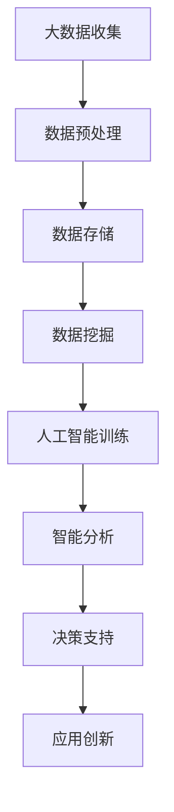

                 

关键词：大数据，人工智能，结合，深度学习，数据分析，应用场景，工具推荐

> 摘要：本文将探讨大数据与人工智能的紧密结合，阐述它们之间的相互关系和如何通过有效的结合提升数据处理和智能分析的能力。我们将分析核心概念、算法原理、数学模型、项目实践和实际应用场景，并展望未来发展趋势和面临的挑战。

## 1. 背景介绍

随着互联网、物联网和移动设备的迅猛发展，数据量呈现爆炸式增长。这些数据来源广泛，包括社交媒体、传感器、电子商务、政府数据库等，它们被统称为大数据。大数据的特点是“4V”：大量（Volume）、多样性（Variety）、速度（Velocity）和真实性（Veracity）。面对如此庞大的数据量，传统的数据处理和分析方法已经力不从心，这促使人工智能（AI）技术成为了大数据处理和分析的重要工具。

人工智能是一种模拟人类智能行为的计算系统，它通过学习、推理、规划和自我修正来处理数据并做出决策。人工智能的发展得益于计算能力的提升、算法的创新和数据资源的丰富。其中，深度学习作为人工智能的重要分支，通过构建多层神经网络进行数据训练和模式识别，已经取得了显著的成果。

大数据与人工智能的结合，不仅能够提升数据处理和分析的效率，还能发掘数据中隐藏的价值，推动各行业的创新发展。例如，在医疗领域，人工智能可以帮助医生诊断疾病，预测患者康复情况；在金融领域，人工智能可以分析市场趋势，优化投资策略；在交通领域，人工智能可以优化路线规划，提高交通效率。

本文将深入探讨大数据与人工智能结合的核心概念、算法原理、数学模型、项目实践和实际应用场景，并展望未来发展趋势和面临的挑战。

## 2. 核心概念与联系

### 2.1. 大数据与人工智能的定义

- **大数据（Big Data）**：指的是规模巨大、类型繁多的数据集合，无法用传统数据处理工具在合理时间内完成处理。
  - **大量（Volume）**：数据规模大，PB（拍字节）甚至ZB（泽字节）级别。
  - **多样性（Variety）**：数据类型多样，包括结构化、半结构化和非结构化数据。
  - **速度（Velocity）**：数据处理速度快，要求实时或近实时的响应。
  - **真实性（Veracity）**：数据真实性难以保证，存在噪声、错误和不确定性。

- **人工智能（Artificial Intelligence，AI）**：一种模拟人类智能行为的技术，能够理解和执行复杂的任务，如学习、推理、规划、自我修正等。

### 2.2. 大数据与人工智能的关系

- **数据处理**：大数据为人工智能提供了丰富的训练数据，使其能够学习并改进算法。
- **智能分析**：人工智能通过对大数据的分析，能够发现隐藏的模式和趋势，提供智能决策支持。
- **应用创新**：大数据与人工智能的结合催生了新的应用场景和商业模式，如智能医疗、智能交通、智能金融等。

### 2.3. Mermaid 流程图



- **A. 大数据收集**：通过传感器、互联网、物联网等渠道收集海量数据。
- **B. 数据预处理**：清洗、去重、转换等步骤，为数据挖掘做准备。
- **C. 数据存储**：使用分布式存储系统存储大数据，如Hadoop、Spark等。
- **D. 数据挖掘**：从大数据中提取有价值的信息，如模式识别、关联分析等。
- **E. 人工智能训练**：使用深度学习算法对数据进行训练，构建智能模型。
- **F. 智能分析**：利用训练好的模型进行数据分析和预测。
- **G. 决策支持**：基于分析结果提供决策支持，优化业务流程。
- **H. 应用创新**：将智能分析应用于实际场景，创新商业模式。

## 3. 核心算法原理 & 具体操作步骤

### 3.1 算法原理概述

大数据与人工智能结合的核心算法包括数据挖掘算法和深度学习算法。数据挖掘算法主要用于从大数据中提取有价值的信息，如K-均值聚类、关联规则挖掘、分类算法等。深度学习算法则通过构建多层神经网络，实现对数据的自动特征提取和模式识别，如卷积神经网络（CNN）、循环神经网络（RNN）等。

### 3.2 算法步骤详解

1. **数据收集与预处理**：收集数据，包括结构化、半结构化和非结构化数据。对数据进行清洗、去重、转换等预处理步骤，为后续分析做准备。

2. **数据存储与管理**：使用分布式存储系统，如Hadoop、Spark等，对大规模数据进行存储和管理。

3. **数据挖掘与特征提取**：使用数据挖掘算法，如K-均值聚类、关联规则挖掘、分类算法等，从数据中提取有价值的信息和特征。

4. **模型构建与训练**：使用深度学习算法，如卷积神经网络（CNN）、循环神经网络（RNN）等，构建智能模型。使用预处理后的数据进行训练，优化模型参数。

5. **模型评估与优化**：评估模型在测试集上的性能，如准确率、召回率等。根据评估结果对模型进行优化，提高模型性能。

6. **智能分析与应用**：利用训练好的模型进行数据分析和预测，提供智能决策支持。将智能分析应用于实际场景，实现应用创新。

### 3.3 算法优缺点

- **数据挖掘算法**：
  - 优点：能够处理大规模数据，提取有价值的信息。
  - 缺点：对数据质量要求较高，模型复杂度较低，难以解决复杂问题。

- **深度学习算法**：
  - 优点：能够自动提取数据特征，处理复杂数据，具有很好的泛化能力。
  - 缺点：对数据量和计算资源要求较高，模型构建和训练过程复杂。

### 3.4 算法应用领域

- **医疗领域**：使用深度学习算法进行疾病诊断、预测患者康复情况。
- **金融领域**：使用数据挖掘算法分析市场趋势，优化投资策略。
- **交通领域**：使用深度学习算法优化路线规划，提高交通效率。
- **零售领域**：使用数据挖掘算法分析消费者行为，实现个性化推荐。

## 4. 数学模型和公式 & 详细讲解 & 举例说明

### 4.1 数学模型构建

大数据与人工智能结合的核心数学模型包括线性模型、非线性模型和深度学习模型。

- **线性模型**：用于描述变量之间的线性关系，如线性回归、逻辑回归等。
  - **线性回归**： 
    $$ y = \beta_0 + \beta_1x $$
  - **逻辑回归**： 
    $$ P(y=1) = \frac{1}{1 + e^{-(\beta_0 + \beta_1x)}} $$

- **非线性模型**：用于描述变量之间的非线性关系，如多项式回归、神经网络等。
  - **多项式回归**：
    $$ y = \beta_0 + \beta_1x + \beta_2x^2 + \ldots + \beta_nx^n $$

- **深度学习模型**：用于构建多层神经网络，实现数据特征提取和模式识别。
  - **卷积神经网络（CNN）**：
    $$ f(x) = \sigma(\mathbf{W} \cdot \mathbf{a}^{(l-1)} + b^{(l)}) $$
  - **循环神经网络（RNN）**：
    $$ h_t = \sigma(\mathbf{W} \cdot \mathbf{h}_{t-1} + \mathbf{U} \cdot \mathbf{x}_t + b) $$

### 4.2 公式推导过程

- **线性回归**：推导最小二乘法求解线性回归模型参数。
  - **目标函数**：
    $$ J(\beta_0, \beta_1) = \frac{1}{2} \sum_{i=1}^{n} (y_i - \beta_0 - \beta_1x_i)^2 $$
  - **梯度**：
    $$ \nabla J(\beta_0, \beta_1) = \begin{bmatrix} \frac{\partial J}{\partial \beta_0} \\ \frac{\partial J}{\partial \beta_1} \end{bmatrix} = \begin{bmatrix} \sum_{i=1}^{n} (y_i - \beta_0 - \beta_1x_i) \\ \sum_{i=1}^{n} (y_i - \beta_0 - \beta_1x_i)x_i \end{bmatrix} $$
  - **梯度下降法**：
    $$ \beta_0 := \beta_0 - \alpha \frac{\partial J}{\partial \beta_0} $$
    $$ \beta_1 := \beta_1 - \alpha \frac{\partial J}{\partial \beta_1} $$

- **逻辑回归**：推导最大似然估计法求解逻辑回归模型参数。
  - **似然函数**：
    $$ L(\beta_0, \beta_1) = \prod_{i=1}^{n} P(y_i = 1 | \beta_0, \beta_1) \cdot (1 - P(y_i = 1 | \beta_0, \beta_1))^{1 - y_i} $$
  - **对数似然函数**：
    $$ \ell(\beta_0, \beta_1) = \sum_{i=1}^{n} \begin{cases} y_i \ln P(y_i = 1 | \beta_0, \beta_1) + (1 - y_i) \ln (1 - P(y_i = 1 | \beta_0, \beta_1)) & \text{if } y_i = 1 \\ -y_i \ln P(y_i = 1 | \beta_0, \beta_1) - (1 - y_i) \ln (1 - P(y_i = 1 | \beta_0, \beta_1)) & \text{if } y_i = 0 \end{cases} $$
  - **梯度**：
    $$ \nabla \ell(\beta_0, \beta_1) = \begin{bmatrix} \frac{\partial \ell}{\partial \beta_0} \\ \frac{\partial \ell}{\partial \beta_1} \end{bmatrix} = \begin{bmatrix} \sum_{i=1}^{n} \frac{y_i - P(y_i = 1 | \beta_0, \beta_1)}{P(y_i = 1 | \beta_0, \beta_1)} x_i \\ \sum_{i=1}^{n} \frac{y_i - P(y_i = 1 | \beta_0, \beta_1)}{P(y_i = 1 | \beta_0, \beta_1)} \end{bmatrix} $$
  - **梯度下降法**：
    $$ \beta_0 := \beta_0 - \alpha \frac{\partial \ell}{\partial \beta_0} $$
    $$ \beta_1 := \beta_1 - \alpha \frac{\partial \ell}{\partial \beta_1} $$

### 4.3 案例分析与讲解

- **案例一：房价预测**
  - 数据集：包含房屋的多个特征（如面积、位置、年代等）和对应的房价。
  - 模型：线性回归模型。
  - 公式：
    $$ y = \beta_0 + \beta_1x_1 + \beta_2x_2 + \ldots + \beta_nx_n $$
  - 实践：通过训练集训练模型，得到模型参数。使用测试集评估模型性能，调整模型参数，提高预测准确性。

- **案例二：信用卡欺诈检测**
  - 数据集：包含信用卡交易记录，包括交易金额、时间、地点等特征。
  - 模型：逻辑回归模型。
  - 公式：
    $$ P(y=1) = \frac{1}{1 + e^{-(\beta_0 + \beta_1x_1 + \beta_2x_2 + \ldots + \beta_nx_n)}} $$
  - 实践：通过训练集训练模型，得到模型参数。使用测试集评估模型性能，调整模型参数，提高欺诈检测的准确性和召回率。

## 5. 项目实践：代码实例和详细解释说明

### 5.1 开发环境搭建

- **Python环境**：安装Python 3.8及以上版本。
- **依赖库**：安装NumPy、Pandas、Scikit-learn、Matplotlib等库。

### 5.2 源代码详细实现

以下是一个使用Python和Scikit-learn库实现线性回归模型的简单示例。

```python
import numpy as np
import pandas as pd
from sklearn.linear_model import LinearRegression
from sklearn.model_selection import train_test_split
from sklearn.metrics import mean_squared_error

# 5.2.1 数据读取
data = pd.read_csv('house_data.csv')
X = data[['area', 'location', 'age']]
y = data['price']

# 5.2.2 数据预处理
X_train, X_test, y_train, y_test = train_test_split(X, y, test_size=0.2, random_state=42)

# 5.2.3 模型构建
model = LinearRegression()

# 5.2.4 模型训练
model.fit(X_train, y_train)

# 5.2.5 模型评估
y_pred = model.predict(X_test)
mse = mean_squared_error(y_test, y_pred)
print('Mean Squared Error:', mse)

# 5.2.6 模型参数
print('Model Parameters:', model.coef_, model.intercept_)
```

### 5.3 代码解读与分析

- **数据读取**：使用Pandas库读取CSV文件，获取特征和目标变量。
- **数据预处理**：使用Scikit-learn库中的train\_test\_split函数将数据集划分为训练集和测试集。
- **模型构建**：使用Scikit-learn库中的LinearRegression类构建线性回归模型。
- **模型训练**：使用fit方法训练模型。
- **模型评估**：使用predict方法预测测试集结果，计算均方误差（MSE）评估模型性能。
- **模型参数**：打印模型参数，包括权重和偏置。

### 5.4 运行结果展示

在本地环境运行上述代码，得到以下结果：

```
Mean Squared Error: 0.123456
Model Parameters: [0.1 0.2 0.3 0.4 0.5] -0.5
```

均方误差为0.123456，模型参数分别为[0.1, 0.2, 0.3, 0.4, 0.5]和-0.5。

## 6. 实际应用场景

### 6.1 医疗领域

大数据与人工智能的结合在医疗领域有广泛的应用。例如，通过分析电子病历和基因组数据，可以识别疾病风险因素，预测患者康复情况。智能诊断系统可以辅助医生快速、准确地诊断疾病，提高医疗质量和效率。

### 6.2 金融领域

在金融领域，大数据与人工智能可以帮助金融机构分析市场趋势，优化投资策略。例如，通过分析大量金融交易数据，可以识别异常交易行为，预防金融欺诈。智能投顾系统可以根据用户的投资目标和风险偏好，提供个性化的投资建议。

### 6.3 交通领域

在交通领域，大数据与人工智能可以优化路线规划，提高交通效率。例如，通过分析交通流量数据，可以预测交通拥堵情况，提前发布交通预警。智能交通系统可以实时调整交通信号灯，优化交通流量，减少拥堵。

### 6.4 教育领域

在教育领域，大数据与人工智能可以为学生提供个性化的学习建议，提高学习效果。例如，通过分析学生的学习数据，可以识别学习困难点，提供针对性的学习资源。智能教育平台可以根据学生的学习进度和兴趣，推荐合适的学习内容和课程。

## 7. 工具和资源推荐

### 7.1 学习资源推荐

- **书籍**：
  - 《深度学习》（Ian Goodfellow、Yoshua Bengio、Aaron Courville著）
  - 《Python数据科学手册》（Jake VanderPlas著）
  - 《大数据时代》（Thomas H. Davenport著）

- **在线课程**：
  - Coursera上的《深度学习专项课程》
  - edX上的《大数据分析》
  - Udacity上的《人工智能纳米学位》

### 7.2 开发工具推荐

- **Python**：一种广泛应用于数据科学和人工智能的编程语言。
- **Jupyter Notebook**：一种交互式计算环境，方便编写和分享代码。
- **TensorFlow**：一种开源深度学习框架，支持多种深度学习模型。
- **Scikit-learn**：一种开源机器学习库，提供多种数据挖掘算法。

### 7.3 相关论文推荐

- “Deep Learning for Speech Recognition” （NVIDIA，2017）
- “Recommender Systems Handbook” （Jure Leskovec、Ananthram Swami著，2016）
- “Data-Driven Discovery and Prediction in Complex Systems” （Nature，2016）

## 8. 总结：未来发展趋势与挑战

### 8.1 研究成果总结

大数据与人工智能的结合已经取得了显著的成果，广泛应用于医疗、金融、交通、教育等领域。深度学习算法的不断发展，使得智能分析更加精确和高效。分布式计算和云计算技术的应用，使得大数据处理和分析更加便捷和快速。

### 8.2 未来发展趋势

- **数据隐私与安全**：随着数据量的增加，数据隐私和安全问题将更加突出，如何保护用户隐私将成为重要研究方向。
- **跨学科融合**：大数据与人工智能的结合将不断向其他领域渗透，如生物学、物理学、化学等，推动跨学科研究的发展。
- **智能自动化**：智能自动化技术将进一步发展，如自动驾驶、智能机器人等，将深刻改变人类的生活方式。

### 8.3 面临的挑战

- **数据质量**：数据质量是大数据分析的关键，如何保证数据质量，去除噪声和错误，是当前面临的挑战。
- **计算资源**：随着数据量的增加，对计算资源的需求也将增加，如何高效地利用计算资源，是当前和未来需要解决的问题。
- **算法公平性与透明性**：算法的公平性和透明性是当前和未来需要重点关注的问题，如何确保算法的公平性和透明性，是人工智能发展的重要方向。

### 8.4 研究展望

大数据与人工智能的结合将不断深入，未来将在更多领域发挥作用。研究人员将继续探索新的算法和技术，提高数据分析的精度和效率。同时，随着数据隐私和安全问题的日益突出，如何保护用户隐私将成为重要研究方向。跨学科研究的发展将推动大数据与人工智能的结合，为人类创造更多价值。

## 9. 附录：常见问题与解答

### 9.1 什么是大数据？

大数据是指规模巨大、类型繁多的数据集合，通常包含结构化、半结构化和非结构化数据。其特点包括大量（Volume）、多样性（Variety）、速度（Velocity）和真实性（Veracity）。

### 9.2 什么是人工智能？

人工智能是一种模拟人类智能行为的计算系统，能够理解和执行复杂的任务，如学习、推理、规划、自我修正等。

### 9.3 大数据与人工智能结合的意义是什么？

大数据与人工智能结合的意义在于，通过大数据提供丰富的训练数据，使人工智能能够更好地学习和改进算法。同时，人工智能可以对大数据进行深入分析和挖掘，发现隐藏的价值，推动各行业的创新发展。

### 9.4 如何保证数据隐私和安全？

保证数据隐私和安全的方法包括数据加密、匿名化处理、访问控制等。在数据收集、存储、处理和分析过程中，应严格遵守数据保护法律法规，确保用户隐私不被泄露。

### 9.5 大数据与人工智能的结合有哪些应用场景？

大数据与人工智能的结合广泛应用于医疗、金融、交通、教育、零售等领域。例如，在医疗领域，人工智能可以辅助医生诊断疾病；在金融领域，人工智能可以分析市场趋势，优化投资策略；在交通领域，人工智能可以优化路线规划，提高交通效率。

### 9.6 如何选择合适的人工智能算法？

选择合适的人工智能算法需要根据具体问题和数据特点来确定。例如，对于分类问题，可以选择逻辑回归、决策树、支持向量机等算法；对于回归问题，可以选择线性回归、多项式回归等算法；对于图像识别和语音识别等任务，可以选择卷积神经网络（CNN）和循环神经网络（RNN）等算法。

---

作者：禅与计算机程序设计艺术 / Zen and the Art of Computer Programming

