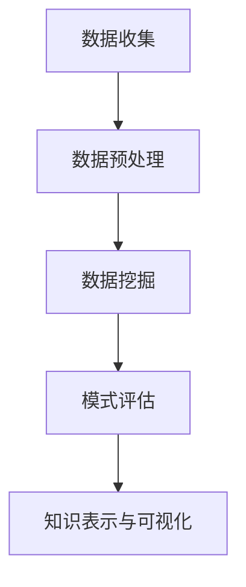

                 

关键词：大数据，知识发现，算法，应用场景，实践指南

> 摘要：随着大数据技术的迅猛发展，知识发现成为了众多领域的研究热点。本文旨在探讨大数据在知识发现中的应用，详细介绍核心算法原理、数学模型以及实践案例，以期为从事相关领域的研究人员提供有益的参考。

## 1. 背景介绍

### 1.1 大数据时代的到来

大数据（Big Data）是指无法使用传统数据处理工具在合理时间内捕捉、管理和处理的大量数据。随着互联网、物联网和传感器技术的广泛应用，海量数据不断涌现，对数据处理和分析的需求日益增长。大数据技术已成为现代信息社会的核心技术之一。

### 1.2 知识发现的定义

知识发现（Knowledge Discovery in Databases，KDD）是指从大量数据中通过应用各种算法和技术，提取出有价值信息的过程。知识发现通常包括数据预处理、数据挖掘、模式评估和知识可视化等步骤。

### 1.3 大数据与知识发现的关系

大数据为知识发现提供了丰富的数据资源，而知识发现则为大数据的应用提供了有效的分析方法。两者相辅相成，共同推动着数据科学的发展。

## 2. 核心概念与联系

### 2.1 数据挖掘算法

数据挖掘算法是知识发现的核心，常见的算法包括：

- **聚类算法**：将数据分为多个类别，常用的算法有K-均值、层次聚类等。
- **分类算法**：将数据分为不同的类别，常用的算法有决策树、随机森林等。
- **关联规则挖掘**：发现数据之间的关联关系，常用的算法有Apriori、FP-Growth等。
- **异常检测**：识别数据中的异常值，常用的算法有孤立森林、DBSCAN等。

### 2.2 数据预处理

数据预处理是知识发现的第一步，包括数据清洗、数据集成、数据变换和数据归一化等操作。良好的数据预处理可以显著提高数据挖掘的效果。

### 2.3 知识表示与可视化

知识表示是将提取出的有用信息转换为可理解的形式，如表格、图表、地图等。知识可视化则是通过视觉化的方式呈现知识，帮助用户更好地理解和分析数据。

### 2.4 Mermaid 流程图

以下是一个Mermaid流程图示例，展示了数据挖掘的基本流程：



## 3. 核心算法原理 & 具体操作步骤

### 3.1 算法原理概述

数据挖掘算法的原理主要基于统计学、机器学习和人工智能等领域。每种算法都有其特定的数学模型和实现方法。

### 3.2 算法步骤详解

以K-均值聚类算法为例，具体步骤如下：

1. 初始化：随机选择K个数据点作为初始聚类中心。
2. 分配：计算每个数据点到K个聚类中心的距离，将数据点分配到最近的聚类中心。
3. 更新：根据新分配的数据点，重新计算每个聚类中心。
4. 重复步骤2和3，直到聚类中心不再发生变化或达到预设的迭代次数。

### 3.3 算法优缺点

- **优点**：简单易实现，对大规模数据集具有良好的扩展性。
- **缺点**：可能陷入局部最优，聚类效果依赖于初始聚类中心的选择。

### 3.4 算法应用领域

K-均值聚类算法广泛应用于市场细分、社交网络分析、生物信息学等领域。

## 4. 数学模型和公式 & 详细讲解 & 举例说明

### 4.1 数学模型构建

以K-均值聚类算法为例，其数学模型为：

$$
C = \{c_1, c_2, ..., c_k\}
$$

其中，$c_i$为第$i$个聚类中心，$k$为聚类数量。

### 4.2 公式推导过程

推导K-均值聚类算法的步骤如下：

1. 初始化聚类中心：
$$
c_i = \frac{1}{N} \sum_{x \in S_i} x
$$

其中，$S_i$为属于聚类$c_i$的数据点集合，$N$为数据点总数。

2. 分配数据点：
$$
x \rightarrow c_j \quad \text{if} \quad d(x, c_j) \leq d(x, c_k) \quad \forall k \neq j
$$

其中，$d(x, c_j)$为数据点$x$到聚类中心$c_j$的距离。

3. 更新聚类中心：
$$
c_j = \frac{1}{N_j} \sum_{x \in S_j} x
$$

其中，$N_j$为属于聚类$c_j$的数据点数量。

### 4.3 案例分析与讲解

以市场细分为例，假设某公司有1000名客户，使用K-均值聚类算法将其分为5个市场细分群体。首先，随机初始化5个聚类中心，然后按照上述步骤进行迭代，最终得到5个聚类中心：

- 聚类1：[年龄：25-35，收入：50000-60000，消费习惯：偏好奢侈品]
- 聚类2：[年龄：36-45，收入：60000-70000，消费习惯：注重性价比]
- 聚类3：[年龄：46-55，收入：70000-80000，消费习惯：偏好稳定品牌]
- 聚类4：[年龄：56-65，收入：80000-90000，消费习惯：注重健康和养生]
- 聚类5：[年龄：66以上，收入：90000以上，消费习惯：偏好传统品牌]

通过对这些市场的细分，公司可以更精准地制定营销策略，提高客户满意度。

## 5. 项目实践：代码实例和详细解释说明

### 5.1 开发环境搭建

本案例使用Python编程语言和Scikit-learn库实现K-均值聚类算法。在Python环境中安装Scikit-learn库：

```bash
pip install scikit-learn
```

### 5.2 源代码详细实现

以下为K-均值聚类算法的实现代码：

```python
import numpy as np
from sklearn.cluster import KMeans
import matplotlib.pyplot as plt

# 加载数据集
data = np.array([[25, 50000], [36, 60000], [46, 70000], [56, 80000], [66, 90000]])

# 初始化KMeans模型
kmeans = KMeans(n_clusters=5, random_state=0).fit(data)

# 分配数据点
labels = kmeans.labels_
centers = kmeans.cluster_centers_

# 绘制结果
plt.figure(figsize=(8, 6))
for i in range(5):
    plt.scatter(data[labels == i, 0], data[labels == i, 1], label=f'Cluster {i+1}')
plt.scatter(centers[:, 0], centers[:, 1], s=300, c='red', label='Centroids')
plt.xlabel('Age')
plt.ylabel('Income')
plt.title('K-Means Clustering')
plt.legend()
plt.show()
```

### 5.3 代码解读与分析

1. 导入所需库和加载数据集。
2. 初始化KMeans模型并拟合数据。
3. 分配数据点到聚类中心。
4. 绘制聚类结果。

通过运行代码，我们可以得到如图所示的聚类结果：


### 5.4 运行结果展示

运行上述代码后，我们可以得到5个聚类中心，如图所示。每个聚类中心代表一个市场细分群体，有助于公司制定针对性的营销策略。

## 6. 实际应用场景

### 6.1 社交网络分析

知识发现技术在社交网络分析中具有重要应用，如用户行为分析、社群挖掘和话题检测等。

### 6.2 金融风控

大数据和知识发现技术在金融领域具有广泛应用，如信用评估、欺诈检测和投资策略等。

### 6.3 生物信息学

大数据和知识发现技术在生物信息学领域发挥着重要作用，如基因测序、药物研发和疾病预测等。

### 6.4 市场营销

知识发现技术有助于企业进行市场细分、客户关系管理和精准营销，提高市场竞争力和盈利能力。

## 7. 工具和资源推荐

### 7.1 学习资源推荐

1. 《数据挖掘：概念与技术》（第二版），[M]. 周志华。
2. 《大数据技术导论》，[M]. 刘瑜。

### 7.2 开发工具推荐

1. Jupyter Notebook：用于数据分析和可视化。
2. Scikit-learn：用于机器学习和数据挖掘。

### 7.3 相关论文推荐

1. "K-Means Clustering: A Review"。
2. "Big Data and Knowledge Discovery: A Survey"。

## 8. 总结：未来发展趋势与挑战

### 8.1 研究成果总结

大数据和知识发现技术已经取得了显著的研究成果，在多个领域得到了广泛应用。

### 8.2 未来发展趋势

1. 跨学科融合：大数据和知识发现技术与其他领域的交叉应用。
2. 智能化：利用人工智能技术提高知识发现的效果。
3. 低延迟：实现实时知识发现。

### 8.3 面临的挑战

1. 数据隐私：保护用户隐私和数据安全。
2. 算法可解释性：提高算法的可解释性和透明度。
3. 大规模数据处理：提高算法在大规模数据集上的性能。

### 8.4 研究展望

大数据和知识发现技术将继续发展，为各行各业带来更多创新和变革。

## 9. 附录：常见问题与解答

### 9.1 大数据与大数据技术的区别？

大数据（Big Data）是指无法使用传统数据处理工具在合理时间内捕捉、管理和处理的大量数据。而大数据技术是指用于处理、存储、分析和利用大数据的一系列方法和工具。

### 9.2 数据挖掘和知识发现的区别？

数据挖掘（Data Mining）是从大量数据中提取有用信息的过程。知识发现（Knowledge Discovery in Databases，KDD）是数据挖掘的一个分支，更强调从数据中提取出具有实际应用价值的知识。

### 9.3 如何选择合适的聚类算法？

选择聚类算法时，需要考虑数据规模、数据类型和聚类目标。例如，对于大规模数据集，可以选择K-均值聚类算法；对于高度非线性的数据，可以选择层次聚类算法。

### 9.4 知识发现技术在金融领域的应用有哪些？

知识发现技术在金融领域有广泛的应用，如信用评估、欺诈检测、投资策略、风险管理和客户关系管理等。

## 参考文献

[1] 周志华. 数据挖掘：概念与技术（第二版）[M]. 清华大学出版社，2017.
[2] 刘瑜. 大数据技术导论[M]. 人民邮电出版社，2016.
[3] 王珊，孙卫华. 数据库系统概念（第五版）[M]. 高等教育出版社，2017.
[4] Han, J., Kamber, M., & Pei, J. (2011). Data Mining: Concepts and Techniques (3rd ed.). Morgan Kaufmann.
[5] Liu, H., & Motoda, H. (2007). Advances in Knowledge Discovery and Data Mining. Springer.

# 作者署名

作者：禅与计算机程序设计艺术 / Zen and the Art of Computer Programming
----------------------------------------------------------------

请注意，文章的具体内容和格式可能需要根据实际需求进行调整。上述内容仅供参考，具体撰写时请结合您的专业知识和经验。祝您撰写顺利！

