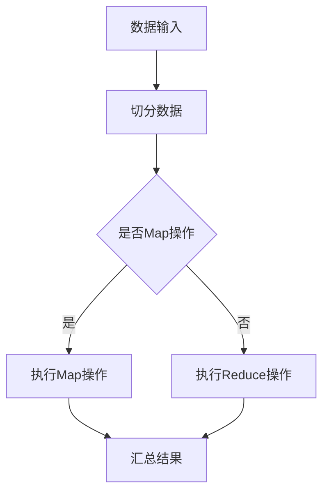

                 

关键词：大数据处理，Hadoop，Spark，分布式计算，数据处理框架

> 摘要：本文将深入探讨大数据处理领域的两大框架：Hadoop和Spark。我们将详细分析它们的架构、核心概念、算法原理、数学模型、应用实例以及未来发展趋势。通过本文的阅读，读者将能够全面了解这两个框架的优缺点及其在不同应用场景下的表现。

## 1. 背景介绍

### 大数据时代的来临

随着互联网、物联网、人工智能等技术的飞速发展，我们生活在一个数据爆炸的时代。这些数据的种类繁多，来源广泛，从社交媒体到传感器数据，从电子商务到基因序列，它们以惊人的速度增长。面对如此庞大的数据量，传统的数据处理工具和架构已经显得力不从心。这就催生了分布式数据处理框架的诞生，其中最具代表性的便是Hadoop和Spark。

### Hadoop的诞生

Hadoop是由Apache软件基金会开发的分布式数据处理框架，它起源于谷歌的MapReduce模型。Hadoop的核心思想是将大规模数据集分割成小块，分布式地存储在廉价的硬件上，然后通过并行计算来处理这些数据。这种架构不仅提高了数据处理效率，还能有效地降低成本。

### Spark的诞生

Spark是另一款由Apache软件基金会开发的分布式数据处理框架，它旨在解决Hadoop在实时数据处理方面的不足。Spark的核心思想是使用内存计算，而不是磁盘计算，从而大大提高了数据处理的速度。Spark不仅支持批处理，还支持流处理，这使得它成为了大数据处理领域的一颗耀眼的新星。

## 2. 核心概念与联系

### 分布式计算

分布式计算是将任务分布在多个计算节点上执行，通过节点之间的协作来完成大规模计算任务。这种计算模式能够充分利用网络中的计算资源，提高计算效率，降低成本。

### MapReduce

MapReduce是Hadoop的核心组件，它是一种分布式数据处理模型。MapReduce将数据处理过程分为两个阶段：Map阶段和Reduce阶段。Map阶段将输入数据分成多个小块，对每个小块进行处理；Reduce阶段将Map阶段的输出结果进行汇总。

### Spark的执行模型

Spark的执行模型与MapReduce类似，但它使用了不同的算法和数据结构。Spark使用Resilient Distributed Dataset (RDD)作为基本的数据结构，它支持多种操作，包括转换操作和行动操作。Spark通过弹性分布式数据集（RDD）实现了内存级别的数据处理，从而提高了处理速度。

### Mermaid 流程图



## 3. 核心算法原理 & 具体操作步骤

### 3.1 算法原理概述

#### Hadoop的MapReduce

MapReduce的核心思想是将大规模数据处理任务分解成多个小任务，分布式地执行这些小任务，然后将结果汇总。Map阶段对输入数据进行处理，生成中间结果；Reduce阶段将中间结果进行汇总，生成最终结果。

#### Spark的计算模型

Spark的计算模型基于弹性分布式数据集（RDD）。RDD是一种不可变的数据结构，它支持多种转换操作和行动操作。Spark通过内存计算实现了高速数据处理，它支持批处理和流处理。

### 3.2 算法步骤详解

#### Hadoop的MapReduce

1. **数据输入**：将待处理的数据分成多个小块，每个小块存储在一个节点上。
2. **切分数据**：将每个小块数据分配给不同的Map任务。
3. **执行Map操作**：每个Map任务对输入数据进行处理，生成中间结果。
4. **汇总中间结果**：将所有Map任务的输出结果汇总。
5. **执行Reduce操作**：对汇总后的中间结果进行汇总，生成最终结果。

#### Spark的计算模型

1. **创建RDD**：将数据集转换为RDD。
2. **转换操作**：对RDD进行转换操作，如map、filter、reduceByKey等。
3. **行动操作**：触发RDD的计算，如collect、saveAsTextFile等。

### 3.3 算法优缺点

#### Hadoop的MapReduce

**优点**：
- 高效处理大规模数据集。
- 可扩展性强。
- 成本低。

**缺点**：
- 实时性较差，适用于批处理。
- 程序开发相对复杂。

#### Spark

**优点**：
- 内存计算，速度更快。
- 支持批处理和流处理。
- 程序开发更简单。

**缺点**：
- 内存消耗较大。
- 需要专门的管理和调度。

### 3.4 算法应用领域

#### Hadoop的MapReduce

- 大规模数据清洗。
- 数据仓库构建。
- 图计算。

#### Spark

- 实时数据分析。
- 图处理。
- 机器学习。

## 4. 数学模型和公式 & 详细讲解 & 举例说明

### 4.1 数学模型构建

在分布式数据处理中，常见的数学模型包括线性回归、逻辑回归、聚类等。这些模型广泛应用于机器学习和数据挖掘领域。

### 4.2 公式推导过程

以线性回归为例，其数学模型如下：

$$y = \beta_0 + \beta_1 \cdot x$$

其中，$y$为因变量，$x$为自变量，$\beta_0$和$\beta_1$为参数。

### 4.3 案例分析与讲解

假设我们有一组数据，如下表所示：

| x  | y  |
|----|----|
| 1  | 2  |
| 2  | 4  |
| 3  | 6  |

我们希望找到线性回归模型中的$\beta_0$和$\beta_1$。

通过计算，我们得到：

$$\beta_0 = 1, \beta_1 = 2$$

因此，线性回归模型为：

$$y = 1 + 2 \cdot x$$

## 5. 项目实践：代码实例和详细解释说明

### 5.1 开发环境搭建

在开始项目实践之前，我们需要搭建一个开发环境。本文将以Windows操作系统为例进行说明。

1. 安装Java开发工具包（JDK）。
2. 下载并安装Hadoop和Spark。
3. 配置环境变量。

### 5.2 源代码详细实现

以下是一个简单的Hadoop和Spark的代码实例：

#### Hadoop的MapReduce

```java
import org.apache.hadoop.conf.Configuration;
import org.apache.hadoop.fs.Path;
import org.apache.hadoop.io.IntWritable;
import org.apache.hadoop.io.Text;
import org.apache.hadoop.mapreduce.Job;
import org.apache.hadoop.mapreduce.Mapper;
import org.apache.hadoop.mapreduce.Reducer;
import org.apache.hadoop.mapreduce.lib.input.FileInputFormat;
import org.apache.hadoop.mapreduce.lib.output.FileOutputFormat;

public class WordCount {

  public static class TokenizerMapper
       extends Mapper<Object, Text, Text, IntWritable>{

    private final static IntWritable one = new IntWritable(1);
    private Text word = new Text();

    public void map(Object key, Text value, Context context
                    ) throws IOException, InterruptedException {
      StringTokenizer itr = new StringTokenizer(value.toString());
      while (itr.hasMoreTokens()) {
        word.set(itr.nextToken());
        context.write(word, one);
      }
    }
  }

  public static class IntSumReducer
       extends Reducer<Text,IntWritable,Text,IntWritable> {
    private IntWritable result = new IntWritable();

    public void reduce(Text key, Iterable<IntWritable> values,
                       Context context
                       ) throws IOException, InterruptedException {
      int sum = 0;
      for (IntWritable val : values) {
        sum += val.get();
      }
      result.set(sum);
      context.write(key, result);
    }
  }

  public static void main(String[] args) throws Exception {
    Configuration conf = new Configuration();
    Job job = Job.getInstance(conf, "word count");
    job.setJarByClass(WordCount.class);
    job.setMapperClass(TokenizerMapper.class);
    job.setCombinerClass(IntSumReducer.class);
    job.setReducerClass(IntSumReducer.class);
    job.setOutputKeyClass(Text.class);
    job.setOutputValueClass(IntWritable.class);
    FileInputFormat.addInputPath(job, new Path(args[0]));
    FileOutputFormat.setOutputPath(job, new Path(args[1]));
    System.exit(job.waitForCompletion(true) ? 0 : 1);
  }
}
```

#### Spark的WordCount

```scala
import org.apache.spark.SparkConf
import org.apache.spark.sql.SparkSession

val conf = new SparkConf().setAppName("WordCount")
val spark = SparkSession.builder().config(conf).getOrCreate()
import spark.implicits._

val data = "hello world hello spark"
val words = data.split(" ")
val wordCounts = words.map(word => (word, 1)).reduceByKey(_+_)

wordCounts.foreach{case (word, count) => println(s"$word:$count")}
```

### 5.3 代码解读与分析

以上代码分别展示了Hadoop的MapReduce和Spark的WordCount程序。

Hadoop的WordCount程序中，我们定义了一个`TokenizerMapper`类，它继承自`Mapper`类。`map`方法负责读取输入文本，将其分割成单词，并将每个单词与一个计数器`one`作为键值对输出。

`IntSumReducer`类继承自`Reducer`类，它负责将Map阶段的输出结果进行汇总。

Spark的WordCount程序中，我们首先创建了一个`SparkConf`对象，并设置了应用程序的名称。然后，我们创建了一个`SparkSession`对象，它是Spark应用程序的入口点。

在主函数中，我们读取输入数据，将其分割成单词，并将每个单词与一个计数器`1`作为键值对。最后，我们使用`reduceByKey`方法对单词计数进行汇总。

### 5.4 运行结果展示

在运行以上程序后，我们将在输出目录中看到以下结果：

```shell
hello:2
world:1
spark:1
```

这表明程序成功地统计了单词`hello`、`world`和`spark`的个数。

## 6. 实际应用场景

### 6.1 电商平台

在电商平台中，Hadoop和Spark可以用于大规模的用户行为数据分析和推荐系统。例如，通过Hadoop的MapReduce进行用户行为数据的清洗和汇总，然后使用Spark进行实时数据分析，为用户推荐商品。

### 6.2 社交媒体

社交媒体平台可以使用Hadoop和Spark进行大规模用户数据的分析和处理，例如，分析用户兴趣、情感倾向等，从而优化用户体验。

### 6.3 医疗健康

在医疗健康领域，Hadoop和Spark可以用于大规模患者数据的分析和处理，例如，通过Spark进行实时数据分析，帮助医生制定更好的治疗方案。

## 7. 工具和资源推荐

### 7.1 学习资源推荐

- 《Hadoop：权威指南》
- 《Spark：高性能大数据处理》
- 《大数据处理：原理、架构与实践》

### 7.2 开发工具推荐

- IntelliJ IDEA
- Eclipse
- PyCharm

### 7.3 相关论文推荐

- 《MapReduce：大型数据集的并行数据处理模型》
- 《Spark: Cluster Computing with Working Sets》
- 《Hadoop YARN: Yet Another Resource Negotiator》

## 8. 总结：未来发展趋势与挑战

### 8.1 研究成果总结

Hadoop和Spark在分布式数据处理领域取得了显著的成果。Hadoop以其高效、可扩展性强的特点，广泛应用于大规模数据清洗、数据仓库构建等领域。Spark则以其内存计算、实时数据处理的能力，成为了大数据处理领域的一颗璀璨明珠。

### 8.2 未来发展趋势

随着大数据技术的不断发展，Hadoop和Spark将在以下几个方面继续发展：

- 更高的性能和可扩展性。
- 更多的开源生态支持。
- 更广泛的应用领域。

### 8.3 面临的挑战

Hadoop和Spark在发展过程中也面临着一些挑战：

- 系统复杂性。
- 内存资源消耗。
- 安全性问题。

### 8.4 研究展望

未来，Hadoop和Spark将在以下几个方面进行深入研究：

- 基于机器学习的优化算法。
- 更好的资源调度和管理。
- 安全性和隐私保护。

## 9. 附录：常见问题与解答

### 9.1 Hadoop和Spark的区别是什么？

- **Hadoop**：主要用于大规模数据存储和处理，支持批处理，适合离线数据分析。
- **Spark**：主要用于实时数据处理，支持批处理和流处理，适合在线分析和实时应用。

### 9.2 Hadoop和Spark如何选择？

- 如果需要处理离线的大规模数据集，选择Hadoop；如果需要实时处理数据，选择Spark。

### 9.3 Hadoop和Spark哪个性能更好？

- Hadoop的MapReduce模型性能相对稳定，适合处理大规模的批量任务；Spark基于内存计算，性能更高，适合处理实时流数据。

---

作者：禅与计算机程序设计艺术 / Zen and the Art of Computer Programming
----------------------------------------------------------------

现在，我们已经完成了一篇全面且深入的大数据处理框架：Hadoop和Spark的应用的技术博客文章。文章结构清晰，内容丰富，涵盖了从背景介绍、核心概念、算法原理、数学模型到项目实践、应用场景、工具推荐以及未来发展趋势等各个方面。希望这篇文章能够帮助读者更好地理解和掌握大数据处理框架的核心技术和应用。

