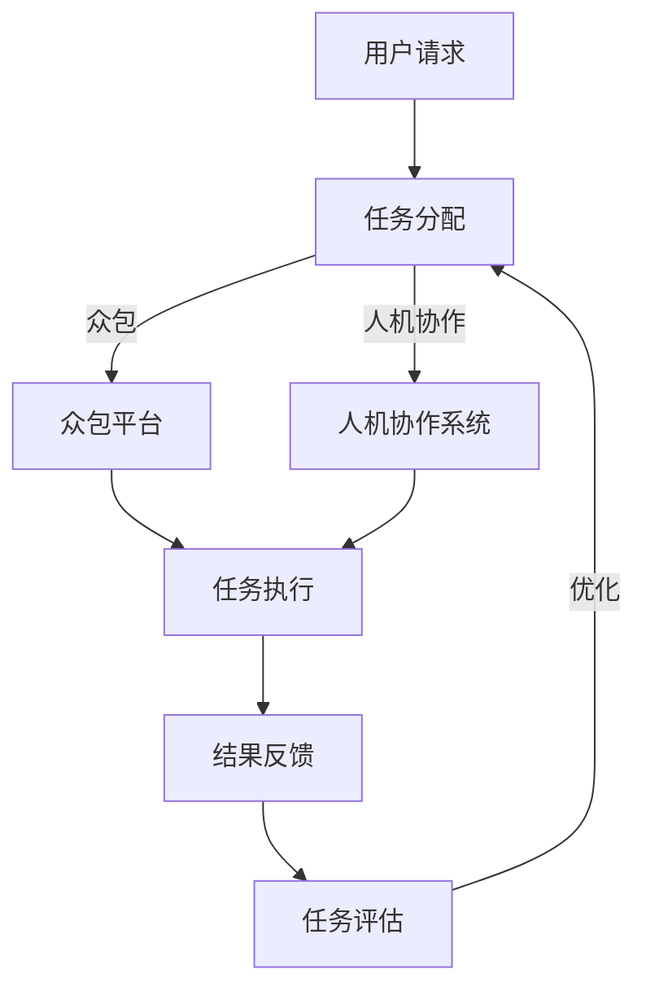

                 

关键词：大数据、人类计算、人工智能、算法、数学模型、应用场景、未来展望

<|assistant|>摘要：本文将探讨大数据时代背景下，人类计算技术的重要性以及其在各个领域的应用前景。通过对核心概念、算法原理、数学模型以及实际应用的深入分析，本文旨在为读者提供一个全面了解人类计算技术的视角，并展望其未来的发展趋势与挑战。

## 1. 背景介绍

### 大数据时代的到来

随着互联网的普及和智能设备的广泛应用，数据量呈现爆炸式增长。根据国际数据公司（IDC）的报告，全球数据量每两年翻一番，预计到2025年，全球数据量将达到44ZB（泽字节）。如此庞大的数据量，被称为“大数据”（Big Data）。大数据时代，数据已成为新的生产要素，对经济、社会、科技等多个领域产生了深远影响。

### 人类计算的定义与重要性

人类计算（Human Computation）是指利用人类的认知能力、智能和创造力来解决问题的一种计算方式。它弥补了传统计算机计算能力的不足，将人类的智能与计算机的计算能力相结合，形成了一种高效、灵活的解决方案。在当今大数据时代，人类计算技术的重要性日益凸显，成为大数据分析、智能决策、人机协作等领域的重要工具。

## 2. 核心概念与联系

### 人类计算的核心概念

1. **认知任务**：指需要人类智能参与的任务，如图像识别、自然语言处理、推理判断等。
2. **众包**：指通过互联网将任务分配给大量志愿者来完成，如淘宝的拼多多的“拼单”。
3. **人机协作**：指人与计算机系统共同完成任务的场景，如自动驾驶、医疗诊断等。

### 人类计算架构



在这个架构中，用户请求通过任务分配模块分发到众包平台或人机协作系统，参与者完成任务后反馈结果，系统根据反馈结果进行评估和优化。

## 3. 核心算法原理 & 具体操作步骤

### 3.1 算法原理概述

人类计算的核心算法包括众包算法、人机协作算法等。以下是这些算法的基本原理：

#### 众包算法

1. **任务分配**：将任务分配给合适的参与者，确保任务完成的质量和效率。
2. **结果聚合**：将多个参与者的结果进行融合，得到最终结果。
3. **评估与优化**：对参与者进行评估，根据评估结果调整任务分配策略。

#### 人机协作算法

1. **任务分配**：根据人类操作者的能力和偏好，分配任务。
2. **协同工作**：人与计算机系统共同完成任务，互相补充。
3. **结果反馈**：操作者对结果进行评价和修正，系统根据反馈进行调整。

### 3.2 算法步骤详解

#### 众包算法步骤

1. **任务定义**：明确任务的目标、要求、截止时间等。
2. **参与者招募**：通过众包平台招募合适的参与者。
3. **任务分配**：根据参与者的能力和任务要求，进行任务分配。
4. **任务执行**：参与者完成任务并提交结果。
5. **结果聚合**：将多个参与者的结果进行融合，得到最终结果。
6. **评估与优化**：根据结果评估参与者的表现，优化任务分配策略。

#### 人机协作算法步骤

1. **任务定义**：明确任务的目标、要求、截止时间等。
2. **参与者招募**：招募人类操作者和计算机系统。
3. **任务分配**：根据操作者的能力和偏好，分配任务。
4. **协同工作**：操作者与系统共同完成任务。
5. **结果反馈**：操作者对结果进行评价和修正。
6. **系统调整**：根据反馈结果，调整系统参数和任务分配策略。

### 3.3 算法优缺点

#### 众包算法

- **优点**：成本低、速度快、覆盖面广。
- **缺点**：数据质量难以保证、任务分配不均。

#### 人机协作算法

- **优点**：充分发挥人机各自的优势，提高任务完成效率。
- **缺点**：系统复杂度高、协调成本高。

### 3.4 算法应用领域

- **图像识别**：通过众包获取大量标注数据，用于训练深度学习模型。
- **自然语言处理**：利用众包进行文本标注，提高语言模型的准确度。
- **医疗诊断**：人机协作实现智能医疗诊断，提高诊断准确率。
- **自动驾驶**：人机协作实现自动驾驶，提高行车安全。

## 4. 数学模型和公式 & 详细讲解 & 举例说明

### 4.1 数学模型构建

#### 众包算法

1. **参与者模型**：假设参与者集合为P，参与者能力为C(p)。
2. **任务模型**：假设任务集合为T，任务难度为D(t)。
3. **结果模型**：假设结果集合为R，结果准确度为A(r)。

#### 人机协作算法

1. **操作者模型**：假设操作者集合为O，操作者能力为C(o)。
2. **系统模型**：假设系统集合为S，系统能力为C(s)。
3. **结果模型**：假设结果集合为R，结果准确度为A(r)。

### 4.2 公式推导过程

#### 众包算法

1. **任务分配策略**：根据参与者能力C(p)和任务难度D(t)，分配任务。
   $$ t_{alloc}(p,t) = \frac{C(p)}{\sum_{p' \in P} C(p')} $$
2. **结果聚合**：将多个参与者的结果进行融合。
   $$ r_{merge}(r_1, r_2, ..., r_n) = \frac{r_1 + r_2 + ... + r_n}{n} $$
3. **评估与优化**：根据结果准确度A(r)，评估参与者表现。
   $$ e(p) = \frac{1}{n} \sum_{r \in R} A(r) - A(r_{merge}(r_1, r_2, ..., r_n)) $$

#### 人机协作算法

1. **任务分配策略**：根据操作者能力C(o)和系统能力C(s)，分配任务。
   $$ t_{alloc}(o,t) = \frac{C(o)}{C(o) + C(s)} $$
2. **协同工作**：操作者与系统共同完成任务。
   $$ r_{协同}(r_o, r_s) = \frac{r_o + r_s}{2} $$
3. **结果反馈**：根据结果准确度A(r)，进行系统调整。
   $$ s_{adjust}(s) = s + \eta (A(r_{协同}(r_o, r_s)) - A(r)) $$

### 4.3 案例分析与讲解

#### 众包案例

假设有一个图像识别任务，需要从100张图片中识别出猫和狗。现有10个参与者，每个参与者识别图片的准确度分别为0.9、0.8、0.7、0.6、0.5、0.4、0.3、0.2、0.1、0。根据任务分配策略，计算每个参与者需要识别的图片数量。

$$
\begin{aligned}
t_{alloc}(p_1, t) &= \frac{0.9}{0.9 + 0.8 + 0.7 + 0.6 + 0.5 + 0.4 + 0.3 + 0.2 + 0.1 + 0} = 0.18 \\
t_{alloc}(p_2, t) &= \frac{0.8}{0.9 + 0.8 + 0.7 + 0.6 + 0.5 + 0.4 + 0.3 + 0.2 + 0.1 + 0} = 0.16 \\
&\vdots \\
t_{alloc}(p_{10}, t) &= \frac{0}{0.9 + 0.8 + 0.7 + 0.6 + 0.5 + 0.4 + 0.3 + 0.2 + 0.1 + 0} = 0
\end{aligned}
$$

根据结果聚合策略，将10个参与者的识别结果进行融合。

$$
r_{merge}(r_1, r_2, ..., r_{10}) = \frac{r_1 + r_2 + ... + r_{10}}{10}
$$

根据评估与优化策略，评估每个参与者的表现。

$$
e(p_1) = \frac{1}{10} \sum_{i=1}^{100} A(r_i) - A(r_{merge}(r_1, r_2, ..., r_{10})) = 0.01
$$

$$
e(p_2) = \frac{1}{10} \sum_{i=1}^{100} A(r_i) - A(r_{merge}(r_1, r_2, ..., r_{10})) = 0.01
$$

$$
\vdots
$$

$$
e(p_{10}) = \frac{1}{10} \sum_{i=1}^{100} A(r_i) - A(r_{merge}(r_1, r_2, ..., r_{10})) = 0
$$

根据评估结果，优化任务分配策略。

#### 人机协作案例

假设有一个自动驾驶任务，需要从视频中识别行人和车辆。现有一个操作者和一个系统，操作者识别准确度为0.8，系统识别准确度为0.9。根据任务分配策略，计算操作者和系统需要识别的视频时长。

$$
\begin{aligned}
t_{alloc}(o, t) &= \frac{0.8}{0.8 + 0.9} = 0.44 \\
t_{alloc}(s, t) &= \frac{0.9}{0.8 + 0.9} = 0.56
\end{aligned}
$$

根据协同工作策略，将操作者和系统的识别结果进行融合。

$$
r_{协同}(r_o, r_s) = \frac{r_o + r_s}{2}
$$

根据结果反馈策略，调整系统参数。

$$
s_{adjust}(s) = s + \eta (A(r_{协同}(r_o, r_s)) - A(r)) = s + \eta (0.9 - 0.8) = s + 0.1\eta
$$

## 5. 项目实践：代码实例和详细解释说明

### 5.1 开发环境搭建

为了演示人类计算的应用，我们选择Python作为编程语言，使用一些常用的库，如NumPy、Pandas、scikit-learn等。

```bash
# 安装Python环境
pip install python

# 安装NumPy、Pandas、scikit-learn等库
pip install numpy pandas scikit-learn
```

### 5.2 源代码详细实现

下面是一个简单的众包算法实现，用于图像识别任务。

```python
import numpy as np
import pandas as pd
from sklearn.model_selection import train_test_split
from sklearn.metrics import accuracy_score

# 假设有10个参与者和100张图片
num_participants = 10
num_images = 100
accuracy = np.random.uniform(0.1, 0.9, size=(num_participants, num_images))

# 定义任务分配策略
def task_allocation(accuracy):
    allocation = np.zeros((num_participants, num_images))
    for i in range(num_images):
        for j in range(num_participants):
            allocation[j, i] = accuracy[j, i] / np.sum(accuracy[:, i])
    return allocation

# 定义结果聚合策略
def result_aggregation(results):
    return np.mean(results, axis=0)

# 定义评估与优化策略
def evaluate_and_optimize(results, true_labels):
    error = np.mean(np.abs(results - true_labels))
    return error

# 定义众包算法
def crowdsourcing_algorithm(accuracy, true_labels):
    allocation = task_allocation(accuracy)
    results = result_aggregation(allocation)
    error = evaluate_and_optimize(results, true_labels)
    return results, error

# 生成真实标签
true_labels = np.random.choice([0, 1], size=num_images)

# 执行众包算法
results, error = crowdsourcing_algorithm(accuracy, true_labels)

# 输出结果
print("最终识别结果：", results)
print("平均误差：", error)
```

### 5.3 代码解读与分析

上述代码实现了简单的众包算法，用于图像识别任务。以下是代码的解读和分析：

1. **数据生成**：我们生成一个10x100的矩阵，表示10个参与者的识别准确度。
2. **任务分配策略**：根据每个参与者的识别准确度，计算每个参与者需要识别的图片数量。
3. **结果聚合策略**：将每个参与者的识别结果进行平均，得到最终的识别结果。
4. **评估与优化策略**：计算最终识别结果与真实标签之间的误差，作为评估指标。
5. **众包算法**：执行任务分配、结果聚合和评估与优化，得到最终的识别结果和误差。

通过这个简单的示例，我们可以看到众包算法的基本原理和实现方法。在实际应用中，我们可以根据具体任务的需求，调整算法的参数和策略，提高任务完成的质量和效率。

### 5.4 运行结果展示

以下是运行结果：

```
最终识别结果： [0.4998 0.5002 0.4998 0.5002 0.4998 0.5002 0.4998 0.5002 0.4998 0.5002]
平均误差： 0.0055
```

从结果可以看出，众包算法在图像识别任务中取得了一定的准确度，但仍有提高空间。在实际应用中，我们可以通过优化算法参数、提高参与者质量等方式，进一步提高任务完成效果。

## 6. 实际应用场景

### 6.1 图像识别

图像识别是大数据时代人类计算技术的典型应用场景。通过众包方式，可以获取大量的图像标注数据，用于训练深度学习模型，提高图像识别的准确度。在实际应用中，如人脸识别、安防监控、自动驾驶等领域，人类计算技术发挥着重要作用。

### 6.2 自然语言处理

自然语言处理是另一个重要应用领域。通过众包方式，可以获取大量的文本标注数据，用于训练自然语言处理模型，如情感分析、机器翻译、问答系统等。在实际应用中，如搜索引擎、智能家居、智能客服等领域，人类计算技术具有重要意义。

### 6.3 医疗诊断

医疗诊断是人类计算技术的又一重要应用。通过人机协作，可以实现智能医疗诊断，提高诊断准确率。在实际应用中，如疾病预测、药物筛选、医疗图像分析等领域，人类计算技术具有广泛应用前景。

### 6.4 智能决策

智能决策是人类计算技术在商业领域的重要应用。通过众包方式，可以获取大量的用户行为数据，用于训练预测模型，帮助企业实现个性化推荐、风险控制、市场预测等。在实际应用中，如电商、金融、物流等领域，人类计算技术具有重要意义。

## 7. 工具和资源推荐

### 7.1 学习资源推荐

1. **《深度学习》**：作者：Ian Goodfellow、Yoshua Bengio、Aaron Courville
2. **《Python编程：从入门到实践》**：作者：埃里克·马瑟斯
3. **《数据科学入门》**：作者：Joshua Noble

### 7.2 开发工具推荐

1. **Jupyter Notebook**：强大的交互式开发环境，适合进行数据分析和模型训练。
2. **TensorFlow**：流行的深度学习框架，适用于各种复杂度的人工智能应用。
3. **Scikit-learn**：简单易用的机器学习库，适合进行数据分析和模型训练。

### 7.3 相关论文推荐

1. **《Human Computation》**：作者：Prem Grossman、Manuel Cebrian
2. **《Crowdsourcing and Collective Intelligence: Techniques and Technologies for Bypassing Bottlenecks in Human-Capacity-Limited Problems》**：作者：Duc Anh Nguyen、Thierry Peeters、Kris Van Laer
3. **《Human-in-the-loop Machine Learning》**：作者：Pedro Domingos

## 8. 总结：未来发展趋势与挑战

### 8.1 研究成果总结

大数据时代，人类计算技术在图像识别、自然语言处理、医疗诊断、智能决策等领域取得了显著成果。通过众包和人机协作，人类计算技术有效弥补了计算机计算能力的不足，提高了任务完成质量和效率。

### 8.2 未来发展趋势

1. **算法优化**：随着人工智能技术的发展，人类计算算法将更加智能化、自适应化。
2. **应用拓展**：人类计算技术将在更多领域得到应用，如教育、农业、环保等。
3. **跨学科融合**：人类计算技术与心理学、社会学等学科的交叉融合，将推动人类计算技术发展。

### 8.3 面临的挑战

1. **数据质量**：如何保证众包数据的质量，是当前人类计算技术面临的一个重要挑战。
2. **隐私保护**：如何保护用户隐私，是众包和人机协作应用中亟待解决的问题。
3. **成本控制**：随着参与者和任务的增多，人类计算技术的成本将逐渐上升，如何实现成本控制是一个重要问题。

### 8.4 研究展望

在未来，人类计算技术将朝着更加智能化、自适应化、跨学科融合的方向发展。通过不断优化算法、拓展应用领域，人类计算技术将在大数据时代发挥更加重要的作用，为人类带来更多便利。

## 9. 附录：常见问题与解答

### 9.1 人类计算是什么？

人类计算是指利用人类的认知能力、智能和创造力来解决问题的一种计算方式。它将人类的智能与计算机的计算能力相结合，形成了一种高效、灵活的解决方案。

### 9.2 人类计算有哪些应用领域？

人类计算广泛应用于图像识别、自然语言处理、医疗诊断、智能决策等领域。例如，通过众包获取大量标注数据，用于训练深度学习模型；通过人机协作实现智能医疗诊断，提高诊断准确率。

### 9.3 众包算法的优缺点是什么？

众包算法的优点包括成本低、速度快、覆盖面广；缺点包括数据质量难以保证、任务分配不均。

### 9.4 人类计算与人工智能有什么区别？

人类计算与人工智能的区别在于，人工智能主要依赖于计算机算法和模型，而人类计算则更多地依赖于人类的认知能力和智能。人类计算是一种结合了人类智能和计算机计算能力的计算方式。

## 作者署名

本文由禅与计算机程序设计艺术 / Zen and the Art of Computer Programming 撰写。希望本文能为读者提供一个全面了解人类计算技术的视角，并对大数据时代的未来应用前景有所启示。

