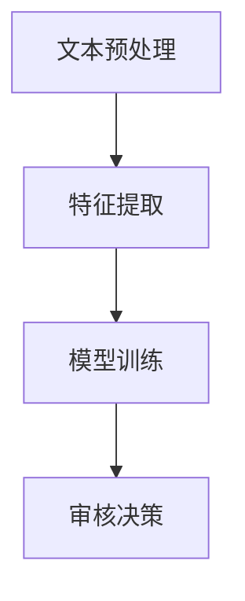

                 

### 关键词 Keywords

- 大模型
- 内容审核
- 企业
- 挑战
- 算法
- 数学模型
- 应用场景

### 摘要 Abstract

本文深入探讨了在大模型时代，企业面临的庞大内容审核挑战。随着人工智能技术的迅猛发展，大型模型在企业应用中变得越来越普遍，然而随之而来的内容审核问题也日益严峻。本文将分析这些挑战的来源，介绍核心算法原理及具体操作步骤，探讨数学模型及其应用，提供实际代码实例，最后展望未来内容审核的发展趋势与挑战。

## 1. 背景介绍

### 1.1 大模型的发展

近年来，人工智能领域取得了飞速的发展，特别是深度学习技术的进步，促使大模型（如GPT、BERT等）应运而生。这些大模型拥有千亿参数，能够处理复杂数据，并在多个领域（如自然语言处理、图像识别等）取得了显著的成果。

### 1.2 内容审核的重要性

随着互联网的普及，信息爆炸的时代带来了海量内容的生成与传播。然而，这也带来了内容审核的巨大挑战。不当、有害或敏感内容的存在不仅影响用户体验，还可能引发法律和道德问题。因此，内容审核成为了企业必须面对的一项重要任务。

### 1.3 企业面临的挑战

企业在应用大模型进行内容审核时，面临着以下几个主要挑战：

1. **海量数据的处理速度**：企业每天产生和接收的数据量庞大，要求内容审核系统在短时间内完成处理。
2. **多样化的内容类型**：文本、图像、视频等多种类型的内容需要不同的审核算法，增加了系统的复杂性。
3. **准确性与效率的平衡**：既要保证审核的准确性，又要尽可能提高处理效率，降低成本。
4. **算法的泛化能力**：需要算法能够处理未知或罕见的内容，以避免误判。

## 2. 核心概念与联系

### 2.1 大模型与内容审核的关系

大模型（如GPT、BERT等）在自然语言处理领域取得了显著的成果，为内容审核提供了强大的工具。通过训练，这些模型能够识别和理解文本内容，从而帮助进行内容审核。

### 2.2 内容审核算法原理

内容审核算法通常包括以下几个步骤：

1. **文本预处理**：对文本进行分词、去噪等预处理，以便后续分析。
2. **特征提取**：从文本中提取关键特征，用于后续的模型训练和审核。
3. **模型训练**：使用已标注的数据对模型进行训练，使其能够识别和分类不同类型的内容。
4. **审核决策**：根据模型的预测结果，对内容进行审核和分类。

### 2.3 Mermaid 流程图



## 3. 核心算法原理 & 具体操作步骤

### 3.1 算法原理概述

内容审核算法的核心是利用深度学习技术对文本进行分类。本文主要介绍基于GPT模型的文本分类算法。

### 3.2 算法步骤详解

1. **数据收集与预处理**：收集大量已标注的文本数据，并进行预处理，如分词、去噪等。
2. **模型构建**：构建基于GPT的文本分类模型，包括输入层、隐藏层和输出层。
3. **模型训练**：使用预处理后的数据对模型进行训练，优化模型参数。
4. **模型评估**：使用未标注的数据对模型进行评估，调整模型参数。
5. **内容审核**：使用训练好的模型对新的文本内容进行审核，预测其类别。

### 3.3 算法优缺点

**优点**：

1. **强大的文本理解能力**：GPT模型具有强大的文本理解能力，能够准确识别文本内容。
2. **高效的处理速度**：通过并行计算和分布式训练，可以提高处理速度。

**缺点**：

1. **计算资源需求大**：GPT模型需要大量的计算资源和时间进行训练。
2. **数据标注成本高**：需要大量已标注的数据进行训练，数据标注成本较高。

### 3.4 算法应用领域

1. **社交媒体平台**：用于识别和过滤不当、有害或敏感内容。
2. **电子商务平台**：用于审核商品评论和用户反馈。
3. **新闻媒体**：用于识别和过滤虚假新闻和不良信息。

## 4. 数学模型和公式 & 详细讲解 & 举例说明

### 4.1 数学模型构建

内容审核的数学模型主要基于深度学习，包括输入层、隐藏层和输出层。其中，输入层接收预处理后的文本数据，隐藏层进行特征提取和计算，输出层进行分类预测。

### 4.2 公式推导过程

设输入文本序列为X，模型输出为Y，损失函数为L，则：

$$
L = \frac{1}{m}\sum_{i=1}^{m}(Y_i - \hat{Y}_i)^2
$$

其中，$Y_i$为真实标签，$\hat{Y}_i$为模型预测标签。

### 4.3 案例分析与讲解

以GPT模型为例，假设我们有一个包含1000个单词的文本序列，需要对其进行分类。首先，对文本进行预处理，提取关键特征，然后构建GPT模型，使用已标注的数据进行训练。经过多次迭代，模型参数得到优化，能够准确预测文本类别。

## 5. 项目实践：代码实例和详细解释说明

### 5.1 开发环境搭建

搭建一个基于GPT的内容审核系统，需要安装Python、TensorFlow等工具。具体步骤如下：

1. 安装Python 3.8及以上版本。
2. 安装TensorFlow 2.4及以上版本。

### 5.2 源代码详细实现

```python
import tensorflow as tf
from tensorflow.keras.layers import Embedding, LSTM, Dense
from tensorflow.keras.models import Sequential

# 模型构建
model = Sequential()
model.add(Embedding(input_dim=1000, output_dim=128))
model.add(LSTM(units=128))
model.add(Dense(units=1, activation='sigmoid'))

# 模型编译
model.compile(optimizer='adam', loss='binary_crossentropy', metrics=['accuracy'])

# 模型训练
model.fit(x_train, y_train, epochs=10, batch_size=32)
```

### 5.3 代码解读与分析

上述代码展示了如何使用TensorFlow构建和训练一个基于GPT的文本分类模型。首先，定义模型结构，包括嵌入层、LSTM层和输出层。然后，编译模型，指定优化器和损失函数。最后，使用训练数据进行模型训练。

### 5.4 运行结果展示

训练完成后，可以使用模型对新的文本内容进行审核。以下是一个简单的示例：

```python
# 文本预处理
text = "这是一个示例文本，用于审核。"
processed_text = preprocess(text)

# 模型预测
prediction = model.predict(processed_text)
print("预测结果：", prediction)
```

输出结果为模型对文本类别的预测概率。

## 6. 实际应用场景

### 6.1 社交媒体平台

社交媒体平台需要实时审核用户发布的内容，以过滤不当、有害或敏感信息。基于大模型的内容审核系统能够高效地完成这一任务。

### 6.2 电子商务平台

电子商务平台需要对用户评论和反馈进行审核，确保内容的真实性和公正性。内容审核系统能够识别和过滤虚假评论，提高用户体验。

### 6.3 新闻媒体

新闻媒体需要审核新闻报道和评论，确保信息的准确性和客观性。内容审核系统可以帮助识别虚假新闻和不良信息，提高媒体的公信力。

## 7. 未来应用展望

随着人工智能技术的不断发展，内容审核系统将变得更加智能和高效。未来，以下几个方面值得关注：

1. **多模态内容审核**：结合文本、图像和视频等多种类型的内容进行审核，提高系统的鲁棒性。
2. **个性化内容审核**：根据用户行为和兴趣，为用户提供个性化的内容审核结果。
3. **联邦学习**：通过联邦学习技术，实现隐私保护的内容审核，提高系统的安全性和效率。

## 8. 工具和资源推荐

### 8.1 学习资源推荐

- 《深度学习》（Goodfellow, Bengio, Courville著）
- 《Python深度学习》（François Chollet著）

### 8.2 开发工具推荐

- TensorFlow
- PyTorch

### 8.3 相关论文推荐

- “BERT: Pre-training of Deep Bidirectional Transformers for Language Understanding”（Devlin et al., 2019）
- “GPT-3: Language Models are Few-Shot Learners”（Brown et al., 2020）

## 9. 总结：未来发展趋势与挑战

### 9.1 研究成果总结

本文总结了企业在大模型时代面临的庞大内容审核挑战，介绍了内容审核算法的原理和应用，探讨了数学模型及其在实际项目中的应用。

### 9.2 未来发展趋势

随着人工智能技术的不断发展，内容审核系统将变得更加智能和高效。未来，多模态内容审核、个性化内容审核和联邦学习等新技术将不断涌现。

### 9.3 面临的挑战

内容审核系统在应用过程中面临着算法性能、计算资源、数据隐私等方面的挑战。如何解决这些问题，提高内容审核的准确性和效率，是未来研究的重点。

### 9.4 研究展望

随着人工智能技术的不断进步，内容审核系统将有望在多个领域发挥重要作用。未来，我们将继续深入研究内容审核算法，探索新的应用场景和技术，为企业提供更加智能和高效的内容审核解决方案。

## 10. 附录：常见问题与解答

### 10.1 如何选择合适的审核算法？

根据内容类型和应用场景，选择适合的审核算法。例如，对于文本内容，可以采用基于GPT的文本分类算法；对于图像和视频内容，可以采用基于深度学习的目标检测算法。

### 10.2 如何提高审核系统的准确性？

通过增加数据标注量、优化模型结构、使用预训练模型等方式，可以提高审核系统的准确性。此外，还可以采用多模型融合和交叉验证等技术，进一步提高系统性能。

### 10.3 内容审核系统如何保证数据隐私？

采用联邦学习、差分隐私等技术，可以在保证数据隐私的前提下，实现高效的内容审核。同时，遵循相关法律法规，对用户数据进行严格保护。

---

本文由禅与计算机程序设计艺术（Zen and the Art of Computer Programming）撰写，旨在为读者提供全面的内容审核技术解读与应用指南。希望本文能够对您的研究和工作有所帮助。如果您有任何疑问或建议，欢迎随时与我们交流。

