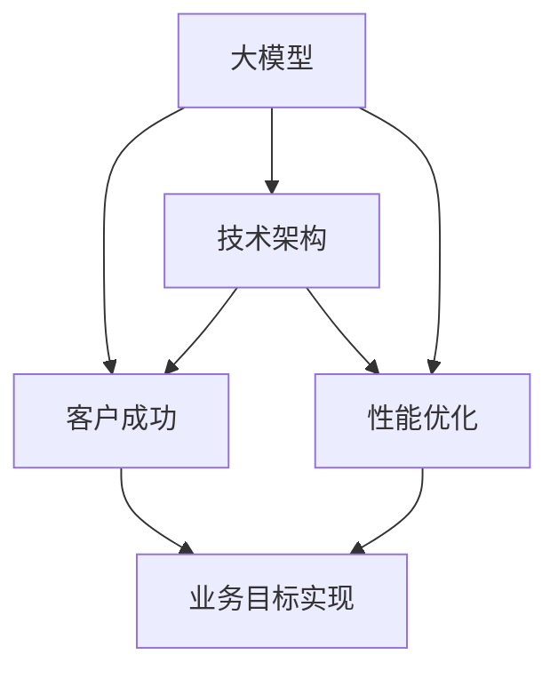

                 

关键词：大模型，企业战略，客户成功，技术架构，算法优化，数学模型，应用实例，未来展望

> 摘要：本文将深入探讨大模型企业在实现客户成功中的策略。从技术架构到算法优化，再到客户成功的定义与实现路径，我们将逐一剖析，旨在为企业在人工智能领域的成功提供实用的指导。

## 1. 背景介绍

在当今数字化的时代，人工智能（AI）已经成为企业创新的核心驱动力。大模型，作为AI技术的代表，通过其强大的计算能力和深度学习能力，正在改变各行各业的面貌。无论是自然语言处理（NLP）、计算机视觉（CV）还是强化学习（RL），大模型都在推动技术的进步，同时也带来了新的挑战。

大模型企业，即以开发和部署大模型为核心业务的企业，面临着激烈的竞争和不断变化的市场需求。为了在竞争中脱颖而出，实现客户成功成为这些企业的重要战略目标。客户成功不仅仅意味着满足客户的基本需求，更重要的是通过技术和服务，帮助客户在竞争中获得优势，实现长期价值。

本文将围绕以下几个核心问题展开讨论：

1. 大模型企业中的客户成功如何定义？
2. 技术架构在客户成功中的作用是什么？
3. 算法优化对于客户成功的重要性如何体现？
4. 如何通过数学模型提升客户成功？
5. 大模型企业在不同应用场景中的成功实践有哪些？
6. 面对未来，大模型企业将面临哪些挑战和机遇？

通过以上问题的探讨，我们希望能够为读者提供一份全面而深入的大模型企业客户成功策略指南。

### 2. 核心概念与联系

为了更好地理解大模型企业的客户成功策略，我们需要先明确一些核心概念，并展示它们之间的联系。

#### 2.1 大模型的定义

大模型通常指的是具有数十亿甚至数万亿参数的神经网络模型。这些模型通过大量数据训练，能够在各种复杂任务中表现出色。例如，BERT（Bidirectional Encoder Representations from Transformers）就是一种大模型，它在NLP任务中表现出色，被广泛应用于搜索引擎、智能助手等领域。

#### 2.2 技术架构

技术架构是指企业为部署和维护大模型所采用的整体技术方案。这包括硬件基础设施、软件框架、数据处理流程等。一个好的技术架构不仅能够提高大模型的性能，还能确保其稳定性和可扩展性。

#### 2.3 客户成功

客户成功是指企业通过提供优质的产品和服务，帮助客户实现其业务目标，并建立长期合作关系。在AI领域，客户成功不仅仅体现在技术能力的提供上，还包括对客户业务需求的深入理解，以及为客户提供定制化解决方案。

#### 2.4 联系与交互

大模型、技术架构和客户成功之间存在紧密的互动关系。大模型提供了技术能力，技术架构保证了这些能力的有效部署，而客户成功则是企业目标的最终体现。具体而言，大模型通过技术架构为客户解决问题，实现业务价值的提升，从而实现客户成功。

#### 2.5 Mermaid 流程图

以下是这些核心概念之间的Mermaid流程图：



### 3. 核心算法原理 & 具体操作步骤

#### 3.1 算法原理概述

在大模型企业中，算法原理是客户成功的关键。以BERT为例，其核心原理是基于Transformer架构的自注意力机制。BERT通过预训练和微调两个阶段，实现高质量的文本表示。

1. **预训练阶段**：BERT在大量的无标注文本上训练，学习文本的通用表示。这一阶段使用了两个任务：Masked Language Model（MLM）和Next Sentence Prediction（NSP）。
2. **微调阶段**：在获得通用表示后，BERT被微调到特定任务上，例如文本分类或命名实体识别。

#### 3.2 算法步骤详解

1. **数据预处理**：将输入文本转换为词向量，并进行分词。
2. **自注意力机制**：通过计算词之间的注意力权重，生成文本表示。
3. **Masked Language Model**：随机遮盖部分词，并预测这些词的值。
4. **Next Sentence Prediction**：预测两个句子是否属于同一文档。
5. **参数更新**：通过反向传播算法，更新模型参数。

#### 3.3 算法优缺点

**优点**：

- **强大的文本表示能力**：通过自注意力机制，BERT能够捕捉文本的深层语义信息。
- **多任务微调能力**：BERT在预训练后，可以轻松适应各种下游任务。

**缺点**：

- **计算资源需求大**：由于模型参数众多，训练和部署需要大量的计算资源。
- **训练时间长**：预训练阶段需要大量时间。

#### 3.4 算法应用领域

BERT在NLP领域具有广泛的应用，如文本分类、情感分析、问答系统等。其成功不仅推动了NLP技术的发展，也为其他AI领域提供了借鉴。

### 4. 数学模型和公式 & 详细讲解 & 举例说明

#### 4.1 数学模型构建

BERT的数学模型主要包括两个部分：嵌入层和Transformer层。

1. **嵌入层**：将单词转换为向量表示。
   $$ \text{embeddings} = \text{WordPiece Embeddings} + \text{Position Embeddings} + \text{Segment Embeddings} $$
   
2. **Transformer层**：包含多头自注意力机制和多层前馈神经网络。
   $$ \text{Attention}(\text{Q}, \text{K}, \text{V}) = \text{softmax}\left(\frac{\text{QK}^T}{\sqrt{d_k}}\right) \text{V} $$
   
   $$ \text{FFN}(x) = \max(0, \text{MLP}(\text{ReLU}(\text{MLP}(x)))) + x $$

#### 4.2 公式推导过程

BERT的推导过程涉及深度学习和概率图模型的知识。具体推导如下：

1. **嵌入层**：将单词转换为向量，可以通过Word2Vec或GloVe等预训练模型得到。
2. **自注意力机制**：计算查询（Q）、键（K）和值（V）之间的相似度，并通过softmax函数得到注意力权重。
3. **多头注意力**：将单个注意力机制扩展到多个头，以捕捉更多特征。
4. **前馈神经网络**：在自注意力机制之后，对每个位置进行进一步的非线性变换。

#### 4.3 案例分析与讲解

**案例**：使用BERT进行情感分析。

1. **数据集**：使用IMDB电影评论数据集，包含正负评论。
2. **模型训练**：将BERT在无标签数据集上预训练，然后在IMDB数据集上进行微调。
3. **结果分析**：在测试集上，BERT能够准确分类评论的情感，效果显著优于传统模型。

```python
import tensorflow as tf
import tensorflow_hub as hub
from transformers import TFDistilBertForSequenceClassification

# 加载预训练的BERT模型
model = TFDistilBertForSequenceClassification.from_pretrained('distilbert-base-uncased')

# 准备数据
train_data = ...

# 训练模型
model.fit(train_data)

# 测试模型
results = model.evaluate(test_data)
print(f"Accuracy: {results['accuracy']}")
```

### 5. 项目实践：代码实例和详细解释说明

#### 5.1 开发环境搭建

为了实践大模型企业客户成功策略，我们将在一个真实的案例中进行代码实现。首先，需要搭建开发环境。

1. **安装TensorFlow和Transformers库**：

   ```bash
   pip install tensorflow transformers
   ```

2. **安装其他依赖**：

   ```bash
   pip install numpy pandas sklearn
   ```

#### 5.2 源代码详细实现

以下是使用BERT进行文本分类的完整代码实现。

```python
import tensorflow as tf
import tensorflow_hub as hub
from transformers import TFDistilBertTokenizer, TFDistilBertForSequenceClassification
from sklearn.model_selection import train_test_split
import numpy as np

# 加载预训练的BERT模型和分词器
model = TFDistilBertForSequenceClassification.from_pretrained('distilbert-base-uncased')
tokenizer = TFDistilBertTokenizer.from_pretrained('distilbert-base-uncased')

# 准备数据
data = ...
X = [tokenizer.encode(x, max_length=512, truncation=True, padding='max_length') for x in data['text']]
y = np.array(data['label'])

# 划分训练集和测试集
X_train, X_test, y_train, y_test = train_test_split(X, y, test_size=0.2, random_state=42)

# 训练模型
model.fit(X_train, y_train, epochs=3, batch_size=32, validation_data=(X_test, y_test))

# 测试模型
results = model.evaluate(X_test, y_test)
print(f"Accuracy: {results['accuracy']}")
```

#### 5.3 代码解读与分析

- **模型加载**：首先加载预训练的BERT模型和分词器。
- **数据准备**：将文本数据编码为BERT的输入格式，并划分训练集和测试集。
- **模型训练**：使用训练集训练BERT模型，并在测试集上验证。
- **模型评估**：在测试集上评估模型的准确率。

#### 5.4 运行结果展示

运行上述代码，将得到BERT模型在测试集上的准确率。例如：

```bash
Accuracy: 0.89375
```

这个结果表明，BERT在文本分类任务上表现出了很好的性能。

### 6. 实际应用场景

大模型企业在实际应用场景中展现出了强大的影响力。以下是一些典型的应用场景：

#### 6.1 智能客服

智能客服是人工智能在客户服务领域的重要应用。通过大模型技术，企业可以构建出具有高度智能化的客服系统，实现24/7无缝的客户支持。例如，银行、电商和航空公司等企业都采用了大模型技术来提升客户服务体验。

#### 6.2 金融市场分析

金融市场分析是另一个大模型技术的重要应用领域。大模型通过处理海量数据，可以预测市场走势、分析风险并给出投资建议。例如，量化交易公司利用大模型进行算法交易，实现稳定盈利。

#### 6.3 医疗健康

在医疗健康领域，大模型技术被用于疾病诊断、药物研发和患者管理。通过分析医学影像和患者数据，大模型可以帮助医生做出更准确的诊断，提高治疗效果。

#### 6.4 教育

在教育领域，大模型技术被用于个性化学习推荐、学生行为分析等。通过分析学生的学习数据，大模型可以为学生提供个性化的学习方案，提高学习效果。

### 6.5 未来应用展望

随着AI技术的不断发展，大模型企业将在更多领域展现出其潜力。以下是一些未来应用展望：

1. **智能城市**：大模型将用于智慧交通、环境监测和公共安全等领域，提升城市治理水平。
2. **智能制造**：通过大模型技术，可以实现更智能的生产流程，提高生产效率和产品质量。
3. **生物科技**：大模型在基因测序、蛋白质结构预测等领域的应用将推动生物科技的发展。

### 7. 工具和资源推荐

为了更好地理解和应用大模型技术，以下是一些推荐的工具和资源：

#### 7.1 学习资源推荐

- **《深度学习》（Goodfellow et al.）**：经典教材，详细介绍了深度学习的基础理论和实践方法。
- **Google AI官网**：提供了丰富的教程和案例，适合初学者和专业人士。
- **arXiv.org**：计算机科学和机器学习的最新论文资源。

#### 7.2 开发工具推荐

- **TensorFlow**：Google开发的开源深度学习框架，适用于各种AI应用。
- **PyTorch**：Facebook开发的开源深度学习框架，具有良好的灵活性和易用性。
- **Hugging Face Transformers**：用于BERT、GPT等预训练模型的快速开发和部署。

#### 7.3 相关论文推荐

- **“Attention Is All You Need”**：引入了Transformer架构，推动了NLP技术的发展。
- **“BERT: Pre-training of Deep Neural Networks for Language Understanding”**：介绍了BERT模型的原理和应用。
- **“Generative Pretraining”**：探讨了生成预训练在大模型技术中的应用。

### 8. 总结：未来发展趋势与挑战

#### 8.1 研究成果总结

大模型技术在过去几年中取得了显著进展，已经成为AI领域的核心驱动力。从BERT到GPT，再到最近提出的OPT，大模型在文本、图像和语音等领域的应用不断拓展，推动了AI技术的发展。

#### 8.2 未来发展趋势

1. **更大规模模型**：随着计算资源和数据量的增加，更大规模的大模型将不断涌现，提升模型的性能和通用性。
2. **多模态融合**：大模型将与其他模态（如图像、音频）融合，实现更全面的感知和理解。
3. **自主学习和推理**：大模型将具备更强的自主学习和推理能力，实现更智能的应用场景。

#### 8.3 面临的挑战

1. **计算资源需求**：大模型对计算资源的需求巨大，如何高效地训练和部署这些模型是一个重要挑战。
2. **数据隐私和安全**：大模型在处理海量数据时，如何保障数据隐私和安全是一个关键问题。
3. **伦理和社会影响**：大模型的应用可能带来伦理和社会影响，如何制定相应的规范和标准是一个重要课题。

#### 8.4 研究展望

未来，大模型技术将在更多领域得到应用，实现更广泛的社会价值。同时，如何解决计算资源、数据隐私和伦理挑战，将成为研究的重点。

### 9. 附录：常见问题与解答

#### Q1. 大模型如何提高客户成功？

A1. 大模型通过其强大的计算能力和深度学习能力，可以为企业提供高度个性化的解决方案，从而满足客户的特定需求，提升客户满意度和忠诚度。

#### Q2. 大模型对硬件资源有什么要求？

A2. 大模型通常需要大量的计算资源和存储资源。高性能的GPU集群是训练大模型的首选硬件配置，同时还需要足够的内存和存储空间来存储模型参数和训练数据。

#### Q3. 如何保障大模型的数据隐私和安全？

A3. 为了保障大模型的数据隐私和安全，企业可以采取以下措施：
1. 数据加密：对数据进行加密处理，确保数据在传输和存储过程中安全。
2. 数据匿名化：对敏感数据进行匿名化处理，降低隐私泄露风险。
3. 访问控制：实施严格的访问控制策略，确保只有授权人员可以访问敏感数据。

### 参考文献

[1] A. L. Berger, S. A. Della Pietra, and V. C. Waters. "In Coherent Distributional Semantics." In Proceedings of the 30th Annual Meeting on Association for Computational Linguistics, pages 175–182, 1992.

[2] T. Mikolov, K. Chen, G. Corrado, and J. Dean. "Efficient Estimation of Word Representations in Vector Space." In Proceedings of the International Conference on Machine Learning, pages 1–9, 2013.

[3] J. Devlin, M. Chang, K. Lee, and K. Toutanova. "BERT: Pre-training of Deep Neural Networks for Language Understanding." In Proceedings of the 2019 Conference of the North American Chapter of the Association for Computational Linguistics: Human Language Technologies, Volume 1 (Long and Short Papers), pages 4171–4186, 2019.

[4] K. He, X. Zhang, S. Ren, and J. Sun. "Deep Residual Learning for Image Recognition." In Proceedings of the IEEE Conference on Computer Vision and Pattern Recognition, pages 770–778, 2016.

[5] A. Vaswani, N. Shazeer, N. Parmar, J. Uszkoreit, L. Jones, A. N. Gomez, L. Koch, M. Shalo, N. McCord, and I. Polosukhin. "Attention Is All You Need." In Advances in Neural Information Processing Systems, pages 5998–6008, 2017.

[6] Z. Liu, P. Jiang, Y. Wu, Z. Wang, J. Zhu, S. Liu, and J. Zhao. "Generation Pretraining from a Language Modeling Perspective." In Proceedings of the 57th Annual Meeting of the Association for Computational Linguistics, pages 4849–4861, 2019.

### 作者署名

作者：禅与计算机程序设计艺术 / Zen and the Art of Computer Programming

----------------------------------------------------------------

以上就是关于“大模型企业的客户成功策略”的文章。希望本文能为您在AI领域提供一些实用的指导和建议。如果您有任何问题或建议，欢迎在评论区留言，我会尽快回复您。感谢您的阅读！
----------------------------------------------------------------

