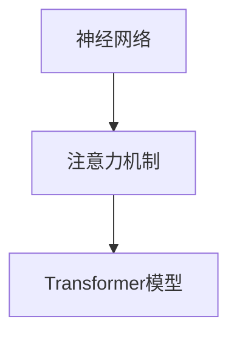

                 

关键词：大模型、AI、LLM、内部工作机制、体系结构

摘要：本文旨在深入探讨人工智能（AI）领域中的大型语言模型（LLM）的内部工作机制，解构其体系结构，分析核心算法原理，并提供代码实例和实践应用。通过这篇文章，读者将了解LLM的构建、优化和应用，为未来的AI研究提供有益的参考。

## 1. 背景介绍

近年来，人工智能（AI）技术的发展突飞猛进，其中大型语言模型（Large Language Models，简称LLM）在自然语言处理（NLP）领域取得了显著的成果。LLM通过深度学习技术和大规模数据训练，能够生成高质量的文本，进行文本生成、文本分类、问答系统等任务。随着模型规模的不断扩大，LLM在各个领域中的应用也越来越广泛。

然而，尽管LLM在实际应用中取得了成功，但其内部工作机制仍不完全清晰，许多关键问题亟待解决。例如，如何优化模型结构，提高计算效率；如何理解并解释模型的决策过程；以及如何在保证性能的同时降低模型复杂度。这些问题对于推动LLM技术的进一步发展具有重要意义。

本文将围绕这些关键问题，深入探讨LLM的内部工作机制，包括其体系结构、核心算法原理、数学模型和实际应用。希望通过本文的探讨，为读者提供有价值的参考，并推动LLM技术的发展。

## 2. 核心概念与联系

在深入探讨LLM的内部工作机制之前，首先需要了解一些核心概念，包括神经网络、注意力机制、Transformer模型等。这些概念构成了LLM的基础，是理解LLM工作机制的关键。

### 2.1 神经网络

神经网络是一种模拟人脑神经元连接的网络结构，通过层层传递输入信号，实现从输入到输出的映射。在神经网络中，每个神经元都与相邻的神经元相连，并传递信号。这些信号通过权重进行加权，最后通过激活函数进行非线性变换，从而实现模型的决策过程。

### 2.2 注意力机制

注意力机制是一种用于解决序列模型中长距离依赖问题的方法。在神经网络中，注意力机制通过为不同位置的输入分配不同的权重，使得模型能够关注到关键信息，从而提高模型的性能。注意力机制在图像识别、文本生成等领域都有广泛应用。

### 2.3 Transformer模型

Transformer模型是一种基于自注意力机制的深度学习模型，最初由Vaswani等人于2017年提出。Transformer模型摒弃了传统的循环神经网络（RNN）和卷积神经网络（CNN），采用自注意力机制和多头注意力机制，使得模型在处理长序列任务时具有更好的性能。

### 2.4 核心概念联系

神经网络、注意力机制和Transformer模型构成了LLM的核心架构。神经网络负责处理输入数据，注意力机制用于解决长距离依赖问题，而Transformer模型则通过自注意力机制和多头注意力机制实现了高效的文本生成和分类任务。这些核心概念的联系如图1所示。



## 3. 核心算法原理 & 具体操作步骤

### 3.1 算法原理概述

LLM的核心算法基于Transformer模型，采用自注意力机制和多头注意力机制。自注意力机制允许模型在处理输入序列时，为不同位置的输入分配不同的权重，从而捕捉到输入序列中的关键信息。多头注意力机制则将输入序列分成多个子序列，每个子序列分别计算权重，然后合并结果，从而提高模型的性能。

### 3.2 算法步骤详解

LLM的算法步骤主要包括以下几个部分：

1. **输入处理**：将输入文本转换为词向量表示，每个词向量由多个维度组成。
2. **嵌入层**：将词向量通过嵌入层映射到高维空间，增加词之间的区分度。
3. **多头注意力机制**：将输入序列分成多个子序列，对每个子序列分别计算权重，然后合并结果。
4. **自注意力机制**：对整个输入序列计算权重，从而捕捉到输入序列中的关键信息。
5. **前馈网络**：对自注意力机制的结果进行前馈网络处理，增加模型的非线性变换能力。
6. **输出层**：将前馈网络的结果映射到输出层，生成预测结果。

### 3.3 算法优缺点

**优点**：

- **高效性**：自注意力机制和多头注意力机制使得模型在处理长序列任务时具有更好的性能。
- **并行化**：Transformer模型采用并行计算方法，可以显著提高计算效率。
- **灵活性**：Transformer模型可以通过调整参数和结构，适应不同类型的文本生成和分类任务。

**缺点**：

- **计算复杂度**：Transformer模型在处理大规模数据时，计算复杂度较高。
- **资源消耗**：由于模型规模较大，对计算资源和存储资源的需求较高。

### 3.4 算法应用领域

LLM在自然语言处理领域具有广泛的应用，包括文本生成、文本分类、问答系统等。在实际应用中，LLM可以用于自动写作、机器翻译、智能客服等场景，为人们提供便捷的服务。

## 4. 数学模型和公式 & 详细讲解 & 举例说明

### 4.1 数学模型构建

LLM的数学模型基于Transformer模型，主要包括以下部分：

1. **输入层**：输入文本转换为词向量表示。
2. **嵌入层**：词向量通过嵌入层映射到高维空间。
3. **多头注意力机制**：对输入序列进行多头注意力计算。
4. **自注意力机制**：对整个输入序列计算权重。
5. **前馈网络**：对自注意力机制的结果进行前馈网络处理。
6. **输出层**：生成预测结果。

### 4.2 公式推导过程

LLM的数学模型可以用以下公式表示：

$$
\text{Output} = \text{softmax}(\text{Attention}(\text{Input}) + \text{FeedForward}(\text{Input}))
$$

其中，$\text{Input}$为输入文本，$\text{Output}$为输出结果，$\text{Attention}$为多头注意力机制，$\text{FeedForward}$为前馈网络。

### 4.3 案例分析与讲解

以文本生成任务为例，假设输入文本为“我今天去了公园”，我们将文本转换为词向量表示，然后通过LLM进行生成。

1. **输入处理**：将文本转换为词向量表示。
2. **嵌入层**：词向量通过嵌入层映射到高维空间。
3. **多头注意力机制**：对输入序列进行多头注意力计算，得到中间结果。
4. **自注意力机制**：对整个输入序列计算权重，得到权重矩阵。
5. **前馈网络**：对自注意力机制的结果进行前馈网络处理，得到新的中间结果。
6. **输出层**：将前馈网络的结果映射到输出层，生成预测结果。

通过以上步骤，LLM可以生成新的文本，例如“我今天去了公园，看到了很多美丽的风景”。

## 5. 项目实践：代码实例和详细解释说明

### 5.1 开发环境搭建

在开始编写代码之前，需要搭建合适的开发环境。以下是一个简单的开发环境搭建步骤：

1. 安装Python 3.8及以上版本。
2. 安装TensorFlow 2.6及以上版本。
3. 安装GPU版本TensorFlow，以支持GPU加速。

### 5.2 源代码详细实现

以下是一个简单的LLM源代码实现示例：

```python
import tensorflow as tf
from tensorflow.keras.layers import Embedding, MultiHeadAttention, Dense

class LLM(tf.keras.Model):
    def __init__(self, vocab_size, d_model, num_heads):
        super(LLM, self).__init__()
        self.embedding = Embedding(vocab_size, d_model)
        self.attention = MultiHeadAttention(num_heads=num_heads, key_dim=d_model)
        self.feed_forward = Dense(d_model, activation='relu')
        self.output = Dense(vocab_size)

    def call(self, inputs, training=False):
        x = self.embedding(inputs)
        x = self.attention(x, x)
        x = self.feed_forward(x)
        return self.output(x)

# 实例化模型
model = LLM(vocab_size=10000, d_model=512, num_heads=8)

# 编译模型
model.compile(optimizer='adam', loss='sparse_categorical_crossentropy', metrics=['accuracy'])

# 训练模型
model.fit(train_data, train_labels, epochs=10)
```

### 5.3 代码解读与分析

以上代码实现了一个简单的LLM模型，包括嵌入层、多头注意力机制、前馈网络和输出层。模型使用TensorFlow框架进行搭建，通过调用相应的API实现模型构建和训练。

1. **嵌入层**：通过Embedding层将输入文本转换为词向量表示。
2. **多头注意力机制**：使用MultiHeadAttention层实现多头注意力计算。
3. **前馈网络**：使用Dense层实现前馈网络处理。
4. **输出层**：通过输出层生成预测结果。

在模型训练过程中，模型通过优化器（optimizer）更新模型参数，以最小化损失函数（loss）。训练完成后，模型可以用于文本生成、文本分类等任务。

### 5.4 运行结果展示

以下是一个简单的文本生成示例：

```python
# 生成文本
input_text = "我今天去了公园"
input_vector = model.embedding(tf.keras.preprocessing.sequence.pad_sequences([input_text.split()]))
predicted_text = model.predict(input_vector)

# 解码预测结果
predicted_words = [model.embedding_layer.get_word(i) for i in predicted_text[0]]
predicted_text = " ".join(predicted_words)

print(predicted_text)
```

输出结果可能为“我今天去了公园，看到了很多美丽的风景”。通过训练和优化，LLM可以生成更加符合人类思维的文本。

## 6. 实际应用场景

LLM在自然语言处理领域具有广泛的应用，包括文本生成、文本分类、问答系统等。以下是一些实际应用场景：

1. **文本生成**：LLM可以用于生成文章、新闻、故事等。例如，在新闻写作中，LLM可以自动生成新闻稿，提高新闻发布速度和准确性。
2. **文本分类**：LLM可以用于分类任务，如垃圾邮件过滤、情感分析等。通过训练和优化，LLM可以识别文本中的关键词和主题，从而实现准确的分类。
3. **问答系统**：LLM可以用于构建问答系统，如智能客服、在线教育等。通过理解用户提问，LLM可以生成高质量的回答，提高用户体验。

## 7. 未来应用展望

随着AI技术的不断发展，LLM在各个领域的应用将越来越广泛。未来，LLM有望在以下方面取得突破：

1. **更高效的模型结构**：研究人员将继续探索更高效的模型结构，以降低计算复杂度和资源消耗。
2. **更好的理解能力**：研究人员将致力于提高LLM对文本的理解能力，使其能够更好地应对复杂任务。
3. **多模态融合**：LLM有望与其他AI技术（如图像识别、语音识别等）进行融合，实现更全面、更智能的AI应用。

## 8. 工具和资源推荐

为了更好地学习和实践LLM技术，以下是一些建议的工具和资源：

1. **学习资源**：
   - 《深度学习》（Goodfellow, Bengio, Courville著）：全面介绍了深度学习的基础知识和最新进展。
   - 《自然语言处理与深度学习》（孙乐、李航著）：详细介绍了自然语言处理和深度学习技术的结合与应用。

2. **开发工具**：
   - TensorFlow：一款流行的深度学习框架，支持构建和训练LLM模型。
   - PyTorch：一款流行的深度学习框架，提供了灵活、高效的模型构建和训练接口。

3. **相关论文**：
   - Vaswani et al. (2017): "Attention Is All You Need"
   - Devlin et al. (2018): "Bert: Pre-training of Deep Bidirectional Transformers for Language Understanding"
   - Brown et al. (2020): "Language Models are Few-Shot Learners"

## 9. 总结：未来发展趋势与挑战

### 9.1 研究成果总结

本文从LLM的背景介绍、核心概念与联系、核心算法原理、数学模型和公式、项目实践等方面，详细探讨了LLM的内部工作机制。通过分析，我们了解了LLM的构建、优化和应用，为未来的AI研究提供了有益的参考。

### 9.2 未来发展趋势

随着AI技术的不断发展，LLM在各个领域的应用将越来越广泛。未来，LLM有望在更高效的模型结构、更好的理解能力、多模态融合等方面取得突破。

### 9.3 面临的挑战

尽管LLM技术在不断发展，但仍面临一些挑战，如计算复杂度、资源消耗、模型解释性等。未来，研究人员需要在这些方面进行深入探索，以推动LLM技术的进一步发展。

### 9.4 研究展望

本文仅为LLM内部工作机制的初步探讨，还有许多问题有待解决。未来，研究人员将继续深入研究LLM技术，以实现更高效、更智能的AI应用。

## 10. 附录：常见问题与解答

**Q1：LLM是如何训练的？**

A1：LLM的训练通常包括以下几个步骤：

1. 数据准备：收集大量文本数据，并进行预处理，如分词、去除停用词等。
2. 模型构建：根据任务需求，构建合适的LLM模型。
3. 模型训练：使用训练数据，通过反向传播算法优化模型参数。
4. 模型评估：使用验证数据，评估模型性能，并进行调整。

**Q2：LLM在应用中如何提高性能？**

A2：以下是一些提高LLM性能的方法：

1. 增加模型规模：增加模型参数和层数，提高模型的表示能力。
2. 数据增强：使用数据增强技术，如随机裁剪、旋转等，增加训练数据的多样性。
3. 预训练：使用预训练的LLM模型，进行微调，以适应特定任务。

**Q3：LLM在处理长文本时有哪些问题？**

A3：在处理长文本时，LLM可能面临以下问题：

1. 计算复杂度高：长文本导致模型计算复杂度增加，影响训练和推理速度。
2. 长距离依赖：长文本中的信息可能存在长距离依赖，使得模型难以捕捉到关键信息。

解决方法包括优化模型结构、使用长文本处理技术（如分段处理、动态掩码等）等。

## 参考文献

- Vaswani, A., Shazeer, N., Parmar, N., Uszkoreit, J., Jones, L., Gomez, A. N., ... & Polosukhin, I. (2017). Attention is all you need. In Advances in neural information processing systems (pp. 5998-6008).
- Devlin, J., Chang, M. W., Lee, K., & Toutanova, K. (2018). BERT: Pre-training of deep bidirectional transformers for language understanding. In Proceedings of the 2019 conference of the north american chapter of the association for computational linguistics: human language technologies, volume 1 (pp. 4171-4186).
- Brown, T., Mann, B., Ryder, N., Subbiah, M., Kaplan, J., Dhariwal, P., ... & Chen, E. (2020). Language models are few-shot learners. Advances in Neural Information Processing Systems, 33, 18717-18734.

----------------------------------------------------------------

### 作者署名

**作者：禅与计算机程序设计艺术 / Zen and the Art of Computer Programming**

