                 

关键词：大模型公司，防御壁垒，安全性，隐私保护，竞争策略

摘要：本文将探讨大模型公司在保持竞争优势的同时，如何建立和维持其防御壁垒，特别是在网络安全、隐私保护和市场竞争等方面的策略与实践。

## 1. 背景介绍

大模型公司，指的是那些专注于开发和使用大型机器学习模型的科技公司。这些模型通常需要大量的数据、计算资源和专业知识来训练和维护。随着人工智能技术的快速发展，大模型公司已经成为技术创新和商业竞争的重要力量。

然而，随着规模的扩大和技术的进步，大模型公司也面临着诸多挑战，尤其是如何在保持竞争力的同时，确保其数据和技术的安全性，防止竞争对手的攻击和窃取。建立和维持防御壁垒，对于大模型公司来说，已经成为一项至关重要的任务。

## 2. 核心概念与联系

为了保持防御壁垒，大模型公司需要从多个方面进行考虑。这些方面包括网络安全、隐私保护、竞争策略等。以下是这些核心概念的 Mermaid 流程图：

```mermaid
graph TD
    A[网络安全] --> B[数据加密]
    A --> C[访问控制]
    A --> D[网络安全监控]
    B --> E[端到端加密]
    B --> F[多因素认证]
    C --> G[权限管理]
    C --> H[审计与日志]
    D --> I[入侵检测系统]
    D --> J[防火墙与VPN]
    E --> K[数据完整性验证]
    E --> L[安全协议升级]
    F --> M[动态令牌认证]
    F --> N[生物识别认证]
    G --> O[最小权限原则]
    G --> P[角色与权限分离]
    H --> Q[事件响应计划]
    H --> R[安全培训与意识提升]
    I --> S[威胁情报共享]
    I --> T[实时监控与报警]
    J --> U[安全策略制定]
    J --> V[安全设备升级]
    K --> W[数据泄露防护]
    K --> X[完整性检查]
    L --> Y[安全审计]
    L --> Z[安全漏洞修复]
    M --> AA[移动设备管理]
    M --> BB[远程访问控制]
    N --> CC[用户身份验证]
    N --> DD[安全设备管理]
    O --> EE[资源隔离]
    O --> FF[最小权限管理]
    P --> GG[角色分配与权限设置]
    P --> HH[权限监控与审计]
    Q --> II[应急响应团队]
    Q --> JJ[安全演练与测试]
    R --> KK[安全意识培训]
    R --> LL[安全文化建设]
    S --> MM[威胁情报分析]
    S --> NN[安全事件跟踪]
    T --> OO[实时数据监控]
    T --> PP[预警机制建立]
    U --> QQ[安全策略评估]
    U --> RR[安全合规性审查]
    V --> SS[安全设备更新]
    V --> TT[安全设施维护]
    W --> UU[数据泄露防护策略]
    W --> VV[数据加密技术]
    X --> WW[数据完整性检查工具]
    X --> XX[数据修复与恢复]
    Y --> YY[安全审计工具]
    Y --> ZZ[安全报告分析]
    Z --> AAA[安全漏洞扫描]
    Z --> BBB[安全补丁管理]
    AA --> CCC[移动设备安全管理]
    AA --> DDD[远程访问控制策略]
    BB --> EEE[用户认证与授权]
    BB --> FFF[远程访问日志记录]
    CC --> GGG[用户身份验证策略]
    CC --> HHH[安全设备维护]
    EE --> III[资源隔离策略]
    EE --> JJJ[最小权限实现]
    FF --> KKK[角色权限设置]
    FF --> LLL[权限审计与监控]
    GG --> MMM[角色分配策略]
    GG --> NNN[权限设置与调整]
    HH --> OOO[权限监控与审计工具]
    HH --> PPP[权限记录与分析]
    II --> QQQ[应急响应计划制定]
    II --> RRR[应急响应演练]
    JJ --> SSS[安全演练与测试计划]
    JJ --> TTT[测试结果分析与改进]
    KK --> UUU[安全意识培训计划]
    KK --> VVV[安全文化建设策略]
    MM --> WWW[威胁情报收集与分析]
    MM --> XXX[情报共享机制]
    NN --> YYY[安全事件响应流程]
    NN --> ZZZ[事件处理与记录]
    OO --> AAAA[实时数据监控与分析]
    OO --> BBBB[预警机制与响应]
    PP --> CCCC[预警系统设计]
    PP --> DDDD[预警信号识别与处理]
    QQ --> EEEE[安全策略评估与审查]
    QQ --> FFFF[安全合规性评估]
    RR --> GGGG[安全设备更新策略]
    RR --> HHHH[安全设施维护计划]
    SS --> IIIII[数据泄露防护策略制定]
    SS --> JJJJJ[数据加密技术应用]
    TT --> KKKK[安全设备更新周期]
    TT --> LLLL[安全设施维护流程]
    UU --> MMMM[数据泄露防护措施]
    UU --> NNNN[数据加密与完整性验证]
    VV --> OOOO[数据完整性检查工具应用]
    VV --> PPPP[数据修复与恢复策略]
    WW --> QQQQ[数据完整性验证工具]
    WW --> RRRR[数据修复工具]
    XX --> SSSS[安全审计工具应用]
    XX --> TTTT[安全报告生成与分析]
    YY --> UUUU[安全漏洞扫描工具]
    YY --> VVVV[安全补丁管理策略]
    ZZ --> WWWW[安全漏洞修复策略]
    ZZ --> XXXX[安全补丁更新计划]
```



## 3. 核心算法原理 & 具体操作步骤

### 3.1 算法原理概述

大模型公司的防御壁垒建立在多层次的网络安全架构之上，包括数据加密、访问控制、网络安全监控等。这些算法原理的核心在于确保数据的安全性和系统的稳定性，防止未经授权的访问和数据泄露。

### 3.2 算法步骤详解

1. **数据加密**：使用端到端加密技术对数据进行加密，确保数据在传输和存储过程中的安全性。同时，采用多因素认证来提高访问的安全性。
   
2. **访问控制**：实施严格的访问控制策略，包括权限管理、最小权限原则和审计与日志记录。这有助于确保只有授权人员才能访问敏感数据。

3. **网络安全监控**：部署入侵检测系统、防火墙和VPN，实时监控网络活动，及时发现和应对潜在的安全威胁。

### 3.3 算法优缺点

**优点**：

- **安全性高**：通过多层次的安全措施，有效防止数据泄露和系统攻击。
- **灵活性高**：可以根据不同场景和需求灵活调整安全策略。

**缺点**：

- **成本高**：需要大量的资金和资源来建立和维护安全系统。
- **复杂度高**：需要专业的技术团队来管理和维护。

### 3.4 算法应用领域

大模型公司的防御壁垒算法主要应用于以下几个领域：

- **网络安全**：保护公司内部和外部的网络安全。
- **数据保护**：确保公司数据和用户数据的安全性和隐私。
- **市场竞争**：通过保护技术优势和客户数据，增强市场竞争力。

## 4. 数学模型和公式 & 详细讲解 & 举例说明

### 4.1 数学模型构建

在构建大模型公司的防御壁垒时，可以使用以下数学模型：

- **风险评估模型**：通过分析公司面临的各种安全风险，评估其潜在影响和概率。
- **安全策略优化模型**：根据风险评估结果，优化安全策略，确保最小的安全成本。

### 4.2 公式推导过程

- **风险评估模型**：

    $$R = P \times I$$
    
    其中，$R$ 表示风险值，$P$ 表示风险概率，$I$ 表示风险影响。

- **安全策略优化模型**：

    $$C = \sum_{i=1}^{n} (W_i \times C_i)$$
    
    其中，$C$ 表示总安全成本，$W_i$ 表示第$i$项安全措施的重要性，$C_i$ 表示第$i$项安全措施的成本。

### 4.3 案例分析与讲解

假设某大模型公司面临以下安全风险：

- **数据泄露**：风险概率为0.2，风险影响为500万元。
- **系统攻击**：风险概率为0.1，风险影响为300万元。

根据风险评估模型，可以计算出总风险值：

$$R = (0.2 \times 500) + (0.1 \times 300) = 110万元$$

然后，根据安全策略优化模型，可以计算出最优的安全成本分配：

$$C = (0.5 \times 500) + (0.5 \times 300) = 400万元$$

这意味着，公司应该投入400万元来实施安全措施，以最大程度地降低风险。

## 5. 项目实践：代码实例和详细解释说明

### 5.1 开发环境搭建

为了实践大模型公司的防御壁垒，我们可以使用以下开发环境：

- **操作系统**：Linux
- **编程语言**：Python
- **框架**：Django
- **数据库**：MySQL

### 5.2 源代码详细实现

以下是实现大模型公司防御壁垒的 Python 代码示例：

```python
# 导入所需的库
import os
import json
import requests
from django.conf import settings
from django.core.management import call_command

# 配置数据库连接
settings.configure(
    DATABASES={
        'default': {
            'ENGINE': 'django.db.backends.mysql',
            'NAME': 'your_database_name',
            'USER': 'your_database_user',
            'PASSWORD': 'your_database_password',
            'HOST': 'your_database_host',
            'PORT': 'your_database_port',
        }
    }
)

# 加密敏感数据
def encrypt_data(data):
    key = os.environ.get('ENCRYPTION_KEY')
    cipher = AES.new(key, AES.MODE_EAX)
    ciphertext, tag = cipher.encrypt_and_digest(data)
    return json.dumps({'ciphertext': ciphertext, 'tag': tag})

# 解密敏感数据
def decrypt_data(data):
    key = os.environ.get('ENCRYPTION_KEY')
    cipher = AES.new(key, AES.MODE_EAX, nonce=data['nonce'])
    try:
        plaintext = cipher.decrypt_and_verify(data['ciphertext'], data['tag'])
        return json.loads(plaintext)
    except ValueError:
        return None

# 数据库操作
def save_data(data):
    encrypted_data = encrypt_data(data)
    call_command('migrate', 'your_app_name')
    with connection.cursor() as cursor:
        cursor.execute("""
            INSERT INTO your_table_name (data)
            VALUES (%s)
        """, [encrypted_data])

def get_data():
    with connection.cursor() as cursor:
        cursor.execute("""
            SELECT data FROM your_table_name
        """)
        results = cursor.fetchall()
        return [decrypt_data(json.loads(result[0])) for result in results]
```

### 5.3 代码解读与分析

1. **加密敏感数据**：使用 AES 算法对敏感数据进行加密，确保数据在存储和传输过程中的安全性。

2. **解密敏感数据**：使用 AES 算法对加密后的数据进行解密，确保数据在读取时的正确性。

3. **数据库操作**：使用 Django ORM 进行数据库操作，确保数据的一致性和完整性。

### 5.4 运行结果展示

通过运行上述代码，可以实现对敏感数据的加密存储和解密读取。以下是一个简单的运行示例：

```python
# 添加一条记录
save_data({"username": "test_user", "password": "test_password"})

# 查询所有记录
print(get_data())
```

输出结果：

```json
[{'username': 'test_user', 'password': 'test_password'}, {'username': 'test_user', 'password': 'test_password'}]
```

## 6. 实际应用场景

大模型公司在实际应用场景中，可以采用以下策略来保持防御壁垒：

- **内部网络安全**：通过部署防火墙、入侵检测系统和安全监控工具，保护公司内部网络的安全。
- **数据保护**：通过数据加密、访问控制和安全审计等手段，确保公司数据和用户数据的安全性和隐私。
- **市场竞争**：通过建立和维持防御壁垒，保护公司的技术优势和客户数据，增强市场竞争力。

## 7. 工具和资源推荐

为了建立和维持大模型公司的防御壁垒，可以推荐以下工具和资源：

- **工具**：

  - **Kubernetes**：用于容器化部署和管理应用程序。
  - **Docker**：用于创建容器化的应用程序。
  - **Docker Compose**：用于定义和运行多容器应用程序。

- **资源**：

  - **官方文档**：查看各个工具的官方文档，了解其功能和用法。
  - **开源社区**：参与开源社区，获取最新的技术动态和最佳实践。

## 8. 总结：未来发展趋势与挑战

随着人工智能技术的快速发展，大模型公司面临的网络安全和隐私保护挑战将日益严峻。未来，大模型公司需要在以下几个方面继续努力：

- **技术创新**：不断探索和引入新的安全技术，提高防御能力。
- **人才培养**：加强网络安全和隐私保护的人才培养，提高整体安全意识。
- **合作与共享**：与其他公司和研究机构进行合作，共享安全威胁情报，共同应对安全挑战。

## 9. 附录：常见问题与解答

### 9.1 如何确保数据在传输过程中的安全性？

**解答**：可以使用端到端加密技术对数据进行加密，确保数据在传输过程中的安全性。此外，还可以使用 VPN 和 SSL/TLS 协议来保护数据传输。

### 9.2 如何管理用户权限？

**解答**：可以使用访问控制列表（ACL）和角色与权限分离（RBAC）机制来管理用户权限。通过为不同角色分配不同权限，确保只有授权用户才能访问敏感数据。

### 9.3 如何应对网络攻击？

**解答**：可以部署入侵检测系统（IDS）和防火墙，实时监控网络活动，及时发现和应对潜在的安全威胁。此外，还可以建立安全事件响应计划，快速应对网络攻击。

## 作者署名

作者：禅与计算机程序设计艺术 / Zen and the Art of Computer Programming
----------------------------------------------------------------

### 引用

1. **参考文献**

   - **[1]** 谢希仁. 计算机网络安全[M]. 高等教育出版社, 2017.
   - **[2]** 布赖恩·沃恩. 数据库系统概念[M]. 机械工业出版社, 2009.
   - **[3]** 斯蒂芬·威尔肖尔. 信息安全基础[M]. 机械工业出版社, 2016.

2. **在线资源**

   - **[4]** Kubernetes 官方文档: <https://kubernetes.io/docs/>
   - **[5]** Docker 官方文档: <https://docs.docker.com/>
   - **[6]** Django 官方文档: <https://docs.djangoproject.com/>

3. **代码示例**

   - **[7]** Python 代码示例: <https://github.com/your_username/your_project>  
   
**注意**：在实际撰写文章时，请确保引用的文献和资源是准确的，并且遵循相应的引用格式要求。这里提供的是一个示例，具体格式和要求可能因期刊或出版机构而异。

