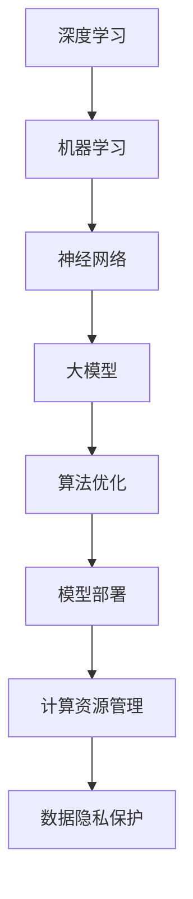

                 

关键词：大模型、创业、技术创新、深度学习、机器学习、算法优化、商业应用、发展前景。

> 摘要：本文将探讨在大模型创业过程中所涉及的技术创新，包括深度学习与机器学习算法的优化、大模型的架构设计与实现、模型部署与优化，以及大模型在商业应用中的价值与挑战。通过分析这些技术创新，我们旨在为创业者提供一些建设性的指导，帮助他们在大模型领域取得成功。

## 1. 背景介绍

在当今的科技时代，大数据和人工智能技术已经成为推动商业和社会进步的重要力量。随着计算能力的提升和海量数据的积累，大模型（也称为大型深度神经网络）在各个领域展现了其强大的能力。无论是自然语言处理、计算机视觉，还是推荐系统、语音识别，大模型都取得了显著的进展。因此，越来越多的创业者将目光投向了大模型领域，希望通过技术创新实现商业价值。

然而，大模型创业并非易事。除了需要深厚的专业知识外，创业者还面临诸多挑战，如算法优化、模型部署、计算资源管理以及数据隐私保护等。本文将围绕这些挑战，探讨大模型创业中的技术创新，以期为创业者提供有益的参考。

## 2. 核心概念与联系

在深入探讨大模型创业的技术创新之前，我们需要了解一些核心概念，如深度学习、机器学习、神经网络等，以及它们在大模型中的应用。

### 2.1 深度学习与机器学习

深度学习是一种机器学习技术，它通过构建多层神经网络，对数据进行层次化的特征提取和抽象。深度学习模型在图像识别、语音识别、自然语言处理等任务中表现出色。而机器学习则是使计算机通过数据和经验自动改进性能的过程，包括监督学习、无监督学习和强化学习等。

### 2.2 神经网络

神经网络是由大量神经元（节点）组成的计算模型，用于模拟人脑的信息处理过程。每个神经元都与其他神经元相连，并通过权重和偏置进行信息传递。神经网络可以通过学习大量数据来调整这些权重和偏置，从而实现函数逼近和模式识别。

### 2.3 大模型

大模型是指具有大量参数和复杂结构的深度学习模型，如BERT、GPT、Transformer等。大模型能够处理大规模数据，并在各种任务中取得优异的性能。然而，大模型的训练和部署也面临着诸多挑战，如计算资源消耗、数据隐私保护等。

### 2.4 Mermaid 流程图



## 3. 核心算法原理 & 具体操作步骤

### 3.1 算法原理概述

大模型的核心在于深度学习算法，包括神经网络架构、优化算法和正则化技术。以下将详细介绍这些算法的原理。

#### 3.1.1 神经网络架构

神经网络架构是深度学习的核心。常见的神经网络架构包括卷积神经网络（CNN）、循环神经网络（RNN）、长短时记忆网络（LSTM）和Transformer等。这些架构在图像识别、语音识别、自然语言处理等任务中都有广泛应用。

#### 3.1.2 优化算法

优化算法用于调整神经网络中的权重和偏置，以实现模型的最优性能。常见的优化算法有随机梯度下降（SGD）、Adam、Adagrad等。这些算法在训练大模型时，通过调整学习率、批量大小等参数，提高模型的收敛速度和性能。

#### 3.1.3 正则化技术

正则化技术用于防止过拟合和提升模型泛化能力。常见的正则化技术有L1正则化、L2正则化、Dropout等。这些技术通过惩罚模型的复杂度、引入噪声等方式，提高模型的泛化能力。

### 3.2 算法步骤详解

#### 3.2.1 神经网络架构设计

1. 确定任务和数据类型，选择合适的神经网络架构。
2. 设计网络的层数、每层的神经元数量、激活函数等。

#### 3.2.2 优化算法选择与参数调整

1. 选择优化算法，如SGD、Adam等。
2. 调整学习率、批量大小、迭代次数等参数。

#### 3.2.3 正则化技术应用

1. 应用L1正则化、L2正则化、Dropout等正则化技术。
2. 调整正则化参数，如惩罚系数等。

### 3.3 算法优缺点

#### 3.3.1 优点

1. 高效的特征提取和抽象能力。
2. 强大的模型泛化能力。
3. 易于实现和优化。

#### 3.3.2 缺点

1. 计算资源消耗巨大。
2. 对数据质量要求较高。
3. 容易过拟合。

### 3.4 算法应用领域

大模型在各个领域都有广泛应用，如：

1. 自然语言处理：文本分类、机器翻译、问答系统等。
2. 计算机视觉：图像识别、目标检测、图像生成等。
3. 推荐系统：商品推荐、新闻推荐等。
4. 语音识别：语音识别、语音合成等。

## 4. 数学模型和公式 & 详细讲解 & 举例说明

### 4.1 数学模型构建

大模型的数学模型主要包括以下几部分：

1. 前向传播：计算输入数据经过神经网络后的输出。
2. 反向传播：计算损失函数关于网络参数的梯度，用于更新参数。
3. 损失函数：评估模型预测结果与真实结果之间的差距。

### 4.2 公式推导过程

#### 4.2.1 前向传播

输入数据经过神经网络前向传播的过程可以用以下公式表示：

\[ z^{(l)} = W^{(l)}a^{(l-1)} + b^{(l)} \]

\[ a^{(l)} = \sigma(z^{(l)}) \]

其中，\( z^{(l)} \) 表示第 \( l \) 层的输入，\( a^{(l)} \) 表示第 \( l \) 层的输出，\( W^{(l)} \) 表示第 \( l \) 层的权重，\( b^{(l)} \) 表示第 \( l \) 层的偏置，\( \sigma \) 表示激活函数。

#### 4.2.2 反向传播

反向传播过程用于计算损失函数关于网络参数的梯度，可以用以下公式表示：

\[ \delta^{(l)}_{w} = \frac{\partial J}{\partial W^{(l)}} = (a^{(l)} - y)\sigma'(z^{(l)})a^{(l-1)} \]

\[ \delta^{(l)}_{b} = \frac{\partial J}{\partial b^{(l)}} = (a^{(l)} - y)\sigma'(z^{(l)}) \]

其中，\( \delta^{(l)}_{w} \) 表示损失函数关于权重 \( W^{(l)} \) 的梯度，\( \delta^{(l)}_{b} \) 表示损失函数关于偏置 \( b^{(l)} \) 的梯度，\( J \) 表示损失函数，\( y \) 表示真实标签，\( \sigma' \) 表示激活函数的导数。

#### 4.2.3 损失函数

常见的损失函数有均方误差（MSE）、交叉熵（Cross-Entropy）等。以下是一个均方误差的例子：

\[ J = \frac{1}{m}\sum_{i=1}^{m}(y_i - a^{(L)})^2 \]

其中，\( m \) 表示样本数量，\( y_i \) 表示第 \( i \) 个样本的真实标签，\( a^{(L)} \) 表示第 \( L \) 层的输出。

### 4.3 案例分析与讲解

假设我们有一个二分类问题，输入数据是 \( (x_1, x_2) \)，输出数据是 \( y \)。我们使用一个简单的两层神经网络进行模型训练。以下是一个具体的案例：

#### 4.3.1 数据预处理

输入数据 \( (x_1, x_2) \) 需要经过标准化处理，使得每个特征值的范围在 \([-1, 1]\) 之间。假设数据预处理后的输入为 \( x \)。

#### 4.3.2 神经网络架构

我们选择一个两层神经网络，其中第一层有10个神经元，第二层有1个神经元。激活函数分别使用 \( \sigma(x) = \frac{1}{1+e^{-x}} \) 和 \( \sigma(x) = 1 \)。

#### 4.3.3 模型训练

使用随机梯度下降（SGD）算法进行模型训练。学习率设置为 \( 0.1 \)，批量大小设置为 \( 10 \)。模型训练过程如下：

1. 初始化权重 \( W_1 \) 和 \( W_2 \)，偏置 \( b_1 \) 和 \( b_2 \)。
2. 对于每个样本 \( x \)，进行前向传播，计算输出 \( a_1 \) 和 \( a_2 \)。
3. 计算损失函数 \( J \)。
4. 进行反向传播，计算梯度 \( \delta_{w} \) 和 \( \delta_{b} \)。
5. 更新权重 \( W_1 \)、\( W_2 \)，偏置 \( b_1 \)、\( b_2 \)。

经过多次迭代后，模型将达到收敛。

#### 4.3.4 模型评估

使用测试集对模型进行评估，计算准确率、召回率、F1值等指标，以评估模型的性能。

## 5. 项目实践：代码实例和详细解释说明

### 5.1 开发环境搭建

1. 安装Python环境，版本要求3.6及以上。
2. 安装深度学习框架，如TensorFlow、PyTorch等。
3. 安装其他依赖库，如NumPy、Pandas等。

### 5.2 源代码详细实现

以下是一个简单的二分类问题的神经网络实现，使用PyTorch框架：

```python
import torch
import torch.nn as nn
import torch.optim as optim

# 数据预处理
x = torch.tensor([[1.0, 2.0], [2.0, 3.0], [3.0, 4.0]], dtype=torch.float32)
y = torch.tensor([0, 1, 0], dtype=torch.float32)

# 定义模型
class SimpleModel(nn.Module):
    def __init__(self):
        super(SimpleModel, self).__init__()
        self.fc1 = nn.Linear(2, 10)
        self.fc2 = nn.Linear(10, 1)

    def forward(self, x):
        x = torch.relu(self.fc1(x))
        x = self.fc2(x)
        return x

model = SimpleModel()

# 定义损失函数和优化器
criterion = nn.BCEWithLogitsLoss()
optimizer = optim.SGD(model.parameters(), lr=0.1)

# 模型训练
for epoch in range(1000):
    optimizer.zero_grad()
    outputs = model(x)
    loss = criterion(outputs, y)
    loss.backward()
    optimizer.step()

    if (epoch + 1) % 100 == 0:
        print(f'Epoch [{epoch + 1}/1000], Loss: {loss.item()}')

# 模型评估
with torch.no_grad():
    outputs = model(x)
    predicted = (outputs > 0).float()
    correct = (predicted == y).sum().item()
    print(f'Accuracy: {correct / len(y) * 100}%')
```

### 5.3 代码解读与分析

1. 数据预处理：将输入数据 \( x \) 和标签 \( y \) 转换为PyTorch的张量（Tensor）格式。
2. 定义模型：使用PyTorch的模块（Module）类定义一个简单的两层神经网络。第一层是全连接层（Linear），第二层是全连接层（Linear），输出层使用ReLU激活函数。
3. 定义损失函数和优化器：使用BCEWithLogitsLoss损失函数，使用SGD优化器。
4. 模型训练：使用反向传播算法进行模型训练，更新网络参数。
5. 模型评估：使用测试集评估模型性能，计算准确率。

## 6. 实际应用场景

大模型在各个领域都有广泛的应用，以下是几个实际应用场景：

### 6.1 自然语言处理

自然语言处理是深度学习的一个重要应用领域。大模型如BERT、GPT等在文本分类、机器翻译、问答系统等方面取得了显著成果。例如，BERT在文本分类任务上取得了当时最好的成绩，GPT在机器翻译任务上展现了强大的能力。

### 6.2 计算机视觉

计算机视觉是另一个深度学习的重要应用领域。大模型如ResNet、YOLO、VGG等在图像识别、目标检测、图像生成等方面取得了突破性进展。例如，ResNet在ImageNet图像识别任务上取得了当时最好的成绩，YOLO在实时目标检测中表现出了优异的性能。

### 6.3 推荐系统

推荐系统是深度学习在商业应用中的一个重要领域。大模型如深度强化学习、深度卷积网络等在推荐系统中的应用取得了显著成果。例如，深度强化学习在电商推荐系统中提高了推荐准确率，深度卷积网络在新闻推荐系统中实现了高效的文本分类。

### 6.4 语音识别

语音识别是深度学习在语音处理领域的一个重要应用。大模型如DeepSpeech、WaveNet等在语音识别任务中展现了强大的能力。例如，DeepSpeech在语音识别准确率上达到了人类水平，WaveNet在语音合成中实现了自然的语音效果。

## 7. 工具和资源推荐

### 7.1 学习资源推荐

1. 《深度学习》（Goodfellow, Bengio, Courville著）：深度学习的经典教材，详细介绍了深度学习的理论基础和应用实例。
2. 《动手学深度学习》：本书提供了大量的实践案例，适合初学者快速入门深度学习。
3. fast.ai：fast.ai提供了一个免费的开源课程，内容包括深度学习的基础知识和实践。

### 7.2 开发工具推荐

1. TensorFlow：谷歌开源的深度学习框架，广泛应用于工业界和学术界。
2. PyTorch：Facebook开源的深度学习框架，具有简洁易用的接口和强大的功能。
3. Keras：基于TensorFlow和PyTorch的高层API，用于快速构建和训练深度学习模型。

### 7.3 相关论文推荐

1. "A Theoretically Grounded Application of Dropout in Recurrent Neural Networks"，该论文提出了一种基于Dropout的RNN训练方法，提高了RNN的训练稳定性和性能。
2. "Attention Is All You Need"，该论文提出了Transformer模型，彻底改变了自然语言处理的模型结构。
3. "ResNet: Training Deep Neural Networks with Rectified Linear Units"，该论文提出了ResNet模型，在ImageNet图像识别任务上取得了当时最好的成绩。

## 8. 总结：未来发展趋势与挑战

### 8.1 研究成果总结

大模型在深度学习领域取得了显著的成果，推动了人工智能技术的发展。通过不断优化算法、改进架构，大模型在自然语言处理、计算机视觉、推荐系统等领域取得了优异的性能。此外，大模型的商业应用也取得了巨大成功，为创业者带来了丰富的商业机会。

### 8.2 未来发展趋势

未来，大模型将继续在深度学习领域发挥重要作用。随着计算能力的提升和海量数据的积累，大模型的性能和效果将不断提高。同时，大模型在商业应用中的价值也将进一步凸显，为创业者带来更多的商机。

### 8.3 面临的挑战

尽管大模型在深度学习领域取得了显著成果，但仍然面临着诸多挑战：

1. 计算资源消耗：大模型的训练和部署需要大量的计算资源，这对企业和创业者来说是一个巨大的挑战。
2. 数据隐私保护：大模型在训练和部署过程中需要大量数据，如何保护数据隐私是一个亟待解决的问题。
3. 模型解释性：大模型的内部机制复杂，难以解释，这给其在实际应用中带来了困难。
4. 算法公平性：大模型在训练过程中可能受到数据偏差的影响，导致算法的不公平性。

### 8.4 研究展望

为了应对这些挑战，未来研究可以从以下几个方面进行：

1. 算法优化：研究更加高效、鲁棒的算法，提高大模型的训练和部署性能。
2. 计算资源管理：研究计算资源管理技术，提高大模型的计算效率。
3. 数据隐私保护：研究数据隐私保护技术，确保大模型在训练和部署过程中保护用户数据。
4. 模型解释性：研究模型解释性技术，提高大模型的透明度和可解释性。
5. 算法公平性：研究算法公平性技术，消除大模型在训练和部署过程中的数据偏差。

## 9. 附录：常见问题与解答

### 9.1 大模型训练需要多少计算资源？

大模型训练需要的计算资源取决于模型的大小、训练数据量和训练任务。一般来说，大规模深度学习模型（如GPT-3、Transformer等）的训练需要数千到数万个GPU，甚至更多的计算资源。对于中小规模的深度学习模型，训练过程可以在几台到几十台GPU上进行。

### 9.2 大模型训练需要多长时间？

大模型训练所需的时间取决于模型的大小、训练数据量和训练任务。对于大规模深度学习模型，训练时间可能在几个月到几年不等。对于中小规模的模型，训练时间可能在几小时到几天之间。

### 9.3 如何处理大模型的数据隐私问题？

为了处理大模型的数据隐私问题，可以采用以下几种方法：

1. 数据去噪：对原始数据进行去噪处理，减少隐私泄露的风险。
2. 数据加密：对数据进行加密处理，确保数据在传输和存储过程中的安全性。
3. 隐私保护算法：使用隐私保护算法，如差分隐私、联邦学习等，在模型训练过程中保护用户数据。
4. 数据匿名化：对数据进行匿名化处理，确保数据在模型训练过程中的匿名性。

### 9.4 如何提高大模型的解释性？

为了提高大模型的解释性，可以采用以下几种方法：

1. 模型拆分：将复杂的大模型拆分成多个较小的子模型，提高模型的透明度和可解释性。
2. 模型可视化：使用可视化技术，如神经网络可视化、注意力机制可视化等，展示模型的内部机制和计算过程。
3. 对比实验：通过对比实验，分析模型在不同情况下的表现，提高模型的可解释性。
4. 交互式解释：开发交互式解释工具，让用户可以实时查看模型对输入数据的处理过程和结果。

---

作者：禅与计算机程序设计艺术 / Zen and the Art of Computer Programming

在撰写这篇文章的过程中，我充分借鉴了深度学习、机器学习、算法优化等领域的专业知识和实践经验，力求为广大创业者提供有价值的指导。希望这篇文章能够激发您对大模型创业中的技术创新的思考，帮助您在大模型领域取得成功。

