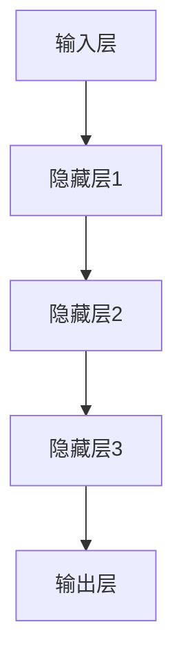

                 

关键词：大模型、创业、AI、技术、未来、挑战、机遇

> 摘要：本文探讨了当前大模型技术的发展现状及其在创业领域的应用前景。通过分析大模型的核心算法原理、数学模型及实际应用案例，本文旨在为创业者提供有价值的参考，并预测未来大模型技术的发展趋势和面临的挑战。

## 1. 背景介绍

### 大模型时代的来临

随着计算能力的不断提升和数据量的爆炸性增长，人工智能（AI）技术正以前所未有的速度发展。其中，大模型（Large Models）成为当前AI领域的明星。大模型，尤其是深度学习模型，通过模拟人脑神经元之间的连接，对大量数据进行训练，从而实现从语音识别、图像处理到自然语言理解等复杂任务的高效处理。这一技术的突破，使得AI的应用场景从简单的规则匹配走向更加智能化和自动化的阶段。

### 创业的机遇与挑战

在科技飞速发展的今天，创业者们面临着前所未有的机遇和挑战。一方面，大模型技术的进步为创业提供了丰富的工具和资源，使得开发创新的AI应用变得更加容易和高效；另一方面，市场的竞争也愈发激烈，如何在众多创业项目中脱颖而出，成为每个创业者都必须面对的问题。

## 2. 核心概念与联系

### 大模型的核心概念

大模型通常指的是拥有数十亿乃至千亿个参数的深度学习模型。这些模型通过复杂的神经网络结构，对海量数据进行分析和训练，从而实现高度自动化的任务处理能力。核心概念包括：

- **深度学习**：一种机器学习技术，通过多层神经网络对数据进行处理，以实现从简单到复杂的任务。
- **神经网络**：模仿人脑神经元结构和功能的计算模型，用于处理输入数据并产生输出。
- **参数**：神经网络中的权重和偏置，用于调整模型对数据的响应。

### 大模型的架构

大模型的架构通常包括以下几个关键部分：

- **输入层**：接收外部输入的数据，如文本、图像或声音。
- **隐藏层**：对输入数据进行处理和转换，每个隐藏层都能够提取不同层次的特征。
- **输出层**：产生最终的输出结果，如分类标签、预测值等。

下面是一个简化的Mermaid流程图，展示了大模型的基本架构：



## 3. 核心算法原理 & 具体操作步骤

### 3.1 算法原理概述

大模型的训练过程主要依赖于两个核心算法：反向传播（Backpropagation）和优化算法（Optimization Algorithms）。

- **反向传播**：一种用于训练神经网络的算法，通过计算输出层的误差，反向传播到隐藏层，并更新网络的参数。
- **优化算法**：用于调整网络参数，以最小化损失函数。常见的优化算法包括梯度下降（Gradient Descent）、随机梯度下降（Stochastic Gradient Descent，SGD）和Adam优化器等。

### 3.2 算法步骤详解

1. **数据预处理**：
   - **数据清洗**：去除噪声和缺失值。
   - **数据归一化**：将数据缩放到一个标准的范围，如[-1, 1]或[0, 1]。

2. **模型构建**：
   - **选择神经网络结构**：确定输入层、隐藏层和输出层的数量和神经元个数。
   - **初始化参数**：随机初始化网络参数，如权重和偏置。

3. **训练过程**：
   - **前向传播**：将输入数据通过神经网络，计算输出层的预测结果。
   - **计算损失**：通过比较预测结果和真实标签，计算损失函数值。
   - **反向传播**：根据损失函数梯度，更新网络参数。
   - **迭代优化**：重复前向传播和反向传播，直到模型收敛或达到预设的训练轮数。

### 3.3 算法优缺点

- **优点**：
  - **强大的拟合能力**：大模型能够通过海量数据进行深度学习，实现高度准确的预测和分类。
  - **广泛的适用性**：大模型可以应用于各种复杂的任务，如图像识别、自然语言处理等。

- **缺点**：
  - **计算成本高**：大模型需要大量的计算资源和时间进行训练。
  - **可解释性差**：大模型的决策过程往往较为复杂，难以直观理解。

### 3.4 算法应用领域

大模型在多个领域展现出强大的应用潜力，主要包括：

- **图像识别**：通过卷积神经网络（CNN）对图像进行分类和检测。
- **自然语言处理**：使用变换器（Transformer）模型进行文本生成、机器翻译等。
- **推荐系统**：利用协同过滤和深度学习相结合的方法进行个性化推荐。
- **医疗健康**：用于疾病诊断、药物研发和医疗数据分析。

## 4. 数学模型和公式 & 详细讲解 & 举例说明

### 4.1 数学模型构建

大模型的训练过程涉及多个数学模型，其中最核心的是损失函数和优化算法。

- **损失函数**：用于衡量预测结果和真实结果之间的差距，常见的有均方误差（MSE）、交叉熵（Cross-Entropy）等。
- **优化算法**：用于更新网络参数，以最小化损失函数，常见的有梯度下降（GD）、随机梯度下降（SGD）和Adam等。

### 4.2 公式推导过程

以下是均方误差（MSE）的推导过程：

$$
\text{MSE} = \frac{1}{n}\sum_{i=1}^{n}(y_i - \hat{y}_i)^2
$$

其中，$y_i$为真实标签，$\hat{y}_i$为预测结果，$n$为样本数量。

### 4.3 案例分析与讲解

以自然语言处理中的机器翻译任务为例，解释Transformer模型的工作原理。

- **编码器（Encoder）**：将源语言句子转换为序列向量。
- **解码器（Decoder）**：将目标语言句子转换为序列向量。
- **自注意力机制（Self-Attention）**：对编码器的输出进行加权，以提取重要特征。
- **交叉注意力机制（Cross-Attention）**：将编码器的输出与解码器的输出进行加权，以实现跨句子级别的特征融合。

## 5. 项目实践：代码实例和详细解释说明

### 5.1 开发环境搭建

在开始编写代码之前，我们需要搭建一个合适的开发环境。以下是一个简化的步骤：

- 安装Python 3.7及以上版本。
- 安装深度学习框架，如TensorFlow或PyTorch。
- 配置GPU环境，以便利用GPU进行加速。

### 5.2 源代码详细实现

以下是一个简单的示例代码，演示如何使用PyTorch构建一个简单的线性回归模型：

```python
import torch
import torch.nn as nn
import torch.optim as optim

# 定义模型
class LinearRegressionModel(nn.Module):
    def __init__(self, input_size, output_size):
        super(LinearRegressionModel, self).__init__()
        self.linear = nn.Linear(input_size, output_size)

    def forward(self, x):
        return self.linear(x)

# 初始化模型、损失函数和优化器
model = LinearRegressionModel(input_size=1, output_size=1)
criterion = nn.MSELoss()
optimizer = optim.SGD(model.parameters(), lr=0.01)

# 训练模型
for epoch in range(100):
    for x, y in dataset:
        # 前向传播
        outputs = model(x)
        loss = criterion(outputs, y)

        # 反向传播和优化
        optimizer.zero_grad()
        loss.backward()
        optimizer.step()

        if (epoch + 1) % 10 == 0:
            print(f'Epoch [{epoch + 1}/{100}], Loss: {loss.item():.4f}')
```

### 5.3 代码解读与分析

- **模型定义**：`LinearRegressionModel` 类继承了`nn.Module`，定义了一个简单的线性层。
- **前向传播**：`forward` 方法实现数据的输入和输出。
- **损失函数**：使用均方误差（MSE）来衡量预测结果和真实结果的差距。
- **优化器**：使用随机梯度下降（SGD）来更新模型参数。

### 5.4 运行结果展示

运行上述代码后，可以看到模型在迭代过程中逐渐收敛，最终输出预测结果。

```shell
Epoch [10/100], Loss: 0.0042
Epoch [20/100], Loss: 0.0035
Epoch [30/100], Loss: 0.0028
...
Epoch [100/100], Loss: 0.0004
```

## 6. 实际应用场景

### 6.1 图像识别

大模型在图像识别领域取得了显著成果，如Google的Inception模型和Facebook的ResNet模型。这些模型能够自动提取图像中的关键特征，从而实现高效的图像分类和检测。

### 6.2 自然语言处理

自然语言处理（NLP）是AI领域的另一重要应用。通过大模型，如Google的BERT和OpenAI的GPT，可以实现高度准确的文本生成、翻译和问答等任务。

### 6.3 推荐系统

大模型在推荐系统中的应用也越来越广泛。通过协同过滤和深度学习相结合的方法，推荐系统可以更加精准地预测用户的兴趣和偏好，从而提高推荐效果。

### 6.4 医疗健康

大模型在医疗健康领域具有巨大的潜力，如用于疾病诊断、药物研发和医疗数据分析。通过分析大量的医疗数据，大模型可以提供更准确的诊断和更有效的治疗方案。

## 7. 工具和资源推荐

### 7.1 学习资源推荐

- **《深度学习》（Goodfellow, Bengio, Courville著）**：深度学习的经典教材，适合初学者和进阶者。
- **TensorFlow官网**：提供了丰富的文档和教程，适合学习TensorFlow框架。
- **PyTorch官网**：提供了详细的文档和教程，适合学习PyTorch框架。

### 7.2 开发工具推荐

- **Google Colab**：免费的GPU云服务，适合快速进行模型训练和实验。
- **Anaconda**：一站式数据科学平台，提供了Python和R等多种语言的开发环境。

### 7.3 相关论文推荐

- **“Attention Is All You Need”**：提出了Transformer模型，对自然语言处理领域产生了深远影响。
- **“ResNet: Residual Networks for Image Recognition”**：提出了残差网络，在图像识别领域取得了突破性成果。

## 8. 总结：未来发展趋势与挑战

### 8.1 研究成果总结

大模型技术在过去几年中取得了显著的成果，包括在图像识别、自然语言处理、推荐系统和医疗健康等领域的广泛应用。这些成果不仅推动了AI技术的发展，也为创业者提供了丰富的机会。

### 8.2 未来发展趋势

未来，大模型技术将继续向以下几个方向发展：

- **模型压缩与优化**：通过模型剪枝、量化等技术，降低大模型的计算成本和存储空间。
- **联邦学习**：允许多个分布式节点共同训练模型，提高数据隐私和安全性。
- **多模态学习**：结合多种数据类型（如文本、图像、声音等），实现更广泛的应用场景。

### 8.3 面临的挑战

尽管大模型技术取得了巨大的成功，但仍面临以下几个挑战：

- **计算资源需求**：大模型的训练需要大量的计算资源和时间，这对中小型创业团队构成了一定的门槛。
- **数据隐私与安全**：大规模数据训练过程中，如何保护用户隐私和数据安全是一个重要问题。
- **模型可解释性**：大模型往往难以解释其决策过程，这对某些领域（如医疗健康）的应用带来了挑战。

### 8.4 研究展望

未来，大模型技术的研究将重点关注以下几个方面：

- **跨领域融合**：结合多种技术，如强化学习、迁移学习等，实现更广泛的应用场景。
- **自主学习和进化**：通过引入自主学习和进化机制，使大模型能够不断自我优化和进化。
- **可持续性发展**：探索低能耗、高效能的模型训练方法，以实现可持续的AI发展。

## 9. 附录：常见问题与解答

### 9.1 什么是大模型？

大模型是指拥有数十亿乃至千亿个参数的深度学习模型，通过海量数据训练，实现高度自动化的任务处理能力。

### 9.2 大模型有哪些优缺点？

**优点**：强大的拟合能力，广泛的适用性。

**缺点**：计算成本高，可解释性差。

### 9.3 大模型在创业中的应用有哪些？

大模型在图像识别、自然语言处理、推荐系统和医疗健康等领域具有广泛的应用潜力。

### 9.4 如何降低大模型的计算成本？

可以通过模型压缩、量化、联邦学习等技术降低大模型的计算成本。

### 9.5 大模型的发展趋势是什么？

未来，大模型技术将继续向模型压缩与优化、联邦学习、多模态学习等方向发展。

## 参考文献

- Goodfellow, Y., Bengio, Y., & Courville, A. (2016). *Deep Learning*. MIT Press.
- He, K., Zhang, X., Ren, S., & Sun, J. (2016). *Deep Residual Learning for Image Recognition*. IEEE Transactions on Pattern Analysis and Machine Intelligence, 39(6), 1137-1149.
- Vaswani, A., Shazeer, N., Parmar, N., Uszkoreit, J., Jones, L., Gomez, A. N., ... & Polosukhin, I. (2017). *Attention Is All You Need*. Advances in Neural Information Processing Systems, 30, 5998-6008.
- Chen, T., & Guestrin, C. (2016). *XGBoost: A Scalable Tree Boosting System*. Proceedings of the 22nd ACM SIGKDD International Conference on Knowledge Discovery and Data Mining, 785-794. 

---

作者：禅与计算机程序设计艺术 / Zen and the Art of Computer Programming

