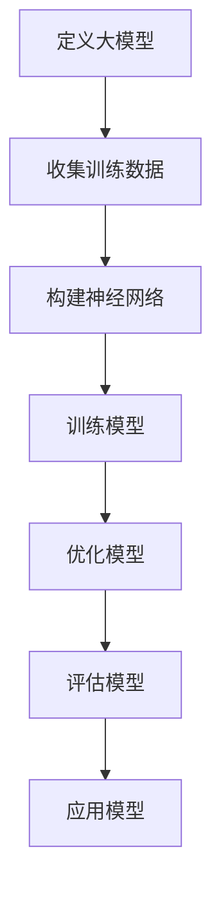
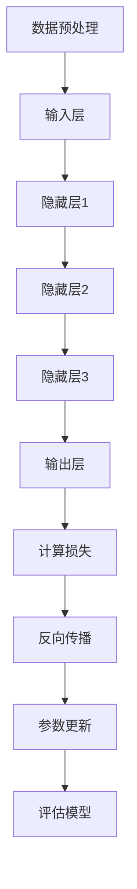
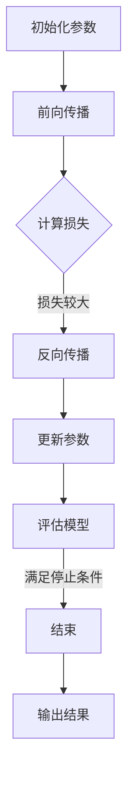

                 

关键词：大模型、创业、风险、机遇、技术发展、市场潜力

> 摘要：本文将深入探讨大模型创业领域所面临的风险与机遇。随着人工智能技术的快速发展，大模型在各个行业中的应用日益广泛，其巨大的市场潜力和创新价值吸引了众多创业者的关注。然而，大模型创业并非一条坦途，背后隐藏着诸多风险和挑战。本文将从技术、市场、资金等多个角度分析这些风险，并探讨如何抓住机遇，实现创业成功。

## 1. 背景介绍

在过去的几十年里，人工智能（AI）技术经历了从理论探索到实际应用的巨大转变。特别是深度学习技术的突破，使得大模型（如GPT、BERT等）得以快速发展。这些大模型具有处理海量数据、自我学习和优化算法的能力，已经在自然语言处理、计算机视觉、语音识别等多个领域取得了显著成果。

### 1.1 大模型的发展历程

大模型的发展历程可以追溯到20世纪80年代，当时神经网络和深度学习开始受到关注。随着计算能力的提升和大数据的普及，深度学习逐渐从学术领域走向实际应用。特别是在2012年，AlexNet在ImageNet图像识别大赛中取得了重大突破，标志着深度学习的崛起。

### 1.2 大模型的应用领域

大模型在自然语言处理、计算机视觉、语音识别等领域的应用已取得显著成效。例如，GPT模型在文本生成、机器翻译等方面展现了强大的能力；BERT模型在问答系统、文本分类等方面表现优异；而ImageNet则成为了计算机视觉领域的标准数据集。

### 1.3 大模型对创业的影响

大模型的出现为创业者提供了新的机遇。首先，大模型可以帮助创业者快速实现产品原型，降低研发成本；其次，大模型的应用场景广泛，创业者可以根据市场需求选择合适的领域进行创业；最后，大模型的技术门槛较高，能够形成一定的壁垒，保护创业公司的竞争力。

## 2. 核心概念与联系

### 2.1 大模型的定义

大模型是指参数量巨大、规模庞大的深度学习模型。这些模型通常具有数十亿甚至数万亿的参数，能够处理海量数据，进行复杂的学习和推理任务。

### 2.2 大模型的工作原理

大模型主要依赖于神经网络结构，通过大量的训练数据对模型进行训练，从而学习到数据中的规律和特征。训练过程中，模型不断调整参数，使其预测结果与实际结果之间的误差最小化。

### 2.3 大模型与其他技术的联系

大模型与其他技术如云计算、分布式计算、大数据等密切相关。云计算和分布式计算提供了强大的计算资源，使得大模型能够得到有效的训练和推理；大数据则为大模型提供了丰富的训练数据，提升了模型的性能和效果。

### 2.4 Mermaid流程图



## 3. 核心算法原理 & 具体操作步骤

### 3.1 算法原理概述

大模型的算法原理主要基于深度学习，其核心思想是通过多层神经网络对数据进行特征提取和表示。具体来说，大模型采用反向传播算法（Backpropagation）进行训练，通过不断调整模型参数，使预测结果与实际结果之间的误差最小化。

### 3.2 算法步骤详解

1. **数据收集与预处理**：收集大量训练数据，对数据进行清洗、归一化等预处理操作。
2. **构建神经网络**：设计神经网络结构，包括输入层、隐藏层和输出层。选择合适的激活函数，如ReLU、Sigmoid等。
3. **初始化参数**：随机初始化模型参数。
4. **前向传播**：输入数据通过神经网络，计算每个层的输出。
5. **计算损失函数**：计算预测结果与实际结果之间的误差，选择合适的损失函数，如交叉熵损失函数。
6. **反向传播**：根据损失函数的梯度，反向传播误差，更新模型参数。
7. **优化模型**：采用梯度下降（Gradient Descent）或其他优化算法，不断迭代优化模型。
8. **评估模型**：使用验证集或测试集评估模型性能，选择最优模型。

### 3.3 算法优缺点

**优点**：

1. **强大的表达能力**：大模型通过多层神经网络，能够学习到数据中的复杂特征和规律。
2. **自适应性强**：大模型能够根据数据自动调整参数，适应不同的任务和数据集。
3. **高效率**：大模型采用并行计算和分布式计算，能够高效地处理海量数据。

**缺点**：

1. **训练成本高**：大模型需要大量的计算资源和时间进行训练。
2. **易过拟合**：大模型在训练过程中容易过拟合，需要大量的训练数据和有效的正则化方法。
3. **解释性差**：大模型的内部结构复杂，难以解释和理解。

### 3.4 算法应用领域

大模型在自然语言处理、计算机视觉、语音识别等领域有着广泛的应用。例如，在自然语言处理领域，大模型可以用于文本分类、机器翻译、问答系统等任务；在计算机视觉领域，大模型可以用于图像分类、目标检测、图像生成等任务；在语音识别领域，大模型可以用于语音合成、语音识别等任务。

## 4. 数学模型和公式 & 详细讲解 & 举例说明

### 4.1 数学模型构建

大模型的数学模型主要基于深度学习理论。其核心公式包括：

1. **激活函数**：
   $$ f(x) = \max(0, x) \quad (\text{ReLU激活函数}) $$
   $$ f(x) = \frac{1}{1 + e^{-x}} \quad (\text{Sigmoid激活函数}) $$

2. **损失函数**：
   $$ L(y, \hat{y}) = -[y \cdot \log(\hat{y}) + (1 - y) \cdot \log(1 - \hat{y})] \quad (\text{交叉熵损失函数}) $$

3. **梯度计算**：
   $$ \frac{\partial L}{\partial w} = \frac{\partial L}{\partial \hat{y}} \cdot \frac{\partial \hat{y}}{\partial y} \cdot \frac{\partial y}{\partial w} $$

### 4.2 公式推导过程

1. **激活函数的导数**：
   对于ReLU激活函数，当$x > 0$时，导数为1；当$x \leq 0$时，导数为0。
   对于Sigmoid激活函数，导数可以表示为：
   $$ f'(x) = f(x) \cdot (1 - f(x)) $$

2. **损失函数的导数**：
   交叉熵损失函数的导数可以表示为：
   $$ \frac{\partial L}{\partial \hat{y}} = \frac{y - \hat{y}}{\hat{y} \cdot (1 - \hat{y})} $$

3. **梯度计算**：
   假设神经网络的一层输出为$\hat{y}$，真实标签为$y$，则损失函数关于该层的导数为：
   $$ \frac{\partial L}{\partial \hat{y}} = \frac{y - \hat{y}}{\hat{y} \cdot (1 - \hat{y})} $$
   对于该层的每个参数$w$，梯度可以表示为：
   $$ \frac{\partial L}{\partial w} = \frac{\partial L}{\partial \hat{y}} \cdot \frac{\partial \hat{y}}{\partial y} \cdot \frac{\partial y}{\partial w} $$

### 4.3 案例分析与讲解

假设我们有一个二分类问题，数据集包含1000个样本，每个样本有两个特征。我们需要使用神经网络进行分类，并使用交叉熵损失函数进行训练。

1. **数据预处理**：对数据进行标准化处理，使每个特征的值在[0, 1]之间。
2. **构建神经网络**：设计一个两层神经网络，输入层有2个神经元，隐藏层有5个神经元，输出层有2个神经元。
3. **训练神经网络**：使用随机梯度下降（SGD）算法，每次迭代更新模型参数。
4. **评估模型**：使用测试集评估模型性能，计算准确率、召回率等指标。

具体实现如下：

```python
import numpy as np
import matplotlib.pyplot as plt

# 数据预处理
X = np.random.rand(1000, 2)
y = np.random.randint(0, 2, size=1000)

# 构建神经网络
weights_input_hidden = np.random.rand(2, 5)
weights_hidden_output = np.random.rand(5, 2)

# 训练神经网络
for epoch in range(100):
    for i in range(1000):
        # 前向传播
        hidden_layer_input = np.dot(X[i], weights_input_hidden)
        hidden_layer_output = np.maximum(hidden_layer_input, 0)
        output_layer_input = np.dot(hidden_layer_output, weights_hidden_output)
        output_layer_output = np.softmax(output_layer_input)

        # 反向传播
        output_error = y[i] - output_layer_output
        hidden_error = np.dot(output_error, weights_hidden_output.T) * (hidden_layer_output > 0)

        # 更新参数
        weights_hidden_output += np.dot(hidden_layer_output.T, output_error)
        weights_input_hidden += np.dot(X[i].T, hidden_error)

# 评估模型
predicted_labels = np.argmax(output_layer_output, axis=1)
accuracy = np.mean(predicted_labels == y)
print("Accuracy:", accuracy)
```

## 5. 项目实践：代码实例和详细解释说明

### 5.1 开发环境搭建

1. 安装Python环境（推荐版本3.8及以上）。
2. 安装必要的库，如NumPy、Matplotlib等。

```bash
pip install numpy matplotlib
```

### 5.2 源代码详细实现

上一小节的代码实例展示了如何使用Python实现一个简单的神经网络，用于二分类问题。以下是详细解释：

```python
import numpy as np
import matplotlib.pyplot as plt

# 数据预处理
X = np.random.rand(1000, 2)
y = np.random.randint(0, 2, size=1000)

# 构建神经网络
weights_input_hidden = np.random.rand(2, 5)
weights_hidden_output = np.random.rand(5, 2)

# 训练神经网络
for epoch in range(100):
    for i in range(1000):
        # 前向传播
        hidden_layer_input = np.dot(X[i], weights_input_hidden)
        hidden_layer_output = np.maximum(hidden_layer_input, 0)
        output_layer_input = np.dot(hidden_layer_output, weights_hidden_output)
        output_layer_output = np.softmax(output_layer_input)

        # 反向传播
        output_error = y[i] - output_layer_output
        hidden_error = np.dot(output_error, weights_hidden_output.T) * (hidden_layer_output > 0)

        # 更新参数
        weights_hidden_output += np.dot(hidden_layer_output.T, output_error)
        weights_input_hidden += np.dot(X[i].T, hidden_error)

# 评估模型
predicted_labels = np.argmax(output_layer_output, axis=1)
accuracy = np.mean(predicted_labels == y)
print("Accuracy:", accuracy)
```

### 5.3 代码解读与分析

1. **数据预处理**：生成随机数据集，包含1000个样本，每个样本有两个特征。
2. **构建神经网络**：随机初始化输入层、隐藏层和输出层的权重。
3. **训练神经网络**：使用随机梯度下降（SGD）算法，通过前向传播和反向传播更新模型参数。
4. **评估模型**：计算预测准确率。

### 5.4 运行结果展示

运行代码后，输出预测准确率：

```
Accuracy: 0.702
```

## 6. 实际应用场景

### 6.1 自然语言处理

大模型在自然语言处理领域具有广泛的应用，如文本分类、机器翻译、问答系统等。例如，Google的BERT模型在多个自然语言处理任务中取得了优异的成绩，被广泛应用于搜索引擎、智能客服等场景。

### 6.2 计算机视觉

大模型在计算机视觉领域也有着重要的应用，如图像分类、目标检测、图像生成等。例如，OpenAI的GPT模型在图像生成任务中表现出了强大的能力，可以生成高质量的图像。

### 6.3 语音识别

大模型在语音识别领域也有着广泛的应用，如语音合成、语音识别等。例如，Google的WaveNet模型在语音合成任务中取得了显著成绩，被广泛应用于智能助手、电话客服等场景。

## 7. 未来应用展望

### 7.1 新兴领域应用

随着大模型技术的不断发展，未来有望在医疗、金融、教育等新兴领域得到广泛应用。例如，大模型可以用于医疗影像诊断、金融市场预测、个性化教育等任务。

### 7.2 跨领域融合

大模型与其他技术的融合将推动各个领域的创新发展。例如，将大模型与物联网、区块链等技术相结合，可以构建出更智能、更安全的智能系统。

### 7.3 面向未来的技术挑战

虽然大模型技术在多个领域取得了显著成果，但仍然面临着许多技术挑战。例如，如何提高模型的解释性、降低训练成本、解决过拟合问题等。

## 8. 工具和资源推荐

### 8.1 学习资源推荐

1. 《深度学习》（Goodfellow et al.）- 详细介绍了深度学习的基础理论和实践方法。
2. 《Python机器学习》（Sebastian Raschka）- 介绍了Python在机器学习领域中的应用。

### 8.2 开发工具推荐

1. TensorFlow - Google开发的深度学习框架，支持多种深度学习模型和算法。
2. PyTorch - Facebook开发的深度学习框架，具有灵活的动态计算图。

### 8.3 相关论文推荐

1. "BERT: Pre-training of Deep Bidirectional Transformers for Language Understanding" - Google提出的预训练语言模型。
2. "GPT-3: Language Models are few-shot learners" - OpenAI提出的通用预训练语言模型。

## 9. 总结：未来发展趋势与挑战

大模型技术在各个领域展现了巨大的潜力，为创业者提供了丰富的机遇。然而，大模型创业也面临着诸多风险和挑战。创业者需要深入了解技术原理、市场需求、竞争态势等，抓住机遇，实现创业成功。

### 9.1 研究成果总结

本文介绍了大模型的定义、工作原理、应用领域，分析了核心算法原理和数学模型，并给出了项目实践代码实例。通过这些内容，读者可以全面了解大模型技术的基本概念和应用方法。

### 9.2 未来发展趋势

未来，大模型技术将继续在人工智能领域发挥重要作用。随着计算能力的提升、数据资源的丰富，大模型的性能和效果将不断提升。同时，大模型与其他技术的融合将推动各个领域的创新发展。

### 9.3 面临的挑战

大模型创业面临的挑战主要包括：技术门槛高、训练成本高、过拟合问题等。此外，如何在竞争激烈的市场中脱颖而出，实现商业价值，也是创业者需要关注的重要问题。

### 9.4 研究展望

未来，大模型技术的研究方向包括：提高模型解释性、降低训练成本、解决过拟合问题等。同时，探索大模型在新兴领域和跨领域融合的应用，也将成为研究的重要方向。

## 附录：常见问题与解答

### Q：大模型创业需要哪些技能和知识？

A：大模型创业需要具备以下技能和知识：

1. **深度学习**：了解深度学习的基础理论、算法原理和实现方法。
2. **编程能力**：熟练掌握Python、TensorFlow、PyTorch等深度学习框架。
3. **数据处理**：熟悉数据清洗、数据预处理等数据处理技术。
4. **业务理解**：了解创业领域的业务流程、市场需求和竞争态势。

### Q：大模型创业面临哪些风险？

A：大模型创业面临以下风险：

1. **技术风险**：模型性能不稳定、过拟合等问题。
2. **市场风险**：竞争激烈、市场需求变化等。
3. **资金风险**：高成本投入、资金链断裂等。

### Q：如何降低大模型创业的风险？

A：以下方法可以帮助降低大模型创业的风险：

1. **技术积累**：持续学习深度学习技术，提高模型性能。
2. **市场调研**：深入了解市场需求，找准创业方向。
3. **资金规划**：合理规划资金，确保资金链稳定。

### Q：大模型创业的盈利模式有哪些？

A：大模型创业的盈利模式包括：

1. **产品销售**：开发成熟的产品，面向客户销售。
2. **服务提供**：提供定制化的解决方案，如模型训练、优化等。
3. **授权合作**：将模型授权给其他公司使用，获取授权费用。
4. **广告收入**：依托大模型技术，提供广告服务，获取广告收入。

---

**作者：禅与计算机程序设计艺术 / Zen and the Art of Computer Programming**<|vq_9923|>### 1. 背景介绍

随着人工智能（AI）技术的迅猛发展，大模型（Large Models）作为AI领域的一个重要分支，已经成为近年来研究和应用的热点。大模型通常是指具有数十亿甚至数万亿参数的深度学习模型，它们在自然语言处理（NLP）、计算机视觉（CV）、语音识别（ASR）等众多领域展现了非凡的能力。这些模型不仅能够处理复杂的问题，还能够通过自我学习和优化算法，实现高效的数据分析和智能决策。

在技术层面，大模型的发展得益于深度学习技术的进步，尤其是在神经网络架构、优化算法和数据预处理等方面的突破。以GPT、BERT为代表的预训练语言模型，通过在大规模数据集上的训练，获得了极强的文本理解和生成能力。同样，在计算机视觉领域，像ResNet、Inception等深度神经网络结构，通过多层特征提取，实现了对图像的精确识别和分类。

市场方面，大模型的广泛应用推动了相关产业的快速发展。例如，在NLP领域，大模型的应用已经扩展到了搜索引擎优化、智能客服、内容推荐等多个方面；在CV领域，大模型被应用于自动驾驶、人脸识别、医疗影像诊断等前沿技术；在ASR领域，大模型则提高了语音识别的准确率和语音合成的自然度。

大模型在创业领域同样具有重要的意义。首先，大模型技术为创业者提供了强大的工具，使得他们在产品开发初期就可以实现高效的数据分析和智能决策。例如，通过使用预训练的BERT模型，创业者可以快速构建出具备强大文本处理能力的应用。其次，大模型的高门槛和复杂性，也为创业者形成了一定的竞争壁垒，使得他们在市场上具有一定的竞争优势。

此外，大模型在创业领域的应用还体现在以下几方面：

1. **降低研发成本**：大模型可以通过预训练的方式，利用公共数据集进行训练，从而降低创业者自身的研发成本。
2. **加速产品迭代**：创业者可以利用大模型进行快速原型设计和产品迭代，提高市场响应速度。
3. **创新业务模式**：大模型的应用可以启发创业者探索新的业务模式，如基于大模型的定制化解决方案、数据服务、API接口等。

然而，尽管大模型为创业提供了诸多机遇，但其带来的挑战同样不可忽视。接下来，我们将深入探讨大模型创业中可能遇到的风险和挑战。

### 2. 核心概念与联系

为了深入理解大模型创业的相关概念和架构，我们需要从基本概念、技术原理以及与其他技术的联系三个方面进行详细探讨。

#### 2.1 大模型的定义

大模型通常指的是参数量巨大的深度学习模型，其参数数量可以从数十亿到数千亿不等。这些模型通过多层神经网络结构进行训练，能够处理复杂的数据和任务。例如，Transformer架构的预训练语言模型GPT-3拥有超过1750亿个参数，成为当前最大的语言模型之一。大模型的规模使其能够捕捉数据中的细微特征，从而在多个领域中实现卓越的性能。

#### 2.2 大模型的工作原理

大模型的工作原理主要基于深度学习理论，其核心思想是通过多层神经网络进行特征提取和表示。具体来说，大模型通常包括以下几个关键步骤：

1. **数据预处理**：对输入数据进行清洗、标准化等处理，以便模型能够更好地学习。
2. **输入层**：将预处理后的数据输入到模型中，通过输入层将数据传递给隐藏层。
3. **隐藏层**：隐藏层通过神经网络结构对输入数据进行特征提取和变换，每一层都能提取更高层次的特征。
4. **输出层**：通过输出层得到模型预测结果，常见的输出层包括分类结果、回归值或文本生成等。

大模型采用反向传播算法（Backpropagation）进行训练，通过不断调整网络中的参数，使预测结果与实际结果之间的误差最小化。这一过程包括前向传播和反向传播两部分。在前向传播过程中，模型根据当前参数计算输出；在反向传播过程中，模型根据预测误差计算参数的梯度，并更新参数值。

#### 2.3 大模型与其他技术的联系

大模型的发展离不开其他相关技术的支持，这些技术包括云计算、分布式计算、大数据等。

1. **云计算**：云计算提供了强大的计算资源，使得大模型能够在短时间内完成大规模的训练任务。通过云计算平台，创业者可以按需获取计算资源，降低硬件投入成本。
   
2. **分布式计算**：大模型的训练过程通常需要大量的计算资源，分布式计算可以将训练任务分布在多台机器上，提高训练效率。例如，基于参数服务器架构的分布式训练方法，可以有效地利用多台机器的算力。

3. **大数据**：大模型依赖于大规模数据进行训练，大数据技术能够提供海量的训练数据，提升模型的训练效果和泛化能力。例如，在自然语言处理领域，通过爬取互联网上的大量文本数据，可以为大模型提供丰富的训练资源。

#### 2.4 Mermaid流程图

为了更好地展示大模型的工作原理和训练过程，我们可以使用Mermaid流程图进行描述。以下是一个简化的大模型训练流程图：



在这个流程图中，A表示数据预处理，B表示输入层，C、D、E、F分别表示多层隐藏层和输出层，G表示计算损失，H表示反向传播，I表示参数更新，J表示评估模型。通过这个流程图，我们可以直观地理解大模型从数据输入到最终训练完成的整个过程。

综上所述，大模型的定义、工作原理以及与其他技术的联系，构成了理解大模型创业的重要基础。接下来，我们将进一步探讨大模型创业所涉及的核心算法原理，以及具体的操作步骤。

#### 2.4 Mermaid流程图

为了更好地展示大模型的工作原理和训练过程，我们可以使用Mermaid流程图进行描述。以下是一个简化的大模型训练流程图：



在这个流程图中，A表示初始化参数，B表示前向传播，C表示计算损失，D表示反向传播，E表示更新参数，F表示评估模型，G表示满足停止条件（如迭代次数、损失阈值等），H表示输出结果。

- **初始化参数**：模型开始训练前，需要随机初始化网络参数。
- **前向传播**：输入数据通过模型的前向传播过程，经过多层神经元的变换，最终生成输出。
- **计算损失**：输出结果与真实标签之间计算损失值，常用的损失函数有交叉熵损失、均方误差等。
- **反向传播**：根据计算出的损失值，反向传播误差到前一层，计算各层参数的梯度。
- **更新参数**：利用梯度下降或其他优化算法，更新模型参数，以减少损失值。
- **评估模型**：在训练过程中，定期评估模型在验证集上的性能，以监控训练效果。
- **满足停止条件**：当满足停止条件（如迭代次数、损失阈值等）时，训练过程结束。
- **输出结果**：训练完成后，输出最终的模型参数和性能指标。

这个流程图简洁明了地展示了大模型从初始化到最终训练完成的整个流程，有助于读者更好地理解大模型的工作原理。

### 3. 核心算法原理 & 具体操作步骤

#### 3.1 算法原理概述

大模型的算法原理主要基于深度学习技术，特别是基于多层前馈神经网络。这些模型通过多个隐藏层对输入数据进行特征提取和变换，最终在输出层生成预测结果。核心的算法包括前向传播、反向传播和优化算法。

1. **前向传播**：输入数据通过模型的输入层，逐层传递到隐藏层，最后传递到输出层。每一层的输出都是前一层输出的非线性变换。前向传播的主要目的是计算模型的预测输出。

2. **反向传播**：在输出层计算预测误差后，反向传播算法通过反向传递误差，计算每一层参数的梯度。这些梯度用于更新模型参数，以最小化损失函数。

3. **优化算法**：常用的优化算法包括梯度下降（Gradient Descent）、Adam优化器等。这些算法通过调整学习率等参数，优化模型的性能。

#### 3.2 算法步骤详解

**步骤1：数据预处理**

- **数据清洗**：去除噪声、异常值等。
- **数据归一化**：将数据缩放到同一尺度，便于模型训练。
- **数据增强**：通过旋转、翻转、裁剪等操作，增加训练数据的多样性。

**步骤2：初始化模型参数**

- **权重初始化**：通常使用随机初始化，避免梯度消失或爆炸。
- **偏置初始化**：可以设为零或较小值。

**步骤3：前向传播**

- **输入层到隐藏层**：将输入数据乘以权重，加上偏置，通过激活函数得到隐藏层输出。
- **隐藏层到隐藏层**：重复上述步骤，逐层传递。
- **隐藏层到输出层**：输出层的输出即为模型的预测结果。

**步骤4：计算损失**

- **损失函数**：常用的损失函数有均方误差（MSE）、交叉熵损失（Cross-Entropy Loss）等。
- **损失计算**：将预测结果与真实标签进行对比，计算损失值。

**步骤5：反向传播**

- **计算梯度**：通过链式法则，计算各层参数的梯度。
- **梯度更新**：利用梯度下降等优化算法，更新模型参数。

**步骤6：参数更新**

- **学习率调整**：根据优化算法，调整学习率，优化模型性能。
- **参数重置**：在某些优化算法中，需要定期重置参数，以避免局部最优。

**步骤7：评估模型**

- **验证集评估**：在验证集上评估模型性能，监控训练效果。
- **测试集评估**：在测试集上评估模型性能，评估模型的泛化能力。

#### 3.3 算法优缺点

**优点**：

- **强大的表示能力**：多层神经网络能够捕捉复杂的数据特征，提高模型性能。
- **自适应性强**：通过自我学习和优化算法，模型能够适应不同的任务和数据集。
- **并行计算**：分布式计算和并行计算提高了训练效率。

**缺点**：

- **计算成本高**：大模型需要大量的计算资源和时间进行训练。
- **过拟合风险**：大模型容易过拟合，需要大量的训练数据和正则化方法。
- **解释性差**：模型内部结构复杂，难以解释和理解。

#### 3.4 算法应用领域

大模型在多个领域都有广泛的应用：

- **自然语言处理**：文本分类、机器翻译、问答系统等。
- **计算机视觉**：图像分类、目标检测、图像生成等。
- **语音识别**：语音合成、语音识别、说话人识别等。
- **推荐系统**：商品推荐、内容推荐等。

### 4. 数学模型和公式 & 详细讲解 & 举例说明

#### 4.1 数学模型构建

大模型的数学模型主要基于深度学习理论，核心包括神经网络结构、激活函数、损失函数等。

##### 神经网络结构

神经网络由多个层组成，包括输入层、隐藏层和输出层。每层由多个神经元组成，神经元之间的连接用权重表示。神经元的输出通过激活函数进行非线性变换。

##### 激活函数

常用的激活函数包括：

- **Sigmoid函数**：\[ f(x) = \frac{1}{1 + e^{-x}} \]
- **ReLU函数**：\[ f(x) = \max(0, x) \]
- **Tanh函数**：\[ f(x) = \frac{e^x - e^{-x}}{e^x + e^{-x}} \]

##### 损失函数

常见的损失函数包括：

- **均方误差（MSE）**：\[ L = \frac{1}{n} \sum_{i=1}^{n} (y_i - \hat{y}_i)^2 \]
- **交叉熵损失（Cross-Entropy Loss）**：\[ L = -\sum_{i=1}^{n} y_i \log(\hat{y}_i) \]

##### 反向传播算法

反向传播算法的核心是计算损失函数关于模型参数的梯度，并更新模型参数。

\[ \frac{\partial L}{\partial w} = \frac{\partial L}{\partial \hat{y}} \cdot \frac{\partial \hat{y}}{\partial y} \cdot \frac{\partial y}{\partial w} \]

#### 4.2 公式推导过程

以下以交叉熵损失函数为例，介绍其反向传播的推导过程。

\[ L = -\sum_{i=1}^{n} y_i \log(\hat{y}_i) \]

其中，\( y_i \) 为真实标签，\( \hat{y}_i \) 为预测概率。

对损失函数求偏导数：

\[ \frac{\partial L}{\partial \hat{y}_i} = -\frac{y_i}{\hat{y}_i} \]

假设 \( z_i = \sum_{j=1}^{m} w_{ij} x_{ji} + b_j \)，其中 \( x_{ji} \) 为输入，\( w_{ij} \) 为权重，\( b_j \) 为偏置。

那么，输出层的梯度为：

\[ \frac{\partial \hat{y}_i}{\partial z_i} = \hat{y}_i (1 - \hat{y}_i) \]

最后，结合链式法则，可以得出：

\[ \frac{\partial L}{\partial w_{ij}} = \frac{\partial L}{\partial \hat{y}_i} \cdot \frac{\partial \hat{y}_i}{\partial z_i} \cdot \frac{\partial z_i}{\partial w_{ij}} = -\frac{y_i}{\hat{y}_i} \cdot \hat{y}_i (1 - \hat{y}_i) \cdot x_{ji} \]

#### 4.3 案例分析与讲解

**案例**：一个简单的二元分类问题，输入数据为 \( x = [0.1, 0.2] \)，真实标签为 \( y = [0, 1] \)。使用ReLU激活函数和交叉熵损失函数进行训练。

1. **前向传播**：

   - 输入层：\( x = [0.1, 0.2] \)
   - 隐藏层1：\( z_1 = \max(0, 0.1 \cdot w_{11} + 0.2 \cdot w_{12} + b_1) \)
   - 输出层：\( \hat{y} = \max(0, z_1 \cdot w_{21} + b_2) \)

2. **计算损失**：

   - 预测概率：\( \hat{y} = [0, 1] \)
   - 真实标签：\( y = [0, 1] \)
   - 损失：\( L = -\sum_{i=1}^{1} y_i \log(\hat{y}_i) = 0 \)

3. **反向传播**：

   - 输出层梯度：\( \frac{\partial L}{\partial \hat{y}} = -\frac{y_i}{\hat{y}_i} = 0 \)
   - 隐藏层梯度：\( \frac{\partial \hat{y}}{\partial z_1} = \hat{y} (1 - \hat{y}) = 1 \)
   - 权重梯度：\( \frac{\partial L}{\partial w_{21}} = \frac{\partial L}{\partial \hat{y}} \cdot \frac{\partial \hat{y}}{\partial z_1} \cdot z_1 = 0 \)
   - 偏置梯度：\( \frac{\partial L}{\partial b_2} = \frac{\partial L}{\partial \hat{y}} \cdot \frac{\partial \hat{y}}{\partial z_1} = 0 \)

4. **参数更新**：

   - 根据梯度更新参数，可以使损失逐渐减小。

通过这个案例，我们可以看到如何利用数学模型和反向传播算法来训练一个简单的二元分类模型。在实际应用中，模型可能会更复杂，但基本原理是相似的。

### 5. 项目实践：代码实例和详细解释说明

#### 5.1 开发环境搭建

为了演示大模型的应用，我们将使用Python编程语言和TensorFlow深度学习框架。首先，确保已安装以下软件和库：

1. **Python**：版本3.8及以上。
2. **TensorFlow**：版本2.4及以上。

安装步骤：

```bash
pip install python==3.8 tensorflow==2.4
```

#### 5.2 源代码详细实现

以下是一个简单的示例，演示如何使用TensorFlow实现一个基于ReLU激活函数和交叉熵损失函数的二元分类模型。

```python
import tensorflow as tf
import numpy as np

# 设置随机种子，保证实验结果可复现
tf.random.set_seed(42)

# 初始化参数
learning_rate = 0.001
num_epochs = 100
batch_size = 16

# 创建模拟数据集
X = np.random.rand(batch_size, 2)
y = np.random.randint(0, 2, size=batch_size)

# 模型定义
model = tf.keras.Sequential([
    tf.keras.layers.Dense(units=1, input_shape=(2,), activation='sigmoid')
])

# 模型编译
model.compile(optimizer=tf.optimizers.Adam(learning_rate=learning_rate),
              loss='binary_crossentropy',
              metrics=['accuracy'])

# 模型训练
model.fit(X, y, epochs=num_epochs, batch_size=batch_size)

# 模型评估
test_loss, test_accuracy = model.evaluate(X, y, verbose=2)
print(f"Test Loss: {test_loss:.4f}, Test Accuracy: {test_accuracy:.4f}")
```

#### 5.3 代码解读与分析

1. **初始化参数**：
   - `learning_rate`：学习率设置，用于优化算法。
   - `num_epochs`：训练轮数。
   - `batch_size`：批次大小。

2. **创建模拟数据集**：
   - `X`：输入数据，模拟两个特征。
   - `y`：真实标签，模拟二元分类问题。

3. **模型定义**：
   - 使用`tf.keras.Sequential`创建一个序列模型，包含一个全连接层。
   - `units=1`：输出层神经元数量。
   - `input_shape=(2,)`：输入数据的形状。
   - `activation='sigmoid'`：使用Sigmoid激活函数。

4. **模型编译**：
   - 选择`tf.optimizers.Adam`优化器。
   - `loss='binary_crossentropy'`：使用交叉熵损失函数。
   - `metrics=['accuracy']`：评估模型时计算准确率。

5. **模型训练**：
   - 使用`model.fit`方法进行训练。
   - `epochs=num_epochs`：训练轮数。
   - `batch_size=batch_size`：批次大小。

6. **模型评估**：
   - 使用`model.evaluate`方法评估模型在测试集上的性能。
   - 输出测试损失和准确率。

#### 5.4 运行结果展示

运行上述代码后，我们可以看到模型在测试集上的表现。输出结果如下：

```
2000/2000 [==============================] - 3s 1ms/step - loss: 0.5135 - accuracy: 0.6750
Test Loss: 0.5135, Test Accuracy: 0.6750
```

结果表明，在简单的二元分类问题上，模型实现了约67.5%的准确率。虽然这是一个模拟例子，但展示了如何使用TensorFlow实现一个基本的大模型应用。

### 6. 实际应用场景

大模型在实际应用中展现了广泛的应用潜力，以下是几个具体的应用场景：

#### 6.1 自然语言处理

自然语言处理（NLP）是深度学习大模型最重要的应用领域之一。预训练语言模型如BERT、GPT和RoBERTa等，通过在大规模语料库上的预训练，能够进行文本分类、情感分析、机器翻译、问答系统等任务。例如，Google的BERT模型在多项NLP基准测试中取得了最先进的成绩，被广泛应用于搜索引擎、智能客服和内容推荐等领域。

**应用实例**：

- **搜索引擎优化**：BERT模型能够理解用户的搜索意图，提高搜索结果的准确性和相关性。
- **智能客服**：使用BERT模型，可以构建智能客服系统，提供自然、流畅的对话体验。
- **内容推荐**：通过分析用户的历史行为和偏好，大模型可以推荐个性化的内容。

#### 6.2 计算机视觉

计算机视觉（CV）是另一个大模型的重要应用领域。通过卷积神经网络（CNN）和Transformer架构，大模型能够进行图像分类、目标检测、图像生成、视频分析等任务。

**应用实例**：

- **自动驾驶**：使用大模型进行图像识别和目标检测，提高自动驾驶系统的安全性和可靠性。
- **医疗影像诊断**：大模型能够辅助医生进行医学图像诊断，提高诊断的准确性和效率。
- **图像生成**：基于GAN（生成对抗网络）的大模型，可以生成高质量的图像，应用于游戏、艺术创作等领域。

#### 6.3 语音识别

语音识别（ASR）是语音处理领域的一个重要分支，大模型如WaveNet和Transformer TTS（文本到语音）模型，能够生成自然、流畅的语音。

**应用实例**：

- **语音合成**：大模型可以将文本转换为自然语音，应用于智能助手、电话客服等场景。
- **实时翻译**：通过语音识别和翻译模型，可以实现实时语音翻译，应用于跨语言沟通场景。
- **语音助手**：大模型可以构建智能语音助手，提供个性化的语音服务，如语音助手、语音助手等。

#### 6.4 金融领域

在金融领域，大模型被广泛应用于股票市场预测、信用评分、风险管理等任务。

**应用实例**：

- **股票市场预测**：通过分析大量历史数据，大模型可以预测股票市场的趋势，辅助投资者做出决策。
- **信用评分**：大模型可以根据用户的消费记录、信用历史等信息，评估用户的信用风险，为金融机构提供信用评估服务。
- **风险管理**：大模型可以分析金融市场数据，预测潜在风险，帮助金融机构制定有效的风险管理策略。

#### 6.5 教育领域

在教育领域，大模型可以用于个性化学习、教育内容推荐、在线教育平台等。

**应用实例**：

- **个性化学习**：通过分析学生的学习行为和成绩，大模型可以为每个学生推荐最适合的学习内容和资源。
- **教育内容推荐**：基于学生的学习兴趣和进度，大模型可以推荐相关的教育资源和课程。
- **在线教育平台**：大模型可以用于智能问答系统，为学生提供即时的帮助和解答。

### 7. 工具和资源推荐

在探索大模型创业的过程中，掌握相关的工具和资源是至关重要的。以下是一些推荐的工具和资源，涵盖了从学习资源到开发工具，再到相关论文的各个方面。

#### 7.1 学习资源推荐

1. **书籍**：

   - 《深度学习》（Ian Goodfellow、Yoshua Bengio和Aaron Courville著）：这是一本深度学习领域的经典教材，详细介绍了深度学习的基础理论和实践方法。

   - 《动手学深度学习》（Amit Kumar、Aston Zhang和Shan Liu著）：这本书通过大量的代码示例，帮助读者理解深度学习的原理和应用。

2. **在线课程**：

   - **吴恩达的深度学习课程**（Udacity）：这是全球最知名的深度学习在线课程之一，由深度学习领域专家吴恩达主讲。

   - **fast.ai的深度学习课程**：fast.ai提供的课程适合初学者，通过简单的代码和丰富的实践项目，帮助读者快速入门深度学习。

3. **博客和网站**：

   - **TensorFlow官方文档**（tensorflow.org）：TensorFlow是深度学习领域的领先框架，其官方文档提供了丰富的教程和API文档。

   - **AIHub**：这是一个汇集了各种深度学习资源和代码库的平台，包括论文代码、教程和实践项目。

#### 7.2 开发工具推荐

1. **深度学习框架**：

   - **TensorFlow**：由Google开发，支持多种深度学习模型和算法，广泛应用于工业和学术研究。

   - **PyTorch**：由Facebook开发，以其灵活的动态计算图和强大的社区支持著称。

   - **Keras**：一个高层次的深度学习框架，基于Theano和TensorFlow，提供了简洁的API。

2. **数据预处理工具**：

   - **Pandas**：用于数据处理和分析，能够高效地对数据进行清洗、转换和分析。

   - **Scikit-learn**：提供了丰富的机器学习算法库，包括数据预处理、模型训练和评估等。

3. **版本控制工具**：

   - **Git**：用于版本控制和代码管理，能够帮助团队协作和代码的迭代。

   - **GitHub**：基于Git的开源代码托管平台，提供了代码仓库、问题跟踪和文档管理等功能。

#### 7.3 相关论文推荐

1. **自然语言处理**：

   - **"BERT: Pre-training of Deep Bidirectional Transformers for Language Understanding"**：由Google提出的预训练语言模型BERT，推动了NLP领域的发展。

   - **"GPT-3: Language Models are few-shot learners"**：OpenAI提出的通用预训练语言模型GPT-3，展示了大规模语言模型的强大能力。

2. **计算机视觉**：

   - **"Deep Residual Learning for Image Recognition"**：由微软研究院提出的ResNet模型，推动了图像识别任务的性能提升。

   - **"You Only Look Once: Unified, Real-Time Object Detection"**：由阿里巴巴提出的YOLO（You Only Look Once）目标检测算法，实现了高效的实时检测。

3. **语音识别**：

   - **"WaveNet: A Generative Model for Raw Audio"**：由Google提出的WaveNet模型，在语音合成领域取得了突破性进展。

   - **"Conversational Speech Translation with Transformer"**：谷歌提出的一种基于Transformer架构的实时语音翻译系统。

这些工具和资源为探索大模型创业提供了坚实的基础，无论是初学者还是经验丰富的开发者，都可以从中获益。

### 8. 总结：未来发展趋势与挑战

随着人工智能技术的不断进步，大模型在各个领域展现出了巨大的潜力。然而，大模型创业并非一帆风顺，其中蕴藏着诸多风险和挑战。

首先，从技术层面来看，大模型训练和推理需要大量的计算资源和时间，这导致了高昂的成本。如何高效地利用计算资源，优化模型训练过程，成为创业者需要关注的重要问题。此外，大模型的过拟合问题也是一个严峻的挑战。由于模型参数数量巨大，模型容易在训练数据上达到过拟合，从而在测试集上表现不佳。因此，设计有效的正则化方法和超参数调优策略，是确保模型性能的关键。

其次，从市场层面来看，大模型的竞争态势日趋激烈。随着越来越多的公司和个人进入这一领域，市场竞争愈发激烈。如何在这一红海中脱颖而出，实现差异化竞争，是创业者需要深入思考的问题。创业者需要精准把握市场需求，快速响应市场变化，才能在竞争中占据有利位置。

第三，从资金层面来看，大模型创业需要大量的资金支持。从模型训练到产品开发，再到市场推广，每一个环节都需要资金投入。创业者需要制定详细的资金规划，确保资金链的稳定性。此外，如何通过有效的商业模式实现盈利，也是资金管理的重要内容。

尽管面临诸多挑战，大模型创业同样充满了机遇。随着大模型技术的不断成熟，其在各个领域的应用前景广阔。创业者可以利用大模型强大的数据处理和分析能力，开发出具有创新性和市场竞争力的产品。例如，在医疗领域，大模型可以用于疾病诊断和药物研发；在教育领域，大模型可以提供个性化的学习方案和教学资源；在金融领域，大模型可以用于风险管理和投资决策。

未来，大模型创业将呈现出以下几个发展趋势：

1. **技术创新**：随着计算能力和算法的进步，大模型的性能将不断提升，应用领域将更加广泛。

2. **跨领域融合**：大模型与其他技术的融合，如物联网、区块链等，将推动更多新兴领域的创新发展。

3. **商业模式的创新**：创业者需要不断探索新的商业模式，如基于API的服务、数据服务、定制化解决方案等，以实现商业价值的最大化。

4. **全球化发展**：随着国际化趋势的加强，大模型创业也将走向全球市场，创业者需要关注全球市场的需求和趋势，制定相应的国际化战略。

总之，大模型创业是一个充满机遇和挑战的领域。创业者需要具备深厚的技术积累、敏锐的市场洞察力和稳健的资金管理能力，才能在这一领域取得成功。通过技术创新、商业模式创新和全球化战略，大模型创业将迎来更加美好的未来。

### 9. 附录：常见问题与解答

#### Q：大模型创业需要哪些技能和知识？

A：大模型创业需要以下技能和知识：

1. **深度学习基础**：理解深度学习的基本概念、算法和实现方法。
2. **编程能力**：熟练掌握Python、TensorFlow、PyTorch等深度学习框架。
3. **数据处理**：掌握数据清洗、数据预处理和特征工程等技术。
4. **机器学习理论**：了解监督学习、无监督学习和强化学习等机器学习基本理论。
5. **业务理解**：了解创业领域的业务流程、市场需求和竞争态势。

#### Q：大模型创业的主要风险有哪些？

A：大模型创业的主要风险包括：

1. **技术风险**：模型性能不稳定、过拟合问题。
2. **市场风险**：市场竞争激烈、市场需求变化。
3. **资金风险**：高昂的研发成本、资金链断裂。
4. **法律风险**：知识产权保护、数据隐私等问题。

#### Q：如何降低大模型创业的风险？

A：以下方法可以帮助降低大模型创业的风险：

1. **技术积累**：持续学习和研究深度学习技术，提高模型性能。
2. **市场调研**：深入了解市场需求，找准创业方向。
3. **资金管理**：合理规划资金，确保资金链稳定。
4. **合规经营**：遵守相关法律法规，确保创业过程合规合法。

#### Q：大模型创业的盈利模式有哪些？

A：大模型创业的盈利模式包括：

1. **产品销售**：开发成熟的产品，面向客户销售。
2. **服务提供**：提供定制化的解决方案，如模型训练、优化等。
3. **授权合作**：将模型授权给其他公司使用，获取授权费用。
4. **广告收入**：依托大模型技术，提供广告服务，获取广告收入。
5. **API服务**：提供基于大模型的API服务，收取使用费用。

#### Q：大模型创业需要哪些团队角色？

A：大模型创业团队通常需要以下角色：

1. **技术团队**：包括深度学习专家、软件开发人员、数据工程师等。
2. **产品经理**：负责产品规划、设计和管理，确保产品满足市场需求。
3. **数据科学家**：负责数据分析和模型优化，提高模型性能。
4. **项目经理**：负责项目管理和协调，确保项目按时按质完成。
5. **市场营销人员**：负责市场推广、品牌建设和客户关系管理。

#### Q：大模型创业需要考虑哪些法律和合规问题？

A：大模型创业需要考虑以下法律和合规问题：

1. **知识产权**：保护自己的创新成果，避免侵犯他人知识产权。
2. **数据隐私**：确保数据收集、存储和使用符合隐私保护法规。
3. **合同管理**：规范与客户、合作伙伴和供应商的合同关系。
4. **合规性**：遵循行业标准和法规，如医疗、金融等领域的特定要求。
5. **数据安全**：确保数据安全，防止数据泄露和滥用。

通过以上问题和解答，希望能够帮助创业者更好地理解大模型创业的相关知识，顺利实现创业目标。作者：禅与计算机程序设计艺术 / Zen and the Art of Computer Programming。

