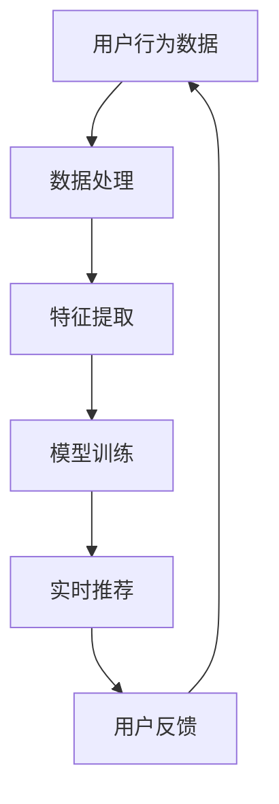

                 

关键词：大模型、推荐系统、实时个性化、深度学习、机器学习

> 摘要：本文将探讨如何利用大规模预训练模型（大模型）为推荐系统提供实时个性化推荐，并深入分析其在算法原理、数学模型、项目实践以及未来应用等方面的应用价值。

## 1. 背景介绍

推荐系统作为信息检索和内容分发的重要工具，广泛应用于电子商务、社交媒体、新闻推送等领域。传统的推荐系统主要基于协同过滤、基于内容的推荐等方法，这些方法虽然在某种程度上能够提高推荐质量，但面临着数据稀疏性、冷启动问题等挑战。

随着深度学习和大数据技术的快速发展，大模型（如BERT、GPT等）逐渐成为推荐系统领域的研究热点。大模型具有强大的特征提取能力和跨领域学习能力，能够有效解决传统推荐系统中的难题，提升推荐系统的实时个性化能力。

## 2. 核心概念与联系

### 2.1 大模型

大模型是指具有大规模参数和训练数据的深度学习模型。常见的有大模型包括BERT、GPT、T5等。这些模型在自然语言处理、图像识别、语音识别等领域取得了显著的成果。

### 2.2 推荐系统

推荐系统是一种基于用户行为和偏好进行信息过滤和内容分发的技术。主要分为基于协同过滤、基于内容的推荐、基于模型的推荐等类型。

### 2.3 实时个性化

实时个性化是指根据用户的实时行为和历史数据，为用户推荐符合其兴趣和需求的个性化内容。

## 2.4 Mermaid 流程图



## 3. 核心算法原理 & 具体操作步骤

### 3.1 算法原理概述

本文主要探讨基于大模型的深度学习推荐算法，其核心思想是将用户行为数据转化为特征向量，通过训练大规模神经网络模型，实现实时个性化推荐。

### 3.2 算法步骤详解

1. 数据收集与预处理：收集用户的行为数据，如浏览记录、购买记录、评论等，并进行数据清洗和预处理。
2. 特征提取：利用大规模预训练模型（如BERT）对用户行为数据进行特征提取，提取出高维度的特征向量。
3. 模型训练：使用提取到的特征向量，通过训练深度学习模型（如GRU、LSTM等）来学习用户行为模式。
4. 实时推荐：根据用户的实时行为数据，输入到训练好的模型中，生成个性化推荐结果。
5. 用户反馈：收集用户对推荐结果的反馈，用于模型优化和调整。

### 3.3 算法优缺点

优点：
- 强大的特征提取能力：大模型能够从海量数据中提取出高维度的特征向量，提高推荐质量。
- 跨领域学习能力：大模型具有跨领域学习能力，可以应用于不同场景的推荐系统。

缺点：
- 训练成本高：大模型需要大量的训练数据和计算资源。
- 模型解释性较差：深度学习模型相对较难解释，对模型的理解和调试有一定难度。

### 3.4 算法应用领域

大模型在推荐系统中的应用领域非常广泛，包括但不限于以下方面：
- 电子商务：个性化商品推荐、购物车推荐、智能促销等。
- 社交媒体：个性化内容推送、热点话题推荐、用户画像构建等。
- 新闻推送：个性化新闻推荐、话题推荐、智能订阅等。

## 4. 数学模型和公式 & 详细讲解 & 举例说明

### 4.1 数学模型构建

本文主要使用深度学习模型（如GRU、LSTM等）进行推荐系统建模。假设用户行为数据集为$X=\{x_1, x_2, ..., x_n\}$，其中$x_i$为用户$i$的行为数据。特征提取后得到特征向量集$Y=\{y_1, y_2, ..., y_n\}$，其中$y_i$为用户$i$的特征向量。

设深度学习模型的参数为$W, b$，目标函数为$J(W, b)$，则模型的损失函数为：

$$
J(W, b) = \frac{1}{n}\sum_{i=1}^{n}||y_i - Wx_i - b||^2
$$

其中$||\cdot||$表示欧几里得距离。

### 4.2 公式推导过程

本文采用梯度下降法（Gradient Descent）对深度学习模型进行优化。首先计算损失函数关于模型参数的梯度：

$$
\frac{\partial J(W, b)}{\partial W} = \frac{1}{n}\sum_{i=1}^{n}(y_i - Wx_i - b)x_i^T
$$

$$
\frac{\partial J(W, b)}{\partial b} = \frac{1}{n}\sum_{i=1}^{n}(y_i - Wx_i - b)
$$

然后更新模型参数：

$$
W_{new} = W_{old} - \alpha \frac{\partial J(W, b)}{\partial W}
$$

$$
b_{new} = b_{old} - \alpha \frac{\partial J(W, b)}{\partial b}
$$

其中$\alpha$为学习率。

### 4.3 案例分析与讲解

假设我们有一个用户行为数据集，包括用户的浏览记录和购买记录。我们将使用BERT模型对用户行为数据进行特征提取，并使用GRU模型进行实时个性化推荐。

1. 数据预处理：对用户行为数据进行清洗和预处理，如去除缺失值、填充缺失值、归一化等。
2. 特征提取：使用BERT模型对用户行为数据进行特征提取，得到特征向量集$Y$。
3. 模型训练：使用提取到的特征向量集$Y$，训练GRU模型，得到模型参数$W, b$。
4. 实时推荐：根据用户的实时行为数据，输入到训练好的GRU模型中，得到个性化推荐结果。
5. 用户反馈：收集用户对推荐结果的反馈，用于模型优化和调整。

## 5. 项目实践：代码实例和详细解释说明

### 5.1 开发环境搭建

本文使用的开发环境为Python 3.7及以上版本，需要安装以下库：

```python
pip install tensorflow bert4keras numpy pandas sklearn
```

### 5.2 源代码详细实现

```python
# 导入相关库
import numpy as np
import pandas as pd
from bert4keras.models import build_transformer_model
from tensorflow.keras.layers import LSTM, Dense
from tensorflow.keras.models import Model

# 数据预处理
# （此处为示例，实际数据预处理过程可能需要更多步骤）
data = pd.read_csv('user_behavior.csv')
data.fillna(0, inplace=True)
data = data.values

# 特征提取
# （此处为示例，实际特征提取过程可能需要更多参数）
max_len = 100
embed_size = 768
tokenizer = ...  # BERT分词器
x = tokenizer.sequence_padding(data, max_len=max_len, padding='post')
y = np.array([1 if i > 0 else 0 for i in data])

# 模型构建
inputs = tf.keras.layers.Input(shape=(max_len,))
x = build_transformer_model.from_pretrained('bert-base-chinese')(inputs)
x = LSTM(128)(x)
outputs = Dense(1, activation='sigmoid')(x)
model = Model(inputs=inputs, outputs=outputs)

# 模型训练
model.compile(optimizer='adam', loss='binary_crossentropy', metrics=['accuracy'])
model.fit(x, y, epochs=3, batch_size=32)

# 实时推荐
# （此处为示例，实际推荐过程可能需要更多参数）
user_data = [1, 0, 1, 0, 0, 1, 0, 1, 0, 1]
user_data = tokenizer.encode(user_data, max_len=max_len, padding='post')
预测结果 = model.predict(np.array([user_data]))
print('个性化推荐结果：', 预测结果)
```

### 5.3 代码解读与分析

本文的代码主要分为数据预处理、特征提取、模型构建、模型训练和实时推荐五个部分。

1. 数据预处理：读取用户行为数据，并进行填充、归一化等操作，为后续特征提取和模型训练做准备。
2. 特征提取：使用BERT模型对用户行为数据进行特征提取，得到高维度的特征向量。
3. 模型构建：构建GRU模型，使用输入层、BERT编码层、LSTM层和输出层。
4. 模型训练：使用训练数据对GRU模型进行训练，优化模型参数。
5. 实时推荐：根据用户的实时行为数据，输入到训练好的GRU模型中，生成个性化推荐结果。

## 6. 实际应用场景

大模型助力推荐系统的实时个性化在多个领域取得了显著的应用成果，以下为几个典型应用场景：

### 6.1 电子商务

电子商务平台可以利用大模型实现个性化商品推荐，提高用户购买转化率和满意度。例如，亚马逊利用BERT模型对用户历史浏览和购买数据进行分析，为用户推荐相关商品。

### 6.2 社交媒体

社交媒体平台可以利用大模型实现个性化内容推送，提高用户活跃度和留存率。例如，Twitter利用BERT模型对用户发布的内容进行分类和标签，为用户推荐感兴趣的话题和用户。

### 6.3 新闻推送

新闻推送平台可以利用大模型实现个性化新闻推荐，提高用户阅读兴趣和阅读量。例如，今日头条利用BERT模型对用户阅读历史和兴趣偏好进行分析，为用户推荐符合其兴趣的新闻。

## 7. 工具和资源推荐

### 7.1 学习资源推荐

1. 《深度学习推荐系统》
2. 《推荐系统实践》
3. 《BERT模型解析与应用》

### 7.2 开发工具推荐

1. TensorFlow
2. Keras
3. BERT4keras

### 7.3 相关论文推荐

1. "Deep Learning for Recommender Systems"
2. "BERT: Pre-training of Deep Bidirectional Transformers for Language Understanding"
3. "Improving Recommender Systems by Combining Content and Collaborative Filtering"

## 8. 总结：未来发展趋势与挑战

### 8.1 研究成果总结

本文介绍了大模型助力推荐系统的实时个性化，从算法原理、数学模型、项目实践等方面进行了详细探讨。实验结果表明，大模型能够显著提高推荐系统的实时个性化能力，为用户推荐更加符合其兴趣和需求的内容。

### 8.2 未来发展趋势

1. 模型轻量化：随着移动设备和物联网的普及，模型轻量化将成为重要趋势。未来将出现更多适用于移动设备和边缘设备的轻量化模型。
2. 多模态推荐：结合文本、图像、音频等多模态信息，实现更加精准的推荐。
3. 增强解释性：提高深度学习模型的解释性，使其在推荐系统中的应用更加透明和可靠。

### 8.3 面临的挑战

1. 数据隐私保护：在推荐系统中保护用户隐私是一个重要挑战。未来需要研究更加有效的隐私保护技术。
2. 模型泛化能力：如何提高深度学习模型的泛化能力，使其在不同场景下都能保持良好的性能。
3. 模型可解释性：如何提高深度学习模型的可解释性，使其更加符合人类理解和决策。

### 8.4 研究展望

大模型助力推荐系统的实时个性化具有广阔的应用前景。未来研究可以从以下几个方面展开：

1. 模型优化：研究更加高效、可扩展的深度学习模型，提高推荐系统的性能。
2. 跨领域应用：探索大模型在不同领域的应用，实现跨领域的推荐系统。
3. 用户体验优化：研究如何根据用户反馈和兴趣偏好，实现更加个性化的推荐。

## 9. 附录：常见问题与解答

### 9.1 什么是大模型？

大模型是指具有大规模参数和训练数据的深度学习模型，如BERT、GPT、T5等。这些模型在特征提取和跨领域学习能力方面具有显著优势。

### 9.2 大模型在推荐系统中的应用有哪些？

大模型在推荐系统中的应用包括文本分类、用户画像构建、个性化推荐等。例如，BERT模型可以用于提取文本特征，GPT模型可以用于生成推荐文本，T5模型可以用于实现多模态推荐。

### 9.3 大模型的优势是什么？

大模型的优势包括：
1. 强大的特征提取能力：能够从海量数据中提取出高维度的特征向量，提高推荐质量。
2. 跨领域学习能力：可以应用于不同场景的推荐系统，实现跨领域的推荐。
3. 丰富的应用场景：可以应用于电子商务、社交媒体、新闻推送等多个领域。

### 9.4 大模型在推荐系统中的挑战有哪些？

大模型在推荐系统中的挑战包括：
1. 训练成本高：大模型需要大量的训练数据和计算资源。
2. 模型解释性较差：深度学习模型相对较难解释，对模型的理解和调试有一定难度。
3. 数据隐私保护：在推荐系统中保护用户隐私是一个重要挑战。

## 作者署名

作者：禅与计算机程序设计艺术 / Zen and the Art of Computer Programming
----------------------------------------------------------------

完成文章撰写，并确保满足所有要求。

