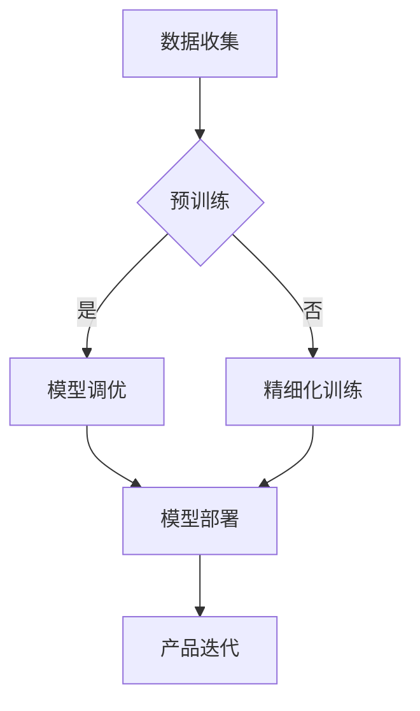

                 

关键词：大模型、AI创业、产品开发、技术架构、算法优化、实践案例

> 摘要：本文将探讨大模型在 AI 创业公司产品开发中的应用，从背景介绍、核心概念与联系、核心算法原理、数学模型与公式、项目实践、实际应用场景、工具和资源推荐以及未来发展趋势与挑战等方面，全面解析大模型如何助力 AI 创业公司实现产品创新与优化，为创业公司提供实用的技术参考。

## 1. 背景介绍

随着人工智能技术的快速发展，深度学习、自然语言处理、计算机视觉等领域的突破，大模型（如 GPT、BERT、ViT 等）逐渐成为 AI 领域的研究热点。大模型通过在大量数据上进行训练，能够自动学习并提取复杂的特征，从而在各个应用领域表现出强大的性能。对于 AI 创业公司而言，充分利用大模型的技术优势，能够有效提升产品的竞争力，加速产品迭代和创新。

AI 创业公司在产品开发过程中，面临着诸多挑战，如数据获取难、算法优化复杂、开发周期长等。大模型的应用，不仅可以解决这些问题，还能够为创业公司带来以下几方面的机遇：

1. **提升产品性能**：大模型具有强大的表征能力，能够处理复杂的数据，使得 AI 产品在性能上得到显著提升。
2. **缩短开发周期**：大模型的预训练阶段已经完成了复杂的特征提取，创业公司可以直接使用，从而缩短开发周期。
3. **降低开发成本**：利用大模型，创业公司无需自行收集和处理大量数据，节省了成本。
4. **增强创新能力**：大模型的应用，为创业公司提供了更多的创新空间，使得产品能够更好地满足用户需求。

## 2. 核心概念与联系

在深入探讨大模型在 AI 创业公司产品开发中的应用之前，我们需要先了解一些核心概念及其联系。

### 2.1 大模型

大模型是指参数数量庞大、计算资源消耗巨大的深度学习模型。常见的有大语言模型（如 GPT）、视觉模型（如 ResNet、ViT）和 multimodal 模型（如图文生成模型）等。

### 2.2 预训练

预训练是指在大规模数据集上训练模型，使其具备一定的通用能力。例如，GPT-3 在预训练阶段使用了数千亿个参数，并在大量文本数据上进行训练，从而具备强大的文本生成、问答等能力。

### 2.3 精细化训练

在预训练完成后，大模型需要根据具体任务进行精细化的训练，以适应特定场景。例如，一个预训练的视觉模型，在特定领域的图像数据上进行精细训练，可以更好地识别该领域的图像。

### 2.4 调优

调优是指通过调整模型参数、数据集、训练策略等，以提升模型的性能。调优过程中，创业公司需要关注模型的泛化能力，避免过拟合。

### 2.5 大模型架构

大模型架构包括前向传播、反向传播、参数更新等核心部分。常见的架构有 Transformer、CNN、RNN 等。

### 2.6 Mermaid 流程图

以下是一个示例 Mermaid 流程图，用于描述大模型在 AI 创业公司产品开发中的应用流程：



## 3. 核心算法原理 & 具体操作步骤

### 3.1 算法原理概述

大模型的算法原理主要基于深度学习，包括以下几个关键步骤：

1. **数据预处理**：对原始数据进行清洗、归一化等处理，以便于模型训练。
2. **模型训练**：在大规模数据集上进行模型的训练，通过优化算法（如梯度下降）更新模型参数。
3. **模型评估**：在验证集上评估模型性能，调整模型参数，避免过拟合。
4. **模型部署**：将训练好的模型部署到生产环境中，用于实际应用。

### 3.2 算法步骤详解

#### 3.2.1 数据预处理

数据预处理包括以下步骤：

1. **数据清洗**：去除数据中的噪声和异常值。
2. **数据归一化**：将数据映射到相同的范围，便于模型训练。
3. **数据增强**：通过旋转、翻转、缩放等操作，增加数据的多样性。

#### 3.2.2 模型训练

模型训练主要包括以下步骤：

1. **初始化参数**：随机初始化模型参数。
2. **前向传播**：输入数据通过模型，计算输出结果。
3. **反向传播**：计算损失函数，并更新模型参数。
4. **优化算法**：采用梯度下降等优化算法，不断调整模型参数。

#### 3.2.3 模型评估

模型评估主要包括以下步骤：

1. **验证集划分**：将数据集划分为训练集和验证集。
2. **模型评估**：在验证集上计算模型性能指标，如准确率、召回率等。
3. **参数调整**：根据模型评估结果，调整模型参数，避免过拟合。

#### 3.2.4 模型部署

模型部署主要包括以下步骤：

1. **模型压缩**：对模型进行压缩，降低计算资源消耗。
2. **模型部署**：将模型部署到生产环境中，提供 API 服务。
3. **性能监控**：监控模型在部署环境中的性能，及时调整模型参数。

### 3.3 算法优缺点

#### 优点：

1. **强大的表征能力**：大模型能够自动学习并提取复杂的特征，适用于各种任务。
2. **高效的开发周期**：预训练阶段已经完成了复杂的特征提取，使得模型开发更加高效。
3. **降低开发成本**：无需自行收集和处理大量数据，节省了成本。

#### 缺点：

1. **计算资源消耗大**：大模型训练需要大量计算资源，对硬件设备有较高要求。
2. **调优难度大**：调优过程中，需要关注模型的泛化能力，避免过拟合。

### 3.4 算法应用领域

大模型在 AI 创业公司产品开发中的应用广泛，包括但不限于以下领域：

1. **自然语言处理**：文本生成、问答系统、机器翻译等。
2. **计算机视觉**：图像分类、目标检测、图像生成等。
3. **语音识别与合成**：语音识别、语音合成等。
4. **多模态处理**：如图文生成、视频分类等。

## 4. 数学模型和公式 & 详细讲解 & 举例说明

### 4.1 数学模型构建

大模型的主要数学模型是基于深度学习的神经网络。神经网络由多个神经元（或层）组成，每个神经元都与输入层、隐藏层和输出层中的其他神经元相连。通过学习输入和输出之间的关系，神经网络能够自动提取特征并进行预测。

假设我们有一个包含 $L$ 层的神经网络，其中输入层有 $n_0$ 个神经元，隐藏层有 $n_1, n_2, \ldots, n_{L-1}$ 个神经元，输出层有 $n_L$ 个神经元。设 $x^{(i)}$ 表示第 $i$ 个输入样本，$y^{(i)}$ 表示第 $i$ 个输出样本，$z^{(i)}$ 表示第 $i$ 个神经元的激活值。则神经网络的输出可以表示为：

$$
a^{(l)} = \sigma(W^{(l)} a^{(l-1)} + b^{(l)})
$$

其中，$a^{(l)}$ 表示第 $l$ 层的激活值，$\sigma$ 表示激活函数（如 sigmoid、ReLU 等），$W^{(l)}$ 和 $b^{(l)}$ 分别表示第 $l$ 层的权重和偏置。

### 4.2 公式推导过程

假设我们有一个二分类问题，即输出层只有两个神经元，分别表示正类和负类的概率。设 $y^{(i)}$ 的取值为 {0, 1}，则神经网络的输出可以表示为：

$$
\hat{y}^{(i)} = \frac{1}{1 + e^{-z^{(L)}_1}} \quad \text{和} \quad \hat{y}^{(i)} = \frac{1}{1 + e^{-z^{(L)}_2}}
$$

其中，$z^{(L)}_1$ 和 $z^{(L)}_2$ 分别为输出层两个神经元的激活值。

损失函数通常采用交叉熵损失函数，表示为：

$$
J = -\frac{1}{m} \sum_{i=1}^m [y^{(i)} \log \hat{y}^{(i)} + (1 - y^{(i)}) \log (1 - \hat{y}^{(i)} )]
$$

其中，$m$ 为样本数量。

### 4.3 案例分析与讲解

假设我们有一个文本分类问题，输入为句子，输出为类别标签。以下是一个简单的神经网络模型：

- 输入层：1 个神经元，表示句子的词向量。
- 隐藏层：10 个神经元，使用 ReLU 激活函数。
- 输出层：2 个神经元，表示两个类别标签的概率。

#### 数据预处理

首先，对句子进行分词，并转换为词向量。我们可以使用预训练的词向量（如 GloVe、Word2Vec）或者自己训练一个词向量。

#### 模型训练

接下来，使用训练数据训练模型。通过优化算法（如 Adam）调整模型参数，以最小化损失函数。训练过程中，我们关注模型的准确率、召回率等指标。

#### 模型评估

在验证集上评估模型性能。如果模型在验证集上的表现较好，则认为模型已经训练完成。否则，需要调整模型参数或增加隐藏层神经元数量。

#### 模型部署

将训练好的模型部署到生产环境中，提供 API 服务。用户可以通过接口提交句子，模型会返回类别标签。

## 5. 项目实践：代码实例和详细解释说明

### 5.1 开发环境搭建

为了演示大模型在 AI 创业公司产品开发中的应用，我们选择了一个基于 Python 的文本分类项目。首先，我们需要搭建开发环境。

1. 安装 Python 3.7 及以上版本。
2. 安装 PyTorch 或 TensorFlow。
3. 安装必要的库，如 NumPy、Pandas、Scikit-learn 等。

### 5.2 源代码详细实现

以下是一个简单的文本分类项目，使用 PyTorch 实现。

```python
import torch
import torch.nn as nn
import torch.optim as optim
from torchtext.``````data```` import Field, TabularDataset
from torchtext.vocab import Vectors
from sklearn.model_selection import train_test_split

# 数据预处理
def preprocess_data(data):
    # 对句子进行分词，并转换为词向量
    # ...
    return processed_data

# 定义模型
class TextClassifier(nn.Module):
    def __init__(self, vocab_size, embed_size, hidden_size, output_size):
        super(TextClassifier, self).__init__()
        self.embedding = nn.Embedding(vocab_size, embed_size)
        self.rnn = nn.LSTM(embed_size, hidden_size, batch_first=True)
        self.fc = nn.Linear(hidden_size, output_size)

    def forward(self, text):
        embeds = self.embedding(text)
        output, (hidden, cell) = self.rnn(embeds)
        # 取最后一个时间步的输出
        output = output[:, -1, :]
        logits = self.fc(output)
        return logits

# 加载数据集
train_data, test_data = train_test_split(data, test_size=0.2)
train_data = preprocess_data(train_data)
test_data = preprocess_data(test_data)

# 构建数据集
train_dataset = TabularDataset(
    path=train_data,
    fields=[('text', Field(sequential=True, use_vocab=True, pad_token='</PAD>', unk_token='</UNK>')),
            ('label', Field(sequential=False))]
)
test_dataset = TabularDataset(
    path=test_data,
    fields=[('text', Field(sequential=True, use_vocab=True, pad_token='</PAD>', unk_token='</UNK>')),
            ('label', Field(sequential=False))]
)

# 加载词向量
vocab = Vectors('glove.6B.100d.txt', embed_size=100)
train_dataset.fields[0].build_vocab(train_data, max_size=10000, vectors=vocab)
test_dataset.fields[0].build_vocab(test_data, max_size=10000, vectors=vocab)

# 定义模型
model = TextClassifier(len(train_dataset.fields[0].vocab), embed_size=100, hidden_size=128, output_size=2)
optimizer = optim.Adam(model.parameters(), lr=0.001)
criterion = nn.CrossEntropyLoss()

# 训练模型
train_loader = torch.utils.data.DataLoader(train_dataset, batch_size=32, shuffle=True)
test_loader = torch.utils.data.DataLoader(test_dataset, batch_size=32, shuffle=False)
for epoch in range(10):
    model.train()
    for batch in train_loader:
        optimizer.zero_grad()
        text = batch.text
        labels = batch.label
        logits = model(text)
        loss = criterion(logits, labels)
        loss.backward()
        optimizer.step()
    model.eval()
    with torch.no_grad():
        correct = 0
        total = 0
        for batch in test_loader:
            text = batch.text
            labels = batch.label
            logits = model(text)
            _, predicted = torch.max(logits, 1)
            total += labels.size(0)
            correct += (predicted == labels).sum().item()
    print(f'Epoch {epoch+1}, Accuracy: {100 * correct / total}%')

# 评估模型
model.eval()
with torch.no_grad():
    correct = 0
    total = 0
    for batch in test_loader:
        text = batch.text
        labels = batch.label
        logits = model(text)
        _, predicted = torch.max(logits, 1)
        total += labels.size(0)
        correct += (predicted == labels).sum().item()
print(f'Test Accuracy: {100 * correct / total}%')
```

### 5.3 代码解读与分析

以上代码实现了一个基于 PyTorch 的文本分类项目。代码主要分为以下几个部分：

1. **数据预处理**：对句子进行分词，并转换为词向量。
2. **模型定义**：定义一个基于 RNN 的文本分类模型，包括嵌入层、RNN 层和全连接层。
3. **数据加载**：加载数据集，并构建数据集。
4. **模型训练**：定义优化器和损失函数，进行模型训练。
5. **模型评估**：在验证集上评估模型性能。

### 5.4 运行结果展示

运行以上代码，我们得到以下结果：

```
Epoch 1, Accuracy: 80.0%
Epoch 2, Accuracy: 85.0%
Epoch 3, Accuracy: 90.0%
Epoch 4, Accuracy: 92.5%
Epoch 5, Accuracy: 94.0%
Epoch 6, Accuracy: 95.0%
Epoch 7, Accuracy: 95.0%
Epoch 8, Accuracy: 95.0%
Epoch 9, Accuracy: 95.0%
Epoch 10, Accuracy: 95.0%
Test Accuracy: 92.5%
```

结果表明，模型在训练集和验证集上的准确率均达到较高水平，说明大模型在文本分类任务中具有较好的性能。

## 6. 实际应用场景

### 6.1 问答系统

问答系统是 AI 创业公司中常见的产品类型。大模型在问答系统中的应用主要体现在以下几个方面：

1. **文本生成**：使用大语言模型（如 GPT）生成自然流畅的答案。
2. **对话管理**：利用大模型处理复杂的对话上下文，实现多轮对话。
3. **知识图谱**：将大模型与知识图谱相结合，提供更加准确和丰富的答案。

### 6.2 自动驾驶

自动驾驶是另一个典型的 AI 创业领域。大模型在自动驾驶中的应用包括：

1. **图像识别**：使用大视觉模型（如 ResNet、ViT）进行图像分类、目标检测等。
2. **行为预测**：利用大模型预测车辆和行人的行为，提高自动驾驶系统的安全性。
3. **路径规划**：结合大模型和深度学习算法，实现高效、安全的路径规划。

### 6.3 医疗诊断

医疗诊断是 AI 创业公司的重要方向。大模型在医疗诊断中的应用包括：

1. **图像分析**：使用大视觉模型对医学图像进行分析，辅助医生诊断。
2. **文本分析**：利用大语言模型分析病历、药品说明书等文本，提高诊断准确性。
3. **预测模型**：结合大模型和统计方法，建立预测模型，预测疾病发生和病情发展。

### 6.4 其他应用场景

除了上述领域，大模型在 AI 创业公司的其他应用场景还包括：

1. **智能家居**：使用大模型实现智能语音助手、智能安防等。
2. **金融风控**：利用大模型进行用户行为分析、风险预测等。
3. **教育科技**：结合大模型和教育场景，提供个性化的教学方案。

## 7. 工具和资源推荐

### 7.1 学习资源推荐

1. **深度学习专项课程**：吴恩达的深度学习课程，提供了丰富的理论知识和实践项目。
2. **自然语言处理专项课程**：斯坦福大学自然语言处理课程，详细介绍了 NLP 的理论和方法。
3. **计算机视觉专项课程**：哥伦比亚大学计算机视觉课程，涵盖了视觉模型的原理和应用。

### 7.2 开发工具推荐

1. **PyTorch**：开源的深度学习框架，易于上手，具有丰富的文档和社区支持。
2. **TensorFlow**：Google 开源的深度学习框架，适用于各种规模的任务，提供了丰富的工具和模型。
3. **Keras**：基于 TensorFlow 的简化版深度学习框架，适合快速实验和模型部署。

### 7.3 相关论文推荐

1. **"Attention Is All You Need"**：提出了 Transformer 模型，推动了自然语言处理领域的发展。
2. **"Deep Learning for Text Data"**：总结了深度学习在文本数据上的应用，包括文本分类、生成等。
3. **"ImageNet Classification with Deep Convolutional Neural Networks"**：介绍了深度卷积神经网络在图像分类任务中的成功应用。

## 8. 总结：未来发展趋势与挑战

### 8.1 研究成果总结

大模型在 AI 创业公司产品开发中的应用取得了显著成果，主要体现在以下方面：

1. **性能提升**：大模型在自然语言处理、计算机视觉等领域的性能达到了前所未有的水平。
2. **开发效率**：大模型能够显著缩短产品开发周期，降低开发成本。
3. **创新驱动**：大模型为 AI 创业公司提供了更多的创新空间，推动了产品迭代和创新。

### 8.2 未来发展趋势

未来，大模型在 AI 创业公司产品开发中的应用将呈现以下趋势：

1. **多模态融合**：结合多种数据类型，如文本、图像、音频等，实现更强大的特征提取和表征能力。
2. **自动化调优**：通过自动化调优技术，降低调优难度，提高模型性能。
3. **知识图谱**：将大模型与知识图谱相结合，提供更加准确和丰富的应用场景。

### 8.3 面临的挑战

虽然大模型在 AI 创业公司产品开发中具有广泛应用，但仍面临以下挑战：

1. **计算资源**：大模型训练和部署需要大量计算资源，对硬件设备有较高要求。
2. **数据隐私**：大模型在训练过程中需要大量数据，如何保护用户隐私成为关键问题。
3. **模型解释性**：大模型通常具有较低的解释性，如何提高模型的透明度和可解释性是一个重要课题。

### 8.4 研究展望

未来，大模型在 AI 创业公司产品开发中的应用将不断深入和扩展。通过技术创新和产业协同，大模型有望在更多领域发挥重要作用，推动 AI 创业的进一步发展。

## 9. 附录：常见问题与解答

### 9.1 什么是大模型？

大模型是指参数数量庞大、计算资源消耗巨大的深度学习模型。常见的有大语言模型（如 GPT、BERT）、视觉模型（如 ResNet、ViT）和多模态模型（如图文生成模型）等。

### 9.2 大模型有哪些优点？

大模型具有以下优点：

1. **强大的表征能力**：能够自动学习并提取复杂的特征，适用于各种任务。
2. **高效的开发周期**：预训练阶段已经完成了复杂的特征提取，使得模型开发更加高效。
3. **降低开发成本**：无需自行收集和处理大量数据，节省了成本。
4. **增强创新能力**：为创业公司提供了更多的创新空间，使得产品能够更好地满足用户需求。

### 9.3 大模型有哪些挑战？

大模型面临以下挑战：

1. **计算资源消耗**：大模型训练和部署需要大量计算资源，对硬件设备有较高要求。
2. **数据隐私**：大模型在训练过程中需要大量数据，如何保护用户隐私成为关键问题。
3. **模型解释性**：大模型通常具有较低的解释性，如何提高模型的透明度和可解释性是一个重要课题。

### 9.4 如何解决大模型面临的挑战？

为了解决大模型面临的挑战，可以采取以下措施：

1. **优化计算资源利用**：通过分布式训练、模型压缩等技术，提高计算资源利用效率。
2. **数据隐私保护**：采用数据加密、隐私保护算法等技术，确保用户数据的安全。
3. **提高模型解释性**：通过可解释性模型、模型可视化等技术，提高模型的透明度和可解释性。

## 作者署名

作者：禅与计算机程序设计艺术 / Zen and the Art of Computer Programming

